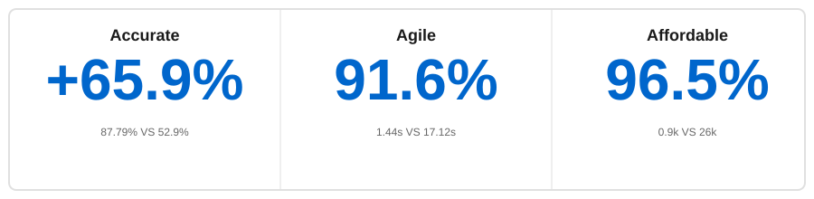

# PowerMem

**Persistent memory for AI agents and applications.**

[](https://pypi.org/project/powermem/)
[](https://pypi.org/project/powermem/)
[](LICENSE)
[](https://github.com/oceanbase/powermem)
[](https://discord.com/invite/74cF8vbNEs)

*English · [中文](README_CN.md) · [日本語](README_JP.md)*

PowerMem combines vector, full-text, and graph retrieval with LLM-driven memory extraction and Ebbinghaus-style time decay. It supports multi-agent isolation, user profiles, and multimodal signals (text, image, audio).

Use the Python SDK, CLI (`pmem`), HTTP API Server (with Dashboard), or MCP Server — all share one `.env`. See [.env.example](.env.example) and the [configuration guide](docs/guides/0003-configuration.md).

> **News:** [OpenClaw](https://github.com/openclaw-ai/openclaw) can use PowerMem as long-term memory via [`memory-powermem`](https://github.com/ob-labs/memory-powermem) (`openclaw plugins install memory-powermem`).

## Quick start

### Install

```bash
pip install powermem
```

### SDK example

```python
from powermem import Memory, auto_config

config = auto_config()
memory = Memory(config=config)

memory.add("User likes coffee", user_id="user123")

results = memory.search("user preferences", user_id="user123")
for result in results.get("results", []):
    print(f"- {result.get('memory')}")
```

More patterns: [Getting Started](docs/guides/0001-getting_started.md).

### Other entry points

| Mode | Typical commands | Docs |
|------|------------------|------|
| CLI | `pmem memory add` / `pmem memory search`; `pmem shell` | [CLI usage](docs/guides/0012-cli_usage.md) |
| HTTP + Dashboard | `powermem-server --host 0.0.0.0 --port 8000`; image `oceanbase/powermem-server:latest`; `docker-compose -f docker/docker-compose.yml` | [API Server](docs/api/0005-api_server.md) |
| MCP | `uvx powermem-mcp sse` (also stdio / streamable-http); requires `powermem` and `uv` | [MCP Server](docs/api/0004-mcp.md) |

## Benchmark (LOCOMO)

<div align="center">



</div>

Compared to stuffing full conversation context on [LOCOMO](https://github.com/snap-research/locomo):

| Dimension | Result |
|-----------|--------|
| Accuracy | 78.70% vs. 52.9% |
| Retrieval p95 latency | 1.44s vs. 17.12s |
| Tokens | ~0.9k vs. ~26k |

## Capabilities

**Interfaces and tooling** — [Python integration](docs/examples/scenario_1_basic_usage.md); [CLI](docs/guides/0012-cli_usage.md) (`pmem`); [HTTP API / Dashboard](docs/api/0005-api_server.md); [MCP](docs/api/0004-mcp.md).

**Memory pipeline and retrieval** — [Smart extraction and updates](docs/examples/scenario_2_intelligent_memory.md); [Ebbinghaus-style decay](docs/examples/scenario_8_ebbinghaus_forgetting_curve.md); [Hybrid retrieval (vector / full-text / graph)](docs/examples/scenario_2_intelligent_memory.md); [Sub stores and routing](docs/examples/scenario_6_sub_stores.md).

**Profiles and multi-agent** — [User profile](docs/examples/scenario_9_user_memory.md); [Shared / isolated memory and scopes](docs/examples/scenario_3_multi_agent.md).

**Multimodal** — [Text, image, audio](docs/examples/scenario_7_multimodal.md).

## Documentation and examples

| Resource | Link |
|----------|------|
| Getting started | [Guide](docs/guides/0001-getting_started.md) |
| Configuration | [Configuration](docs/guides/0003-configuration.md) |
| CLI | [CLI usage](docs/guides/0012-cli_usage.md) |
| Multi-agent | [Multi-Agent](docs/guides/0005-multi_agent.md) |
| Integrations | [Integrations](docs/guides/0009-integrations.md) |
| Sub stores | [Sub stores](docs/guides/0006-sub_stores.md) |
| API | [API overview](docs/api/overview.md) |
| Architecture | [Architecture](docs/architecture/overview.md) |
| Scenarios | [Examples](docs/examples/overview.md) |
| Development | [Development](docs/development/overview.md) |
| Example: LangChain | [Medical support chatbot](examples/langchain/README.md) |
| Example: LangGraph | [Customer service bot](examples/langgraph/README.md) |

## Release highlights

| Version | Date | Notes |
|---------|------|--------|
| 1.0.0 | 2026-03-16 | CLI (`pmem`): memory ops, config, backup/restore/migrate, interactive shell, completions; Web Dashboard |
| 0.5.0 | 2026-02-06 | Unified SDK/API config (pydantic-settings); OceanBase native hybrid search; memory query + list sorting; user-profile language customization |
| 0.4.0 | 2026-01-20 | Sparse vectors for hybrid retrieval; profile-based query rewriting; schema upgrade & migration tools |
| 0.3.0 | 2026-01-09 | Production HTTP API Server; Docker |
| 0.2.0 | 2025-12-16 | Advanced profiles; multimodal (text/image/audio) |
| 0.1.0 | 2025-11-14 | Core memory + hybrid retrieval; LLM extraction; forgetting curve; multi-agent; OceanBase/PostgreSQL/SQLite; graph search |

## Support

- [GitHub Issues](https://github.com/oceanbase/powermem/issues)
- [GitHub Discussions](https://github.com/oceanbase/powermem/discussions)

## License

Apache License 2.0 — see [LICENSE](LICENSE).
