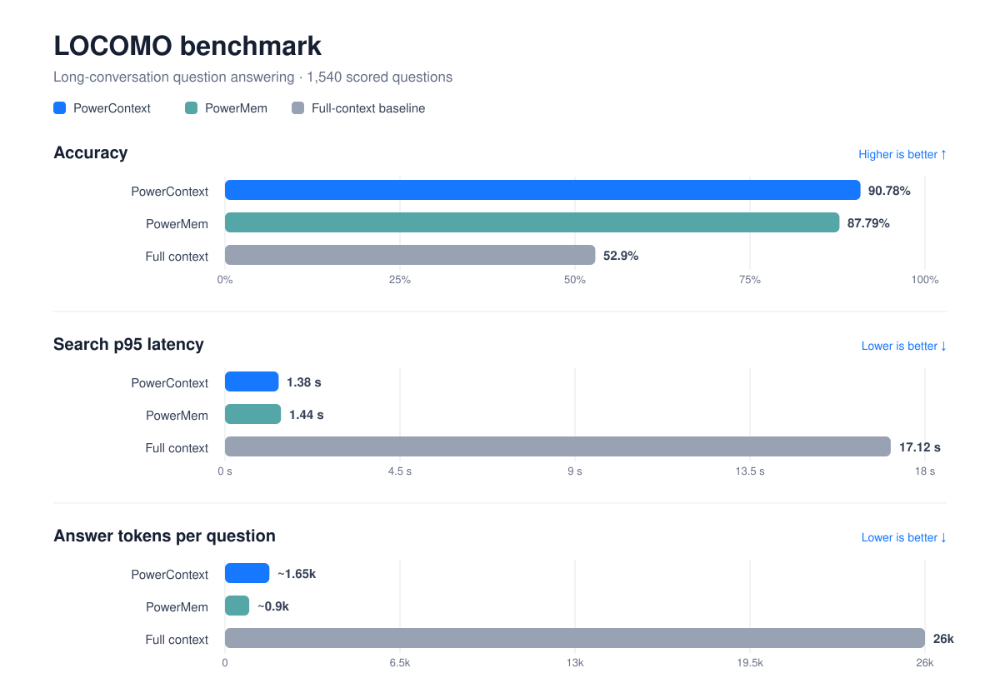
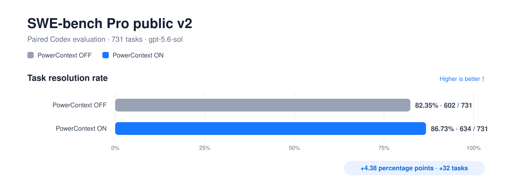

# PowerContext

**Not only memory**

[](https://pypi.org/project/powercontext/)
[](LICENSE)
[](https://discord.com/invite/74cF8vbNEs)

*[English](README.md) · [中文](README_CN.md) · [日本語](README_JP.md)*

PowerContext is the upgraded version of [PowerMem](https://www.powermem.ai/) and a context runtime for human-agent
collaboration. It turns shared work into project context that can be understood, handed off, and continued.

## Quick start

You need macOS or Linux, Python 3.11 or newer, [`uv`](https://docs.astral.sh/uv/), and at least one supported agent
host.

### 1. Install PowerContext and integrations

```bash
uv tool install "powercontext[cli,server]==0.0.2"

# Choose one or more integrations.
powercontext setup codex --source oceanbase/powercontext --ref v0.0.2
powercontext setup claude-code --source oceanbase/powercontext --ref v0.0.2
powercontext setup dsh --source oceanbase/powercontext --ref v0.0.2
powercontext setup hermes --source oceanbase/powercontext --ref v0.0.2
```

The first command installs the CLI and local Server in an isolated environment. The subsequent setup commands
install the corresponding integrations from the matching repository tag. Run setup again to refresh an existing
installation.

### 2. Start and verify the local Server

Keep the Server running in one terminal:

```bash
powercontext server run
```

In another terminal, verify the service and plugin:

```bash
powercontext doctor
powercontext doctor codex  # or: claude-code / dsh / hermes
```

By default, the Server listens on `127.0.0.1:8000`, exposes Streamable HTTP MCP at `/mcp`, and persists data in a
local SQLite database. Explicit Memory operations work without configuring an inference provider.

## Core capabilities

| Capability | Core value |
| --- | --- |
| Memory extraction and management | Explicitly record decisions, constraints, outcomes, state, and next steps worth reusing over time; with a generation model configured, Memory can also be extracted from Sources. Revisions and retirements preserve history |
| Bounded request-time recall | Before an agent handles a request, generate one schema-validated, cited `PreparedContext` based on project scope, relevance, and a byte budget; recall failures do not block the original task |
| Handoff | Organize the objective, verified progress, blockers, next step, and evidence into an inspectable work package so another session, task, model, or agent host can continue from a clear state |
| Sources and evidence lineage | Preserve the original sources of knowledge and link Memory and Artifacts with exact citations; capturing a prompt creates only a Source and does not directly turn it into Memory |
| Experience and Skill governance | A model or caller can only submit a Candidate; an immutable revision is created only after Review, and a Skill must still be exported explicitly—it cannot approve, install, or execute itself |
| Local and service deployment | Use SQLite directly for local development, choose OceanBase for team deployments, and integrate with existing systems through HTTP/OpenAPI, MCP, authentication, and OpenTelemetry |

## Benchmarks

### [LoCoMo](https://github.com/snap-research/locomo)



### [SWE-bench Pro public v2](https://github.com/scaleapi/SWE-bench_Pro-os)



The evaluation ran in a Codex environment, with both the PowerContext OFF and ON groups using the `gpt-5.6-sol`
model.

---

## Integrations

PowerContext provides official integrations and installation guides for Codex, Claude Code, DeepSeek Harness, Hermes
Agent, and Pi Coding Agent. These integrations use the same scoped data and history-preserving contracts through
PowerContext Server; the host integrations do not start or embed the Server.

### Official integrations

<table>
<tr>
<td align="center" width="120"><br /><sub><b>Codex</b></sub></td>
<td align="center" width="120"><br /><sub><b>Claude Code</b></sub></td>
<td align="center" width="120"><br /><sub><b>DeepSeek Harness</b></sub></td>
<td align="center" width="120"><a href="integrations/hermes/README.md"><br /><sub><b>Hermes Agent</b></sub></a></td>
<td align="center" width="120"><a href="docs/en/docs/how-to/configure-pi.md"><br /><sub><b>Pi Coding Agent</b></sub></a></td>
</tr>
</table>

## Development

Install the locked development environment and hooks:

```bash
make install
```

Run the main validation commands before opening a pull request:

```bash
make check
make test
make docs-test
```

After changing `openapi/powercontext.yaml`, run `make contract-test`. See [CONTRIBUTING.md](CONTRIBUTING.md) for the
complete workflow and [`docs/en/development/`](docs/en/development/core-protocol.md) for implementation guides.

## Community

Questions and feedback are welcome in [Discord](https://discord.com/invite/74cF8vbNEs). Use
[GitHub Issues](https://github.com/oceanbase/powercontext/issues) for reproducible defects and focused feature
requests.

## License

PowerContext is licensed under the [Apache License 2.0](LICENSE).
