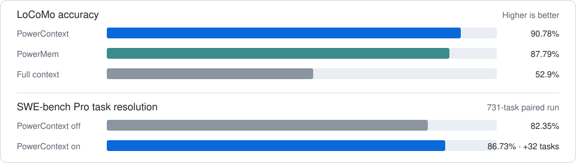

# PowerContext

Context for work that humans and agents hand off and continue.

[](https://pypi.org/project/powercontext/)
[](LICENSE)
[](https://discord.com/invite/74cF8vbNEs)

*[English](README.md) · [中文](README_CN.md) · [日本語](README_JP.md)*

Work rarely ends with whoever starts it. A person hands a task to an agent, the agent gets part of the way, and later someone else takes over. The reasoning and current state are often left behind in the earlier conversation.

PowerContext keeps that context with the work. It stores what happened, the decisions made, the current state, and what comes next. When the work changes hands, the next person or agent can understand it and continue.

## What moves with the work

```text
human or agent advances work
  -> PowerContext stores and maintains context
  -> work is handed off
  -> the next human or agent continues
  -> context changes with the work
```

Context remains available beyond any one conversation or agent. It stays scoped to the work and connected to its sources. Entries can be revised or retired without erasing their history. PowerContext maintains this context as Memory, Experience, Skills, and Handoffs.

## Works with your agents

Install the [released package](https://pypi.org/project/powercontext/):

```bash
uv tool install "powercontext[cli,server]==0.1.0"

# To use the latest unreleased code instead:
# uv tool install "powercontext[cli,server] @ git+https://github.com/oceanbase/powercontext.git@master"
```

Start a local Server in its own terminal:

```bash
powercontext server run
```

The Server stores context in a local SQLite database by default.

Then set up an agent integration. For example:

```bash
powercontext setup codex --ref v0.1.0  # --ref also accepts a Git commit, such as 55616dca.
```

Read the [documentation](docs/en/docs/index.md) for agent-specific setup and other deployment options. Supported agent clients and IDEs connect through MCP or a dedicated integration.

<table>
<tr>
<td align="center" width="120"><a href="docs/en/docs/reference/interfaces.md#http-and-mcp"></a><br /><a href="docs/en/docs/reference/interfaces.md#http-and-mcp"><sub><b>Claude Code</b></sub></a></td>
<td align="center" width="120"><a href="docs/en/docs/reference/interfaces.md#http-and-mcp"><picture><source media="(prefers-color-scheme: dark)" srcset="https://svgl.app/library/cursor_dark.svg"></picture></a><br /><a href="docs/en/docs/reference/interfaces.md#http-and-mcp"><sub><b>Cursor</b></sub></a></td>
<td align="center" width="120"><a href="docs/en/docs/reference/interfaces.md#http-and-mcp"></a><br /><a href="docs/en/docs/reference/interfaces.md#http-and-mcp"><sub><b>VS Code</b></sub></a></td>
<td align="center" width="120"><a href="docs/en/docs/tutorials/codex-quickstart.md"></a><br /><a href="docs/en/docs/tutorials/codex-quickstart.md"><sub><b>Codex</b></sub></a></td>
<td align="center" width="120"><a href="docs/en/docs/reference/interfaces.md#http-and-mcp"><picture><source media="(prefers-color-scheme: dark)" srcset="https://svgl.app/library/windsurf-dark.svg"></picture></a><br /><a href="docs/en/docs/reference/interfaces.md#http-and-mcp"><sub><b>Windsurf</b></sub></a></td>
<td align="center" width="120"><a href="docs/en/docs/reference/interfaces.md#http-and-mcp"></a><br /><a href="docs/en/docs/reference/interfaces.md#http-and-mcp"><sub><b>GitHub Copilot</b></sub></a></td>
</tr>
<tr>
<td align="center" width="120"><a href="docs/en/docs/reference/interfaces.md#http-and-mcp"></a><br /><a href="docs/en/docs/reference/interfaces.md#http-and-mcp"><sub><b>Qoder</b></sub></a></td>
<td align="center" width="120"><a href="docs/en/docs/reference/interfaces.md#http-and-mcp"><picture><source media="(prefers-color-scheme: dark)" srcset="https://svgl.app/library/opencode-dark.svg"></picture></a><br /><a href="docs/en/docs/reference/interfaces.md#http-and-mcp"><sub><b>OpenCode</b></sub></a></td>
<td align="center" width="120"><a href="docs/en/docs/reference/interfaces.md#http-and-mcp"></a><br /><a href="docs/en/docs/reference/interfaces.md#http-and-mcp"><sub><b>OpenClaw</b></sub></a></td>
<td align="center" width="120"><a href="docs/en/docs/reference/interfaces.md#http-and-mcp"></a><br /><a href="docs/en/docs/reference/interfaces.md#http-and-mcp"><sub><b>Claude Desktop</b></sub></a></td>
<td align="center" width="120"><a href="docs/en/docs/reference/interfaces.md#http-and-mcp"></a><br /><a href="docs/en/docs/reference/interfaces.md#http-and-mcp"><sub><b>Cline</b></sub></a></td>
<td></td>
</tr>
</table>

Applications can use PowerContext through the async Python client, HTTP API, MCP, or the in-process Core SDK. See the [interface reference](docs/en/docs/reference/interfaces.md) to choose an entry point.

## What changes with PowerContext



See the [methods, full results, and limitations](https://powercontext.oceanbase.io/en/benchmarks/) behind these comparisons.

## Build PowerContext

```bash
make install
make check
make test
```

See [CONTRIBUTING.md](CONTRIBUTING.md) for the complete development workflow.

## Learn more

- [Website](https://powercontext.oceanbase.io/en/)
- [Blog](https://powercontext.oceanbase.io/en/blog/)
- [Changelog](https://powercontext.oceanbase.io/en/changelog/)

PowerContext continues the work started in [PowerMem](https://www.powermem.ai/), with its focus expanded from agent memory to context that humans and agents can hand off and continue.

## License

PowerContext is licensed under the [Apache License 2.0](LICENSE).
