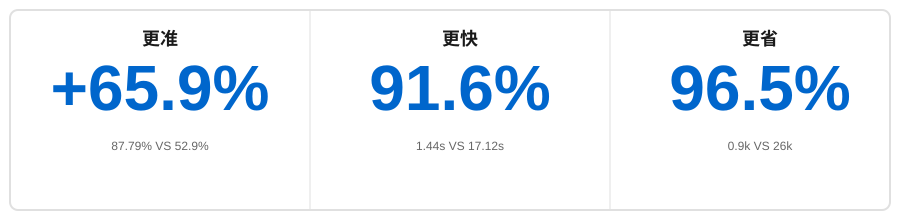

<p align="center">
    <a href="https://github.com/oceanbase/oceanbase">
        
    </a>
</p>

<p align="center">
    <a href="https://pepy.tech/project/powermem">
        
    </a>
    <a href="https://github.com/oceanbase/powermem">
        
    </a>
    <a href="https://pypi.org/project/powermem" target="blank">
        
    </a>
    <a href="https://github.com/oceanbase/powermem/blob/master/LICENSE">
        
    </a>
    <a href="https://img.shields.io/badge/python%20-3.10.0%2B-blue.svg">
        
    </a>
    <a href="https://deepwiki.com/oceanbase/powermem">
        
    </a>
    <a href="https://zread.ai/oceanbase/powermem" target="_blank"></a>
    <a href="https://discord.com/invite/74cF8vbNEs">
        
    </a>
</p>

[English](README.md) | [中文](README_CN.md) | [日本語](README_JP.md)

# PowerMem — 智能 AI 记忆系统

PowerMem 面向 AI 应用提供持久化记忆层：融合向量、全文与图检索，支持由 LLM 驱动的记忆抽取与时间衰减（艾宾浩斯曲线）、多智能体隔离与协作、用户画像以及文本/图像/音频等多模态线索。

使用 Python SDK、CLI（`pmem`）、HTTP API Server（含 Dashboard）或 MCP Server 时，共用同一套 `.env` 配置；完整选项见 [.env.example](.env.example) 与 [配置指南](docs/guides/0003-configuration.md)。

> **动态：** [OpenClaw](https://github.com/openclaw-ai/openclaw) 可通过插件 [memory-powermem](https://github.com/ob-labs/memory-powermem) 使用 PowerMem 作为长期记忆（`openclaw plugins install memory-powermem`）。

## 基准表现（LOCOMO）

<div align="center">



</div>

相对「全量上下文」基线（[LOCOMO](https://github.com/snap-research/locomo)）：

| 维度 | 结果 |
|------|------|
| 准确率 | 78.70% vs. 52.9% |
| 检索 p95 延迟 | 1.44s vs. 17.12s |
| Token 用量 | 约 0.9k vs. 26k |

## 能力概览

**接入与工程化** — [Python 快速集成](docs/examples/scenario_1_basic_usage.md)；[CLI](docs/guides/0012-cli_usage.md)（`pmem`）；[HTTP API / Dashboard](docs/api/0005-api_server.md)；[MCP](docs/api/0004-mcp.md)。

**记忆管线与检索** — [智能抽取与更新](docs/examples/scenario_2_intelligent_memory.md)；[艾宾浩斯时间衰减](docs/examples/scenario_8_ebbinghaus_forgetting_curve.md)；[混合检索（向量 / 全文 / 图）](docs/examples/scenario_2_intelligent_memory.md)；[子存储与路由](docs/examples/scenario_6_sub_stores.md)。

**用户、画像与多智能体** — [用户画像](docs/examples/scenario_9_user_memory.md)；[共享 / 隔离记忆与作用域](docs/examples/scenario_3_multi_agent.md)。

**多模态** — [文本 / 图像 / 语音](docs/examples/scenario_7_multimodal.md)。

## 快速开始

### 1. 安装

```bash
pip install powermem
```

### 2. SDK 示例

```python
from powermem import Memory, auto_config

config = auto_config()
memory = Memory(config=config)

memory.add("用户喜欢咖啡", user_id="user123")

results = memory.search("用户偏好", user_id="user123")
for result in results.get("results", []):
    print(f"- {result.get('memory')}")
```

更多用法见 [入门指南](docs/guides/0001-getting_started.md)。

### 3. 其他接入方式（命令入口）

| 方式 | 常用命令 | 文档 |
|------|----------|------|
| CLI | `pmem memory add` / `pmem memory search`；`pmem shell` | [CLI 使用指南](docs/guides/0012-cli_usage.md) |
| HTTP API + Dashboard | `powermem-server --host 0.0.0.0 --port 8000`；镜像 `oceanbase/powermem-server:latest`；`docker-compose -f docker/docker-compose.yml` | [API Server](docs/api/0005-api_server.md) |
| MCP | `uvx powermem-mcp sse`（及 stdio / streamable-http）；需已安装 `powermem` 与 `uv` | [MCP Server](docs/api/0004-mcp.md) |

## 文档与延伸

| 类型 | 链接 |
|------|------|
| 入门 | [Getting Started](docs/guides/0001-getting_started.md) |
| 配置 | [Configuration](docs/guides/0003-configuration.md) |
| CLI | [CLI 使用指南](docs/guides/0012-cli_usage.md) |
| 多智能体 | [Multi-Agent](docs/guides/0005-multi_agent.md) |
| 集成说明 | [Integrations](docs/guides/0009-integrations.md) |
| 子存储 | [Sub Stores](docs/guides/0006-sub_stores.md) |
| API | [API 总览](docs/api/overview.md) |
| 架构 | [Architecture](docs/architecture/overview.md) |
| 场景示例 | [Examples](docs/examples/overview.md) |
| 开发 | [Development](docs/development/overview.md) |
| 示例：LangChain | [医疗支持机器人](examples/langchain/README.md) |
| 示例：LangGraph | [客服机器人](examples/langgraph/README.md) |

## 版本要点

| 版本 | 发布日期 | 说明 |
|------|----------|------|
| 1.0.0 | 2026-03-16 | CLI（`pmem`）：记忆操作、配置、备份/恢复/迁移、交互式 shell、补全；Web Dashboard |
| 0.5.0 | 2026-02-06 | 统一 SDK/API Server 配置（pydantic-settings）；OceanBase native hybrid search；Memory 查询与列表排序增强；用户画像支持自定义输出语言 |
| 0.4.0 | 2026-01-20 | 稀疏向量混合检索；基于用户画像的查询改写；表结构升级与迁移工具 |
| 0.3.0 | 2026-01-09 | 生产级 HTTP API Server；Docker 支持 |
| 0.2.0 | 2025-12-16 | 用户画像增强；多模态（文本/图像/音频） |
| 0.1.0 | 2025-11-14 | 核心记忆与混合检索；LLM 抽取；遗忘曲线；Multi-Agent；OceanBase/PostgreSQL/SQLite；图搜索 |

## 支持

- **问题反馈**：[GitHub Issues](https://github.com/oceanbase/powermem/issues)
- **讨论**：[GitHub Discussions](https://github.com/oceanbase/powermem/discussions)

---

## 许可证

本项目采用 **Apache License 2.0**，详见 [LICENSE](LICENSE)。
