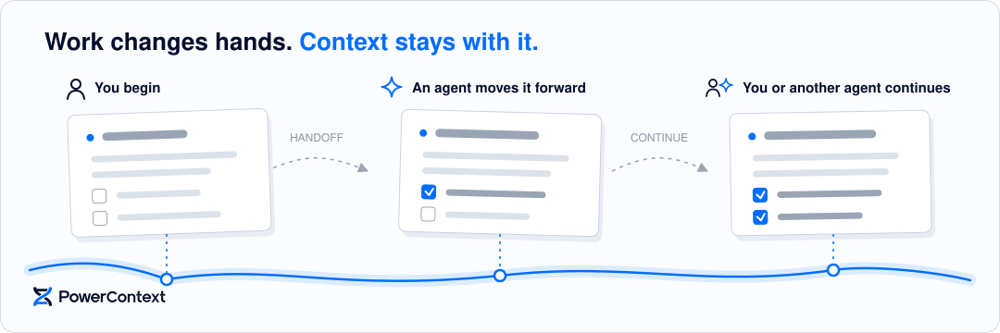

# PowerContext

人と Agent が作業を引き継ぎ、継続するためのコンテキスト。

[](https://pypi.org/project/powercontext/)
[](LICENSE)
[](https://discord.com/invite/74cF8vbNEs)

*[English](README.md) · [中文](README_CN.md) · [日本語](README_JP.md)*

作業を始めた人や Agent が、そのまま最後まで終えるとは限りません。あなたが Agent にタスクを渡し、Agent が途中まで進めた後、あなたや別の誰かが引き継ぐことがあります。そのとき、判断の理由や現在の状態は、その会話に置き去りになりがちです。

PowerContext は、そのコンテキストをあなたの作業とともに保持します。何が起きたか、なぜその判断をしたか、現在どこまで進んでいるか、次に何をするかを保存します。作業が引き継がれるとき、あなたや次の Agent は状況を理解し、そのまま続きを進められます。



[公式サイト](https://powercontext.oceanbase.io/en/) · [ドキュメントを読む](https://powercontext.oceanbase.io/en/docs/)

## 作業とともに引き継がれるもの

コンテキストは、1 回の会話や 1 つの Agent を越えて残ります。対象となる作業の範囲と情報源とのつながりを保ち、作業の変化に合わせて内容を改訂または廃止しても履歴は失われません。PowerContext は、このコンテキストを Memory、Experience、Skills、Handoffs として管理します。

## 利用中の Agent と接続する

[正式リリース版](https://pypi.org/project/powercontext/)をインストールします：

```bash
uv tool install "powercontext[cli,server]==0.1.0"

# To use the latest unreleased code instead:
# uv tool install "powercontext[cli,server] @ git+https://github.com/oceanbase/powercontext.git@master"
```

別のターミナルでローカル Server を起動します：

```bash
powercontext server run
```

Server はデフォルトで、コンテキストをローカルの SQLite データベースに保存します。

次に Agent との連携を設定します。例：

```bash
powercontext setup codex --ref v0.1.0  # --ref also accepts a Git commit, such as 55616dca.
```

その他の Agent の設定方法と導入方法は、[Agent セットアップガイド](https://powercontext.oceanbase.io/en/docs/tutorials/agent-quickstart/)を参照してください。対応する Agent クライアントと IDE は MCP または専用の連携機能で接続できます。

<table>
<tr>
<td align="center" width="120"><a href="docs/en/docs/reference/interfaces.md#http-and-mcp"></a><br /><a href="docs/en/docs/reference/interfaces.md#http-and-mcp"><sub><b>Claude Code</b></sub></a></td>
<td align="center" width="120"><a href="docs/en/docs/reference/interfaces.md#http-and-mcp"><picture><source media="(prefers-color-scheme: dark)" srcset="https://svgl.app/library/cursor_dark.svg"></picture></a><br /><a href="docs/en/docs/reference/interfaces.md#http-and-mcp"><sub><b>Cursor</b></sub></a></td>
<td align="center" width="120"><a href="docs/en/docs/reference/interfaces.md#http-and-mcp"></a><br /><a href="docs/en/docs/reference/interfaces.md#http-and-mcp"><sub><b>VS Code</b></sub></a></td>
<td align="center" width="120"><a href="docs/en/docs/tutorials/codex-quickstart.md"></a><br /><a href="docs/en/docs/tutorials/codex-quickstart.md"><sub><b>Codex</b></sub></a></td>
<td align="center" width="120"><a href="docs/en/docs/reference/interfaces.md#http-and-mcp"><picture><source media="(prefers-color-scheme: dark)" srcset="https://svgl.app/library/windsurf-dark.svg"></picture></a><br /><a href="docs/en/docs/reference/interfaces.md#http-and-mcp"><sub><b>Windsurf</b></sub></a></td>
<td align="center" width="120"><a href="docs/en/docs/reference/interfaces.md#http-and-mcp"></a><br /><a href="docs/en/docs/reference/interfaces.md#http-and-mcp"><sub><b>GitHub Copilot</b></sub></a></td>
</tr>
<tr>
<td align="center" width="120"><a href="docs/en/docs/reference/interfaces.md#http-and-mcp"></a><br /><a href="docs/en/docs/reference/interfaces.md#http-and-mcp"><sub><b>Qoder</b></sub></a></td>
<td align="center" width="120"><a href="docs/en/docs/reference/interfaces.md#http-and-mcp"><picture><source media="(prefers-color-scheme: dark)" srcset="https://svgl.app/library/opencode-dark.svg"></picture></a><br /><a href="docs/en/docs/reference/interfaces.md#http-and-mcp"><sub><b>OpenCode</b></sub></a></td>
<td align="center" width="120"><a href="docs/en/docs/reference/interfaces.md#http-and-mcp"></a><br /><a href="docs/en/docs/reference/interfaces.md#http-and-mcp"><sub><b>OpenClaw</b></sub></a></td>
<td align="center" width="120"><a href="docs/en/docs/reference/interfaces.md#http-and-mcp"></a><br /><a href="docs/en/docs/reference/interfaces.md#http-and-mcp"><sub><b>Claude Desktop</b></sub></a></td>
<td align="center" width="120"><a href="docs/en/docs/reference/interfaces.md#http-and-mcp"></a><br /><a href="docs/en/docs/reference/interfaces.md#http-and-mcp"><sub><b>Cline</b></sub></a></td>
<td></td>
</tr>
</table>

アプリケーションは、非同期 Python クライアント、HTTP API、MCP、または同一プロセス内の Core SDK から PowerContext を利用できます。入口を選ぶには[インターフェースリファレンス](https://powercontext.oceanbase.io/en/docs/reference/interfaces/)を参照してください。

## PowerContext で何が変わるか


比較に用いた評価方法、詳細な結果、適用範囲は[公式ベンチマークページ](https://powercontext.oceanbase.io/en/benchmarks/)を参照してください。

## PowerContext を開発する

```bash
make install
make check
make test
```

開発ワークフロー全体については [CONTRIBUTING.md](CONTRIBUTING.md) を参照してください。

## さらに詳しく

- [コアコンセプト](https://powercontext.oceanbase.io/en/docs/explanation/core-concepts/)
- [Memory と Handoff](https://powercontext.oceanbase.io/en/docs/explanation/memory-and-handoff/)
- [Experience と Skill のライフサイクル](https://powercontext.oceanbase.io/en/docs/explanation/experience-and-skill-lifecycle/)

PowerContext は [PowerMem](https://www.powermem.ai/) の後継プロジェクトです。

## ライセンス

PowerContext は [Apache License 2.0](LICENSE) のもとで提供されています。
