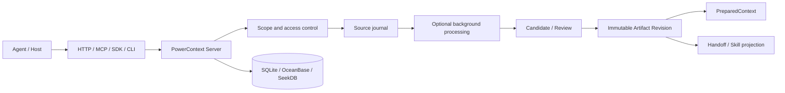

# Context management architecture and responsibilities

This page explains the responsibility of each component in context management and how evidence becomes reusable
artifacts. It is a cross-workflow architecture guide; use the individual artifact pages for concrete write, review, and
retrieval procedures.

## End-to-end flow

The complete data lifecycle is: resolve a Scope → capture a Source → process it when needed → review or commit → create
an exact immutable Revision → assemble context, transfer work, or export a host projection when needed. Availability
checks, troubleshooting, and recovery are not part of this lifecycle; see [deployment and operations](../operate/index.md).

## Component and responsibility boundaries

| Component or role | Owns | Does not own |
| --- | --- | --- |
| Agent / Host | Submits requests and decides when to save, hand off, or use context | Extra execution authority because content was recalled |
| HTTP, MCP, Python Client, and CLI | Projects different integrations onto one Server contract | An assumption that every integration exposes the same capabilities |
| PowerContext Server | Resolves Scopes, enforces access, and serves Source, Artifact, and PreparedContext APIs | User authorization decisions for the Agent |
| Runtime / background workers | Generates Memory, Experience, Skill, Profile, or Topic Memory from eligible Sources | Bypassing Candidate review or treating generated content as an execution command |
| Review / projection | Reviews Candidates or exports an exact approved Skill Revision to a host | Rewriting historical Revisions, installing, or executing a Skill automatically |
| Database and persistence layer | Stores Scopes, Sources, Artifact Revisions, and processing state | The deployment layer's backup and recovery policy |

Model generation, human review, and execution authority are separate boundaries: a model can propose content, review can
decide whether to commit an Artifact Revision, and export can create a host-local copy. `PreparedContext` is temporary
for one Agent turn, not a new Artifact.

## Content types currently supported

| Type | Purpose and current lifecycle | What happens next |
| --- | --- | --- |
| Scope | Isolates Sources, artifacts, Candidates, and runtime state while carrying access policy | Resolve a Scope before every content operation |
| Source | Stores captured evidence or references to external material | Read explicitly, or process asynchronously through a configured pipeline |
| Memory | Stores facts, decisions, constraints, state, and next steps; `retire` removes active recall but preserves history | Write explicitly or extract from Sources, then retrieve |
| Experience | Records a reusable situation, action, outcome, and lesson | proposal → Candidate → review → approved Revision → PreparedContext recall |
| Skill | Stores an exportable name, description, instructions, validation checks, and lineage | proposal → Candidate → review → exact export to a host |
| Profile | Stores stable Scope background and subject information | Generate from subject Sources or policy, then review, replace, or roll back by appending a Revision |
| Topic Memory | Incrementally derives topic summaries from long-running Sources with progressive detail | Request `flush`, search current heads, then `get` an exact Revision |
| Handoff | Records task boundaries, transfers, and milestones | prepare → optional commit → receiver acknowledgement / outcome |
| Prompt | Scope-level operational prompt configuration, not factual evidence and not ordinary recall | Manage with `scope.admin` access |
| Tag | Filterable metadata for Memory, Experience, Skill, and Handoff | Manage through tag APIs; it is not an Artifact family |

The code enum for write-capable Artifact families is `memory`, `experience`, `skill`, `handoff`, `profile`, and `prompt`.
Artifact reads also expose the specialized `topic-memory` family. Topic Memory currently has no generic create, update,
delete, or retire API.

## Current data governance and recovery boundary

The implementation currently provides these consistency and boundary controls:

- Scope-level access control, plus `expected_version` and ETag / `If-Match` concurrency protection on writes;
- immutable Artifact Revisions and exact references, Memory `retire`, and Profile replacement or rollback by appending a Revision;
- isolation between pending, approved, and rejected Candidates so unreviewed content does not enter Artifact retrieval or
  `PreparedContext`.

There is no generic user-level Artifact delete, TTL/retention policy, export/import, or one-click Scope restore API today;
Topic Memory also has no manual delete endpoint. Operators can back up the database or data directory using the [Server
deployment backup principles](../operate/deploy-server.md), then restore or migrate it using [troubleshooting and
migration](../operate/troubleshoot.md). Those are operational responsibilities and should stay outside the context
management data lifecycle.

