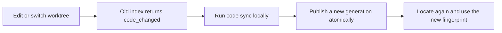

# Understand the current Git repository

Memory retains past decisions and constraints. Code queries provide definitions, relationships, and source evidence
from the current worktree. Together they help an Agent connect the reasons behind a decision with its present implementation.
The index is a rebuildable local cache. Functions do not become Memory, Source, or Artifact records.
Embedded seekdb deployments store code graphs in dedicated tables in their local database; other deployments use a separate SQLite cache.

The capability is disabled by default. Structural analysis supports UTF-8 Python, TypeScript/JavaScript (including TSX/JSX), and Go through Tree-sitter and conservative
repository reference resolution. It requires no generation model, embeddings, Node.js, or CodeGraph service.
Dynamic dispatch, reflection, framework-generated calls, and unsupported syntax can remain unknown.
A `candidate` relationship is a lead, not proof of a runtime call.
Local indexing is verified on Linux and requires POSIX file locks, process resource limits, and SQLite FTS5 or embedded seekdb full-text search.
Clients on other systems can use the HTTP service; local indexing on macOS and Windows has not been validated.

## Language coverage

One Scope can bind a repository containing Python, TypeScript/JavaScript, and Go together, using one index.
File extensions select the grammar: JSX uses the JavaScript grammar, while TSX uses its own grammar.

| Language | Files | Structure and static relationships |
| --- | --- | --- |
| Python | `.py`, `.pyi` | Classes, functions, methods, lexical scope, explicit imports/aliases, relative imports, and static re-exports |
| JavaScript / TypeScript | `.js`, `.jsx`, `.mjs`, `.cjs`, `.ts`, `.tsx`, `.mts`, `.cts` | Functions, arrow functions, classes and methods; TS interfaces, types and enums; relative ESM imports, named/default exports, aliases and named re-exports |
| Go | `.go`, module identity from `go.mod` | Functions, methods, structs, interfaces and types; cross-file calls within a package and explicit package imports/aliases within the current module |

All languages share source hashes, index generations, query budgets, and `prepare_context`. Evidence includes
`language`; `coverage.languages` reports per-language `ok`, `partial`, and `failed` file counts. Discovery alone does
not imply successful structural extraction. JS/TS `.test`, `.spec`, and `__tests__` files and Go `_test.go` files
participate in test discovery; filename matches always remain `candidate` results.

JS/TS resolution excludes CommonJS module relationships, package exports maps, tsconfig path aliases, wildcard
re-exports, inheritance dispatch, and type inference. Go does not execute the toolchain or resolve workspace/replace
dependencies, interface dispatch, or receiver types. Files with Go build constraints remain searchable, but their
relationships become candidates without selecting the current machine's build target. Dynamic receivers, parameter
shadowing, and non-unique bindings cannot establish definite calls; candidate/unresolved reasons remain in index
diagnostics. Mixed-language search does not infer HTTP, RPC, or FFI calls between Python, JS/TS, and Go.
Other eligible text files retain file navigation and source reads.

## Configure and build

For a source checkout, run `uv sync --extra code`; packaged deployments need `powercontext[server,cli,code]`.
Create a Scope with the appropriate access controls, then have the Server operator bind it to a local Git root.
Use separate Scope bindings for separate worktrees. HTTP callers cannot submit arbitrary server directories.

Set this JSON in the Server environment file, replacing the Scope and absolute paths:

```dotenv
POWERCONTEXT_SERVER_CODE='{"enabled":true,"cache_dir":"/srv/powercontext/code-cache","repositories":{"scp_demo":{"root":"/srv/git/project","source_roots":["src","."]}}}'
```

For embedded seekdb, install `powercontext[server,cli,code,seekdb]` (or run `uv sync --extra code --extra seekdb`)
and select the embedded database in the same environment file:

```dotenv
POWERCONTEXT_SERVER_DATABASE='{"kind":"seekdb","path":"/srv/powercontext/seekdb"}'
```

Code storage follows this database selection. seekdb uses `pc_code_generations`, `pc_code_nodes`, and
`pc_code_edges`, with a native full-text index on node search text. Source snapshots, extraction facts, diagnostics,
and the atomic current-version pointer remain under `cache_dir`. Keep both the database and cache on this host;
sharing the database alone does not make the code index available to another service instance.

The `seekdb` extra requires `pylibseekdb>=1.4.0.post1`. The CLI and Server can open the same embedded directory locally,
so the commands below also work while the Server is running. Use the same environment file and cache path for both.
Each operation releases its database connections before its embedded handle closes. Changing the backend or database
path selects a separate cache binding; build a new index after changing either. Existing SQLite files are not migrated.

New graph rows are committed before the local version pointer is published. Interrupted builds leave the previously
published version available; sync retries and clear reclaim unreferenced versions after active readers finish.
Checksums cover persisted graph content and local source evidence. Exact path and symbol matches take priority;
full-text rankings can differ between SQLite and seekdb. The cache byte limit counts local files plus serialized
seekdb graph rows; seekdb's engine files, transaction logs, indexes, and reserved disk space are additional storage.

Keep the cache outside the repository. By default, capture includes tracked files and excludes common credential filenames, symlinks,
binary files, and build output. Add `"include_untracked": true` to the binding to include untracked files while respecting
Git ignore rules. `exclude` accepts repository-relative globs. `source_roots` affects Python import resolution without widening file access.

```bash
powercontext code index --scope scp_demo --env-file /srv/powercontext/server.env
powercontext code status --scope scp_demo --env-file /srv/powercontext/server.env
```

`index` rebuilds everything. `sync` reuses unchanged syntax facts and resolves all references again.
A successful build publishes an immutable generation atomically; existing readers can finish while another build runs.
Coverage and diagnostics expose omitted files and parse failures.

## Query and cite evidence

Save this request as `code-query.json`:

```json
{"operation":{"kind":"explore","query":"prepare_context"},"max_bytes":16000}
```

```bash
powercontext code query --scope scp_demo --request-file code-query.json --env-file /srv/powercontext/server.env
```

The same request works with `POST /v1/scopes/{scope_id}/code/query`, Python Client `query_code`, Runtime
`code.for_scope(scope_id).query(...)`, and the PowerContext MCP `query_code` tool.
The MCP `operation` argument must be a JSON object. Indexing and synchronization remain local maintenance commands.

| Operation | Purpose |
| --- | --- |
| `status` | Check availability, build state, and freshness |
| `map` | Browse files by directory |
| `symbols` / `explore` | Locate symbols or collect a few definitions and direct relationships for a question |
| `callers` / `callees` | Follow calls from a previously located symbol |
| `impact` / `affected_tests` | Inspect possible effects and candidate tests with relationship evidence |
| `read` | Read a source range using its path and file hash |
| `changes` / `impact_changes` | Compare adjacent generations, including the graph before a deletion |

Relationship queries and source reads require `expected_fingerprint` from a previous lookup.
`read` also requires `path`, `file_sha256`, `start_line`, and `end_line`; line numbers are one-based and inclusive.
Keep the fingerprint, path, file hash, line range, and snippet hash when citing evidence.
See the [HTTP API](../develop/http-api.md) for complete request schemas.

The successful query JSON body is bounded by `max_bytes`: 16000 by default, configurable from 512 to 32768.
Traversal or output limits produce `partial` results. A missing static test relationship does not prove that a test can safely be skipped.

## Refresh after repository changes



```bash
powercontext code sync --scope scp_demo --env-file /srv/powercontext/server.env
```

Queries verify actual file content before and after retrieval. An unchanged HEAD, mtime, or file size is insufficient.
A mismatch returns `409 code_changed` instead of combining old relationships with new source.
Queries never start an implicit build. Synchronization handles additions, deletions, renames, and rebinding unchanged callers.

For deletion analysis, retain the previous fingerprint before synchronization and pass both fingerprints to `impact_changes` afterward.
Only adjacent compatible generations are available. Missing history, branch switches, or incompatible baselines return `baseline_unavailable`.
Corruption is reported as unavailable; `sync` can repair the cache, and `index` can rebuild it completely.

## Cache maintenance and diagnostics

Operators can clear the cache for the currently configured binding:

```bash
powercontext code clear --scope scp_demo --env-file /srv/powercontext/server.env
```

The command unpublishes the current generation and collects generations without active readers. Other Scope caches are unaffected.
`retained_reader_generations` counts generations still held by readers; another `clear` or a later build collects them after readers exit.
Run `index` or `sync` before querying again. Clear a binding before removing its deployment configuration.

Server tracing records `code.query`, `code.verify`, `code.search`, `code.traverse`, and rendering stages.
Local build DEBUG diagnostics also include capture, extraction, resolution, storage, publication, cache bytes, and coverage.
Attributes contain timings, counts, statuses, and stable reasons, without query text, source text, or absolute paths.
RSS fields are process-lifetime high-water marks, reported separately for the parent and reaped children; do not add them as a request peak.
Path-filtered graph queries report omitted adjacency through `coverage.path_boundary_edges`, without exposing those targets or their source.

## Optional automatic context

`prepare_context` does not query code by default. Set `"include_code": true` to run one `explore` query and assemble its candidates.
PreparedContext retains its existing four-field response. Code citations are transient evidence, separate from Artifact references.

- Omitted `assembly` retains the existing Memory, Experience, and Topic Memory selection.
- Explicit `assembly: {}` retains its defaults of six Memory and two Experience entries.
- `assembly: {"sections": []}` with `include_code: true` delivers code only.

Code contributes at most four entries. When historical categories are selected, code receives at most half the total
entry and byte budgets; unused capacity returns to history. Disabled, missing, stale, or unavailable code leaves the full
budget available to history. If neither source has content, the result remains `empty`.
Source text is rendered as untrusted data, and citations and boundaries count toward the content byte budget.

The Codex and Claude Code recall hooks opt in separately:

```dotenv
POWERCONTEXT_CODEX_INCLUDE_CODE=true
POWERCONTEXT_CODEX_REQUEST_TIMEOUT_SECONDS=6
POWERCONTEXT_CODEX_HTTP_BUDGET_SECONDS=8
POWERCONTEXT_CLAUDE_INCLUDE_CODE=true
POWERCONTEXT_CLAUDE_REQUEST_TIMEOUT_SECONDS=6
POWERCONTEXT_CLAUDE_HTTP_BUDGET_SECONDS=8
```

Hooks default to a three-second request timeout and a six-second HTTP budget; code queries on larger repositories can exceed that request timeout.
The example allows room for the default five-second code-query limit and leaves process overhead within the plugins' ten-second Hook deadline.
The total budget also covers Scope resolution and other HTTP operations. Verify it against deployment latency; an earlier network or host timeout can prevent delivery of the entire context.

Server addresses, Scope bindings, and authentication still follow the host's installation configuration.
Codex reads the address from the installed plugin's `.mcp.json`.
Enable the relevant host setting and verify actual injection. Evaluate on-demand code queries separately from automatic
context; a successful index build alone does not demonstrate better Agent repairs.
