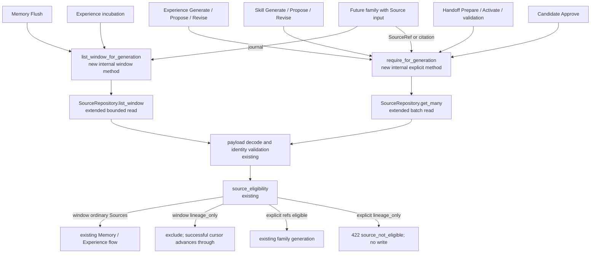

- Proposal Name: `artifact_generation_source_access`
- Start Date: 2026-09-04
- RFC PR: [oceanbase/powercontext#0000](https://github.com/oceanbase/powercontext/pull/0000)
- Related RFC: [RFC 1437: Source and Artifact REST APIs](1437_source_artifact_rest_api.md)

# Summary

This RFC standardizes every internal read that uses a Source as Artifact generation evidence. Memory, Experience,
Skill, Handoff, Candidate review, and future generation consumers must not independently combine
`SourceRepository` reads with eligibility checks. A small Source-owned facade performs the read, strict payload
decode, stored identity validation, and the existing `source_eligibility` policy as one operation.

The facade exposes two semantics. Explicit SourceRef resolution rejects the complete operation when any referenced
Source is `lineage_only`. Journal-window resolution excludes valid `lineage_only` Sources but preserves the original
`through` boundary so that a successful consumer can advance its cursor. These semantics remain separate because
silently removing caller-selected evidence is invalid while skipping an internal journal record is necessary to
avoid a permanently blocked cursor.

This RFC adds no HTTP endpoint, Source type, public role, persistence column, table, or index. It reuses the
`payload.internal` data defined by RFC 1437, the existing `source_eligibility` policy, `SourceRepository`,
`StoredSource`, `SourceRef`, and `SourceWindowTrigger`.

# Motivation

RFC 1437 records every foundational Artifact Create and Replace command as a system Content Source bound to the
new exact Revision. That Source has `internal.role=lineage_only`: it is durable provenance for its bound Revision,
not input that should be consumed again by Memory extraction or another Artifact generator.

The current implementation already writes these Sources and performs some eligibility checks, but Source access is
distributed:

| Flow | Current access | Divergence to remove |
| --- | --- | --- |
| Memory Flush | `list(after)` followed by in-memory upper-bound and eligibility filtering | SQL read is not bounded by `through`. |
| Experience incubation | `list(after, limit)` followed by eligibility and task-outcome filtering | Window implementation differs from Memory. |
| Experience/Skill generation | One `get` per SourceRef, then `require_source_eligible` | N+1 reads and optional caller-side admission. |
| Candidate Propose/Revise | One `get` per SourceRef, then eligibility | Access policy is duplicated in review code. |
| Handoff Prepare/Activate | One `get` per citation or boundary Source | No common batch resolver. |
| Candidate Approve | Persistence ultimately sees stored SourceRefs | No explicit generation recheck at the commit boundary. |

If a family owns `SourceRepository`, a new or overlooked path can fetch a Source without applying eligibility. The
facade is therefore necessary to make fetch and admission indivisible for generation consumers. It is an internal
implementation boundary, not a new domain concept or public protocol.

# Guide-level explanation

## Two generation read shapes

| Shape | Consumers | Input | `lineage_only` behavior |
| --- | --- | --- | --- |
| Explicit SourceRef | Experience, Skill, Handoff, Candidate | Request, citation, or persisted Candidate refs | Reject the whole operation. |
| Source journal window | Memory Flush, Experience incubation | Fixed `(after, through]` selected by a cursor | Exclude it; on success still advance through the complete window. |

The example name `GenerationSourceAccess` identifies one lightweight internal facade. Its concrete Python name is
not a public contract.

```python
class GenerationSourceAccess(Protocol):
    async def require_for_generation(
        self,
        scope_id: str,
        refs: Sequence[SourceRef],
    ) -> tuple[StoredSource, ...]: ...

    async def list_window_for_generation(
        self,
        scope_id: str,
        *,
        after: int,
        through: int,
    ) -> tuple[StoredSource, ...]: ...
```

The methods share Repository decoding and eligibility code but preserve distinct contracts. A single method with a
`reject|skip` mode would admit invalid parameter combinations and could silently filter caller-selected evidence.

## Artifact generation call chain



No node is a new HTTP API. `require_for_generation` and `list_window_for_generation` are facade methods;
`get_many` and `list_window` extend the existing Repository.

## Scope

This RFC covers Memory Flush; Experience incubation, Generate, Propose, and Revise; Skill Generate, Propose, and
Revise; Handoff Prepare, Activate, and pre-commit citation validation; Candidate Approve; and every future
generation flow that accepts SourceRefs, Source citations, or a Source journal window.

It does not cover public Source Create/Get, foundational Artifact Create/Replace and family management writes,
ArtifactRepository target-binding validation, runtime `Sources.get/list/entries`, ingestion, connectors, Source
catalogs, Recall token measurement, publication, or generation that consumes only ArtifactRefs.

# Reference-level explanation

## Existing data and policy

Eligibility is decoded from the optional server-owned `pc_sources.payload.internal` value defined by RFC 1437:

```text
internal absent or null                     -> ordinary Source; family rules may consume it
internal.role == lineage_only              -> never generation evidence
unknown internal structure/role/operation  -> invalid stored payload; fail closed
```

An ordinary Source does not persist `role=evidence`. This RFC neither adds nor extends `role`, `operation`, or
`target`. Generation rejects every valid `lineage_only` Source without using operation or target as an exception.
ArtifactRepository separately uses the exact target to protect lineage persistence.

To avoid coupling future families to the Source payload schema, RFC 1437 implementations should reuse Artifact's
existing family string rules for `target.family` rather than encode the current families as a closed Source-payload
enum.

## Repository extensions

`SourceRepository` adds bounded operations equivalent to:

```python
async def get_many(
    connection: AsyncConnection,
    scope_id: str,
    refs: Sequence[SourceRef],
) -> tuple[StoredSource, ...]: ...

async def list_window(
    connection: AsyncConnection,
    scope_id: str,
    *,
    after: int,
    through: int,
) -> tuple[StoredSource, ...]: ...
```

`get_many` uses one set query or bounded chunks, detects missing and duplicate results, and restores deduplicated
request order. `list_window` applies Scope, both bounds, and stable journal order in SQL. Both retain existing adapter
selection, strict payload decode, and stored identity validation.

## Explicit SourceRef resolution

`require_for_generation` obtains Scope from the authenticated operation, enforces existing reference limits,
deduplicates while preserving first occurrence order, and resolves the complete set with `get_many`. Missing,
cross-Scope, or invisible refs use the operation's existing non-disclosing evidence error. Invalid stored data is an
internal error. Only after all refs are visible and decoded does it apply eligibility. Any `lineage_only` Source
rejects the whole operation; no partial result is returned.

Visibility precedes eligibility so traversal order cannot disclose whether another submitted ref exists in a
different Scope. Error details may echo only a caller-submitted SourceRef, never content, `internal`, operation, or
target.

## Journal-window resolution

`list_window_for_generation` receives `(after, through]` from the existing `SourceWindowTrigger`, reads exactly that
interval in journal order, decodes every row, and excludes valid `lineage_only` Sources. Cursor persistence remains
with the consumer.

If the subset is empty, the consumer does not invoke a model or create an Artifact/Candidate; it commits a no-op
cursor transition to `through`. A model, write, cursor CAS, or payload decode failure leaves the cursor unchanged.
A damaged payload is not a valid `lineage_only` record and must never be skipped.

## Existing and future consumers

| Consumer shape | Required behavior |
| --- | --- |
| Memory or Experience journal consumer | Use only the common window method. |
| Experience/Skill request with SourceRefs | Use the common explicit method before generation. |
| Handoff Source citation or boundary Source | Batch/deduplicate refs through the common explicit method. |
| Candidate containing SourceRefs | Check on Propose/Revise and again in the Approve transaction. |
| Future family consuming a Source journal | Reuse the window method; no third cursor/filtering policy. |
| Future family accepting SourceRef/citation | Reuse the explicit method; no direct Repository injection. |
| Flow consuming only ArtifactRefs | Do not read Source. |
| Foundational Create/Get/List/Replace | Management access; not a generation read. |

The Runtime composition root supplies the facade instead of `SourceRepository` to generation services. Tests
verify observable behavior and reusable family conformance without freezing import graphs or private call order.

## Transaction and persistence boundary

Candidate Approve binds the facade to its commit connection and performs one eligibility recheck before committing
an Artifact and approving the Candidate. A failure changes neither state.

ArtifactRepository may continue reading Source for target-binding and lineage integrity. This is not another
generation path: it permits `lineage_only` only at its bound Revision. Public reads, management writes, Recall,
publication, ingestion, connectors, and runtime Source catalogs retain independent non-generation access.

No schema changes are required. This RFC continues using `pc_sources`, `pc_source_journal_heads`,
`pc_source_cursors`, and `pc_artifact_lineage_sources` without changing their structure.

## Errors and security

| Scenario | Result | Side effects |
| --- | --- | --- |
| All refs visible; one is `lineage_only` | `422 source_not_eligible` | No model call or Candidate/Artifact write. |
| Missing, cross-Scope, or invisible ref | Existing operation-specific non-disclosing error | No partial result. |
| Window contains valid `lineage_only` | Eligible subset or no-op | On success, advance through the complete window. |
| Explicit/window read encounters damaged payload | `500 internal_error` | Fail completely; do not advance a cursor. |

The public message is neutral: `The Source cannot be used as Artifact generation evidence.` Details contain at most
the submitted SourceRef. Logs, metrics, and traces do not record Source content, internal target, or full payloads.
No Source endpoint or success schema changes. Existing generation HTTP operations document the 422 error.

## Compatibility and migration

This consolidates partially implemented behavior:

1. add `SourceRepository.get_many` and `list_window`;
2. add the lightweight facade over those operations and existing eligibility;
3. migrate Experience, Skill, and Handoff explicit references;
4. migrate Candidate Propose/Revise and recheck in Approve's transaction;
5. migrate Memory and Experience to the same bounded window implementation;
6. remove SourceRepository constructor dependencies from generation consumers; and
7. retain independent Repository access for public, management, integrity, and other non-generation reads.

Historical Sources with absent/null `internal` remain ordinary. Existing public contracts do not change. Historical
Candidates containing an ineligible Source fail approval without silently deleting evidence.

## Validation

Observable tests cover explicit Experience/Skill rejection, Handoff citation and boundary rejection, atomic
Candidate approval, mixed and all-filtered windows, damaged payload retry behavior, deduplicated request order,
non-disclosure for mixed invisible/ineligible refs, SQL `(after, through]` bounds, non-generation reads, reusable
future-family conformance, and matching SQLite/OceanBase behavior.

# Drawbacks

- The internal call chain gains a facade and SourceRepository gains two methods.
- Existing Memory, Experience, Skill, Handoff, and Candidate paths must migrate.
- Eligibility still requires decoding the existing optional payload field and is not indexed.
- Generate/Propose and Approve intentionally read immutable Sources more than once.
- Python cannot prevent every future direct Repository import; composition wiring, conformance tests, and review
  maintain the boundary.

# Rationale and alternatives

The facade makes fetch and admission indivisible without creating a Source model, transport, or persistence
concept. A single method with mode flags was rejected because explicit refs and windows differ in input, ordering,
failure, and cursor semantics. Per-family filtering recreates policy drift. SQL-only filtering cannot strictly decode
the typed payload. A database column has no measured justification.

# Prior art

PowerContext already has SourceRepository decoding, `source_eligibility`, SourceWindowTrigger, independent Memory
and Experience cursors, ReviewedGenerationService, RelationalHandoffEvidenceResolver, and ArtifactRepository batch
reads. This RFC composes those capabilities.

# Unresolved questions

There are no blocking semantic questions. The implementation may choose another private facade name while
preserving both methods and all observable behavior.

# Future possibilities

Future internal Source purposes require a separate RFC and fail closed until supported. Future Artifact families
reuse these two read semantics without adding a role, Source type, column, or third access mode. An eligibility index
or materialized column should be considered only after measured cost exceeds an operational budget.
