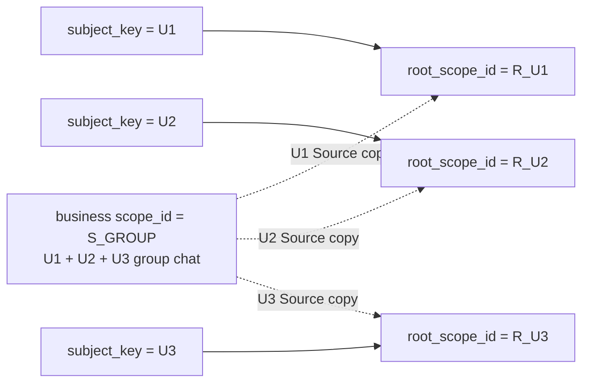
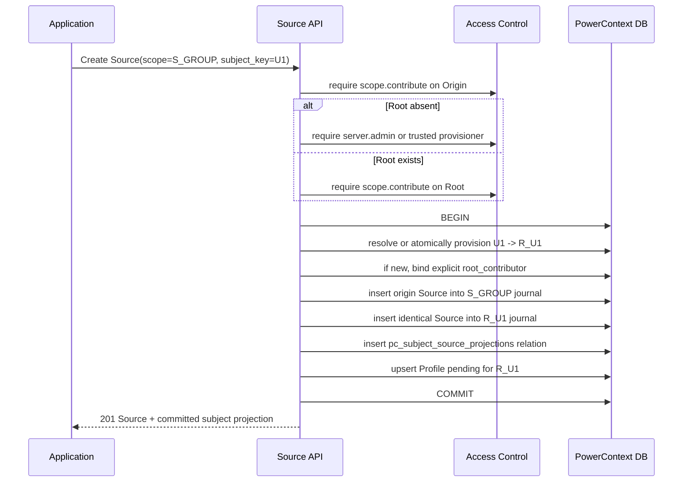
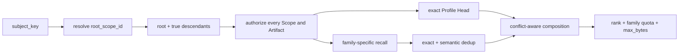
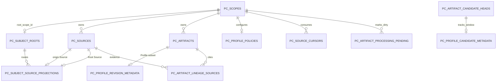

- Proposal Name: `profile_artifact`
- Start Date: 2026-09-07
- RFC PR: [oceanbase/powercontext#0000](https://github.com/oceanbase/powercontext/pull/0000)
- Related RFCs: [RFC 0014](0014_memory_layer_design.md), [RFC 0019](0019_local_source_memory_runtime.md),
  [RFC 0050](0050_artifact_candidate_review_inbox.md), [Topic Memory RFC](0000_topic_memory.md),
  [RFC 1345](1345_scope_organization_and_agent_integration.md),
  [RFC 1396](1396_handoff_access_control.md), and [RFC 1437](1437_source_artifact_rest_api.md)

# Summary

This RFC adds the `profile` Artifact Family to PowerContext. The first release defines only one fixed user Profile; it
does not expose a profile-type field, other Profile types, or a Profile Schema Registry.

A Profile is a rebuildable, Source-derived complete snapshot, not a source of truth. A user Profile has a fixed address:

```text
Head identity:
(root_scope_id, family="profile", artifact_id="profile:user")

Exact revision identity:
(root_scope_id, family="profile", artifact_id="profile:user", revision)
```

`subject_key` is the business `user_id` supplied directly by the caller when creating a Source. PowerContext does not
generate another user identifier or interpret, concatenate, or normalize this value. The name `subject_key` allows the
`subject_key -> root_scope_id` subject-addressing and Source-projection mechanism to be reused by other Artifact Families
in the future; the first release still fixes the subject to a user.

Scope organization uses one design:

- each `subject_key` maps one-to-one to a user Root Scope;
- a shared business Scope is not attached beneath any user's Root;
- a Source with a `subject_key` is written in one transaction to both the business Scope and that user's Root Scope, for
  exactly two persisted Source records;
- the Profile Processor consumes only the Source journal in a Root Scope, so one user never triggers another user's
  Profile processing;
- an ordinary Scope without a `subject_key` may still explicitly enable a Scope-local Profile.

Profile content is not split into Claim categories, Claim rows, or risk levels. The LLM produces complete Markdown,
stored as `ProfileContent.content` in the existing `pc_artifacts.content` BLOB. Automatic generation runs daily at
`02:00` by default in the deployment's configured IANA time zone, which defaults to `Asia/Shanghai`; callers may change
the Cron expression and time zone or request immediate generation.

# Motivation

User-facing Agents need to apply one long-lived Profile across sessions, tasks, and business Scopes. Generating a
Profile only inside each original business Scope creates multiple Profiles for the same user. Adding a generic
`user_id` column to every Source and Artifact would instead conflate storage ownership, content subject, content author,
and authorization principal.

Multi-party conversations make this distinction clearer. One group-chat Scope can contain messages from U1, U2, and
U3, but `pc_scopes.parent_scope_id` has only one value: the group Scope cannot simultaneously be a child of all three
user Roots. The correct design preserves the group Scope's original organization, copies each user's own Sources
precisely into that user's Root, and generates the user Profile in the Root.

This design keeps general-purpose Source, Scope, and Artifact as the fact and artifact infrastructure, while adding a
narrow convenience layer for subject routing. The integrating application remains responsible for deciding how
business users, conversations, and Sources correspond. PowerContext provides stable Root resolution, reliable
dual-Scope Source writes, background Profile generation, and Revision maintenance.

## Goals

1. Add the `profile` Artifact Family while reusing the existing internal Artifact record, Head, Revision, Lineage, and
   CAS semantics. The first release does not add Profile to the generic Artifact Create/Replace request unions.
2. Support only a fixed user Profile in the first release; do not design profile-type extension, Claim categories, or a
   per-Claim risk model.
3. Use the caller's business `user_id` as `subject_key` and establish an immutable one-to-one
   `subject_key <-> root_scope_id` mapping.
4. Support Sources from different users in a shared Scope, while ensuring that a new Source from one user advances only
   that user's Root journal.
5. Persist a Source with a `subject_key` exactly twice: once in the original business Scope and once in the corresponding
   user Root.
6. Generate Profiles in the background at `02:00` daily by default, with configurable Cron and time zone, without making
   the business Source write path wait for an LLM.
7. Store complete Markdown Profiles in the existing `pc_artifacts.content` BLOB, without adding a Claim table or Profile
   content columns.
8. Activate revisions automatically by default, while allowing an entire Revision to enter Review according to its
   Profile Scope policy.
9. Support manual creation, replacement, review, history inspection, diffing, and non-destructive rollback.
10. Specify every new table and API, all uses of existing tables, and all changes to existing APIs.
11. Allow future Artifact Families to reuse Subject Root and Root-local Sources, without implementing other subject
    types or other artifact derivation in the first release.

## Non-goals

The first release explicitly excludes:

- other Profile types such as `team`, `agent`, `customer`, or `driver`;
- custom Profile types, subject types, Profile Schema registration, or arbitrary Claim Schemas;
- user registration, authentication, account aliases, anonymous-to-registered conversion, account merging, or user-ID
  generation;
- guessing from natural language which user owns a Source;
- binding one Source to multiple `subject_key` values;
- adding a generic `subject_key` column to `pc_sources` or `pc_artifacts`;
- accepting `family="profile"` through the generic Artifact Create or Replace endpoints in the first release;
- automatically attaching a shared business Scope beneath a user Root, or treating Scope Parent as authorization;
- automatically copying existing Memory, Skill, Experience, Topic Memory, or other Artifacts from a shared Scope;
- automatically rebuilding a Profile because the model, prompt, or implementation version changed when no new Source
  exists;
- a general deletion, withdrawal, and forgetting protocol for every Source and Artifact Family; however, the minimum
  consistent-cleanup semantics for the Origin/Root duplicate must be decided before this RFC merges;
- implementing the complete subject-derived lifecycle for Artifact Families other than Profile.

# Guide-level explanation

## Terminology and invariants

| Term | Meaning |
| --- | --- |
| `subject_key` | The business `user_id` supplied directly by the caller; it denotes only a user subject in the first release |
| `root_scope_id` | An ordinary `pc_scopes.scope_id` that PowerContext creates for a `subject_key`, serving as the stable storage anchor for that user's long-lived artifacts |
| Business Scope | A Scope organized by a conversation, group chat, project, or application; it may contain Sources from multiple users |
| Root Source | The same Source copied from a business Scope into a user Root; its content is identical to the origin Source |
| Scope-local Profile | A local Profile generated directly from the Sources of an ordinary Scope without using `subject_key` |
| Profile Head | The current Profile Revision at the fixed `artifact_id` within a Scope |

The following invariants must hold:

```text
one subject_key -> exactly one root_scope_id
one root_scope_id -> at most one subject_key

one subject-keyed Source -> one origin Source + one Root Source
one origin Source -> at most one subject_key

one user Root -> at most one Profile Head
```

`subject_key` answers "which user subject's data should this Source enter?" It is not equivalent to:

- who is currently signed in;
- who owns the underlying resource;
- which users are mentioned in the content;
- who is authorized to read the Root;
- the general unique key of a Source or Artifact.

The caller must ensure that `subject_key` is unique, stable, and never reused within one PowerContext deployment and
database. PowerContext performs a case-sensitive, byte-exact comparison of the complete string. Callers should use an
internal user ID, not a directly identifying value such as a name, phone number, email address, or government ID.

## Scope organization

### Group chat example: exactly four Scopes

When group chat G1 contains users U1, U2, and U3, there are exactly four Scopes:



| Scope | Purpose | `parent_scope_id` |
| --- | --- | --- |
| `R_U1` | U1's Root Sources, Profile, and future user-level artifacts | `NULL` |
| `R_U2` | U2's Root Sources, Profile, and future user-level artifacts | `NULL` |
| `R_U3` | U3's Root Sources, Profile, and future user-level artifacts | `NULL` |
| `S_GROUP` | Stores the complete original group-chat record | Preserves the business-defined parent; does not point to `R_U1/R_U2/R_U3` |

The dashed lines represent Source projections, not `parent_scope_id` or `pc_scope_context_references`. This RFC does not
automatically write a Scope Parent or Context Reference because a user participates in a group chat.

### What a Root Scope records

A Root Scope is itself an ordinary `pc_scopes` row. This RFC adds no `profile_root_scope` table and does not place user
information in `pc_scopes.title` or `summary`:

```text
pc_scopes
  scope_id       = R_U1
  title          = "Subject Root"
  summary        = "User subject data root"
  parent_scope_id= NULL
  version        = 1
```

The mapping between `subject_key=U1` and `R_U1` is stored in the new `pc_subject_roots` table. Actual content is stored
in:

- `pc_sources`: Sources projected for U1 from different business Scopes;
- `pc_artifacts` / `pc_artifact_heads`: U1's Profile Revisions and Head;
- the Lineage, Cursor, Pending, Policy, and Profile Revision metadata tables.

The Root Scope is a storage and aggregation anchor, not a user-account record. It does not perform authentication or
automatically grant access.

### Parent rules

1. A user Root's `parent_scope_id` is always `NULL`.
2. A Scope registered as a Root cannot later receive a Parent through Scope Update.
3. A shared business Scope preserves its own business organization and is not automatically reparented to any user
   Root.
4. When the business genuinely has a single-user child Scope, it may explicitly create that Scope as a descendant of a
   Root; this is not a Source Create side effect.
5. Context aggregation by `subject_key` selects the Root and its true descendants by default; a shared group-chat Scope
   is not in any user's subtree.

### Source is stored exactly twice

After one Source from U1 is written in the group chat, the database contains exactly two Sources with identical content:

```text
(S_GROUP, source_type="content", source_id="source_01")  # origin
(R_U1,    source_type="content", source_id="source_01")  # Root copy
```

Source identity includes `scope_id`, so both records may reuse the same `source_type + source_id`. The new path first
generates a deployment-unique Source ID and then reuses the same `ContentSource` in both Scopes. Their `payload` values
are therefore identical, but their `journal_position` values are assigned independently by the `S_GROUP` and `R_U1`
Source journals. A new relationship table records the exact address and content digest on each side.

U1's Source is not written to `R_U2` or `R_U3`; a U1 write therefore advances only the `S_GROUP` and `R_U1` journals.

There is one exception: if the caller creates a Source with `subject_key=U1` directly in `R_U1`, the origin Scope is
already the target Root, so only one Source is stored and no self-copy is created.

A user Root is a protected subject storage boundary. A public Source Create request that writes directly into a Root
must include the `subject_key` matching that Root's mapping. A missing or mismatched key is rejected, preventing
unattributed Sources from contaminating the global Profile.

### Multi-user Source boundary

Each Source Create request may carry at most one `subject_key`. In a group chat, the integrating application should
split Sources by speaker or independently attributable message:

```python
await client.sources.create(
    scope_id="S_GROUP",
    content={"role": "user", "text": "Please give me the concise conclusion first"},
    subject_key="U1",
)

await client.sources.create(
    scope_id="S_GROUP",
    content={"role": "user", "text": "I prefer a detailed analysis"},
    subject_key="U2",
)
```

A batch Source containing messages from multiple users must be split first; PowerContext does not ask an LLM to guess
which user owns the entire content. A Source without `subject_key` is stored only in the current Scope and enters no
user Root. If that ordinary Scope has explicitly enabled a Scope-local Profile through `pc_profile_policies`, the same
Source transaction also upserts the current Scope's `profile-source-window` Pending row so the daily Scheduler can
discover it.

### Root creation and authorization

`subject_key` never derives a Principal. The calling Principal comes only from authentication middleware or a trusted
internal bridge. Optional `root_contributor` is an explicit existing `PrincipalRef`; when omitted it defaults to the
calling Principal, and its type can only be `user` or `service`.

When a Root does not exist, automatic creation must close the complete authorization loop:

1. The calling Principal must have `scope.contribute` on the Origin Scope.
2. The same calling Principal must also have `server.admin`. A deployment may instead configure a trusted provisioning
   service Principal to exercise `server.admin` internally, but that does not replace the calling Principal's
   `scope.contribute` on the Origin.
3. In one coordinated transaction, create the `pc_scopes` Root, `pc_subject_roots` mapping, and default
   `pc_profile_policies`, and use the Access Control `RelationshipWriter` to create a `scope.contributor` Binding for the
   explicit `root_contributor`.
4. Only after the Binding succeeds does the routing service's internal branch write the first Root Source, projection
   relationship, and Pending row. A failure at any step commits neither the Origin Source, the Root, nor a one-sided
   authorization relationship.

If an external Authorization Provider's `RelationshipWriter` cannot participate in this coordinated transaction,
automatic creation must return `503 relationship_management_unavailable`. The deployment must first use a trusted
provisioning flow to create the Root, mapping, Policy, and Binding, and only then submit the business Source. It must not
write the Origin first and fill in authorization asynchronously.

An existing Root does not require `server.admin`, but the calling Principal must have `scope.contribute` on both the
Origin and Root Scopes. A request's `root_contributor` cannot modify an existing Binding and cannot impersonate the
calling Principal.

### Atomic write flow



The diagram uses the HTTP Source API to illustrate the call, but the dual write is not private logic in the HTTP
handler. The Runtime API, Python SDK, MCP, Connectors, and other business-ingestion adapters must all enter the same
`SubjectSourceRoutingService` application service whenever they carry a `subject_key`. That service consistently
performs Root Resolve, dual-Scope locking, the dual Source write, projection recording, and Pending upsert. No entry
point may implement only part of this flow or bypass it by directly writing an Origin Source with subject attribution.

The business entry request types explicitly extended in the first release are `CreateSourceRequest`,
`CaptureContentSourceRequest`, and `SubmitSourceObservationRequest`. All three share the
`subject_key/root_contributor` routing fields and the same application service. A Connector submitting an observation
must not bypass this service.

Internal `lineage_only` system Sources generated as Artifact-write provenance, and internal domain Sources maintained by
an Artifact Family, are not business entry Sources. They do not accept `subject_key` or enter the subject-projection
service. They remain in the target Scope and are written directly by the corresponding domain service.

The dual write must satisfy the following requirements:

- the origin Source, Root Source, projection relationship, and Root Profile Pending row commit in the same database
  transaction; any failure rolls back the whole transaction;
- when locking two Source journals, locks are acquired in `scope_id` order to avoid concurrent deadlocks;
- an internal retry of one Source operation reuses the same `source_type + source_id`; an identical payload is an
  idempotent success, while a different payload returns a conflict; the Source ID must be deployment-unique when it is
  generated;
- database uniqueness constraints and the transaction jointly enforce the one-to-one mapping between `subject_key` and
  Root;
- a Source is an immutable fact record. An incorrect `subject_key` cannot be reassigned in place; the caller appends a
  corrective Source and a later Profile Revision incorporates the correction.

## Profile Artifact

### Identity and singleton

A subject-keyed user Profile is fixed at:

```text
(root_scope_id, family="profile", artifact_id="profile:user")
```

The first write in a Root uses the Profile Create convenience endpoint. A subsequent Profile Create when `profile:user`
already exists returns `409 Conflict`; later writes must use Profile Replace. Profile Replace must echo the current
Head's opaque `ETag` unchanged in `If-Match`. Profile APIs first resolve `ProfileTarget` to the scoped fixed address and
then reuse the internal `RecordService` persistence and Head CAS primitives. They do not derive an ID through a generic
family writer and do not introduce a second concurrency contract in which a Revision in the request body replaces the
HTTP precondition.

The generic Artifact Create and Replace endpoints do not accept `profile` in the first release. Exact generic Artifact
Get, List, and Get Revision do accept `family="profile"`, because they read an already resolved Artifact identity rather
than choosing which Profile singleton to write.

An ordinary Scope without a `subject_key` may explicitly enable a Scope-local Profile:

```text
(scope_id, family="profile", artifact_id="profile:local")
```

A shared or multi-user Scope does not enable a Scope-local Profile by default, preventing U1, U2, and U3 from being
combined into one Profile.

### Profile content

A Profile Revision is a complete current Markdown snapshot. The first release defines no Claim categories, Claim keys,
structured Claim list, or per-Claim risk levels.

To preserve the existing Artifact Repository constraint that family content is a Pydantic Model, Profile uses a model
with a single body payload:

```python
from typing import Annotated, Literal

from pydantic import BaseModel, ConfigDict, Field, field_validator

class ProfileContent(BaseModel):
    model_config = ConfigDict(extra="forbid", frozen=True)

    schema: Literal["powercontext.profile.v1"] = "powercontext.profile.v1"
    media_type: Literal["text/markdown"] = "text/markdown"
    content: Annotated[str, Field(min_length=1)]

    @field_validator("content")
    @classmethod
    def validate_markdown(cls, value: str) -> str:
        normalized = normalize_profile_markdown(value)
        if len(normalized.encode("utf-8")) > 262_144:
            raise ValueError("profile Markdown exceeds 256 KiB")
        return normalized
```

Logical content example:

```json
{
  "schema": "powercontext.profile.v1",
  "media_type": "text/markdown",
  "content": "# User Profile\n\nThe user prefers concise answers in Chinese. For hotels in China, the user usually selects a king room with a typical budget of CNY 500-700.\n"
}
```

The `content` is generated entirely by an LLM or edited by an authorized user, and its format is Markdown:

```markdown
# User Profile

The user prefers concise answers in Chinese. For hotels in China, the user usually selects a king room with a typical
budget of CNY 500-700.
```

Normalization is fixed to UTF-8, Unicode NFC, LF newlines, no BOM, and exactly one trailing newline. The server validates
that the document is non-empty, within the size limit, and has valid Markdown document boundaries. It does not interpret
heading levels as database categories.

### Physical BLOB encoding

The existing `pc_artifacts.content` is already a `BLOB`, or `MEDIUMBLOB` in the OceanBase/MySQL variant, so no schema
change is required. The first release keeps the current Artifact codec: it serializes `ProfileContent` as Pydantic JSON
UTF-8 bytes into the BLOB. In other words, the BLOB contains model bytes whose string field is Markdown. It is not a new
Claim column, nor raw text written around the Artifact Repository.

```text
pc_artifacts.content
  = UTF8_BYTES('{"schema":"powercontext.profile.v1",'
               '"media_type":"text/markdown",'
               '"content":"# User Profile\\n...\\n"}')
```

Profile-specific APIs decode this value and return a string. The general Artifact API continues to return a `content`
object, so the existing `ArtifactRevision.content: object` response shape does not change.

### Revision lineage and generation metadata

Every automatic generation, manual creation, manual replacement, approval, and rollback creates a new immutable
Revision:

- an automatically generated or approved Revision references the Root-local business Sources actually consumed in
  this run through `pc_artifact_lineage_sources`; it does not reference `lineage_only` Sources filtered out of the
  window;
- manual Profile Create, Replace, and Rollback resolve the fixed scoped identity and reuse the internal Artifact
  `RecordService` and CAS transaction primitives described by [RFC 1437](1437_source_artifact_rest_api.md). They
  preserve the `lineage_only` system Source generated by the write command and place it at ordinal 0 in the new
  Revision's direct Source lineage;
- `pc_artifact_lineage_artifacts` references the exact previous Profile Revision on update;
- `pc_profile_revision_metadata` stores the generation mode, Source Window, generator version, and rollback source;
- runtime cursors and internal task state are not mixed into the Markdown.

The system Source produced by a manual write remains auditable provenance, but the Profile Processor must filter it out.
A Profile edit must not become evidence for the next Profile generation.

### Update rules

The model input for an automatic update is:

```text
current Profile Markdown
+ Root Source window (cursor, source_through]
-> full next Profile Markdown | NOOP
```

Merge rules:

1. An automatic LLM call is allowed only when the Root Source journal contains unconsumed business Sources. Changes to
   the model, prompt, or code version, and the arrival of only `lineage_only` Sources, do not trigger a rebuild.
2. Before invoking the LLM, the Worker filters every `lineage_only` Source and deduplicates by exact Source address and
   content digest. If a window contains only filtered items, it does not invoke the LLM or create a Revision, but still
   advances the Cursor with CAS so the same items are not scanned forever.
3. The LLM reads the current complete Markdown and the new Sources and preserves only stable, cross-session user
   information with durable value.
4. Exact duplicates are merged. A new, explicit user statement supersedes a conflicting older statement. When evidence
   is insufficient, the old statement remains and no sensitive inference is made.
5. Trust applies only to a complete Profile Revision. When the current Head's `generation_mode` is `manual_create`,
   `manual_replace`, `review_approved`, or `rollback`, the whole current document takes precedence over an unconfirmed
   generated replacement unless a new Source explicitly records a user correction. The first release does not infer
   that individual paragraphs within a Markdown document have different trust levels.
6. The LLM must return complete Markdown or `NOOP`; it cannot operate on database fields directly.
7. The server normalizes the result and calculates a digest. If it matches the current Head, no empty Revision is
   created; only the Cursor advances.
8. A validation failure, model failure, or CAS conflict does not advance the Cursor. On a CAS conflict, the Worker
   rereads the Head and performs the merge again.

Removing the Claim structure means that the first release provides Revision-level lineage only, not Claim-level
queries, risk classification, or citations. Those capabilities should later be implemented as rebuildable indexes
rather than by writing Claim classifications back into the fact tables.

## Background automatic generation

### Schedule configuration

By default, one automatic Profile processing wave begins every day at `02:00` in the deployment time zone:

```python
from typing import Annotated
from zoneinfo import ZoneInfo

from pydantic import BaseModel, Field

class ProfileGenerationSchedule(BaseModel):
    enabled: bool = True
    cron: str = "0 2 * * *"
    timezone: str = "Asia/Shanghai"
    source_window_limit: Annotated[int, Field(ge=1, le=1000)] = 200
    max_concurrency: Annotated[int, Field(ge=1, le=128)] = 8
    worker_timeout_seconds: Annotated[int, Field(ge=30, le=3600)] = 900
    retry_max_delay_seconds: Annotated[int, Field(ge=30, le=86_400)] = 1800

    def tzinfo(self) -> ZoneInfo:
        return ZoneInfo(self.timezone)
```

`02:00` is the default off-peak time. A deployment may change the Cron expression and IANA time zone. A large
deployment may configure scheduling jitter, but the default has no jitter. The implementation must use a time-zone-aware
CronTrigger rather than an IntervalTrigger that runs every 86,400 seconds, because service restarts and daylight-saving
time would otherwise cause drift.

### Scheduled call flow

```mermaid
sequenceDiagram
    participant Cron as Profile Cron Scheduler
    participant Sup as Artifact Processing Supervisor
    participant DB as Metadata + Artifact DB
    participant Worker as Profile Worker
    participant LLM as LLM

    Cron->>Sup: daily wave at 02:00
    Sup->>DB: acquire/renew global lease
    Sup->>DB: page pending(binding=profile-source-window)
    DB-->>Sup: dirty Profile scopes and source_through
    Sup->>Worker: assign(scope, after, through, generation)
    Worker->>DB: read Cursor + current Profile + fixed Source window
    Worker->>LLM: current Markdown + new Sources
    LLM-->>Worker: complete Markdown or NOOP
    Worker->>Worker: normalize, validate, digest
    alt automatic and changed
        Worker->>DB: CAS Create/Replace Revision + metadata + Cursor
    else review_required and changed
        Worker->>DB: create full-Markdown Candidate; wait for decision
    else NOOP
        Worker->>DB: CAS advance Cursor only
    end
    Worker-->>Sup: success / review_pending / failure
```

Detailed flow:

1. In the business Source write transaction, the unified `SubjectSourceRoutingService` has already upserted the Root
   journal high-water mark into `pc_artifact_processing_pending`, without invoking an LLM. When an ordinary Scope
   explicitly enables a Scope-local Profile, its own journal high-water mark is registered as a separate target. A
   shared Scope is disabled by default.
2. At `02:00` every day, the instance holding the Supervisor lease starts that day's wave. The persistent scheduler uses
   `coalesce=true`, so it runs once after recovering from a missed execution time.
3. The Supervisor pages dirty targets with `binding_name="profile-source-window"` and schedules them fairly up to
   `max_concurrency`.
4. A Worker freezes the current `source_through`, reads `after` from `pc_source_cursors`, reads Source Windows in batches
   of at most 200 by default, and excludes `lineage_only` items before invoking the model. A Source that arrives during
   inference has a position greater than `through` and remains for the next wave.
5. If `after >= through`, or the fixed Window is empty after filtering, the Worker skips the LLM; in the latter case it
   still advances the Cursor. Once the Cursor reaches the Pending high-water mark, Pending is cleared.
6. The Worker reads the current Profile and fixed Source Window and invokes the LLM outside a transaction, avoiding
   locks held by a long transaction.
7. The Worker validates the complete Markdown. In automatic mode, it commits the Revision, Lineage, Revision Metadata,
   and Cursor in one short transaction protected by Head CAS, Cursor CAS, and Supervisor fencing.
8. When there is no semantic change, the Worker creates no Revision and only advances the Cursor with CAS.
9. In `review_required` mode, the Worker creates a full-Profile Candidate, persists its Source Window, and claims the
   Policy's single `pending_candidate_id` in one transaction. Scheduled and Manual Generate paths do not create a
   duplicate while a Candidate is pending. Approval creates a Revision and advances through the Candidate's
   `source_through`. Rejection must explicitly select `reject_and_consume` or `reject_and_retry`: the former advances
   the Cursor so the same proposal is not recreated the next day; the latter leaves the Cursor unchanged and retains
   Pending so a later wave may regenerate the same window.
10. A failure for one user does not block other users. Failure does not advance the Cursor or remove Pending, and is
    retried with exponential backoff capped at 30 minutes by default.

### Why a durable dirty set instead of a Job history table

Profile reuses the general `pc_artifact_processing_pending`, `pc_artifact_processing_leases`, and `pc_source_cursors`
defined by the Topic Memory RFC. Pending means that a `(binding_name, scope_id)` pair still has unconsumed Sources; it is
not an ever-growing task history.

The first release adds no `pc_profile_generation_jobs`. Processing status is derived from Pending, Cursor, the current
journal head, and the latest Profile Revision Metadata. Runtime logs and metrics observe individual attempts. If Topic
Memory's general processing tables have not landed before Profile is implemented, they are added as general tables by
this RFC and must not be described as pre-existing tables.

### Manual generation

`POST /v1/profile/generate` does not wait synchronously for an LLM. It reads the current Source journal head, increments
Pending's `flush_generation`, wakes the Supervisor, and always returns HTTP `200`. The response body's `status` is
`accepted`, `idle`, or `review_pending`. With no new Source it returns `idle` and does not rebuild the current Profile;
with an existing automatic Candidate it returns `review_pending` without creating another Candidate.

## Review, edit and rollback

Because Claim categories and risk levels have been removed, the review unit is the entire Markdown Revision:

```python
from typing import Literal

from pydantic import BaseModel, ConfigDict

class ProfilePolicy(BaseModel):
    model_config = ConfigDict(extra="forbid", frozen=True)

    generation_enabled: bool = True
    activation_mode: Literal["automatic", "review_required"] = "automatic"
    version: int
```

- `automatic`: the default; valid new Markdown is created or replaced and immediately becomes the Head;
- `review_required`: generated content is written to the existing Artifact Candidate tables and becomes a new Revision
  only after approval;
- the policy is set by server configuration or changed for a target Scope by an authorized user through the Policy API;
  the LLM does not choose it;
- there is no configuration that activates one Claim risk level automatically while requiring Review for another,
  because the first release has no Claim-level structure.

When rejecting an automatic Candidate, the review request must explicitly submit a `disposition`:

- `reject_and_consume`: record the rejection, advance the Cursor to the Candidate's `source_through`, update Pending,
  and clear the Policy pointer;
- `reject_and_retry`: record the rejection, leave the Cursor unchanged, retain or re-upsert Pending, and clear the
  Policy pointer.

A manual edit submits complete Markdown, a reason, and the current Head's `If-Match`, and creates a new Revision. A
rollback does not move the Head pointer backward. It reads the Markdown from the selected old Revision and copies it
into the next Revision after the current Head. Revision Metadata records `restored_from_revision`, and the HTTP request
also uses `If-Match` to protect the current Head.

Candidate approval, manual editing, and rollback all use Artifact Head CAS. If the Head changes during review, approval
returns a conflict and requires regeneration or Candidate revision; content based on an old Head must not silently
overwrite a new Head.

Human confirmation applies to the complete Candidate proposal and the resulting complete Head. It is represented by the
Revision's `generation_mode="review_approved"`, not by paragraph annotations. The conflict resolver must not describe a
paragraph as human-confirmed merely because some other part of the same Markdown Revision was edited or reviewed.

## Subject context aggregation

`subject_key` is not only a way to find a Profile. It also defines a stable query entry point reusable by different
Artifact Families:



Scope selection follows these rules:

1. The server obtains the unique `root_scope_id` from `pc_subject_roots`.
2. Candidate Scopes are the Root and its true descendants. Parent expresses organization only; every Scope and Artifact
   still requires authorization.
3. A shared group-chat Scope is not part of any user Root subtree and is not implicitly selected because the user
   participates in the chat.
4. Profile is read exactly at its fixed address and does not participate in ordinary vector recall. Memory, Topic
   Memory, Skill, Experience, and other families use their own recall providers.
5. Each `(scope_id, family, artifact_id, revision)` is kept once; the same Head and its exact Revision are not injected
   twice. Cross-Scope results must use `ArtifactAddress`, which includes `scope_id`; they cannot return an `ArtifactRef`
   that is complete only within one Scope.
6. Within a family, content is first deduplicated by stable identity and content digest, then semantically deduplicated.
   Procedural knowledge from different families is not merged merely because its text is similar.
7. When a Markdown Profile conflicts with another artifact, ranking can use only the current Head's whole-document
   `generation_mode`, time, and direct evidence. Revision-level manual mode must not be interpreted as paragraph-level
   trust. If the conflict remains unresolved, the result includes a conflict summary and both exact
   `ArtifactAddress` values without modifying any source Artifact.
8. Final composition applies family quotas and the request's `max_bytes`. The server measures actual UTF-8 bytes, and
   truncated content preserves a complete address that callers can expand.

A Memory Entry or another family-owned subresource must likewise return a complete address containing `scope_id`.
Subject aggregation results cannot contain a bare `ArtifactRef`, Entry ref, or other subresource ref that can be
dereferenced only by assuming a current Scope.

The existing Prepare Context path processes only the Scope range explicitly supplied by the caller and does not
automatically traverse a Subject Root. The Subject Context API in this RFC resolves the range server-side and then
reuses each family's existing recall capability.

Profile is the only user-level artifact generated automatically in the first release. If another Artifact Family later
reuses this design, it should consume evidence from the Root-local Source journal and write results into the Root or a
true child Scope. Artifacts already present in a shared Scope do not automatically become cross-Scope merely because a
Source was copied.

# Reference-level explanation

## Database metadata design

### Relationship diagram



At runtime, `pc_artifact_processing_leases` fences Worker commits with the Supervisor's
`holder_id + supervisor_generation`. It has no database foreign key to Pending and therefore is not shown as a solid ER
relationship. The `root_contributor` authorization binding is persisted in the existing
`pc_access_relationships` table. That table identifies resources through its access-control resource columns and hash,
not a foreign key to `pc_subject_roots`, so the binding is also not drawn as a solid ER edge.

### New table: `pc_subject_roots`

This family-neutral table maps a subject to its Root Scope:

| Field | Type | Constraint | Meaning |
| --- | --- | --- | --- |
| `subject_key` | `VARCHAR(256)` binary collation | PK | Caller-provided business `user_id`, matched exactly |
| `root_scope_id` | `VARCHAR(256)` binary collation | NOT NULL, UNIQUE, FK -> `pc_scopes.scope_id` | User Root generated by PowerContext |
| `created_at` | `DateTime(timezone=True)`, normalized to UTC | NOT NULL | Mapping creation time |

An additional `UNIQUE(subject_key, root_scope_id)` supports the composite foreign key from the projection table. Once
created, a mapping cannot be rebound. Account merging and migration require a separate design.

### New table: `pc_subject_source_projections`

This table records the exact one-to-one projection between a business-Scope Source and a Root Source:

| Field | Type | Constraint |
| --- | --- | --- |
| `origin_scope_id` | `VARCHAR(256)` binary collation | PK part, FK -> `pc_sources.scope_id` |
| `origin_source_type` | `VARCHAR(128)` binary collation | PK part, FK part |
| `origin_source_id` | `VARCHAR(256)` binary collation | PK part, FK part |
| `subject_key` | `VARCHAR(256)` binary collation | NOT NULL, FK part -> `pc_subject_roots` |
| `root_scope_id` | `VARCHAR(256)` binary collation | NOT NULL, FK part -> `pc_subject_roots` |
| `projected_source_type` | `VARCHAR(128)` binary collation | NOT NULL, FK part -> `pc_sources` |
| `projected_source_id` | `VARCHAR(256)` binary collation | NOT NULL, FK part -> `pc_sources` |
| `content_digest` | `VARCHAR(71)` binary collation | NOT NULL, `sha256:<hex>` |
| `created_at` | `DateTime(timezone=True)`, normalized to UTC | NOT NULL |

Constraints:

```text
PRIMARY KEY (origin_scope_id, origin_source_type, origin_source_id)
UNIQUE (root_scope_id, projected_source_type, projected_source_id)
FOREIGN KEY (origin_scope_id, origin_source_type, origin_source_id)
  REFERENCES pc_sources(scope_id, source_type, source_id)
FOREIGN KEY (root_scope_id, projected_source_type, projected_source_id)
  REFERENCES pc_sources(scope_id, source_type, source_id)
FOREIGN KEY (subject_key, root_scope_id)
  REFERENCES pc_subject_roots(subject_key, root_scope_id)
CHECK (origin_scope_id <> root_scope_id)
```

In the first release, `projected_source_type/id` equal those of the origin Source. Separate fields preserve complete
addresses on both sides and allow a future internal Source adapter to define a different address.

### New table: `pc_profile_policies`

This table supports both Subject Root Profiles and explicitly enabled Scope-local Profiles:

| Field | Type | Constraint | Default |
| --- | --- | --- | --- |
| `scope_id` | `VARCHAR(256)` binary collation | PK, FK -> `pc_scopes.scope_id` | - |
| `generation_enabled` | `BOOLEAN` | NOT NULL | `TRUE` for Subject Root |
| `activation_mode` | `VARCHAR(32)` binary collation | NOT NULL, CHECK `automatic/review_required` | `automatic` |
| `pending_candidate_id` | `VARCHAR(128)` binary collation | nullable, FK part -> `pc_artifact_candidate_heads` | `NULL` |
| `version` | `BIGINT` | NOT NULL, CHECK > 0 | `1` |
| `updated_at` | `DateTime(timezone=True)`, normalized to UTC | NOT NULL | current time |

Creating a Subject Root also creates its default Policy. The absence of a Policy for an ordinary Scope means that its
Scope-local Profile is disabled; the caller must configure it explicitly before it participates in the daily scan.

Together with the same row's `scope_id`, `pending_candidate_id` forms a foreign key to
`pc_artifact_candidate_heads(scope_id, candidate_id)`. A Worker may create an automatic Profile Candidate only when this
field is `NULL`, and sets it in the same transaction. Approve/Reject clears it after completing Cursor/Pending handling.
This single pointer guarantees at most one pending automatic Candidate for each Profile Scope, including concurrent
Manual Generate paths.

### New table: `pc_profile_revision_metadata`

Markdown contains only Profile content; runtime metadata is associated separately with the Artifact Revision:

| Field | Type | Constraint |
| --- | --- | --- |
| `scope_id` | `VARCHAR(256)` binary collation | PK part, FK part -> `pc_artifacts` |
| `family` | `VARCHAR(128)` binary collation | PK part, FK part, CHECK `family='profile'` |
| `artifact_id` | `VARCHAR(128)` binary collation | PK part, FK part |
| `revision` | `INTEGER` | PK part, FK part |
| `generation_mode` | `VARCHAR(32)` binary collation | `automatic/manual_create/manual_replace/review_approved/rollback` |
| `generator_id` | `VARCHAR(128)` binary collation | NULL for manual operations |
| `generator_version` | `VARCHAR(128)` binary collation | NULL for manual operations |
| `source_after` | `BIGINT` | nullable, CHECK >= 0 |
| `source_through` | `BIGINT` | nullable, CHECK >= `source_after` |
| `restored_from_revision` | `INTEGER` | nullable, CHECK > 0; composite FK with the same `scope_id/family/artifact_id` |
| `operation_reason` | `TEXT` | nullable |
| `created_at` | `DateTime(timezone=True)`, normalized to UTC | NOT NULL |

Constraints:

```text
PRIMARY KEY (scope_id, family, artifact_id, revision)
FOREIGN KEY (scope_id, family, artifact_id, revision)
  REFERENCES pc_artifacts(scope_id, family, artifact_id, revision)
FOREIGN KEY (scope_id, family, artifact_id, restored_from_revision)
  REFERENCES pc_artifacts(scope_id, family, artifact_id, revision)
CHECK (family = 'profile')
CHECK (generation_mode IN
  ('automatic', 'manual_create', 'manual_replace', 'review_approved', 'rollback'))
CHECK ((source_after IS NULL) = (source_through IS NULL))
CHECK (source_after IS NULL OR (source_after >= 0 AND source_through >= source_after))
CHECK (
  (generation_mode IN ('automatic', 'review_approved') AND source_after IS NOT NULL)
  OR
  (generation_mode IN ('manual_create', 'manual_replace', 'rollback') AND source_after IS NULL)
)
CHECK (
  (generation_mode = 'rollback' AND restored_from_revision IS NOT NULL)
  OR
  (generation_mode <> 'rollback' AND restored_from_revision IS NULL)
)
```

The nullable composite foreign key is inactive for non-rollback rows. These mode checks prevent a manual Revision from
claiming a generated Source Window and prevent an automatic or approved generated Revision from omitting its exact
Window.

### New table: `pc_profile_candidate_metadata`

The existing Candidate tables do not store a generation window, so a rejection cannot reliably determine how far to
advance the Cursor. An automatic Profile Candidate therefore receives one narrow processing-metadata row:

| Field | Type | Constraint |
| --- | --- | --- |
| `scope_id` | `VARCHAR(256)` binary collation | PK part, FK part -> `pc_artifact_candidate_heads` |
| `candidate_id` | `VARCHAR(128)` binary collation | PK part, FK part |
| `binding_name` | `VARCHAR(128)` binary collation | NOT NULL, CHECK `binding_name='profile-source-window'` |
| `source_after` | `BIGINT` | NOT NULL, CHECK >= 0 |
| `source_through` | `BIGINT` | NOT NULL, CHECK >= `source_after` |
| `claimed_flush_generation` | `BIGINT` | NOT NULL, CHECK >= 0 |
| `rejection_disposition` | `VARCHAR(32)` binary collation | nullable; `reject_and_consume/reject_and_retry` |
| `created_at` | `DateTime(timezone=True)`, normalized to UTC | NOT NULL |

```text
PRIMARY KEY (scope_id, candidate_id)
FOREIGN KEY (scope_id, candidate_id)
  REFERENCES pc_artifact_candidate_heads(scope_id, candidate_id)
CHECK (binding_name = 'profile-source-window')
CHECK (source_through >= source_after)
CHECK (rejection_disposition IS NULL OR rejection_disposition IN
  ('reject_and_consume', 'reject_and_retry'))
```

Candidate Create writes the Candidate, this metadata, and `pc_profile_policies.pending_candidate_id` together, but does
not advance the Cursor. Approve commits the Profile Revision, Revision Metadata, Candidate status, Cursor/Pending state,
and Policy pointer in one transaction. Reject creates no Artifact: `reject_and_consume` advances through
`source_through` and updates Pending in one transaction, while `reject_and_retry` preserves the Cursor and retains or
re-upserts Pending. Both record `rejection_disposition` and the rejection reason and clear the Policy pointer. If the
Head changed in the meantime, the operation conflicts and preserves the Candidate without advancing the Cursor.

### New generic tables shared with Topic Memory

If Topic Memory has not already created the following two tables, this RFC adds them.

`pc_artifact_processing_pending`:

| Field | Type | Constraint |
| --- | --- | --- |
| `binding_name` | `VARCHAR(128)` binary collation | PK part |
| `scope_id` | `VARCHAR(256)` binary collation | PK part, FK -> `pc_scopes.scope_id` |
| `source_through` | `BIGINT` | NOT NULL, CHECK >= 1 |
| `flush_generation` | `BIGINT` | NOT NULL, DEFAULT 0, CHECK >= 0 |
| `handled_flush_generation` | `BIGINT` | NOT NULL, DEFAULT 0, CHECK between 0 and `flush_generation` |

Profile uses `binding_name="profile-source-window"`.

`pc_artifact_processing_leases`:

| Field | Type | Constraint |
| --- | --- | --- |
| `supervisor_group` | `VARCHAR(128)` binary collation | PK; fixed to `global` in the first release |
| `holder_id` | `VARCHAR(128)` binary collation | NOT NULL |
| `supervisor_generation` | `BIGINT` | NOT NULL, CHECK > 0 |
| `lease_expires_at` | `DateTime(timezone=True)`, normalized to UTC | nullable for single-process SQLite |

These two tables are general Artifact processing substrate, not part of the Profile content model.

### Existing tables: no physical schema changes

This RFC changes no columns, primary keys, or foreign keys in the following existing tables:

| Existing table | Use in this RFC | DDL change |
| --- | --- | --- |
| `pc_scopes` | Stores business Scopes and user Roots; Root has `parent_scope_id=NULL` | None |
| `pc_scope_bindings` | Not used for Subject Root mappings in this design | None |
| `pc_scope_context_references` | Not written automatically by Source Create | None |
| `pc_access_relationships` | Stores the explicit `root_contributor` / `scope.contributor` binding created during authorized Root bootstrap | None |
| `pc_sources` | Stores an identical Source once in the origin Scope and once in the Root | None |
| `pc_source_journal_heads` | Maintains an independent journal high-water mark for each Scope | None |
| `pc_source_cursors` | Stores the consumption position for `profile-source-window` | None |
| `pc_artifacts` | Stores immutable Profile Revisions; `content` is already BLOB/MEDIUMBLOB | None |
| `pc_artifact_heads` | Stores the current Head for `profile:user` or `profile:local` | None |
| `pc_artifact_lineage_sources` | Profile cites only same-Scope Root Sources | None |
| `pc_artifact_lineage_artifacts` | A new Profile Revision cites the previous Revision | None |
| `pc_artifact_candidate_versions` | Stores the complete ProfileContent proposal in `review_required` mode | None |
| `pc_artifact_candidate_heads` | Stores the current review state of a Profile Candidate | None |
| `pc_artifact_publications` | Artifact Publication is not used for Source copies in this RFC | None |
| `powercontext_scheduler_jobs` | The APScheduler sidecar gains one Profile Cron job row | No schema change |

Although database DDL does not change, the Artifact and Candidate family enums in code and OpenAPI must add `profile`,
as described in the API changes.

### Example rows for one U1 message

```text
pc_subject_roots
  (U1, R_U1)

pc_sources
  (S_GROUP, content, source_01, payload=P, journal_position=101)
  (R_U1,    content, source_01, payload=P, journal_position=42)

pc_subject_source_projections
  (S_GROUP, content, source_01, U1, R_U1, content, source_01, sha256:...)

pc_artifact_processing_pending
  (profile-source-window, R_U1, source_through=42, ...)
```

The Roots, journals, Cursors, and Pending rows for U2 and U3 do not change.

## API design

### Python request and response types

```python
from __future__ import annotations

from typing import Annotated, Any, Generic, Literal, Mapping, TypeVar

from pydantic import BaseModel, ConfigDict, Field, model_validator

SubjectKey = Annotated[str, Field(min_length=1, max_length=256, pattern=r".*\S.*")]
ETag = Annotated[str, Field(min_length=1)]


class PrincipalRef(BaseModel):
    type: Literal["user", "service"]
    id: Annotated[str, Field(min_length=1, max_length=256)]
    description: str | None = None


class SubjectRoutingFields(BaseModel):
    subject_key: SubjectKey | None = None
    root_contributor: PrincipalRef | None = None


class CreateSourceRequest(SubjectRoutingFields):
    # Existing fields remain unchanged.
    source_type: Literal["content"] = "content"
    content: Any


class CaptureContentSourceRequest(SubjectRoutingFields):
    # Existing fields remain unchanged.
    scope_id: str
    source_id: str
    content: str
    metadata: dict[str, Any] | None = None


class SubmitSourceObservationRequest(SubjectRoutingFields):
    # The existing SourceObservation schema remains unchanged.
    scope_id: str
    observation: Any


class SourceAddress(BaseModel):
    scope_id: str
    source_type: str
    source_id: str


class SubjectProjectionReceipt(BaseModel):
    subject_key: SubjectKey
    root_scope_id: str
    origin_source: SourceAddress
    root_source: SourceAddress
    status: Literal["committed", "already_in_root"]


# DELTA ONLY: this is not a replacement definition for SourceRecord.
# SourceRecord retains every existing field, including receipt_identity.
class SourceRecordDelta(BaseModel):
    subject_projection: SubjectProjectionReceipt | None = None


class ArtifactRef(BaseModel):
    family: str
    artifact_id: str
    revision: int


class ArtifactAddress(BaseModel):
    scope_id: str
    artifact: ArtifactRef


class MemoryEntryAddress(BaseModel):
    memory: ArtifactAddress
    entry_id: str
    entry_version_id: str


class ProfileTarget(BaseModel):
    subject_key: SubjectKey | None = None
    scope_id: str | None = None

    @model_validator(mode="after")
    def exactly_one_target(self):
        if (self.subject_key is None) == (self.scope_id is None):
            raise ValueError("provide exactly one of subject_key or scope_id")
        return self


class ResolvedProfileTarget(BaseModel):
    scope_id: str
    artifact_id: Literal["profile:user", "profile:local"]
    # Both are populated for a subject-keyed Profile and null for Scope-local.
    subject_key: SubjectKey | None = None
    root_scope_id: str | None = None


class ResolveSubjectRequest(BaseModel):
    subject_key: SubjectKey
    create_if_absent: bool = True
    origin_scope_id: str | None = None
    root_contributor: PrincipalRef | None = None

    @model_validator(mode="after")
    def require_origin_for_create(self):
        if self.create_if_absent and self.origin_scope_id is None:
            raise ValueError("origin_scope_id is required when create_if_absent=true")
        return self


class ResolveSubjectResponse(BaseModel):
    subject_key: SubjectKey
    root_scope_id: str
    created: bool


class ProfileGenerationMetadata(BaseModel):
    mode: Literal[
        "automatic",
        "manual_create",
        "manual_replace",
        "review_approved",
        "rollback",
    ]
    source_after: int | None = None
    source_through: int | None = None
    restored_from_revision: int | None = None
    created_at: str


class ProfileRecord(BaseModel):
    target: ResolvedProfileTarget
    artifact: ArtifactAddress
    media_type: Literal["text/markdown"] = "text/markdown"
    content: str
    content_digest: str
    generation: ProfileGenerationMetadata


class ProfileResponse(BaseModel):
    """Python SDK wrapper; the wire body is ProfileRecord and ETag is a header."""

    record: ProfileRecord
    etag: ETag


class CreateProfileRequest(BaseModel):
    target: ProfileTarget
    content: str
    reason: str


class GetProfileRequest(BaseModel):
    target: ProfileTarget


class ListProfileChangesRequest(BaseModel):
    target: ProfileTarget
    limit: Annotated[int, Field(ge=1, le=100)] = 50
    cursor: str | None = None


class ProfileChange(BaseModel):
    artifact: ArtifactAddress
    generation: ProfileGenerationMetadata
    content_digest: str


class ProfileChangesPage(BaseModel):
    target: ResolvedProfileTarget
    items: tuple[ProfileChange, ...]
    next_cursor: str | None = None


class DiffProfileRequest(BaseModel):
    target: ProfileTarget
    from_revision: Annotated[int, Field(ge=1)]
    to_revision: Annotated[int, Field(ge=1)]


class ProfileDiffHunk(BaseModel):
    old_start: int
    old_lines: int
    new_start: int
    new_lines: int
    lines: tuple[str, ...]


class ProfileDiff(BaseModel):
    from_artifact: ArtifactAddress
    to_artifact: ArtifactAddress
    hunks: tuple[ProfileDiffHunk, ...]


class ReplaceProfileRequest(BaseModel):
    # If-Match is an HTTP header, not a body field.
    target: ProfileTarget
    content: str
    reason: str


class RollbackProfileRequest(BaseModel):
    # If-Match is an HTTP header, not a body field.
    target: ProfileTarget
    restore_revision: Annotated[int, Field(ge=1)]
    reason: str


class GenerateProfileRequest(BaseModel):
    target: ProfileTarget


class ProfileGenerationResponse(BaseModel):
    target: ResolvedProfileTarget
    status: Literal["accepted", "idle", "review_pending"]
    binding_name: Literal["profile-source-window"]
    source_through: int | None = None
    flush_generation: int | None = None


class GetProfileProcessingRequest(BaseModel):
    target: ProfileTarget


class ProfileProcessingStatus(BaseModel):
    target: ResolvedProfileTarget
    journal_head: int
    cursor_after: int
    pending_through: int | None = None
    pending_flush_generation: int | None = None
    pending_candidate_id: str | None = None
    last_result: Literal["success", "noop", "review_pending", "failure"] | None = None


class GetProfilePolicyRequest(BaseModel):
    target: ProfileTarget


class ProfilePolicyRecord(BaseModel):
    target: ResolvedProfileTarget
    generation_enabled: bool
    activation_mode: Literal["automatic", "review_required"]
    version: int


class UpdateProfilePolicyRequest(BaseModel):
    target: ProfileTarget
    generation_enabled: bool
    activation_mode: Literal["automatic", "review_required"]
    expected_version: Annotated[int, Field(ge=1)]


ContextAddress = ArtifactAddress | MemoryEntryAddress


class PrepareSubjectContextRequest(BaseModel):
    subject_key: SubjectKey
    query: Annotated[str, Field(min_length=1)]
    families: tuple[Literal["profile", "memory", "topic-memory", "skill", "experience"], ...]
    max_bytes: Annotated[int, Field(ge=1, le=4_194_304)]


class SubjectContextItem(BaseModel):
    address: ContextAddress
    content: str
    selected_bytes: int


class SubjectContextConflict(BaseModel):
    summary: str
    left: ContextAddress
    right: ContextAddress


class PreparedSubjectContext(BaseModel):
    subject_key: SubjectKey
    root_scope_id: str
    scope_ids: tuple[str, ...]
    items: tuple[SubjectContextItem, ...]
    conflicts: tuple[SubjectContextConflict, ...]
    used_bytes: int
    max_bytes: int
    truncated: bool


T = TypeVar("T")


class HttpResult(BaseModel, Generic[T]):
    body: T
    headers: Mapping[str, str]


def with_profile_metadata(result: HttpResult[ProfileRecord]) -> ProfileResponse:
    """Shared SDK helper used by Profile Create, Get, Replace, and Rollback."""

    etag = result.headers.get("ETag")
    if etag is None:
        raise RuntimeError("Profile response omitted required ETag")
    return ProfileResponse(record=result.body, etag=etag)
```

`ProfileTarget(subject_key=...)` resolves to `root_scope_id + profile:user`. `ProfileTarget(scope_id=...)` first checks
whether the Scope is registered in `pc_subject_roots`: a user Root also normalizes to `profile:user`, while only an
ordinary Scope resolves to `profile:local`. Different selectors therefore cannot create two Profile Heads in the same
user Root. `ResolvedProfileTarget.subject_key` and `root_scope_id` are nullable precisely for the Scope-local case; its
scoped `ArtifactAddress` remains complete.

Every Profile Create, Get, Replace, and Rollback HTTP success returns `ProfileRecord` in the response body and the
current opaque value in the HTTP `ETag` header. The generated transport client gains a metadata-aware response helper
that reads that header and returns `ProfileResponse(record=..., etag=...)`; the high-level synchronous and asynchronous
Python Profile clients use this helper rather than discarding response metadata. Replace and Rollback accept
`if_match: str` in Python and send it as `If-Match`, not as a JSON field.

The `SourceRecordDelta` block above shows only the field added by this RFC. The final `SourceRecord` retains every
existing field, including `receipt_identity`, and adds optional `subject_projection`; the delta must not replace the
existing schema.

### Existing API changes

| Existing API/Schema | Change | Compatibility |
| --- | --- | --- |
| All business Source write application services | Add optional `subject_key` and `root_contributor` to `CreateSourceRequest`, `CaptureContentSourceRequest`, and `SubmitSourceObservationRequest`; when a key is present, uniformly use `SubjectSourceRoutingService` | Behavior is unchanged when omitted; HTTP, Runtime, MCP, and Connectors share the path |
| `POST /v1/scopes/{scope_id}/sources` | The HTTP adapter passes the extended `CreateSourceRequest` to the unified service above | Behavior is unchanged without a key; additive change |
| `POST /v1/sources/content` | The explicit-ID capture adapter passes the extended `CaptureContentSourceRequest` to the same routing service | Behavior is unchanged without a key; additive change |
| `POST /v1/source-observations` | The observation adapter passes the extended `SubmitSourceObservationRequest` to the same service and routes the materialized business Source with its actual `source_type` | Behavior is unchanged without a key; additive change |
| `SourceRecord` | Add optional `subject_projection` containing the Root and Root Source addresses while retaining existing `receipt_identity` | Old clients may ignore the new field |
| Source Create on a Root Scope | Require the `subject_key` matching the Root mapping; internal projections are exempt | Ordinary Scope behavior is unchanged; adds Root-boundary validation |
| `PUT /v1/scopes/{scope_id}` | When the target is a registered user Root, forbid changing `parent_scope_id` to a non-null value | Request shape is unchanged; adds a Root-invariant conflict |
| `BaseArtifactFamily` | Add `profile` for generic Artifact read addresses and responses | Additive change |
| `CreateArtifactRequest` / `ReplaceArtifactRequest` | Do not add a Profile union branch; generic Artifact Create/Replace rejects `family=profile` in v1 | Existing write unions and family-owned ID derivation remain unchanged |
| Generic Artifact Get Head, Get Revision, and List | Accept `family=profile`; content remains a `ProfileContent` object | Paths and response shape are unchanged |
| `CandidateFamily` | Add `profile` to the enum | Additive change |
| `ArtifactCandidate.proposal` / `ReviseArtifactCandidateRequest.proposal` | Add `ProfileContent` to the wire union; add `ProfileContent` to Runtime `ReviewedProposal` | Additive discriminator branch |
| `/v1/artifact-candidates/list|get|approve|reject|revise` | Support a complete-Markdown Profile Candidate; generic Reject gains optional `disposition`, which is mandatory after the server loads a Profile Candidate; Approve/Reject atomically coordinates Cursor, Pending, window metadata, and the Policy pointer | Paths are unchanged; the Profile branch adds atomic side effects |
| `GET /v1/capabilities` | Include `profile` in `artifact_families` and add the `profile_generation` capability | Additive change |

Except for the Root Parent protection and optional Source projection information in this table, the semantics of Scope,
exact Source identity, Artifact identity, ETag, Revision, and Candidate status do not change. The first release still
adds no Source Update; callers express new facts or corrections by creating another Source.

`CreateSourceRequest`, `CaptureContentSourceRequest`, and `SubmitSourceObservationRequest` are three distinct wire
schemas and all gain the same optional `subject_key` and `root_contributor`. Their HTTP adapters and corresponding Runtime, Python Client,
Connector, and MCP call paths dispatch through `SubjectSourceRoutingService`. Internal `lineage_only` provenance
Sources, Artifact-domain Sources, processor-created Sources, and the Root copy created inside the routing service do not
accept `subject_key` and must not recursively re-enter routing.

Source Create and exact Source Get currently share `SourceRecord`. Therefore, adding an optional field to
`SourceRecord` means that both operations receive the additive field. Reading an Origin Source may return its projection
relationship; reading a Root Source may return its Origin. If an implementation wants only Create to return the receipt,
it must add `CreateSourceResponse` and change the `201` response type from `SourceRecord`; it cannot change only the
server response without updating OpenAPI. The code block above is an explicit `SourceRecord` delta and retains the
existing optional `receipt_identity` field.

Although the Candidate database tables are family-neutral, current wire `ArtifactCandidate.proposal`,
`ReviseArtifactCandidateRequest.proposal`, Runtime `ReviewedProposal`, and Review Service branches handle only
Experience and Skill. All four must add `ProfileContent`. The Review Service loads the Candidate before validating an
optional Reject `disposition`, requires it for Profile, forbids it for other families, and dispatches approval through
the Profile service to the resolved `profile:user` or `profile:local` identity with the same Head CAS. Extending only
`CandidateFamily` is insufficient.

Existing non-HTTP configuration and Python assembly also receive additive changes:

| Location | Change |
| --- | --- |
| Runtime configuration | Add Profile Cron, IANA time zone, Window limit, concurrency, and timeout settings; existing Memory/Experience interval settings remain unchanged |
| Scheduler assembly | Add `configure_profile_generation_job` and a CronTrigger with its own time zone; reuse `powercontext_scheduler_jobs` instead of substituting a daily 86,400-second Interval |
| Artifact registry / Profile service | Register the `Profile` content codec and a Profile-only adapter that resolves the fixed scoped identity before calling internal `RecordService` and CAS primitives; do not register Profile in generic Create/Replace request unions |
| System provenance Source target | Allow `family="profile"`; manual Create/Replace/Rollback preserves `lineage_only` Sources, while an automatic Profile Window filters them |
| Review Service | Extend `ReviewedProposal` and the wire proposal unions with `ProfileContent`; add Profile approval/rejection branches and coordinate them atomically with Cursor/Pending |
| Subject/Profile HTTP and Python adapters | Add new resolve, Profile lifecycle, processing, policy, and Subject Context adapters; add a metadata-aware Python response helper that preserves HTTP `ETag` |
| Subject Context composition | Add new Profile exact-read, Topic Memory, Skill, and Experience adapters plus cross-family conflict handling and `max_bytes` composition; these are new implementation work, not behavior supplied by existing Prepare Context |

### New APIs

PowerContext already uses operation-style POST endpoints. This RFC carries `subject_key` in the request body rather than
exposing the business user ID in the URL path and access logs.

| New endpoint | Purpose | Success result |
| --- | --- | --- |
| `POST /v1/subjects/resolve` | Idempotently resolve or create `subject_key -> root_scope_id` | `200`; body `created` distinguishes outcomes |
| `POST /v1/profile/create` | Manually create the first complete Markdown Profile | `201` + `ETag`; `409` if it exists |
| `POST /v1/profile/get` | Get the current Head by `ProfileTarget` | `200` + `ETag` |
| `POST /v1/profile/changes` | List Revisions and generation metadata | `200` |
| `POST /v1/profile/diff` | Compare two Markdown Revisions | `200` unified/structured line diff |
| `POST /v1/profile/replace` | Manually submit complete Markdown with the current Head's `If-Match` | `200` new Revision + `ETag` |
| `POST /v1/profile/rollback` | Copy old content into a new Head Revision with the current Head's `If-Match` | `200` new Revision + `ETag` |
| `POST /v1/profile/generate` | Request immediate processing of existing new Sources without waiting for an LLM | `200`; body status `accepted/idle/review_pending` |
| `POST /v1/profile/processing/get` | Read journal head, Cursor, Pending, and latest result | `200` |
| `POST /v1/profile/policy/get` | Read the automatic/Review Policy | `200` |
| `POST /v1/profile/policy/update` | Update the Policy using its expected version | `200` |
| `POST /v1/subjects/context/prepare` | Resolve the Root and aggregate authorized Artifacts in the Root and its true descendants | `200` |

Every operation has exactly one success status because the current OpenAPI generator requires one 2xx response per
operation. Resolve always uses HTTP `200` and the body carries `created: bool`. Generate always uses HTTP `200` and the
body carries `status: accepted | idle | review_pending`. Profile Create has the single success status `201`; Profile Get,
Changes, Diff, Replace, Rollback, Processing Get, Policy Get/Update, and Subject Context Prepare each have the single
success status `200`.

Profile review reuses the existing Artifact Candidate list/get/approve/reject/revise endpoints rather than creating a
second review state machine. The existing Reject request retains `scope_id`, `candidate_id`, `expected_version`, and
`reason`, and gains an optional wire field named `disposition`. After loading the Candidate under version CAS, the
server requires `disposition` for `family="profile"` and rejects it for every other family. This keeps one request schema
without weakening the existing concurrency contract.

```python
from typing import Annotated, Literal, TypeAlias

from pydantic import BaseModel, ConfigDict, Field

# Wire proposal unions after this RFC.
CandidateProposal: TypeAlias = ExperienceProposal | SkillProposal | ProfileContent
# ArtifactCandidate.proposal: CandidateProposal
# ReviseArtifactCandidateRequest.proposal: CandidateProposal


# Runtime union after transport mapping.
ReviewedProposal: TypeAlias = ExperienceContent | SkillContent | ProfileContent


class RejectArtifactCandidateRequest(BaseModel):
    model_config = ConfigDict(extra="forbid", frozen=True)

    scope_id: str
    candidate_id: str
    expected_version: Annotated[int, Field(ge=1)]
    reason: Annotated[str, Field(min_length=1, max_length=2_000)]
    disposition: Literal["reject_and_consume", "reject_and_retry"] | None = None
```

`ArtifactCandidate.proposal`, `ReviseArtifactCandidateRequest.proposal`, transport mapping, Runtime
`ReviewedProposal`, Candidate repository validation, and `ReviewService` approve/reject/revise dispatch all gain the
Profile branch together. A Profile revision request still submits a complete `ProfileContent`; approval commits that
exact reviewed proposal through the Profile service.

For example, when a reviewer determines that the window should not change the Profile:

```json
{
  "scope_id": "R_U1",
  "candidate_id": "candidate_profile_01",
  "expected_version": 1,
  "reason": "This content is a one-time request and should not become part of the long-lived Profile",
  "disposition": "reject_and_consume"
}
```

### Resolve Subject Root

```http
POST /v1/subjects/resolve
Content-Type: application/json
```

```json
{
  "subject_key": "U1",
  "create_if_absent": true,
  "origin_scope_id": "S_GROUP",
  "root_contributor": {"type": "user", "id": "principal-u1"}
}
```

```json
{
  "subject_key": "U1",
  "root_scope_id": "R_U1",
  "created": true
}
```

Once created, a Root mapping cannot be rebound. If `create_if_absent=false` and no mapping exists, the endpoint returns
`404`. Both the existing and newly created cases return HTTP `200`; callers inspect `created`. Creating the mapping
requires `server.admin` or the trusted provisioning service Principal and atomically creates the Root Scope, mapping,
default Policy, and `root_contributor` binding. Merely knowing `subject_key` never identifies the Principal receiving
that binding.

### Create Source with subject_key

```http
POST /v1/scopes/S_GROUP/sources
Content-Type: application/json
```

```json
{
  "source_type": "content",
  "content": {
    "role": "user",
    "text": "Please give me the concise conclusion first"
  },
  "subject_key": "U1"
}
```

```json
{
  "scope_id": "S_GROUP",
  "source_type": "content",
  "source_id": "source_01",
  "content": {
    "role": "user",
    "text": "Please give me the concise conclusion first"
  },
  "position": 101,
  "content_digest": "sha256:...",
  "subject_projection": {
    "subject_key": "U1",
    "root_scope_id": "R_U1",
    "origin_source": {
      "scope_id": "S_GROUP",
      "source_type": "content",
      "source_id": "source_01"
    },
    "root_source": {
      "scope_id": "R_U1",
      "source_type": "content",
      "source_id": "source_01"
    },
    "status": "committed"
  }
}
```

`201` means both Sources and the projection relationship have committed; it does not mean that a Profile has been
generated. `subject_projection` always uses `origin_source` and `root_source` to make direction explicit and returns the
same address pair when either side of the relationship is read.

The idempotency guarantee covers only one server-side operation and retries of its database transaction: the server
reuses the Source ID it has already generated and does not insert a duplicate Root Source. The current HTTP Create
Source endpoint has no `Idempotency-Key`. If a client retries the HTTP request after the commit succeeded but its
response was lost, the retry still creates a new Source and a new Root copy. A general HTTP-create idempotency design
belongs in a separate RFC; this design does not implicitly broaden the current semantics.

### Get Profile

```http
POST /v1/profile/get
Content-Type: application/json
```

```json
{
  "target": {"subject_key": "U1"}
}
```

```http
HTTP/1.1 200 OK
ETag: "profile:R_U1:profile:user:12:sha256-abc"
Content-Type: application/json
```

```json
{
  "target": {
    "scope_id": "R_U1",
    "artifact_id": "profile:user",
    "subject_key": "U1",
    "root_scope_id": "R_U1"
  },
  "artifact": {
    "scope_id": "R_U1",
    "artifact": {
      "family": "profile",
      "artifact_id": "profile:user",
      "revision": 12
    }
  },
  "media_type": "text/markdown",
  "content": "# User Profile\n\nThe user prefers concise answers in Chinese.\n",
  "content_digest": "sha256:...",
  "generation": {
    "mode": "automatic",
    "source_after": 37,
    "source_through": 42,
    "created_at": "2026-09-07T02:04:18+08:00"
  }
}
```

The Profile-specific response flattens internal `ProfileContent.content` into a Markdown string. General Artifact Get
continues to return the complete `ProfileContent` object. The HTTP body is `ProfileRecord`; the Python Client returns
`ProfileResponse(record=profile_record, etag='"profile:R_U1:profile:user:12:sha256-abc"')` after reading the response
header. For a Scope-local Profile, `target.subject_key` and `target.root_scope_id` are JSON `null`, while `artifact`
remains a complete `ArtifactAddress` for `profile:local`.

### Create, replace and rollback

First manual creation:

```python
created: ProfileResponse = await client.profile.create(
    target=ProfileTarget(subject_key=app_user.user_id),
    content="# User Profile\n\nThe user prefers answers in Chinese.\n",
    reason="user confirmed initial profile",
)
```

Replace must echo the opaque ETag from Get/Create unchanged. The Python Client maps `if_match` to the HTTP `If-Match`
header:

```python
updated: ProfileResponse = await client.profile.replace(
    target=ProfileTarget(subject_key=app_user.user_id),
    content="# User Profile\n\nThe user prefers concise answers in Chinese.\n",
    if_match=created.etag,
    reason="user edited profile",
)
```

Rollback creates a new Revision:

```python
restored: ProfileResponse = await client.profile.rollback(
    target=ProfileTarget(subject_key=app_user.user_id),
    restore_revision=3,
    if_match=updated.etag,
    reason="restore user-confirmed version",
)
```

Profile Replace and Rollback return `428 Precondition Required` when `If-Match` is absent and
`412 Precondition Failed` when it does not match the current Head's ETag. The ETag must remain opaque; a client cannot
construct it from the Revision. Profile Create, Get, Replace, and Rollback all expose the current Head's `ETag`; the
Profile-specific metadata-aware Python helper returns it without requiring callers to use the low-level HTTP response.

### Generate now

```python
receipt = await client.profile.generate(
    target=ProfileTarget(subject_key=app_user.user_id),
)
```

```json
{
  "status": "accepted",
  "scope_id": "R_U1",
  "binding_name": "profile-source-window",
  "source_through": 42,
  "flush_generation": 8
}
```

This endpoint only asks processing to begin immediately for new Sources that already exist. With no new Source, it
returns HTTP `200` with `{"status":"idle", ...}`. If an automatic Candidate is already pending, it returns HTTP `200`
with `status="review_pending"` and its `pending_candidate_id`. `accepted` also uses HTTP `200`; none of these states uses
`202`.

### Subject context aggregation API

```http
POST /v1/subjects/context/prepare
Content-Type: application/json
```

```json
{
  "subject_key": "U1",
  "query": "Recommend a hotel suitable for the user",
  "families": ["profile", "memory", "topic-memory", "skill", "experience"],
  "max_bytes": 262144
}
```

```json
{
  "subject_key": "U1",
  "root_scope_id": "R_U1",
  "scope_ids": ["R_U1", "S_U1_PROJECT"],
  "items": [
    {
      "address": {
        "scope_id": "R_U1",
        "artifact": {"family": "profile", "artifact_id": "profile:user", "revision": 12}
      },
      "content": "# User Profile\n\nThe user prefers concise answers in Chinese.\n",
      "selected_bytes": 67
    },
    {
      "address": {
        "memory": {
          "scope_id": "S_U1_PROJECT",
          "artifact": {"family": "memory", "artifact_id": "memory", "revision": 7}
        },
        "entry_id": "hotel-preference",
        "entry_version_id": "mev_01"
      },
      "content": "For hotels in China, the user prefers a king room.",
      "selected_bytes": 53
    }
  ],
  "conflicts": [
    {
      "summary": "Budget information conflicts across time",
      "left": {
        "scope_id": "R_U1",
        "artifact": {"family": "profile", "artifact_id": "profile:user", "revision": 12}
      },
      "right": {
        "scope_id": "S_U1_PROJECT",
        "artifact": {"family": "topic-memory", "artifact_id": "travel", "revision": 4}
      }
    }
  ],
  "used_bytes": 120,
  "max_bytes": 262144,
  "truncated": false
}
```

The server resolves `R_U1`, selects the Root and true descendants after authorizing each Scope, then performs
family-specific recall, exact deduplication, semantic deduplication, conflict annotation, ranking, and `max_bytes`
composition. This is a new `SubjectContextAdapter` plus new HTTP/Python adapters; it does not mean the existing Prepare
Context path already traverses Subject Roots. Every Artifact is exposed through the cross-Scope `ArtifactAddress`,
which is its globally complete address; a Memory Entry or another subresource uses a family-owned address containing
an `ArtifactAddress`. The shared group chat `S_GROUP` is not included merely because U1 participates, and existing
Artifacts in that Scope are not automatically copied in the first release.

If a future Artifact Family reuses this design, it should register its own processing binding for Root Sources and
generate user-level Artifacts into `R_U1` or a true child Scope. They then naturally enter the same subject query range
without adding `subject_key` to the general Artifact table.

## Access control and privacy

The implementation reuses the existing `scope.*` and `artifact.*` actions from
[RFC 1396](1396_handoff_access_control.md). It adds no `subject.*` or `profile.*` action vocabulary:

```python
ARTIFACT_FAMILY_PROFILES["profile"] = ArtifactFamilyAccessProfile(
    family="profile",
    enabled=True,
    share_unit="artifact",
    shareable_states=frozenset({"committed"}),
    base_action=AccessAction.ARTIFACT_READ,
    additional_actions=frozenset(),
    grantable_roles=frozenset({AccessRole.ARTIFACT_VIEWER}),
    selector="forbidden",
    transitivity="none",
    mutation_semantics=frozenset({AccessAction.ARTIFACT_WRITE}),
)
```

Thus the exact access contract is: enabled family, whole-Artifact share unit, only `committed` state shareable,
`artifact.read` base action, `artifact.viewer` grantable role, no selector, no transitivity, and `artifact.write` mutation
semantics. A pending Candidate is not a committed Profile Artifact and remains governed by `scope.review`.

| Profile/Subject operation | Existing action |
| --- | --- |
| Resolve an existing Subject Root | Require `scope.read` on the Root before returning the mapping; insufficient authorization always returns `403` |
| Create a Subject Root | Require Origin `scope.contribute` plus either caller `server.admin` or invocation of the configured trusted provisioning service Principal; atomically create Root, mapping, Policy, and the explicit `root_contributor` / `scope.contributor` binding |
| Write a subject-keyed business Source | Always require Origin `scope.contribute`; for an existing Root, also require Root `scope.contribute`; first creation uses the bootstrap rule above |
| Profile Get, Changes, Diff | Require `artifact.read` on the logical Profile; discovery through a Scope list also requires `scope.read` |
| Manually create the first Profile or request Generate | Require `scope.contribute` on the target Scope; establish the owner through the existing Artifact flow after creation |
| Profile Replace, Rollback | Require a system-managed owner relation and `artifact.write` on the logical Profile |
| Review a Profile Candidate | Require `scope.review` on the target Scope |
| Profile Policy Get/Update | Get requires `scope.read`; Update requires `scope.admin` |
| Subject Context Prepare | Require `scope.read` on every included Scope and `artifact.read` for exact-resource authorization paths |

Parent, Root mappings, and `subject_key` do not grant authorization. This RFC never derives a Principal from the business
`user_id`. During first-time bootstrap, the authenticated initiating Principal is recorded as the subject of the
explicit `root_contributor` binding with the existing `scope.contributor` role; a trusted provisioning service may
instead install the business Principal supplied through its authorized provisioning context. Root, mapping, default
Policy, and binding commit atomically. For an existing Root, the PEP must allow `scope.contribute` on both Origin and
Root before the dual write. Any denial or bootstrap failure prevents all Source and metadata writes.

Profile must be registered in RFC 1396's Artifact Family Access Profile registry exactly as shown above. This adds no
Profile-specific action. A background Processor must run with its configured service/system Principal; an empty
Principal cannot execute generation.

Privacy requirements:

- logs, metrics, and errors do not include the raw `subject_key`, Source content, or Markdown by default;
- the database stores the business `user_id` directly as `subject_key`; reads, backups, and audits protect it according
  to policies for user identifiers;
- a Root Source is a copy of original content and must use the same encryption, retention, and deletion policies as the
  origin Source;
- a Root Scope title or summary does not contain a user ID;
- aggregation authorizes every Scope and Artifact and does not disclose the existence or count of unauthorized Scopes;
- review, edit, and rollback record the actor, time, reason, and target Revision.

## Error semantics

| Scenario | Recommended result |
| --- | --- |
| `subject_key` is empty or longer than 256 characters | `422 invalid_subject_key` |
| `subject_key` does not exist and Root creation is forbidden | `404 subject_root_not_found` |
| Root is absent and the calling Principal lacks Origin `scope.contribute` or required `server.admin` | `403 Forbidden` |
| `root_contributor.type` is not `user/service` | `422 invalid_root_contributor` |
| The Authorization Provider cannot create a Binding transactionally and no trusted provisioner is available | `503 relationship_management_unavailable` |
| Two keys attempt to bind the same Root | `409 subject_root_binding_conflict` |
| The current Scope is another user's Root | `409 subject_key_mismatch` |
| A public request writes a user Root without a key | `422 subject_key_required` |
| An Origin Source has already been projected to another key | `409 source_subject_conflict` |
| Origin and Root Sources have the same identity but different payloads | `409 source_projection_content_conflict` |
| Any step of the dual write fails | Roll back the whole transaction; leave no one-sided Source |
| Subject Resolve creates or finds a Root | Always `200 OK`; distinguish with `created` |
| Generate is called with no new Source | `200 idle` |
| An automatic Profile Candidate is already pending | `200 review_pending`; do not generate a duplicate |
| Profile processing has been awakened | `200 accepted` |
| Background LLM or validation fails | Preserve the old Head, do not advance the Cursor, and retry |
| Head or Cursor CAS conflicts | Reread the latest state and process again |
| Profile Create finds an existing Head | `409 profile_already_exists` |
| Replace/Rollback omits `If-Match` | `428 Precondition Required` |
| Replace/Rollback ETag does not match the current Head | `412 Precondition Failed` |
| The Head changed during Review | `409 profile_revision_conflict`; preserve the Candidate and do not advance the Cursor |
| Rollback target Revision does not exist | `404 profile_revision_not_found` |
| Root or child Scope is unauthorized | `403 forbidden` |

## Configuration

```yaml
profile:
  enabled: true
  artifact_id: "profile:user"
  local_artifact_id: "profile:local"
  max_content_bytes: 262144
  processing_binding: "profile-source-window"
  schedule:
    cron: "0 2 * * *"
    timezone: "Asia/Shanghai"
    source_window_limit: 200
    max_concurrency: 8
    worker_timeout_seconds: 900
    retry_max_delay_seconds: 1800
```

Schedule is deployment-level configuration. `generation_enabled` and `activation_mode` are Scope-level Policy. The
first release does not expose an individual Cron schedule for each user, avoiding a separate scheduler job for every
user; one daily wave processes all dirty targets fairly.

## OpenAPI impact

`openapi/powercontext.yaml` is the source of truth for the contract. Implementation must make the following changes and
regenerate code:

1. Accept `profile` in exact generic Artifact Get, Get Revision, List, Artifact response, and capability schemas while
   keeping the generic `CreateArtifactRequest` and `ReplaceArtifactRequest` unions unchanged; their endpoints reject
   Profile writes in v1.
2. Add `profile` to `CandidateFamily` and register the exact `ArtifactFamilyAccessProfile` defined above.
3. Add optional `subject_key` and `root_contributor` to `CreateSourceRequest`, `CaptureContentSourceRequest`, and
   `SubmitSourceObservationRequest`.
4. Add optional `subject_projection` to `SourceRecord` without removing existing `receipt_identity`.
5. Keep `ArtifactRevision.content` as an object rather than changing it to a raw string.
6. Add `ProfileContent` to `ArtifactCandidate.proposal`, `ReviseArtifactCandidateRequest.proposal`, transport mapping,
   and Runtime `ReviewedProposal`; add optional `disposition` to the existing Reject request and require it for Profile
   after Candidate lookup.
7. Expose the readable `profile` family, `profile_generation`, and the Subject Context adapter capability through
   Capabilities.
8. Define `ETag` response headers for Profile Create/Get/Replace/Rollback and an `If-Match` request header for
   Replace/Rollback; preserve `428/412` for missing or mismatched preconditions.
9. Give every new operation exactly one 2xx response: Resolve and Generate both use `200`, with `created` or `status` in
   the body.
10. Add Subject resolve/context prepare and Profile create/get/changes/diff/replace/rollback/generate/processing/policy
    operations, including pagination, `ArtifactAddress`, conflict, and `max_bytes` schemas.
11. Generate metadata-aware Python transport helpers for Profile Create/Get/Replace/Rollback so their high-level sync
    and async methods return `ProfileResponse(record, etag)`.
12. Continue generating checked-in sources through `make api-generate`; do not edit
    `src/powercontext/http/_generated/` manually.

## Implementation plan

1. Add the Profile family, `ProfileContent` codec, fixed-identity Profile service, and Markdown normalization; exact
   generic reads support Profile, while generic Artifact Create/Replace does not.
2. Add `pc_subject_roots`, implementing Root Resolve, uniqueness constraints, Root Parent protection, and atomic
   authorization bootstrap with the explicit `root_contributor` binding.
3. Add the shared `SubjectSourceRoutingService` and route `CreateSourceRequest`, `CaptureContentSourceRequest`, and
   `SubmitSourceObservationRequest` through it so every business Source entry point carrying a `subject_key` performs
   dual-Scope locking, the dual Source write, projection recording, and Pending upsert in one transaction. Exclude
   internal lineage/domain Sources from routing.
4. Implement or reuse general Pending, Cursor, Lease, and Artifact Processing Supervisor support.
5. Add a time-zone-aware Profile CronTrigger, defaulting to `02:00 Asia/Shanghai` daily.
6. Implement the Profile Worker: fixed Window, read-before-write, LLM Markdown, NOOP, and Head/Cursor CAS.
7. Add Revision Metadata, Candidate Window Metadata, the single pending pointer in Policy, complete-Markdown Candidate
   unions, and Profile-aware Review Service branches.
8. Implement Profile convenience HTTP adapters, metadata-aware Python sync/async clients, history, Diff, manual
   replacement, rollback, and ETag propagation.
9. Implement the authorized aggregation endpoint and new family composition adapters over the Subject Root range,
   returning cross-Scope `ArtifactAddress` values under the request's `max_bytes` budget.
10. Add tests for concurrent first Resolve, authorization bootstrap, dual-write atomicity, group-chat isolation,
    scheduler recovery, one-success-status OpenAPI generation, ETag preservation, Candidate Reject dispositions,
    failure retry, Review, and rollback.

## Acceptance criteria

### Scope and identity

- U1, U2, U3, and one group chat produce exactly four Scopes: `R_U1/R_U2/R_U3/S_GROUP`.
- The group-chat Scope is not automatically set as any user Root's child or context reference.
- Concurrent Resolve operations for one `subject_key` produce only one Root.
- First Resolve requires Origin `scope.contribute` plus `server.admin` or the trusted provisioning service Principal and
  atomically creates Root, mapping, Policy, and the explicit `root_contributor` / `scope.contributor` binding.
- `subject_key` never derives or authenticates a Principal; an existing Root requires `scope.contribute` on both Origin
  and Root.
- Different `subject_key` values cannot map to the same Root.
- A Root's Parent is always `NULL`.
- Accessing the Profile through `subject_key=U1` or `scope_id=R_U1` normalizes to the same `profile:user`; callers cannot
  create `profile:local` in the Root.
- Profile content and identity use only `subject_key`, `root_scope_id`, and the fixed Profile Artifact address; they add
  no second user identifier or Profile-type field.

### Source routing

- Without `subject_key`, every business Source entry point preserves its existing persistence behavior.
- `CreateSourceRequest`, `CaptureContentSourceRequest`, and `SubmitSourceObservationRequest` all accept the optional key
  and use the same routing service; internal lineage/domain Sources do not accept it.
- With `subject_key`, exactly two Sources are written: one Origin and one corresponding Root Source.
- Both Sources have identical payloads, while each Scope assigns its journal position independently.
- A failure at any step leaves no one-sided write.
- A U1 Source does not change the journal, Pending, or Cursor for the U2/U3 Roots.
- A database-transaction retry of the same server operation does not create a duplicate Root Source; a new HTTP Create
  request still creates a new Source under existing semantics.
- Multi-user batch content cannot be written as one subject-keyed Source.

### Profile content and revision

- Profile content consists only of complete Markdown; no Claim category, Claim table, or per-Claim risk level exists.
- `ProfileContent` encodes Markdown into the existing BLOB; the existing Artifact tables require no DDL change.
- A Root has only one `profile:user` Head, and `artifact_id` is part of its unique identity.
- Create conflicts when a Head exists; Replace uses CAS.
- Profile Create/Get/Replace/Rollback expose HTTP `ETag`; Python returns `ProfileResponse(record, etag)` and preserves
  the opaque header for `If-Match`.
- Generic Artifact Create/Replace does not accept Profile in v1; exact generic Get/List/Get Revision does.
- Automatic generation, manual editing, approval, and rollback all create immutable Revisions.
- No semantic change creates no empty Revision.

### Automatic generation

- Processing starts at `02:00 Asia/Shanghai` daily by default, with configurable Cron and time zone.
- Committing a business Source does not wait for an LLM.
- The Scheduler recovers one coalesced wave after a missed time.
- A Worker freezes an `(after, through]` Window.
- A Worker excludes `lineage_only` system Sources; a window empty after filtering skips the LLM but may still advance
  the Cursor.
- The same Profile is processed serially; different Profiles run in parallel within the configured concurrency limit.
- A failure does not advance the Cursor or affect another user.
- Scheduled and manual Generate do not rebuild without a new Source.
- Resolve and Generate each expose exactly one HTTP success status (`200`); Generate distinguishes
  `accepted/idle/review_pending` in the body.

### Review and correction

- The complete Profile activates automatically by default.
- Policy can switch the complete Profile to `review_required`.
- Candidate review reuses the existing Candidate state machine.
- `ArtifactCandidate.proposal`, `ReviseArtifactCandidateRequest.proposal`, Runtime `ReviewedProposal`, and Review Service
  all support complete `ProfileContent`.
- Each Profile Scope has at most one pending automatic Candidate, whose Source Window can be recovered after restart.
- Reject requires an explicit `reject_and_consume` or `reject_and_retry`, with tests that respectively advance or
  preserve the Cursor.
- Manual Replace and Rollback must use the current Head's opaque `ETag` as `If-Match`.
- Rollback creates a new Revision; it neither deletes history nor moves the Head backward.
- Human confirmation applies only to the complete Revision/Head through `generation_mode`; no paragraph-level trust is
  inferred.

### Database and API inventory

- Every new table has primary keys, uniqueness constraints, foreign keys, and idempotency semantics.
- `restored_from_revision` has an exact Artifact Revision foreign key, and generation-mode, generator/window, rollback,
  and Candidate binding fields have explicit CHECK constraints.
- The existing-table change matrix explicitly records that there are no physical DDL changes.
- OpenAPI enums, unions, Source schemas, and all new operations have contract tests.
- Python SDK examples cover Resolve, the dual Source write, and Profile Get/Replace/Rollback/Generate.
- Subject Context enforces its `max_bytes` budget and returns complete `ArtifactAddress` values for results and
  conflicts.

## Decision summary

1. Add the `profile` Artifact Family, supporting only user Profiles in the first release.
2. Use the caller's business `user_id` directly as `subject_key`; support no other subject type initially.
3. Map one `subject_key` one-to-one to one `root_scope_id`; the Root is an ordinary Scope whose Parent is always `NULL`.
4. A group chat with U1, U2, and U3 uses four Scopes including the shared group-chat Scope; the shared Scope belongs to
   no user Root subtree.
5. Persist each subject-keyed Source exactly twice: the original Source in the business Scope and the Root Source in the
   corresponding user Root, committed in one transaction.
6. Do not add `subject_key` to existing Source or Artifact tables; use new mapping and projection tables.
7. Use the fixed `(root_scope_id, profile, profile:user)` identity in a user Root; an ordinary Scope may explicitly
   enable `profile:local`.
8. Profile content is complete Markdown encoded through `ProfileContent.content` into the existing BLOB; define no
   Claim categories, per-Claim risks, or Claim table.
9. Generate in the background at `02:00 Asia/Shanghai` daily by default, with configurable Cron and time zone; Manual
   Generate processes only existing new Sources.
10. Trigger automatic updates only from a new Source Window; no new Source means no rebuild, and no semantic change
    means no new Revision.
11. Activate the entire Revision automatically by default, with per-Profile-Scope `review_required` configuration.
12. Manual creation, replacement, approval, and rollback all create immutable Revisions; Create/Get/Replace/Rollback
    return `ETag`, and Replace/Rollback use `If-Match`.
13. Add `pc_subject_roots`, `pc_subject_source_projections`, `pc_profile_policies`,
    `pc_profile_revision_metadata`, and `pc_profile_candidate_metadata`; if the general processing substrate has not
    landed, also add `pc_artifact_processing_pending` and `pc_artifact_processing_leases`.
14. Make no physical DDL change to existing tables including `pc_scopes`, `pc_sources`, `pc_artifacts`, Heads, Lineage,
    Cursor, and Candidates.
15. Extend the three general business Source requests, Candidate proposal unions, and Capabilities additively; do not
    add Profile to the generic Artifact write unions. Route every business Source entry point carrying `subject_key`
    through the shared subject-routing service, and add Subject and Profile convenience APIs.
16. Future Artifact Families may reuse Subject Root and Root Sources, but existing Artifacts in a shared Scope do not
    automatically become cross-Scope.

# Drawbacks

- Each subject-keyed Source is stored twice, increasing storage, backup, retention, and deletion costs.
- The dual Source write expands a formerly single-Scope transaction to two Scopes, requiring consistent lock order and
  stricter concurrency testing.
- The existing HTTP Source Create endpoint has no client idempotency key, so a request-level retry after a lost response
  may still create duplicate facts and corresponding Root copies.
- Correct `subject_key` assignment depends on the caller; PowerContext does not merge accounts or correct a mistaken
  identity.
- Daily generation means normal Profile latency can approach one day; applications needing an immediate result must
  call Generate.
- A single Markdown document simplifies storage and reading but gives up Claim-level queries, risk classification, and
  fine-grained provenance in the first release.
- Existing Artifacts in a shared Scope do not automatically become user-level artifacts; another family must explicitly
  consume Root Sources and generate into the Root.
- Root copies of original Source content expand the privacy and forgetting surface.

# Rationale and alternatives

## Why Subject Root is not the group Scope parent

A Scope has only one Parent, while a group chat can have many users. Attaching the shared Scope to any one user would
misrepresent organizational ownership; attaching it to multiple users cannot be represented by the current model. This
RFC therefore expresses the subject relationship through Source projection and reserves Parent for genuine
organization.

## Why subject_key is family-neutral

In the first release, `subject_key` equals the business `user_id` directly; it introduces neither an opaque key nor a
second identity. The `subject` name allows future families such as Memory, Topic Memory, and Experience to reuse the same
Root addressing and Root-local Sources without each defining another user key.

## Why a ProfileContent wrapper instead of raw BLOB bytes

The current Artifact Repository requires family content to be a Pydantic Model, and general
`ArtifactRevision.content` is an object. Encoding Markdown into the existing BLOB through `ProfileContent` preserves
both the shared tables and the general response shape. Writing raw Markdown bytes would require changes to the Artifact
Repository codec, runtime records, and the OpenAPI response union, which the first release does not need.

## Why a daily Cron plus manual Generate

Daily off-peak batching coalesces frequent Sources and reduces LLM call volume and concurrency pressure. Manual Generate
provides an explicit escape hatch for applications that need a Profile immediately. The default time is operational
policy rather than Source or Artifact semantics, so deployments may change it.

## Why no Claim categories

The primary first-release consumer needs a human-editable Profile document that can be injected directly into context.
Splitting content into fixed Claim categories expands extraction, schema, migration, and review complexity. Complete
Markdown is a better way to validate user value first. If structured retrieval becomes necessary, a rebuildable index
can be derived from Artifact Revisions without changing the fact source or artifact identity.

# Prior art

Existing PowerContext designs provide reusable foundations for this RFC:

- [RFC 0019](0019_local_source_memory_runtime.md) defines Source journals, consumption Cursors, and local Runtime
  transaction boundaries;
- [RFC 0050](0050_artifact_candidate_review_inbox.md) defines immutable Candidates and the review state machine;
- the [Topic Memory RFC](0000_topic_memory.md) defines general Artifact processing Pending, leases, Supervisor, and fixed
  Source Windows;
- [RFC 1345](1345_scope_organization_and_agent_integration.md) defines Scope organization, isolation, and sharing;
- [RFC 1437](1437_source_artifact_rest_api.md) defines public Source and Artifact identity, Create, Replace, and Revision
  APIs.

This RFC reuses those mechanisms instead of creating a second Source, Artifact, Candidate, or background-task identity
space for Profile.

The [official TencentDB Agent Memory README](https://github.com/Tencent/TencentDB-Agent-Memory/blob/main/README.md)
describes layered long-term memory and Persona processing. The
[official OpenViking Session documentation](https://github.com/volcengine/OpenViking/blob/main/docs/en/concepts/08-session.md#memory-extraction)
describes asynchronous Memory Extraction, the user memory namespace, and `profile.md`. These specific designs informed
the engineering choices around layered background processing, checkpoints, user Roots, and updating after reading an
existing Profile.

This RFC borrows only their engineering ideas around asynchronous processing, cursors, and incremental generation after
reading the old Profile; it does not reuse their identity models. This document independently defines PowerContext's
`subject_key <-> root_scope_id`, shared-Scope dual writes, and authorization boundary.

# Unresolved questions

The first-release feature and identity model are decided. Before the RFC merges, the minimum consistent-deletion
semantics for a Root Source and its Origin Source must still be specified: deleting or forgetting either side must use
`pc_subject_source_projections` to find and process the other side in the same authorized operation, so the Profile
cannot later consume a copy that the user requested to forget. Physical deletion, logical tombstones, retention of
generated Revisions, and audit rules must align with the project's unified data-deletion protocol.

The following questions do not block this RFC and should be designed separately after concrete requirements emerge:

- anonymous-to-registered user conversion, account aliases, account merging, and `subject_key` migration;
- cross-request `Idempotency-Key` support for HTTP Source Create;
- a Claim-level query, citation, or risk-analysis index derived from Profile Revisions;
- how Artifact Families other than Profile select and consume Subject Root Sources.

# Future possibilities

Future Artifact Families may register their own Root-local Source processing bindings and derive user-level Memory,
Topic Memory, Experience, or Skill into the Subject Root and its true child Scopes without changing the general identity
of `pc_sources` or `pc_artifacts`. Each Family's own design should decide whether to enable this derivation.

Profile Markdown may produce a rebuildable structured retrieval index for paragraph-level recall, conflict prompts, or
evidence location. Such an index must always derive from immutable Profile Revisions and exact Source lineage. It must
not become another source of truth or change the single-Markdown content contract of Profile.

Subject Context aggregation may evolve family quotas, conflict explanations, progressive expansion, and observability,
but it must preserve per-Scope and per-Artifact authorization and the boundary that participation does not automatically
place a shared business Scope in a user's Root subtree.

After general Source-create idempotency, subject migration, and data-forgetting protocols each become stable, Subject
Root routing can reuse those capabilities to further reduce the operational cost of network retries, account lifecycle,
and original-content duplication.
