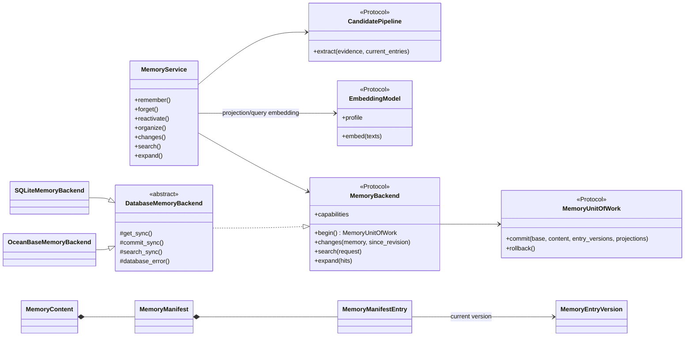
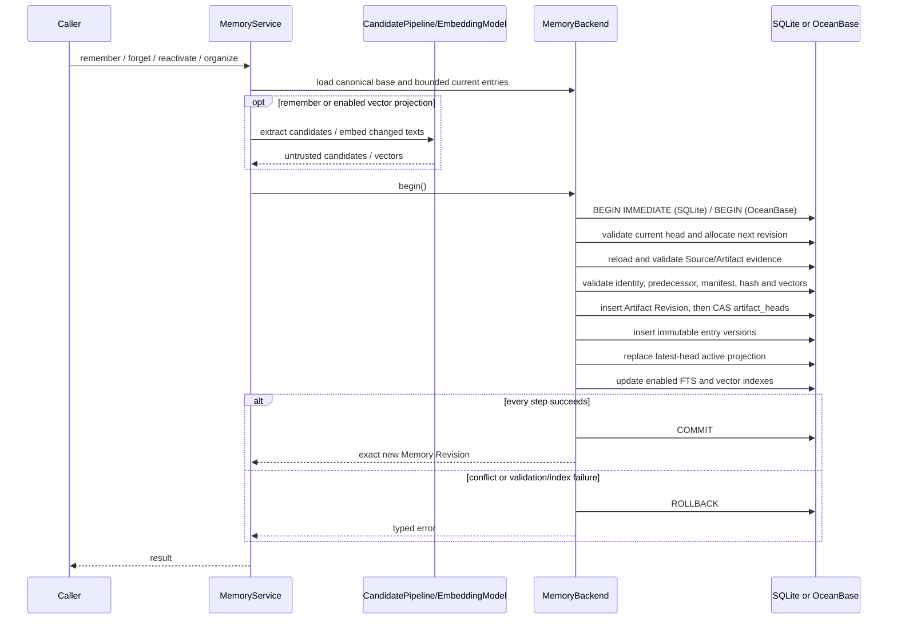

- Proposal Name: `memory_layer_design`
- Start Date: 2026-07-14
- RFC PR: [oceanbase/powercontext#14](https://github.com/oceanbase/powercontext/pull/14)
- Tracking Issue: Not assigned
- Related RFC: [RFC 0001: Product Definition and Vision](0001_product_definition_and_vision.md)
- Related RFC: [RFC 0002: Core SDK Product Model](0002_core_sdk_product_model.md)
- Related Constraint: [RFC 0011: Server and Client SDK Architecture](https://github.com/oceanbase/powercontext/pull/11)

# Summary

Memory is an Artifact Family for reuse in later tasks. A Memory Artifact represents a set of memories that evolve
together. An Artifact Revision stores its complete manifest, while `MemoryEntryVersion` stores immutable content. There
is no memory row whose content can be overwritten in place.

This RFC defines the entry identity, version, and state required by a personal coding agent; the Memory lifecycle and
lineage; exact Handoff citations; and the atomic commit of Revisions, entry versions, latest-head full-text projections,
and enabled vector projections in SQLite and OceanBase. The first phase does not define `MemoryScope`. Memory is located
only by Artifact identity, while the mapping from business objects to Memory is owned by a runtime manifest or an
upper-layer application.

# Motivation

PowerContext is not intended to make agents remember more. It is intended to make shared work easier for the next
participant to take over. Memory preserves facts, preferences, decisions, constraints, and progress that later tasks
need to reuse. It records their direct evidence and makes search, mounting, and Handoff operate on exact Artifact
Revisions. The first phase generates personal repository memory from local repository material, human notes, and agent
outputs so that a coding agent can retrieve, inject, correct, and organize it. The `feat/memory-core` branch already has
an inline-snapshot prototype. This RFC refines it into a dual-backend MVP that supports both SQLite and OceanBase.

## Relationship to RFC 0002

RFC 0002 already requires explicit Source persistence, immutable Artifact Revisions, exact `ArtifactRef` citations,
optimistic concurrency in `revise()`, lineage derived from the complete evidence actually supplied, and an Artifact
store that commits only complete Drafts. Memory candidate generation, Family-specific retrieval, projections, and
transaction boundaries belong to an Artifact Family service or integration runtime. This RFC refines only the Memory
Family. `memory_service.*` represents the target product facade and does not add contracts to the minimum Core Protocol.

## Design goals

- Use Artifact Revision as the lifecycle boundary while separating entry identity, immutable content versions, and
  logical state.
- Make a Revision content hash commit to the content it references, and allow a Handoff to cite an exact entry version.
- By default, return only active entries in the current heads of explicitly selected Memory Artifacts.
- Generate candidates around task events such as user corrections, task completion, Handoff, and Git changes instead
  of using a repository-wide scan as the default entry point.
- Continue to generate candidates from explicit inputs, deterministic adapters, and task outcomes without an LLM; a
  model is only an optional candidate generator.
- Target individuals and personal coding agents in the first version, with both an embedded SQLite backend and an
  OceanBase backend.
- Support full-text, vector, and rank-fusion hybrid retrieval in both backends, while keeping full-text retrieval
  available without an embedding model.

## Non-goals

- Do not host sessions, tool state, or complete transcripts, and do not guarantee that committing a Source
  automatically produces Memory.
- Do not watch files, maintain versions of original material, or calculate general-purpose diffs. Those concerns belong
  to upper-layer applications or Source integrations.
- Do not require a Coding Agent to understand the PowerContext protocol natively. Provider hooks, plugins, CLI
  wrappers, or an upper-layer runtime provide the integration.
- Do not define scope, automatic routing, team multi-tenancy, ACLs, or manifest redaction.
- Do not define a remote Server, HTTP, durable Operations, or general production migrations. For OceanBase, this RFC
  defines only the MySQL-mode schema, transactions, and search adapter needed by the Memory MVP, not a complete
  server-side operations architecture.
- Do not perform semantic merging, contradiction resolution, quality promotion, automatic evolution, or physical
  erasure.

# Guide-level explanation

## Artifact-native Memory

A Memory Artifact is a set of memories that evolve together. Its Artifact ID is the stable identity of the set, and a
Revision is an immutable snapshot at a point in time.

```text
Memory Artifact
  Revision 1 -> manifest: entry_a -> ver_001 active
  Revision 2 -> manifest: entry_a -> ver_001 active
                          entry_b -> ver_002 active
  Revision 3 -> manifest: entry_a -> ver_003 active
                          entry_b -> ver_002 inactive

MemoryEntryVersion rows
  ver_001 -> version 1 content of entry_a
  ver_002 -> version 1 content of entry_b
  ver_003 -> version 2 content of entry_a
```

Artifact, Revision, manifest, and entry version can be compared to Git branch, commit, tree, and blob, respectively.
This analogy explains only the immutable evolution of Memory content. Memory neither stores repository file versions
nor replaces Git.

## Code structure and abstraction boundaries

The public Memory API, candidate generation, authoritative writes, and retrieval projections must be layered. The
database abstraction expresses the transaction and retrieval capabilities Memory requires. It does not expose a
general SQL, connection, or ORM API, and it is not added to the minimum Core Protocol defined in RFC 0002.
`DatabaseMemoryBackend` is the database-adapter extension SPI: it implements async serialization, the Unit of Work,
canonical validation, manifest/entry reference validation, and search-hit filtering. A concrete adapter implements
only synchronous CRUD, CAS, schema, transaction isolation, and database search dialect primitives. SQLite and
OceanBase use this SPI to implement the same Family-level ports, with shared semantics verified by backend conformance
tests. Future database adapters must not duplicate these domain rules.



The proposed Family-level Python contract has the following shape:

```python
MemoryCapabilities:
    fts: bool
    vector: bool
    hybrid: bool
    embedding_profile: EmbeddingProfile | None

EmbeddingProfile:
    profile_id: str
    model: str
    dimension: int
    distance: Literal["l2"]
    normalization: str

EmbeddingVector = tuple[float, ...]

EmbeddingResult:
    vectors: tuple[EmbeddingVector, ...]
    usage: InferenceUsage

MemoryBackend(Protocol):
    async def capabilities() -> MemoryCapabilities: ...
    def begin() -> AsyncContextManager[MemoryUnitOfWork]: ...
    async def changes(memory: ArtifactRef, since_revision: int | None) -> tuple[MemoryRevisionChanges, ...]: ...
    async def search(request: MemorySearchRequest) -> tuple[MemoryHit, ...]: ...
    async def expand(hits: tuple[MemoryHit, ...]) -> tuple[MemoryEntryVersion, ...]: ...

EmbeddingModel(Protocol):
    @property
    def profile() -> EmbeddingProfile: ...
    async def embed(texts: tuple[str, ...]) -> EmbeddingResult: ...
```

`MemoryService` owns domain validation and operation orchestration. `CandidatePipeline` and `EmbeddingModel` run
outside the transaction. `MemoryBackend` owns capability discovery, exact reads, and retrieval. `MemoryUnitOfWork` owns
the atomic boundary across the Artifact Revision, entry versions, head projections, and index updates. A concrete
backend may compose an existing `ArtifactStore` and `SourceStore`, but it must ensure that those components share the
same transaction manager. Each MVP deployment configures exactly one embedding profile; the model, dimension, L2
distance, and normalization are fixed when the database is created. The runtime exposes no API for switching the
profile or dimension. Replacing the model requires a schema migration and full rebuild during a write outage. An
adapter may support other distances beyond the MVP, but it must not present those extensions as common conformance.

## Memory identity

The first phase does not derive identity from a repository, user, or workspace. `remember(memory=None, ...)` creates a
new Memory Artifact when there is content worth saving, and subsequent writes must supply the current Revision. A
runtime manifest or upper-layer application stores the mapping from a business object to an Artifact ID:

```text
repo:/home/jingshun.tq/project/powercontext -> mem_art_01HPC
```

Search explicitly selects one or more Memory Artifacts and does not automatically mix user, repository, or run memory.

## Task events and extraction boundaries

The default entry point for Memory is a task event that has already occurred during work, not a periodic repository
scan that guesses everything that might be useful. A Coding Agent integration observes events through a provider hook,
plugin, CLI wrapper, or upper-layer runtime and normalizes product-specific payloads outside Memory Core. The MVP
recognizes at least the following triggers:

- A user explicitly corrects the agent, expresses a durable preference, or asks it to remember or forget something.
- The main agent turn stops, a task outcome is produced, or a Handoff is ready to commit.
- A Git commit or change clearly alters the evidence for an existing rule, decision, or constraint.
- The caller explicitly submits a structured decision, constraint, or `working_note`.

The end of an agent turn is only an observable boundary; it does not prove that the task is complete. The runtime may
combine multiple provider events by session, idle window, commit, or Handoff, then persist an immutable
`AgentTurnSource`, `TaskOutcomeSource`, `GitChangeSource`, or equivalent Source. Committing the Source still does not
automatically create Memory. The runtime must explicitly select the target Memory Revision, operation evidence, and
candidates before calling `remember()`.

### Memory admission rules

A durable entry must satisfy all of the following conditions:

1. It will change the judgment or action of a future agent.
2. It cannot be recovered reliably and cheaply merely by quickly reading the current code or configuration, or it is
   an operating contract that an agent must know before taking action.
3. It is supported by the current operation evidence or by the direct predecessor evidence of the entry being revised.
4. It remains understandable outside the original material and represents one semantic topic that can be revised,
   deactivated, or reactivated independently.
5. It is expected to be reused across tasks. Information useful only to the current handoff belongs in a
   `working_note`.

Prefer user preferences, confirmed decisions, inviolable constraints, facts that are expensive to rediscover,
validated pitfalls, and unfinished handoffs. Do not save file inventories, function signatures, source code, line
numbers, full transcripts, routine tool logs, one-off command output, unverified speculation, or secrets. If two
sub-conclusions may change independently, they must be separate entries. Multiple Sources may jointly support an entry
only when they directly support the same semantic topic.

### Candidate generation and model-free fallback

The runtime may combine the following candidate sources. Concrete providers are not part of the minimum Core Protocol:

1. A `MemoryEntryInput` supplied explicitly by the caller.
2. A deterministic adapter for known material such as `pyproject.toml`, a Git change, or a structured decision.
3. A structured task outcome exposed by the Coding Agent integration.
4. An optional model-assisted extractor.

Every source produces untrusted candidates that must pass the same evidence, identity, canonical-bytes, no-op, and head
CAS validation. Without a semantic extractor, the runtime may mechanically assemble the final report, changed paths,
Git head, and verification results already supplied by the provider into one `working_note`. It must not fabricate a
`fact`, `decision`, or `constraint` from that material. If an event yields neither a valid structured candidate nor a
useful `working_note`, the result is a no-op rather than an entry forcibly created for every turn.

## Source changes and incremental evidence

Memory Core processes only the persisted evidence explicitly supplied by the caller for the current operation. It
neither discovers the "latest version" of a Source nor compares two Sources. Versioning, observation, and difference
calculation for original material belong to its owner. A Coding Agent runtime should reuse Git: it stores
`last_processed_commit` in its own manifest, lets Git produce an immutable change Source containing the
`base commit + head commit + path + patch`, and supplies that Source together with the current Memory Revision to the
candidate-generation pipeline. Other systems use their own page version, event ID, or revision.

The initial repository Memory should likewise be triggered by an explicit bootstrap, task outcome, or Handoff event.
It reads only the bounded Sources needed for repository operating contracts and does not scan all code by default.
Subsequent operations prefer incremental Sources supplied by a provider. When no reliable increment is available, the
runtime may fall back to a relevant complete Source, but Memory Core does not create file snapshots, chunk histories,
or general-purpose diffs for that purpose. The absence of old content from new material alone does not make an entry
inactive. In the MVP, only explicit revision evidence can revise an entry; deactivation still requires an explicit
`forget()`, and restoration requires an explicit `reactivate()`.

## Coding Agent scenario

Suppose Codex is maintaining the `powercontext` repository. After the user first completes a task that confirms the
repository's development and verification conventions, a provider hook emits a turn-stop event. The runtime persists
the task boundary and final report as `src_task_outcome_001`, and separately persists the `AGENTS.md`, `pyproject.toml`,
and `Makefile` actually used by the task as `src_agents_md`, `src_pyproject`, and `src_makefile`. The runtime candidate
pipeline processes only this bounded evidence. Candidates may come from a deterministic adapter, the agent
integration, or an optional model. After applying the admission rules, the runtime calls the following operation with
explicit entries:

```python
memory = await memory_service.remember(
    memory=None,
    sources=(src_task_outcome_001, src_agents_md, src_pyproject, src_makefile),
    entries=tuple(candidates),
    mode="append",
)
```

`candidates` is integration-owned pseudocode and does not extend the minimum Core API. If there is no durable entry to
save but the final report is still useful for a handoff, the candidate pipeline may generate only one `working_note`.
If even a `working_note` has no value, the call is a no-op. When valid candidates exist, the runtime creates the Memory
Artifact and Revision 1. Only after the call returns does the runtime manifest store the repository-to-Artifact-ID
mapping:

```text
repo:/home/jingshun.tq/project/powercontext -> mem_art_01HPC
```

Revision 1 records three memories. The number of input Sources has no correspondence to the number of entries. Sources
and entries have a many-to-many relationship, and entries are divided by independently revisable semantic topics, not
by file:

```text
Revision 1 manifest:
  mem_ent_01A -> mem_ver_101 active
  mem_ent_02B -> mem_ver_102 active
  mem_ent_03C -> mem_ver_103 active
```

The manifest in this example omits `entry_content_hash` for readability. Persisted content must include that field.

These manifest items are only a directory. The content lives in immutable entry versions. The following example omits
`memory_artifact_id`, `entry_content_hash`, `created_in_revision`, and empty fields. `source_refs` contains display
aliases for persisted Source objects:

```text
mem_ver_101:
  entry_id: mem_ent_01A
  version: 1
  previous_version_id: null
  kind: fact
  text: "powercontext uses uv to manage dependencies and Hatchling to build."
  source_refs: ["src_agents_md", "src_pyproject"]

mem_ver_102:
  entry_id: mem_ent_02B
  version: 1
  previous_version_id: null
  kind: preference
  text: "Validation convention: run make test for routine code changes; run make check before review."
  source_refs: ["src_agents_md", "src_makefile"]

mem_ver_103:
  entry_id: mem_ent_03C
  version: 1
  previous_version_id: null
  kind: constraint
  text: "site/ is generated output and must not be modified as source material."
  source_refs: ["src_agents_md"]
```

Later, the user adds: "You do not need to run the full `make test` when editing documentation; prefer
`make docs-test`." The provider integration captures the user-correction event, the runtime persists the original
statement as `src_user_note`, and it then generates an explicit revision candidate against the current Memory before
calling `remember()`. This does not add an unrelated memory. It revises the validation preference in `mem_ent_02B`, and
the system creates its direct successor version:

```text
mem_ver_204:
  entry_id: mem_ent_02B
  version: 2
  kind: preference
  text: "Validation convention: run make test for routine code changes; prefer make docs-test for documentation-only changes; run make check before review."
  previous_version_id: mem_ver_102
  source_refs: ["src_agents_md", "src_makefile", "src_user_note"]
```

The Revision 2 manifest changes only the content version referenced by `mem_ent_02B`:

```text
Revision 2 manifest:
  mem_ent_01A -> mem_ver_101 active
  mem_ent_02B -> mem_ver_204 active
  mem_ent_03C -> mem_ver_103 active
```

Later still, the user says: "Do not remember the `site/` rule; some release tasks need to work with it." The system
does not delete the historical content. It deactivates the entry in a new Revision:

```text
Revision 3 manifest:
  mem_ent_01A -> mem_ver_101 active
  mem_ent_02B -> mem_ver_204 active
  mem_ent_03C -> mem_ver_103 inactive
```

Before the next coding-agent task, the runtime uses the Artifact ID in its runtime manifest to read the current
`repo_memory` head, then searches it explicitly:

```python
result = await memory_service.search(
    "Which build and verification conventions should I know before editing documentation?",
    memories=(repo_memory,),
    limit=8,
    mode="fts",
)
```

Because the query terms occur directly in the active entry content, full-text search can retrieve the build and
verification conventions. With an embedding model configured, vector or hybrid retrieval can also retrieve
semantically related entries. After Revision 3 commits, the latest-head projection no longer contains the inactive
`mem_ent_03C`; authoritative manifest filtering again ensures it cannot appear in the results. If a later call invokes
`reactivate()`, a new Revision marks the same entry version active and restores its retrieval projection without
duplicating the content version.

If an old Handoff cited the validation command from Revision 2, it can store:

```text
memory_ref: ArtifactRef(mem_art_01HPC, revision=2)
entry_id: mem_ent_02B
entry_version_id: mem_ver_204
```

Even as Memory continues to evolve, this citation still identifies which version of which memory the Handoff used at
that time.

# Reference-level explanation

## Core invariants

- Memory identity is the Artifact ID; there is no second scope identity.
- Artifact Revisions and entry versions are immutable, and a Revision manifest is the authoritative source of entry
  state.
- A manifest stores the entry version ID and content hash, so the Artifact content hash commits to the referenced entry
  content.
- An entry revision uses the version current in the previous Revision as its direct predecessor; it cannot skip,
  branch, or cross entries.
- Deactivation and reactivation change only a new manifest and never rewrite an old entry version.
- Revision lineage records operation evidence, while entry lineage records only the evidence directly supporting the
  content.
- Latest-head projections are rebuildable and model output is an untrusted candidate; neither can replace
  authoritative state.

## Data model

## MemoryContent

```python
MemoryContent:
    schema: Literal["powercontext.memory.v1"]
    manifest: MemoryManifest
    changes: tuple[MemoryChange, ...]

MemoryManifest:
    format: Literal["flat-v1"]
    entries: tuple[MemoryManifestEntry, ...]

MemoryManifestEntry:
    entry_id: str
    entry_version_id: str
    entry_content_hash: str
    state: Literal["active", "inactive"]

MemoryChange:
    op: Literal["add", "revise", "deactivate", "reactivate"]
    entry_id: str
    from_entry_version_id: str | None
    to_entry_version_id: str | None
    reason: str | None
```

Both `manifest.entries` and `changes` are sorted by ascending UTF-8 `entry_id`. A Revision cannot record multiple
changes for the same entry, and `entry_id` cannot be duplicated. The manifest stores neither content nor references.
`changes` is a compact delta summary for the current Revision, not the authoritative source of current state; only the
manifest determines current state. Total, active, and inactive entry counts are derived from the manifest rather than
persisted redundantly.

`reason` explains a state transition or content revision. After normalization, it is limited to 512 Unicode code
points and may be either a stable reason code or short natural-language text. Changes made by `organize()` are still
recorded as `revise` or `deactivate`, with `reason="normalize"` or `reason="dedupe"`, respectively. The processing
mechanism is not mixed into `op`. `reason` is used only for auditing and progressive reads. It is not evidence and
cannot replace entry content, a Source, or an Artifact citation. A change receives no separate ID;
`ArtifactRef + the ordinal position of the change within that Revision` already identifies it exactly.

Each operation gives the version fields a fixed meaning: `add` is `(None, new_version)`, `revise` is
`(old_version, new_version)`, `deactivate` is `(current_version, None)`, and `reactivate` is
`(None, current_version)`. The last two describe removal from and restoration to the active-head projection. An
inactive manifest item still retains its current-version reference.

`entry_content_hash` must equal the hash of the target `MemoryEntryVersion` canonical content. Reading a Revision,
running `expand()`, and performing offline validation must all compare the ID, hash, and canonical bytes rather than
trusting a random ID alone.

## MemoryEntryVersion

```python
MemoryEntryVersion:
    memory_artifact_id: str
    entry_id: str
    entry_version_id: str
    version: int
    previous_version_id: str | None

    kind: MemoryEntryKind
    text: str
    sources: tuple[Source, ...]
    artifacts: tuple[ArtifactRef, ...]

    entry_content_hash: str
    created_in_revision: int
```

A content change to the same `entry_id` creates an incremented version rather than updating content in place. The first
version is `1` with no predecessor. Every later version must equal its direct predecessor's version plus one, and
`previous_version_id` must be the version currently referenced for that `entry_id` by the base manifest. Deactivation
or reactivation changes only the state in a new manifest and does not create a new version with identical content.

The public Memory service accepts complete persisted `Source` and upstream `Artifact` objects. After validation, the
runtime encodes a Source as an integration-owned stable reference and an Artifact as an exact `ArtifactRef`. JSON
references in the database are a codec of a concrete store, not a general Core identity.

## Entry kind

The known MVP values are `fact`, `preference`, `decision`, `constraint`, and `working_note` for short-term progress. The
wire representation is a non-empty string, not a closed enum. A reader must preserve an unknown kind and treat it as an
ordinary entry. A `working_note` is not a complete transcript. Experience, habits, and pitfalls use the closest kind
and express the detail in their content; the MVP does not define a separate Skill candidate structure.

## Writes and lifecycle

## MemoryEntryInput

```python
MemoryEntryInput:
    entry: MemoryEntryVersion | None
    kind: MemoryEntryKind
    text: str
    sources: tuple[Source, ...]
    artifacts: tuple[Artifact, ...]
    reason: str | None = None
```

The evidence of a new entry must be a subset of the current operation evidence. A revision always retains evidence
from its direct predecessor and unions it with any evidence supplied on the candidate; the candidate still cannot cite
an object outside the union of the predecessor evidence and the current operation evidence.
The runtime resolves canonical objects again inside the transaction and does not trust a backend ID supplied by a
caller or model. `entry=None` means a new entry; an exact current active `MemoryEntryVersion` means a revision.
Identical content is a no-op. An inactive, stale, or unrelated entry object is rejected. The caller must explicitly
call `reactivate()` first and then revise the content against the new head. A batch cannot modify the same entry more
than once, and only the first of identical new
entries is retained. `reason` uses the same normalization and length validation as `MemoryChange.reason`. The reason on
an explicit input is copied into its add or revise change. A candidate generator with no reliable reason must use
`None` rather than invent one. After NFC and surrounding-whitespace normalization, `text` must be non-empty and no more
than 8192 bytes when encoded as UTF-8. This limit also ensures that the OceanBase `TEXT` full-text column can hold the
tokens derived by analyzer v1.

## remember()

```python
memory = await memory_service.remember(
    memory=current_memory,
    sources=(source,),
    artifacts=(decision,),
    entries=(),
    mode="auto",
)
```

`append` writes caller- or integration-generated explicit entries with exact deduplication. It is the canonical
persistence entry point for the task-event path. `extract` asks the integration-configured candidate pipeline to
generate candidates from persisted evidence; the pipeline may include deterministic adapters, structured agent
results, or an optional model. `auto` selects append when entries are present and otherwise selects extract when
evidence is present.

`memory=None` creates a new Memory and neither looks up nor reuses an existing one. A non-null `memory` must be the
exact current Revision. `append` requires at least one entry. `extract` requires at least one Source or Artifact and
cannot also receive entries. If the caller explicitly requests an unconfigured candidate provider, the operation
raises `CapabilityNotSupportedError`. If an optional provider in the default pipeline is unavailable, the pipeline may
continue with another provider or a deterministic working-note fallback. When there is no executable work, the
operation raises `ValueError` rather than creating an empty Memory.

An initial calculation with no change worth saving returns `None`. An existing Memory with no change returns its
current Revision. No-op detection must occur before changes and an Artifact Revision are constructed; an empty Revision
must never be created.

A candidate generator may see a bounded window of current active entries and propose either a new entry or a revision
to an `entry_id`. The runtime may deterministically select relevant entries using direct-evidence relationships and
FTS; when Memory is small, it may supply every entry. When it is uncertain which old entry new content belongs to, the
runtime must create a new entry rather than overwrite the wrong one. No candidate generator may introduce evidence
outside the current operation and direct predecessor, write to the database directly, or decide the final head. When a
model is used, its prompt, trace, and intermediate reasoning still do not automatically become evidence.

## Revision and entry lineage

Generic Revision lineage records only the current operation evidence, while an entry version records the evidence that
directly supports its content. A content revision always retains evidence from its direct predecessor and unions it
with candidate evidence. An unchanged entry enters the manifest as-is and does not copy its historical evidence into
the current Revision lineage. An agent's final
report, a model prompt, a trace, or intermediate reasoning can become Memory evidence only after being persisted as a
Source. Even then, it supports only what it actually states and cannot replace direct evidence such as code, tests, or
the user's original words.

## forget()

```python
updated = await memory_service.forget(
    memory,
    entries=(entry,),
    reason="user_requested",
)
```

`forget()` creates a new Revision, marks the specified manifest items `inactive`, and records `op="deactivate"`. It
does not rewrite an old Revision or entry version. A stale or unrelated entry object is rejected. An inactive entry
is an idempotent no-op; if all selected entries are already inactive, the operation returns the original Revision. This
operation only prevents later retrieval or injection and does not satisfy a physical-erasure requirement.

## reactivate()

```python
updated = await memory_service.reactivate(
    memory,
    entries=(entry,),
    reason="user_restored",
)
```

`reactivate()` creates a new Revision, marks the specified inactive manifest items `active` again, and records
`op="reactivate"`. It continues to reference the `entry_version_id` and `entry_content_hash` used before deactivation
and does not create a content version. The backend must restore the entry's full-text head projection. When an
embedding model is available, it also writes the vector for the fixed profile. When the embedding model is unavailable, no
vector is written and vector retrieval for that Memory remains unavailable until an offline rebuild fills the gap. A
stale or unrelated entry object is rejected. An active entry is an idempotent no-op; if all selected entries are already
active, the operation returns the original Revision. To change content after restoration, the caller must first commit
`reactivate()` and then call `remember()` against the returned head, preventing a single operation from expressing
both state restoration and content revision.

## organize()

`organize()` v1 performs exact deduplication followed by normalization. Among duplicate active entries, it retains the
one with the smallest UTF-8 `entry_id` and marks the others inactive; each corresponding change uses
`op="deactivate", reason="dedupe"`. A new version is created only when normalized Source or Artifact references
actually differ, and that change uses `op="revise", reason="normalize"`. `dedupe`, `normalize`, and `default` control
which steps run. If there is no change, the operation returns the original Revision. Version 1 does not semantically
merge near-duplicates, resolve contradictions, or promote quality.

## Concurrency and transactions

`remember()`, `forget()`, `reactivate()`, and `organize()` use optimistic head compare-and-swap and do not perform an
automatic three-way merge.

Generic `ArtifactStore.add()/revise()` alone cannot provide Memory's cross-table atomicity. An integration must provide
the Family-level `MemoryBackend` and `MemoryUnitOfWork`, sharing a transaction manager with the SQL ArtifactStore. The
SQLite and OceanBase adapters each own their transactions, DDL, and index codecs while exposing the same domain
capabilities. These ports belong to the Memory Family; they are not added to the minimum Core Protocol and do not
require the two databases to use identical SQL.



Candidate generation and embedding calculation occur outside the transaction. A vector must carry the fixed embedding
profile and target content hash, and it can enter a projection only after being validated again inside the transaction.
SQLite uses `BEGIN IMMEDIATE`, while OceanBase performs a transactional head compare-and-swap. Both must commit or roll
back the Artifact Revision, entry versions, active-head projection, and all enabled full-text and vector indexes
together. Calling `Artifacts.revise()` publicly first and inserting entry versions in another transaction is not
allowed. A failed compare-and-swap raises `RevisionConflictError`; the caller rereads the head and reruns the domain
operation. Candidates or vectors generated from stale active entries cannot be applied directly to the new head.

The direct-database MVP path does not provide a separate idempotency ledger:

- Replaying the same input against the current head returns the current Revision when the result is unchanged.
- Replaying with an explicit stale `memory` raises `RevisionConflictError`.
- `forget()` is a no-op for an inactive entry, and `reactivate()` is a no-op for an active entry.
- If the commit result is uncertain, the caller reads the current head before deciding whether to replay.

The durable Operation, `Idempotency-Key`, asynchronous projections, and checkpoints of a remote Server are defined by
RFC 0011 and are not duplicated in the Memory Runtime.

## Search and reads

## Backend capabilities

`MemoryBackend.capabilities` declares at least `fts`, `vector`, `hybrid`, and `embedding_profile`.
`embedding_profile` returns the deployment's single read-only profile when vector infrastructure is configured and
otherwise returns `None`. `vector/hybrid` means that the database, adapter, and embedding model have the corresponding
capability; projection completeness for a particular Memory is still checked before every search. An MVP release must
support:

- [SQLite 3.38.0+](https://www.sqlite.org/releaselog/3_38_0.html),
  [FTS5](https://www.sqlite.org/fts5.html), and the
  [Vec1](https://sqlite.org/vec1/doc/trunk/doc/vec1.md) `0.7+` loadable extension.
- OceanBase Database `4.3.5 BP3+` with a MySQL-mode tenant, full-text indexes, and
  [vector indexes](https://en.oceanbase.com/docs/common-oceanbase-database-10000000001976352).
- A single `EmbeddingProfile` in deployment configuration containing at least a stable model ID, fixed dimension, L2
  distance, and normalization.
- When vector or hybrid retrieval is enabled, an `EmbeddingModel` whose profile exactly matches deployment
  configuration.
- Authoritative writes, full-text search, `changes()`, `expand()`, deactivation, and reactivation that continue to work
  when there is no embedding model or the embedding model is temporarily unavailable.

Backend initialization must probe the database version, mode, FTS and vector extensions, fixed dimension, and L2
distance. Before every vector or hybrid search, the backend must also confirm that the embedding model profile matches
deployment configuration and that the fixed vector projection is complete for every Memory selected by the query. No
separate persisted state table is created. An explicit request for an unavailable capability raises
`CapabilityNotSupportedError` rather than silently returning an empty result. `mode="auto"` may fall back in the order
`hybrid -> fts` and reports the mode actually used in result metadata. Explicit `vector` or `hybrid` requests never
fall back.

## search()

```python
result = await memory_service.search(
    "Which user preferences and engineering conventions should I know before continuing the implementation?",
    memories=(repo_memory, user_memory),
    limit=8,
    mode="auto",
)
```

Search requires at least one explicit current `Memory` object. Duplicate objects are deduplicated, and results from
different Memory Artifacts may be ranked together. The MVP neither discovers nor mixes Memory automatically. Search
accepts only current-head objects. Passing a non-head Revision raises
`CapabilityNotSupportedError`; it must not be silently interpreted as the current head.

The MVP defines four modes:

| Mode | Behavior |
| --- | --- |
| `fts` | Use the backend full-text index for deterministic term retrieval; no embedding model is required |
| `vector` | Embed the query with the deployment's fixed profile and perform ANN retrieval |
| `hybrid` | Retrieve FTS and vector candidates separately, then combine them with RRF |
| `auto` | Use hybrid when the embedding model is available, its profile matches, and all selected Memory Artifacts have complete vector projections; otherwise use FTS |

The full-text and vector channels each retrieve `max(limit * 4, 32)` candidates first, preserving the backend's
internal order within each channel, and then apply reciprocal rank fusion:

```text
rrf_score(candidate) = Σ 1 / (60 + rank_in_channel)
```

`rank_in_channel` starts at 1. Single-channel `fts` and `vector` modes use the same one-channel formula to produce their
public score. A candidate absent from one channel receives a contribution only from the other. The OceanBase adapter
may use native `HYBRID_SEARCH` in version 4.6+ as an optimization, but it must preserve the same active-head filtering,
RRF parameters, and stable tie-breaks externally. The 4.3.5 baseline performs RRF in the application. SQLite performs
the same application-level RRF over FTS5 and Vec1 results. Equal RRF scores are broken by ascending
`memory_artifact_id`, UTF-8 `entry_id`, and `entry_version_id`.

Every mode retrieves only from the latest-head active projection and filters the candidates again through the
authoritative head manifest in the same read transaction. Each candidate must satisfy all of the following conditions:

1. The manifest contains the same `entry_id` in the active state.
2. The manifest points to exactly the candidate's `entry_version_id`.
3. The manifest's `entry_content_hash` matches the entry's canonical bytes.

`MemoryHit` contains at least:

```python
MemoryHit:
    memory_ref: ArtifactRef
    entry_id: str
    entry_version_id: str
    text: str
    score: float
    matched_by: tuple[Literal["fts", "vector"], ...]
```

`memory_ref + entry_id + entry_version_id` is the stable anchor used by later `expand()` calls and Handoff citations.
`score` is runtime-assistance metadata, not an authoritative fact. Raw FTS and vector scores from different backends
are neither exposed nor guaranteed to match exactly. The RRF score and deterministic tie-break are common API
semantics. Memory text is untrusted retrieval content and cannot override system or developer policy.

## changes()

```python
deltas = await memory_service.changes(
    repo_memory,
    since_revision=3,
)
```

```python
MemoryRevisionChanges:
    memory_ref: ArtifactRef
    changes: tuple[MemoryChange, ...]
```

`changes()` returns `(memory_ref, changes)` in ascending Revision order. It reads only the compact `MemoryChange` values
in Artifact Revisions and does not load `MemoryEntryVersion.text`, evidence, or retrieval projections.
`since_revision` is exclusive; when omitted, only the changes of the target Revision are returned. Revision numbers
start at `1`, so `0` is the explicit lower-bound sentinel for reading the complete history from Revision `1` through
the target Revision. A negative value, a nonexistent positive Revision, a value from another Artifact, or a value
greater than the target Revision raises `ArtifactNotFoundError` or `ValueError` as appropriate.

A Coding Agent should first inspect each change's `op + entry_id + reason` to determine which changes may affect the
current task and then call `expand()` only for relevant entries. `reason` may reduce unnecessary full-content
injection, but it is neither a retrieval summary nor evidence. If the agent cannot make a reliable decision from the
reason alone, it must read the target entry content.

## expand()

```python
views = await memory_service.expand(hits, layer="full")
```

`expand()` uses the three stable anchors in each hit to read an exact version. It loads the manifest for the Revision
identified by `memory_ref` and validates the entry ID, version ID, content hash, and canonical bytes. Any mismatch is
rejected as an invalid citation; entry versions cannot be joined across Revisions or Memory Artifacts.

## Handoff citation

A Handoff does not copy an entire Memory. It stores:

```text
ArtifactRef(memory_id, revision)
  + entry_id
  + entry_version_id
```

The human and agent views are derived from the same Handoff Revision, while content and evidence are read through the
structured citation. An LLM may draft text but cannot invent a citation. The generic lineage of a Handoff Draft
contains the exact Memory `ArtifactRef` used by the citation; the entry citation is only a refinement. Memory injected
into an agent is marked as untrusted context and placed below system and developer policy.

## Storage abstraction and physical model

## Shared logical structure

The SQLite and OceanBase integrations reuse their respective `SourceStore`, `ArtifactStore`, and schema-version table.
Both implementations share domain invariants and logical objects, while each adapter owns its DDL, transaction
statements, full-text tokenizer, and vector-index codec:

| Object | Responsibility |
| --- | --- |
| `artifact_revisions` | Stores `MemoryContent` and generic lineage; authoritative Revision history |
| `artifact_heads` | Stores the current Artifact Revision and provides head compare-and-swap |
| `memory_entry_versions` | Stores immutable entry content; authoritative content-version history |
| `memory_entry_heads` | Stores active entries in the current head; in OceanBase, the same table stores full-text and fixed-profile vector projections |
| `memory_entry_search_fts` | SQLite FTS5 virtual table; represented by a FULLTEXT index on `memory_entry_heads` in OceanBase |
| `memory_entry_search_vector` | SQLite Vec1 virtual table; represented by a vector column and HNSW index on `memory_entry_heads` in OceanBase |

Authoritative tables and projections must be physically separated. After insertion, the identity, version, previous
version, content, evidence, content hash, and creation Revision of a `memory_entry_versions` row cannot be updated.
`memory_entry_heads`, its full-text index, and its fixed-profile vector index can all be rebuilt solely from the current
head manifest, entry versions, and deployment configuration. An inactive entry remains in the authoritative manifest
and historical content but does not appear in `memory_entry_heads` or any search index.

## Shared authoritative-table reference structure

```sql
CREATE TABLE memory_entry_versions (
    memory_artifact_id TEXT NOT NULL, -- Stable ID of the owning Memory Artifact
    entry_id TEXT NOT NULL, -- Logical memory ID shared by all versions of the same memory
    entry_version_id TEXT NOT NULL, -- Globally unique ID of this immutable content version
    version INTEGER NOT NULL, -- Version number increasing from 1 within this entry
    previous_version_id TEXT, -- Direct predecessor version; NULL for the first version

    kind TEXT NOT NULL, -- Memory kind, such as fact, preference, decision, or constraint
    text TEXT NOT NULL, -- Normalized memory content
    source_refs TEXT NOT NULL, -- JSON array of Source references directly supporting the content; may be []
    artifact_refs TEXT NOT NULL, -- JSON array of exact ArtifactRef values directly supporting the content; may be []
    entry_content_hash TEXT NOT NULL, -- Canonical content hash of kind, text, and references
    created_in_revision INTEGER NOT NULL, -- Memory Revision in which this content version first appeared

    PRIMARY KEY (entry_version_id), -- Ensures that the content-version ID is globally unique
    UNIQUE (memory_artifact_id, entry_id, version), -- Prevents duplicate version numbers within an entry
    UNIQUE (memory_artifact_id, entry_id, entry_version_id), -- Unique key for the active-head composite foreign key
    FOREIGN KEY (previous_version_id)
        REFERENCES memory_entry_versions (entry_version_id), -- Predecessor must exist; same Memory/entry is transaction-validated
    FOREIGN KEY (memory_artifact_id, created_in_revision)
        REFERENCES artifact_revisions (artifact_id, revision) -- Creation Revision must exist
);

CREATE INDEX idx_memory_entry_versions_hash
    ON memory_entry_versions (memory_artifact_id, entry_content_hash);
```

This structure uses SQLite type spelling to express logical constraints shared by both backends. The OceanBase
adapter maps identity and hashes to bounded `VARCHAR` values, content to `TEXT`, and references to JCS `LONGTEXT`. If
native JSON queries are needed, a separate rebuildable projection may be created, but it cannot replace canonical
bytes. The single-column self-referencing foreign key on `previous_version_id` ensures that the predecessor version
exists. Transactional domain validation still ensures that the direct predecessor belongs to the same Memory and entry,
equals the version current in the base manifest, and satisfies `version + 1`. The composite unique key is retained for
the cross-table foreign key from the active-head projection.

## SQLite adapter

The SQLite backend requires SQLite `3.38.0+`, foreign keys, FTS5, and the Vec1 `0.7+` extension. Vec1 0.7 uses the
`sqlite3_vtab_in*` and virtual-table LIMIT-constraint APIs introduced in 3.38.0, so initialization must explicitly
reject an older version. An integer `projection_id` links the ordinary head table, FTS5 rowid, and Vec1 rowid:

```sql
CREATE TABLE memory_entry_heads (
    projection_id INTEGER PRIMARY KEY,
    memory_artifact_id TEXT NOT NULL,
    head_revision INTEGER NOT NULL,
    entry_id TEXT NOT NULL,
    entry_version_id TEXT NOT NULL,
    entry_content_hash TEXT NOT NULL,
    searchable_text TEXT NOT NULL,
    UNIQUE (memory_artifact_id, entry_id),
    FOREIGN KEY (memory_artifact_id, entry_id, entry_version_id)
        REFERENCES memory_entry_versions (memory_artifact_id, entry_id, entry_version_id)
);

CREATE VIRTUAL TABLE memory_entry_search_fts USING fts5(
    searchable_text,
    tokenize='unicode61'
);

CREATE TABLE memory_entry_vector_metadata (
    projection_id INTEGER PRIMARY KEY,
    entry_version_id TEXT NOT NULL,
    entry_content_hash TEXT NOT NULL,
    embedding_content_hash TEXT NOT NULL,
    UNIQUE (entry_version_id),
    FOREIGN KEY (projection_id) REFERENCES memory_entry_heads (projection_id) ON DELETE CASCADE
);

CREATE VIRTUAL TABLE memory_entry_search_vector USING vec1(embedding);
```

Writes to FTS5 and Vec1 explicitly use the same rowid as `memory_entry_heads.projection_id`. The vector dimension of
SQLite Vec1 is established by the first vector, and later vectors of a different length are rejected. The adapter must
still validate every vector against the deployment's fixed dimension before writing and use
`memory_entry_vector_metadata` to verify the corresponding entry version, content hash, and embedding hash. The MVP
always uses the fixed table names above and does not create parallel tables with version suffixes. Replacing the profile
or dimension requires pausing writes, clearing and rebuilding the metadata and Vec1 projection, and then resuming
queries. During initialization, the SQLite adapter must perform a minimal insert/search/delete probe rather than claim
capability solely from a compile option or the existence of an extension file. Vec1 configuration and query parameters
must use standard JSON such as `{"k": 32}` and cannot depend on the JSON5 shorthand `{k: 32}` accepted only by newer
SQLite versions.

## OceanBase adapter

The OceanBase MVP baseline is MySQL mode on `4.3.5 BP3+`. DDL syntax follows the official
[vector search](https://en.oceanbase.com/docs/common-oceanbase-database-10000000001976352) and
[full-text index](https://en.oceanbase.com/docs/common-oceanbase-database-10000000003683579) documentation. The DDL
below assumes that generic `artifact_revisions` already exists and that its `artifact_id/revision` columns use types
compatible with the tables below. IDs are ASCII strings of no more than 128 characters. SHA-256 values are 64-character
lowercase hexadecimal strings. References remain JCS text and do not depend on a JSON representation reordered by the
database.

### Generic Artifact prerequisite tables

If the OceanBase `ArtifactStore` does not already provide an equivalent schema, the Memory backend requires at least
the following columns. `artifact_revisions` is insert-only, while `artifact_heads` is a compare-and-swap pointer and
does not store Artifact content:

```sql
CREATE TABLE artifact_revisions (
    artifact_id VARCHAR(128) CHARACTER SET ascii COLLATE ascii_bin NOT NULL,
    revision BIGINT NOT NULL,
    family VARCHAR(64) CHARACTER SET ascii COLLATE ascii_bin NOT NULL,
    content LONGTEXT CHARACTER SET utf8mb4 COLLATE utf8mb4_bin NOT NULL,
    content_hash CHAR(64) CHARACTER SET ascii COLLATE ascii_bin NOT NULL,
    lineage LONGTEXT CHARACTER SET utf8mb4 COLLATE utf8mb4_bin NOT NULL,

    PRIMARY KEY (artifact_id, revision)
);

CREATE TABLE artifact_heads (
    artifact_id VARCHAR(128) CHARACTER SET ascii COLLATE ascii_bin NOT NULL,
    revision BIGINT NOT NULL,

    PRIMARY KEY (artifact_id),
    CONSTRAINT fk_artifact_heads_revision
        FOREIGN KEY (artifact_id, revision)
        REFERENCES artifact_revisions (artifact_id, revision)
);
```

To update an existing Memory, first insert the next `artifact_revisions` row in the same transaction and then perform
the compare-and-swap:

```sql
UPDATE artifact_heads
SET revision = :next_revision
WHERE artifact_id = :artifact_id AND revision = :base_revision;
```

If the number of affected rows is not `1`, or if a concurrent writer inserted the same
`(artifact_id, next_revision)` first and caused a unique conflict, the entire transaction rolls back and raises
`RevisionConflictError`. A generic Artifact adapter may add columns or use equivalent tables, but all foreign keys
below must reference the same authoritative Revision and share a transaction with the Memory tables.

### Authoritative entry-version table

```sql
CREATE TABLE memory_entry_versions (
    memory_artifact_id VARCHAR(128) CHARACTER SET ascii COLLATE ascii_bin NOT NULL,
    entry_id VARCHAR(128) CHARACTER SET ascii COLLATE ascii_bin NOT NULL,
    entry_version_id VARCHAR(128) CHARACTER SET ascii COLLATE ascii_bin NOT NULL,
    version BIGINT NOT NULL,
    previous_version_id VARCHAR(128) CHARACTER SET ascii COLLATE ascii_bin,

    kind VARCHAR(64) CHARACTER SET ascii COLLATE ascii_bin NOT NULL,
    text TEXT CHARACTER SET utf8mb4 COLLATE utf8mb4_bin NOT NULL,
    source_refs LONGTEXT CHARACTER SET utf8mb4 COLLATE utf8mb4_bin NOT NULL,
    artifact_refs LONGTEXT CHARACTER SET utf8mb4 COLLATE utf8mb4_bin NOT NULL,
    entry_content_hash CHAR(64) CHARACTER SET ascii COLLATE ascii_bin NOT NULL,
    created_in_revision BIGINT NOT NULL,

    PRIMARY KEY (entry_version_id),
    UNIQUE KEY uk_memory_entry_versions_number (memory_artifact_id, entry_id, version),
    UNIQUE KEY uk_memory_entry_versions_identity (memory_artifact_id, entry_id, entry_version_id),
    KEY idx_memory_entry_versions_hash (memory_artifact_id, entry_content_hash),
    CONSTRAINT fk_memory_entry_versions_previous
        FOREIGN KEY (previous_version_id)
        REFERENCES memory_entry_versions (entry_version_id),
    CONSTRAINT fk_memory_entry_versions_revision
        FOREIGN KEY (memory_artifact_id, created_in_revision)
        REFERENCES artifact_revisions (artifact_id, revision)
);
```

`memory_entry_versions` has no active-state, full-text, or embedding fields. The OceanBase DDL must be executed with the
`REFERENCES` privilege enabled and after a primary or unique index exists on
`artifact_revisions(artifact_id, revision)`. A production adapter must also confirm that the parent and child columns
have matching character sets, collations, and signedness. The predecessor uses a single globally unique version ID for
its self-reference. OceanBase 4.3.5.4 was verified to reject the original three-column composite self-reference but
accept this single-column form. Prevention of cross-Memory or cross-entry predecessors remains a domain validation and
is not delegated to this foreign key.

### Latest-head, full-text, and vector projection

The dimension of OceanBase `VECTOR(dim)` is part of the DDL. Each MVP deployment must select exactly one embedding
profile and dimension when creating the database. The example below uses a fixed 1024-dimensional L2 profile. The
dimension in actual DDL must equal deployment configuration and cannot be changed at runtime:

```sql
CREATE TABLE memory_entry_heads (
    projection_id BIGINT NOT NULL AUTO_INCREMENT,
    memory_artifact_id VARCHAR(128) CHARACTER SET ascii COLLATE ascii_bin NOT NULL,
    head_revision BIGINT NOT NULL,
    entry_id VARCHAR(128) CHARACTER SET ascii COLLATE ascii_bin NOT NULL,
    entry_version_id VARCHAR(128) CHARACTER SET ascii COLLATE ascii_bin NOT NULL,
    entry_content_hash CHAR(64) CHARACTER SET ascii COLLATE ascii_bin NOT NULL,
    searchable_text TEXT CHARACTER SET utf8mb4 COLLATE utf8mb4_bin NOT NULL,
    embedding_content_hash CHAR(64) CHARACTER SET ascii COLLATE ascii_bin,
    embedding VECTOR(1024),

    PRIMARY KEY (projection_id),
    UNIQUE KEY uk_memory_entry_heads_entry (memory_artifact_id, entry_id),
    KEY idx_memory_entry_heads_version (entry_version_id),
    FULLTEXT INDEX ftx_memory_entry_heads_text (searchable_text) WITH PARSER SPACE,
    VECTOR INDEX vidx_memory_entry_heads_embedding (embedding)
        WITH (distance=L2, type=hnsw),
    CONSTRAINT fk_memory_entry_heads_version
        FOREIGN KEY (memory_artifact_id, entry_id, entry_version_id)
        REFERENCES memory_entry_versions (memory_artifact_id, entry_id, entry_version_id)
);
```

`memory_entry_heads` contains only active entries in the current head; the row of an inactive entry must be deleted.
The shared analyzer already inserts explicit token boundaries, so OceanBase uses the `SPACE` parser. FULLTEXT and HNSW
are both built directly on the active-head table; no separate full-text or vector table is created. `embedding` and
`embedding_content_hash` may be `NULL`: when the embedding model is unavailable, authoritative Memory and the full-text
projection can still commit, but the row has no vector projection. The profile ID, model, dimension, L2 distance, and
normalization belong to deployment and schema configuration and are not duplicated in every head row. Replacing the
model or dimension requires stopping Memory writes and vector or hybrid queries, rebuilding
`memory_entry_heads.embedding` and its HNSW index through a migration, backfilling all current active heads, validating
the result, and only then resuming service.

The OceanBase 4.3.5 baseline runs separate full-text and vector top-k queries and performs RRF in the application.
Version 4.6+ may use native
[`HYBRID_SEARCH`](https://en.oceanbase.com/docs/common-oceanbase-database-10000000003678979) when constraints such as a
heap table are satisfied, but this is an internal adapter optimization. At startup, the adapter must validate the MySQL
tenant, database version, vector memory, FULLTEXT tokenizer, HNSW distance, and embedding dimension. Any mismatch makes
the corresponding capability unavailable. The distance or profile cannot be changed ad hoc during a query.

## Vector integrity and offline rebuilds

The MVP does not persist separate projection state. A full-text projection is required and must be updated
synchronously by every Memory commit. When the embedding model is available, the Memory commit must also
synchronously write the fixed-profile vector projection. Vector generation occurs outside the transaction; inside the
transaction it is validated again using `entry_version_id + entry_content_hash + embedding_content_hash`. OceanBase
updates `embedding_content_hash` and `embedding` directly on the head row. SQLite writes metadata and a Vec1 row with
the same projection ID.

A fixed vector projection is complete for a Memory if and only if every `memory_entry_heads` row satisfies the
condition for its backend:

- OceanBase: both `embedding` and `embedding_content_hash` are non-null, and the hash matches the deployment's fixed
  profile and content hash.
- SQLite: a metadata row exists with the same projection ID, entry version, and content hash; a Vec1 row exists with
  the same rowid; and the embedding hash matches.

Before vector or hybrid search, the adapter derives completeness from `NULL` and hash predicates in OceanBase or from
anti-join and hash predicates in SQLite. It does not depend on persisted projection state. The result may be cached in
process by Artifact head Revision, but every head change must invalidate the corresponding cache. A multi-process
implementation must reconfirm the selected Memory heads and projection completeness in the query transaction. If the
embedding model is unavailable or a selected Memory has a missing or inconsistent projection, `mode="auto"` falls back to
FTS, while an explicit `vector` or `hybrid` request raises `CapabilityNotSupportedError`.

When the embedding model is unavailable, authoritative Memory and the full-text projection still commit. For a new, revised,
or reactivated active head, OceanBase must set both `embedding` and `embedding_content_hash` to `NULL`; SQLite must
delete any corresponding old metadata and Vec1 row. Neither backend may retain a stale vector or write a placeholder
vector. Deactivating an entry deletes its entire head projection. After the embedding model is restored, an operations task
pauses writes, fills every vector from the current head, and restores vector or hybrid capability only after the
completeness check passes. The same offline process applies when the model, dimension, or normalization changes: pause
writes and vector or hybrid queries, migrate the corresponding fixed vector columns and indexes or SQLite virtual
table, backfill all active heads with the new profile, validate completeness, and resume service. The MVP does not
support parallel tables, online switching, or multiple simultaneous profiles.

`embedding_content_hash` is computed over
`embedding profile canonical bytes + entry_content_hash`. It proves that a vector corresponds to the specified content
and model configuration and is not included in the Artifact content hash. Corruption of a vector, full-text index, or
head projection cannot change authoritative Memory. A rebuild must rerun manifest-membership and canonical-hash
validation.

## Normalization, hashing, and the search analyzer

- JSON uses RFC 8785 JCS. Strings use Unicode NFC and UTF-8. NaN and Infinity are forbidden.
- Source references and Artifact references are independently sorted and deduplicated by canonical key.
- Manifest entries and changes are sorted by `entry_id`.
- Memory Artifact IDs, `entry_id`, and `entry_version_id` are globally unique ASCII IDs of no more than 128 characters.
- `entry_content_hash = SHA-256("powercontext:entry-content:v1\0" + canonical_content_bytes)`.
- SHA-256 values use 64-character lowercase hexadecimal encoding consistently on the wire and in SQL.
- Artifact `content_hash` is computed over the complete canonical `MemoryContent`.
- Equal hashes still require comparing canonical bytes.

An entry hash includes kind, text, and references. It excludes identity, version, predecessor, `created_in_revision`,
and projection fields.

A full-text backend never passes raw user input directly as `MATCH` syntax. Shared Analyzer v1 applies the same NFC,
case, and punctuation normalization to content and queries. Consecutive CJK text produces space-delimited ASCII-safe
unigrams and bigrams; for example, `中文` produces `u_4e2d u_6587 b_4e2d_6587`. Latin text retains normalized terms. The
adapter then supplies safely quoted tokens to SQLite `unicode61` or the OceanBase `SPACE` parser. CJK tokens have fixed
prefixes and are not discarded by the Space parser's minimum-token-length rule. Changing analyzer rules requires a
migration that completely rebuilds `searchable_text` and the full-text index.

The vector query and entry text must be processed by the same fixed embedding profile configured for the deployment.
A mismatch in model, dimension, distance, or normalization rejects the request. An embedding model result containing NaN or
Infinity, the wrong dimension, or an empty vector is rejected and not written to a projection.

# Drawbacks

- `flat-v1` duplicates the directory and accumulates inactive tombstones indefinitely, so manifest cost grows linearly
  with the number of entries.
- Maintaining both SQLite and OceanBase adapters, FTS5 and Vec1, and FULLTEXT and HNSW expands the MVP implementation
  and conformance-test matrix.
- Enabling vector retrieval requires additional embedding calculation and projection-completeness checks. While the
  embedding model is unavailable, `auto` can fall back only to FTS.
- OceanBase version, tenant mode, and vector-memory configuration, as well as SQLite extension loading, affect runtime
  capabilities.
- Hooks and task boundaries differ across Coding Agents, so an integration needs provider adapters and capability
  detection.
- Without a semantic candidate provider, the runtime can generate only a coarse-grained `working_note`; the
  compatibility path that reads a complete Source can still be expensive.
- Without scope and ACLs, Memory routing, team sharing, and isolation belong to the upper layer.

# Rationale and alternatives

- An inline snapshot or mutable row is simpler but duplicates or overwrites content and cannot express explicit
  deactivation, restoration, and exact citations.
- `MemoryScope` supports automatic discovery but introduces a second identity plus binding and concurrent get-or-create
  behavior.
- Implementing only SQLite would produce a single-machine end-to-end path sooner but would not meet the MVP's OceanBase
  deployment and cross-backend consistency requirements.
- Putting projection fields back into `memory_entry_versions` would reduce the table count but mix authoritative
  history with rebuildable index state.
- Requiring every Artifact Family to use a group-and-manifest model would appear uniform but add a second identity layer
  to Families that do not need an entry-level lifecycle.
- Replacing `MemoryChange` with only `reason` would be smaller but could not identify which entry changed, which
  operation occurred, or the before and after versions.

# Prior art

The design combines established mechanisms rather than introducing a new storage primitive: immutable revisions for
history, full-text and vector indexes for retrieval, and reciprocal rank fusion for hybrid ranking. The proposal
defines how those mechanisms preserve exact Memory identity and citation.

# Unresolved questions

Empirical results will determine thresholds for Memory splitting, inactive-tombstone compaction, and a public routing
manifest. Online embedding-profile switching and multiple coexisting profiles are outside the MVP. If offline
migration and rebuild cannot meet later availability goals, they require a separate design. Scope, team sharing, ACLs,
physical erasure, LLM-assisted evolution, contradiction resolution, and context decontamination all require separate
designs. If a second Artifact Family also needs entry groups, a reusable versioned-collection pattern should then be
extracted separately.

# Acceptance criteria

- The SQLite and OceanBase backends pass the same Memory domain conformance suite.
- The SQLite release configuration uses `3.38.0+` with loadable FTS5 and Vec1 `0.7+`. The OceanBase adapter supports
  FULLTEXT and HNSW in a `4.3.5 BP3+` MySQL tenant.
- The OceanBase reference DDL covers the Artifact Revision and head plus authoritative entry versions. The FULLTEXT
  index, fixed-profile vector column, and HNSW index reside directly in the same `memory_entry_heads` table, with no
  separate vector table.
- The MVP schema has neither a separate projection-state table nor a vector table with a version suffix. Each
  deployment has exactly one fixed embedding profile and dimension, which can be replaced only by a migration and
  rebuild after writes are paused.
- Ownership of `MemoryBackend`, `MemoryUnitOfWork`, `CandidatePipeline`, and `EmbeddingModel` matches the class
  diagram, and database or retrieval details are not added to the minimum Core Protocol.
- `remember(memory=None, ...)` creates a new Memory Artifact only when there is content worth saving.
- Later Memory updates are based on the exact current Revision and use head compare-and-swap.
- Old Artifact Revisions and old entry versions are never rewritten.
- A manifest stores only sorted entry IDs, version IDs, content hashes, and states without duplicating content.
- The manifest content hash detects accidental mutation of entry-row content.
- An entry revision can link only to the version current in the base manifest and cannot skip, branch, or cross entries.
- `forget()` marks an entry inactive, while `reactivate()` restores the same entry version. Both are idempotent and do
  not rewrite history.
- `MemoryChange` records only `add/revise/deactivate/reactivate`, the entry, before and after versions, and a reason of
  at most 512 code points.
- `changes()` returns a compact per-Revision change summary without reading entry content.
- The Artifact Revision, entry versions, active-head projection, full-text index, and any fixed-profile vector
  projections generated by the operation commit or roll back in one transaction.
- Search requires one or more explicit Memory references and returns only active entries from their current heads.
- A non-head search is not silently interpreted as a current-head search.
- Both backends implement `fts`, `vector`, `hybrid`, and `auto`. Hybrid uses shared RRF and stable tie-breaks without
  promising identical raw scores.
- Full-text and vector projections can be rebuilt from the head. Chinese and English queries pass through the analyzer,
  and raw user input is never passed directly to `MATCH`.
- If the fixed-profile vector projection of any selected Memory is missing or inconsistent, vector search does not run.
  `auto` falls back to FTS, while explicit vector or hybrid mode returns a capability error.
- The runtime can trigger candidate generation explicitly from provider task events. Committing a Source does not
  bypass this flow and create Memory automatically.
- Without an LLM or embedding model, explicit inputs, deterministic adapters, and useful task outcomes can still
  generate candidates. Full-text search, organize, forget, reactivate, changes, expand, and citation validation remain
  available.
- Without a semantic provider, the runtime may mechanically generate only a `working_note`; it cannot infer a fact,
  decision, or constraint from the final report.
- Output from every candidate source passes evidence, manifest-membership, canonical-hash, and head-CAS validation.
- Memory does not implement version control for original material or a general-purpose diff. A Source integration
  supplies reliable increments as persisted evidence.
- A Handoff can cite and validate exact content using `ArtifactRef + entry_id + entry_version_id`.

# Future possibilities

Later work may add routing manifests, online embedding-profile migration, scoped sharing and access control, physical
erasure, contradiction handling, and a reusable versioned-collection pattern for other Artifact Families.
