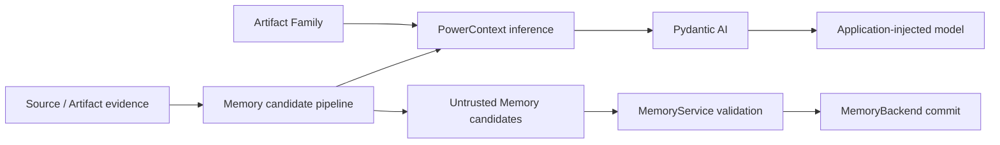

- Proposal Name: `pydantic_ai_inference_integration`
- Start Date: 2026-07-21
- RFC PR: [oceanbase/powercontext#16](https://github.com/oceanbase/powercontext/pull/16)
- Tracking Issue: Not assigned
- Related RFC: [RFC 0002: Core SDK Product Model](0002_core_sdk_product_model.md)
- Related RFC: [RFC 0014: Memory Layer Design](0014_memory_layer_design.md)

# Summary

PowerContext selects Pydantic AI as its unified model integration framework. The first phase uses it in Memory: a
generation model extracts Memory candidates from Agent turns, task results, and other bounded evidence, while an
embedding model generates vectors for Memory retrieval. Artifact Families such as Handoff can reuse the same model
integration capabilities later.

The core boundary in this RFC is that Pydantic AI calls models, each Artifact Family defines the domain task for the
model, and the existing Service validates and persists the result. Model output is only a candidate and cannot become
an authoritative Artifact directly.

# Motivation

RFC 0014 already defines Memory versioning, lineage, writes, and retrieval, but it leaves two model entry points
unspecified:

1. How to determine what is worth remembering across tasks from an unstructured work process.
2. How to call an embedding model to support vector retrieval.

If Memory, Handoff, and other Artifact Families integrate OpenAI, Anthropic, and other providers independently, they
will duplicate authentication, client, error, and observability logic. PowerContext also does not need to build another
provider SDK. Pydantic AI provides a unified integration framework that reduces duplicate work and constrains model
results through structured output.

# Guide-level explanation

## Design decisions

## Unified integration with domain isolation



The layers have the following responsibilities:

| Layer | Responsible for | Not responsible for |
| --- | --- | --- |
| Pydantic AI | Model calls, provider integration, structured results | Memory rules, Artifact writes |
| `inference` | Generic generation/embedding capabilities, errors, and usage | Artifact-specific prompts |
| Artifact Family | Prompts, input boundaries, output meaning | Provider clients, database transactions |
| Service/backend | Domain validation, versions, lineage, concurrency, and persistence | Understanding natural language |

PowerContext does not make `MemoryService` depend directly on a Pydantic AI Agent, and it does not let a model access a
backend, the file system, or arbitrary tools. The application composition layer explicitly selects models and provides
credentials. PowerContext does not read model configuration implicitly.

## Split by model capability

The shared layer provides separate capabilities for structured generation and embedding instead of one universal
`Model` with every method:

- `StructuredGenerator`: accepts a task defined by an Artifact Family and returns a structured result.
- `EmbeddingModel`: accepts a batch of text and returns vectors for a fixed profile.

Memory can use both capabilities, while other Artifacts can select only the capability they need. If reranking is added
later, it should be a separate capability rather than an extension to a universal base class.

## Code layout

`[new]` means created in the first phase. `[existing]` means reused or adjusted:

```text
src/powercontext/
├── inference/                      [new]
│   ├── __init__.py                 [new]
│   ├── errors.py                   [new]
│   ├── models.py                   [new]
│   ├── protocols.py                [new]
│   └── pydantic_ai.py              [new]
└── memory/                         [existing]
    ├── prompts.py                  [new]
    ├── extraction.py               [new]
    ├── candidates.py               [existing]
    ├── protocols.py                [existing, reuses generic model capabilities]
    ├── service.py                  [existing]
    └── backends/                   [existing]

tests/
├── inference/                      [new]
└── memory/                         [existing, adds extraction tests]
```

Only `inference/pydantic_ai.py` imports Pydantic AI directly. Memory depends on the generic model capabilities, not on a
specific framework or provider SDK. `pydantic-ai` is an optional dependency; deterministic Memory writes and full-text
retrieval remain available when it is not installed.

## Phase one: LLM integration for Memory

## What the LLM solves

The existing `MemoryService` can store and manage Memory, but it cannot understand which parts of a conversation or
task result are worth reusing across tasks. The LLM is responsible for:

- extracting user preferences, confirmed decisions, constraints, expensive-to-rediscover facts, and unfinished work;
- excluding ordinary logs, temporary steps, information easily read from the code, speculation, and secrets;
- splitting topics that can change independently into separate entries;
- comparing evidence with current active entries and proposing an addition, revision, or no-op.

The LLM does not determine final truth and does not generate Revisions, IDs, hashes, or lineage. Those authoritative
operations remain the responsibility of Memory Service.

## Write flow

The runtime first persists the work material actually used by the operation as Source or Artifact evidence, then calls
Memory explicitly:

```python
updated_memory = await memory_service.remember(
    memory=repo_memory,
    sources=(task_outcome,),
    mode="extract",
)
```

```text
Persist evidence
    -> MemoryService reads current active entries
    -> Pydantic AI extracts structured candidates from evidence
    -> candidate pipeline converts them to MemoryEntryInput
    -> MemoryService validates evidence, entries, and the current Revision
    -> backend atomically commits a new Memory Revision
```

The model sees only the bounded evidence for the current operation and the current active entries. It does not see the
complete history, other Memories, the database, or arbitrary files. It can propose only three outcomes: add a topic,
revise a current topic, or save nothing. Deactivation and reactivation remain explicit `forget()` and `reactivate()`
operations.

`mode="append"` remains the explicit write path and does not call a model. Persisting a Source also does not create
Memory automatically; the runtime decides when to trigger extraction.

## Coding Agent example

Suppose the repository Memory already contains this rule:

```text
entry_verify: Run make check before committing code.
```

During a task, the user corrects the Coding Agent:

> New dependencies must be added with `uv add`; do not edit `pyproject.toml` directly. After dependency changes, run
> both `make check` and `make test`.

At the end of the task, the runtime persists the user message and task result as Sources, then calls
`remember(mode="extract")`. Pydantic AI combines those Sources with the current entry and returns two structured
proposals:

```text
ADD
  Add new dependencies with uv add; do not edit pyproject.toml directly.

REVISE entry_verify
  After dependency changes, run make check and make test.
```

These proposals are not yet Memory. The pipeline maps model references back to Sources from this operation and the
exact current entry version. `MemoryService` then validates the evidence, duplicate content, and current Revision. Once
validated, the result is:

```text
repo Memory Revision 8
├── entry_dependency v1: Add new dependencies with uv add; do not edit pyproject.toml directly.
└── entry_verify v2: After dependency changes, run make check and make test.
```

Later, another Coding Agent receives a task to add an HTTP client dependency. The runtime searches the repository
Memory and injects these two rules before the model call. The new Agent therefore uses `uv add` and runs `make check`
and `make test` when it finishes.

If a Source contains only a one-off log such as "Tests passed, 128 total," the model should return a no-op and Memory
should not create an empty Revision. The goal of LLM integration is not to save every turn, but to extract information
that will genuinely change future Agent behavior.

## Trust boundary

LLM output, Pydantic AI structured results, and the candidate pipeline all sit inside the untrusted boundary. The key
constraints are:

- The model can reference only evidence in the current input and current active entries.
- The model cannot generate Artifact, Revision, or entry-version identities.
- The model cannot write to a backend directly or call `forget()`.
- The prompt improves quality but is not a security boundary.
- Only candidates that pass existing Memory validation and head CAS can form a new Revision.

Therefore, valid structured output does not imply permission to persist it. This RFC does not change the Memory
persistence and consistency rules from RFC 0014.

# Reference-level explanation

## Embedding integration

Structured generation decides what should be remembered. Embedding decides how to find the saved content semantically:

```text
Write extraction: evidence -> generation model -> Memory candidates
Vector projection: Memory text -> embedding model -> vector projection
Vector query: query -> embedding model -> backend search
```

Pydantic AI performs model calls, while PowerContext remains responsible for embedding profiles and index
compatibility. Each deployment fixes the model, dimension, distance, and normalization. Queries and Memory projections
must use the same profile. Changing the embedding model or dimension still follows the RFC 0014 process: pause writes,
migrate, backfill completely, and validate. Old vectors cannot be reused silently.

The generation model and embedding model are independent. Memory can be written explicitly without a generation model,
and authoritative Memory can be committed and searched through full text without embedding. An available generation
model does not imply that vector capability is available.

## Failure, privacy, and observability

- A failed Memory extraction does not commit a Revision or disguise the failure as a no-op.
- If embedding is temporarily unavailable, authoritative Memory and its full-text projection can still be committed,
  and `auto` search falls back to full text.
- Timeouts, rate limits, and provider failures map to stable PowerContext inference errors, while cancellation continues
  to propagate.
- By default, only model identifiers, duration, usage, input/output counts, and error categories are recorded.
- Prompts, raw evidence, complete model responses, vectors, and credentials are not recorded by default.
- Memory lineage continues to reference the actual Source or Artifact evidence, not the raw model response.

## Phase-one scope and implementation

Phase one delivers:

1. A generic `inference` layer and Pydantic AI adapter.
2. Consolidation of the existing embedding port into the generic model capability while preserving RFC 0014 behavior.
3. A Memory-specific prompt and candidate pipeline.
4. A complete Coding Agent loop through `remember(mode="extract")`.
5. Fake/test-model coverage for structured generation, embedding, failures, and no-op behavior.
6. An integration example with explicit model injection.

Phase one does not implement Handoff generation, reranking, multimodal input, model routing, cross-provider fallback,
dynamic budgets, or online embedding-profile switching.

## Acceptance criteria

- Pydantic AI is the built-in unified model integration framework; Artifact Families do not integrate provider SDKs
  directly.
- The core package and deterministic Memory operations remain available without Pydantic AI installed.
- Memory provides the model with only bounded evidence and current active entries.
- The model can propose add, revise, and no-op, but cannot change authoritative state directly.
- Model failure creates no partial Revision, and embedding failure degrades according to RFC 0014.
- An incompatible embedding profile does not reuse old vectors or execute vector or hybrid search.
- The default test suite makes no network calls and requires no API key.
- Default tracing does not leak prompts, evidence, complete responses, vectors, or credentials.
- Future Artifact Families can reuse the inference layer without adding provider clients.

# Drawbacks

This design introduces an upstream Pydantic AI dependency, along with model-call latency, cost, data transfer, and
runtime failure modes. Structured output constrains format but cannot eliminate semantic model errors, so complete
domain validation remains necessary.

# Rationale and alternatives

The following alternatives were considered:

- **Use Pydantic AI directly in every Family:** Less code initially, but third-party types and duplicate integration
  spread into the domain layer.
- **Build provider adapters in PowerContext:** More control, but high maintenance cost and duplication of Pydantic AI's
  responsibilities.
- **Build a model layer only for Memory:** Faster in phase one, but Handoff and other later capabilities would require
  the same infrastructure again.
- **Do not integrate a model:** Deterministic paths remain available, but callers must manually convert unstructured
  work processes into Memory.

# Prior art

Pydantic AI supplies the provider, model lifecycle, structured output, usage, and embedding interfaces used by this
integration. PowerContext adds the domain validation and persistence boundary specific to its Artifact Families.

# Unresolved questions

- The Pydantic AI version range to pin when this RFC is accepted.
- Whether Pydantic AI supports the target embedding models sufficiently for phase one, and which models to support
  first.
- `EmbeddingModel` is the canonical embedding model interface name; the first release does not keep a legacy compatibility
  alias.
- Whether the Memory prompt version should be included in operation telemetry.

# Future possibilities

Later work may add Handoff and summary generation, reranking, multimodal evidence, model routing, and online
embedding-profile migration. These capabilities continue to reuse the shared integration layer, while each Artifact
Family still owns its prompt, input boundaries, validation, and persistence rules.
