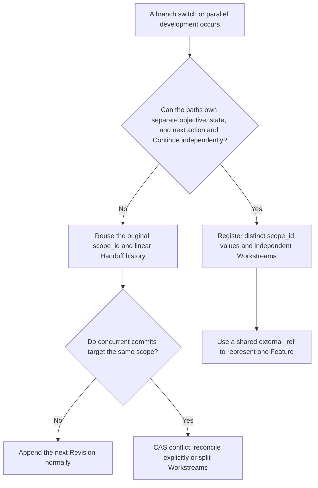
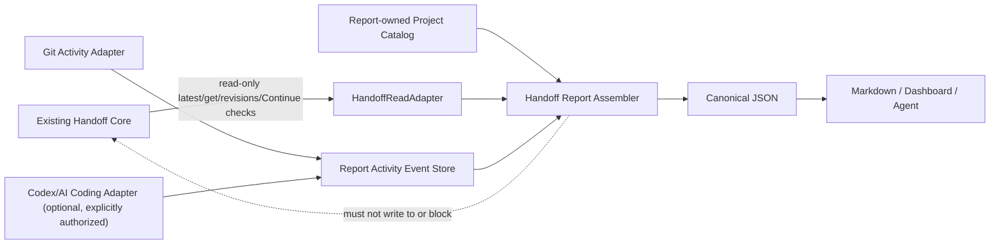
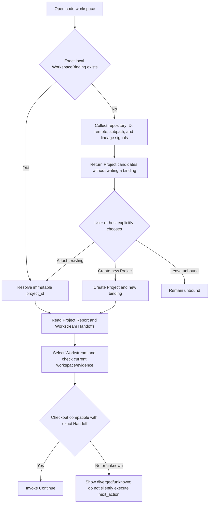
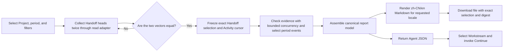
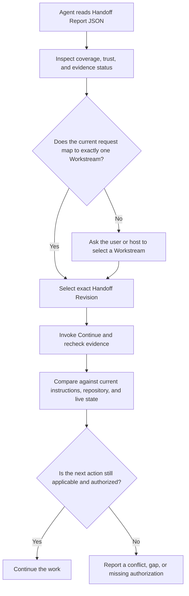

- Proposal Name: `handoff_report`
- Start Date: 2026-08-04
- Status: Draft
- RFC PR: [oceanbase/powercontext#82](https://github.com/oceanbase/powercontext/pull/82)
- Tracking Issue: Not assigned
- Related RFCs: [RFC 0001](0001_product_definition_and_vision.md), [RFC 0002](0002_core_sdk_product_model.md), [RFC 0019](0019_local_source_memory_runtime.md), [RFC 0020](0020_runtime_backed_memory_remote_access.md), [RFC 0028](0028_context_pack.md), and [RFC 0048](0048_handoff_artifact.md)

# Summary

This RFC defines Handoff Report as a traceable projection of the committed Handoff in one `scope_id`, for both human readers and Agents that need to continue the work. Both report identity and query dimension are `scope_id`; committing a Handoff makes that scope discoverable without creating a Project or registering a Workstream first.

Existing Project fields in `ProjectDescriptor`, the Project catalog, WorkspaceBinding, and Activity Event are retained for data and HTTP compatibility, but do not participate in scope discovery, report selection, or report generation. The canonical response uses a fixed compatibility placeholder Project until that schema is revised; callers must not use it as project identity. Tasks, Agents, Sessions, Git branches, status, time, and external Issues remain filtering, navigation, or attribution dimensions rather than replacements for `scope_id`.

Every report produces two projections from one versioned canonical report model:

- the human projection is `zh-CN` or `en` Markdown, defaulting to `zh-CN`, for Dashboard display or download;
- the Agent projection is JSON and retains exact Handoff Revisions, the original Handoff content, evidence checks, and trust markers.

An Agent does not need to and should not reverse-parse Markdown. Markdown and JSON must come from the same exact selection vector and cannot be generated as independent summaries. The Dashboard dynamically reads the latest committed Handoffs by default. An export carries the exact selection and its digest, but the initial version does not persist a second Report Snapshot lifecycle inside PowerContext. A status report may show a current handoff or compare Handoff Revisions at weekly or monthly boundaries. The initial version supports `zh-CN` and `en` Markdown locales plus language-neutral canonical JSON, but not cross-Project aggregate reports, HTML, PDF, or public sharing links.

The initial version generates reports through one `get_handoff_report` operation with required `scope_id`. `format=markdown` is the default human projection, `format=json` returns the canonical model used by the Dashboard and Agents, and `download` controls only response disposition. Optional `project_id` remains for old-request compatibility and is ignored. Every report carries a locale-independent `selection_digest` and an output-specific `report_digest`.

Handoff Report is an optional, read-only, independently removable Builtin Runtime feature. It enumerates reportable `scope_id` values from Handoff artifact heads and reads exact Handoffs through `HandoffReadAdapter`. It does not modify the Handoff commit path or invoke a model to create a Report Project. A Report failure or disable must not affect Source, Memory, Context, Handoff, or Continue.

## Review focus

Reviewers should focus on whether the following decisions are sufficiently specified for implementation:

- **Hierarchy and identity boundaries**: whether Project is the right largest formal hierarchy initially; whether Workstream should reuse `scope_id` without a second identity; and whether `external_refs` is sufficient as a weak cross-Project association.
- **Branch and parallel-work boundaries**: whether Branch remains outside Handoff identity; whether branch switches, renames, and rebases reuse one Workstream while independently continuable parallel branches require distinct `scope_id` values; and whether same-scope concurrency should retain one linear history with CAS conflict.
- **Responsibility relative to existing RFCs**: whether Project catalog belongs only in the Builtin Runtime application layer; and whether Report remains a read-only projection over RFC 0048 Handoffs without a new Artifact, Snapshot, or Continue lifecycle.
- **Consistency and reproducibility**: whether two-pass head collection, catalog snapshots, Activity cursors, and exact selection vectors provide an implementable optimistic-stability contract on SQLite and OceanBase, and whether the JCS/NFC digest contract is sufficient for cross-language implementations.
- **Isolation and rollback boundary**: whether Report depends only on stable Handoff reads; whether disabling the feature registers no Report routes or workers; whether all new tables are Report-owned; and whether Report failures remain outside Handoff commit and Continue.
- **Period and activity time semantics**: whether `occurred_at`, `observed_at`, `time_basis`, unknown-time events, and temporal coverage support user-selected week, month, and custom periods without presenting first observation as Handoff commit time.
- **Activity without Handoff**: whether Git, Codex or another AI coding Session, and local working-tree activity can produce `activity_without_handoff` through explicitly authorized adapters while generated summaries remain cited, untrusted, and unable to create a disposition or authorized next action.
- **Weekly/monthly comparison semantics**: whether exact baseline/end selections and historical catalog descriptors are implementable, whether Workstream additions, removals, and archival changes are complete, and whether the “no new Revision does not mean no work” and `baseline_unknown` degradation rules are clear.
- **API and consumer boundaries**: whether canonical JSON is sufficient for Dashboard, Python Client, CLI, and MCP; and whether `zh-CN`/`en` Markdown should remain deterministically rendered rather than generated or parsed by an Agent.
- **Localization boundary**: whether two versioned renderers cover fixed headings, status labels, dates, and notices; and whether user-provided Handoff/Project/Workstream text should remain untranslated.
- **Security and compatibility**: whether treating Project membership as non-ACL, retaining `untrusted_history`, and explicitly degrading unavailable adapters and unknown historical time fits the existing trust-domain contract and migration requirements.
- **Workspace rebinding**: whether per-worktree `workspace_instance_id` state, local path fingerprints, repository candidate signals, and explicit attach/detach correctly handle directory renames, linked worktrees, reclones, copies, forks, and monorepos while making clear that locating a Project does not mean Handoff data is available.
- **Performance and bounds**: whether bounded evidence-check concurrency, explicit skip semantics, the 10 MiB output limit, and batch-export guidance adequately protect local and remote Runtimes for 100-Workstream reports.

# Motivation

RFC 0048 explains how one scope is handed off at a session boundary, but deliberately leaves task/work identity, parallel workstreams, Dashboard, export, and transport schemas to later RFCs. A real vibe coding project commonly has several Features in progress at once. A single Handoff can let an Agent continue one stream of work, but it cannot answer common project-owner questions:

- Which workstreams exist across the project, and what is the state of each one?
- Which work is blocked, complete, or ready to continue?
- What is the next action for each workstream, and what evidence supports it?
- Which Agent or Session produced the most recent formal handoff?
- How can the current project state be downloaded as a reviewable, archivable document?
- How can a new Agent read the same information without weakening RFC 0048's evidence and trust boundary?

Simply concatenating multiple Handoffs into Markdown creates two problems. First, Markdown has no stable machine contract, so an Agent must guess at heading and text structure. Second, if the Dashboard, exported file, and Agent input invoke generation separately, they may produce contradictory summaries. This RFC therefore defines canonical JSON first and derives Markdown with a deterministic renderer:

```text
Project + Workstream registry + exact committed Handoffs
                         |
                         v
             canonical Handoff Report
                    /            \
                   v              v
       zh-CN/en Markdown      Agent JSON
        Dashboard/export     inspect/select/continue
```

# Guide-level explanation

## Choosing the scope boundary

The initial version separates its main hierarchy from supporting dimensions:

| Dimension | Meaning | Forms a Handoff scope |
| --- | --- | --- |
| Project | A repository, service, product component, or long-running project; the largest formal hierarchy and aggregation boundary initially | No; it only aggregates Workstreams |
| Workstream | An independently continuable Feature, Bug, refactor, operation, or research effort | Yes; its identity is `scope_id` |
| External reference | An optional Issue, task, PR, branch, upstream Feature, release, or similar association | No; used only for navigation and filtering |
| Handoff Revision | An immutable Workstream transfer milestone | Uses the existing Handoff Artifact Revision |
| Agent/Session | Optional attribution for the producer of a milestone | No; it is not evidence or a permission identity |

Use one simple rule to choose a Workstream boundary: if two parts of the work can have different objectives, dispositions, and next actions, and different Agents can continue them independently, they should use different Workstreams and different `scope_id` values. A brief operation is usually a Task within a Workstream. The whole repository is usually a Project rather than one Workstream. A small Project may have only one Workstream.

A Workstream `kind` is `feature`, `bug`, `refactor`, `operations`, `research`, or `other`. The kind is only a display and filtering property; it does not change Handoff behavior. In the initial version, one `scope_id` belongs to exactly one Project. There is no separate `workstream_id` with the same one-to-one lifetime.

A consumer product usually has one Project, while an enterprise can have several Projects. The initial version does not model a cross-Project Feature as a domain entity. Each Project creates only the Workstreams it can continue independently. For example, one checkout requirement may produce `checkout-api`, `checkout-web`, and `checkout-observability` Workstreams, each of which may use a generic `external_refs` entry to point to the same upstream requirement. That shared reference does not form another PowerContext hierarchy. Evidence, Handoff history, Report, and Continue remain within their Project and scope boundaries. Cross-Project aggregation requires additional authorization, data-residency, and consistency design and is deferred to a separate RFC after demand is demonstrated.

Project grouping and Workstream presentation metadata are persisted only after explicit user confirmation. They form a lightweight scope catalog in the Builtin Runtime application layer, do not enter Core Protocol, and do not own the lifecycle of an Issue, Task, repository, or Feature. A Dashboard or host may suggest a mapping from ungrouped scopes, the latest Handoff objective, a branch, or an Issue, but a suggestion never creates a relationship and cannot automatically move an existing scope.

### Git branch and Workstream boundaries

A Branch does not define a Handoff boundary; a Workstream does. The Server never creates, merges, or migrates a Workstream merely because a branch is created, switched, renamed, deleted, or rebased. Reusing a `scope_id` depends only on whether the work retains one objective, disposition, state, and next action and can be safely continued by an Agent along one history.

| Scenario | Workstream/Handoff rule |
| --- | --- |
| The same work moves from branch A to branch B, including a temporary branch, PR branch, or post-rebase branch | Reuse the same `scope_id` and Handoff history; a branch-name change alone creates no Revision |
| Two branches try different implementations in parallel and can decide status and next action independently | Create two Workstreams and two `scope_id` values, each with its own Handoff history |
| `main` and a long-term maintenance branch continue separate development or release work | Create separate Workstreams even when both reference one Feature or Issue |
| Frontend, backend, or storage variants of one Feature can advance independently | Create several Workstreams and associate them through the same Feature/Issue `external_ref` |
| Two branches have different objective, disposition, state, or next action | They must be split; two heads cannot be compressed into one Handoff |



If several Agents use one `scope_id` for two active branches, the system still has one linear Handoff history, one current Revision, and one latest state. Concurrent commits use RFC 0048 CAS: the first advances the head, while the second receives a conflict and must explicitly reconcile against the new head or register a new Workstream after confirming that the paths are independently continuable. A Report neither auto-merges them nor presents two branch heads for one scope.

A Branch has only these supporting roles:

- `external_refs(kind=branch)` associates a Workstream with a branch for navigation or filtering;
- a branch in workspace detect is a weak candidate signal and cannot claim a Project or Workstream;
- a Report Activity Event may record branch/head observed by the host after a Handoff commit as untrusted display and diagnostic context; it is non-atomic with the Handoff Revision and cannot participate in identity, ACLs, CAS, coverage, or evidence validation.

Continue validation uses exact Handoff evidence and a verifiable relationship to the current checkout. A different branch name alone cannot produce `diverged`, and an equal branch name cannot produce `aligned`. Exact commit/evidence that resolves to the same, ahead, or behind position on a compatible history may produce `aligned`, `ahead`, or `behind`; an incompatible fork produces `diverged` and prevents silent execution of the old `next_action`.

### Boundaries with existing RFCs

| Existing RFC | Definition reused here | Explicitly not added or changed here |
| --- | --- | --- |
| RFC 0001 | PowerContext gives Agents verifiable, continuable project context | A Report is a product view, not a new source of truth for management status |
| RFC 0002 | `scope_id` remains the Core SDK isolation and routing identity | Project does not enter the Core Protocol; Workstream gets no second identity |
| RFC 0019 | The Builtin Runtime supplies Source, Memory, and relational persistence foundations | The Project catalog changes no Source/Memory semantics and does not concatenate raw bodies into reports |
| RFC 0020 | The initial deployment inherits the single trust domain and current remote-access contract | Project membership is not an ACL, and this RFC creates no multi-tenant authorization model |
| RFC 0028 | Context Pack continues to assemble context for one Agent turn | Report does not enter `prepare_context`, inject itself, or replace Context Pack |
| RFC 0048 | Handoff Artifact, Revision, evidence, disposition, and Continue remain Workstream handoff facts | Report is a cross-scope read-only projection and does not duplicate Handoff history, Artifact lifecycle, or Continue |

This RFC therefore adds an application-layer Report Project catalog, an independent Activity Event Store, and a deterministic report projection. It adds no Handoff Revision metadata, does not redefine RFC 0002's Core product model, and creates no handoff object parallel to RFC 0048. The Report module cannot require changes to Core Protocol, Artifact identity, Prepared Handoff, commit requests, Handoff persistence, or the trust-domain contract. An enhancement requiring those changes needs a separate RFC and cannot be hidden in Report implementation.



## Workspace discovery and Project binding

A Project is not identified by title, directory name, repository name, or branch. `project_id` is the server-generated immutable identity, `project_key` is a human-readable key unique within the current catalog, and `title` is display text that may be duplicated or changed. An Agent that already has a `scope_id` resolves `project_id` through the Workstream catalog. A newly opened code workspace instead uses `WorkspaceBinding` to bind the current checkout explicitly to a Project.

The host generates a `workspace_instance_id` for each checkout or linked worktree. A Git host stores it under that worktree's own Git directory, for example by resolving the worktree-specific directory with `git rev-parse --git-dir` and writing untracked PowerContext client state there. It must not rely only on shared local Git config because linked worktrees share that configuration. A non-Git host uses its own workspace registry. Renaming the directory does not change this ID.

The local client registry also stores a `host_instance_id`, canonical-path fingerprint, and Git-directory fingerprint. These values remain local and never upload the raw path. If a copy contains the same token, or one token appears under different local path/Git-directory fingerprints at the same time, the host rotates a new `workspace_instance_id` for the copy and requires confirmation again rather than silently sharing one workspace identity. A changed path fingerprint with continuous Git-directory identity is treated as a rename and does not rotate the ID.

Without an exact local binding, `detect` returns Project candidates and writes nothing. Candidate signals have these strengths:

| Signal | Strength | Use |
| --- | --- | --- |
| Confirmed local `workspace_instance_id -> project_id` | exact | Restore the binding directly, then revalidate the workspace |
| Immutable Git-provider repository ID + monorepo subpath | strong | Recommend an existing Project |
| Credential-free normalized remote URL + subpath | strong | Recommend when a provider repository ID is unavailable |
| Git commit lineage, a shared external reference, or `project_key` | weak | Rank candidates only |
| title, directory name, repository display name, or branch | weak | Explain candidates only; never claim a Project alone |

No candidate grants access, regardless of strength. Except for an exact local binding, the user or host policy explicitly chooses “attach to existing Project,” “create new Project,” or “leave unbound.” A copied, forked, or remote-modified workspace is inherently ambiguous and cannot inherit Project identity or Handoff history from file similarity alone.



Typical cases follow these rules:

| Case | Result |
| --- | --- |
| Rename only the local directory | Preserve the local binding and original `project_id` |
| Recloning the same repository, including the original branch | Return the existing Project as a candidate; read its Handoffs only after explicit attach; branch only helps suggest a Workstream |
| Download a ZIP or another source package without Git metadata | No reliable repository candidate exists; the user selects an exact `project_id` or `project_key`, and directory name is display help only |
| `cp` a directory containing `.git` | Give the copy a new `workspace_instance_id` and ask whether it is a new workspace for the existing Project or a new Project |
| Fork to a new remote | Recommend a new Project by default; an origin external reference may remain, but Handoff history is not inherited automatically |
| Monorepo | Distinguish Projects by provider repository ID or normalized remote plus normalized subpath |
| Same name without a reliable repository relationship | Do not associate automatically even when title or directory name is identical |

Binding answers only “which Project should be queried”; it does not transport Handoff data. After a reclone, Handoffs are available only if the Client can access the same Runtime/catalog that stores the Project. If history exists only in another machine's local SQLite, the system reports `handoff_data_unavailable` rather than pretending Git restored it. Cross-Runtime export/import or Project-history copy requires separate design.

Attach also does not authorize execution of an old handoff. Continue checks exact Handoff evidence against the current checkout and Source adapter and reports `aligned`, `ahead`, `behind`, `diverged`, or `unknown`. Non-`aligned` states need not all block Report reading, but a `diverged` state, missing exact evidence, or policy requiring reconfirmation prevents silent execution of an old `next_action`.

## Project-level Dashboard

Handoff Report reuses the Server's FastAPI and Jinja Web UI host and exposes a separate `/handoff-reports` page. It pages through exact `scope_id` values with committed Handoff heads via `list_handoff_report_known_scopes`, then loads the selected scope through `get_handoff_report`. The scoped-statistics Dashboard remains unchanged at `/`. Disabling the Handoff Report feature removes the page, Report routes, and its static execution path.

Project Overview shows the latest committed Handoff for every included Workstream by default and includes:

- report generation time, coverage, and the exact selection;
- counts for `continuable`, `blocked`, `complete`, and `no_handoff`;
- a Workstream table ordered with blockers first;
- each Workstream's objective, current state, disposition, next action, and omissions;
- exact evidence references and their readability checks;
- Git, Agent/Session, branch/head, and local-code activity observed by Report Activity Adapters, together with its time basis;
- work-status coverage and reporting-quality coverage, so a partial record is not presented as complete project state;
- controls to view Markdown, download `.md`, and generate weekly, monthly, or two-selection comparisons.

Status must use text and an icon in addition to color. A Workstream without a committed Handoff shows `no_handoff`; if a Report Adapter still observes activity, it additionally shows `activity_without_handoff`, and the activity summary cannot masquerade as a formal handoff. Time-comparable Activity Events after an existing Handoff produce `activity_after_handoff` and an event count. The count represents only events captured by Report; it is not a commit count, Task count, duration, complete Source coverage, or completion percentage. Missing reliable time, an unavailable adapter, or history predating Report enablement produces `unknown`. The Dashboard does not infer formal progress from branch names, file mtimes, Memory, or incomplete Session history.

The Dashboard has three core pages:

1. Project Overview aggregates and filters Workstreams.
2. Workstream Detail shows the current Handoff, evidence checks, and the Revision history for that scope.
3. Periodic Report shows formal Handoff changes, observed code/Session activity, time confidence, coverage gaps, and previous-period comparison for a week, month, or custom time window.

Filters support Workstream `kind`, Handoff `disposition`, Activity source, Agent label, external reference including `kind=branch`, time basis, and whether archived Workstreams are included. A filtered report must show `selected_workstreams` and `total_included_workstreams`; it cannot present a partial result as the complete Project. At any report boundary, one Workstream appears with at most one exact Handoff Revision or `no_handoff`; a Report never duplicates one scope by branch.

The Dashboard scope list comes from Handoff artifact heads rather than UI inference or the Project catalog. It includes opaque `scope_id` values with at least one committed Handoff in the current Runtime, creates no Project membership, and does not include scopes that only have Source or Memory data. `list_handoff_report_known_scopes` deduplicates, orders, and paginates these exact identities.

## Dynamic reports and exact selections

The Dashboard report is dynamically generated by default. The Report module uses its read-only adapter to collect candidate Workstream Handoff heads twice. Equal vectors freeze an `optimistic_stable` exact selection; unequal vectors cause bounded retries, and continuing changes return `handoff_report_busy`. The Report also freezes an Activity Event cursor in its own database transaction. Later Handoff commits or Activity capture cannot change the frozen exact Handoff refs and activity cursor. Returned Markdown/JSON includes the selection, normalized filters, selection consistency, activity cursor, selection digest, and report digest, so the file can be reviewed, archived, or supplied later as an exact baseline.



The initial version does not store a Report Snapshot in the PowerContext database. A report is a read-only projection in the Runtime application layer, not a Source, Artifact, or new evidence. A caller that needs long-term retention saves the exported Markdown/JSON. PowerContext can compare an exact selection supplied again by the caller, but does not automatically import that external file into any scope. Server-side Project snapshots require a later RFC for Project-level Artifact identity, cross-scope provenance, retention, and authorization rather than a parallel Artifact lifecycle.

## One report for humans and Agents

Markdown has this fixed structure:

```markdown
---
schema: powercontext.handoff-report.v1
locale: zh-CN
format: markdown
project_id: prj_01K...
project_key: powercontext
report_kind: handoff
selection_digest: sha256:...
report_digest: sha256:...
trust: untrusted_history
---

# PowerContext 项目交接报告

## 项目概览
## 阻塞事项
## Workstream 状态
## Workstream 详情
### parser-error-handling (PC-142)
#### 目标
#### 当前进度
#### 下一步
#### 缺失信息
#### Evidence
## 报告元数据
```

`locale=en` uses the same semantic order and these English headings:

```markdown
---
schema: powercontext.handoff-report.v1
locale: en
format: markdown
project_id: prj_01K...
project_key: powercontext
report_kind: handoff
selection_digest: sha256:...
report_digest: sha256:...
trust: untrusted_history
---

# PowerContext Project Handoff Report

## Project Overview
## Blockers
## Workstream Status
## Workstream Details
### parser-error-handling (PC-142)
#### Objective
#### Current Progress
#### Next Action
#### Omissions
#### Evidence
## Report Metadata
```

Both renderers preserve the same section keys, semantic order, and canonical fields. They localize only fixed headings, status labels, date formats, and system notices. User-authored Handoff statements, Project/Workstream titles, objectives, next actions, omissions, and external references remain in their original language. The initial version invokes no model or translation service. Canonical JSON field names, enum values, and the Agent contract do not vary by locale.

YAML front matter helps people and tools identify a report, but it is not the stable Agent parsing interface. A Workstream level-three heading is always `<title> (<key>)`; when key is absent it uses a collision-free scope short identifier, so duplicate titles remain addressable. Text from Handoffs and user metadata is escaped as untrusted plain text. Only typed references can produce links.

An Agent reads the JSON projection of the same report. The project-level report gives the Agent global context and helps it select a Workstream, but does not authorize execution of multiple next actions. Before work continues, the host or user must select a Workstream. The Agent then invokes RFC 0048's Continue path with the exact Handoff Revision from the report and compares it with the current request, repository, and live tool results:



An `objective` in a Project report remains historical information. It does not replace the current request or let an Agent choose priorities automatically.

## Export and display

The Dashboard and downloads use one `get_handoff_report` operation. The Dashboard requests `format=json` and renders the canonical model; its Markdown tab and file download use the server-side renderer. Omitted `format` means `markdown` and returns `text/markdown; charset=utf-8`. `download=true` adds only a safe `Content-Disposition` filename and does not change the selection or report content. Explicit `format=json` returns the canonical report as `application/json`. Display and download therefore do not drift into duplicate operation semantics.

The initial version accepts `locale=zh-CN` and `locale=en`. An explicit locale controls rendering. If omitted, the service uses the Project `default_locale`; a new Project defaults to `zh-CN`, and an old Project missing the field migrates to `zh-CN`. Any other locale returns `unsupported_report_locale` without silent fallback. Dashboard fixed labels and Markdown downloads use the same locale. JSON retains the locale as projection metadata but does not translate canonical fields. HTML, PDF, DOCX, and public sharing links are out of scope for the initial version.

## Project handoff, weekly reports, and monthly reports

One canonical model supports two `report_kind` values:

| kind | Purpose | Selection |
| --- | --- | --- |
| `handoff` | Show current reported project state available to a human or Agent | One optimistic-stable or caller-provided exact Handoff selection plus an Activity cursor |
| `periodic` | Show formal handoff changes and observed activity over a week, month, or custom period | Period Activity Event selection plus optional exact/observed Handoff baseline and end |

A `periodic` request carries `period.start`, `period.end`, an optional IANA `timezone`, and optional `compare_to_previous_period`. Timezone precedence is explicit request timezone, then Project `timezone`; the service never reads the Server, process, or browser local timezone. Missing or invalid values at both levels produce `invalid_report_period`. A weekly report uses an ISO week by default; a monthly report uses the calendar month in the selected timezone.

Period filtering uses only explicit Report Activity Event time semantics. `source_reported` uses a source-provided time, `host_observed` uses host capture time, `first_seen` means only the first Report observation, `current_only` belongs only to current uncommitted activity, and `unknown` contributes to unknown-time coverage. Git commit time, Codex Session time, and Agent-reported time are not audit timestamps and the report must display their `time_basis`. File mtimes, Revision numbers, and the current branch cannot reconstruct historical dates.

Existing Handoffs have no authoritative commit timestamp. Periodic reports therefore have only three Handoff temporal bases: `exact_input` when the caller supplies exact baseline/end selections, `observed` when the Report Activity Store has an observation carrying the exact Handoff ref, or `baseline_unknown`/`end_unknown`. An `observed_at` value cannot be named or displayed as `committed_at`. An unknown Handoff boundary does not prevent Git/Session activity aggregation for the same period and does not permit current latest to impersonate a historical end state.

Weekly and monthly Markdown has these fixed sections:

1. Period overview and reporting coverage.
2. Formal Handoff changes; only an exact/observed Handoff disposition change may enter reported completion.
3. Git commits, working-tree state, Codex/AI coding Sessions, and other observations from enabled adapters.
4. `activity_without_handoff`, `unassigned_activity`, and unknown-time activity.
5. Before/after objective, disposition, state, next action, and omissions only when Handoff temporal coverage is sufficient.
6. Next-period actions taken strictly from exact/observed end-of-period Handoff `next_action` values.
7. Known omissions, unavailable evidence or adapters, time basis, and historical coverage gaps.
8. An optional cited `generated_untrusted` narrative summary.

`PeriodChangeSummary` also lists Workstream membership changes explicitly: `added`, `removed`, `archived`, and `unarchived`, retaining descriptor snapshots at both boundaries. Both sides of a periodic report use the same normalized filters. “Removed” means the scope is no longer in the end Project selection, not that its Handoff history was deleted. To support this semantic, every successful Project/Workstream descriptor CAS appends an immutable catalog revision with server-owned `effective_at`; the temporal selector reads the descriptor at each boundary. A legacy catalog row with only a current value reports `catalog_baseline_unknown`.

Comparison uses only deterministic changes in exact references, Report Activity Events, and fields. It does not ask a model to infer causes, effort, or completion percentages. A period with no new Revision means only “no newly observed formal handoff,” not “no work occurred.” An optional narrative must be marked `generated_untrusted`, and every claim must cite an exact Handoff, Activity Event, Git commit/diff, or Session event. It cannot set disposition, claim code correctness, create an authorized next action, or override canonical fields.

# Reference-level explanation

## Domain model

### Project and Workstream

```text
ProjectDescriptor
  schema: "powercontext.project.v1"
  project_id: stable opaque id
  project_key: catalog-unique human-readable key
  title: human-readable title
  description: optional plain text
  default_locale: "zh-CN" | "en"
  timezone: IANA timezone used by periodic reports
  catalog_state: included | archived
  version: CAS version

WorkstreamDescriptor
  schema: "powercontext.workstream.v1"
  scope_id: canonical Workstream identity and Runtime routing key
  project_id: owning report group
  key: optional human-readable short key, not identity
  title: human-readable title
  kind: feature | bug | refactor | operations | research | other
  catalog_state: included | archived
  external_refs: optional typed external references
  labels: optional display/filter labels
  version: CAS version
```

Project and Workstream descriptors are mutable report-catalog records, not Artifacts, and do not own an external Project or Task lifecycle. Updating a title, labels, or catalog state does not change an existing Handoff Revision, but every successful CAS update appends an immutable catalog revision with server-owned `effective_at` for periodic membership and name reconstruction. A report contains descriptor snapshots observed during generation, so a retained external file does not change after a later rename. Archiving a Project or Workstream does not delete its scope or Handoff history. `list_projects`, detect candidates, and dynamic reports exclude archived records by default; `include_archived=true` includes them explicitly, while exact `get_project` may still return an archived Project.

The Server generates `project_id`, which is immutable and unique within one Runtime/catalog. `project_key` is unique in the same catalog and supports CLI, URL, and human selection. Changing a key requires CAS and conflict checking but cannot change `project_id`. A non-null Workstream `key` is unique within its Project, may change, and is not identity. CLI may accept `project_key/workstream_key` for convenience but resolves and echoes exact `project_id`/`scope_id`; HTTP relationships and selections accept exact identity only. A `title` may be duplicated or changed. Internal API relationships, Workstream membership, Handoff Report selections, and persistence foreign keys use only `project_id` and `scope_id`, never key or title as identity.

`external_refs` is a bounded array of `{kind, provider, external_id, url?}`. Its `kind` is `issue`, `task`, `pull_request`, `branch`, `feature`, `release`, `program`, or `other`. Workstreams in different Projects may reference the same upstream object, but a reference supports only navigation and filtering. It establishes no parent hierarchy inside PowerContext and is not Handoff evidence. A statement that needs support must still use a citation defined by RFC 0048.

### WorkspaceBinding

```text
WorkspaceBinding
  schema: "powercontext.workspace-binding.v1"
  workspace_instance_id: opaque id for one local checkout
  project_id: exact owning Project identity
  repository_ref:
    provider: github | gitlab | local | other
    repository_id: optional immutable provider repository id
    normalized_remote: optional credential-free normalized remote
    subpath: optional normalized repository-relative project root
  state: confirmed | detached
  confirmed_at: UTC timestamp
  version: CAS version
```

One workspace has at most one confirmed Project binding at a time; one Project may have several workspace bindings. A candidate is not a persisted binding, and only explicit attach writes one. `workspace_instance_id` is not a Project, scope, ACL, or cross-device identity; it only distinguishes local checkouts. Detach removes the relationship without deleting a Project, scope, or Handoff.

The first attach uses expect-absent CAS: request `expected_version=null` explicitly means the caller observed no binding, and it succeeds only if the Server still has no confirmed or detached record for that `workspace_instance_id`. An existing record produces `workspace_binding_conflict`. Later attach/detach requests carry an exact non-null version.

`repository_ref` is a discovery hint, not identity or evidence. Before sending it, the Client removes remote user info, tokens, and query secrets. The Server does not retain raw absolute paths. Branch, HEAD commit, and commit lineage may be transient detect-request signals but do not enter binding identity. Candidate matching uses versioned normalization for provider, remote, and subpath so different Clients produce consistent results.

### Independent Activity Event Store and adapters

The existing Handoff Artifact has no commit timestamp, Source coverage, or participant fields, and this RFC does not modify it. Period and no-Handoff activity is represented by the Report module's own `ReportActivityEvent`:

```text
ReportActivityEvent
  schema: "powercontext.handoff-report-activity.v1"
  event_id: server-generated stable id
  project_id: owning Report Project
  scope_id: optional explicitly associated Workstream
  source: handoff_observation | git_commit | git_worktree | coding_session | other
  source_event_id: adapter-stable idempotency key
  source_ref: optional typed external reference
  occurred_at: optional source-provided timestamp
  observed_at: server UTC ingestion timestamp
  time_basis: source_reported | host_observed | first_seen | current_only | unknown
  title: optional untrusted display text
  summary: optional untrusted source summary
  agent:
    provider: optional host provider
    label: optional display label
  session_id: optional opaque source session id
  vcs_context:
    branch: optional untrusted display label
    head_revision: optional opaque VCS revision
  evidence_refs: bounded typed references
  trust: "untrusted_observation"
```

The Report repository enforces uniqueness on `(source, source_event_id)` so adapter retries are idempotent. The Report Server writes `observed_at`; adapters provide `occurred_at` and `time_basis` without changing source semantics. A confirmed WorkspaceBinding associates events with a Project. An event belongs to a Workstream only when the adapter or host explicitly provides a `scope_id` that belongs to the Project. Otherwise it remains Project-level `unassigned_activity`; branch names, paths, Session titles, and models cannot guess its Feature.

The initial version defines two read/ingestion ports:

```text
HandoffReadAdapter
  latest(scope_id) -> Handoff | null
  get(scope_id, exact_ref) -> Handoff
  revisions(scope_id) -> ordered Handoff[]
  check_evidence(scope_id, exact_ref) -> checks

ActivitySourceAdapter
  scan(project_binding, after_cursor) -> events + next_cursor
```

`HandoffReadAdapter` adapts existing public application behavior and does not change the Handoff protocol. It may write a first discovery of an exact Revision as a `handoff_observation`, whose time basis can only be `first_seen`. A host may separately call Report's `record_handoff_report_activity` after a successful commit to record a `host_observed` Handoff event. That call is non-atomic with the Handoff commit; its failure, timeout, or a disabled Report feature cannot change the commit result.

The initial version includes a Git Activity Adapter for exact commits, branch/ref, and current working-tree diff. Git timestamps are `source_reported`; uncommitted diffs are `current_only`; file mtimes do not enter historical periods. Codex and other AI coding tools integrate only through optional adapters using a public API, export, or hook with explicit user authorization. They must not scrape private databases or store complete prompts, tool output, absolute paths, or secrets by default. An unavailable adapter creates a coverage gap rather than a false “no activity” claim.

Agent, Session, branch, and head revision are untrusted observation metadata, not actor, workspace, or evidence identities. They cannot participate in ACLs, authorization, CAS, Handoff coverage, evidence validation, or conflict handling. A commit or revision becomes exact evidence only through a separately resolvable typed evidence reference.

### Canonical report model

```text
HandoffReport
  schema: "powercontext.handoff-report.v1"
  trust: "untrusted_history"
  locale: "zh-CN" | "en"
  format: markdown | json
  report_kind: handoff | periodic
  generated_at: UTC timestamp
  renderer_version: versioned renderer id
  project: ProjectDescriptor snapshot
  project_revision: exact catalog revision
  filters: normalized filters
  period: optional {start, end, timezone}
  selection_consistency: optimistic_stable | exact_input
  baseline_selection: ordered ReportSelectionEntry[] | null
  end_selection: ordered ReportSelectionEntry[]
  activity_cursor: exact Report Store cursor
  activity_selection: ordered exact ReportActivityEvent ids
  selection_digest: locale-independent sha256 over canonical selection envelope
  report_digest: sha256 over canonical report payload
  coverage:
    total_included_workstreams
    catalog_matched_workstreams
    selected_workstreams
    missing_handoff_workstreams
    reported_with_omissions
    unchecked_evidence_workstreams
    unavailable_evidence_workstreams
    activity_after_handoff_workstreams
    activity_without_handoff_workstreams
    unassigned_activity_count
    unknown_activity_time_count
    unavailable_activity_sources
  summary:
    continuable_count
    blocked_count
    complete_count
    no_handoff_count
  changes: optional deterministic PeriodChangeSummary
  unassigned_activity: ordered ReportActivityEvent[]
  generated_summary: optional generated_untrusted content with citations
  workstreams: ordered WorkstreamReport[]

ReportSelectionEntry
  scope_id
  workstream_revision: exact catalog revision
  status: selected | no_handoff
  handoff_ref: exact ArtifactRef | null

WorkstreamReport
  workstream: WorkstreamDescriptor snapshot
  handoff_ref: exact ArtifactRef | null
  content: HandoffContent | null
  evidence_checks: HandoffEvidenceCheck[] | not_checked
  activities: ordered ReportActivityEvent[]
  reporting_status: reported | reported_with_omissions | evidence_unavailable | no_handoff | activity_without_handoff
  activity_status: none_observed | activity_after_handoff | activity_without_handoff | current_only | unknown
  handoff_activity_relation: comparable | not_comparable | no_handoff
  baseline: optional exact prior Handoff content and checks for periodic reports
```

`summary` is computed deterministically only from end-selection `content.disposition` and Handoff presence. An optional generated summary is isolated from canonical fields, marked `generated_untrusted`, and cites frozen evidence. Workstreams are ordered by `blocked`, `continuable`, `no_handoff`, and `complete`, then by normalized title and `scope_id`. JSON objects and arrays use schema-defined stable ordering for repeatable rendering and digest calculation.

`selection_digest` is locale- and renderer-independent. Its input is the canonical selection envelope `{schema, project_id, project_revision, normalized_filters, normalized_period, selection_consistency, baseline_selection, end_selection, activity_cursor, activity_selection}`. Every selection entry freezes both the Workstream catalog revision and the Handoff Revision/`no_handoff`, while Activity entries freeze exact event identities, so replay never reads moving latest or current activity. It answers “did these reports select the same state?” `report_digest` covers the full canonical report payload except the `report_digest` field itself. Both use SHA-256 and RFC 8785 JSON Canonicalization Scheme after Unicode NFC normalization and RFC 3339 UTC microsecond `Z` timestamp normalization. Digest inputs contain no floating-point values; arrays retain schema-defined stable order and explicit `null` values are not omitted. Markdown front matter carries both digests.

By default, assembly uses `include_evidence_checks=true` and runs RFC 0048's evidence readability check for every exact Handoff. A caller may explicitly set it to `false`; the result is `evidence_checks=not_checked` and increments `unchecked_evidence_workstreams`, never pretending checks are available. Dashboard Overview may use `false` for latency, while detail and downloads default to `true`. Checks run with bounded concurrency, default 8 and deployment cap 32, while preserving output order. A per-item timeout or unavailable reference affects only the relevant statement and makes Project Overview show incomplete evidence. This proves only that a reference is still readable; it does not prove that a statement remains true in the current workspace.

### Progress, coverage, and Agent interruption

Handoff `disposition` describes the work state declared by committed content. It is not report completeness or a completion percentage. A report separately shows:

- work status: `continuable`, `blocked`, `complete`, or `no_handoff`;
- reporting status: Handoff presence, known omissions, and unavailable evidence;
- observed activity: whether Report captured Git, working-tree, Session, or other enabled events;
- time basis and adapter coverage: whether events have comparable source/host time and which sources were authorized and available;
- temporal coverage: whether exact/observed Handoff boundaries are available for the requested period.

When an Agent prepares and commits normally, the report reads the new Revision. An unexpected interruption degrades in this order:

1. A new committed Handoff exists: show its state, next action, omissions, and evidence checks.
2. No new Handoff exists but time-comparable Git, Session, or other events were observed: keep the old Handoff and mark `activity_after_handoff` with the captured-event count.
3. The scope has never committed a Handoff but activity was observed: show `no_handoff + activity_without_handoff`; a cited activity summary is allowed, but no formal disposition or next action is generated.
4. Only a current working-tree diff exists: show `current_only` and do not place it in a historical period.
5. An Activity Adapter is disabled, unauthorized, failed, or its historical time is incomparable: show unknown coverage rather than “no activity.”
6. A known omission or unavailable evidence is counted in both the Workstream and Project coverage.

The system cannot detect activity that no adapter captured and cannot infer unknown facts from code diffs, commit messages, Session text, or an incomplete Handoff. Markdown therefore separates formal Handoff progress, observed activity, generated narrative, and reporting quality. It must not convert Activity counts or complete Workstream counts into Project completion percentage without a separate authoritative plan and deliverable model.

## Consistency and concurrency

A dynamic Handoff or periodic report follows these consistency rules:

1. The Report repository freezes Project descriptor revision, Workstream catalog membership, Activity Event cursor, and events at or before that cursor in its own SQLite/OceanBase read transaction. This transaction neither reads nor locks Handoff persistence.
2. `HandoffReadAdapter` reads all candidate heads twice in stable `scope_id` order. Equal vectors produce `selection_consistency=optimistic_stable`. Unequal vectors restart from the catalog snapshot with bounded retries, default 3 and deployment maximum 5; continuing changes return `handoff_report_busy`.
3. Report does not claim a cross-scope Handoff database snapshot. Optimistic stability proves only that no head change was observed between two collections. Database-level atomic snapshot support is outside the initial version and cannot be implemented by changing `HandoffBackend` in this RFC.
4. Stage one applies Report catalog filters such as kind, labels, external reference, and catalog state while recording `total_included_workstreams` and `catalog_matched_workstreams`.
5. After the head vector stabilizes, the assembler reads exact Handoff content and applies Handoff-derived filters. Activity source, Agent label, time basis, and period filters apply only to the frozen Activity selection. Neither final selection rereads moving latest or cursor values.
6. Caller-provided exact baseline/end uses `selection_consistency=exact_input`. Automatic periodic Handoff boundaries use only Report-owned observation events and mark their basis `observed`; absent observations remain unknown.
7. A server-resolved exact Revision that becomes unreadable later in the same operation produces `handoff_report_inconsistent`. A foreign, removed, or otherwise unresolvable caller selection produces `selection_not_resolvable`.
8. Later Handoff commits, Activity capture, or catalog changes do not alter frozen exact refs, catalog revisions, or Activity cursor.
9. `selection_digest` covers only the language-independent canonical selection envelope. Locale, renderer version, and generated time enter only `report_digest`, so Chinese and English over one selection share selection digest but have different report digests.

Report reads do not lock Workstreams or block Handoff commits. Every Project member scope must be readable through the same Runtime's `HandoffReadAdapter`. The initial version does not promise consistency across Runtimes, databases, or trust domains. Report adapter, worker, model, or database failures affect only Report operations or coverage and cannot propagate into Handoff prepare, finalize, commit, or Continue.

Branch concurrency does not alter this consistency model. One `scope_id` resolves exactly one Handoff head regardless of how many branches refer to it and relies on commit CAS to prevent overwrite. Distinct `scope_id` values enter selection and reporting as independent Workstreams even when they share a Feature/Issue `external_ref`. The assembler never merges, splits, or selects a Revision from branch names.

## API contract

`openapi/powercontext.yaml` remains the HTTP source of truth. All new operations, schemas, and tags use the `handoff-reports` namespace; disabling this optional feature registers none of these routes. Existing Handoff operations and schemas remain byte-compatible. All requests and errors retain the existing Bearer authentication, request ID, and typed error-envelope conventions:

| operationId | HTTP path | Purpose |
| --- | --- | --- |
| `create_handoff_report_project` | `POST /v1/handoff-reports/projects/create` | Explicitly create a Report-owned Project |
| `get_handoff_report_project` | `POST /v1/handoff-reports/projects/get` | Read one Report Project |
| `update_handoff_report_project` | `POST /v1/handoff-reports/projects/update` | CAS-update a Project descriptor or catalog state |
| `list_handoff_report_projects` | `POST /v1/handoff-reports/projects/list` | List Projects with pagination, excluding archived by default |
| `list_handoff_report_known_scopes` | `POST /v1/handoff-reports/scopes/list-known` | List exact `scope_id` values with a committed Handoff |
| `detect_handoff_report_workspace` | `POST /v1/handoff-reports/workspace-bindings/detect` | Return candidates from sanitized repository signals without writing a binding |
| `get_handoff_report_workspace` | `POST /v1/handoff-reports/workspace-bindings/get` | Read a confirmed Report binding |
| `attach_handoff_report_workspace` | `POST /v1/handoff-reports/workspace-bindings/attach` | Bind a workspace to an exact Report Project |
| `detach_handoff_report_workspace` | `POST /v1/handoff-reports/workspace-bindings/detach` | CAS-detach without deleting scope or Handoff data |
| `register_handoff_report_workstream` | `POST /v1/handoff-reports/workstreams/register` | Register an existing `scope_id` as a Report Workstream |
| `update_handoff_report_workstream` | `POST /v1/handoff-reports/workstreams/update` | CAS-update a Report descriptor or archive state |
| `list_handoff_report_workstreams` | `POST /v1/handoff-reports/workstreams/list` | List Workstreams in one Report Project |
| `list_handoff_report_revisions` | `POST /v1/handoff-reports/revisions/list` | List exact Handoff Revisions through the read adapter without fabricated commit metadata |
| `record_handoff_report_activity` | `POST /v1/handoff-reports/activities/record` | Idempotently write a Report-owned Activity Event outside Handoff commit |
| `sync_handoff_report_activities` | `POST /v1/handoff-reports/activities/sync` | Explicitly scan authorized adapters and modify only Report Store |
| `list_handoff_report_activities` | `POST /v1/handoff-reports/activities/list` | Page Activity Events by period, source, and time basis |
| `purge_handoff_report_activities` | `POST /v1/handoff-reports/activities/purge` | Delete Report-owned events by Project/time without deleting Core data |
| `get_handoff_report` | `POST /v1/handoff-reports/get` | Generate a report for exact `scope_id`; retained `project_id` is ignored |
| `compare_handoff_reports` | `POST /v1/handoff-reports/compare` | Deterministically compare two exact selections |

Example detect request:

```json
{
  "workspace_instance_id": "ws_01K...",
  "repository_ref": {
    "provider": "github",
    "repository_id": "R_kgDO...",
    "normalized_remote": "https://github.com/oceanbase/powercontext.git",
    "subpath": "."
  },
  "transient_signals": {
    "head_commit": "abc123...",
    "branch": "main"
  }
}
```

Detect returns at most 20 `{project_id, project_key, title, signals[]}` candidates ordered by exact/strong/weak signals, excludes archived Projects by default, and does not modify the catalog. Attach requires an exact `project_id`, `workspace_instance_id`, sanitized `repository_ref`, and expected binding version. First attach uses `expected_version=null` for expect-absent CAS. It cannot substitute a title, branch, or candidate ordering for user choice. After detach, the local host deletes or invalidates its binding token. The Server may retain a detached record for audit, but it is no longer eligible for automatic recovery.

Example report request:

```json
{
  "scope_id": "git:github.com/oceanbase/powercontext",
  "include_evidence_checks": true,
  "format": "markdown",
  "download": false,
  "locale": "zh-CN"
}
```

The Server selects the latest committed Handoff only for the requested `scope_id`. Compatibility fields such as `project_id` and `include_archived` do not change the selection. Omitted `format` means `markdown`; `download` controls only `Content-Disposition` and does not change report schema or digests.

Example periodic request:

```json
{
  "scope_id": "git:github.com/oceanbase/powercontext",
  "period": {
    "start": "2026-08-03T00:00:00+08:00",
    "end": "2026-08-10T00:00:00+08:00",
    "timezone": "Asia/Shanghai",
    "compare_to_previous_period": true
  },
  "locale": "zh-CN"
}
```

`period.start` and `period.end` form a half-open interval and include UTC offsets. If request timezone is omitted, the compatibility projection uses `UTC`; the Server local timezone is not consulted. The period normalizes report metadata while the scope's Handoff selection remains the latest exact Revision.

Compare accepts only two complete exact selection envelopes, not whole report JSON documents, and neither side may use `latest`, current descriptors, or a moving Activity cursor. A caller reusing saved JSON explicitly extracts its selection envelope. The Server validates schema, project_id, catalog revisions, scope membership, Activity Event identities, and every exact Handoff ref; any item not resolvable in the current Runtime produces `selection_not_resolvable` without fallback. `get_handoff_report` accepts dynamic `latest`, a period request, or a complete exact selection. After freezing selection, it returns selection/report digests in headers and body without persisting a report.

The Python Client exposes methods with the same operation names. The CLI provides:

```text
powercontext handoff-report project create/list/show
powercontext handoff-report workspace detect/attach/detach
powercontext handoff-report workstream register/list/update/archive
powercontext handoff-report activity sync/list/record
powercontext handoff-report show/weekly/monthly/diff/export
powercontext handoff-report ... --locale zh-CN|en
```

MCP exposes at least the HTTP-aligned `get_handoff_report`, `compare_handoff_reports`, `detect_handoff_report_workspace`, and `get_handoff_report_workspace`, returning canonical JSON for Agents. Activity sync/record and catalog mutation tools are hidden by default and require explicit deployment policy; MCP visibility itself remains distinct from authorization. The existing `continue_handoff` remains the only Workstream Continue entry point. A Report does not enter `prepare_context` and is not automatically injected into an Agent turn.

## Persistence and implementation path

The Builtin Runtime adds only Report-owned persistent tables, all with the `pc_handoff_report_` prefix:

- `pc_handoff_report_projects` and `pc_handoff_report_project_revisions` store Project descriptors, current versions, and descriptor history with `effective_at`;
- `pc_handoff_report_workspace_bindings` stores workspace identity, exact Report Project binding, sanitized repository reference, state, and CAS version;
- `pc_handoff_report_workstreams` and `pc_handoff_report_workstream_revisions` store membership/metadata and history using existing `scope_id` as an external read-only identity;
- `pc_handoff_report_activities` stores idempotent Activity Events, time basis, typed evidence, and trust markers;
- `pc_handoff_report_adapter_cursors` stores each Project/adapter scan cursor, last success/error, and authorization state;
- `pc_handoff_report_known_scopes` stores adapter-discovered first/last-seen projection and is not a Core scope source of truth.

Report migrations do not alter, add columns, foreign keys, or triggers to existing Source, Artifact, Handoff, Memory, Context, or Trigger tables. Report tables may store opaque `scope_id` and serialized exact `ArtifactRef` values but create no cascading database foreign key to Core tables. Disabling the feature registers no routes, workers, adapter scans, or Dashboard. Retaining or removing Report tables does not change Core data. SQLite and OceanBase must pass the same Report catalog CAS, Activity idempotency/cursor, optimistic selection, rollback, and failure-isolation contract tests.

The recommended implementation order is:

0. Add a feature-disabled baseline test proving that OpenAPI Handoff schemas, Runtime behavior, database schema, and existing tests are unchanged without Report registration.
1. Add independent models, repositories, services, feature registration, and capability under `src/powercontext/builtin/handoff_report/`.
2. Implement read-only `HandoffReadAdapter` and optimistic-stable two-pass selection without changing the existing Handoff protocol.
3. Implement the Report Project/Workstream/WorkspaceBinding catalog, per-worktree local state, and KnownScope discovery.
4. Implement the Activity Event Store, Git Adapter, cursor/idempotency, time-basis coverage, and explicit record/sync APIs; keep Codex and other AI coding adapters optional integrations.
5. Add the deterministic assembler, period selector, coverage evaluator, workspace/evidence checker, and versioned `zh-CN`/`en` Markdown renderers.
6. Add only the `handoff-reports` OpenAPI namespace, run `make api-generate` and `make contract-test`, then integrate Python Client, CLI, MCP, and the Codex `project-context` skill.
7. Make the Dashboard consume only public Report APIs and explicitly show ambiguous bindings, adapter permission, and unknown temporal coverage.
8. Add focused tests, SQLite/OceanBase Report contract tests, feature-disable/rollback/failure-injection tests, digest vectors, locale golden tests, and rename/linked-worktree/clone/copy/fork/monorepo/branch-switch/parallel-branch/CAS-conflict/adapter-unavailable/no-handoff-activity end-to-end scenarios.

The deterministic report assembler does not call an LLM. An optional `GeneratedSummaryService` runs only after the canonical report and frozen citations exist. Its timeout, provider failure, or invalid output does not change the deterministic report, and disabling it affects no other capability.

Following RFC 0046, the initial report application operation adds latency, outcome, candidate/selected count, evidence checked/unavailable count, Activity selected count, adapter scan latency/outcome, and output-byte metrics. Labels are limited to operation, format, locale, the bounded Activity source enum, and a small outcome vocabulary. `project_id`, `scope_id`, Agent labels, external references, and error text never become metric labels. Metrics failures cannot change report results.

## Security and trust boundary

- `scope_id`, `project_id`, and Activity Agent/Session labels are not ACLs. The initial version inherits RFC 0020's single-trust-domain contract and does not invent a per-scope authorization resolver in this RFC.
- Project membership does not grant or expand access. After a future authorization RFC exists, Report applies the same policy to every member scope and fails closed if any Workstream that should be included is inaccessible.
- A workspace binding or repository match does not grant Project or Handoff access. Detect returns only candidates already visible to the caller, and Attach reevaluates Project policy.
- A Client does not upload raw absolute paths or remote URLs containing credentials. Normalization removes user info, tokens, and query secrets, and these values never enter errors or logs.
- Each Activity Adapter requires explicit per-source authorization. Without it, Report exposes a coverage gap and must not silently scan Codex/IDE history, the workspace, or user directories.
- Report does not store complete prompts, Session transcripts, tool stdout/stderr, raw diffs, absolute paths, Source/Memory/Artifact bodies, or remotes containing secrets by default. It stores only bounded summaries, typed references, digests, and necessary time metadata.
- Handoff, Project, Workstream, Activity title/summary, external-reference, and Agent/Session text is untrusted. The Dashboard sanitizes it, while the Markdown renderer escapes raw HTML, control characters, and structural injection.
- Filenames derive only from a normalized `project_id`, period, and selection-digest prefix, never directly from a user title.
- Logs contain only request ID, operation, selection count, output bytes, outcome, and error code by default. They do not contain project/scope IDs, report bodies, evidence previews, external references, or Agent labels.
- Workspace-operation logs also omit local paths, remotes, repository IDs, branches, commits, and candidate titles by default.
- Reports and Markdown retain `untrusted_history`. They cannot override current instructions, requests, permissions, or live tool results.
- Self-reported Agent/Session attribution cannot be presented as an authenticated operator. A `generated_untrusted` summary displays its citations and generation marker.
- Failure of Report routes, adapters, Activity repository, renderers, or generation services cannot fail Handoff commit/Continue or change Core readiness.

A deployment accepting untrusted network clients, multiple tenants, or multiple trust domains must first adopt a separate authentication/authorization RFC. Public sharing links are out of scope because revocation, expiration, secondary distribution, and cross-scope ACL semantics are not yet defined.

## Limits and errors

The initial version has these deterministic boundaries:

- A Project may register more than 100 Workstreams, but one report can select at most 100. A larger selection must be filtered or exported in batches; the service never silently truncates one.
- One `workspace_instance_id` has at most one confirmed binding. Detect returns at most 20 candidates; a larger set is deterministically truncated by signal strength and `project_id` with `more_candidates=true`.
- `project_key` contains 1..64 normalized characters and is unique within the catalog. A non-null Workstream `key` contains 1..64 normalized characters and is unique within its Project. A normalized remote is at most 2,048 characters and subpath at most 1,024 characters.
- `title` is at most 256 characters and `description` at most 2,000 characters.
- A Workstream has at most 32 `external_refs` and 32 labels.
- Activity `agent.provider` is at most 64 characters, `agent.label` at most 128, `session_id`, `vcs_context.branch`, and `vcs_context.head_revision` at most 256, `title` at most 256, and source summary at most 2,000.
- One Activity Event has at most 32 evidence refs. One report selects at most 5,000 Activity Events; a larger set must be batched by source, period, or Workstream and is never silently truncated.
- A periodic range is at most 366 days, and start must be before end.
- List operations default to 50 items and accept `limit=1..100` with cursor pagination.
- Evidence checks default to concurrency 8 and deployment configuration cannot exceed 32. Each bounded timeout becomes an unavailable check.
- Canonical JSON or Markdown over 10 MiB returns `handoff_report_too_large` with `estimated_bytes`, `selected_workstreams`, and actionable guidance to filter by kind/label/disposition, disable unnecessary evidence checks, or export Workstream batches. Handoff statements are not truncated.
- Report documents are not persisted. Activity Events default to 90-day retention, configurable from 1 to 365 days; purge deletes only Report-owned events/cursors, never original Handoff, Git, or coding-tool data.

New typed errors include at least:

| Error code | Condition |
| --- | --- |
| `project_not_found` | The Project does not exist or is not visible to the caller |
| `project_conflict` | Project update CAS is stale or its key conflicts |
| `scope_not_grouped` | The `scope_id` is not a member of the requested Project |
| `scope_already_grouped` | The `scope_id` already belongs to another Project |
| `workspace_not_bound` | The workspace has no confirmed Project binding |
| `workspace_binding_ambiguous` | Several candidates exist and the caller did not select an exact Project |
| `workspace_binding_conflict` | The attach/detach CAS version is stale or the workspace is bound to another Project |
| `workspace_diverged` | The checkout conflicts with exact Handoff evidence required for Continue and cannot proceed silently |
| `handoff_data_unavailable` | The Project was identified but its Handoff Runtime/catalog is currently inaccessible |
| `workstream_conflict` | The CAS version is stale |
| `handoff_report_inconsistent` | An immutable Revision in the selection cannot be read |
| `handoff_report_busy` | Bounded two-pass head collection remains inconsistent and cannot freeze an optimistic-stable selection |
| `selection_not_resolvable` | A caller-supplied exact selection belongs to another Runtime, was removed, or mismatches Project membership |
| `activity_source_unavailable` | A requested Activity Adapter is unavailable |
| `activity_permission_required` | The adapter lacks explicit authorization |
| `activity_event_conflict` | One source/source_event_id maps to different payloads |
| `handoff_report_too_large` | The report exceeds its deterministic limit |
| `invalid_report_period` | Period boundary, preset, or timezone is invalid |
| `unsupported_report_locale` | The locale is neither `zh-CN` nor `en` |
| `unsupported_report_format` | The format is neither Markdown nor JSON |

After an authorization boundary exists, the Server may return one generic `not_found` for an inaccessible Project or scope to avoid leaking identity.

## Compatibility and migration

This RFC preserves existing behavior:

- A scope that has not been registered with a Project continues to use every existing Source, Memory, Context, and Handoff API.
- Project membership does not move or copy scope data; `scope_id` remains the only Workstream identity.
- Workspace attach/detach does not move, copy, or delete a Project, scope, or Handoff. A directory rename preserves local binding, while clone/copy/fork requires confirmation without an exact local binding.
- An unbound workspace continues to use existing scope APIs. Project detect only offers candidates and does not change the current request scope.
- Project aggregation does not change RFC 0048's one linear Handoff history per scope.
- `PreparedHandoff`, `CommitHandoffRequest`, `HandoffBackend`, existing OpenAPI operations, and Core table schemas remain unchanged. Old Clients that know nothing about Report are unaffected.
- Old Handoff Revisions remain unchanged and readable. Report can record only a `first_seen` observation when first discovered and cannot backfill or fabricate commit time.
- A branch switch or rename triggers no migration. Existing Workstreams retain their original `scope_id`, and missing Activity VCS context is explicitly unknown.
- A legacy current catalog row has no descriptor revision history until its first update, so a periodic report exposes `catalog_baseline_unknown`.
- Report schema and renderer version evolve independently. A consumer that does not understand a major schema must reject it.
- An old Project missing `default_locale` migrates to `zh-CN`; adding `en` does not change old requests or retained exports.
- Markdown is a display format; its headings are not a machine parsing API. The JSON schema is the Agent contract.

When Handoff Report is disabled or rolled back, the Server registers none of its routes, workers, Dashboard, or adapters. Report-owned tables may be retained for restoration or removed by a dedicated migration. Neither choice modifies or deletes Handoff, Artifact, Source, Memory, Context, or Trigger data.

On first use, the user or Dashboard can list ungrouped scopes and suggest Project membership and presentation metadata. Only user confirmation writes the catalog. A user that previously kept the entire project in one scope can register that scope as the Project's only Workstream without copying data. Migration must not group scopes automatically from a Git branch, directory name, or objective because that could combine unrelated workstreams in one Project. Existing workspaces have no binding on upgrade. A Client may offer candidates from sanitized repository references but cannot choose automatically. When history exists only in another local Runtime, it reports unavailable instead of synthesizing Handoff from Git commits or working-tree content.

## Acceptance

| Scenario | Pass condition |
| --- | --- |
| Scope model | One Project aggregates scopes; `scope_id` is the only Workstream identity and has no one-to-one alias |
| Cross-project | The initial version has no cross-Project parent entity; a shared `external_ref` triggers no aggregation, Report, or Continue |
| Project identity | `project_id` is immutable, `project_key` is catalog-unique, non-null Workstream keys are Project-unique, and duplicate or renamed titles do not change identity |
| Project mutation | `update_handoff_report_project` and descriptor updates write only Report tables, use CAS, and append catalog revisions |
| Scope discovery | `list_handoff_report_known_scopes` discovers scopes only through read adapters and never auto-registers a Workstream or writes Core state |
| Workspace rename | Renaming a directory preserves the exact local binding to the same `project_id` |
| Linked worktree | Each linked worktree has separate local state; shared local Git config cannot make several worktrees share one `workspace_instance_id` |
| Workspace clone | A new clone of the same repository produces candidates only; explicit attach is required before reading the same Project Handoffs |
| Workspace copy/fork | Copy, fork, or remote changes do not inherit automatically; the user selects an existing or new Project |
| Workspace transport | Identifying a Project while its Runtime is inaccessible returns `handoff_data_unavailable` rather than fabricating recovery |
| Workspace validation | Continue reports aligned/ahead/behind/diverged/unknown; diverged never silently executes an old next action |
| Branch identity | Creating, switching, renaming, deleting, or rebasing a branch never creates or changes Project, Workstream, scope, or Handoff identity automatically |
| Branch continuity | A branch switch for the same work reuses the original `scope_id`; equal or different branch names never replace exact-evidence checkout validation |
| Parallel branches | Independently continuable branches or branches with different objective/state/next action use distinct `scope_id` values; accidental same-scope use retains one latest and CAS requires explicit reconciliation or split |
| Feature isolation | Disabling Report registers no routes, workers, or adapters; existing Handoff OpenAPI, schemas, tables, commit, and Continue behavior remain unchanged |
| Dynamic overview | Two equal Handoff head vectors freeze an optimistic-stable exact selection; continuing changes return `handoff_report_busy` without locking or modifying Handoff |
| Human view | Dashboard and `.md` download use the requested fixed `zh-CN` or `en` structure with coverage, status, next actions, and evidence |
| Agent view | JSON retains exact Revisions, complete HandoffContent, evidence checks, and `untrusted_history` |
| Continue | The Agent selects one Workstream and revalidates through existing Continue; a report does not execute a next action |
| Interruption | Captured activity with no new Handoff shows the old state plus `activity_after_handoff` and its event count without guessed formal progress |
| No Handoff activity | Git/Session events without any Handoff produce `activity_without_handoff`; a generated summary carries citations and cannot create disposition or an authorized next action |
| Adapter privacy | Codex/AI coding adapters use only an explicitly authorized public API, export, or hook and do not read private databases or store raw transcripts/prompts by default |
| Coverage | Work status, reporting status, observed activity, time basis, adapter coverage, and temporal coverage are presented separately |
| Periodic | Users select week, month, or custom periods; Activity uses explicit time basis and Handoff boundaries are only exact_input/observed/unknown, never fabricated `committed_at` |
| Diff | Only two resolvable exact selection envelopes produce a deterministic Workstream and Handoff field comparison |
| Digest | One exact selection has the same `zh-CN`/`en` selection digest and different report digests; cross-language JCS test vectors agree |
| Evidence cost | Evidence checks use bounded concurrency; an explicit skip returns `not_checked`, never `available` |
| Missing state | Missing Handoff, adapter, reliable time, or observation displays unknown/no_handoff/baseline_unknown without inference |
| Security | The report inherits the trust domain; bodies and high-cardinality identities are not logged by default |
| Compatibility | Existing Handoff behavior remains unchanged for unregistered scopes and old Clients |
| Locale/format | The initial version accepts `zh-CN` and `en`, defaults to Project locale and Markdown, explicitly supports JSON, and never falls back for another locale |
| Localization | The two locales change only fixed headings, labels, dates, and notices; user text and canonical JSON fields/enums remain unchanged |

# Drawbacks

- The Project scope group introduces membership and presentation metadata that users must maintain.
- WorkspaceBinding adds local tokens, repository normalization, candidate selection, and duplicate-copy detection; safety takes priority over fully silent recognition.
- A Project report is an optimistic cross-scope read and is more expensive than one Handoff read; active projects may trigger bounded retry or `handoff_report_busy`.
- The Activity Store, Git Adapter, authorization, cursor, and retention add implementation and privacy-governance cost inside the independent module.
- Git, Session, and host times are source or observation times, not audit-grade Handoff commit times; pre-Report historical boundaries may remain unknown.
- Agent attribution and generated summaries are untrusted observations and cannot establish authenticated responsibility or formal work status.
- Activity not captured by an adapter remains a coverage gap; absent data cannot establish absent work.
- The initial version maintains deterministic templates and golden tests for both `zh-CN` and `en`, increasing copy synchronization and compatibility cost. It still cannot directly satisfy other languages, PDF, or public sharing use cases.
- The initial service does not retain Report history. A caller must retain an export or exact selection to reproduce it later.

# Rationale and alternatives

## Make Agent the primary hierarchy

Not adopted. Agents and Sessions are short-lived. One Feature can span several Agents, and one Agent can participate in several Features. Making Agent the primary identity fragments transfer history by executor. The initial version keeps Agent as optional attribution and a filtering dimension.

## Make the whole Project one Handoff scope

Not adopted. It would permit only one objective, disposition, and next action, could not safely express parallel Features, and would increase commit conflicts. A Project aggregates independent Workstream scopes instead.

## Create one scope for every Task

Not adopted as the default. That granularity creates many short histories and makes the Dashboard difficult to read. Only a task that truly supports independent Continue should be promoted to a Workstream. Ordinary Tasks remain external references in `external_refs`.

## Identify Project automatically from name, path, or branch

Not adopted. Directories and titles can be renamed, repository display names can collide, branches are short-lived, and copies and forks preserve much of the same Git history. These values can explain or rank candidates but cannot replace immutable `project_id` and explicit WorkspaceBinding.

## Use Branch as Workstream or Handoff identity

Not adopted. A Branch can be renamed, deleted, rebased, or moved; one body of work commonly crosses a temporary branch, PR branch, and `main`, while one branch may also carry several independently continuable work items. Branch identity would fragment one history during switches and wrongly merge parallel work sharing a branch. Branch remains only a weak candidate, typed external reference, and optional Activity diagnostic metadata; `scope_id` remains the stable boundary.

## Write Report metadata atomically in Handoff commit

Not adopted. Authoritative commit time and a Source watermark would require changes to `PreparedHandoff`, `CommitHandoffRequest`, `HandoffBackend`, and the persistence transaction, allowing Report failures into the primary handoff path and expanding rollback scope. The initial version favors isolation: a host may record a non-atomic `host_observed` event after commit and Report explicitly degrades when it is absent. A future need for audit-grade timestamps belongs in a general Artifact lifecycle RFC rather than a private Report extension to Handoff.

## Read private Codex or IDE history databases directly

Not adopted. Private formats are unstable and may bypass authorization or expose prompts, paths, tool output, and secrets. AI coding history integrates only through an explicitly authorized public API, export, or hook adapter; without a stable interface, that source remains unavailable.

## Require committing `project_id` to the repository

Not adopted initially. A committed locator can help a new clone find a candidate, but it carries Runtime/catalog identity into public forks, mirrors, and different trust domains and still cannot determine whether a repository copy is the same Project or a derived Project. A future optional, credential-free, revocable, or signed locator manifest may produce candidates, but it cannot grant access or inherit Handoff automatically.

## Concatenate Markdown directly

Not adopted. The result has no stable machine schema, permits the Dashboard and Agent to interpret it differently, and cannot support reliable comparison. Canonical JSON plus a deterministic renderer provides one factual projection.

## Make the Agent parse Markdown

Not adopted. Markdown is for reading, and its headings, escaping, and renderer may evolve. Agents consume JSON; the Markdown front matter is only an identification aid.

## Save every report view

Not adopted. This would fill history with meaningless records, turn reads into writes, and create a second persistent context lifecycle outside Artifact. `get_handoff_report` is read-only, and a downloaded file carries its own exact selection.

## Store Report Snapshot as a normal Artifact

Not adopted initially. A Project report spans several scopes, while current Artifact lineage and evidence validation are scope-bound. Pretending that the report belongs to one scope would imply incorrect ownership and citation semantics; persisting it outside Artifact would create a parallel lifecycle. A later RFC must define Project-level Artifact identity and cross-scope provenance before server-side persistence.

## Support HTML and PDF immediately

Not adopted. The Dashboard can safely render HTML, while PDF adds fonts, pagination, resource loading, and long-term visual compatibility. The initial version stabilizes Markdown and JSON before adding renderers based on demonstrated demand.

# Prior art

- RFC 0048 defines Prepared/Committed Handoff, exact evidence, Continue, and `untrusted_history`. This RFC preserves those semantics.
- RFC 0019 defines `scope_id` business partitions and Runtime-backed persistence. Workstream reuses that boundary.
- RFC 0028 defines bounded, untrusted Context Packs. A Project report is likewise input material rather than execution authorization.
- GitHub Projects, Issue trackers, and CI Dashboards commonly aggregate Project/Workstream/Task state, but generally do not retain the exact Handoff content and evidence checks needed for Agent Continue.
- ADRs, release notes, and status reports work for human archives, but usually lack a stable machine schema and cannot replace Handoff Continue.

# Unresolved questions

There are no blocking product or implementation decisions for the initial version. The following are deliberately out of scope and need separate design:

- authenticated actor/reviewer identity, RBAC, and organization-level audit;
- moving, merging, or splitting Projects and Workstreams across Projects;
- Portfolio or other cross-Project Reports, cross-Project temporal selection, and authorization;
- automatic milestone policy, automatic priority, and automatic Workstream selection;
- report locales other than `zh-CN` and `en`;
- HTML, PDF, DOCX, public sharing links, and external object storage;
- Project-level Report Artifact, cross-scope provenance, retention, legal hold, and report citation;
- cross-Runtime Project/Handoff export and import, portable locators, and conflict merging;
- audit-grade Handoff commit timestamps or Source watermarks, which require a general Artifact lifecycle design;
- additional AI coding adapters without a stable public API/export/hook;
- strict database-level cross-scope Handoff snapshots beyond optimistic-stable selection.

# Future possibilities

- Add locales beyond `zh-CN` and `en` as demand requires while versioning each renderer template independently from the canonical schema.
- Add HTML/PDF renderers generated from the same exact selection with recorded renderer versions and digests.
- Integrate authenticated Agent identity, signed attribution, and audit queries.
- Provide sharing links with expiration, revocation, and scope-aware authorization.
- Define a persistent Project Report Artifact, retention, pinning, and legal hold in a separate RFC.
- Add more explicitly authorized Activity adapters and richer cited generated narratives while retaining the deterministic base view.
- Convert Issue/PR/branch signals into Workstream suggestions that still require user confirmation.
- Provide optional portable Project locators and cross-device workspace enrollment while retaining explicit attach and authorization checks.
- Define a cross-Runtime Project/Handoff export/import package, identity remapping, and provenance.
- Define Project-level priority and dependency graphs without letting a dependency graph authorize Agent execution.
- After demand is demonstrated, design cross-Project Reports based on a shared external reference while preserving per-Project exact selection and explicit coverage.
