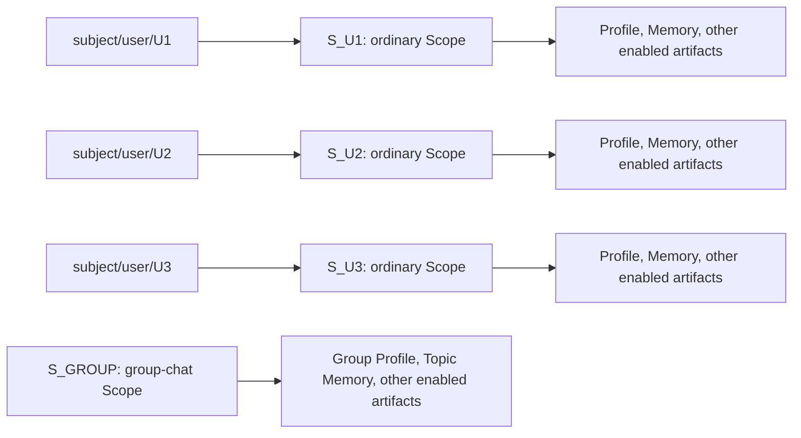
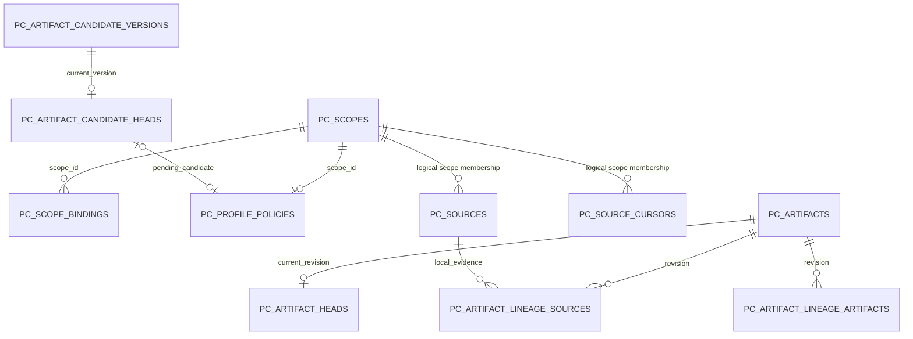

- Proposal Name: `profile_artifact`
- Start Date: 2026-09-07
- RFC PR: [oceanbase/powercontext#1485](https://github.com/oceanbase/powercontext/pull/1485)
- Related RFCs: [Scope organization](1345_scope_organization_and_agent_integration.md),
  [Access control](1396_handoff_access_control.md), [Source and Artifact REST API](1437_source_artifact_rest_api.md),
  [Candidate review](0050_artifact_candidate_review_inbox.md), [Topic Memory](0000_topic_memory.md)

# Summary

This RFC adds the `profile` Artifact Family: a complete Markdown profile derived from the Sources in one Scope.
User profiles are the principal use case; a multi-user conversation Scope can also have an overall profile.
Profile reuses existing Artifact, Head, Lineage, Candidate, and Source Cursor tables. It adds only
`pc_profile_policies`, without changing columns, indexes, or constraints on existing tables.

Subject addressing uses a caller-provided `subject_key`, mapped to an ordinary Scope through existing
`pc_scope_bindings`. A new subject Source endpoint stores one Source in the business Scope and another in the bound
subject Scope in one transaction. Existing single-Scope Source endpoints remain single writes. Enabled Scopes with
new evidence are processed daily at `02:00 Asia/Shanghai` by default, with configurable scheduling, manual Flush,
Candidate review, manual editing, and restoration through Replace. Subject bindings provide routing without changing
Scope storage, organization, or authorization semantics.

# Motivation

A user can participate in multiple conversations and share a group-chat Scope with other users. Applications need
the complete discussion in that Scope while accumulating a user's relevant messages in a long-lived independent
Scope. Both Scopes can use the Artifact capabilities already supported by PowerContext.

Applications determine user identities, content attribution, and when to manage bindings. PowerContext provides Scope
Bindings, a reliable dual-write convenience endpoint, and Scope-based profile generation. Applications need neither
make group chats children of user Scopes nor add `user_id` database columns to every Source and Artifact.

## Goals and non-goals

- At most one Profile Head per Scope, with fixed `family="profile"` and `artifact_id="profile"`; every Revision is a full snapshot.
- Profile is a derived artifact, not a source of truth. Automatic evolution requires new Sources; no rebuild API is added.
- Retain `subject_key`; `subject_type` defaults to and only supports `user` initially, with no subject-type or profile-schema registry.
- A subject Scope is ordinary. Automatic creation uses `parent_scope_id=NULL`; no special Root type or Parent restriction on existing Scopes is introduced.
- Add only one Profile policy table. Generation and review metadata are encoded in existing BLOBs; no Subject, projection, job, or Revision Metadata tables are added.
- Prefer existing Source, Artifact, Scope Binding, authorization, and Candidate APIs; add no subject-specific Artifact CRUD or aggregation API.
- User authentication, reverse one-to-one subject constraints, rebinding migrations, account merging, automatic cross-Scope grants, and global Source deletion cascades are outside scope.
- Source ingestion does not guarantee automatic generation of every Artifact Family. Each Family retains its existing activation, generation, and lifecycle rules.

# Guide-level explanation

## Ordinary scopes and subject bindings

`subject_key` is the caller's business user ID, such as `U1`. PowerContext stores it unchanged and compares it exactly;
it neither generates a replacement user ID nor normalizes the value. Callers must avoid collisions between distinct
business users within the deployment's subject identity domain. The identity string is not an authentication credential.

| API field or internal convention | Scope Binding field | Example |
| --- | --- | --- |
| Server constant | `integration` | `subject` |
| `subject_type`, default and only supported value `user` | `kind` | `user` |
| `subject_key` | `external_id` | `U1` |
| Resolved ordinary Scope | `scope_id` | `S_U1` |

`subject_scope_id` is an optional Scope ID in the subject write request and the actual Scope ID in its response,
not a new Scope type or database column. Add optional `allow_default` to existing Scope Binding Resolve, defaulting
to true to preserve existing fallback behavior. Subject queries pass false and exactly one binding key; a miss returns
404. Then use the returned `scope_id` with existing Artifact and domain APIs. Internal dual-write resolution always
reads the exact key and never falls back to the default Scope.



The example has four Scopes. Binding arrows are neither Parent nor Context Reference relationships. A subject Scope
does not contain all artifacts from the group chat. Querying `S_U1` follows existing authorization and query scope.
Applications explicitly compose requests when they need other Scopes. This RFC adds neither cross-Family conflict
resolution nor automatic traversal of shared group chats. Existing PrepareContext still uses the current Scope and
direct Context References; this RFC does not automatically expand its supported Families.

## Single-scope writes and subject writes

Existing `POST /v1/scopes/{scope_id}/sources` writes only to the addressed Scope and still does not accept
`subject_key`. Subject writes use a separate endpoint:

```http
POST /v1/scopes/S_GROUP/subject-sources
Content-Type: application/json

{
  "subject_type": "user",
  "subject_key": "U1",
  "subject_scope_id": "S_U1",
  "source_type": "content",
  "content": {"speaker": "U1", "text": "I prefer concise answers in Chinese"}
}
```

The business Scope `S_GROUP` must exist. Resolve or establish the subject binding as follows:

| Existing binding | Optional `subject_scope_id` | Result |
| --- | --- | --- |
| Present | Omitted or matches | Reuse the binding |
| Present | Does not match | `409 subject_scope_conflict`; write no Sources |
| Absent | Supplied | Validate the existing Scope and permissions, then establish the binding |
| Absent | Omitted | Create an ordinary Scope under the authorization rules and establish the binding |

Each request generates one `source_id` and uses it in both Scopes. Since the complete Source identity includes
`scope_id`, equal Source IDs do not conflict. The new endpoint returns `201` and two existing `SourceRecord` values.
Their `content`, `content_digest`, `source_type`, and `source_id` match; their `scope_id` values differ. Positions are
allocated independently and may happen to be equal. Both records are Sources with no primary/replica role.

```json
{
  "subject_type": "user",
  "subject_key": "U1",
  "subject_scope_id": "S_U1",
  "sources": [
    {"scope_id": "S_GROUP", "source_type": "content", "source_id": "src_01",
     "content": {"speaker": "U1", "text": "I prefer concise answers in Chinese"}, "position": 101, "content_digest": "sha256:<digest>"},
    {"scope_id": "S_U1", "source_type": "content", "source_id": "src_01",
     "content": {"speaker": "U1", "text": "I prefer concise answers in Chinese"}, "position": 42, "content_digest": "sha256:<digest>"}
  ]
}
```

`<digest>` is a placeholder for the SHA-256 of canonical JSON content. Response order is business Scope, then subject
Scope. Equal target Scopes produce `422 distinct_scopes_required`; use the existing endpoint for a single write.
The new endpoint follows base Create retry semantics: no Idempotency-Key, and a new HTTP request generates a new
Source ID. Internal transaction retries for one request reuse its generated ID.

Per-message ingestion can use the following proposed Client method. Scope provisioning, binding management, and
Policy configuration happen before message ingestion:

```python
messages = [
    {"user_id": "U1", "text": "I prefer concise answers in Chinese"},
    {"user_id": "U2", "text": "Give the conclusion first, followed by detailed analysis"},
]
for message in messages:
    await client.create_subject_source(
        "S_GROUP",
        CreateSubjectSourceRequest(
            subject_key=message["user_id"],
            content={"speaker": message["user_id"], "text": message["text"]},
        ),
    )
```

Do not also call group-chat Source Create for the same message, which would store it twice in that Scope.
Applications split multi-user conversations and supply speaker attribution rather than asking the LLM to infer routing.
Messages such as "agreed" require the relevant context; otherwise profile generation must abstain from inference.

## Binding management semantics

Subject writes only resolve or establish a binding. Existing management APIs retain rebind and unbind operations and
allow multiple subjects to bind to one Scope. Neither operation moves or deletes any Source or Artifact. Automatic
creation after unbinding can create a new Scope. Multiple users bound to one Scope accumulate mixed data and an
overall profile; that Scope is not an exclusive data space for one user.

A request uses the binding it actually reads and fixes its target after resolution. Concurrent management changes do
not redirect that request; the response reports its actual target. No binding version, reverse uniqueness check,
immutability constraint, or migration protocol is added. Matching Source IDs are not a global cross-Scope projection
index. Discovering every copy from one Source or deleting copies through a cascade is not promised.

## Profile meaning and lifecycle

A Profile captures stable characteristics supported by evidence in its Scope. User Scopes produce user profiles;
group-chat Scopes can describe participant characteristics and shared preferences. Mixed evidence should say
"U1 prefers concise answers; U2 needs detailed analysis", without combining those preferences into one person.

```text
Head:     (scope_id, family="profile", artifact_id="profile")
Revision: (scope_id, family="profile", artifact_id="profile", revision)
```

Each Scope independently maintains one Profile. Identical content in two Scopes participates in their enabled
generation flows separately. Outputs may differ because their other evidence and previous profiles differ.
Updates use the previous profile and new evidence, deterministically remove exact duplicates, merge semantic
duplicates, and favor the latest valid evidence for explicit conflicts. Preserve still-valid information and avoid
turning a temporary instruction into a lasting preference. There are no Claim categories or per-Claim risk levels.

Automatically created subject Scopes receive an enabled, automatic Profile Policy. Reusing an existing Scope does
not silently change its Policy. Ordinary group-chat Scopes and disabled user Scopes can explicitly enable generation
through the Policy API. Other Families' configurations are unaffected.

Background generation processes new Sources daily at `02:00 Asia/Shanghai` by default. With `review_required`, it
creates a Candidate and leaves the committed profile unchanged. Users may revise and approve the Candidate, or
reject it and consume that window. Manual Create/Replace retains existing explicit-commit behavior and is not blocked
by the automatic-generation review policy.

# Reference-level explanation

## Scope binding and atomic source transaction

Internal `ensure_binding` uses the existing `(integration, kind, external_id)` unique key and inserts only when absent;
it never uses an overwriting upsert. On a concurrent insertion conflict, roll back the entire attempt, reread the
binding, and apply the resolution rules. Never commit an unreferenced new Scope before retrying. Existing management
`set_binding/clear_binding` behavior remains unchanged and does not have to adopt ensure semantics.

All database operations in a subject write share one connection and transaction:

1. Validate the request and business Scope permissions, normalize content, and generate one Source ID.
2. Read the binding; if absent, validate the supplied Scope or create an ordinary Scope, then insert the binding.
3. Authorize the actual subject Scope and reject equal target Scopes. New Scope authorization is specified below.
4. Acquire journal write locks in sorted `scope_id` order and store the same Source value twice, allocating each position independently.
5. Commit Scope, binding, any new Policy, both Sources, and journal heads together; roll back everything on failure.

```mermaid
sequenceDiagram
    participant App as Application
    participant API as Subject Source API
    participant DB as Existing tables + Policy
    App->>API: business scope + subject_key + optional subject_scope_id + content
    API->>DB: Begin transaction; read/ensure binding
    API->>DB: Authorize actual scopes; lock journals in scope order
    API->>DB: Insert (S_GROUP, content, src_01)
    API->>DB: Insert (S_U1, content, src_01)
    API->>DB: Commit both Sources and journal heads
    API-->>App: 201, actual scope IDs and two SourceRecords
    Note over API,DB: No LLM invocation on the Source write path
```

Binding transaction retries are not API idempotency. Existing Source repository rules still reject the same identity
with different payloads. Subject dual writes initially support only the `content` Source accepted by the base API.
Existing capture, observation, Connector, and MCP single-write entry points do not implicitly duplicate writes;
integrations needing dual writes call the new application service/Client method. Internal `lineage_only` Sources
never use the subject write endpoint.

## Authorization and confidentiality

Reuse existing actions: require `scope.contribute` separately on the business and subject Scopes; use existing
`scope.read/artifact.read` for reads. When establishing an absent binding, also require the management permission
required by the existing Binding management endpoint, namely `server.admin`. Automatic Scope creation also follows existing Scope
Create's `server.admin`. In the same transaction, the existing RelationshipWriter creates a `scope.contributor` role
binding for the authenticated calling Principal on that newly created Scope. This bootstrap applies only to new
Scopes; `server.admin` is not permission to contribute to arbitrary existing Scopes. It is behavior of the new
convenience endpoint, not a change to existing Scope Create. Authorization-disabled deployments retain their existing mode.

The current authorization repository opens its own transactions. Implementation needs an internal write path that
accepts an existing connection, so new-Scope authorization, audit, and relationship revisions commit in the subject
write transaction. Do not invoke a public management API that commits permissions independently. Public permission
management semantics remain unchanged.

A subject key never derives a Principal or replaces permission checks. Policy updates require `scope.admin`, Flush
requires `scope.contribute`, and Candidate operations use existing Review permissions. Background processing runs as
a trusted Runtime service identity and processes only Scopes permitted by the deployment.

Register `profile` in existing Artifact Access Profiles: enabled=true, share_unit=artifact,
shareable_states={committed}, base_action=artifact.read, grantable_roles={artifact.viewer}, selector=forbidden,
mutation_semantics={artifact.write}. Candidates are not exposed as committed Artifacts. Logs omit raw subject_key,
Source content, and profile content by default.

## Profile content and server-owned metadata

Markdown is stored in `ProfileContent.content`; generation metadata is encoded alongside it in the existing
`pc_artifacts.content` BLOB. Use the current codec's Pydantic JSON UTF-8 bytes, without describing that codec as
RFC 8785. Public `content_digest` still follows the base API's canonical JSON rules. The LLM generates only Markdown;
the server constructs generation metadata. Models and clients cannot forge review status, timestamps, or Source windows.

```python
from typing import Annotated, Literal
from pydantic import BaseModel, ConfigDict, Field, JsonValue, model_validator

Identifier = Annotated[str, Field(min_length=1, max_length=256, pattern=r".*\S.*")]

class SourceWindow(BaseModel):
    after: int = Field(ge=0)
    through: int = Field(ge=0)

    @model_validator(mode="after")
    def ordered(self):
        if self.through < self.after:
            raise ValueError("through must be >= after")
        return self

class ProfileGeneration(BaseModel):
    mode: Literal["automatic", "manual_create", "manual_replace", "review_approved", "rollback"]
    created_at: str  # Server-generated UTC RFC 3339 timestamp.
    generator_id: str | None = None
    generator_version: str | None = None
    source_window: SourceWindow | None = None
    restored_from_revision: int | None = Field(default=None, ge=1)

class ProfileWriteContent(BaseModel):
    model_config = ConfigDict(extra="forbid")
    content: str = Field(min_length=1)
    restored_from_revision: int | None = Field(default=None, ge=1)

class ProfileContent(BaseModel):
    model_config = ConfigDict(extra="forbid")
    schema_: Literal["powercontext.profile.v1"] = Field(default="powercontext.profile.v1", alias="schema")
    media_type: Literal["text/markdown"] = "text/markdown"
    content: str
    generation: ProfileGeneration

class ProfileCandidateProposal(BaseModel):
    schema_: Literal["powercontext.profile-candidate.v1"] = Field(default="powercontext.profile-candidate.v1", alias="schema")
    content: str
    source_window: SourceWindow
    generator_id: str
    generator_version: str
    created_at: str
```

These models show the core types. Commit validation also requires nonblank Markdown, NFC/LF normalization, BOM
removal, exactly one trailing newline, and a 256 KiB UTF-8 Markdown limit. Timestamps must parse and normalize to UTC.
Automatic/review-approved generation requires a valid window and generator information; manual operations cannot
forge windows. Only rollback has restored_from_revision, referencing an existing Revision of the same
Scope/Family/Artifact. Candidate window and generator fields are server-owned. Revise uses a separate Markdown input
schema rather than accepting the writable persistence model.

Only Markdown is compared to detect no-change generation. Different timestamps or generator fields alone do not
create an automatic Revision. Base manual Replace retains its existing behavior of creating a Revision on every
successful call. Human confirmation is a whole-Revision generation signal; it does not establish paragraph-level
confirmation. Later explicit Source evidence may still update the corresponding content.

## Cross-Scope publication

Profiles cannot be copied or published across Scopes. Existing `POST /v1/artifact-publications` requests whose source
family is `profile` return HTTP 422, code `artifact_publication_unsupported`, and `details.family=profile`, whether
or not the target Scope already has a Profile. Rejected requests and retries create no target Artifact, publication,
or Profile policy and do not change existing Profiles. Python/SDK publication uses the same rule. Other supported
Families retain their behavior; no new copy endpoint is introduced. Target Profiles are maintained through their own
Scope's generation flow or existing Create/Replace operations.

## Daily scheduling and source consumption

Background scheduling is independently controlled by `RuntimeConfig.profile_schedule_enabled`, defaulting to false.
Configuring a generation model does not implicitly enable scheduling. When enabled, use the default time and startup
catch-up scan below. Manual Flush remains available without scheduling or a background principal.
Reuse the APScheduler sidecar table and add a Cron job. Add no durable pending, lease, or business job tables.
Page enabled Scopes in `pc_profile_policies` and compare `pc_source_journal_heads.position` with the
`profile-source-window` Cursor in `pc_source_cursors`. A missing Cursor means sequence=0.

```yaml
profile:
  schedule:
    cron: "0 2 * * *"
    timezone: "Asia/Shanghai"
    misfire_grace_seconds: 86400
  max_concurrency: 4
  max_sources_per_window: 32
```

Cron and IANA timezone are configurable; invalid values fail startup. Configure coalescing and per-process
max_instances=1. Run a recovery scan at startup so unconsumed Sources are found even after long downtime or an
expired misfire grace period. Each run uses a fixed high watermark and bounded windows. Process windows sequentially
within a Scope and Scopes concurrently. Limit each Scope to 100 windows per scan; leave remaining work for the next
scan or Flush. Windows contain at most 32 journal entries and must respect the existing Candidate limit of 32 total
Source and Artifact evidence references. When the previous Profile is Artifact evidence, use at most 31 entries.
Never omit evidence actually used in generation from lineage merely to fit the limit.

```mermaid
sequenceDiagram
    participant Cron as 02:00 Scheduler / Manual Flush
    participant Worker as Profile Processor
    participant DB as Policy + Journal + Cursor + Artifact/Candidate
    participant LLM as Model
    Cron->>Worker: Scan enabled scopes
    Worker->>DB: Read policy version, pending pointer, cursor and profile head
    alt Candidate pending or no new journal entries
        Worker-->>Cron: review_pending / noop
    else New source window
        Worker->>DB: Read bounded (after, through] window
        Worker->>Worker: Filter lineage_only; normalize and deduplicate evidence
        Worker->>LLM: Old profile + eligible evidence, if any
        LLM-->>Worker: Complete Markdown
        Worker->>DB: Begin transaction; lock Policy; recheck version, cursor, head
        alt Automatic activation
            Worker->>DB: Commit revision + lineage + cursor atomically
        else Review required
            Worker->>DB: Commit candidate + pending pointer; cursor unchanged
        end
        Worker-->>Cron: updated / review_pending
    end
```

A window containing only `lineage_only` entries invokes no LLM and creates no Artifact; advance to the complete
through boundary. Eligible evidence that produces unchanged Markdown also advances only the Cursor. Generation
depends only on this Scope's Sources; writing to S_U1 never advances S_U2's Cursor. The previous Profile is merge
context, not a reason to repeatedly consume all its historical Sources as new evidence.

Do not hold a database transaction lock during an LLM call. At commit, lock the Policy and compare its snapshotted
version and pending pointer, Cursor generation, and Head. Discard the computation without advancing the Cursor if
any changed. SQLite serializes writes with a write transaction; OceanBase uses row locks and CAS. Every successful
Profile processing commit and Policy pointer change increments Policy version. Base Profile Create/Replace takes
the same Policy lock to serialize commits against workers and review. Concurrent initial Policy creation during a
manual operation also uses the primary key and transaction to resolve races.

Multiple processes may call the LLM redundantly, but only one result may commit. APScheduler per-process options are
not distributed locks. Model timeout, invalid output, or transaction failure retains the Cursor, records an error
without content, and retries at the next scheduled scan or manual Flush. Sources and Cursors provide recovery;
persistent job records are unnecessary. Model or Prompt changes alone do not trigger regeneration.

## Review, manual editing and rollback

Commit an automatic Candidate and `pending_candidate_id` atomically. Each Scope has at most one pending automatic
Profile Candidate. Sources may continue to arrive while one is pending, but scheduled and manual Flush calls do not
generate another Candidate. Changing Policy neither approves nor discards an existing Candidate.

| Operation | Atomic updates | Cursor |
| --- | --- | --- |
| Generate Candidate | Candidate versions/heads, Policy pointer and version | Unchanged |
| Revise Candidate | New Candidate version; edit Markdown, preserve window/target/evidence | Unchanged |
| Approve | Artifact/Head/lineage, Candidate approved/result, clear Policy pointer, Cursor | Advance to Candidate through |
| Reject | Candidate rejected/reason, clear Policy pointer, Cursor | Advance to Candidate through |

Reuse existing Candidate get/list/revise/approve/reject. Requests retain `scope_id`, `candidate_id`, and
`expected_version`; Reject still requires reason and adds no disposition. The Profile branch validates the Policy
pointer, pending status, and Cursor.sequence=after. Approve additionally requires the current Head to match Candidate
target. For target=NULL, the fixed Profile Head must not exist.

Manual Replace remains allowed while review is pending. Approve of the stale Candidate returns `409` and preserves
it. Reject need not match the current Head and can still consume the original window. Users may read the Candidate
and manually apply desired content before rejecting it. Revise does not silently retarget the Candidate to a newer
Head. Approve/Reject never partially advance the Cursor. Repeated terminal requests follow existing Candidate
conflict semantics; clients use Get to confirm the outcome.

Reject consumes only its window and never deletes Sources. Rejected Markdown becomes neither committed content nor
the previous-profile input to future generation. Later evidence may assert the same fact; rejection is not permanent
fact suppression. If the journal grows from 42 to 50 during review, processing resumes after 42 following the decision.
After restart, restore the waiting state from the persisted Policy pointer and Candidate without generating again.

Manual Create/Replace uses the base Artifact API Family writer and preserves its system `lineage_only` Source,
ordinal=0, ETag/If-Match, and lineage rules. Create uses artifact_id=profile and returns 409 if the Head exists.
Automatic commits use the same Family validation and repository but cite actual evidence rather than inventing a
manual system Source.

Rollback needs no new API: GET a historical Revision, GET the current Head ETag, then PUT the complete Markdown with
optional `restored_from_revision` in ProfileWriteContent. The server verifies that the historical Revision exists
and its normalized Markdown matches, then creates a new rollback Revision. It neither moves Head back to an older
Revision nor rewinds the Cursor. Omitting the field is an ordinary manual Replace; Create forbids it. Clients compare
two Revisions themselves, with no new diff or history-list endpoint.

## Persistence inventory and example rows

BLOB examples below show decoded JSON. Foreign keys and lineage use complete identities. Timestamps and digests
are readable examples; omitted default columns are still written according to existing definitions. Existing tables
have no DDL changes; only Profile BLOB schemas and code branches are extended.



Logical membership is not a new foreign key: `pc_sources` and `pc_source_cursors` retain existing constraints.
There is no new relationship table or FK between the two cross-Scope Sources. `pc_artifact_lineage_artifacts` still
stores same-Scope upstream Revisions.

### Scopes and bindings

`pc_scopes` stores ordinary Scopes. The example has four rows without Parents, although the group chat may retain
its existing organizational relationship:

| scope_id | title | summary | parent_scope_id | version |
| --- | --- | --- | --- | --- |
| S_GROUP | Discussion | Group conversation evidence | NULL | 1 |
| S_U1 | User workspace | Long-lived conversation evidence | NULL | 1 |
| S_U2 | User workspace | Long-lived conversation evidence | NULL | 1 |
| S_U3 | User workspace | Long-lived conversation evidence | NULL | 1 |

`pc_scope_bindings` keeps `(integration, kind, external_id)` as its primary key with no new uniqueness on scope_id.

| integration | kind | external_id | scope_id |
| --- | --- | --- | --- |
| subject | user | U1 | S_U1 |
| subject | user | U2 | S_U2 |
| subject | user | U3 | S_U3 |

`pc_scope_context_references`, `pc_scope_external_references`, and `pc_scope_settings` receive no rows in this example.
Internal automatic Scope creation does not pretend to use public Scope Create's Idempotency-Key, so
`pc_scope_creation_requests` has no row for this request. If the application precreates a Scope through existing
Scope Create, its records follow that existing flow.

### Sources, journal heads and cursors

`pc_sources` retains primary key `(scope_id, source_type, source_id)`. P is the same complete valid ContentSource
payload. Both rows share name/src_01, so their internal envelopes can also match. Source ID is not globally unique.

| scope_id | source_type | source_id | payload | journal_position |
| --- | --- | --- | --- | --- |
| S_GROUP | content | src_01 | P | 101 |
| S_U1 | content | src_01 | P | 42 |

P's business content is `{"speaker":"U1","text":"I prefer concise answers in Chinese"}`, encoded through the existing
adapter with no new internal subject fields.

`pc_source_journal_heads`:

| scope_id | position |
| --- | --- |
| S_GROUP | 101 |
| S_U1 | 42 |

`pc_source_cursors`, after Source ingestion and before generation:

| scope_id | binding_name | cursor BLOB | generation |
| --- | --- | --- | --- |
| S_GROUP | profile-source-window | {"sequence":100} | 8 |
| S_U1 | profile-source-window | {"sequence":41} | 5 |

After successful processing, sequences become 101/42 and generations become 9/6 respectively. Memory and other
bindings' Cursors remain unchanged.

### The only new table: pc_profile_policies

| Field | SQLAlchemy type | Constraint/meaning |
| --- | --- | --- |
| scope_id | identity_string(256) | PK, FK -> pc_scopes.scope_id, ON DELETE CASCADE |
| generation_enabled | Boolean | NOT NULL; participates in scheduled scans/Flush |
| activation_mode | identity_string(32) | NOT NULL; automatic or review_required |
| pending_candidate_id | identity_string(128) | Nullable; composite FK with scope_id -> pc_artifact_candidate_heads |
| version | BigInteger | NOT NULL, >0; CAS version for configuration and processing state |
| updated_at | DateTime(timezone=True) | NOT NULL, UTC |

```text
PRIMARY KEY (scope_id)
CHECK (activation_mode IN ('automatic', 'review_required'))
CHECK (version > 0)
FOREIGN KEY (scope_id, pending_candidate_id)
  REFERENCES pc_artifact_candidate_heads(scope_id, candidate_id) ON DELETE RESTRICT
```

| scope_id | generation_enabled | activation_mode | pending_candidate_id | version | updated_at |
| --- | --- | --- | --- | --- | --- |
| S_GROUP | true | automatic | NULL | 3 | 2026-09-07T18:00:00Z |
| S_U1 | true | review_required | cand_01 | 7 | 2026-09-07T18:00:00Z |

A missing Policy means automatic generation is disabled. Automatically created subject Scopes start with enabled=true,
automatic, version=1. A base manual Profile creation with no Policy creates an enabled=false, automatic Policy for
concurrency coordination without enabling background generation. Policy PUT preserves pending_candidate_id;
clients cannot set or clear it.

### Artifact content, heads and lineage

`pc_artifacts` example:

| scope_id | family | artifact_id | revision | content BLOB |
| --- | --- | --- | --- | --- |
| S_U1 | profile | profile | 3 | C3 |
| S_U1 | profile | profile | 4 | C4 |
| S_GROUP | profile | profile | 2 | Group profile snapshot |

C4 is the complete value after approving cand_01. Its Markdown has no Claim rows or categories:

```json
{
  "schema": "powercontext.profile.v1",
  "media_type": "text/markdown",
  "content": "# User profile\n\n- Prefers concise answers in Chinese.\n",
  "generation": {
    "mode": "review_approved",
    "created_at": "2026-09-08T01:00:00Z",
    "generator_id": "profile-source-window",
    "generator_version": "1",
    "source_window": {"after": 41, "through": 42},
    "restored_from_revision": null
  }
}
```

`pc_artifact_heads` points to Revision 3 before review and 4 afterward. These are post-approval rows:

| scope_id | family | artifact_id | revision | searchable_text | lifecycle_state | replacement_artifact_id | governance_generation |
| --- | --- | --- | --- | --- | --- | --- | --- |
| S_U1 | profile | profile | 4 | Prefers concise answers in Chinese | active | NULL | 0 |
| S_GROUP | profile | profile | 2 | U1 prefers concise Chinese; U2 needs detailed analysis | active | NULL | 0 |

`pc_artifact_lineage_sources`:

| scope_id | family | artifact_id | revision | ordinal | source_type | source_id |
| --- | --- | --- | --- | --- | --- | --- |
| S_U1 | profile | profile | 4 | 0 | content | src_01 |
| S_GROUP | profile | profile | 2 | 0 | content | src_01 |

`pc_artifact_lineage_artifacts`:

| scope_id | family | artifact_id | revision | ordinal | upstream_family | upstream_artifact_id | upstream_revision |
| --- | --- | --- | --- | --- | --- | --- | --- |
| S_U1 | profile | profile | 4 | 0 | profile | profile | 3 |

Automatic updates reference the previous Profile used as input. Base manual Replace retains base API lineage rules
and does not reuse another Revision's lineage_only Source as new evidence. Subject Source dual writes add no rows
to `pc_artifact_publications`.

### Candidates and scheduler

`pc_artifact_candidate_versions`, before review:

| scope_id | candidate_id | version | family | proposal BLOB | source_refs BLOB | artifact_refs BLOB | target_family | target_artifact_id | target_revision | reason |
| --- | --- | --- | --- | --- | --- | --- | --- | --- | --- | --- |
| S_U1 | cand_01 | 1 | profile | Q1 | [{"source_type":"content","source_id":"src_01"}] | [{"family":"profile","artifact_id":"profile","revision":3}] | profile | profile | 3 | New evidence |

```json
{
  "schema": "powercontext.profile-candidate.v1",
  "content": "# User profile\n\n- Prefers concise answers in Chinese.\n",
  "source_window": {"after": 41, "through": 42},
  "generator_id": "profile-source-window",
  "generator_version": "1",
  "created_at": "2026-09-07T18:00:00Z"
}
```

The JSON is Q1. Revise inserts version=2, preserving all server processing metadata and target while changing only
content. The three `pc_artifact_candidate_heads` states below are alternatives; only one current Head exists:

| scope_id | candidate_id | family | version | status | result_family | result_artifact_id | result_revision | decision_reason |
| --- | --- | --- | --- | --- | --- | --- | --- | --- |
| S_U1 | cand_01 | profile | 1 | pending | NULL | NULL | NULL | NULL |
| S_U1 | cand_01 | profile | 1 | approved | profile | profile | 4 | NULL |
| S_U1 | cand_01 | profile | 1 | rejected | NULL | NULL | NULL | Evidence is too temporary |

Both approve and reject clear the Policy pointer and advance the Cursor from 41 to 42; only approve produces C4.
The Candidate version preserves the historical window, making `pc_profile_candidate_metadata` unnecessary.

`powercontext_scheduler_jobs` reuses APScheduler's id/next_run_time/job_state:

| id | next_run_time | job_state |
| --- | --- | --- |
| powercontext.profile.source-window.v1 | 1788804000.0 | APScheduler serialized CronTrigger: 02:00 Asia/Shanghai, dispatch_profile_windows |

The timestamp corresponds to `2026-09-08T02:00:00+08:00`. APScheduler serializes job_state; implementations do not
handcraft its BLOB. Authorization relationships use existing Access Control tables and RelationshipWriter. The
following representative fields cover automatic creation and Profile commits; existing services fill remaining
audit, digest, and version fields. Assume the calling Principal is service/app-agent, with no automatic relationship
to business subject U1:

| Existing table | Example data (selected columns) |
| --- | --- |
| pc_access_relationships | binding_id=bind_01, subject_type=service, subject_id=app-agent, resource_type=scope, scope_id=S_U1, role=scope.contributor, state=active, version=1 |
| pc_access_relationship_heads | name=authorization, revision=12; incremented by the existing service on relationship changes |
| pc_access_idempotency | actor_id=<existing actor encoding>, operation=binding.create, result_binding_id=bind_01; internal authorization deduplication, not Source HTTP idempotency |
| pc_access_audit | principal_type=service, principal_id=app-agent, scope_id=S_U1, allowed=true; operation/action supplied by existing authorization and audit services |
| pc_access_owners | owner_kind=artifact, scope_id=S_U1, family=profile, artifact_id=profile, owner_type=service, owner_id=app-agent; Candidate owner_kind=candidate, candidate_id=cand_01 follows existing rules |

No authorization table is added. Generation and review retain existing owner establishment/inheritance rules.
Background work uses a configured trusted service Principal, never subject_key as owner_id. The owner example
assumes app-agent performs the commit; it is not derived from U1.

## API surface and Python examples

Only four HTTP operations are added. Their paths and types are implementation targets of this RFC, not claims of
current availability.

| operationId | Method and path | Success | Purpose |
| --- | --- | --- | --- |
| create_subject_source | POST /v1/scopes/{scope_id}/subject-sources | 201 | Resolve subject binding and atomically write both Sources |
| get_profile_policy | GET /v1/scopes/{scope_id}/profile-policy | 200 | Read policy and pending pointer |
| put_profile_policy | PUT /v1/scopes/{scope_id}/profile-policy | 200 | Enable/disable generation and configure review |
| flush_profile | POST /v1/profile/flush | 200 | Process one bounded window through the background Processor |

Policy GET returns 404 if absent. PUT uses expected_version: 0 means create only; a positive value must match the
current version. GET requires scope.read and PUT scope.admin. Configuration changes and processing commits share
version, so clients reread after a conflict. Flush returns disabled for a missing Policy or generation_enabled=false without enabling it.
It waits for one window within a deployment-configured timeout. Timeout does not prove the transaction failed;
clients inspect existing Artifact/Candidate and Policy APIs. Retries still use Cursor/CAS checks.

```python
class CreateSubjectSourceRequest(BaseModel):
    model_config = ConfigDict(extra="forbid")
    subject_key: Identifier
    subject_type: Literal["user"] = "user"
    subject_scope_id: Identifier | None = None
    source_type: Literal["content"] = "content"
    content: JsonValue

class CreateSubjectSourceResponse(BaseModel):
    subject_type: Literal["user"]
    subject_key: Identifier
    subject_scope_id: Identifier
    sources: list[SourceRecord]  # Existing model; exactly two, business then subject.

class PutProfilePolicyRequest(BaseModel):
    model_config = ConfigDict(extra="forbid")
    generation_enabled: bool
    activation_mode: Literal["automatic", "review_required"] = "automatic"
    expected_version: int = Field(ge=0)

class ProfilePolicyResponse(BaseModel):
    scope_id: Identifier
    generation_enabled: bool
    activation_mode: Literal["automatic", "review_required"]
    pending_candidate_id: str | None
    version: int = Field(ge=1)
    updated_at: str

class FlushProfileRequest(BaseModel):
    model_config = ConfigDict(extra="forbid")
    scope_id: Identifier

class FlushProfileResponse(BaseModel):
    status: Literal["updated", "noop", "review_pending", "disabled", "conflict"]
    previous_cursor: int
    current_cursor: int
    high_watermark: int
    processed_source_count: int
    artifact: ArtifactRef | None = None  # Existing exact ref, scoped by request.
    candidate_id: str | None = None
```

All new request models reject unknown fields and validate IDs/enums. SourceRecord and ArtifactRef are reused with
their existing optional fields. Flush processed_source_count is the number of eligible Sources in this invocation's
window; review_pending/disabled without a new model call returns 0. A concurrent conflict returns the reread Cursor
and no artifact/candidate_id from the discarded result. Other numeric response fields are nonnegative.

| Existing endpoint/component | Change |
| --- | --- |
| Base Source Create/Get, capture, observation | Unchanged request/response and single-write behavior |
| Scope Create/Get/List and Binding Set/Clear | Unchanged contract; the new endpoint uses internal insert-only ensure |
| Scope Binding Resolve | Add allow_default=true; subject queries pass false to prohibit fallback on a miss |
| Artifact Create/Get/Get Revision/List/Replace | Add profile to Family enums, input unions, and Family writer; reuse paths |
| Artifact publication / copy | Keep the existing path and request shape; source family profile returns 422 artifact_publication_unsupported with no target writes; other Families retain their behavior |
| Candidate Get/List/Revise/Approve/Reject | Add Profile proposal and committer; coordinate Profile Policy/Cursor |
| Artifact Access Profile, capabilities/readiness, internal authorization repository | Register/report profile and support transactional permission bootstrap without new actions or public management changes |
| RuntimeConfig and scheduler registration/configuration | Add Profile Cron configuration and scan callback using existing sidecar |
| Python Client and HTTP adapters | Add four operations; support profile through existing Artifact/Candidate methods |
| PrepareContext and other Family generation endpoints | No expanded aggregation scope or automatic-generation guarantees |

Manual Profile creation retains the base request shape:

```http
POST /v1/scopes/S_U1/artifacts

{"family":"profile","content":{"content":"# User profile\n\n- Prefers concise answers.\n"}}
```

Read and replace through existing paths:

```text
GET /v1/scopes/S_U1/artifacts/profile/profile
GET /v1/scopes/S_U1/artifacts/profile/profile/revisions/3
GET /v1/scopes/S_U1/artifacts/profile
PUT /v1/scopes/S_U1/artifacts/profile/profile    (If-Match required)
```

```json
{"content":{"content":"# User profile\n\n- Prefers concise answers.\n","restored_from_revision":3}}
```

The PUT example restores Revision 3's Markdown. The response remains ArtifactRevision with server-generated
generation and a new ETag. The SDK keeps its existing If-Match mechanism for Replace; it does not assume response
models have an `.etag` attribute.

```http
POST /v1/artifact-candidates/reject

{"scope_id":"S_U1","candidate_id":"cand_01","expected_version":1,"reason":"This is a temporary request"}
```

No subject Artifact CRUD, Subject Resolve, or Profile history/diff/rollback/context APIs are added. To query by
subject_key, resolve the exact binding, then call ordinary Scope APIs. Resolve retains its existing server.observe requirement:

```http
POST /v1/scope-bindings/resolve

{"binding_keys":[{"integration":"subject","kind":"user","external_id":"U1"}],"allow_default":false}
```

## Errors, compatibility and implementation

| Condition | Result |
| --- | --- |
| Invalid subject_type, blank key, invalid Markdown, or unknown input fields | 422 |
| Existing binding differs from explicit subject_scope_id | 409 subject_scope_conflict |
| Both actual Scopes are equal | 422 distinct_scopes_required |
| Explicit Scope does not exist | 404; never silently create a caller-specified ID |
| Missing required Scope/management permission | 403, no partial write |
| Profile Create when already present | 409 |
| Replace missing/mismatched If-Match | 428 / 412 |
| Policy/Candidate version or review Cursor conflict | 409, no Cursor advance |
| Approve target Head changed | 409, preserve Candidate |
| Model/storage temporarily unavailable | 503, preserve recoverable state |

Responses retain Request-ID and the existing error envelope and avoid exposing unauthorized Scope content or binding
details. Profile requires coordinated OpenAPI union, output schema, Candidate proposal, and Family registrations.
Server-owned fields remain separate from client input; a GET generation object is not writable input.

Implementation order:

1. Add Profile content/write/proposal models and Family writer, reusing singleton IDs, Artifact repository, lineage, and authorization.
2. Create only the Policy table; define versioned BLOB schemas and server validation for generation metadata and Candidate processing context.
3. Implement insert-only ensure and transactional dual-write application service, including concurrent first creation, permissions, and full rollback.
4. Implement the Source-window Processor, Policy/Cursor/Head coordination, Candidate lifecycle, and daily Cron.
5. Add four OpenAPI operations and extend existing Family/Candidate branches; run `make api-generate` without hand-editing generated files.
6. Add bilingual usage documentation and SQLite/OceanBase behavior tests; run `make contract-test`, `make test`, `make check`, and `make docs-test`.

## Acceptance criteria

- Add only pc_profile_policies with no column/index/FK changes to existing tables; Artifact/Candidate BLOBs contain validated server metadata.
- Single-Scope Source APIs still write once; the subject endpoint writes two Sources with matching IDs/content without invoking an LLM.
- Concurrent first bindings leave no orphan Scope; explicit binding conflicts, authorization failures, and either Source failure roll back everything.
- Management rebind/unbind behavior remains intact; later writes use new bindings, historical data does not migrate, and multiple subjects may share a Scope. Subject Resolve never falls back to a default Scope on a miss.
- U1's message changes only S_GROUP and actual S_U1 journals; both may generate Profile independently without triggering U2/U3.
- Equal target Scopes are rejected; new HTTP retries may produce new Source pairs and are not described as idempotent.
- Every Scope uses the same Profile singleton ID; Create conflicts and Get/List/Replace/Review reuse existing APIs.
- Default schedule is 02:00 Asia/Shanghai with configurable Cron/timezone; startup scans recover backlog without pending/job tables.
- Filter lineage_only while advancing full windows; unchanged Markdown creates no automatic Revision, and model upgrades alone do not rebuild.
- Concurrent computations commit at most once; Policy changes, manual Replace, and Cursor changes invalidate stale results.
- Clients cannot edit Candidate processing context; pending Candidates prevent regeneration; decisions update Cursor and pointer atomically.
- Reject consumes its window without automatic retry or Source deletion; it works after Head changes while Approve must conflict.
- Rollback creates a new Revision while preserving history and Cursor; existing authorization and Source eligibility checks cover every Profile write path.
- No new automatic generation or aggregation capability is implicitly promised for Memory, Experience, Skill, Topic Memory, or other Families.

# Drawbacks

Dual Source writes increase storage and journal processing costs. Shared and user Scopes can independently generate
different profiles with duplicate LLM costs. Without a projection index, cross-Scope copy discovery and coordinated
deletion are inefficient. Without distributed job leases, competing workers may call the model redundantly. Review
blocks later automatic Profile windows in the same Scope; fixed Reject consumption gives up automatic retry of the
rejected window.

Mutable, many-to-one bindings can fragment long-lived memories or mix users' information. Applications must manage
bindings, preserve message context, and understand Scope authorization boundaries. BLOB generation metadata cannot
have direct database foreign keys or efficient field-level queries; server validation and transactions maintain its
integrity.

# Rationale and alternatives

## Reuse scope bindings and ordinary scopes

Existing Bindings already map external business identifiers to Scopes. A fixed integration, initial user kind, and
subject_key provide subject addressing. Mutable management mappings fit the existing abstraction; automatic writes
use ensure to avoid accidental rebinding. Extra Root types, reverse uniqueness constraints, and subject-specific CRUD
would add management semantics that the first release does not need.

## One policy table and existing blobs

Policy needs atomic CAS for configuration and a unique pending pointer. Existing Scope settings are not arbitrary
JSON configuration storage and cannot directly hold these fields. Revision and Candidate metadata are typed content
of existing objects, suitable for their BLOBs. Policy, Cursor, Source journal, and Candidate reconstruct processing
state, so no pending, lease, projection, revision metadata, or candidate metadata tables are added.

## Dedicated subject write convenience

Two base Source Create calls cannot guarantee atomic success. A subject dual-write endpoint follows base content
and response models and uses repositories within one transaction while preserving single-write endpoints. An
arbitrary scope_ids batch endpoint does not express subject binding resolution, so this RFC does not expand into
general batch operations.

# Prior art

- PowerContext [base REST API](1437_source_artifact_rest_api.md) supplies Source/Artifact identity, atomic commits,
  ETags, and lineage_only; the [Scope RFC](1345_scope_organization_and_agent_integration.md) supplies ordinary Scopes and Bindings.
- The [Candidate Review RFC](0050_artifact_candidate_review_inbox.md) supplies candidate versions and review lifecycle;
  [Topic Memory](0000_topic_memory.md) provides independent Source-window consumer references. This design does not depend on its proposed task tables.
- [TencentDB Agent Memory](https://github.com/TencentCloud/TencentDB-Agent-Memory#technical-implementation) uses layered
  asynchronous processing, and [OpenViking Session](https://github.com/volcengine/OpenViking/tree/main/openviking/session)
  provides session-processing references for accumulating evidence into long-term memory. This RFC uses PowerContext's own Scope, Cursor, and transaction contracts.

# Unresolved questions

This document defines first-release behavior rather than leaving consistency decisions to callers. Operational
parameters such as model timeouts and deployment concurrency ceilings follow existing deployment configuration.
Cross-Scope Source deletion and forgetting, data migration after rebinding, strict reverse uniqueness, explicit
reproposal after rejection, and all-Family Context aggregation are outside this RFC and need separate designs.
Neither dual writes nor Bindings implicitly provide those capabilities.

# Future possibilities

Supported subject_type values can expand while continuing to use Scope Bindings without changing Profile singleton
identity. Unified processing policies, task leases, and cross-Scope Source copy relationships may serve all Families
in the future. Their requirements should drive separate RFCs rather than becoming implicit Profile dependencies.
Fine-grained fact review or permanent suppression of rejected content would require a separate structured fact and
governance model.
