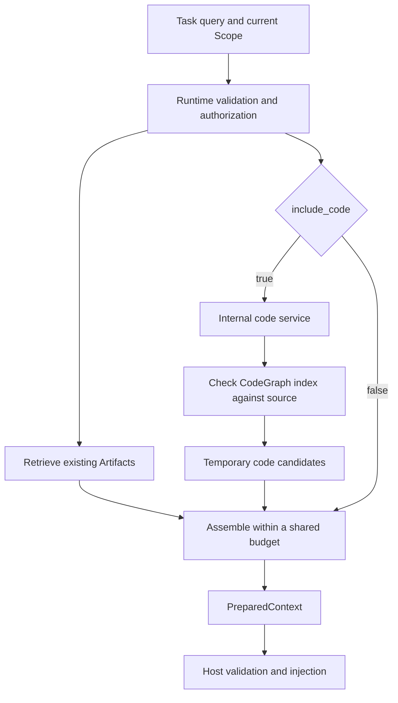

- Proposal Name: `git_repository_understanding`
- Start Date: 2026-09-15
- RFC PR: [oceanbase/powercontext#1619](https://github.com/oceanbase/powercontext/pull/1619)
- Status: Proposed
- Related RFCs: [Memory admission](0014_memory_layer_design.md), [Handoff](0048_handoff_artifact.md),
  [Evaluation architecture](0081_end_to_end_evaluation_architecture.md),
  [Scope and host integration](1345_scope_organization_and_agent_integration.md),
  [Access control](1396_handoff_access_control.md), [Source model](1400_source_definition_and_observation_model.md),
  [Source API](1437_source_artifact_rest_api.md), [Context assembly](1489_prepared_context_text_assembly.md)

# Summary

This proposal adds an `include_code` option to `prepare_context`, disabled by default. For the current task, an
Agent can receive relevant definitions, call relationships, and test leads from the local Git repository
configured for the current Scope, within the same budget as historical context such as Memory and Experience.
The first release integrates CodeGraph through an internal adapter and supports one local Python repository
per Scope. The graph index is a rebuildable cache, and code candidates exist only within a request; the design
adds no Code Artifact, business database table, or user-managed code version. Temporary code unavailability
omits the supplement while historical context remains available. Requests that do not enable the option retain
their existing behavior.

# Motivation

A developer gives an Agent this task:

> Change the budget handling in `PreparedContextBuilder.build_scopes_result`, and inspect its callers and related tests.

Completing the task requires three kinds of information:

| Information | Example | How it is obtained |
| --- | --- | --- |
| Current code facts | Where the function is defined, who calls it, and which tests deserve inspection | Query the code index and source for the task |
| Historical constraints | Why the current budget rules exist and which behaviors must be preserved | Existing Artifacts such as Memory and Experience |
| Work progress | What has changed, what has been verified, and what remains to do | Existing Handoff |

PowerContext already supports historical context and handoffs. This feature provides relevant code during
context preparation, reducing repeated navigation and manual assembly. CodeGraph supplies structural analysis;
PowerContext places the results in the current task's context and controls citations, budgets, and access scope.

The intended experience is: **submit a task → receive relevant code and historical constraints → continue the
task.** Saving analysis reports, generating Code Artifacts, and managing business versions are not prerequisites.
Call graphs and test candidates support judgment; they do not represent complete runtime relationships or
completed tests.

# Guide-level explanation

## Configure a repository and prepare its index

The deployer configures an allowed local directory for an existing Scope. For example:

```yaml
code:
  enabled: true
  repositories:
    scp_demo: /work/powercontext
  provider:
    name: codegraph
    executable: /opt/codegraph/bin/codegraph
```

`repositories` maps Scopes to directories in deployment configuration; it does not create Repository objects.
The first release allows at most one directory per Scope. Multiple Scopes may use the same directory, with
separate authorization and isolated caches. Ordinary HTTP requests cannot specify arbitrary server paths.

The existing workspace binding continues to help hosts resolve a Scope. It neither grants directory read access
nor automatically becomes a server path. Scopes are created or resolved through existing flows; directory names,
Git remotes, and branch names are not used to generate Scope IDs.

Run these commands on the host that holds the repository:

```bash
powercontext code index --scope scp_demo
powercontext code status --scope scp_demo
```

`index` completes a local build synchronously and reports the result. Run it again after code changes. In the
first release, the deployer or an authorized host workflow explicitly refreshes the index; no asynchronous task
API is added. `prepare_context` uses a valid index and does not wait for a full repository build within a request.

## Prepare context for a task

```http
POST /v1/context/prepare
Content-Type: application/json

{
  "scope_id": "scp_demo",
  "query": "When changing the budget handling in PreparedContextBuilder.build_scopes_result, which callers should be checked?",
  "max_bytes": 8000,
  "include_code": true
}
```

The Runtime automatically retrieves relevant code from the current Scope's repository and delivers it alongside
historical content within the budget. The request needs no repository ID, snapshot ID, analysis result ID, or
version parameter. The existing `assembly` option still selects Memory, Experience, Profile, and Topic Memory.

The final body preserves the order of historical Artifact sections and appends a "Current code references"
section containing relevant snippets, paths, line numbers, and the basis for the analysis. The complete text
shares the 8000-byte UTF-8 limit. The host validates and injects it unchanged, without appending a separate graph
query result.

If code has changed, the index is missing, or analysis times out, this request omits the code supplement,
continues preparing available historical context, and explains the omission within the budget. Omitting
`include_code` or setting it to false preserves existing behavior. Ordinary preparation creates no Source or
Artifact.

## Continue exploration and hand off work

To inspect callers, impact, or specific code in more detail, an Agent can use the independent code query tool;
see [Independent code queries](#independent-code-queries). It shares the internal service used by prepare and is
not a required step in preparation.

Handoff continues to record goals, progress, constraints, and next steps. The recipient prepares context again
to retrieve code that is current at that time. Only when original material needs to be retained for later
inspection is it explicitly saved as an existing Source; see [Optional material capture](#optional-material-capture).
The full code analysis is not automatically stored as an Artifact.

# Reference-level explanation

## Design boundaries

| Decision | Design |
| --- | --- |
| Integration point | Extend the existing `POST /v1/context/prepare` with one boolean option |
| Code source | Configure one local Git directory for an existing Scope; support Python initially |
| Analysis | Integrate CodeGraph through an internal adapter that returns temporary code candidates |
| Delivery | Share byte and entry budgets with historical context and return one PreparedContext |
| Unavailability | Omit temporarily unavailable code and continue delivering historical context |
| Business model | Preserve existing family semantics; add no Code Artifact or business database table |

## Request flow and responsibilities



| Component | Responsibility |
| --- | --- |
| Host | Resolve the existing Scope, enable code supplementation, and validate and use the final text |
| Runtime | Authorize access, coordinate Artifact retrieval and code queries, and handle a limited set of code unavailability cases |
| Internal code service | Manage local caches, check current content, call the adapter, and normalize code candidates |
| CodeGraph adapter | Check engine capabilities, build indexes, query definitions and relationships, and report the supported scope |
| PreparedContextBuilder | Accept both kinds of candidates, select and render complete citations, and apply the shared budget; perform no I/O or persistence |

The code service belongs to the built-in implementation layer and does not require a public, generic provider
framework. Core does not depend on third-party database tables or node IDs. The internal implementation can be
replaced while preserving the same external preparation and query behavior.

## Request and response contract

`PrepareContextRequest` gains a strict boolean field, `include_code`, which defaults to false. Null, numbers,
and strings are invalid. `ContextAssemblySection.family` retains the existing Artifact categories, the maximum
number of sections remains 4, and `family=code` remains invalid.

| Request | Behavior |
| --- | --- |
| `include_code` omitted or false | Preserve existing defaults, error mappings, and final text; do not access the code service |
| `include_code=true`, `assembly` omitted | Return unified Markdown; select historical content using the defaults of 6 Memory and 2 Experience entries |
| `include_code=true`, `assembly={}` | Use the same default Artifact selection |
| `include_code=true`, `sections=[]` | Prepare code only; do not retrieve Artifacts |
| `include_code=true`, Artifacts explicitly selected | Preserve the selected families, entry limits, and order, and supplement them with code |

The response continues to use the four fields of `powercontext.prepared-context.v1`: `schema`, `status`,
`content`, and `content_bytes`. Code sources are temporary request data. They have no Artifact identity,
Revision, or CRUD operations, and do not fabricate an ArtifactRef.

The body distinguishes historical constraints from current code references. It preserves the meaning of the
existing trust notice and the boundaries for literal quoted content, making clear that all content is untrusted
material. Code comments, README files, and tool output cannot become instructions to the Agent. The host records
code as delivered only when code is actually selected.

## Candidate selection and output boundaries

The first release finds candidates using paths, qualified names, and symbol terms in the query, then performs
bounded expansion of definitions and direct relationships. Automatic prepare does not call a model to generate
a repository overview or promise to locate modules for arbitrary natural-language questions. It may return no
code when there are no matching terms. The independent tool handles complex impact analysis against explicit
targets.

The code portion of one prepare request performs at most one search and four expansions, producing at most
16 candidates in total. The entire code query and content check share a 5-second execution budget. Duplicate
code locations and relationships are removed. CodeGraph scores and Memory scores are not compared as if they
used the same scale. Reading engine output must also be bounded.

Internal candidates retain the following data for rendering, validation, and diagnostics, without becoming new
persistent resources:

| Data | Purpose |
| --- | --- |
| Repository-relative path, file digest, line range, actual snippet, and snippet digest | Verify the code citation and keep it interpretable after truncation |
| Definition path, qualified name, and starting line | Distinguish functions or classes with the same name |
| Relationship type, derivation method, endpoints, and available call sites | Distinguish calls, imports, references, inheritance, and heuristic leads |
| Commit, modification state within the included scope, content fingerprint, and check time | Confirm that the graph and source come from the same content |
| Coverage, omissions, parse failures, and truncation information | Bound the applicability of conclusions |

Unknown relationships are marked `unknown`, and unresolved endpoints retain an explanation of what is missing.
Zero results mean only that nothing was found within the queried scope; timeouts or corruption must not be
represented as zero results. Test detection must at least cover `test_*.py` and `*_test.py` in both root and
nested directories. Candidate tests cannot justify automatically skipping other required tests.

## Shared budget

Code and historical content share `max_bytes` and the server-side `context_assembly_max_entries` setting. The
default total remains 8 entries. The first release adds no request options for code entry counts, priority, or
budget share. It uses the following internal policy:

1. After deduplication, retain at most 4 code entries, without exceeding the server's total entry limit. When
   historical Artifacts are selected in the request, code entries are also capped at half that total limit,
   rounded down.
2. When historical Artifacts are selected, the complete code section may use at most half the total byte budget.
   With explicit `sections=[]`, it may use the entire budget.
3. Select code candidates first, then use the remaining budget to select Artifacts in the existing section
   order. Return all unused code allocation to historical content.
4. Display historical sections first, followed by current code references. Count headings, citations,
   limitations, diagnostics, and boundary markers in the final UTF-8 byte total.

Existing request validation for `section.limit` remains unchanged. Enabling `include_code` does not make the
default 6+2 selection an over-limit request. Code and Artifact entries in the output together obey the total
limit: selecting 3 code entries, for example, leaves room for at most 5 Artifact entries. Each limit is an upper
bound, not a guarantee that the output will fill it.

Each code body is limited to 2000 bytes. Truncation preserves complete lines and updates the actual line range
and snippet digest. Omit an entire entry if its citation cannot be retained in full. A single builder accounts
for the complete output when making all selections; the host does not concatenate two results that each consume
the full budget. These allocation ratios are internal policies that still require evaluation.

## Index consistency with current content

Users do not manage code analysis versions, but the Runtime must automatically verify that the index and source
are consistent. HEAD commit, index age, or the absence of watcher events alone cannot establish freshness.
Uncommitted changes must also be considered.

The local build process is:

1. Fix the file filtering policy and record HEAD, the Git object format, and working tree state.
2. Copy the actual on-disk content of included files into a private cache. Record relative paths, Git modes,
   SHA256 digests of raw bytes, and sizes.
3. Recheck HEAD, the staging area, the file set, and content digests. Retry a bounded number of times on
   concurrent changes, then fail if the input remains unstable.
4. Build and validate the index against the copied content, then atomically publish the cache directory and
   current pointer.

Capture includes staged and unstaged changes present in the working tree. Older content in the staging area
does not override files on disk. Git identities retain the complete SHA-1 or SHA-256 object ID. The internal
fingerprint also binds the Scope, directory configuration, file manifest, filter rules, adapter and engine
builds, and actual index digest.

Each prepare request pins one complete cache and checks the current included content before delivery. A
mismatch discards all code candidates from that request; an old graph is never mixed with new files. Ordinary
file copying is not an instantaneous atomic snapshot of the entire working tree. This design guarantees that
the graph and citations come from the same captured bytes and reports the check time and scope; it does not
freeze subsequent edits.

New builds use separate directories and must not modify published indexes in place. An old directory cannot be
reclaimed while a request still uses it. Builds for the same Scope are serialized with an interprocess file
lock. Interrupted builds are invalidated after restart. An incomplete cache cannot become `ready`, and an
existing complete cache must be checked again before use.

In the first release, the Runtime, repository, and build command reside on the same host and use consistent
configuration. The index is a rebuildable local cache. Distributed builds, durable task queues, and arbitrary
historical commit queries are outside this release. Explicit refresh after code changes is an initial
limitation; incremental and automatic refresh can follow based on task costs.

## Failure handling and observability

| Condition | `prepare_context` behavior |
| --- | --- |
| Code not configured, or no valid index | Omit code and continue preparing historical context |
| Code changed, or the engine or content check times out or is unavailable | Discard this request's code candidates, return their budget, and continue preparing historical context |
| Successful query with no matches | Return normal empty candidates; do not generate filler |
| Authentication, authorization, invalid path, or parameter error | Fail normally; fallback must not bypass validation |
| Existing Artifact retrieval fails | Preserve existing error mappings without broadening which exceptions are swallowed |

When there is actual content to deliver, add a short explanation if the budget permits, such as "Current code
references omitted: the index needs refreshing." Actual content takes priority. The reason also enters the
existing structured trace. If neither kind of candidate has deliverable content, continue returning
`empty`/`null`/`0`; diagnostics alone cannot produce `ready`.

Record code query duration, whether there were matches, selected entry and byte counts, coverage, truncation,
and omission reasons. Distinguish "code found," "code selected," and "host injection": a successful tool call
does not prove that code was delivered. Logs and errors must not include raw code, absolute paths, credentials,
or unfiltered engine stderr.

## Access scope and resource limits

Check `scope.read` for the current Scope and the deployment's directory configuration before reading files or
invoking the engine. Do not expand code access through Context References. A Scope admin cannot broaden the
file scope allowed by the deployment. Once a directory configuration is revoked, existing caches no longer
accept queries. Separate access to Handoff evidence does not grant permission to query the entire repository.

Include only Git-tracked files by default. The deployer may explicitly enable untracked files, subject to
`.gitignore`. Tracked files still obey explicit exclusion rules, which exclude credential files, build outputs,
and caches by default. Prevent path escape, do not follow symbolic links or recurse into submodules, do not
download LFS objects, and do not execute repository code. Do not fold case or merge normalized filenames.
Paths, encodings, and unsupported content that cannot be represented losslessly must be reported as omissions
or failures.

| Deployment limit | Initial default |
| --- | --- |
| Included file count / per-file size / total content | 20,000 / 2 MiB / 512 MiB |
| Total cache size / build timeout | 2 GiB / 10 minutes |
| Code query and content check duration | 5 seconds |

Filtering an individual file counts as an omission. Exceeding an aggregate limit or running out of space fails
the build, rather than selecting the first N files in directory traversal order. The deployer can adjust limits;
ordinary queries cannot raise them. Start with full builds and reuse of caches for identical content.
Optimizations must preserve consistency and resource limits.

## Independent code queries

Add `POST /v1/scopes/{scope_id}/code/query` with operationId `query_code`. MCP exposes the read-only
`powercontext_code_query` tool. Both share the internal code service used by prepare and support further
exploration or status checks without creating Sources or Artifacts.

Request fields are a strict discriminated union named `operation`, an optional `expected_fingerprint`, and
`max_bytes`. Unknown fields are rejected.

| `operation.kind` | Input and scope | Output |
| --- | --- | --- |
| `status` | None | Protocol, validated capabilities and languages, and `disabled`/`missing`/`building`/`ready`/`stale`/`failed` state |
| `tree` | Optional relative directory; depth defaults to 2, maximum 5 | Included files and directories |
| `symbols` | Nonempty query, at most 8192 characters; optional path | Definitions, signatures, and code locations listed separately |
| `callers` / `callees` | Path, qualified name, and definition starting line | Direct relationships for the exact target |
| `impact` | Same target fields; depth defaults to 2, maximum 5 | Bounded impact paths and evidence for each edge |
| `affected_tests` | At most 100 changed paths | Candidate tests, the basis for their association, and omissions |
| `read` | Path, file SHA256, and a 1-based inclusive line range of at most 200 lines | Original text verified against the digest |

All operations except `status`, `tree`, and `symbols` require the `expected_fingerprint` from a previous result.
The Agent or SDK passes this consistency check value automatically; it is not used to select or manage historical
versions. Ambiguous targets must not have their results merged. A deleted path or a path from before a rename
that is absent from the current index must not be interpreted as having no impact.

The list `limit` defaults to 20 and has a maximum of 50. Traversal is limited to 500 nodes and 1000 edges. One
query and its content check share a 5-second budget. For a successful JSON body, `max_bytes` defaults to 16000
and ranges from 512 to 32768. Structure, limitations, and citations all count toward it. Return
`budget_too_small` if the smallest valid response cannot fit. Truncate snippets only at complete lines and
update their ranges and digests; citations must not be truncated.

Non-`status` responses use `schema=powercontext.code-query.v1` and contain `scope_id`, `fingerprint`, the full
`commit`, `git_object_format`, `dirty`, `checked_at`, `operation`, `status` (`ok`/`partial`), `items`, `coverage`,
and `limitations`. Items retain the citation and relationship information described in
[Candidate selection and output boundaries](#candidate-selection-and-output-boundaries). `dirty` describes
modifications within the included scope. The `status` operation uses a separate response branch with the current
fingerprint when available. State must be checked: a successful build does not prove that its content still
matches the current repository.

Queries and status checks verify `scope.read` and directory configuration before invoking the engine. This
interface supports feature negotiation. It does not add fields to the existing closed `/v1/capabilities`
response or require callers to obtain `server.observe` in addition. Explicit queries use different error
handling from prepare's fallback behavior:

| Explicit query error | HTTP behavior |
| --- | --- |
| Invalid parameters, paths, missing or ambiguous targets, or invalid budget | 422, using the existing error body format |
| Unauthenticated or unauthorized | 401 / 403 |
| Not configured, no valid index, or engine/content check unavailable | 503 |
| Current content or fingerprint mismatch | 409 `code_changed`; refresh and locate the target again |
| Unsupported operation or language | 501 `unsupported_capability` |

The `status` operation successfully reports states such as `disabled` and `missing`. Preparation follows
[Failure handling and observability](#failure-handling-and-observability).

## Optional material capture

When evidence from that moment must be saved, submit the complete bounded JSON response of a selected query as
`content` to the existing `POST /v1/scopes/{scope_id}/sources`, with `source_type` set to `content`. Handoff's
`source_refs` then references the returned `name` and `source_id`. The query scope may be narrowed before
submission. Saving does not read additional content or rerun the query. Retries follow existing creation
semantics, with no additional guarantee of deduplication for identical content.

This is an ordinary Content Source. It proves that material submitted by the caller was saved, not that the
server produced it. The query schema is a content format, not a reserved trusted credential; a digest is not a
signature of origin. The target Scope in the request and existing `scope.contribute` permissions determine
write access. Content fields cannot grant permissions. The existing write path produces JSON `wire_content`
and internal normalized text `content`. Index cleanup does not affect saved original material.

When code material is explicitly saved, default automatic Memory and Topic Memory processing must skip
`powercontext.code-query.v1`, covering both JSON objects and JSON text containing such an object. The write
does not independently trigger an automatic job. When a later ordinary Source advances the journal window,
consumers must also skip the code material and advance their position normally. Do not use `lineage_only`,
because Handoff and explicit generation still need to read the material. If the format marker is removed and
the material is saved as ordinary text, ordinary Source policy applies.

These rules govern admission to automatic processing, not origin authentication. Handoff references only
persistent Sources; a cache fingerprint is not a SourceRef. A recipient with only Handoff evidence access
cannot use it to query the repository. The normal `include_code` flow neither depends on this section nor
performs these writes.

Acceptance for this section covers reading original material after index cleanup, ensuring modified material
does not gain origin authentication, and automatic processing when an ordinary Source follows a code Source:
skip the code, advance the position, and process ordinary content as usual. SQLite and OceanBase retain the
same save and handoff semantics.

## API, storage, and implementation changes

| Area | Required change |
| --- | --- |
| HTTP / Client | Add `include_code` to prepare requests and add the [independent code query API](#independent-code-queries) |
| Runtime | Retrieve temporary code candidates for the task, handle code unavailability, and coordinate shared budgeting and citation rendering |
| Existing families | Unchanged; code does not pass through Artifact registration or retrieval |
| Local CLI / MCP | Provide index and status commands and a read-only code query tool |
| Business database | No new tables; ordinary preparation writes no Source, Artifact, or Memory |
| Local cache | Store captured content, file manifests, graph indexes, and build state; allow deletion and rebuilding |
| Optional material capture | Reuse Content Source and Handoff; see [Optional material capture](#optional-material-capture) for automatic Memory admission requirements |

Git capture and CodeGraph adaptation can live in `src/powercontext/builtin/code/`. The Runtime coordinates
reads. `src/powercontext/builtin/runtime/prepared_context.py` and related text models gain a temporary code
source branch while keeping the Builder free of I/O. CodeGraph's own SQLite index is a local cache, not a new
PowerContext business table.

The engine is an optional deployment dependency, pinned to a validated build and digest. The adapter uses CLI
JSON or a public API in a controlled process, without directly depending on the engine's database schema. If
the CLI cannot disambiguate by file and definition, choose a validated API path or build. Missing capabilities
must fail explicitly; definitions with the same name must not be merged. Invoke the engine with an argument
array, and disable telemetry, update checks, and automatic Agent configuration writes. Queries do not
automatically install or upgrade the engine.

OpenAPI remains the sole source of truth for the HTTP contract. Implementation must update
`openapi/powercontext.yaml`, run `make api-generate` and `make contract-test`, and avoid editing generated models
by hand. Update the Runtime, Server, Client, host, and documentation contracts together.

The feature is disabled by default, and existing users need no business data migration. New hosts negotiate
through the independent code query's `status` operation only when code capability is enabled. If an older
Server does not support it, disable the code supplement and explain why. Cache format, engine, or configuration
changes may require rebuilding; explicitly saved Source content is not rewritten.

## Initial delivery and acceptance

### Delivery scope

| Phase | Deliverable | Completion criteria |
| --- | --- | --- |
| P0: Validation on real tasks | Pin a CodeGraph build and try code queries alongside PowerContext in the same Agent workflow | Code navigation value, missed results, and deployment costs can be assessed |
| P1: Native context supplementation | Local Python repository, indexing, `include_code`, shared budgets, fallback, and independent queries | Complete task preparation, host injection, execution validation, and continuation after handoff |

P1 excludes remote clone/pull, credential management, webhooks, cross-repository graphs, whole-repository LLM
summaries, vector retrieval, automatic code changes, and test execution. Source material capture is optional.
Neither everyday preparation nor receiving a Handoff requires saving code analysis first.

### Required behavior checks

| Scenario | Acceptance outcome |
| --- | --- |
| Option omitted or false; default and custom `assembly` | Preserve old behavior; true does not incorrectly reject the default 6+2 selection as over limit |
| `sections=[]`, non-boolean option, `family=code` | Query only code, reject the invalid option, and reject the invalid Artifact family, respectively |
| Small budgets, Chinese text, long lines, malicious Markdown | Bound the complete UTF-8 byte count and total entries, preserve complete citations, and keep bodies within literal quoting boundaries |
| No code matches, missing index, timeout, files changed after the query | Return code allocation and apply fallback correctly; remain `empty` without actual candidates |
| Staged/unstaged differences, edits or branch switches during capture | Use explicitly captured content; retry or fail on changes; never mix a graph with different source content |
| Same-name definitions; different Scopes pointing to the same directory | Disambiguate targets and isolate authorization and caches |
| Dynamic relationships, pytest paths, deleted or renamed targets | Expose scope and omissions; inability to analyze does not mean no impact |
| Concurrent builds, publishing a new cache during a query, interruption or restart | Pin a complete cache for each request; incomplete builds never become `ready` |
| Unauthorized access, revoked directory, path escape, separately shared Handoff | Reject out-of-scope access before reading; fallback and sharing do not grant repository access |
| Ordinary prepare and host delivery | Write no Source or Artifact; validate and inject the final text unchanged; make actual selection observable |
| Continuing work after handoff | Reuse progress and constraints, retrieve current code again, and read optional Sources through their original references |

Observe results through the public Runtime, HTTP, an actual host, and the real engine. CodeGraph must be tested
against both a small Python fixture and PowerContext source code. Mocks, index node counts, and successful
process exit codes cannot replace evidence of structural correctness and actual delivery.

### Task outcome evaluation

Select 12–20 tasks across modules, covering code navigation, call-path explanation, interface changes, test
leads, and handoff. Fix the model, prompts, base tools, existing Memory, initial code, and budget. Compare code
supplementation enabled and disabled in paired runs for each task, and report variation across repeated runs.

Record time to locate the correct code, cross-file discovery calls, relationship and test recall/false
positives, indexing and query costs, injected bytes, model tokens, patch correctness, and actual regression
checks. All authorization, content consistency, and budget counterexamples must pass. Broader product adoption
requires no material regression in patch correctness and consistent improvement in navigation efficiency. If
test-selection benefits have not been verified, claim only the demonstrated code navigation capability. Vendor
benchmarks and index scale cannot substitute for task outcomes.

# Drawbacks

- Deploying an analysis engine, managing caches, and refreshing indexes add dependencies and operational work.
- Copying content, building indexes, and checking the current working tree consume disk space and time. Small
  tasks or large repositories may see no net benefit.
- Static relationships may miss real links or report false ones, especially for dynamic calls, framework
  registrations, and unresolved imports. Results need to show their basis and scope.
- Code competes with historical Artifacts for the same context budget. A fixed allocation can reduce the
  historical constraints available for some tasks and must be adjusted through task evaluation.
- The first release supports one local directory per Scope and requires explicit refresh. Frequent edits may
  temporarily prevent code supplementation; multiple repositories and remote scenarios remain unsupported.

# Rationale and alternatives

## Why supplement PreparedContext directly

This feature supports code navigation for the current task. Code facts can be recomputed from the repository
and change as files are edited. Treating them as request-scoped candidates reuses the existing Scope, budget,
and host delivery flow without adding generation, saving, business versioning, and expiration management.
Design decisions worth retaining continue to follow Memory and Experience admission rules. Original material
that must be preserved uses the existing Source model.

`include_code` expresses a preparation option, while existing families continue to represent Artifact types.
The Runtime automatically checks consistency between the graph and source, so callers do not select code
versions. Authorization errors still fail normally. Temporary code analysis unavailability allows historical
context delivery to continue.

## Alternatives

| Approach | Potential value | Decision in this proposal |
| --- | --- | --- |
| Build all code analysis in-house | Full control over languages and analysis strategies | Requires ongoing maintenance of parsing, disambiguation, and update algorithms; prefer an engine validated through behavior |
| Embed a complete external system | More interfaces and management features immediately available | Can duplicate storage, permissions, and installation flows; initially integrate structural analysis only |
| Install CodeGraph MCP alongside PowerContext only | Quick integration for P0 and useful independently | Does not automatically provide unified preparation or budgets; native integration supplements prepare through the shared code service |
| Persist Code Artifacts | Useful when analysis outputs need ongoing maintenance | This feature uses rebuildable facts per task; the additional Artifact lifecycle offers insufficient benefit |
| Add code to `assembly.family` | Reuse the section selection format | Conflates temporary code with persistent Artifacts; preserve family semantics and use a separate preparation option |
| Put all code in Memory | Reuse the Memory retrieval entry point | Frequently changing, rebuildable content adds noise and staleness and conflicts with existing Memory admission rules |
| Do not implement native supplementation | Continue using existing code reading and search tools | Agents must still locate code and assemble context themselves, without shared budgeting and delivery records |

This proposal retains text search and direct source reading tools. CodeGraph results still require
verification. Decisions to replace the engine or add stronger retrieval depend on failure patterns and costs
in real tasks, rather than upstream index scale or promotional metrics.

# Prior art

## Existing PowerContext mechanisms

Scope organizes and binds work context. PreparedContext provides text assembly with citations and a shared
budget. Source and Handoff support optional material capture and handoff. Code supplementation follows these
boundaries without extending existing Artifact types or changing ordinary preparation's read-only behavior.

## CodeGraph and preliminary investigation

[CodeGraph](https://github.com/colbymchenry/codegraph) is the first adapter target. This proposal retains
PowerContext's own Scope and delivery model. Installing CodeGraph MCP alongside PowerContext suits P0; native
integration adds task-specific supplementation, shared budgets, and host delivery.

The preliminary investigation used the official Linux x64 v1.6.0 release package to index the PowerContext
source and test scope available at the time. The tool reported processing 574 Python files. For the 7 direct
callers of `PreparedContextBuilder.build_scopes_result`, function names, files, and starting lines matched an
independent Python AST check, including two production callers and five test functions.

The investigation also found merged relationships for same-name definitions, missed tests under the default
path rules, and old relationships returned before synchronization. The examined CodeGraph uses the MIT license.
Required adapter capabilities must be verified against an actual release build. This investigation has not
established patch success rates, end-to-end token savings, watcher behavior, or results in a real MCP host.

# Unresolved questions

Before this RFC is merged, confirm the following boundaries and the evidence supporting them:

1. **Initial engine build.** Select a CodeGraph build and support matrix that pass checks for same-name
   disambiguation, pytest paths, content consistency, and host behavior.
2. **Resources and latency.** Use representative repositories to measure full refreshes, content checks, and
   the 5-second query budget, and confirm that the initial directory scale and default limits are reasonable.
3. **Context allocation.** Use real tasks to validate the code budget share, candidate relevance, and patch
   outcomes, and determine whether the fixed allocation policy supports initial use.

The first release explicitly excludes remote repository ingestion, distributed builds, multi-repository
authorization, historical version comparison, and whole-repository semantic retrieval. These are not implicit
prerequisites. Remote execution, credentials, or cross-repository access require separate integration and
authorization protocol design.

# Future possibilities

- **Automatic and incremental refresh:** Reduce waiting after frequent edits while ensuring that each request
  uses a complete cache consistent with current content.
- **Better task navigation:** Add natural-language module retrieval or directory summaries based on failure
  cases, while retaining the basis for generated content and content checks.
- **More languages and analysis methods:** Expand the support matrix validated through behavior, clearly
  identifying how relationships were derived and where coverage is incomplete.
- **Remote and multiple repositories:** Add integration, selection, and authorization when concrete use cases
  justify them, without introducing management objects prematurely.
- **Historical version comparison:** Support impact analysis across versions for deletions, renames, and
  similar changes, without treating cache identities as persistent evidence references.

These are natural extensions of the proposal, not requirements for accepting or delivering the initial
capability. Their order depends on real task outcomes and deployment costs.
