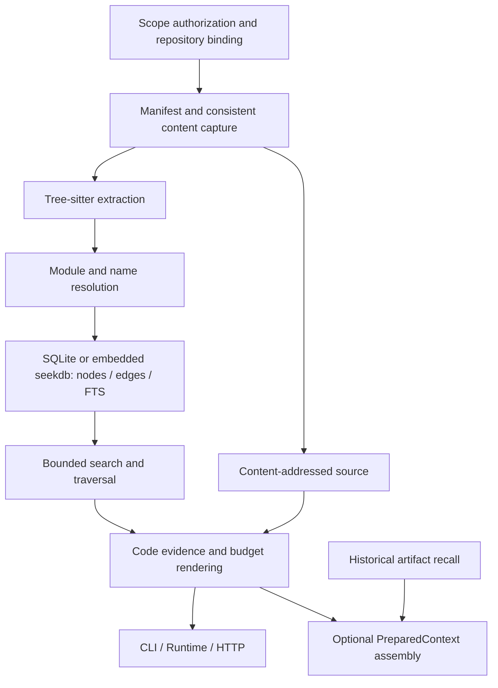

- Proposal Name: `native_git_code_understanding`
- Start Date: 2026-09-21
- RFC PR: [#1708](https://github.com/oceanbase/powercontext/pull/1708)
- Status: Implemented — experimental, opt-in
- Design Baseline: [PowerContext c1c83c52](https://github.com/oceanbase/powercontext/tree/c1c83c52c8916bbe3df73842fb1d1998d3fb788d)
- Related RFCs: [Memory admission](0014_memory_layer_design.md), [Evaluation](0081_end_to_end_evaluation_architecture.md),
  [Scope and host integration](1345_scope_organization_and_agent_integration.md), [Sources](1400_source_definition_and_observation_model.md),
  [Context assembly](1489_prepared_context_text_assembly.md), [Recall sufficiency](1560_recall_sufficiency_gate.md),
  [Git repository understanding proposal #1619](https://github.com/oceanbase/powercontext/pull/1619)

# Summary

Implement a native code understanding engine inside PowerContext. It reads an authorized local Git worktree, extracts
symbols and references with Tree-sitter, resolves cross-file relationships statically, and uses SQLite/FTS5 or embedded
seekdb for repository navigation, symbol search, callers/callees, change impact, test candidates, and cited source reads.
The production path requires no CodeGraph process, CLI, MCP server, or database format, and no LLM, embedding model,
or graph database. The graph is a rebuildable cache of current code; Memory, Experience, Profile, Topic Memory, and
Handoff continue to hold historical knowledge and work state.

SQLite uses a separate cache with `code_nodes`, `code_edges`, and the `code_search_fts` virtual table. Embedded seekdb
uses dedicated `pc_code_generations`, `pc_code_nodes`, and `pc_code_edges` tables in the configured local database,
plus a native full-text index. File inventories, source snapshots, diagnostics, and per-file extraction facts remain
in local cache files. Existing Artifact tables are unchanged.

The explicit mixed Python, TypeScript/JavaScript, and Go repository loop is implemented: **index → locate → expand relationships → read evidence → edit
→ sync → inspect impact and tests**. CLI, Runtime, Client, HTTP/MCP, optional PreparedContext, and Codex/Claude Code
hooks are integrated and disabled by default. See the [repository code workflow](../docs/workflows/repository-code.md)
for setup and use. Compare the CodeGraph core engine with the native engine, with ordinary search/read as an additional
baseline. Automatic PreparedContext injection is a separate experiment. Quality, cost, and performance thresholds below
are release criteria, not promises that those thresholds have been met.

# Motivation

## Scenario and pain points

A developer asks an Agent:

> Change PreparedContext budgeting, identify affected HTTP/MCP entry points, preserve Topic Memory, and add regression coverage.

Text search finds names, but the Agent still repeatedly reads definitions, follows import aliases, determines edge
direction, disambiguates identical names, and locates tests. A code summary may explain a module without identifying
the exact source behind a claim or the paths affected by an edit. HEAD alone cannot distinguish two dirty worktrees
at the same commit.

This capability makes those steps traceable. Relationships include resolution evidence, source snippets include
content fingerprints, and unresolved references and unsupported languages remain visible. Returned tests are always
candidates; they never justify skipping other project-required tests.

| User question | Required capability | Inspectable result |
| --- | --- | --- |
| Where should I start? | Directory tree, file structure, entry-point hints | Repository map with paths and definitions |
| Where is this behavior? | Path, symbol, signature, and docstring search | Unambiguous definitions and source |
| Who calls it, and what does it call? | Cross-file resolution and traversal | Evidence paths with call sites |
| What else should I inspect after editing? | Reverse impact and test association | Bounded candidates and omissions |
| Can I trust the graph after an edit? | Content consistency and incremental updates | A new fingerprint or an explicit stale error |

## Existing capabilities and gaps

The baseline has Scope, Source evidence, Artifacts, PreparedContext, and host integrations, but no implemented
`include_code` or `query_code`. Source capture/reference semantics are not a code index, and Git cloning helpers do
not provide symbol resolution or continuous synchronization.

Omitting `assembly` currently recalls Memory, Experience, and Topic Memory. Explicit `assembly={}` defaults to six
Memory and two Experience entries. These are different existing behaviors; implementation must preserve both.

Two hypotheses require evidence: structural relationships reduce cross-file investigation cost, and a native engine
can provide evidence comparable to or better than CodeGraph at an acceptable maintenance cost. Fewer MCP calls,
more returned nodes, or more passing internal tests do not independently establish either hypothesis.

# Guide-level explanation

## Minimal user loop

The operator binds one existing Scope to one authorized local repository. Configuration example:

```yaml
code:
  enabled: true
  repositories:
    scp_demo:
      root: /work/powercontext
      source_roots: [src, .]
      include_untracked: false
  cache_dir: /var/lib/powercontext/code-cache
```

`source_roots` helps import resolution without expanding the authorized root. Initially, each Scope has one worktree;
two worktrees of the same Git repository require separate bindings and caches. Workspace binding can locate a Scope
but does not authorize filesystem access. HTTP callers cannot supply arbitrary server directories.

The local CLI reads the common query format from a file:

```bash
powercontext code index --scope scp_demo
powercontext code status --scope scp_demo
powercontext code query --scope scp_demo --request-file code-query.json
powercontext code sync --scope scp_demo
powercontext code clear --scope scp_demo
```

```json
{
  "operation": {
    "kind": "explore",
    "query": "PreparedContextBuilder build_scopes_result",
    "path_prefix": "src/powercontext"
  },
  "max_bytes": 16000
}
```

The Agent receives definitions, a few direct relationships, and source locations. Further expansion uses the
returned `symbol_id` and `expected_fingerprint`. If content changes, it receives `code_changed`, synchronizes, and
locates the target again; an old symbol ID cannot silently select a node in a new graph.

`index` performs a full build; `sync` updates extraction and relationships. Both finish synchronously. Queries never
implicitly build a whole repository. A host may trigger local sync after editing, with its cost included in the task.

## Capability scope

| Capability | Initial acceptance scope | Excluded guarantee |
| --- | --- | --- |
| Repository map | Directories, multi-language files, signatures, imports, test entry hints | Automatic business architecture explanation |
| Symbol search | Names, qualified names, paths, signatures, docstrings, README headings | Reliable English-code retrieval for every purely Chinese query |
| Call relationships | Lexical scope, explicit imports/aliases, relative imports, explainable receiver hints | Complete runtime call graph or dynamic type proof |
| Impact | Bounded reverse call, import, inheritance, and reference paths | Complete data flow, side effects, or safety proof |
| Test association | Static call/import paths and labeled name/directory hints | Permission to skip other tests |
| Updates | Add, modify, delete, rename, branch switch, worktree edits | Distributed builds or an initial real-time watcher |
| Other languages | File tree and bounded text reads, with unsupported capabilities declared | Treating an empty graph as language support |

Python, TypeScript/JavaScript (including TSX/JSX), and Go can coexist in one index. See the
[language coverage](../docs/workflows/repository-code.md#language-coverage) for extensions and static resolution boundaries.
Non-code documents help navigation without creating call edges. Initially there is no remote cloning, dependency
download, repository execution, or cross-repository graph.

## Working with historical context

The Agent can use existing `prepare_context` for historical constraints and native queries for current code facts.
Validate this loop before adding default-off `include_code` injection. No Code Artifact is required, and extracted
functions and line numbers are not automatically written into Memory.

Handoff records goals, constraints, validation, and next steps; the receiver queries its current worktree again.
When durable evidence is required, explicitly save the bounded query result as an existing content Source. A cache
fingerprint is not a permanent evidence address, and capturing a result does not grant repository-wide access.

# Reference-level explanation

## 1. Architecture and responsibilities



A suggested implementation lives in `src/powercontext/builtin/code/`, with `capture`, `extract`, `resolve`, `store`,
`query`, `render`, and `service` responsibilities. This organization is not a public module-stability contract.

| Component | Owned behavior |
| --- | --- |
| CodeService | Scope/binding checks, index lifecycle, shared deadline, generation pinning |
| RepositoryCapture | Git inventory, filtering, safe reads, manifest and content digests |
| Language extractors | Declarations, scopes, references, call sites, and parse errors from supplied bytes |
| Language resolvers | Modules, imports, name bindings, resolution evidence, unresolved/ambiguous references |
| GraphStore | Three logical node/edge/FTS tables and companion cache files, atomic publication, reader lifetime |
| CodeQueryEngine | Map, search, exploration, traversal, impact, and test candidates |
| CodeEvidenceRenderer | Citation integrity, deduplication, range clipping, bounded output |

Use pinned Python Tree-sitter bindings and Python, JavaScript, TypeScript/TSX, and Go grammars through an optional `code` extra, recorded in `uv.lock`.
Do not depend on CodeGraph parsers, npm runtime, or private node structures. Run parsing in resource-limited workers
so pathological files cannot block the service event loop. Packaging acceptance covers supported Python versions
and wheel/sdist installations. A missing parser is reported as an extraction failure; production startup does not
download a grammar on demand.

Code storage follows the local deployment: embedded seekdb uses the configured database directory; SQLite and
OceanBase deployments retain the separate SQLite/FTS5 code cache. GraphReader/GraphStore isolate SQL from parsing,
traversal, evidence rendering, and PreparedContext. Code data remains a rebuildable cache on the repository host.
Shared multi-replica querying is outside the scope. An unavailable full-text backend fails explicitly.

## 2. Content identity and storage

`binding_id` is an opaque local deployment identity binding Scope, canonical worktree root, and access policy. It
cannot be derived solely from a remote URL or branch. Caches are isolated per binding. A `generation` is a completely
published index; its `fingerprint` identifies content and analysis rules, not an Artifact revision.

```text
fingerprint = sha256(canonical_encoding(
  binding_id, git_object_format, head_or_unborn,
  sorted_manifest[path, mode, content_sha256, size, inclusion_status],
  filter_policy_digest, resolution_config_digest,
  parser_build, resolver_build, schema_version
))
```

Use an unambiguous length-delimited encoding. `resolution_config_digest` includes name-resolution configuration such
as `source_roots`. Preserve full Git object IDs and distinguish them from SHA-256 content digests.
`dirty` separately describes in-scope changes against HEAD; equal commits do not imply equal content.
When staged and unstaged versions differ, analyze actual worktree bytes and retain the observed Git state.

The SQLite schema has **three logical tables: two ordinary tables and one FTS5 virtual table**. Files and references
remain nodes and relationships rather than separate Artifact types.

| Table | Records and principal fields |
| --- | --- |
| `code_nodes` | Files and definitions as nodes: id, kind, file_id, parent_id, path, name, qualified_name, language, signature, docstring, byte/line ranges; file nodes also carry content digest and parse status |
| `code_edges` | Traversable static or candidate relationships: source_id, target_id, kind, call site, resolution, rule_id, reference_key |
| `code_search_fts` | Node-based retrieval over paths, names, identifier segments, signatures, docstrings, and selected document headings |

Included files are `kind=file` nodes. Definitions use `file_id` for file ownership and `parent_id` for lexical nesting.
Omitted files appear only in the manifest. Source ranges and adjacency remain ordinary indexed columns, not JSON-only
fields. SQLite-managed FTS5 shadow tables are outside the three-logical-table count and application-owned lifecycle.

Embedded seekdb has three ordinary tables: `pc_code_nodes` and `pc_code_edges` carry generation-scoped graph rows;
`pc_code_generations` records the binding, content checksum, row counts, and serialized byte size. Native full-text
search indexes node search text. Binary path/name comparisons preserve case, literal wildcard characters, and spaces.
The binding identity includes the backend and canonical seekdb directory, so switching databases cannot reuse another
index accidentally. `pylibseekdb>=1.4.0.post1` permits the local CLI and Server to open the same directory; all graph
connections drain before the owning embedded handle closes. The supported deployment remains local.

Each build persists its cleanup descriptor, commits complete immutable graph rows, then atomically publishes the
local generation pointer. Source/facts/diagnostic files and DB rows are checked against the same manifest. Interrupted
publication leaves the previous pointer intact. Cleanup deletes unreachable DB generations and their local files
only after reader locks permit removal. The cache budget includes local files and serialized graph rows; seekdb's
physical indexes, logs, engine metadata, and reserved capacity are additional disk usage.

Other data has explicit storage locations:

| Cache data | Storage and purpose |
| --- | --- |
| Inventory and generation metadata | `manifest.json`: paths, modes, digests, sizes, languages, inclusion/omission reasons, build versions, parent fingerprint, coverage, database and facts checksums |
| Per-file extraction facts | `facts/<extraction_key>.json`: declarations, lexical scopes, every raw reference/call site, import/alias/re-export syntax facts, parse errors; complete extraction output for reuse |
| Module/name bindings | An in-memory index built from manifest, source_roots, and facts; no separate SQL table |
| Unresolved/ambiguous diagnostics | Per-generation `diagnostics/<file_key>.json`, keyed to original facts by reference_key; aggregate counts in manifest |
| Source and current pointer | Content-addressed source; `current` points only to a complete generation; reader leases use cache files |

`extraction_key` binds relative path, content digest, language, parser_build, and extraction format version. Including
path prevents reuse of location-dependent facts when identical bytes move. Facts contain syntax rather than resolved
targets, allowing resolution after configuration or resolver changes. Reuse only verified immutable facts; missing,
corrupt, or incompatible facts require re-extraction.

Each build derives relationships and diagnostics from facts, preserving raw references even after successful
resolution. A reference without a target does not create a fake node or null-target edge; diagnostics retain its
reason. Candidate targets may produce explicitly labeled candidate edges. `code_edges.reference_key` identifies the
generation-bound original call/reference; structural contains edges may omit it. Compute test hints and impact at
query time without a test-mapping table.

`manifest.json` is authoritative for snapshot inventory; file nodes are its query projection. Validate matching paths,
digests, and parse status before publication. Manifest, facts, diagnostics, the graph, and source form one generation
and are verified and published together; no individual component may be replaced in place. Database and companion
checksums verify publication integrity without participating in a circular calculation of their own content digests.

This layout preserves node lookup, traversal, and full-text search. The tradeoff is that repository-wide raw-reference
or unresolved diagnostics require per-file aggregation rather than SQL joins. Charge in-memory module reconstruction
and facts reads to memory, sync, and diagnostic budgets. Accept this initially; consider a separate reference table
only if measurements establish file aggregation as a bottleneck.

Symbol IDs use path, kind, lexical qualified name, and declaration byte position, always qualified by fingerprint.
IDs need not survive moves or renames; conditional definitions with equal names remain distinct.

Tree-sitter positions are byte-based. Structural extraction supports strictly decodable UTF-8 Python, TypeScript/JavaScript, and Go files.
Non-UTF-8, binary, and unsupported files appear in coverage; do not reuse raw offsets after lossy transcoding. Public
line ranges are one-based and inclusive; byte ranges are half-open. CRLF and non-ASCII snippets must round-trip exactly.

Store source by digest in a private cache. Only files in the selected manifest may be returned. Published databases
and source objects are immutable; never hard-link mutable worktree files as captured evidence.

## 3. Extraction and cross-file resolution

A language registry owns extensions, installed grammar packages and versions, test naming, and extractor versions.
Workers lazily load parsers by language and TSX dialect, emitting shared node, scope, reference, and diagnostic facts.
Python retains its existing resolver; JS/TS and Go resolve modules and packages separately before merging into the
same graph. Grammar and resolver versions participate in the fingerprint, while each extraction cache key includes
only its language's parser rules. Rule upgrades require synchronization before using an old index.

JS/TS follows relative ESM imports and named/default exports, retaining candidates for ambiguous modules. Go obtains
module identity from captured `go.mod` files, resolving functions within a package or explicit imports inside the same
module. Build constraints do not select the host platform. Shared search never turns identical names into cross-language
calls. Adding a language requires grammar registration, extraction/resolution rules, and behavior regressions; it reuses
graph storage, citation checks, budgets, and PreparedContext assembly.


The first pass extracts files, classes, functions, methods, nested definitions, signatures, decorators, base-class
expressions, imports, and call/reference sites. The second builds an in-memory module index and resolves in a fixed order:
lexical bindings, explicit imports/aliases, relative imports, then repository module exports. `source_roots` handles
`src` layouts. Ambiguous namespace packages or duplicate modules produce candidates, without executing Python imports.

Support explicit import aliases and statically readable `__all__`/re-exports. Star imports, dynamic `__all__`, `sys.path`
changes, `getattr`, and monkey patches retain unresolved or candidate status. Files with syntax errors may contribute
definitions outside ERROR/MISSING regions, but those regions cannot establish resolved relationships.

Relationship kind and resolution strength are independent:

| Field | Meaning |
| --- | --- |
| kind | `contains`, `imports`, `calls`, `inherits`, `references` |
| resolution | `resolved_static`: uniquely bound under declared static rules; `candidate`: explicit but insufficient receiver/name evidence |
| unresolved reference | No explainable target; retain reasons such as dynamic_receiver, external_import, ambiguous_module, parse_error |

`self.run()`, annotations, or `obj = Client()` may yield candidates without proving the runtime receiver. Name equality
alone never creates a `resolved_static` call. Initially omit implicit framework routing, dependency injection,
reflection, and decorator calls. Future rules require a `rule_id`, regression examples, and versioning.

Report eligible/parsed/failed/skipped file counts and resolved/candidate/unresolved reference counts separately.
Resolution rate is not actual call-graph recall, which requires labeled samples. External imports can retain external
target descriptions without scanning virtual environments.

## 4. Queries, ranking, and evidence

`explore` combines task-oriented operations: extract path/qualified-name/identifier anchors, retrieve symbols, select
seeds, expand direct relationships, and return definitions and paths. Defaults are four seeds, one hop each, and at
most 16 evidence candidates. Use explicit operations for disambiguation, deeper impact, and test analysis.

Retrieval tiers are exact path/qualified name, name match, segmented identifiers, then lexical FTS. Within each tier,
use a fixed policy combining path relevance, BM25, and definition kind, breaking ties by path and position. Keep both
`build_scopes_result` and its segments. Queries with no lexical anchor may return nothing; query translation and
generated summaries are not default dependencies.

Apply path and language restrictions before ranking and top-k, never after a global truncation. Path constraints
also bound traversal and returned snippets; out-of-range adjacency contributes boundary counts without disclosing
source outside the requested range. Symbol searches expose ambiguous definitions for selection rather than merging
their callers.

The query normalizer constructs and escapes FTS terms instead of passing user text directly as a MATCH expression.
Qualified names, quotes, and identifier content such as AND/OR retain literal meaning. Index relationships by
`(source_id, kind)` and `(target_id, kind)` for forward/reverse traversal; apply path filters inside SQL candidate selection.

Maps have directory, file-skeleton, and source levels. The first two are generated deterministically from definitions,
imports, headings, and test locations, without claiming business summaries. Broad questions receive a bounded map and
paths to investigate, not a recursive dump of the repository.

Use bounded BFS, visited sets, and predecessor information to return shortest evidence paths to seeds. Cycles and
diamonds cannot cause result explosions. Keep node discovery distinct from result collection so seed tests can still
appear in results. Main impact results follow `resolved_static` edges; candidate relationships are separately labeled.

`calls` points to the callee, `imports` to the imported module/symbol, `inherits` to the base class, `references` to the
referenced definition, and `contains` from container to member. Impact follows the first four kinds in reverse.
File/class change seeds first expand their contained definitions; a method seed does not expand sibling methods.
When lifting a symbol to its module to find module importers, label the path `granularity=module` rather than presenting
it as an exact function-call relationship.

`affected_tests` first uses reverse call/import paths, then adds lower-priority name/directory hints. Recognize root
and nested `test_*.py` and `*_test.py`, including test classes/functions. Each result has a `reason` and `witness_path`.
Fixtures, parametrization, and plugin registration are declared dynamic limitations; names do not prove association.

Read snippets from the same generation's captured bytes. Include path, file digest, actual line range, snippet digest,
and resolution rules. Merge overlapping ranges and prefer signatures and relevant call sites. Clip on whole lines;
omit an oversized line rather than corrupting UTF-8 or citations. Distinguish no match, unsupported behavior,
truncated query, and unavailable index.

## 5. Incremental updates, deletion, and consistency

Initially use **incremental extraction with whole-graph reference resolution**. Reuse extraction facts for unchanged
files, parse only added/modified files, and rebuild bindings and all edges in a staging generation. This handles
unchanged callers of renamed definitions, deleted/restored symbols, and previously unresolved references that become
resolvable. Relationship rebuilding is not promised to scale only with the number of changed files.

1. Acquire a cross-process binding build lock, enumerate tracked files, filter them, and capture bytes.
2. Compare digests with the current manifest. Re-extract added/modified facts and omit deleted facts from the new generation; treat renames as delete plus add.
3. Reuse other facts and rebuild in-memory bindings, code_nodes, code_edges, FTS, and diagnostics without re-extracting unchanged syntax.
4. Validate raw references, endpoints, FTS, file nodes, and manifest agreement, plus all companion checksums. Re-enumerate and hash files; retry an unstable capture once, then return `workspace_busy`.
5. Close/checkpoint the staging database, persist the complete generation, and atomically publish the current pointer. Interrupted builds are never published.

Within a generation, graph and snippets always refer to identical bytes. Ordinary filesystems do not provide an
instantaneous whole-worktree snapshot. Before/after checks reduce capture races; expose `checked_at` and verification
scope rather than claiming later edits are frozen.

Each query pins one generation, strictly re-enumerates included paths and verifies content hashes within its deadline,
then verifies again before delivery. Watcher events, mtime/size, and HEAD alone cannot establish freshness. Any mismatch
discards the entire result and returns `code_changed`; verification timeout is unavailability. Include this whole-tree
I/O in measurements. Future optimizations must preserve equivalent consistency.

Do not collect a generation while readers use it. Use cross-process reader leases and recover abandoned leases only
after confirming process exit. Retain current and previous generations plus all active-reader generations. Fail a
build on cache exhaustion rather than deleting active dependencies. Parser, resolver, filter, or schema changes cause
a full rebuild, not a business-data migration.

Deletion requires an explicit baseline. `changes` compares previous and current generations, returning
added/modified/deleted/renamed-as-delete-add paths and both fingerprints. `impact_changes` walks the old graph from old
definitions and the new graph from new definitions. Label paths before/after and never concatenate edges across
generations. Current line numbers only describe current snippets; deleted source is before evidence.

The client supplies both fingerprints. Verify that they still identify the binding's before/after generations and
that the current one is fresh. Missing or inapplicable cross-branch baselines return `baseline_unavailable`.
A deleted path absent from the current graph must never mean no impact. Arbitrary historical commit queries and
automatic Git blame are outside the initial scope.

Only optimize to dependency-closure invalidation after measurements identify whole-graph resolution as a bottleneck.
Start from changed modules, exported names, and reverse references to old targets; reconsider relevant unresolved
references and compare with full rebuild semantics. Fall back to whole-graph resolution when the closure is uncertain.
A watcher is a future scheduling optimization, not a freshness guarantee.

## 6. Interfaces and failures

The minimal engine experiment uses in-process Python and CLI calls. After quality gates pass, add
`POST /v1/scopes/{scope_id}/code/query`, operationId `query_code`, with shared Client/Runtime types. PowerContext's own
MCP may wrap this interface for hosts; this creates no dependency on an external CodeGraph MCP server.

Use a strict discriminated request union and reject unknown fields. `max_bytes` defaults to 16000, range 512–32768.
For successful non-status responses it bounds the entire serialized JSON body, including escaping, citations,
coverage, and limitations. This differs explicitly from PreparedContext's content-only UTF-8 budget.

| operation.kind | Input | Behavior |
| --- | --- | --- |
| status | None | Configuration, build state, freshness, engine version, language capabilities |
| map | Optional path_prefix, depth default 2/max 5 | Deterministic directory/definition map |
| symbols / explore | Nonempty query, max 8192 characters; optional path_prefix | Exact/lexical search or combined exploration |
| callers / callees | symbol_id, expected_fingerprint | Direct relationships and call sites |
| impact | symbol_id, expected_fingerprint; depth default 2/max 5 | Bounded reverse impact paths |
| affected_tests | Up to 100 current relative paths, expected_fingerprint | Test candidates; deleted paths require changes |
| read | path, file_sha256, inclusive line range, expected_fingerprint | Up to 200 lines of verified captured source |
| changes | None | Previous/current difference and both fingerprints |
| impact_changes | before_fingerprint, expected_fingerprint; up to 100 changed paths | Separate before/after impact and test hints |

`map`, `symbols`, and `explore` may omit expected_fingerprint for discovery or supply it to continue a previous query.
List limit defaults to 20, maximum 50. Graph queries visit at most 500 nodes and 1000 edges. Query work and both content
checks share a five-second deadline. Traversal/output truncation returns `partial` with reasons; an envelope that cannot
fit returns `budget_too_small`, never a result with missing citations.

Non-status responses use `schema=powercontext.code-query.v1`, with `scope_id`, `fingerprint`, `commit`,
`git_object_format`, `dirty`, `checked_at`, `operation`, `status` (ok/partial), `items`, `coverage`, and `limitations`.
`changes`/`impact_changes` also include `before_fingerprint`; every before item identifies its generation. Status is a
separate response branch with disabled/missing/building/ready/stale/failed states, serving fingerprint, and the latest
build outcome. A failed build does not erase the state of a still-valid serving index.

| Condition | Explicit query | Optional automatic prepare |
| --- | --- | --- |
| Valid zero matches | 200, items=[], real coverage | Historical context only |
| Invalid arguments/path, ambiguous target, insufficient budget | 422, standard error body | Fail normally |
| Unauthenticated/unauthorized | 401/403 | Fail normally |
| Changed content or fingerprint | 409 code_changed | Discard code and return its budget |
| Missing/inapplicable previous generation | 409 baseline_unavailable | Automatic prepare never compares generations |
| Unconfigured/missing index, verification timeout, engine failure | 503, stable error code | Fall back to historical context |
| Unsupported operation or target language | 501 unsupported_capability | Omit unsupported code and trace the reason |

Status can successfully report disabled/missing. If freshness verification cannot finish, report `freshness=unknown`,
not ready. Reuse existing error-envelope conventions. Builds/syncs remain local administrative commands; there is no
initial remote build-job API. Negotiate code capability through status rather than adding fields to the existing
closed capabilities schema without a contract change.

## 7. Optional PreparedContext integration

This stage is not required to start engine A/B testing. Add strict boolean `include_code=false`; omitted/false keeps
the existing path and text. When true, Runtime `_prepare_build` coordinates one `explore` and passes in-memory code
candidates to the Builder, which remains free of I/O and persistence.

Compatibility rules require separate acceptance:

- Omitted `assembly` preserves Memory, Experience, and Topic Memory eligibility and the current historical ordering.
  Render them inside a historical section before code; do not construct a default assembly that drops Topic Memory.
- `assembly={}` keeps Memory 6/Experience 2 defaults; explicit sections retain user selection. Empty sections with
  include_code=true allow code-only output, requiring a change to the current early-empty return.
- Do not add `family=code`, change the four-field PreparedContext envelope, or fabricate ArtifactRef. Use ephemeral
  CodeEvidenceRef; internal selected-item records distinguish artifact/code while existing Artifact origins consumers
  continue to receive only ArtifactRef.
- Initial experimental policy: at most four code entries. With historical families selected, code receives at most
  half the total entry limit (rounded down) and half `max_bytes`; unused allowance returns to history. Code-only output can use the
  full budget. Do not mix code ranking scores with Memory scores.
- Count complete citations, sections, trust boundaries, diagnostics, and clipping markers in final content UTF-8
  bytes. Omit an item when its citation cannot fit. After code fallback, rebuild with the full historical budget.
  No usable items still means empty/null/0; diagnostics alone cannot produce ready.
- RFC 1560 expansion continues to adjust only existing artifacts. Query code at most once, not once per sufficiency
  round, and never treat code scores as historical recall sufficiency.

Hosts validate and inject the final text unchanged; they cannot append a second full code response beyond the shared
budget. Remove equivalent duplicate host injections when automatic injection is enabled. Trace retrieval hits,
selected items, and actual host injection as three different events.

## 8. Authorization, limits, and observability

Check `scope.read` and deployment binding before directory listing, cache reads, or parsing. Builds require local
administrative authority. Revoking a binding immediately disables cached queries; rebuildable data may be deleted
asynchronously. Context References and Handoff evidence access do not expand code scope, and Scope administrators
cannot enlarge deployment-authorized roots.

Index tracked files by default while excluding credentials, caches, build outputs, and configured exclusions.
Untracked files require explicit opt-in and gitignore filtering. Use unambiguous Git filename enumeration and relative
path validation. Reject traversal, symlink following, submodule recursion, and LFS downloads. Open safely using
directory handles and no-follow semantics to resist replacement races. Never execute repository hooks, textconv,
external diff, build scripts, or Python imports. Report unrepresentable paths as omissions without case folding or
Unicode normalization that could merge distinct files.

| Initial deployment limit | Value |
| --- | --- |
| Included files / single file / total source | 20,000 / 2 MiB / 512 MiB |
| Cache per binding / build deadline / aggregate parser-worker memory | 2 GiB / 10 minutes / 1 GiB |
| Per-file parse deadline | 5 seconds; report parse_timeout |
| Query including freshness checks | 5 seconds; callers cannot raise it |

These are policies to measure, not throughput promises. Report single-file omissions; exceeding aggregate limits
fails the build rather than arbitrarily taking the first N files. Store private caches outside the worktree, Git,
and ordinary Source listings. Treat model output, README text, and comments as untrusted material, never host instructions.

Trace build/sync/verification/search/traversal/render time, cache size, peak process memory, parse coverage, unresolved
counts, hit/selected/injected items, truncation, and fallback reasons. Default logs omit source, absolute paths, and
sensitive queries; do not use paths as high-cardinality metric labels. Cache cleanup only touches configured owned
cache data and respects active readers.

## 9. A/B protocol

### Questions and arms

| Arm | Tools | Question |
| --- | --- | --- |
| C: ordinary tools | Identical read/search/edit/test tools and fixed history, no graph | Does indexing provide net value? |
| A: CodeGraph core | C plus the common query interface, backed by pinned CodeGraph library | Mature-engine quality and cost under equal delivery conditions |
| B: native engine | C plus the same interface, backed by this engine | Can B replace A, and is B worth enabling over C? |

The primary A/B comparison is A versus B. C is an additional baseline; beating C alone does not establish CodeGraph
parity. An evaluation-only local Node runner invokes the CodeGraph library without CodeGraph MCP. It remains outside
production dependencies. Each arm builds its real index with its own engine.

Fix the same Scope, file manifest, operation schema, tool descriptions, renderer, output budgets, and deadlines for
A/B. The adapter maps fields without synthesizing missing A relationships. Report unsupported operations and absent
provenance honestly. Compare the common capability subset; native-only consistency/change semantics receive separate
acceptance rather than counting unsupported A behavior as a quality failure. Preserve raw outputs so normalization
cannot hide errors.

The evaluator supplies identical captured input and before/after freshness checks to both arms. A indexes a captured
directory with CodeGraph; B indexes the same bytes natively. Report this common wrapper's time separately and include
it in end-to-end cost. This does not imply CodeGraph itself implements this RFC's consistency contract. Original
CodeGraph user experience requires a separate diagnostic experiment.

Optional diagnostics may compare original engine outputs. Different tool descriptions, rankings, and wrappers make
those results measurements of complete experiences, not isolated evidence about transport or native implementation.

### Tasks and contamination controls

Use four separate pilot tasks to debug the protocol and estimate variance; exclude them from final scores. The formal
set has at least 16 tasks: eight historical fixes, four cross-module understanding tasks, and four change-impact/test
selection tasks. Three repetitions per task per arm produce 144 runs. Score the three task categories separately.
This is a starting sample for detecting problems, not automatic statistical proof of non-inferiority.

Cover aliases/re-exports, identical names, nested definitions, cycles, API/Runtime/backend paths, deletion/rename,
indirect test references, and dynamic-dispatch negative controls. Separate development and formal tasks by defect or
subsystem. Do not index historical answers, reference patches, evaluator logs, or this RFC in the task repository.

Every run has a fixed absolute repository path, initial commit and manifest, isolated worktree/index/Agent HOME/session/
database. Remove global plugins, previous sessions, and hidden cross-repository search entry points. Historical Memory
is identical and read-only. Enforce access boundaries in tools, including reference solutions, hidden tests, and other
checkouts; prompts alone are insufficient. Disable sub-Agent tools when delegation is prohibited, or permit them
equally and aggregate their costs.

Pin actual model ID, reasoning settings, host version, prompt, context/time/cost budgets, and tool versions. Balance
and randomize A/B/C order within tasks with a saved seed. Do not force graph-first use, disable ordinary Read/Grep, or
give one arm extra guidance. Adoption is an outcome. Match warmup and cache policy; report cold starts separately.

Maintain the evaluation runner independently of product runtime dependencies. Before execution, freeze model settings,
per-task rounds, time limits and token budgets, with a reserved final-answer turn.
An in-flight response can cross an admission threshold; actual usage remains in the record. A seeded Latin rotation
places each arm in each execution position once across three repetitions. Protocol files retain model settings,
prompts, cases, criteria, and native/CodeGraph source hashes. Evaluation cost records do not enter the business database.

Determine concurrency through resource and query-deadline probes before formal execution, and keep it equal across arms.
Before each A/B Agent starts, a known-symbol query must return nonempty source evidence. Its cost belongs to setup and
the probe result is withheld from the model. Verify adapter paths, hashes, ranges and relationship queries first.
An adapter that drops all results invalidates its comparison cohort; preserve the records and costs separately.

After edits, graph queries perform the same freshness check and follow a preregistered sync/retry procedure, with all
sync cost charged to the task. Do not compare a frozen A graph with a live B graph and attribute all differences to
resolution quality. Save initial manifests, query fingerprints, and every update in the audit.

### Quality and cost

| Level | Measurements |
| --- | --- |
| Static capability | Definition accuracy, relationship precision/recall, impact/test recall@k, witness correctness |
| Understanding | Preregistered facts, citation accuracy, unsupported claims; assessment blinded to arm |
| Fixes | Hidden regressions, existing tests, behavior checks, incorrect/out-of-scope changes; verify initial failure and reference success |
| Agent cost | Total task time, timeout rate, tool calls, follow-up reads, input/cached/uncached/output tokens |
| Engine cost | Cold build, incremental sync, freshness checks, query p50/p95, peak memory, disk, LLM/embedding calls |
| Actual use | Availability, call success, evidence hits, selected content, host injection, subsequent citation |

Build gold relationships from source and human review; CodeGraph output is not the oracle. Accept explicit unknown
for dynamic negative controls rather than rewarding invented completeness. Report candidate count/byte limits with
test recall so returning all tests cannot appear to be effective selection.

Separate cold and warm costs and report amortization over N uses:
`T_total(N) = T_index + Σ(T_task + T_sync)`. Task time already includes queries and freshness checks; do not count
them twice. Report monetary cost only with complete usage and pricing. Missing output/cached-token fields mean unknown,
not zero cost.

Report per-task/per-arm results before paired aggregates, using task-cluster bootstrap 95% intervals. Repetitions are
not independent tasks. Report efficiency both for all attempts and pairs where every arm succeeds; retain failures
and timeouts. Preregister infrastructure/gateway invalidation rules and rerun entire matched groups. Engine crashes,
stale rejections, and normal timeouts are outcomes, not removable outliers.

### Decision gates

These proposed gates must be frozen after the pilot and before formal runs, never relaxed after observing results:

1. **Integrity:** zero acceptance failures for cross-Scope/path disclosure, old-graph/new-source mixing, missing
   citations, budget violations, or deleted-impact false safety. Disabled behavior remains unchanged.
2. **Static capability:** at least 95% precision for uniquely resolved static relationships and 90% impact/test
   recall@20 on the labeled supported subset. Report candidate/dynamic relationships separately without reclassifying
   difficult cases out of the denominator.
3. **Task quality:** evaluate B-minus-A and B-minus-C fix success with a preregistered non-inferiority margin of
   -5 percentage points. If the paired interval's lower bound does not meet the margin, evidence is insufficient.
   Understanding/impact evidence must not systematically regress. Add independent tasks when necessary; fewer calls
   cannot substitute for quality evidence.
4. **User value:** once quality holds, target at least 20% lower task time or uncached input tokens for B versus C,
   reporting uncertainty and the other metric's cost. Compare B/A quality, indexing/query cost, and maintenance burden
   without assuming native code is necessarily faster.
5. **Deployment:** on fixed hardware and an approximately 1,500-file PowerContext corpus, initially target a cold build
   within 60 seconds, a ten-file sync within five seconds, and warm query p95 including checks within two seconds.
   Missed targets keep the feature explicit while bottlenecks are investigated; these are not implemented SLAs.

### Automatic context and ablations

After the engine is usable, compare B0 (on-demand queries) with B1 (same engine plus `include_code`). Fix historical
content, total injection budget, and model. Measure subsequent investigation and displacement of important historical
constraints. Do not mix B1 results into engine A/B scores.

To explain gains, disable graph expansion while retaining symbol/lexical search, or separately add an optional semantic
layer, changing one factor at a time.

## 10. Delivery and acceptance

| Stage | Deliverables | Exit condition |
| --- | --- | --- |
| M0: vertical slice | Python extraction/resolution, SQLite/FTS, map/symbols/explore/read, CLI, identity/citations | Explain a cross-file path on a fixed PowerContext checkout without CodeGraph |
| M1: graph and updates | callers/callees/impact/affected_tests, incremental extraction, global resolution, changes, atomic publication | Relationship/freshness acceptance and four complete pilots |
| M2: controlled A/B | Common runner, 144 A/B/C runs, raw evidence, statistical report | Supported quality/value conclusion or explicit evidence/capability gap |
| M3: product integration | Runtime/Client/HTTP, PowerContext MCP wrapper, optional include_code, host acceptance | B0/B1 evaluation, public contracts, cross-backend historical-context regression |
| Multi-language | Python, TS/JS/TSX/JSX and Go share index, queries and prepare | Mixed-repository evidence, relationship and incremental regressions |
| Later | Selective invalidation, watcher, optional semantics | Independent acceptance |

M0/M1 are usable locally without remote interfaces, business database schema changes, or all languages. Public HTTP
implementation starts in `openapi/powercontext.yaml`, followed by `make api-generate` and `make contract-test`; never
edit generated Python manually.

Key acceptance cases include identical names, alias/re-export, cycles/diamonds, nested tests, deletion/restoration,
unchanged caller rebinding, branch switches, distinct worktrees, same-mtime/size content changes, UTF-8/CRLF, parse-error
regions, missing/corrupt facts, manifest/node digest disagreement, symlink replacement, interrupted builds/restarts,
concurrent builds/queries, cache collection, Scope revocation,
missing FTS5, tiny budgets, oversized lines, Topic Memory defaults, and real-host duplicate injection.

Compare incremental and full rebuilds on public query semantics for identical bytes, not private IDs or call counts.
SQLite and embedded seekdb acceptance covers real graph persistence, full-text and structural queries, local CLI
coexistence with Server, restart, failed publication, integrity, reader-safe cleanup, and PreparedContext. OceanBase
deployments retain the local SQLite graph; their combined code/history acceptance covers authorization, fallback,
and budgets rather than remote graph storage.

# Drawbacks

Name resolution and language/framework rules create substantial maintenance cost. Tree-sitter provides syntax, not
automatic type inference or a complete call graph. Initial native coverage will be narrower than CodeGraph's language
and framework support. Explicit unknowns reduce apparent recall while avoiding false evidence.

Immutable generations, whole-graph resolution, and strict whole-tree freshness checks consume disk, I/O, and latency.
Measurements must include those costs, not only SQLite execution. If indexing has no net task benefit, ordinary code
tools and an opt-in feature remain a valid outcome.

# Rationale and alternatives

| Alternative | Tradeoff |
| --- | --- |
| Native Tree-sitter, resolution, SQLite/embedded seekdb | Own semantics, budgets, updates, and deployment; accept resolver maintenance; selected here |
| External CodeGraph MCP/CLI or embedded runtime | Faster access to broad coverage, with external lifecycle/behavior dependencies; retained as evaluation baseline |
| grep/text index only | Cheap and essential baseline, without explicit relationship/change paths |
| Python ast only | Lightweight standard library, tied to interpreter grammar and requiring another multi-language extraction path |
| LSP/compiler index | Better types/references, with language-service/build/environment requirements; possible later evidence source |
| Directory summaries and vectors | Useful for broad navigation, with model/refresh costs; not a replacement for call relationships |
| Dedicated graph database | Supports larger shared graphs but adds deployment/authorization complexity unnecessary initially |

# Prior art

## Inspected implementations

Research date: 2026-09-21. These references identify inspected source, not each project's latest remote version.

| Project | Pinned version | Lesson and boundary |
| --- | --- | --- |
| CodeGraph | `ba3c21e50d9129d2f5f3843ec3728868ae6d47a1`, package 1.6.0 | Extraction, resolution, SQLite/FTS, traversal, and updates are the core; MCP is a delivery surface |
| PowerContext #1619 | PR head `8b71c1e9e65298cb0d92a50b74404fe6e73008ed`, OPEN when checked | Opt-in prepare, Scope, budgets, ephemeral evidence; its internal adapter depends on CodeGraph |

CodeGraph sources: [engine entry](https://github.com/colbymchenry/codegraph/blob/ba3c21e50d9129d2f5f3843ec3728868ae6d47a1/src/index.ts),
[storage](https://github.com/colbymchenry/codegraph/blob/ba3c21e50d9129d2f5f3843ec3728868ae6d47a1/src/db/schema.sql),
[resolution](https://github.com/colbymchenry/codegraph/blob/ba3c21e50d9129d2f5f3843ec3728868ae6d47a1/src/resolution/index.ts),
[incremental extraction](https://github.com/colbymchenry/codegraph/blob/ba3c21e50d9129d2f5f3843ec3728868ae6d47a1/src/extraction/index.ts).

[The #1619 document](https://github.com/Teingi/powercontext/blob/8b71c1e9e65298cb0d92a50b74404fe6e73008ed/docs/en/rfcs/1619-git-repository-understanding.md)
describes an internal CodeGraph adapter, so the entire proposal should not be characterized as MCP. This proposal
retains ephemeral evidence and business-model boundaries while implementing extraction, resolution, traversal, and
incremental maintenance internally. Engine validation precedes automatic prepare evaluation.

# Unresolved questions

- How should further grammars and semantic rules be accepted? Use real task distribution and independent language regressions.
- Are multi-replica services or remote code workers required? They change source distribution and authorization and
  need a separate design, not a shared mount of a local cache.

Local mixed-language repositories, Tree-sitter, SQLite/embedded seekdb, no required LLM, incremental extraction with global resolution, and on-demand
queries are decided here. These remaining questions do not block the minimum loop.

# Future possibilities

After quality and value are demonstrated, add LSP type evidence, framework rules, TS/JS, explicit cross-repository
dependencies, watchers, and selective invalidation. Optional summaries/vectors may improve discovery, but final facts
still resolve to source and relationship evidence. Generated relationships cannot masquerade as static edges.

Runtime coverage/traces can become separate `observed_runtime` evidence with test command, environment, and collection
time, distinct from static possibilities. Every extension preserves Scope authorization, content consistency, visible
omissions, and measurable cost.
