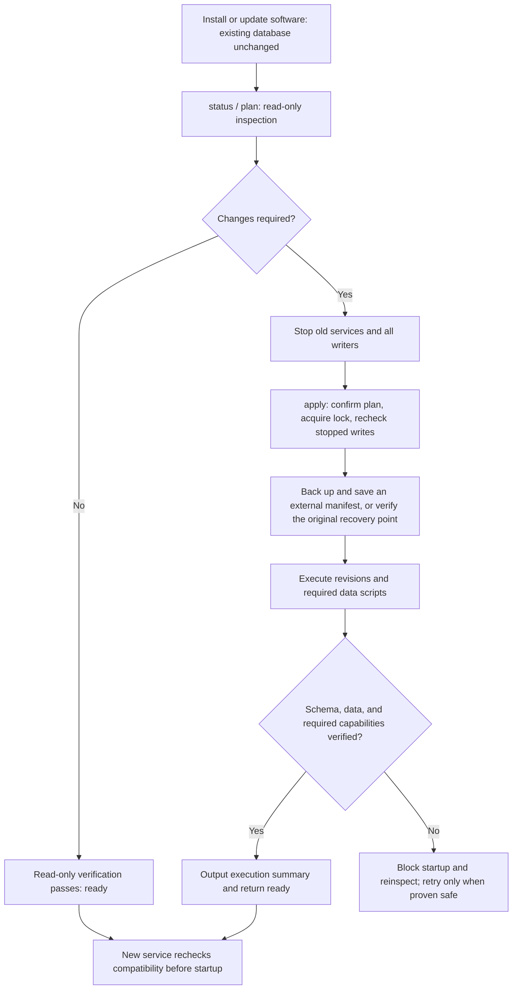
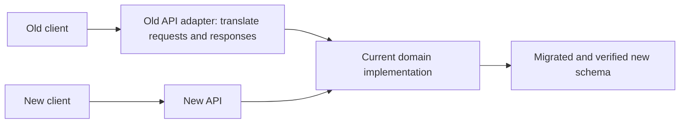

- Proposal Name: `unified_versioned_database_migrations`
- Start Date: 2026-09-28
- RFC PR: [oceanbase/powercontext#1771](https://github.com/oceanbase/powercontext/pull/1771)
- Tracking Issue: [oceanbase/powercontext#1756](https://github.com/oceanbase/powercontext/issues/1756)
- Related Discussion: [Migration framework proposal on PR #1716](https://github.com/oceanbase/powercontext/pull/1716#issuecomment-5862598291)
- Status: Design proposal. This document selects an approach and defines acceptance requirements; it does not claim that the framework or backend prototypes are implemented.

# Summary

Use **Alembic to manage relational schema versions, with one PowerContext migration entry point**. SQLite, embedded
seekDB, and OceanBase MySQL tenants share one logical revision chain; explicit adapters handle backend differences.
**The migration framework adds only one control table, `pc_schema_revision`, using Alembic's standard `version_num`
column and version advancement.** Migration definitions, dependencies, and validators ship with the code; execution
logs and backup manifests live outside the target database. The entry point owns legacy recognition, mutual exclusion,
plan confirmation, backups, preconditions, and postconditions. It creates no general-purpose run, step, or task tables.

Long-running backfills, identity attestation, and search projection rebuilds use separate scripts connected through
explicit schema phases and completion conditions. Safe retries are established from the current revision, actual
schema, business data, and existing domain receipts. The initial scope excludes general-purpose task scheduling,
generic checkpoints, and automatic resumption by execution run.

**Installing or upgrading software does not modify existing databases. Users explicitly initiate migrations for all
existing databases, local or remote. Normal startup checks schema compatibility and required data conditions; it does not
silently add columns, change constraints, or backfill existing data.** A genuinely empty database may be initialized
on first use: standard local mode executes the complete revision chain under a lock at a location permitted by
configuration; remote databases and deployments with multiple replicas use a separate initialization job.

The initial release uses **a maintenance window by default, enabling the new application only after migration
succeeds**. One `apply` command coordinates plan confirmation, checks that writes are stopped, checks backup or
recovery prerequisites, runs schema and required data tasks, performs final verification, and produces an external
execution summary. Failure blocks business readiness and permits recovery supported by evidence; it never triggers a destructive
downgrade automatically.

Software versions, API contract versions, and schema revisions are managed separately. After migration, old and new
APIs may share the current domain implementation and storage. Retaining an old endpoint does not require retaining
an old table. Tested storage compatibility paths are added only when explicitly supporting a new binary against an
old schema or mixed application versions. Neither `create_all()`, an unverified `stamp head`, nor generated scripts
constitute a complete migration.

**This proposal proceeds independently of PR #1716. Once enabled, the framework becomes PowerContext's standard
database change process, mandatory for every PR that changes managed schema.** Each such PR must include its
versioned migration, necessary data tasks, verification, and compatibility documentation, and pass the unified CI
gate. This applies across all modules and change sizes; #1716 is not a permanent exception.

# Motivation

Multiple initialization and maintenance paths currently determine whether a database is usable. Knowing that a table
exists does not establish that its constraints are correct, its backfill is complete, old Workers have stopped writing,
or a particular DDL statement has committed. Table renames, constraint changes, and concurrent replica startup make
these implicit assumptions more fragile.

An upgrade must answer five questions: what version the database has, what operations will run, who may run them,
whether execution can safely retry after interruption, and what permits traffic to resume. These requirements also become the
normal development, review, and merge process for every schema-changing PR.

## Existing paths and ownership

The inventory uses committed source [298314f8cbba](https://github.com/oceanbase/powercontext/tree/298314f8cbbaa57fcfec668668fb55d704a1b6eb/src/powercontext)
as its baseline; PR #1716 is listed separately. Paths are relative to `src/powercontext/`.

| Existing entry point | Current responsibility | Ownership in the unified model |
| --- | --- | --- |
| `builtin/persistence/schema.py:create_tables` and the three database `profile.py` modules | Run `create_all(checkfirst=True)` over caller-selected SQLAlchemy tables | Frozen initial and subsequent revisions replace production initialization; retain fixture use |
| `skill_distribution_schema.py` | Rebuild Skill publication tables, transform state, and change columns and constraints | Schema operations become revisions; row conversions become idempotently rerunnable data scripts, verified before constraints tighten |
| `tag_schema.py` | Rebuild the SQLite Tag table; remove the old family CHECK in the MySQL branch | One logical revision using batch reconstruction or explicit constraint DDL per backend |
| `dream_schema.py` | Add citation columns to Artifact and Candidate revisions | Additive revisions; register merged Dream columns and indexes according to their actual released form |
| `scope_search_schema.py` | Add search columns, backfill content, then enforce non-nullability | Expand revision → batched backfill → verify → contract revision |
| `experience_index.py` and backend Memory, Experience, and Topic Memory indexes | Add search and governance columns; create full-text/vector objects; initialize or rebuild projections | Authoritative table columns belong to revisions; physical index definitions and rebuilds belong to registered projection tasks scheduled by the same maintenance entry point |
| `processing_migration.py` and `server processing-migrate` | Existing plan/apply/verify, phase marker, migration ID, configuration manifest, receipts, and old Lease invalidation | Preserve semantics and receipts; move DDL into schema revisions and adapt remaining phases as data tasks that no longer change schema independently |
| `receipt_migration.py` and `server/factory.py` | Attest identities from committed receipt records; retain unresolved records in a review table | Independent attestation task preserving security boundaries and the review queue; schema version alone never proves completion |
| PR #1716's `candidate_schema.py` | Rename Candidate tables, rebuild SQLite tables, change MySQL constraints, and verify relationships | Recognize the final merged/released shape through baselines or explicit revisions; verify already-completed changes without repeating them |
| OceanBase profile identity-column collation checks and backend capability checks | Reject incompatible databases or index configurations | Retain migration preconditions and runtime validation; checks do not automatically repair data |

The main startup sequence is currently profile table creation → processing bootstrap/readiness checks →
Skill/Tag/Dream/Scope helpers → index initialization → runtime composition. The Server also attests receipts.
Their ordering becomes an explicit dependency graph rather than an implicit sequence of function calls.
[Runtime composition source](https://github.com/oceanbase/powercontext/blob/298314f8cbbaa57fcfec668668fb55d704a1b6eb/src/powercontext/builtin/runtime/composition.py)

This RFC owns official PowerContext persistence objects. Alembic does not automatically modify storage owned by
third-party components, external identity services, or user-created tables. Third-party extensions must register
ownership and dependencies explicitly before joining the process. Zero-downtime migration, moving data between
database systems, and direct upgrades from every historical version are outside the initial scope.

# Guide-level explanation

## 1. Upgrading a deployment

Users may install a new binary and migrate the database later in a suitable maintenance window. Installation commands
and package hooks do not connect to the business database, run migrations, or automatically start the new service.
Before migration, an existing service may continue only if its binary remains compatible with the current schema.
To defer the switch, retain an independently runnable old environment; do not rely on a live process continuing
indefinitely after its environment is overwritten in place.

The default sequence is: inspect migration impact → schedule maintenance → stop old services, Workers, schedulers,
and SDK writers → run the migration command → start the new service according to the result. Deployment systems
must not automatically restart old instances during maintenance. The migration CLI assembles its executor independently
of business HTTP startup and does not first invoke a runtime factory that creates tables or backfills data.

### Commands and interaction

The following commands are a **proposed CLI contract, not currently implemented commands**. All migration operations
use the `powercontext server db-migrate` command group.

Inspect state and impact first. These commands are read-only for the target database and do not create version,
lock, or business tables:

```bash
powercontext server db-migrate status --env-file deployment.env
powercontext server db-migrate plan --env-file deployment.env
```

Run `apply` after writes have stopped. It regenerates and displays the actual plan, then executes after one confirmation
in an interactive terminal. A verified profile adapter automatically creates a consistent local backup; remote
databases require a backup or recovery-point reference. Final `verify` is built into successful execution, so users
do not manually execute individual SQL statements or assemble the necessary data tasks.

```bash
powercontext server db-migrate apply --env-file deployment.env --maintenance-confirmed
```

For remote databases, the deployment's existing backup system creates a consistent recovery point covering the target
data, and the migration receives its reference. Non-interactive deployment must explicitly accept a reviewed plan;
the absence of a terminal never implies consent:

```bash
powercontext server db-migrate apply --env-file deployment.env --plan-id PLAN_ID --backup-ref BACKUP_ID --maintenance-confirmed --yes
```

`plan_id` binds the target database identity, source and target revisions, managed schema fingerprint, script/task
checksums, relevant configuration digest, and recovery requirements. If any changes during revalidation under the
lock, execution stops for a new review. Data-dependent preconditions are checked again under the lock; planning-time
row counts or check results are not permanently valid. Planning exposes neither credentials nor business payloads
and writes no pending-execution marker into the target. `--yes` accepts only that plan; it cannot bypass known active
writers, backup requirements, locks, compatibility, or verification errors. For a non-interactive plan with changes,
either a missing `--yes` or a missing valid plan returns `confirmation_required`, without waiting for input.

The result includes source and target revisions, schema/data/projection results observed during this invocation,
backup reference, verification summary, and next action. It sends the execution summary to a local log file or deployment
logging system. A log correlation identifier supports diagnosis; it is not a resumable execution run stored in the
database. Only an explicit `ready` permits deployment to start the new business service. Alembic reaching head does not
replace data and capability verification.

If no schema, baseline-adoption, or planned data/projection changes remain and read-only verification passes, `apply`
returns `ready` and “no changes” directly. It requires no maintenance window, confirmation, or new backup, and creates
no persistent migration record. This establishes compatibility at inspection time; subsequent business startup checks again rather
than treating the result as a permanent admission credential.

### Inspection and recovery

Standalone `verify` supports operator review and deployment checks and is read-only for the target database. After
interruption, inspect state and actual schema again, then produce a new plan for the observed state:

```bash
powercontext server db-migrate status --env-file deployment.env
powercontext server db-migrate verify --env-file deployment.env
powercontext server db-migrate plan --env-file deployment.env
```

Run `apply` again only when script preconditions and postconditions prove retry is safe. Non-interactive execution
accepts the newly reviewed plan and references the original pre-migration backup from the same maintenance window:

```bash
powercontext server db-migrate apply --env-file deployment.env --plan-id PLAN_ID --backup-ref BACKUP_ID --maintenance-confirmed --yes
```

There is no command for automatic resumption by execution run. The executor rereads versions and actual state; logs
cannot be the sole evidence of step completion. Rolled-back transactions and precisely recognized idempotent steps
may be retried. Ambiguous partial migration returns `recovery_required` for dedicated repair or backup restoration.
If the backup manifest is unavailable, targets another database, or cannot be tied to this maintenance window, stop
instead of replacing the original recovery point with a new backup of partial state.

During the compatibility period, `processing-migrate` forwards to the unified maintenance entry point, preserving
its domain migration ID, manifest, and existing receipt semantics. Those domain records are not newly added generic
control tables and cannot bypass maintenance, backups, or completion conditions.



## 2. Automatic and explicit execution boundaries

| Scenario | Default behavior |
| --- | --- |
| Install or upgrade the PowerContext package | Update software and migration resources only; do not connect to or modify an existing business database or run migrations automatically |
| First-use, empty local SQLite or embedded seekDB database at a location permitting initialization | Confirm emptiness under the lock, execute complete initialization and verification automatically, then start |
| New OceanBase database or deployment with multiple replicas | Initialize explicitly in a separate migration job; API/Worker instances only check compatibility |
| Existing schema compatible with the binary and all required tasks complete | Start normally without schema writes or implicit repair |
| Any existing database requiring schema upgrade, table reconstruction, constraint changes, or required backfills | Return `migration_required`, block business startup, and suggest explicit migration; local and remote databases follow the same rule |
| A known migration lock is held, or actual schema/required data verification fails | Return `migration_running` when execution is observable, or `recovery_required` when dedicated recovery is needed; block writes and readiness. The version table alone cannot identify a failed historical invocation |
| Compatible schema with only optional projection tasks explicitly allowed to run later | Disable the affected retrieval capability and report degradation; decide core readiness according to capability contracts, without hidden startup rebuilds |
| Unversioned database containing managed business tables or an unrecognized legacy shape | Require explicit baseline recognition; return `unknown_baseline` for unknown shapes instead of treating them as empty |
| Unknown revision or revision outside the binary's explicit support set | Return `incompatible_schema`, reject business startup, and leave the database unchanged |

Automatic first-use initialization requires a permitted target location, no managed business tables or historical
markers, no interrupted-operation residue, and revalidation under the lock. Empty business tables, a missing version
table, or an unreadable version do not establish that a database is empty. A failed table read caused by remote
credentials targeting the wrong database or an incorrect local path never justifies creating a database.

The release declares a set of known supported revisions; it does not compare revision strings lexicographically.
Initially only the target revision is supported by default. Expanding the set requires read/write, task, and recovery
tests for every allowed version. Supporting mixed binaries additionally requires mixed-version tests. Either an older
or newer schema can be incompatible; unknown revisions are rejected even if they appear to add only a few columns.

Checks apply to HTTP Server, Workers, scheduled tasks, embedded SDKs, and CLIs that open official persistence directly.
They run before domain factories, schema helpers, and background tasks. An incomplete migration must not produce a
partially working service that waits for requests to fail. `status`, `plan`, `verify`, and recovery remain independently
usable; monitoring liveness is not business readiness. Errors include stable categories, current/target revisions,
blocking reasons, and suggested commands. Missing DDL privileges do not justify skipping checks.

## 3. Coordinating old and new APIs with database versions

Package version, API contract version, and schema revision are separate dimensions. Each release declares its target
schema, allowed schema set, required tasks and capabilities, and supported API contracts. API names and prefixes do
not directly select database revisions.

Suppose an old endpoint uses an old table, and a release introduces both a new endpoint and a new table structure.
The initial default sequence is: stop old service writes → explicitly transform old data and schema → verify → start
the new service. The old endpoint may retain an adapter that translates requests into current domain operations and
results into the old response shape. Both endpoints then access the same migrated storage. If semantics cannot be
preserved, publish an explicit new contract and arrange client upgrades; retaining the old URL must not silently
change its meaning.



| Published support promise | New binary before migration | Required compatibility work |
| --- | --- | --- |
| Initial default: maintenance-window migration | Block business startup on incompatible schema; enable old and new APIs after successful migration | API contract adapters and migration verification; handlers do not need to support two table layouts |
| Explicit support for a new binary against old schema | Enable only declared and tested old-schema capabilities; make features requiring new structure explicitly unavailable | Centralize version differences in persistence adapters and test every permitted old-schema read/write path |
| Old and new services must run concurrently | Expand, backfill, and verify before traffic switches; contract only after every old instance exits | Write consistency, backfill catch-up, mixed-version tests, and explicit exit conditions; not a default initial capability |

Do not scatter “column missing, try another SQL statement” fallbacks across handlers, or promise untested dual writes,
bidirectional synchronization, or automatic fallback to old tables. Retaining an old API, retaining old tables, and
allowing old binaries to keep running are separately tested promises. Record conditions and release timing for table/
column removal separately from API retirement. After an incompatible database change, reverting only the application
package is not a safe rollback.

## 4. Standard contributor workflow

Once the framework is enabled, the following process applies to every PR adding, removing, or renaming managed tables
or changing columns, types, defaults, nullability, primary/foreign keys, CHECK constraints, indexes, or collation.
Even adding one field cannot bypass it.

1. **Submit models and migrations together.** Update target schema definitions and add a frozen revision based on the
   current head. Register optional full-text/vector object definitions, projection versions, and tasks through the same
   process. Model-only edits, standalone startup DDL, and instructions for users to alter tables manually are insufficient.
2. **Declare dependencies and execution policy.** Changes involving existing data include separate data tasks specifying
   expand/backfill/contract order, preconditions, postconditions, maintenance requirements, idempotency, and interruption
   recovery. Identify applicable backends and explain any non-applicability.
3. **Provide verification evidence.** According to impact, cover empty initialization, supported-release upgrades,
   repeated execution, recovery, and domain invariants. Cross-backend schema changes cover SQLite, seekDB, and OceanBase;
   skipped backend validation is not a passing result.
4. **Document operational and API impact in the PR.** List source/target revisions, data/projection tasks, application
   compatibility, stopped-write and backup requirements, verification results, and forward-repair or backup-restoration
   procedures. API changes additionally document old-contract adapters, client upgrade requirements, and any promise
   that old schemas or binaries remain usable. Destructive migrations need not be reversible.
5. **Merge only after review and required CI checks pass.** If the base branch head changes, reconcile unpublished
   revision dependencies and revalidate before merging, retaining a single head. Published revisions are immutable.
   Schema changes without corresponding migrations or with failed verification cannot merge.

Each managed schema change includes a separate Alembic revision script. A software release with no schema changes
needs no new revision; one release may contain several. For example, `r001 → r002 → r003` may initialize tables, add a
column, and change a constraint. A database at `r001` executes `r002` then `r003`; it does not need another combined
`r001 → r003` script. Retain historical scripts and frozen dependencies. Correct published scripts through a new
revision, with explicit backend adaptations inside the same logical revision.

Independent delivery describes the framework's implementation schedule only. Schema-changing PRs still unmerged when
the framework is enabled must adopt this process. Already merged or released changes are covered by baselines and
legacy adapters.

# Reference-level explanation

## 1. Selection and responsibility boundaries

| Option | Fit for this project | Main cost | Decision |
| --- | --- | --- | --- |
| Alembic with a PowerContext execution layer | Reuses SQLAlchemy definitions, revision dependencies, and SQLite batch operations; integrates with the async engine through `AsyncConnection.run_sync` | Still requires backend capabilities, locks, data tasks, and recovery; autogeneration has blind spots | **Selected** |
| Small custom revision registry | Directly reuses async helpers with little initial code | Must continually maintain revision graphs, stable historical scripts, difference detection, auditability, and tooling; risks becoming another collection of helpers | Not the primary framework; retain only a thin execution-policy and task-registration layer |
| SQL-first tools, represented by Flyway | Clear SQL changes, versioned scripts, history tables, and checksums | Adds tooling to Python distribution; still needs SQL for three profiles, embedded-engine lifecycle handling, and Python data transformations | Not a default dependency; expose plans and backend DDL for SQL review |

Alembic documents async integration and separating data migrations; Flyway's versioned scripts and checksums inform
the design. Selection is based on PowerContext's existing SQLAlchemy and Python deployment model, not a claim of
completed compatibility experiments across all backends.
[Alembic Cookbook](https://alembic.sqlalchemy.org/en/latest/cookbook.html#using-asyncio-with-alembic),
[Flyway Versioned migrations](https://documentation.red-gate.com/flyway/flyway-concepts/migrations/versioned-migrations)

Include Alembic in the dependency set for official persistence and ship migration resources in the wheel. End users
do not need a separate CLI installation. The supported entry point invokes Alembic only through PowerContext's
execution layer, preventing bare `alembic upgrade` from bypassing locks or data dependencies.

## 2. Revision and persistence model

Each physical database/schema has one official core schema revision chain. Revisions are neither Scope-specific nor
application package versions. A release has exactly one target head. Unpublished branches are reconciled into a linear
chain before merge; published revisions are never rewritten.

Each revision has stable `revision` and `down_revision` identifiers plus supported backends, preconditions, maintenance
requirements, postconditions, and validators. Revisions include frozen table/type definitions; they must not import
mutable application ORM tables to reconstruct historical state. Even a backend-specific no-op must prove the logical
revision's postconditions; it cannot simply ignore exceptions.

**Only one migration control table is added:**

| Table | Column | Purpose |
| --- | --- | --- |
| `pc_schema_revision` | `version_num` | Standard Alembic version table recording the current completed revision; a linear chain normally has one row after baseline adoption or completion of the first revision |

Set the name through Alembic's `version_table="pc_schema_revision"` option and retain standard version reads and
advancement. Do not add run, step, task, or JSON progress fields, move those records to additional generic tables or
disguised business data, or replace Alembic's version management. This limit applies to new migration control tables,
not business tables required by product features.
[Alembic version table](https://alembic.sqlalchemy.org/en/latest/tutorial.html#running-our-first-migration)

Information has distinct homes:

| Information | Storage or verification |
| --- | --- |
| Revision definitions, dependencies, frozen schema, and validators | Versioned Python scripts and declarative resources shipped in the wheel |
| Target software version, supported schemas, data completion conditions, and optional capability requirements | Release compatibility manifest |
| Current schema position | `pc_schema_revision.version_num` |
| Execution details, errors, and verification summaries | Local files or deployment logging; audit evidence, never sole proof of step completion |
| Backup reference, target identity, source/target revisions, configuration and package digests, time, coverage, and verification results | External backup manifest, durably saved before the first mutation and revalidated on retry |
| Required data and projection completion | Actual data, object definitions, and existing domain receipts/markers; no generic task-state table |

Readiness requires a supported target revision, correct actual schema, and all required data and capability conditions.
The absence of a task ledger does not prove completion, and a successful log cannot replace verification. Optional
projections explicitly permitted to run later disable only the affected capabilities. Declarations and checks share the
release manifest.

CI compares against released code to prohibit rewriting historical scripts and frozen dependencies. Runtime checks
validate shipped resources against the trusted package checksum manifest. The backup manifest also records the package
digest used during maintenance for retry checks. The version table stores no per-execution script checksums, so a
revision alone cannot reconstruct the exact script bytes historically executed on that database. If recovery needs
such evidence and external records are missing, stop for dedicated handling. Schema fingerprints cannot prove the full
execution history either.

For existing databases, acquire the lock and satisfy stopped-write and backup requirements before creating the version
table from its fixed definition or adopting a recognized baseline. A missing, empty, or partially created version
table does not establish that the business database is empty. Inspect managed objects first and reject writes for
unrecognized state. Empty initialization starts with the frozen initial revision.

Verify optional full-text/vector projections against registered backend object inventories, `projection_version`, and
configuration digests, reusing existing domain markers or deriving completion from actual results. Enabling a capability
explicitly installs or rebuilds its objects; disabling it retains objects and domain records. Ordinary startup adds no
DDL. New durable cursors or general-purpose task services require separate designs; this RFC does not implicitly add
control tables for them.

## 3. Empty initialization and legacy baselines

**Inspect before writing.** Migration checks precede the current profile's `create_tables` and domain initialization.
Separate connection setup, engine lifecycle, and driver configuration from schema initialization. Startup must not
modify tables to discover their version. `status`, `plan`, and `verify` use inspection connections without table-creation
side effects; missing targets return `uninitialized`, without creating database files or control tables. If an embedded
engine cannot provide that inspection path, its adapter returns an explicit unsupported reason rather than silently
opening a writable initialization path.

- **Empty database:** Under the lock, establish the absence of managed business tables and historical markers, then run
  the frozen initial revision → subsequent revisions → required initialization tasks → verify. Empty and upgraded
  databases targeting the same revision must produce the same managed schema. Initially there is no
  `create_all()`-then-stamp shortcut.
- **Versioned database:** Validate the revision, package resource integrity, managed schema, and required data conditions
  before advancing. After interruption, inspect actual state again and continue only through a defined safe retry path.
  Insufficient external recovery evidence or ambiguous state rejects writes.
- **Unversioned legacy database:** Accept only shapes explicitly recognized in the baseline inventory. Recognition
  covers tables, column types/nullability/defaults, primary and foreign keys, CHECK constraints, indexes, identity
  collations, optional capabilities, and processing/projection markers, plus applicable data-integrity checks. Package
  versions, one column's presence, or zero row counts alone are insufficient.
- **Unknown or mixed shape:** Report differences and reject writes. Temporary-table residue, simultaneous old/new
  Candidate tables, or one missing table from a required pair need specific recovery paths; forced stamping is forbidden.

The initial fixtures must include databases created by the released
[powercontext-v1.1.0](https://github.com/oceanbase/powercontext/releases/tag/powercontext-v1.1.0) package and the last
supported release preceding framework adoption. Do not simulate old releases by deleting columns from current models.
Earlier versions support direct adoption only after entering the tested baseline inventory; otherwise require a
supported intermediate upgrade path or a dedicated adapter.

Baseline adoption is read-only recognition → lock and revalidation → reviewed legacy adapter for known differences →
complete verification → record the matching baseline revision → subsequent revisions. A baseline proves schema state
only; processing receipts, configuration manifests, and pending identity reviews remain independently validated.
Freeze the baseline snapshot when adopting the framework. Delivered changes, including #1716, use recognizers and
adapters; changes still unmerged after enablement submit migrations through the standard process.

## 4. Execution order and data-task dependencies

The unified execution order is:

1. Read versions, backend capabilities, actual schema, and required data conditions without writes; generate and display
   the plan and obtain one explicit confirmation.
2. Acquire the database-wide migration lock, revalidate the plan, and recheck known writers and maintenance conditions.
   Reject execution if known active writers have not stopped.
3. For existing databases, create a consistent backup or verify the external manifest for the original recovery point
   from this maintenance window. Insufficient recovery evidence blocks schema and business-data writes. Explain the
   backup exemption for a genuinely empty database.
4. Save the plan, maintenance confirmation, and backup information outside the target; open diagnostic logs for this
   invocation. Explicitly adopt a recognized baseline if needed.
5. Use Alembic to execute expand revisions.
6. Run separate data scripts in batches with verifiable data conditions; execute contract revisions only after completion
   verification passes.
7. Install/rebuild and verify required projections; identify optional capabilities that remain unavailable.
8. Run built-in final verify for the revision, actual schema, required data, and domain invariants; output results and
   backup references in an external execution summary.
9. Release the lock and return `ready`; only then may deployment start the new service and Workers. The command does not
   restart external processes.

For schema-only changes, Alembic follows the revision chain. For large data changes, the entry point invokes Alembic at
declared phase boundaries: expand revision → separate data backfill → completion verification → contract revision.
The contract revision itself rechecks required data conditions instead of trusting a successful log or task status.
Incomplete data prevents advancement to the target revision.
[Alembic data migrations](https://alembic.sqlalchemy.org/en/latest/cookbook.html#data-migrations-general-techniques)

Phases and validators are declared in packaged resources; planning exposes their order and blockers. There is no
general-purpose task DAG scheduler or persistent queue. Small data changes suitable for the current transaction may
live in a revision; large backfills and external calls should not be placed in one long DDL transaction.

Data scripts preferentially derive remaining work from business data, using stable-key pagination, idempotent writes,
and independent completion verification. Retrying may rescan completed ranges but must not increment counters twice,
duplicate Artifacts, or apply effects twice. When existing domain checkpoints/receipts can be reused, commit each
batch's changes and receipt in the same transaction. Without that state, generic checkpoint resumption is not promised.
Scripts whose progress cannot be proven from data and which cannot safely rerun require a dedicated recovery procedure;
otherwise they are unsupported. The last line of an external log is not evidence of data commit.

Processing scripts preserve existing Lease invalidation, manifest verification, and migration receipt semantics.
Receipt attestation uses only committed identity records; unknown identities retain their review boundary, and external
identity lookup failure still fails execution. External interactions retain domain idempotency protocols without
claiming transaction atomicity across systems.

Projection scripts rebuild from authoritative Sources and Artifacts without modifying authoritative content to fit an
index. Embedding model, dimension, and retrieval-shape changes require configuration-digest checks and explicit rebuilds
when incompatible. Initially rebuilds require stopped writes; actual projection objects, data coverage, and existing
domain markers establish completion. Schema head cannot replace capability checks. Online switching requires a
separate design for generations, catch-up, and atomic cutover.

## 5. Locks and multiple replicas

Migration locks identify the physical database and managed namespace, not a process or revision. They cover
recognition, DDL, required data steps, and final verification. Waiting is bounded; timeout returns retryable
`migration_locked`. A holder rereads state after acquiring the lock; a second executor only verifies and returns if
the target has already been reached.

| Profile | Mutual exclusion | DDL and recovery constraints |
| --- | --- | --- |
| SQLite file database | An OS-backed cross-process file lock on the normalized database path covers the full operation; each schema revision uses explicit `BEGIN IMMEDIATE` | Batch reconstruction, data copying, and revision advancement use verified transaction boundaries; failures roll back and recovery rechecks state |
| In-memory SQLite | A process-local lock for the shared engine | New initialization only, without durable offline recovery; process-local locks cannot substitute for multi-process file-database locking |
| Embedded seekDB | An OS-backed cross-process file lock on the normalized data directory, acquired before opening the migration engine | MySQL protocol compatibility does not prove support for all lock functions or transactional DDL; use the stepwise nontransactional-DDL verification protocol |
| OceanBase MySQL tenant | A capability-verified `GET_LOCK` named lock on a dedicated physical connection that also executes DDL | The lock must survive commits; disable automatic reconnect during execution, stop further steps on disconnect, and never assume rollback undoes DDL |

SQLite's `BEGIN IMMEDIATE` acquires a write transaction early; the file lock retains maintenance exclusivity across
batches. Use an operating-system lock rather than the existence of a lock file, normalize symlinks, and do not claim
support for embedded-database migration across hosts through shared filesystems.
[SQLite Transactions](https://www.sqlite.org/lang_transaction.html)

OceanBase documents that named locks survive commit/rollback, but support differs between versioned documentation.
Verify two-connection exclusion and routing across connections on the chosen minimum/target versions, actual tenant,
and proxy path. A successful function return alone is insufficient. If this cannot be verified, return
`migration_lock_unsupported` before managed DDL; never fall back to a row lock released by DDL's implicit commit.
[GET_LOCK](https://en.oceanbase.com/docs/common-oceanbase-database-10000000001379158),
[V4.3.0 compatibility](https://en.oceanbase.com/docs/common-oceanbase-database-10000000001228196)

**Mutual exclusion between migrators and stopping business writes are separate conditions.** Named and file locks
coordinate only participating migration processes. They do not prove that API, Worker, SDK, or old-binary writes have
stopped. The executor checks known writers using available process, engine-owner, and domain Lease information.
Known active writers produce `active_writers`, even when confirmation flags are supplied.

Initially the operator or deployment orchestrator stops every writing entry point and disables automatic restarts of
old instances. The tool does not claim to discover arbitrary external clients or fence every old version.
`--maintenance-confirmed` records confirmation and evidence of this maintenance condition; it does not implement
write isolation. New startup paths check observable migration locks, the revision, actual schema, and required data
conditions, rejecting readiness on observed migration or incompatibility. A single version table cannot persist the
fact that an invocation failed, and missing logs do not establish that no migration is occurring. Deployment
orchestration still prevents new instances from starting during maintenance. If lock state cannot be reliably inspected
read-only, do not report it as unlocked. These checks cannot stop already-running unknown clients; migration is
unsupported when stopped-write conditions cannot be established.

Deployments with multiple replicas run one migration Job; failure blocks rollout. Maintenance ends and application
startup begins only after `ready`. Each replica still checks compatibility at startup instead of trusting that a Job
once succeeded. Initially, incompatible old versions may not continue running during contract migrations.

## 6. Interruption recovery and verification

OceanBase DDL may commit implicitly. A Python transaction context cannot make several DDL statements atomic; seekDB
initially follows the same conservative recovery model.
[OceanBase transaction commits](https://www.oceanbase.com/docs/common-oceanbase-database-cn-1000000004476105)

Alembic updates the version table after executing a revision, but that table does not record progress for individual
SQL statements inside it. Nontransactional DDL may partially commit while the version remains at the previous revision.
Each such revision must define acceptable preconditions, exact postconditions, recognizable intermediate states, and
rejection conditions. Diagnostic logs provide clues, not substitutes for actual checks. Retry distinguishes three cases:

| Observed state | Recovery action |
| --- | --- |
| Full preconditions hold and the previous session/DDL is confirmed ended | Execute again after maintenance, backup, lock, and newly confirmed plan requirements are met |
| Exact postconditions for an operation hold, but the revision has not advanced | An explicit idempotent branch in the revision verifies and skips that operation; Alembic advances normally only after all operations and invariants pass |
| Old/new states coexist, data differs, or the result cannot be proven | Return `recovery_required`, retain external evidence, and stop for dedicated repair or backup restoration |

Adding a column requires verifying type, default, nullability, and related constraints, not just its name. Renames must
distinguish old-only, new-only, and simultaneous old/new tables. After network timeout or database failover, establish
that the old session and related DDL have ended and inspect stable state before recovery. Timeout, missing heartbeats,
or a successful reconnect do not authorize automatic takeover of potentially running DDL.

SQLite reconstruction uses frozen definitions and Alembic batch or explicit reconstruction steps, preserving indexes,
constraints, triggers, and related views. If foreign-key enforcement must be disabled, change it only on the dedicated
connection outside the transaction, run `foreign_key_check` before commit, and restore the setting afterward. A generic
“rename old table, create new table” template must not ignore foreign-key reference rewrites.
[Alembic Batch](https://alembic.sqlalchemy.org/en/latest/batch.html),
[SQLite schema-change procedure](https://www.sqlite.org/lang_altertable.html#making_other_kinds_of_table_schema_changes)

Each revision verifies actual schema against its target definition and the affected domain invariants. Copies compare
primary-key sets, row counts, and retained field contents, not counts alone. Candidate checks cover heads pointing to
real versions and Scope foreign keys; processing checks cover receipts, counters, and manifests; retrieval projections
check the corresponding Artifact revisions and representative queries.

With verified transaction configuration, SQLite atomically commits schema changes, in-revision verification, and
version advancement; failures roll back and require reinspection. On nontransactional-DDL backends, `upgrade()` checks
all postconditions before Alembic advances the version. If DDL commits but the version update does not, retry enters
that revision's state-recognition logic. Without an explicit idempotent branch, stop; bare stamping is forbidden.
Final verify and startup checks independently validate required external data/projection conditions.

A revision may contain related operations but needs reviewable, recoverable boundaries. Splitting every SQL statement
into a separate revision does not eliminate interruption windows in nontransactional DDL. Irreversible or ambiguous
states require forward repair or backup restoration. The executor neither runs destructive downgrades automatically
nor silently removes unrecognized intermediate tables.

## 7. Backups and release recovery

Local and remote existing databases follow the same rule: establish traceable recovery prerequisites before the first
managed schema or business-data write. The distinction is how much the tool can automate, not whether a database may
skip checks. The initial release has no generic `--force` or `--no-backup` bypass for required recovery conditions.
Genuinely empty initialization records its backup exemption separately.

| Profile | Default backup experience | Required boundary |
| --- | --- | --- |
| SQLite file database | After writes stop and the lock is acquired, an adapter makes a verified consistent backup and reports its location, database identity, time, validation result, and restore procedure | Include committed WAL data; copying only the main file does not prove recoverability |
| Embedded seekDB | Use a verified engine backup/snapshot facility, or a complete persistent-directory snapshot after confirmed engine shutdown | An ordinary copy of a running engine's directory is not a consistent snapshot; if the adapter cannot establish consistency, require external recovery evidence or return `backup_required` |
| OceanBase and other remote databases | Use existing deployment backup, snapshot, or point-in-time recovery systems; accept a reference through `--backup-ref` | Check target tenant/database, time, coverage, and restore procedure; a backup ID alone does not prove successful restoration |

Plans distinguish authoritative data, pending queues, the version table and existing domain receipts, and rebuildable
projections. Backups cover all affected non-rebuildable state and every committed change before writes stop. A full backup predating maintenance
is acceptable only with evidence that its logs recover through the stopped-write boundary; a stale reference alone
is insufficient. Tasks spanning files and databases specify their shared consistency boundary. Non-rebuildable
pending messages cannot be discarded merely because they reside in an index directory.

Backup manifests live outside the target database and include target identity, location/reference, creation time,
source/target revisions, migration-package and configuration digests, covered objects, validation digest, verification
level, and restore instructions. Record adapter-verified results separately from operator confirmations.
Expose anything that cannot be automatically verified at plan confirmation instead of reporting it as automatically
verified. Evidence insufficient for the step's requirements returns `backup_required`; execution must not lower those
requirements. Local backup failure, insufficient space, or a mismatched backup target prevents schema changes.

Retries within the same maintenance window retain the original pre-migration backup; a snapshot of partially migrated
state cannot replace it. Recover the original reference through `--backup-ref` or a managed backup manifest bound to
the target, then recheck package, configuration, target, and uninterrupted maintenance conditions. Unproven conditions
return `backup_required` or `recovery_required`. Additional partial-state backups may be retained but never replace the
original recovery point.

A retry plan records the currently observed revision and schema; the backup manifest retains the original recovery
point's source revision. These need not match. If an upgrade from `r001` to `r003` completed `r002`, retry plans continue
from `r002` while the original backup still represents `r001`. Verify that observed state belongs to a recognized path
for the same target, package, and maintenance window; never rewrite the manifest to hide the difference.

Persist the backup manifest before the first mutation, allowing retrieval and verification even after exiting before
version-table creation. Remote deployments use backup services or artifact storage accessible after replacing the
migration Job, rather than keeping evidence only in an ephemeral container directory. CLI summaries include the recovery
reference; backup and manifest retention follows policy, without immediate deletion after success. If business writes
resumed after the attempt, reconcile new data and recovery boundaries separately rather than automatically extending
the old maintenance window.

External execution logs do not form another generic task database. Missing logs do not bypass actual database checks
for status and readiness. Partial migrations missing required recovery evidence must stop. The initial scope does not
promise complete execution-history queries from the database or resumption of a specific execution run.

On failure, step postconditions determine whether retry or forward repair is safe. Unproven state stops execution for
dedicated recovery. When restoring a backup, keep writes stopped and restore the database, required files, and matching
binary according to the procedure, then verify completely. Restoration loses changes after the recovery point, so it
must never automatically overwrite a database with unaccounted writes. Package rollback and database restoration are
separate actions. Unless compatibility manifests and tests establish that an old binary can use the current schema,
reject its startup. The initial release provides no one-command destructive downgrade.

## 8. CI and prototype acceptance

CI checks both empty/upgrade equivalence and whether model changes have migrations; the presence of an extra file is
not enough. Once the framework is enabled, these are required merge checks for all schema-changing PRs. Missing
migrations, dependency conflicts, and verification failures block merging.

1. On real profiles, migrate an empty database to head and compare it with current managed metadata and backend object
   inventories. Upgrade fixtures from real released packages and compare the results as well.
2. Run `alembic check` for ordinary model differences. Add explicit comparators for CHECK constraints, primary/foreign
   keys, collation, full-text/vector/virtual tables, and other blind spots. Express renames manually instead of accepting
   generated drop-and-create operations.
3. Compare the schema inventory with the base branch: core structure changes need new revisions; optional projection
   definition changes need new projection versions and tasks. Check one head, immutable released scripts and dependencies,
   complete phase ordering and validators, and wheel resources matching the checksum manifest.
4. Filter externally owned tables using registered ownership, never adding unknown objects to a drop plan. Prohibit
   new schema writes, existing-data backfills, or index rebuilds in installation hooks and ordinary startup paths.
5. Verify that installation/upgrades and `status`/`plan`/`verify` leave existing databases unchanged. Distinguish truly
   empty initialization from an unversioned database containing business tables. HTTP, Worker, and SDK entry points
   reject business access when incompatible or incompletely migrated.
6. Verify renewed confirmation after plan changes, non-interactive confirmation rules, failed automatic backups blocking
   execution, external backup target checks, retries after reinspection retaining the original recovery point, and failed
   required data/projection conditions preventing `ready`.
7. For API changes, test old and new client contracts against the same migrated data. If supporting old schemas or mixed
   binaries, separately test those combinations and rejection of unsupported combinations.
8. Check that the framework adds only `pc_schema_revision` with the standard column, without other generic control tables
   or JSON progress in the version table. Missing logs must not bypass actual state checks; missing original backup
   manifests must block retries needing that evidence. A release may contain multiple revisions, while no schema change
   needs no new script.

`alembic check` has the same comparison limits as autogenerate, so it cannot independently prove completeness. Combine
it with profile-level schema checks and domain assertions.
[Alembic Autogenerate and Check](https://alembic.sqlalchemy.org/en/latest/autogenerate.html)

The prototype uses two real change classes: A adds columns such as Dream citations; B removes the Tag CHECK, requiring
SQLite table reconstruction and seekDB/OceanBase constraint changes. The final #1716 Candidate shape provides additional
baseline/rename fixtures for already-migrated, pending, and partially migrated states.

| Required scenario | SQLite | seekDB | OceanBase |
| --- | --- | --- | --- |
| Empty initialization and supported-release upgrades, including v1.1.0 | Required | Required | Required |
| A additive change and B table reconstruction or constraint change | Required | Required | Required |
| Repeated execution without extra side effects; correct data and retrieval after upgrade | Required | Required | Required |
| Interruption around every commit boundary, including completed DDL without version advancement | Required | Required | Required |
| Two concurrent processes, lock timeout, and lock-holder exit | Required | Required | Required, including proxy/node routing |
| Database newer than the binary, unknown revision, and package integrity or recovery-package digest mismatch | Required | Required | Required |
| Unknown baseline, old/new tables coexisting, temporary-table residue, and data-verification failure | Required | Required | Required |
| Unmet required data conditions block API/Worker/SDK access; idempotent reruns or recovery through existing domain checkpoints | Required | Required | Required |
| Installation/ordinary startup leave existing databases unchanged; read-only commands create no missing target; unversioned legacy databases are not treated as empty | Required | Required | Required |
| Active writers, failed backups, and incorrect recovery references block execution; plan changes require confirmation again | Required | Required | Required |
| Restored pre-migration backups verify and work with the matching binary | Required, including WAL data | Required, including engine lifecycle | Required, including actual backup/restore paths |
| Old/new API contracts against the same migrated data | Required for affected APIs | Required for affected APIs | Required for affected APIs |

These are implementation acceptance requirements, not claims of executed prototypes. Reports record Python, driver,
database/embedded-engine, tenant-mode, and proxy versions. All three profiles require real database reports; missing
environments or skipped cases do not pass acceptance. If transactional DDL, reflection, constraints, or locking differ
from expectations, complete the adapters and recovery steps before enabling the default path.

## 9. Implementation and rollout

- **Phase A: Evidence and prototypes.** Freeze supported versions and baseline fixtures, exercise both change classes
  plus lock/recovery matrices, and establish how Alembic runs with existing official dialects. User upgrade paths remain
  unchanged during this phase.
- **Phase B: Unified entry point.** Add only the standard Alembic version table, status/plan/apply/verify, plan confirmation,
  external execution logs and backup manifests, idempotent retries, and legacy adapters while retaining old commands.
  First adoption is explicit; new databases follow the revision chain. Migration is independent of business startup.
  This phase delivers neither a generic task ledger nor automatic resumption by execution run.
- **Phase C: Standard change process.** Convert helpers into revisions, tasks, or read-only checks, removing superseded
  startup DDL and implicit full backfills. Update contributor guidance, the PR template, and required CI checks together,
  defining the enablement point. All still-unmerged schema-changing PRs then follow this RFC. Never retain two entry
  points that independently mutate the same tables.
- **Phase D: Release gates.** Package schema/API compatibility manifests. Release documentation covers installation versus
  migration, supported source versions, maintenance, backup recovery, and client compatibility. Claim support only after
  all three backends pass. Production sequencing is stopped old writers → independent migration Job → completed
  verification → new application startup.

Before framework enablement, feature PRs such as #1716 do not have to wait for its delivery; their shipped schema is
adopted through baselines. After enablement, all still-unmerged schema-changing PRs, including #1716, must include
corresponding migrations and pass the unified gate rather than introducing feature-specific migration paths.

# Drawbacks

A single version table reduces database control objects but stores no per-step progress, failed runs, or historical
checksums actually executed. Diagnosis depends on external logs; recovery depends on actual state and retained backup
evidence. Large tasks without existing domain checkpoints may rescan data; unprovable partial state needs manual repair.
Generic checkpoint resumption cannot be promised.

Alembic does not eliminate backend differences. Script idempotency, validators, backup manifests, historical fixtures,
and real-database CI add ongoing maintenance costs. Explicit migration adds operational steps, and first adoption changes the experience of startup
automatically filling schema gaps. Initially, stopping writes requires downtime. Plans must explain the time and space
cost of large table copies, index construction, and embedding recomputation, without promising duration from row
counts alone.

# Rationale and alternatives

Alembic's native single version table, a thin execution layer, and explicit data validators satisfy the core goals of
schema versioning and manual maintenance. Separate run/step/task tables or one additional combined ledger suit systems
needing generic orchestration, but add state-management and recovery protocols outside this proposal's initial scope.
Such ledgers are not hidden in version-table JSON fields or implemented by replacing Alembic's version handling.

Keeping scattered helpers is cheapest initially, but provides no common version, recovery, or deployment contract.
A version number alone cannot prove constraints and data are correct. Frozen revisions, actual schema/data verification,
and external recovery evidence provide those guarantees here; the Alembic revision is not a full execution ledger.

Automatic upgrades from every replica's startup would require ordinary startup to have DDL privileges and handle large
operations, competing old processes, and implicit commits. Putting every data task inside a revision would lose their
distinct needs for batched recovery, configuration dependencies, and domain idempotency. `create_all() + stamp` is not
used to unify empty and existing databases because it bypasses the upgrade path that must be verified.

# Prior art

Existing processing phases, manifests, and migration receipts provide a foundation for data-task adapters. Receipt
attestation preserves a review boundary for unknown provenance. PR #1716 demonstrates concrete rename, SQLite
reconstruction, and constraint-validation requirements.
[Processing maintenance](https://github.com/oceanbase/powercontext/blob/298314f8cbbaa57fcfec668668fb55d704a1b6eb/src/powercontext/builtin/persistence/processing_migration.py),
[Receipt attestation](https://github.com/oceanbase/powercontext/blob/298314f8cbbaa57fcfec668668fb55d704a1b6eb/src/powercontext/builtin/persistence/receipt_migration.py),
[PR #1716 Candidate migration](https://github.com/oceanbase/powercontext/blob/6541705794b5f40a7ccc71c862cfb54a61890feb/src/powercontext/builtin/persistence/candidate_schema.py)

External references linked above include Alembic revision/batch/async practices, Flyway versioned scripts and checksums,
and official SQLite/OceanBase transaction and DDL semantics. They inform implementation rather than replace acceptance
on this project's three backends.

# Unresolved questions

Resolve the following before enabling the framework as the standard change process:

- Minimum OceanBase version and supported OBProxy/direct-connection combinations, including cross-node named-lock
  exclusion; DDL, reflection, and constraint behavior of selected seekDB versions. Produce an executable support matrix
  from prototypes instead of relying only on MySQL compatibility claims.
- Complete initial legacy baseline inventory and fingerprints, including which versions beyond v1.1.0 and the last
  pre-framework release support direct upgrades, and dedicated repair policies for legacy collation conflicts.
- Optional projection object inventories, configuration digests, and readiness scope: which tasks block the whole
  service and which block only their retrieval capability.
- Consistent-backup adapters for each profile and external backup manifest location, target binding, package digests,
  permissions, and retention. Verify that recovery evidence remains usable after replacing remote migration Jobs.
- Known active-writer coverage, read-only lock inspection, and maintenance orchestration integration. Make explicit that
  a single version table cannot represent every failed state; heartbeat timeout is not proof of process termination.
- Which data scripts can establish progress from business data and reuse existing domain receipts. Specify dedicated
  recovery for scripts that cannot safely rerun idempotently, without implicitly adding generic task tables.
- Initial old API contracts retained and their deprecation schedules. Every schema/API change specifies client
  compatibility and application rollback conditions separately.

# Future possibilities

Future work may add expand/contract rolling upgrades validated with mixed binaries, online projection switching,
migration progress views, and large-table estimates. Consider faster initialization only after continuously proving
equivalence with the complete revision path. None is required for this proposal's acceptance.
