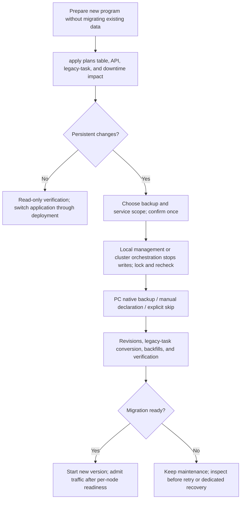
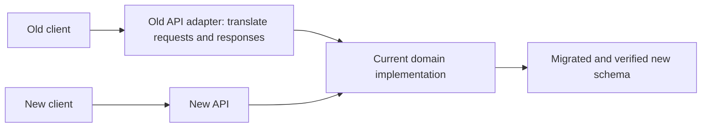

- Proposal Name: `unified_versioned_database_migrations`
- Start Date: 2026-09-28
- RFC PR: [oceanbase/powercontext#1771](https://github.com/oceanbase/powercontext/pull/1771)
- Tracking Issue: [oceanbase/powercontext#1756](https://github.com/oceanbase/powercontext/issues/1756)
- Related Discussion: [Migration framework proposal on PR #1716](https://github.com/oceanbase/powercontext/pull/1716#issuecomment-5862598291)
- Status: Design proposal. This document selects an approach and defines acceptance requirements; it does not claim that the framework or backend prototypes are implemented.

# Summary

Use **Alembic to manage relational schema versions, with one PowerContext migration entry point**. SQLite, embedded
seekDB, and OceanBase MySQL tenants share one logical revision chain; explicit adapters handle backend differences.
**The migration framework adds only one control table, `pc_schema_revision`, using Alembic's standard `version_num`
column and version advancement.** Migration definitions, dependencies, and validators ship with the code; execution
logs and backup manifests live outside the target database. The entry point owns legacy recognition, mutual exclusion,
plan confirmation, backups, preconditions, and postconditions. It creates no general-purpose run, step, or task tables.

Long-running backfills, identity attestation, and search projection rebuilds use separate scripts connected through
explicit schema phases and completion conditions. Safe retries are established from the current revision, actual
schema, business data, and existing domain receipts. The initial scope excludes general-purpose task scheduling,
generic checkpoints, and automatic resumption by execution run.

**Installing or upgrading software does not modify existing databases. Users explicitly initiate migrations for all
existing databases, local or remote. Normal startup checks schema compatibility and required data conditions; it does not
silently add columns, change constraints, or backfill existing data.** A genuinely empty database may be initialized
on first use: standard local mode executes the complete revision chain under a lock at a location permitted by
configuration; remote databases and deployments with multiple replicas use a separate initialization job.

The initial release defaults to stopped-write maintenance for schema and existing-data migration, enabling the new
application after verification. Compatible releases without persistent changes use ordinary deployment. Authors declare
affected tables, APIs, task formats, and compatibility so operators can choose supported deployment modes; the tool
rejects unsupported online execution.
Multiple Servers share one database and run one migration Job. This RFC does not cover independent databases per node.
One `apply` combines the plan, backup policy, and service management scope into one confirmation. Users choose
PC-managed native backup, an unverified declaration of manual backup, or explicit acceptance of skipping backup.
A separate `BackupProvider` exposes backend maintenance capabilities. Optional local service management coordinates
stop, migration, verification, and startup; deployment orchestration manages clusters. Failure blocks business readiness
without automatically restoring old services or performing destructive downgrades.

Software versions, API contract versions, and schema revisions are managed separately. After migration, old and new
APIs may share the current domain implementation and storage. Retaining an old endpoint does not require retaining
an old table. Tested storage compatibility paths are added only when explicitly supporting a new binary against an
old schema or mixed application versions. Neither `create_all()`, an unverified `stamp head`, nor generated scripts
constitute a complete migration.

**This proposal proceeds independently of PR #1716. Once enabled, the framework becomes PowerContext's standard
database change process, mandatory for every PR that changes managed schema.** Each such PR must include its
versioned migration, necessary data tasks, verification, and compatibility documentation, and pass the unified CI
gate. This applies across all modules and change sizes; #1716 is not a permanent exception.

# Motivation

Multiple initialization and maintenance paths currently determine whether a database is usable. Knowing that a table
exists does not establish that its constraints are correct, its backfill is complete, old Workers have stopped writing,
or a particular DDL statement has committed. Table renames, constraint changes, and concurrent replica startup make
these implicit assumptions more fragile.

An upgrade must answer five questions: what version the database has, what operations will run, who may run them,
whether execution can safely retry after interruption, and what permits traffic to resume. These requirements also become the
normal development, review, and merge process for every schema-changing PR.

## Existing paths and ownership

The inventory uses committed source [298314f8cbba](https://github.com/oceanbase/powercontext/tree/298314f8cbbaa57fcfec668668fb55d704a1b6eb/src/powercontext)
as its baseline; PR #1716 is listed separately. Paths are relative to `src/powercontext/`.

| Existing entry point | Current responsibility | Ownership in the unified model |
| --- | --- | --- |
| `builtin/persistence/schema.py:create_tables` and the three database `profile.py` modules | Run `create_all(checkfirst=True)` over caller-selected SQLAlchemy tables | Frozen initial and subsequent revisions replace production initialization; retain fixture use |
| `skill_distribution_schema.py` | Rebuild Skill publication tables, transform state, and change columns and constraints | Schema operations become revisions; row conversions become idempotently rerunnable data scripts, verified before constraints tighten |
| `tag_schema.py` | Rebuild the SQLite Tag table; remove the old family CHECK in the MySQL branch | One logical revision using batch reconstruction or explicit constraint DDL per backend |
| `dream_schema.py` | Add citation columns to Artifact and Candidate revisions | Additive revisions; register merged Dream columns and indexes according to their actual released form |
| `scope_search_schema.py` | Add search columns, backfill content, then enforce non-nullability | Expand revision → batched backfill → verify → contract revision |
| `experience_index.py` and backend Memory, Experience, and Topic Memory indexes | Add search and governance columns; create full-text/vector objects; initialize or rebuild projections | Authoritative table columns belong to revisions; physical index definitions and rebuilds belong to registered projection tasks scheduled by the same maintenance entry point |
| `processing_migration.py` and `server processing-migrate` | Existing plan/apply/verify, phase marker, migration ID, configuration manifest, receipts, and old Lease invalidation | Preserve semantics and receipts; move DDL into schema revisions and adapt remaining phases as data tasks that no longer change schema independently |
| `receipt_migration.py` and `server/factory.py` | Attest identities from committed receipt records; retain unresolved records in a review table | Independent attestation task preserving security boundaries and the review queue; schema version alone never proves completion |
| PR #1716's `candidate_schema.py` | Rename Candidate tables, rebuild SQLite tables, change MySQL constraints, and verify relationships | Recognize the final merged/released shape through baselines or explicit revisions; verify already-completed changes without repeating them |
| OceanBase profile identity-column collation checks and backend capability checks | Reject incompatible databases or index configurations | Retain migration preconditions and runtime validation; checks do not automatically repair data |

The main startup sequence is currently profile table creation → processing bootstrap/readiness checks →
Skill/Tag/Dream/Scope helpers → index initialization → runtime composition. The Server also attests receipts.
Their ordering becomes an explicit dependency graph rather than an implicit sequence of function calls.
[Runtime composition source](https://github.com/oceanbase/powercontext/blob/298314f8cbbaa57fcfec668668fb55d704a1b6eb/src/powercontext/builtin/runtime/composition.py)

This RFC owns official PowerContext persistence objects. Alembic does not automatically modify storage owned by
third-party components, external identity services, or user-created tables. Third-party extensions must register
ownership and dependencies explicitly before joining the process. Generic online DDL migration, moving data between
database systems, and direct upgrades from every historical version are outside the initial scope.

# Guide-level explanation

## 1. Upgrading a deployment

Installing software and switching the running version are separate actions. Package hooks neither connect to existing
business databases nor migrate or automatically start the new service. Prepare the new program in a separate environment
while a compatible old service continues running; stop the old process before overwriting its environment in place.
Preparing software alone needs no backup. Backup selection occurs before an actual migration.

### Commands and one confirmation

The following `db-migrate` commands, lifecycle extensions, and options are **proposed contracts, not currently available
features**. The migration CLI is assembled independently of factories that create tables, backfill data, or start Workers.
Read-only previews are optional; interactive users can go directly to `apply`, which includes planning and final verification:

```bash
powercontext server db-migrate status --env-file deployment.env
powercontext server db-migrate plan --env-file deployment.env
powercontext server db-migrate apply --env-file deployment.env --maintenance-confirmed
```

One review screen shows the target, source/target versions, affected tables and APIs, legacy tasks, downtime requirements,
service scope, backup choices and risks, and recovery procedures. Selections update the same plan, followed by one final
confirmation. Do not ask again for each SQL statement, backup completion, or final verification. PC-managed backup warns
that large datasets can take considerable time and additional space, showing stages, elapsed time, and available progress
without promising duration from row counts.

| Backup choice | Interactive behavior | Non-interactive declaration |
| --- | --- | --- |
| PC-managed backup | Show native method, coverage, and limitations; recommend when supported, then await completion and adapter checks | `--backup auto` |
| I have backed up manually | Record user responsibility without checking files, job status, time, target, or recoverability; a reference is optional | `--backup manual --backup-confirmed`, optionally `--backup-ref BACKUP_ID` |
| Skip this backup | Warn on the same screen that pre-migration data may be unrecoverable after failure, then require explicit acceptance | `--backup skip --accept-no-backup` |

`--yes` accepts the reviewed plan; it neither asserts a manual backup nor accepts the risk of no backup. Non-interactive
execution with changes requires a valid `plan_id`, explicit backup policy, corresponding confirmation options, and
maintenance conditions. Missing consent returns `confirmation_required` without waiting. `plan` accepts the same backup
and service options as `apply`, binding those choices. For example, after deployment orchestration stops shared-database
writers and the user completes a manual backup:

```bash
powercontext server db-migrate plan --env-file deployment.env --backup manual
powercontext server db-migrate apply --env-file deployment.env --plan-id PLAN_ID --backup manual --backup-confirmed --maintenance-confirmed --yes
```

`plan_id` binds database identity, revisions, managed schema fingerprint, migration resource checksums, configuration
digest, execution mode, API/task compatibility declarations, backup policy, and service scope. Recheck schema and tasks
under the lock; newly incompatible tasks or other material changes invalidate the plan. Normal changes to counts are
not permanently fixed promises. Plans expose no credentials or business payloads and create no pending marker in the
target. Manual backup and skip selections cannot bypass active writers, locking, compatibility, or data verification.

When no schema, baseline adoption, data, or projection changes remain and read-only verification passes, `apply` returns
`ready` with no changes, without requesting backup or stopping/restarting services. This means the database is compatible,
not that running processes have been updated. Service management or deployment orchestration still switches binaries.

### Service shutdown and restart

The existing foreground entry point is `powercontext server run`. The personal service CLI currently exposes
`install/status/uninstall`, while platform adapters already provide start/stop operations. This proposal adds
`powercontext service stop`, `powercontext service start`, and `powercontext service restart` for the current user's
PC-managed local service, preserving registration and configuration. `restart` stops then starts, retaining schema and
task startup gates; it does not replace stopping the service around an incompatible migration.

The simplified entry point for an incompatible local upgrade is:

```bash
powercontext server db-migrate apply --env-file deployment.env --manage-service
```

`--manage-service` shows ownership, target database, original running state, target executable, and configuration before
confirmation. It then drains and stops the managed service, suppresses its automatic restart, checks remaining writers,
and proceeds through backup, migration, and verification. Only after `ready` may it update the confirmed local launch
definition, start a service that was originally running, and check its version and readiness. An originally stopped
service stays stopped. Migration failure leaves it stopped. If the database is ready but startup fails, report that
separately without rerunning migration or automatically downgrading. Save lifecycle summaries externally; interruption
requires explicit recovery, and missing logs never authorize opening business access.

Managed mode does not use `service install` as an intermediate step because installation can immediately start the
service. It does not guess a new executable from PATH or modify services not owned by PC. It cannot manage a cluster or
prevent unknown SDK writes. Other writers or unestablished maintenance conditions block execution with external
maintenance instructions. For externally managed deployments, `--maintenance-confirmed` records operator responsibility
for stopping writes.

For multiple Servers sharing one database, orchestration stops new requests, drains in-flight work, stops every API,
Worker, scheduler, and SDK writer, runs one new-version migration Job, then starts new nodes after `ready`. Restore
traffic only after each node passes readiness. Suspend scaling, restart policies, and schedules that could launch old
processes. Failure keeps maintenance in effect. PC migration does not restart the OceanBase cluster. SQLite/embedded seekDB retain the existing single-host `all` role restriction; migration does not enable cross-host shared directories or multi-node deployment for them. Shared-database multi-node services use an already supported remote deployment topology. Independent
per-node databases are outside this design.

**Unified confirmation when complete node discovery is unavailable.** Automatic node discovery is not a prerequisite
for the initial delivery. Database connections and online status do not establish a complete node inventory. For shared
databases, or when inventory completeness cannot be established, explicitly disclose this limitation; discovering no other
nodes does not prove a single-node deployment. If the release plan includes incompatible schema, API, or task-protocol
changes, require the operator to coordinate all affected nodes onto the target version. For explicitly supported and
validated mixed-version operation, use the declared compatibility range rather than requiring simultaneous upgrades.

Include the following declaration in the existing single plan confirmation, without a separate confirmation step:

```text
Multi-node upgrade notice

PowerContext cannot automatically confirm every node connected to this database.

This upgrade includes incompatible changes. Ensure that:
• Before migration, stop all affected APIs, Workers, schedulers, and other writers,
  and suspend mechanisms that could restart old versions.
• After migration succeeds, upgrade all affected PowerContext nodes to the target
  version and verify them before resuming business traffic and processing.
• Missing nodes or continued operation of old versions may cause request failures,
  task-processing errors, or inconsistent data.

[ ] I accept responsibility for coordinating stopped writes and version upgrades
    across all affected nodes.
```

Non-interactive execution reuses `--maintenance-confirmed`: for an incompatible shared-database upgrade declared by the
plan, it confirms that all writers have already stopped and commits the operator to coordinating all affected node
upgrades afterwards. `--yes` does not imply this declaration. Missing confirmation returns `confirmation_required`.
Record the declaration with the target version and compatibility scope in the external summary; it is user confirmation,
not evidence that PC discovered every node or verified a completed rollout. `--manage-service` still manages only the
confirmed local services and cannot represent the entire cluster.

The declaration never bypasses migration locks, available active-writer checks, or new-version startup compatibility
checks. Observed writers or known unmet maintenance conditions still block migration. The operator coordinates nodes
outside the tool's visibility; existing safety checks remain mandatory. Success output separates database and node
status: “Database migration succeeded; other node upgrades require operator confirmation.” Without complete deployment
acceptance evidence, never report “all nodes upgraded”. Report startup and readiness of managed local services separately.

For manual service management, use separate steps; the lifecycle commands below are also proposed:

```bash
powercontext service stop
powercontext server db-migrate apply --env-file deployment.env --maintenance-confirmed
powercontext service start
```

Run the final command only after successful migration and after the service definition points at the new environment;
this is not an unconditional chained script. For foreground deployments, after the old process exits cleanly and
migration returns `ready`, run the existing entry point from the new environment:

```bash
powercontext server run --env-file deployment.env --role all
```

### Inspection and recovery

`apply` reports revisions, schema/data/legacy-task/projection checks, backup policy and actual verification level, service
state, and next steps. Migration `ready` and service readiness are separate results. A log correlation ID is not a
resumable execution run stored in the database.

After interruption, use read-only `status`, `verify`, and `plan` to inspect actual state. Only a proven idempotent path can
retry; no automatic resumption by run ID is provided. Automatic-backup retries retain the original recovery point and
external manifest. Manual mode records only the declaration and optional reference, without verification. Skip mode
cannot promise recovery of original data. Missing or failed automatic backup cannot silently become manual or skipped
backup: changing policy requires renewed confirmation. Ambiguous partial migration returns `recovery_required`, never
blind stamping.

During compatibility support, the existing `processing-migrate` entry forwards to unified maintenance while retaining
domain migration IDs, manifests, and existing receipt semantics. Backup policy does not change domain recovery rules.



## 2. Automatic and explicit execution boundaries

| Scenario | Default behavior |
| --- | --- |
| Install or upgrade the PowerContext package | Update software and migration resources only; do not connect to or modify an existing business database or run migrations automatically |
| First-use, empty local SQLite or embedded seekDB database at a location permitting initialization | Confirm emptiness under the lock, execute complete initialization and verification automatically, then start |
| New OceanBase database or deployment with multiple replicas | Initialize explicitly in a separate migration job; API/Worker instances only check compatibility |
| Existing schema compatible with the binary and all required tasks complete | Start normally without schema writes or implicit repair |
| Any existing database requiring schema upgrade, table reconstruction, constraint changes, or required backfills | Return `migration_required`, block business startup, and suggest explicit migration; release compatibility declarations determine old-service shutdown, with maintenance the initial default for persistent changes; local and remote databases follow the same rule |
| A known migration lock is held, or actual schema/required data verification fails | Return `migration_running` when execution is observable, or `recovery_required` when dedicated recovery is needed; block writes and readiness. The version table alone cannot identify a failed historical invocation |
| Compatible schema with only optional projection tasks explicitly allowed to run later | Disable the affected retrieval capability and report degradation; decide core readiness according to capability contracts, without hidden startup rebuilds |
| Unversioned database containing managed business tables or an unrecognized legacy shape | Require explicit baseline recognition; return `unknown_baseline` for unknown shapes instead of treating them as empty |
| Unknown revision or revision outside the binary's explicit support set | Return `incompatible_schema`, reject business startup, and leave the database unchanged |

Automatic first-use initialization requires a permitted target location, no managed business tables or historical
markers, no interrupted-operation residue, and revalidation under the lock. Empty business tables, a missing version
table, or an unreadable version do not establish that a database is empty. A failed table read caused by remote
credentials targeting the wrong database or an incorrect local path never justifies creating a database.

The release declares a set of known supported revisions; it does not compare revision strings lexicographically.
Initially only the target revision is supported by default. Expanding the set requires read/write, task, and recovery
tests for every allowed version. Supporting mixed binaries additionally requires mixed-version tests. Either an older
or newer schema can be incompatible; unknown revisions are rejected even if they appear to add only a few columns.

Checks apply to HTTP Server, Workers, scheduled tasks, embedded SDKs, and CLIs that open official persistence directly.
They run before domain factories, schema helpers, and background tasks, and check whether current handlers support
pending task formats as well as schema. An incomplete migration must not produce a
partially working service that waits for requests to fail. `status`, `plan`, `verify`, and recovery remain independently
usable; monitoring liveness is not business readiness. Errors include stable categories, current/target revisions,
blocking reasons, and suggested commands. Missing DDL privileges do not justify skipping checks.

## 3. Coordinating old and new APIs with database versions

Package version, API contract version, and schema revision are separate dimensions. Each release declares its target
schema, allowed schema set, required tasks and capabilities, and supported API contracts. API names and prefixes do
not directly select database revisions.

Suppose an old endpoint uses an old table, and a release introduces both a new endpoint and a new table structure.
The initial default sequence is: stop old service writes → explicitly transform old data and schema → verify → start
the new service. The old endpoint may retain an adapter that translates requests into current domain operations and
results into the old response shape. Both endpoints then access the same migrated storage. If semantics cannot be
preserved, publish an explicit new contract and arrange client upgrades; retaining the old URL must not silently
change its meaning.



| Published support promise | New binary before migration | Required compatibility work |
| --- | --- | --- |
| Initial default: maintenance-window migration | Block business startup on incompatible schema; enable old and new APIs after successful migration | API contract adapters and migration verification; handlers do not need to support two table layouts |
| Explicit support for a new binary against old schema | Enable only declared and tested old-schema capabilities; make features requiring new structure explicitly unavailable | Centralize version differences in persistence adapters and test every permitted old-schema read/write path |
| Old and new services must run concurrently | Expand, backfill, and verify before traffic switches; contract only after every old instance exits | Write consistency, backfill catch-up, mixed-version tests, and explicit exit conditions; not a default initial capability |

### Release decisions for APIs, tables, and legacy tasks

Change authors provide an impact manifest in the same PR. Operators use it in the plan to select blocking maintenance,
retained APIs, and client upgrades. Neither a table change nor an “internal” label proves compatibility; the tool does
not infer contracts from arbitrary application code. The manifest ships in the package and adds no database control table.

| Declaration | Required answers |
| --- | --- |
| `affected_objects` | Affected tables, columns, constraints, indexes, and external files; large copies or irreversible transformations |
| `execution_mode` and supported versions | Ordinary deployment, maintenance migration, or verified rolling deployment; which old/new binaries can read/write each schema |
| `api_changes` | Callers released together or independently; retained, replaced, or deprecated contracts; replacement and earliest removal version/date |
| `task_formats` | Known queued and persisted formats, supported consumer versions, converters, drain requirements, and unknown-format handling |
| Recovery and capabilities | Available backup methods/scope, no-backup risks, projection dependencies, permissions, resources, and configuration changes |

| Change | Deployment choice |
| --- | --- |
| No persistent changes; compatible APIs and task protocols | Ordinary deployment; roll through the deployment system if old/new processes may coexist |
| Existing binaries cannot read/write the new schema, or new handlers cannot consume legacy tasks | Maintenance: stop old writers, convert, verify, then start |
| Declared online expand/backfill/contract path | Require backend and mixed-version acceptance; generic online DDL is not initially delivered, so this mode is unavailable until implemented |

Operators may choose stricter offline maintenance but cannot override known incompatibility by selecting an online mode.
Internal functions and same-package background entry points may be replaced together with their callers. Independently
deployed Workers, consoles, SDKs, or applications still require compatibility arrangements, even if called internal.
For breaking replacements of public APIs such as Artifact APIs, mark the old contract `deprecated` in OpenAPI and docs,
provide a replacement, migration instructions, and removal schedule, and test old clients during support. A storage-only
change with an unchanged API contract does not require API deprecation.

**Check legacy task formats during upgrades.** Read-only `plan` inventories affected queued, running, delayed, retryable,
and dead-letter tasks, Leases, and payload formats, reporting counts, policy, and blockers without payload contents.
Recheck after stopping writes and acquiring the lock, after migration, and before Worker startup. Where a queue has no
version field, use frozen format recognizers rather than adding a generic task ledger. Unknown formats or unobservable
sources block the affected migration/Worker instead of falsely reporting no legacy tasks.

Each task class declares compatible consumption, idempotent conversion after stopping writes, or pre-migration draining
by the old Worker. Disable producers before bounded draining; old Workers cannot keep running while locked schema changes
execute. Unknown formats return `unsupported_task_format`; unmet draining conditions return `legacy_tasks_pending`.
Preserve stable task IDs, idempotency keys, Scope/identity, retries, and domain receipts. Never automatically delete queues
or mark unfinished tasks successful. Retained tasks must be handled before deleting old endpoints/handlers: old processes
exiting does not prove old formats have disappeared. Recent absence of calls cannot prove a public API is unused;
external client upgrades still need release coordination.

Do not scatter “column missing, try another SQL statement” fallbacks across handlers, or promise untested dual writes,
bidirectional synchronization, or automatic fallback to old tables. Retaining an old API, retaining old tables, and
allowing old binaries to keep running are separately tested promises. Record conditions and release timing for table/
column removal separately from API retirement. After an incompatible database change, reverting only the application
package is not a safe rollback.

## 4. Standard contributor workflow

Once the framework is enabled, the following process applies to every PR adding, removing, or renaming managed tables
or changing columns, types, defaults, nullability, primary/foreign keys, CHECK constraints, indexes, or collation.
Even adding one field cannot bypass it.

1. **Submit models and migrations together.** Update target schema definitions and add a frozen revision based on the
   current head. Register optional full-text/vector object definitions, projection versions, and tasks through the same
   process. Model-only edits, standalone startup DDL, and instructions for users to alter tables manually are insufficient.
2. **Declare dependencies and execution policy.** Changes involving existing data include separate data tasks specifying
   expand/backfill/contract order, preconditions, postconditions, maintenance requirements, idempotency, and interruption
   recovery. Identify applicable backends and explain any non-applicability.
3. **Provide verification evidence.** According to impact, cover empty initialization, supported-release upgrades,
   repeated execution, recovery, and domain invariants. Cross-backend schema changes cover SQLite, seekDB, and OceanBase;
   skipped backend validation is not a passing result.
4. **Deliver a release impact manifest.** Include `affected_objects`, `execution_mode`, `api_changes`, `task_formats`,
   supported binary/schema combinations, data and projection tasks, lifecycle scope, backup methods, and recovery limits.
   State API deprecation, legacy-task handling, and recovery capabilities lost without backup. Destructive migration need
   not pretend to be reversible.
5. **Merge only after review and required CI checks pass.** If the base branch head changes, reconcile unpublished
   revision dependencies and revalidate before merging, retaining a single head. Published revisions are immutable.
   Schema changes without corresponding migrations or with failed verification cannot merge.

Each managed schema change includes a separate Alembic revision script. A software release with no schema changes
needs no new revision; one release may contain several. For example, `r001 → r002 → r003` may initialize tables, add a
column, and change a constraint. A database at `r001` executes `r002` then `r003`; it does not need another combined
`r001 → r003` script. Retain historical scripts and frozen dependencies. Correct published scripts through a new
revision, with explicit backend adaptations inside the same logical revision.

Independent delivery describes the framework's implementation schedule only. Schema-changing PRs still unmerged when
the framework is enabled must adopt this process. Already merged or released changes are covered by baselines and
legacy adapters.

# Reference-level explanation

## 1. Selection and responsibility boundaries

| Option | Fit for this project | Main cost | Decision |
| --- | --- | --- | --- |
| Alembic with a PowerContext execution layer | Reuses SQLAlchemy definitions, revision dependencies, and SQLite batch operations; integrates with the async engine through `AsyncConnection.run_sync` | Still requires backend capabilities, locks, data tasks, and recovery; autogeneration has blind spots | **Selected** |
| Small custom revision registry | Directly reuses async helpers with little initial code | Must continually maintain revision graphs, stable historical scripts, difference detection, auditability, and tooling; risks becoming another collection of helpers | Not the primary framework; retain only a thin execution-policy and task-registration layer |
| SQL-first tools, represented by Flyway | Clear SQL changes, versioned scripts, history tables, and checksums | Adds tooling to Python distribution; still needs SQL for three profiles, embedded-engine lifecycle handling, and Python data transformations | Not a default dependency; expose plans and backend DDL for SQL review |

Alembic documents async integration and separating data migrations; Flyway's versioned scripts and checksums inform
the design. Selection is based on PowerContext's existing SQLAlchemy and Python deployment model, not a claim of
completed compatibility experiments across all backends.
[Alembic Cookbook](https://alembic.sqlalchemy.org/en/latest/cookbook.html#using-asyncio-with-alembic),
[Flyway Versioned migrations](https://documentation.red-gate.com/flyway/flyway-concepts/migrations/versioned-migrations)

Include Alembic in the dependency set for official persistence and ship migration resources in the wheel. End users
do not need a separate CLI installation. The supported entry point invokes Alembic only through PowerContext's
execution layer, preventing bare `alembic upgrade` from bypassing locks or data dependencies.

### Integrating existing connections, transactions, repositories, and indexes

The three Profiles own backend configuration, engine lifecycle, and initialization, sharing `AsyncDatabase`. Repositories
use connections for domain data; Memory, Experience, and Topic Memory indexes serve retrieval projections. Migration
reuses those boundaries rather than adding another business storage abstraction.

| Layer | Migration responsibility and changes |
| --- | --- |
| Configuration and Profile | Separate connection/engine lifecycle from `create_tables`; expose inspection and maintenance without table creation, reusing URLs, paths, credentials, dialects, and extension loading |
| `AsyncDatabase` and connections | Retain ownership, transaction, and closing behavior; use a dedicated fixed maintenance connection and pass that same underlying connection to Alembic through `AsyncConnection.run_sync`, keeping locking and DDL together |
| Alembic revision | Execute DDL with frozen tables, columns, types, and backend operations, advancing `pc_schema_revision` after verification; do not derive historical schema from current repositories or `create_all()` |
| Repository/data adapters | Reuse stable domain operations only when their schema requirements hold, with explicit bound transactions; prefer frozen SQL/mappings for historical transformations rather than replaying changing repositories |
| Index interfaces | Move structure definitions into revisions/versioned projection resources; invoke controlled rebuild and verification from authoritative Sources/Artifacts, without startup DDL |
| `BackupProvider` | Reuse backend configuration and dedicated/native management connections for capability, creation, and status; do not substitute row-by-row Repository exports for native backup |
| Service management and startup gates | Reuse `ServiceController` and platform start/stop adapters; inspect schema, task formats, and required capabilities before composing repositories, indexes, and Workers |

Wrapping the whole migration in `AsyncDatabase.transaction()` does not make it atomic. SQLite uses verified transaction
boundaries; seekDB/OceanBase DDL can commit implicitly, requiring fixed-connection locking and stepwise checks. Data
batches commit separately and include existing domain receipts in the same transaction where applicable. Background
business work must not share the executor's runtime transaction.

For a new required column: `r002` adds a nullable column with frozen definitions → a separate script reads legacy data
and backfills idempotently → data verification → `r003` tightens the constraint → affected projections rebuild → final
verification → new repositories and Workers start. Current models define and compare the target, not regenerate history.
Remove implicit schema writes from `open_builtin_contexts`, Server factories, and index initialization individually;
inspection of a missing target must not create a database.

## 2. Revision and persistence model

Each physical database/schema has one official core schema revision chain. Revisions are neither Scope-specific nor
application package versions. A release has exactly one target head. Unpublished branches are reconciled into a linear
chain before merge; published revisions are never rewritten.

Each revision has stable `revision` and `down_revision` identifiers plus supported backends, preconditions, maintenance
requirements, postconditions, and validators. Revisions include frozen table/type definitions; they must not import
mutable application ORM tables to reconstruct historical state. Even a backend-specific no-op must prove the logical
revision's postconditions; it cannot simply ignore exceptions.

**Only one migration control table is added:**

| Table | Column | Purpose |
| --- | --- | --- |
| `pc_schema_revision` | `version_num` | Standard Alembic version table recording the current completed revision; a linear chain normally has one row after baseline adoption or completion of the first revision |

Set the name through Alembic's `version_table="pc_schema_revision"` option and retain standard version reads and
advancement. Do not add run, step, task, or JSON progress fields, move those records to additional generic tables or
disguised business data, or replace Alembic's version management. This limit applies to new migration control tables,
not business tables required by product features.
[Alembic version table](https://alembic.sqlalchemy.org/en/latest/tutorial.html#running-our-first-migration)

Information has distinct homes:

| Information | Storage or verification |
| --- | --- |
| Revision definitions, dependencies, frozen schema, and validators | Versioned Python scripts and declarative resources shipped in the wheel |
| Target software version, supported schemas, data completion conditions, and optional capability requirements | Release compatibility manifest |
| Current schema position | `pc_schema_revision.version_num` |
| Execution details, errors, and verification summaries | Local files or deployment logging; audit evidence, never sole proof of step completion |
| Backup policy, automatic-backup evidence, or user declaration | External manifest with automatic-backup target, revisions, package digest, coverage, and checks, or manual declaration/accepted skip risk; no manual-backup verification |
| Required data and projection completion | Actual data, object definitions, and existing domain receipts/markers; no generic task-state table |

Readiness requires a supported target revision, correct actual schema, and all required data and capability conditions.
The absence of a task ledger does not prove completion, and a successful log cannot replace verification. Optional
projections explicitly permitted to run later disable only the affected capabilities. Declarations and checks share the
release manifest.

CI compares against released code to prohibit rewriting historical scripts and frozen dependencies. Runtime checks
validate shipped resources against the trusted package checksum manifest. A PC-managed backup manifest also records the package
digest used during maintenance for retry checks. Manual mode records only the user declaration, without querying or
verifying that backup. The version table stores no per-execution script checksums, so a
revision alone cannot reconstruct the exact script bytes historically executed on that database. If recovery needs
such evidence and external records are missing, stop for dedicated handling. Schema fingerprints cannot prove the full
execution history either.

For existing databases, acquire the lock and satisfy stopped-write conditions and the selected backup policy before creating the version
table from its fixed definition or adopting a recognized baseline. A missing, empty, or partially created version
table does not establish that the business database is empty. Inspect managed objects first and reject writes for
unrecognized state. Empty initialization starts with the frozen initial revision.

Verify optional full-text/vector projections against registered backend object inventories, `projection_version`, and
configuration digests, reusing existing domain markers or deriving completion from actual results. Enabling a capability
explicitly installs or rebuilds its objects; disabling it retains objects and domain records. Ordinary startup adds no
DDL. New durable cursors or general-purpose task services require separate designs; this RFC does not implicitly add
control tables for them.

## 3. Empty initialization and legacy baselines

**Inspect before writing.** Migration checks precede the current profile's `create_tables` and domain initialization.
Separate connection setup, engine lifecycle, and driver configuration from schema initialization. Startup must not
modify tables to discover their version. `status`, `plan`, and `verify` use inspection connections without table-creation
side effects; missing targets return `uninitialized`, without creating database files or control tables. If an embedded
engine cannot provide that inspection path, its adapter returns an explicit unsupported reason rather than silently
opening a writable initialization path.

- **Empty database:** Under the lock, establish the absence of managed business tables and historical markers, then run
  the frozen initial revision → subsequent revisions → required initialization tasks → verify. Empty and upgraded
  databases targeting the same revision must produce the same current business schema. Validate retained historical
  tables/recovery objects separately against the release manifest; empty databases need not create them. Initially there is no
  `create_all()`-then-stamp shortcut.
- **Versioned database:** Validate the revision, package resource integrity, managed schema, and required data conditions
  before advancing. After interruption, inspect actual state again and continue only through a defined safe retry path.
  Missing evidence required by the selected recovery path or ambiguous state rejects writes; manual backup gains no
  additional verification requirement.
- **Unversioned legacy database:** Accept only shapes explicitly recognized in the baseline inventory. Recognition
  covers tables, column types/nullability/defaults, primary and foreign keys, CHECK constraints, indexes, identity
  collations, optional capabilities, and processing/projection markers, plus applicable data-integrity checks. Package
  versions, one column's presence, or zero row counts alone are insufficient.
- **Unknown or mixed shape:** Report differences and reject writes. Unregistered temporary-table residue or old/new
  Candidate coexistence, or one missing table from a required pair need specific recovery paths; forced stamping is forbidden.

The initial fixtures must include databases created by the released
[powercontext-v1.1.0](https://github.com/oceanbase/powercontext/releases/tag/powercontext-v1.1.0) package and the last
supported release preceding framework adoption. Do not simulate old releases by deleting columns from current models.
Earlier versions support direct adoption only after entering the tested baseline inventory; otherwise require a
supported intermediate upgrade path or a dedicated adapter.

Baseline adoption is read-only recognition → lock and revalidation → reviewed legacy adapter for known differences →
complete verification → record the matching baseline revision → subsequent revisions. A baseline proves schema state
only; processing receipts, configuration manifests, and pending identity reviews remain independently validated.
Freeze the baseline snapshot when adopting the framework. Delivered changes, including #1716, use recognizers and
adapters; changes still unmerged after enablement submit migrations through the standard process.

## 4. Execution order and data-task dependencies

The unified execution order is:

1. Inspect actual schema, data, legacy-task formats, and release compatibility declarations without writes; build the plan
   with backup/lifecycle options and confirm once.
2. Local management or cluster orchestration disables producers, drains tasks that require it, stops old writers, and
   suppresses automatic restarts. Acquire the database-wide lock and recheck the plan, Leases, and tasks.
3. Apply the backup policy: await native automatic backup and adapter checks, record the manual declaration, record
   accepted skip risk, or record the genuinely empty database exemption.
4. Durably save the plan, policy, service state, and available recovery references outside the target and open diagnostic
   logs. Explicitly adopt a recognized baseline where necessary.
5. Execute expand revisions through Alembic.
6. Run idempotent data/legacy-task conversions and completion checks at declared schema phases; contract revisions
   themselves recheck required conditions.
7. Install/rebuild and verify required projections, identifying unavailable optional capabilities.
8. Built-in final verification checks revision, actual schema, task consumability, required data, and domain invariants,
   reporting migration `ready` and the backup protection level.
9. Release the migration lock. Managed local startup follows its confirmed scope, or orchestration starts new cluster
   nodes. Restore traffic only after per-entry-point readiness. Report startup failure separately from database success.

For schema-only changes, Alembic follows the revision chain. For large data changes, the entry point invokes Alembic at
declared phase boundaries: expand revision → separate data backfill → completion verification → contract revision.
The contract revision itself rechecks required data conditions instead of trusting a successful log or task status.
Incomplete data prevents advancement to the target revision.
[Alembic data migrations](https://alembic.sqlalchemy.org/en/latest/cookbook.html#data-migrations-general-techniques)

Phases and validators are declared in packaged resources; planning exposes their order and blockers. There is no
general-purpose task DAG scheduler or persistent queue. Small data changes suitable for the current transaction may
live in a revision; large backfills and external calls should not be placed in one long DDL transaction.

Data scripts preferentially derive remaining work from business data, using stable-key pagination, idempotent writes,
and independent completion verification. Retrying may rescan completed ranges but must not increment counters twice,
duplicate Artifacts, or apply effects twice. When existing domain checkpoints/receipts can be reused, commit each
batch's changes and receipt in the same transaction. Without that state, generic checkpoint resumption is not promised.
Scripts whose progress cannot be proven from data and which cannot safely rerun require a dedicated recovery procedure;
otherwise they are unsupported. The last line of an external log is not evidence of data commit.

Processing scripts preserve existing Lease invalidation, manifest verification, and migration receipt semantics.
Receipt attestation uses only committed identity records; unknown identities retain their review boundary, and external
identity lookup failure still fails execution. External interactions retain domain idempotency protocols without
claiming transaction atomicity across systems.

Projection scripts rebuild from authoritative Sources and Artifacts without modifying authoritative content to fit an
index. Embedding model, dimension, and retrieval-shape changes require configuration-digest checks and explicit rebuilds
when incompatible. Initially rebuilds require stopped writes; actual projection objects, data coverage, and existing
domain markers establish completion. Schema head cannot replace capability checks. Online switching requires a
separate design for generations, catch-up, and atomic cutover.

## 5. Locks and multiple replicas

Multiple Servers in this RFC share one database; the same database must not be migrated once per node. Migration locks identify the physical database and managed namespace, not a process or revision. They cover
recognition, DDL, required data steps, and final verification. Waiting is bounded; timeout returns retryable
`migration_locked`. A holder rereads state after acquiring the lock; a second executor only verifies and returns if
the target has already been reached.

| Profile | Mutual exclusion | DDL and recovery constraints |
| --- | --- | --- |
| SQLite file database | An OS-backed cross-process file lock on the normalized database path covers the full operation; each schema revision uses explicit `BEGIN IMMEDIATE` | Batch reconstruction, data copying, and revision advancement use verified transaction boundaries; failures roll back and recovery rechecks state |
| In-memory SQLite | A process-local lock for the shared engine | New initialization only, without durable offline recovery; process-local locks cannot substitute for multi-process file-database locking |
| Embedded seekDB | An OS-backed cross-process file lock on the normalized data directory, acquired before opening the migration engine | MySQL protocol compatibility does not prove support for all lock functions or transactional DDL; use the stepwise nontransactional-DDL verification protocol |
| OceanBase MySQL tenant | A capability-verified `GET_LOCK` named lock on a dedicated physical connection that also executes DDL | The lock must survive commits; disable automatic reconnect during execution, stop further steps on disconnect, and never assume rollback undoes DDL |

SQLite's `BEGIN IMMEDIATE` acquires a write transaction early; the file lock retains maintenance exclusivity across
batches. Use an operating-system lock rather than the existence of a lock file, normalize symlinks, and do not claim
support for embedded-database migration across hosts through shared filesystems.
[SQLite Transactions](https://www.sqlite.org/lang_transaction.html)

OceanBase documents that named locks survive commit/rollback, but support differs between versioned documentation.
Verify two-connection exclusion and routing across connections on the chosen minimum/target versions, actual tenant,
and proxy path. A successful function return alone is insufficient. If this cannot be verified, return
`migration_lock_unsupported` before managed DDL; never fall back to a row lock released by DDL's implicit commit.
[GET_LOCK](https://en.oceanbase.com/docs/common-oceanbase-database-10000000001379158),
[V4.3.0 compatibility](https://en.oceanbase.com/docs/common-oceanbase-database-10000000001228196)

**Mutual exclusion between migrators and stopping business writes are separate conditions.** Named and file locks
coordinate only participating migration processes. They do not prove that API, Worker, SDK, or old-binary writes have
stopped. The executor checks known writers using available process, engine-owner, and domain Lease information.
Known active writers produce `active_writers`, even when confirmation flags are supplied.

Initially the operator or deployment orchestrator stops every writing entry point and disables automatic restarts of
old instances. The tool does not claim to discover arbitrary external clients or fence every old version.
`--maintenance-confirmed` records confirmation and evidence of this maintenance condition; it does not implement
write isolation. New startup paths check observable migration locks, the revision, actual schema, and required data
conditions, rejecting readiness on observed migration or incompatibility. A single version table cannot persist the
fact that an invocation failed, and missing logs do not establish that no migration is occurring. Deployment
orchestration still prevents new instances from starting during maintenance. If lock state cannot be reliably inspected
read-only, do not report it as unlocked. These checks cannot stop already-running unknown clients; migration is
unsupported when stopped-write conditions cannot be established.

A shared-database deployment runs one migration Job and keeps every incompatible old writer stopped. Failure blocks
rollout. New nodes start only after `ready`; each independently checks schema, task formats, and required capabilities
before receiving traffic, rather than trusting a past Job result. Orchestration prevents old images or background
processes restarting. The migration lock does not implement application write fencing.

## 6. Interruption recovery and verification

OceanBase DDL may commit implicitly. A Python transaction context cannot make several DDL statements atomic; seekDB
initially follows the same conservative recovery model.
[OceanBase transaction commits](https://www.oceanbase.com/docs/common-oceanbase-database-cn-1000000004476105)

Alembic updates the version table after executing a revision, but that table does not record progress for individual
SQL statements inside it. Nontransactional DDL may partially commit while the version remains at the previous revision.
Each such revision must define acceptable preconditions, exact postconditions, recognizable intermediate states, and
rejection conditions. Diagnostic logs provide clues, not substitutes for actual checks. Retry distinguishes three cases:

| Observed state | Recovery action |
| --- | --- |
| Full preconditions hold and the previous session/DDL is confirmed ended | Execute again after maintenance, the selected backup policy, locking, and newly confirmed plan requirements are met |
| Exact postconditions for an operation hold, but the revision has not advanced | An explicit idempotent branch in the revision verifies and skips that operation; Alembic advances normally only after all operations and invariants pass |
| Unregistered old/new states coexist, data differs, or the result cannot be proven | Return `recovery_required`, retain external evidence, and stop for dedicated repair or backup restoration |

Adding a column requires verifying type, default, nullability, and related constraints, not just its name. Renames must
distinguish old-only, new-only, and simultaneous old/new tables. After network timeout or database failover, establish
that the old session and related DDL have ended and inspect stable state before recovery. Timeout, missing heartbeats,
or a successful reconnect do not authorize automatic takeover of potentially running DDL.

SQLite reconstruction uses frozen definitions and Alembic batch or explicit reconstruction steps, preserving indexes,
constraints, triggers, and related views. If foreign-key enforcement must be disabled, change it only on the dedicated
connection outside the transaction, run `foreign_key_check` before commit, and restore the setting afterward. A generic
“rename old table, create new table” template must not ignore foreign-key reference rewrites.
[Alembic Batch](https://alembic.sqlalchemy.org/en/latest/batch.html),
[SQLite schema-change procedure](https://www.sqlite.org/lang_altertable.html#making_other_kinds_of_table_schema_changes)

Each revision verifies actual schema against its target definition and the affected domain invariants. Copies compare
primary-key sets, row counts, and retained field contents, not counts alone. Candidate checks cover heads pointing to
real versions and Scope foreign keys; processing checks cover receipts, counters, and manifests; retrieval projections
check the corresponding Artifact revisions and representative queries.

With verified transaction configuration, SQLite atomically commits schema changes, in-revision verification, and
version advancement; failures roll back and require reinspection. On nontransactional-DDL backends, `upgrade()` checks
all postconditions before Alembic advances the version. If DDL commits but the version update does not, retry enters
that revision's state-recognition logic. Without an explicit idempotent branch, stop; bare stamping is forbidden.
Final verify and startup checks independently validate required external data/projection conditions.

A revision may contain related operations but needs reviewable, recoverable boundaries. Splitting every SQL statement
into a separate revision does not eliminate interruption windows in nontransactional DDL. Irreversible or ambiguous
states require forward repair or backup restoration. The executor neither runs destructive downgrades automatically
nor silently removes unrecognized intermediate tables.

## 7. Backups and release recovery

### Unified BackupProvider

`BackupProvider` is a separate database maintenance interface implemented by backend adapters, reusing configuration,
target identity, maintenance connections, and engine lifecycle without starting business services. It standardizes the
operation contract while exposing differences in method, privileges, duration, scope, and fault protection. The executor
handles manual and skipped backup without calling the provider to verify them.

| Proposed method | Result and responsibility |
| --- | --- |
| `capabilities(context)` | Read-only native-method, version/object support, permission, stopped-write, coverage, same-instance, and time/space information; create no probe database |
| `create_backup(context)` | Start native backup after confirmation and maintenance conditions, returning `BackupRef`; an asynchronous task reference does not imply completion |
| `inspect_backup(ref)` | Only for PC-managed backups: query pending/completed/failed status, target, coverage, and available checks; failed or incomplete backup blocks auto mode |
| `restore_plan(ref)` | Explain scope, binary/database version requirements, restoration, and verification without overwriting the current database or automatically executing destructive recovery |

Store `BackupRef` and results in an external manifest, including method, target, location/task reference, snapshot boundary,
source revision, package digest, objects, verification level, and restore instructions. Distinguish task completion,
metadata/integrity checks, and a successful restore rehearsal; the first two do not prove restoration succeeded.
Failed backup, prolonged pending status, insufficient space, or unsupported required objects stop execution before
migration. Users may select a different policy and confirm again; never silently skip.

### Native methods for the three backends

The unified `BackupProvider` uses SQLite Online Backup API for SQLite and native `FORK DATABASE` / `FORK TABLE` for
seekdb and OceanBase clusters. PC automatic backup on OceanBase does not fall back to physical backup or log archiving;
independently arranged user backups remain covered by the manual policy.

| Backend | PC-managed automatic method | Verification and boundary |
| --- | --- | --- |
| SQLite file database | SQLite Online Backup API creates an independent file after writes stop | Include committed WAL data and verify readability and integrity; copying the main file is insufficient. Restoration also verifies extensions, indexes, and business invariants |
| seekdb | Prefer `FORK DATABASE`; use `FORK TABLE` only under the coverage and consistency conditions below | Verify the actual engine version, object coverage, subsequent DDL restrictions, and restoration after restart; retain a same-instance recovery point |
| OceanBase cluster (supported MySQL tenant) | Prefer `FORK DATABASE`; use `FORK TABLE` only under the conditions below | Identify the OceanBase AI Database product/version and verify tenant mode, privileges, objects, and restoration; PC upgrades do not restart the cluster |

### Fork introduction versions and capability checks

Evaluate the products separately. Neither seekdb version thresholds nor MySQL protocol compatibility establish Fork
support in an OceanBase cluster.

| Product | First `FORK TABLE` version | First `FORK DATABASE` version |
| --- | --- | --- |
| OceanBase AI Database | **V4.6.2** | **V4.6.2** |
| seekdb | **V1.1.0** | **V1.2.0** |

Sources: [OceanBase AI Database V4.6.2 release notes](https://www.oceanbase.com/docs/common-oceanbase-database-ai-1000000006862228),
[seekdb V1.1.0](https://github.com/oceanbase/seekdb/releases/tag/v1.1.0), and
[seekdb V1.2.0](https://github.com/oceanbase/seekdb/releases/tag/v1.2.0).
These are feature introduction versions, not claims of completed PC production acceptance. Explicitly expose experimental
status where the release notes specify it. For SQLite, see the [SQLite Backup API](https://sqlite.org/backup.html).

`capabilities(context)` reports table and database Fork availability separately, the identified product and actual server
version, minimum versions, privilege/object/restore restrictions, and reasons for unavailability. Inspect the actual
embedded seekdb engine rather than substituting the Python package version. Unknown capability is unavailable; read-only
inspection creates no probe database or table.

If the user selects PC automatic backup without supported capabilities, the confirmation screen explicitly shows
“PC automatic backup unavailable”, the current product/version, required feature, and reason. Explicit `--backup auto`
returns `backup_unsupported` without backup or migration DDL. Interactive users may select manual backup or explicit skip
and confirm the updated plan; non-interactive execution fails without waiting for input. Never silently fall back to
physical backup, directory copying, manual, or skip, and never upgrade the engine automatically. Failure after backup
creation starts is a backup failure that also blocks migration; it is not reported as a completed backup.

### Fork coverage and restoration conditions

Prefer database Fork. Table Fork is available when only `FORK TABLE` exists (for example seekdb V1.1.x), or when the plan
explicitly selects table-level protection, only if all writers are stopped, all affected objects and dependencies are
covered, and the adapter has validated cross-table consistency and restoration. Otherwise auto is unavailable. Multiple
table Fork operations do not automatically provide a common database snapshot; database Fork does not automatically
cover every non-table object either. Record the method, object mapping, snapshot boundary, and checks in the external manifest.

Fork provides same-instance/cluster migration recovery, not an independent physical copy or storage disaster recovery.
It can cover migration failures while the engine and storage remain healthy without an additional PC physical backup;
users arrange independent disaster recovery separately. The confirmation screen warns that large datasets may take longer
and subsequent writes plus retained tables consume storage. Do not promise instantaneous completion or zero extra space.

Before enabling auto, validate PC objects, preserved or safely rebuildable triggers/foreign keys and full-text/vector
capabilities, permitted source renames/schema changes after Fork, and restoration after interruption or restart. If Fork
relationships prevent planned DDL, provide a validated table-switch procedure that retains the old data or return
`backup_unsupported`; never delete the recovery point to make DDL succeed.
See the [OceanBase Fork overview](https://www.oceanbase.com/docs/common-oceanbase-database-ai-1000000006779059).

Restoration keeps writes stopped, preserves the original Fork, and restores the actual PC target using a validated
procedure. Embedded `SeekDBConfig.database` currently fixes the name to `test`: deliver restoration to that name or
separately implement configurable targets and coordinated switching, rather than claiming that switching to a Fork database
already works. OceanBase restoration is limited to confirmed databases/tables and dependencies, never an entire shared
tenant by default. `MERGE TABLE` is not an automatic rollback protocol for incompatible DDL.

### Retained tables and cleanup in later releases

The current upgrade does not delete replaced business tables or Fork recovery databases/tables, even after migration
returns `ready`. Table reconstruction or name switching must first preserve the old contents and recoverable object
mapping; internal name switching must not discard old data prematurely. Manual/skip policies do not waive old-table
retention, and retaining old tables alone does not establish a completed backup.

The release manifest records ownership, original/retained names, source revision, purpose, storage impact, and future
cleanup conditions. The revision's allowed-object inventory explicitly includes retained objects. Business Repositories,
indexes, and Workers use only current migrated tables, without dual-writing to old tables. Backup objects are not migration
control tables or new business tables to migrate again. Schema checks recognize registered retained objects; unregistered
old/new coexistence or intermediate residue still returns `recovery_required`.

A later release delivers cleanup separately: an independent revision removes old business tables, and an explicit
maintenance operation removes Fork recovery points. Its plan lists the objects and verifies that old binaries/APIs/tasks
no longer depend on them, the retention window has passed, and required recovery no longer relies on them, before execution
with the confirmed backup policy. The current upgrade, ordinary startup, retry, and verify never delete these objects
automatically. Do not invent a deletion release before it is declared in a release plan.

### Manual backup, skipping, and recovery

Manual mode does not verify user backup or require uploads or backup-platform queries. The external summary records
`user_confirmed` with optional notes/reference, never `verified`. Missing backup manifests, age, and inaccessible
references do not block this mode; automatic-backup checks must not leak into it.

Skip mode records `skipped` and explicit risk acceptance: failure may leave original data unrecoverable, with only proven
safe retry or forward repair available. No generic `--force` bypasses schema/task checks. Genuinely empty initialization
records `not_required` without another backup prompt.

Auto mode preserves the original recovery point in the same maintenance window. Retrying must not replace it with a
backup of partially migrated state. The new plan's current revision may differ from the original backup's source
revision, but its manifest must bind the same target, package, and maintenance window. Missing required auto evidence
stops execution; switching to manual or skip requires new confirmation, and ambiguous schema still blocks progress.
Manual/skip retries depend on actual schema, data, and tasks, without demanding nonexistent auto-backup evidence.

Store backup records and lifecycle summaries where replacement migration Jobs can retrieve them. PC-managed backups
cover affected authoritative data, non-rebuildable queues, the version table, and domain receipts; cross-file data needs
an explicit consistency boundary. Restoring a shared OceanBase tenant can affect other applications: expose the scope
and never default to overwriting an entire tenant. Verify schema, task protocols, and configuration before restoring an
old binary; application rollback is not database rollback. External logs are not another task database. Restoration is
always independent and explicit.

## 8. CI and prototype acceptance

CI checks both empty/upgrade equivalence and whether model changes have migrations; the presence of an extra file is
not enough. Once the framework is enabled, these are required merge checks for all schema-changing PRs. Missing
migrations, dependency conflicts, and verification failures block merging.

1. On real profiles, migrate an empty database to head and compare it with current managed metadata and backend object
   inventories. Upgrade fixtures from real released packages and compare the results as well.
2. Run `alembic check` for ordinary model differences. Add explicit comparators for CHECK constraints, primary/foreign
   keys, collation, full-text/vector/virtual tables, and other blind spots. Express renames manually instead of accepting
   generated drop-and-create operations.
3. Compare the schema inventory with the base branch: core structure changes need new revisions; optional projection
   definition changes need new projection versions and tasks. Check one head, immutable released scripts and dependencies,
   complete phase ordering and validators, and wheel resources matching the checksum manifest.
4. Filter externally owned tables using registered ownership, never adding unknown objects to a drop plan. Prohibit
   new schema writes, existing-data backfills, or index rebuilds in installation hooks and ordinary startup paths.
5. Verify that installation/upgrades and `status`/`plan`/`verify` leave existing databases unchanged. Distinguish truly
   empty initialization from an unversioned database containing business tables. HTTP, Worker, and SDK entry points
   reject business access when incompatible or incompletely migrated.
6. Verify one plan confirmation, non-interactive rules, automatic-backup failure blocking progress, and retention of the
   original recovery point. Manual mode performs no verification and accepts inaccessible references. Skip requires
   explicit risk acceptance. Failed required data/projection/legacy-task conditions prevent `ready`.

7. For API changes, test old and new client contracts against the same migrated data. If supporting old schemas or mixed
   binaries, separately test those combinations and rejection of unsupported combinations.
8. Check that the framework adds only `pc_schema_revision` with its standard column, without generic control tables or
   JSON progress. Missing logs never bypass actual state checks. Missing original backup manifests block auto retries
   needing that evidence, but do not add manual-backup verification. A release may have multiple revisions; unchanged
   schema needs none.
9. Verify side-effect-free Profile inspection/maintenance, fixed-connection Alembic and locking, historical scripts
   independent of current repositories, and index startup without schema writes. Test legacy tasks appearing after
   planning, unknown formats, delayed/retry queues, and idempotent conversion.
10. Verify product-specific Fork version and table/database capability checks; unavailable auto performs no migration
    writes or silent fallback. Verify retained tables/recovery points survive upgrades and retries, registered retention
    is not mistaken for residue, and later cleanup checks dependencies and recovery requirements.
11. Verify one Job for a shared database, stopped writes across nodes, and readiness. Local services stop only within the
    confirmed scope, remain stopped on migration failure, and do not rerun migration after startup failure. No changes
    means no restart. Check target executable, originally stopped services, and restart suppression. Online declarations
    require additional mixed-version and legacy-task compatibility tests.

12. Verify that missing complete node discovery exposes the notice and responsibility declaration within one confirmation.
    Non-interactive execution rejects missing declarations; neither `--yes` nor local service management confirms a cluster.
    Test incompatible versus explicitly supported mixed-version notices, mandatory available safety checks, and database
    success without falsely reporting every node upgraded.

`alembic check` has the same comparison limits as autogenerate, so it cannot independently prove completeness. Combine
it with profile-level schema checks and domain assertions.
[Alembic Autogenerate and Check](https://alembic.sqlalchemy.org/en/latest/autogenerate.html)

The prototype uses two real change classes: A adds columns such as Dream citations; B removes the Tag CHECK, requiring
SQLite table reconstruction and seekDB/OceanBase constraint changes. The final #1716 Candidate shape provides additional
baseline/rename fixtures for already-migrated, pending, and partially migrated states.

| Required scenario | SQLite | seekDB | OceanBase |
| --- | --- | --- | --- |
| Empty initialization and supported-release upgrades, including v1.1.0 | Required | Required | Required |
| A additive change and B table reconstruction or constraint change | Required | Required | Required |
| Repeated execution without extra side effects; correct data and retrieval after upgrade | Required | Required | Required |
| Interruption around every commit boundary, including completed DDL without version advancement | Required | Required | Required |
| Two concurrent processes, lock timeout, and lock-holder exit | Required | Required | Required, including proxy/node routing |
| Database newer than the binary, unknown revision, and package integrity or recovery-package digest mismatch | Required | Required | Required |
| Unknown baseline, unregistered old/new tables coexisting, temporary-table residue, and data-verification failure | Required | Required | Required |
| Unmet required data conditions block API/Worker/SDK access; idempotent reruns or recovery through existing domain checkpoints | Required | Required | Required |
| Installation/ordinary startup leave existing databases unchanged; read-only commands create no missing target; unversioned legacy databases are not treated as empty | Required | Required | Required |
| Active writers and failed auto backups block execution; manual has no verification, skip requires risk acceptance, and material plan changes require confirmation again | Required | Required | Required |
| PC native recovery points restore, verify, and work with the matching binary | Required, including WAL data | Required, including fork object coverage, DDL limits, engine lifecycle, and original-name restoration | Required, including Fork versions/privileges/object coverage, DDL limits, and actual restoration |
| Old/new API contracts against the same migrated data | Required for affected APIs | Required for affected APIs | Required for affected APIs |

These are implementation acceptance requirements, not claims of executed prototypes. Reports record Python, driver,
database/embedded-engine, tenant-mode, and proxy versions. All three profiles require real database reports; missing
environments or skipped cases do not pass acceptance. If transactional DDL, reflection, constraints, or locking differ
from expectations, complete the adapters and recovery steps before enabling the default path.

## 9. Implementation and rollout

- **Phase A: Evidence and prototypes.** Freeze supported versions and baseline fixtures, exercise both change classes
  plus lock/recovery matrices, and establish how Alembic runs with existing official dialects. User upgrade paths remain
  unchanged during this phase.
- **Phase B: Unified entry point.** Add only the standard Alembic version table, status/plan/apply/verify, one confirmation,
  `BackupProvider` and three backup policies, external summaries, idempotent retries, and legacy adapters. Split out
  side-effect-free connections and introduce proposed service lifecycle/local management while retaining old commands.
  First adoption is explicit; new databases follow revisions. Migration is independent of business startup. No generic
  task ledger or automatic resumption by execution run is delivered.

- **Phase C: Standard change process.** Convert helpers into revisions, tasks, or read-only checks, removing superseded
  startup DDL and implicit full backfills. Update contributor guidance, the PR template, and required CI checks together,
  defining the enablement point. All still-unmerged schema-changing PRs then follow this RFC. Never retain two entry
  points that independently mutate the same tables.
- **Phase D: Release gates.** Package schema/API/task compatibility manifests. Publish bilingual website migration
  guidance covering current availability, installation versus migration, supported sources, shared-database maintenance,
  backup choices, lifecycle, legacy tasks, API deprecation, and recovery. Claim backend support only after acceptance.
  Production sequencing is stopped old writers → one migration Job → verification → new startup → per-node readiness.

Before framework enablement, feature PRs such as #1716 do not have to wait for its delivery; their shipped schema is
adopted through baselines. After enablement, all still-unmerged schema-changing PRs, including #1716, must include
corresponding migrations and pass the unified gate rather than introducing feature-specific migration paths.

# Drawbacks

A single version table reduces database control objects but stores no per-step progress, failed runs, or historical
checksums actually executed. Diagnosis depends on external logs; recovery depends on actual state and retained backup
evidence. Large tasks without existing domain checkpoints may rescan data; unprovable partial state needs manual repair.
Generic checkpoint resumption cannot be promised.

Alembic does not eliminate backend differences. Idempotency, validators, backup adapters, service management, historical
fixtures, and real-database CI add ongoing maintenance costs. Manual backups are unverified; skipping backup may lose
recovery of original data. seekdb/OceanBase Fork shares storage and provides no independent disaster recovery. Explicit migration
adds operational steps and changes automatic-startup repair expectations. Initial stopped-write maintenance causes
downtime. Plans explain time/space costs of large copies, index construction, and embedding recomputation without
promising duration from row counts.


# Rationale and alternatives

Alembic's native single version table, a thin execution layer, and explicit data validators satisfy the core goals of
schema versioning and manual maintenance. Separate run/step/task tables or one additional combined ledger suit systems
needing generic orchestration, but add state-management and recovery protocols outside this proposal's initial scope.
Such ledgers are not hidden in version-table JSON fields or implemented by replacing Alembic's version handling.

Keeping scattered helpers is cheapest initially, but provides no common version, recovery, or deployment contract.
A version number alone cannot prove constraints and data are correct. Frozen revisions, actual schema/data verification,
and external recovery evidence provide those guarantees here; the Alembic revision is not a full execution ledger.

Automatic upgrades from every replica's startup would require ordinary startup to have DDL privileges and handle large
operations, competing old processes, and implicit commits. Putting every data task inside a revision would lose their
distinct needs for batched recovery, configuration dependencies, and domain idempotency. `create_all() + stamp` is not
used to unify empty and existing databases because it bypasses the upgrade path that must be verified.

# Prior art

Existing processing phases, manifests, and migration receipts provide a foundation for data-task adapters. Receipt
attestation preserves a review boundary for unknown provenance. PR #1716 demonstrates concrete rename, SQLite
reconstruction, and constraint-validation requirements.
[Processing maintenance](https://github.com/oceanbase/powercontext/blob/298314f8cbbaa57fcfec668668fb55d704a1b6eb/src/powercontext/builtin/persistence/processing_migration.py),
[Receipt attestation](https://github.com/oceanbase/powercontext/blob/298314f8cbbaa57fcfec668668fb55d704a1b6eb/src/powercontext/builtin/persistence/receipt_migration.py),
[PR #1716 Candidate migration](https://github.com/oceanbase/powercontext/blob/6541705794b5f40a7ccc71c862cfb54a61890feb/src/powercontext/builtin/persistence/candidate_schema.py)

External references linked above include Alembic revision/batch/async practices, Flyway versioned scripts and checksums,
and official SQLite/OceanBase transaction and DDL semantics. They inform implementation rather than replace acceptance
on this project's three backends.

# Unresolved questions

Resolve the following before enabling the framework as the standard change process:

- Minimum OceanBase version and supported OBProxy/direct-connection combinations, including cross-node named-lock
  exclusion; DDL, reflection, and constraint behavior of selected seekDB versions. Produce an executable support matrix
  from prototypes instead of relying only on MySQL compatibility claims.
- Complete initial legacy baseline inventory and fingerprints, including which versions beyond v1.1.0 and the last
  pre-framework release support direct upgrades, and dedicated repair policies for legacy collation conflicts.
- Optional projection object inventories, configuration digests, and readiness scope: which tasks block the whole
  service and which block only their retrieval capability.
- Native `BackupProvider` support, storage/permissions, and retention; seekdb/OceanBase Fork object coverage, DDL restrictions,
  restart and target-database restoration, and acceptance of old-table cleanup in later releases. The rule that
  manual declarations are not verified is settled.

- Known active-writer coverage, read-only lock inspection, and maintenance orchestration integration. Make explicit that
  a single version table cannot represent every failed state; heartbeat timeout is not proof of process termination.
- Which data scripts can establish progress from business data and reuse existing domain receipts. Specify dedicated
  recovery for scripts that cannot safely rerun idempotently, without implicitly adding generic task tables.
- Local lifecycle ownership, target executable resolution, restart suppression, and recovery after interruption.
- Initial retained API contracts, deprecation schedules, and legacy-task recognizers/converters. Every schema/API change
  specifies client compatibility and application rollback conditions separately.

# Future possibilities

Future work may add expand/contract rolling upgrades validated with mixed binaries, online projection switching,
migration progress views, and large-table estimates. Consider faster initialization only after continuously proving
equivalence with the complete revision path. None is required for this proposal's acceptance.
