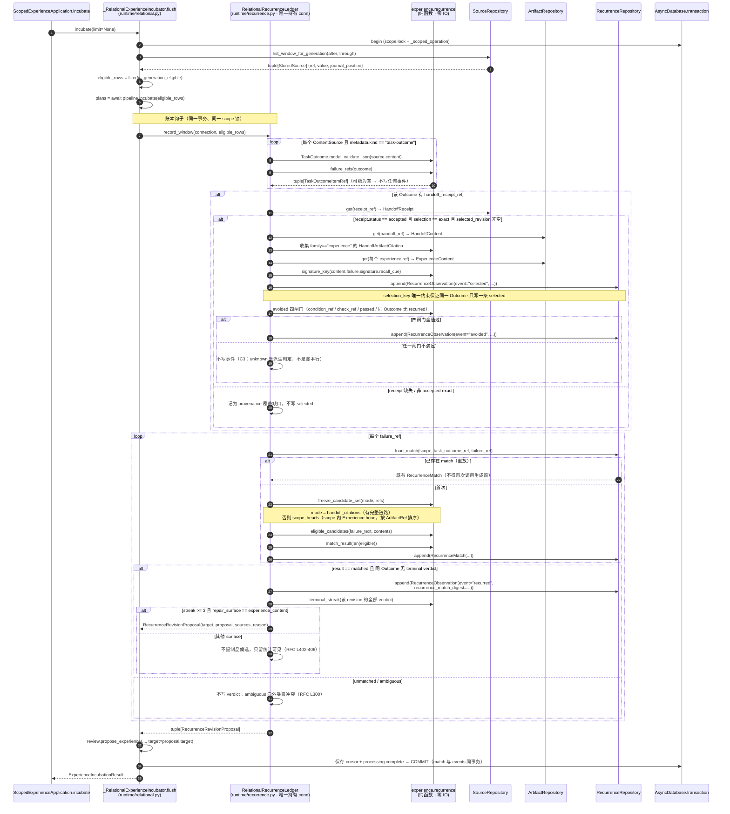
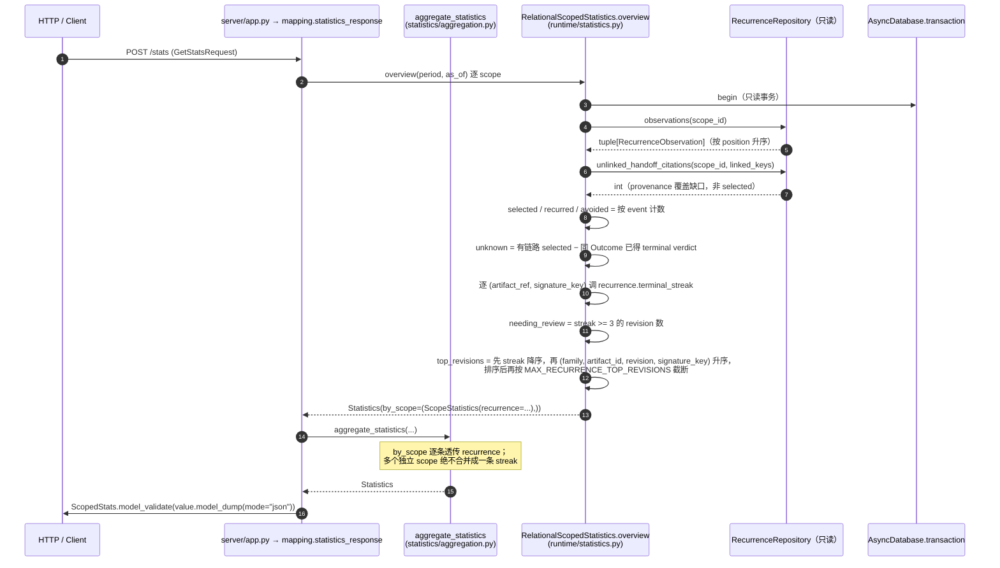

# 系统设计：反复失败修复（Recurring Failure Repair）

| 项 | 内容 |
| --- | --- |
| 需求源 | [PRD 1557](../prd/1557_recurring_failure_repair_prd.md) |
| 设计源 | [RFC 1557（中文）](../rfcs/1557_recurring_failure_repair.md) / [RFC 1557（English）](../../en/rfcs/1557_recurring_failure_repair.md) |
| 关联 Issue | oceanbase/powercontext#1554（tracking）、RFC PR #1557 |
| 文档状态 | 实现基线 |
| 日期 | 2026-09-12 |
| 作者 | 高见远（Architect） |
| Language | 中文（技术术语保留英文原文） |
| 技术栈 | Python 3.11+ / uv + Hatchling / pydantic v2 / SQLAlchemy 2.x；契约真源 `openapi/powercontext.yaml` |
| 特性类型 | 后端记忆层特性，**无前端 UI**、**不新增 Artifact 家族**、**不新增第三方依赖** |

---

## 0. 一句话概括与四条不可协商的约束

PowerContext 的 Experience 回答"什么情境下什么动作产生什么结果、学到什么"。本特性回答它的后续问题：
**"那个情境又出现了 —— 学到的东西起作用了吗？"** 落点是扩展既有 `ExperienceContent`（新增可选 `failure` 块）。

任何实现都必须同时满足以下四条，任何一条被破坏即为阻塞缺陷：

| # | 硬约束 | 出处 | 代码结构上的保证方式 |
| --- | --- | --- | --- |
| C1 | **`prepare_context` 与检索路径绝不写库**，账本只由已经在消费 `task-outcome` Source 的归整流水线写入 | RFC L304-311（RFC 0028 / RFC 1489） | 见 §1.4「模块分层与写路径隔离」 |
| C2 | **`selected` 必须由 Handoff 引用 + Receipt 链路重建**，不得在读路径插桩 | RFC L313-324 | `selected` 只在 `builtin/runtime/recurrence.py`（写路径）构造 |
| C3 | **只凭正面证据记账**：证据缺口 → `unknown` 且不写事件；`unknown` 是派生判定，不是账本行 | RFC L143-148 | `RecurrenceObservation.event` 无 `unknown` 成员；`unknown` 只在统计读取时计算 |
| C4 | **模糊相似度绝不写账本**：0.8 bigram 重叠度只产生提示 | RFC L297-299 | `near_duplicate_overlap()` 的返回值只流向候选 warnings，无任何到 repository 的调用路径 |

---

## 1. 实现方案与选型

### 1.1 复用的既有机制（不重复造轮子）

| 能力 | 既有机制 | 本特性如何使用 |
| --- | --- | --- |
| 不可变 revision | `Artifact` / `ArtifactRef` / `ArtifactRepository.get()`（`builtin/persistence/artifacts.py:206`） | 账本键是 `(artifact_id, revision)`，不是内容派生 id；修订产出新 revision，历史事件留在旧 revision |
| 内容加载兼容 | `builtin/persistence/experience_index.py:381` `load_model(ExperienceContent, ...)` | 可选字段 ⇒ 既有 revision 无需迁移即可加载 |
| 失败证据载体 | `TaskOutcome` / `WorkClaim` / `TaskCheck`（`builtin/work/models.py`，`_WorkValue` 已 frozen+forbid） | 失败证据只认 `basis="verified"` + 非空精确 evidence + 指定 status |
| Handoff 引用链 | `HandoffReceipt.selected_revision` → `HandoffResolution` → `HandoffArtifactCitation`（`builtin/artifacts/handoff/models.py:59`） | `selected` 的唯一来源；也是 `candidate_set_mode="handoff_citations"` 的候选集来源 |
| 不可变 Source journal | `StoredSource{ref, value, journal_position}`（`builtin/persistence/sources.py:68`）；`SourceRepository` | `task_outcome_ref` = `row.ref`，`task_outcome_position` = `row.journal_position` |
| Work 记录解析 | `builtin/work/continuity.py:_RECORD_MODELS`（kind → model 表） | 复用同一张表从 Source 解析 `TaskOutcome` / `HandoffReceipt` |
| 归整窗口 | `_RelationalExperienceIncubator.flush`（`builtin/runtime/relational.py:1623`），已持有 `eligible_rows: tuple[StoredSource, ...]` | 账本写入的唯一入口，复用同一个事务与 scope 锁 |
| Review Inbox | `ReviewService.propose_experience(...)` + `CandidateRepository`（`builtin/review/service.py:105`） | 复发连击达阈值且 `repair_surface == "experience_content"` 时提 revision 候选（Dream 模式：候选自动生成、人工决策强制） |
| 统计读取面 | `ScopeStatistics` / `Statistics`（`builtin/statistics/models.py:235`）；`RelationalScopedStatistics`（`builtin/runtime/statistics.py:73`）；`statistics_response()` = `ScopedStats.model_validate(value.model_dump(mode="json"))`（`server/mapping.py:537`） | 新增 `recurrence` block，域模型与 OpenAPI 同步加字段后自动贯通 |
| 规范序列化 digest | **`powercontext.builtin.evidence.models.content_digest(value: bytes) -> "sha256:<hex>"`**（`builtin/evidence/models.py:116`），与 `builtin/work/models.py:421 content_digest(BaseModel)` 语义一致（`model_dump_json(by_alias=True, exclude_none=False)`，输出恒为 71 字符） | **复用它**，见 §1.3「digest 规范」 |

### 1.2 新增什么

1. 三个内容侧值类型（`FailureSignature` / `FailureVerification` / `FailureRecord`）+ `RepairSurface` 枚举 + `ExperienceContent.failure` 可选字段。
2. 一个**纯函数**模块 `builtin/artifacts/experience/recurrence.py`：归一化、冻结候选集、`RecurrenceMatch` / `RecurrenceObservation` / `TaskOutcomeItemRef` 值类型、判定矩阵、`observation_id` 派生。**不 import 任何 repository，不持有 connection。**
3. 一个**写路径编排器** `builtin/runtime/recurrence.py`：`RelationalRecurrenceLedger`，负责读 Source 窗口 → 解析 Work 记录 → 读 Handoff / Experience revision → 调纯函数 → 写账本。**只有这一层持有 connection。**
4. 一个持久化仓储 `builtin/persistence/recurrence.py`：`RecurrenceRepository`（只追加写入 + 读取聚合）。
5. 两张只追加表 `pc_recurrence_match` / `pc_recurrence_observation`。
6. 统计读取面：`RecurrenceStreak` / `RecurrenceStatistics` / `ScopeStatistics.recurrence`。
7. OpenAPI 加成：可选 `failure` 对象（纯加法）+ 必填 `recurrence` block（**破坏性变更，PR 必须标注 breaking**）。

### 1.3 digest 规范（跨文件约定，工程师必读）

仓库**已有**规范序列化 digest 工具，直接复用，不要新写：

```python
from powercontext.builtin.evidence.models import content_digest

def canonical_digest(value: BaseModel) -> str:
    """Canonical digest for one ledger value. 恒定 71 字符：`sha256:` + 64 hex。"""
    return content_digest(value.model_dump_json(by_alias=True, exclude_none=False).encode())
```

- 采纳理由：`builtin/work/models.py:421 content_digest(BaseModel)` 的逐字实现；但 `work.models` 反向 import 了 `builtin.artifacts.experience`（`TASK_OUTCOME_SOURCE_KIND`），从 `experience/recurrence.py` 直接 import 会形成循环依赖（详见 §6.3）。`builtin/evidence/models.py` 只依赖 `powercontext.artifacts` / `errors` / `sources`，**无环**。
- 覆盖：`item_digest`、`candidate_set_digest`、`recurrence_match_digest`、`observation_id`、`match_key`、`selection_key`、`verdict_key`。
- 不变量：`model_dump_json` 对 tuple 顺序敏感，因此**候选 ref 必须在计算 `candidate_set_digest` 之前排序并去重**（RFC L375「候选快照在计算 digest 前规范化」）。

### 1.4 模块分层与写路径隔离（C1 / C2 的结构性保证）

```
                     ┌────────────────────────────────────────────────────────┐
   读路径（只读）     │ runtime/prepared_context.py、persistence/experience_   │
   **禁止持有 conn 写 │ index.py、artifacts/ experience/search.py              │
   库、禁止 import    │ 只允许：读 + 渲染 + 投影。**不 import Recurrence* 仓储。**│
   RecurrenceRepo **  └────────────────────────────────────────────────────────┘
                                          ▲ 内容投影（cue 进入检索）单向依赖
                     ┌────────────────────────────────────────────────────────┐
   纯逻辑层           │ builtin/artifacts/experience/recurrence.py             │
   **零 IO、零 conn **│ normalize / freeze / match / verdict / observation_id   │
                     └────────────────────────────────────────────────────────┘
                                          ▲ 只被写路径与统计层调用
                     ┌────────────────────────────────────────────────────────┐
   写路径（唯一）     │ builtin/runtime/recurrence.py  RelationalRecurrenceLedger│
   **唯一持有 conn ** │ ← 被 _RelationalExperienceIncubator.flush 在既有事务内调用│
                     └────────────────────────────────────────────────────────┘
                     ┌────────────────────────────────────────────────────────┐
   统计读取（只读）   │ builtin/runtime/statistics.py + persistence/recurrence.py│
                     └────────────────────────────────────────────────────────┘
```

**工程师如何在代码结构上保证 C1 不被违反：**

1. `builtin/artifacts/experience/recurrence.py` **不 import** `sqlalchemy`、`AsyncConnection`、`AsyncDatabase`、任何 `*Repository`。在 T03 验收中加一条静态检查（见 T03 验收 6）。
2. `builtin/runtime/prepared_context.py`、`persistence/experience_index.py`、`artifacts/experience/search.py` 在整个 PR 中**不得出现** `RecurrenceRepository` / `pc_recurrence_*` / `database.transaction()` 的新增引用（`git diff` 人工核对 + 全局 grep）。
3. 账本写入只挂在 `_RelationalExperienceIncubator.flush`（`relational.py:1623`）这一条既有 `task-outcome` 消费路径上；它本来就持有 `self._lock`（scope 锁）与 `database.transaction()`，因此 match 与 events 天然在同一事务提交（RFC L374）。
4. `prek` 钩子已经按目录跑 ruff；T03 追加一个行为测试：调用一次 `prepare_context` 后断言 `pc_recurrence_observation` 行数不变（**这是对可观察行为的断言，不是对实现细节的断言**，符合 `AGENTS.md`）。

### 1.5 依赖

**不新增任何第三方依赖。** 归一化用标准库 `unicodedata`（NFKC）+ `str.casefold`；digest 用既有 `content_digest`；bigram 重叠度是 10 行纯 Python。

---

## 2. 文件清单

### 2.1 新增（7 个源码/测试文件）

| # | 相对路径 | 一句话职责 | 预估改动量 |
| --- | --- | --- | --- |
| N1 | `src/powercontext/builtin/artifacts/experience/recurrence.py` | 归一化、冻结候选集、`TaskOutcomeItemRef` / `RecurrenceMatch` / `RecurrenceObservation` 值类型、判定矩阵、`observation_id` 派生、连击计算、近似孪生提示（**纯函数，零 IO**） | 新增 ~520 行 |
| N2 | `src/powercontext/builtin/runtime/recurrence.py` | `RelationalRecurrenceLedger`：唯一的写路径编排器（解析窗口 → 读 Handoff/Experience revision → 调纯函数 → 写账本 → 返回复发 revision 候选） | 新增 ~260 行 |
| N3 | `src/powercontext/builtin/persistence/recurrence.py` | `RecurrenceRepository`：两张表的只追加写入、重放查 match、按 scope 读取聚合、provenance 覆盖缺口计数 | 新增 ~240 行 |
| N4 | `tests/builtin/artifacts/experience/test_recurrence.py` | 归一化、冻结候选集、判定矩阵、幂等键、连击的纯逻辑行为测试（覆盖 RFC 最小证据案例） | 新增 ~320 行 |
| N5 | `tests/builtin/persistence/test_recurrence_repository.py` | 唯一约束、只追加、事务、重放幂等、读取聚合 | 新增 ~180 行 |
| N6 | `tests/builtin/runtime/test_recurrence_ledger.py` | 写路径端到端（含 `prepare` 不写库的回归断言） | 新增 ~200 行 |
| N7 | `tests/e2e/test_recurring_failure_repair.py` | 两个 RFC 场景（openapi 忘记重新生成 / pytest 端口占用）的跨组件验收 | 新增 ~160 行 |

### 2.2 修改（18 个文件）

| # | 相对路径 | 一句话职责 | 预估改动量 |
| --- | --- | --- | --- |
| M1 | `src/powercontext/artifacts/models.py` | 新增 `_ArtifactValue`（`extra="forbid", frozen=True`），与 `ArtifactRef` 同处 | +6 行 |
| M2 | `src/powercontext/builtin/artifacts/experience/models.py` | `MAX_FAILURE_CUE_LENGTH`、`_ExperienceValue`、`RepairSurface`、`FailureSignature`、`FailureVerification`、`FailureRecord`、`ExperienceContent.failure` | +75 行 |
| M3 | `src/powercontext/builtin/artifacts/experience/search.py` | `experience_search_text` 纳入 cue/symptom；`render_experience` 增两行 | +18 行 |
| M4 | `src/powercontext/builtin/artifacts/experience/__init__.py` | 导出新符号（**字母序**；按 §6.3 不导出 `recurrence` 子模块） | +22 行 |
| M5 | `src/powercontext/server/mapping.py` | `experience_content` / `experience_proposal` 增加 `failure` 双向映射 | +45 行 |
| M6 | `src/powercontext/builtin/persistence/tables.py` | `RECURRENCE_MATCH_TABLE`、`RECURRENCE_OBSERVATION_TABLE`、`RECURRENCE_TABLES`，并注册进 `BUILTIN_TABLES` | +125 行 |
| M7 | `src/powercontext/builtin/persistence/__init__.py` | 导出 `RecurrenceRepository`（import 段 + `__all__` 字母序） | +4 行 |
| M8 | `docs/en/docs/operate/troubleshoot.md` | obloader 恢复分层加入两张新表 | +1 行 |
| M9 | `docs/zh/docs/operate/troubleshoot.md` | 同上，且两个 locale 必须逐字一致 | +1 行 |
| M10 | `src/powercontext/builtin/artifacts/experience/prompts.py` | bump 两个指令版本号 + 新增 failure 块书写规则 | +18 行 |
| M11 | `src/powercontext/builtin/runtime/relational.py` | `_ScopedServices` 注入 `RecurrenceRepository`；`_RelationalExperienceIncubator.flush` 挂账本钩子并把复发 revision 候选并入 `plans` | +45 行 |
| M12 | `src/powercontext/builtin/statistics/models.py` | `MAX_RECURRENCE_TOP_REVISIONS`、`RecurrenceStreak`、`RecurrenceStatistics`、`ScopeStatistics.recurrence`、`__all__` | +55 行 |
| M13 | `src/powercontext/builtin/statistics/aggregation.py` | `by_scope` 逐条传递 `recurrence`（**不跨 scope 合并 streak**） | +6 行 |
| M14 | `src/powercontext/builtin/runtime/statistics.py` | 装配 `recurrence` block（调用 `RecurrenceRepository` 只读聚合） | +70 行 |
| M15 | `openapi/powercontext.yaml` | `ExperienceProposal.failure`（可选）+ 4 个新 schema + `ScopeStats.recurrence`（必填）+ 2 个统计 schema | +135 行 |
| M16 | `src/powercontext/http/_generated/*` | `make api-generate` 产出，**不得手改** | 生成 |
| M17 | `tests/builtin/artifacts/experience/test_models.py` | failure 块校验（cue 空白/超长、必填、frozen、extra forbid、既有 revision 加载兼容） | +90 行 |
| M18 | `tests/builtin/runtime/test_statistics.py` | `ScopeStats.recurrence` 断言 + 多 scope 不合并 | +50 行 |

> **注**：本特性不需要新增项目基础设施（无新依赖、无新入口、无新配置段），因此第一个任务 T01 承担的是"内容模型与投影基础设施"这一层。

---

## 3. 数据结构与接口

### 3.1 完整字段定义

```python
# ─── src/powercontext/artifacts/models.py（M1）───────────────────────────────
class _ArtifactValue(BaseModel):
    """Shared immutable configuration for artifact-family content values."""
    model_config = ConfigDict(extra="forbid", frozen=True)   # 不加 strict=True，理由见 §6.1


# ─── src/powercontext/builtin/artifacts/experience/models.py（M2）────────────
MAX_EXPERIENCE_FIELD_LENGTH = 8_000
MAX_FAILURE_CUE_LENGTH = 512                      # 匹配键限长；RFC L241

ExperienceText = Annotated[str, Field(min_length=1, max_length=MAX_EXPERIENCE_FIELD_LENGTH)]

RepairSurface = Literal["experience_content", "working_state", "recall_policy", "acceptance_check"]

class _ExperienceValue(_ArtifactValue):
    """Shared immutable configuration for Experience-family values."""


class FailureSignature(_ExperienceValue):
    """Machine-matchable identity for one recurring failure."""
    recall_cue: Annotated[str, Field(min_length=1, max_length=MAX_FAILURE_CUE_LENGTH)]
    symptom: ExperienceText | None = None

    @field_validator("recall_cue")
    @classmethod
    def reject_blank_cue(cls, value: str) -> str:
        if not value.strip():
            raise ValueError("failure recall_cue must not be blank")  # noqa: TRY003
        return value


class FailureVerification(_ExperienceValue):
    """Normalized strict bindings that make `avoided` decidable."""
    condition: ExperienceText                      # 绑定 verified WorkClaim.text（归一化严格相等）
    check_subject: Annotated[str, Field(min_length=1, max_length=MAX_FAILURE_CUE_LENGTH)]
    #                                              绑定 verified TaskCheck.name（归一化严格相等）
    @field_validator("check_subject")
    @classmethod
    def reject_blank_subject(cls, value: str) -> str:
        if not value.strip():
            raise ValueError("failure check_subject must not be blank")  # noqa: TRY003
        return value


class FailureRecord(_ExperienceValue):
    """Optional failure block carried by one Experience revision."""
    signature: FailureSignature
    repair_surface: RepairSurface                  # 必填、无默认（Q2 决策）
    verification: FailureVerification              # 在 FailureRecord 内部必填（RFC L243-246）


class ExperienceContent(_ExperienceValue):         # ← Q8 结论：升级为 frozen + extra=forbid
    situation: ExperienceText
    action: ExperienceText
    outcome: ExperienceText
    lesson: ExperienceText
    failure: FailureRecord | None = None           # 可选 ⇒ 既有 revision 加载兼容

    @field_validator("situation", "action", "outcome", "lesson")
    @classmethod
    def reject_blank_text(cls, value: str) -> str: ...   # 既有，不变
```

```python
# ─── src/powercontext/builtin/artifacts/experience/recurrence.py（N1）────────
RECURRENCE_REVIEW_STREAK_THRESHOLD = 3             # Q3：连续 3 次 terminal recurred 且其间无 avoided
NEAR_DUPLICATE_BIGRAM_OVERLAP = 0.8                # Q3：只提示，绝不写计数器（C4）
MAX_RECURRENCE_CANDIDATES = 64                     # 冻结候选集上限（防御性）
MAX_RECURRENCE_SIGNATURE_KEY_LENGTH = MAX_FAILURE_CUE_LENGTH


class TaskOutcomeItemRef(_ArtifactValue):
    """Ledger-internal locator into immutable Task Outcome content."""
    task_outcome_ref: SourceRef
    item_kind: Literal["observation", "check"]
    item_index: Annotated[int, Field(ge=0)]
    item_digest: str                                # canonical_digest(item)，71 字符
    #
    # model_validator(mode="after"): 要求 item_digest 非空且以 "sha256:" 开头（形状校验，
    # 真正的"能否解析"由写路径在解析时判定）


class RecurrenceMatch(_ArtifactValue):
    """One immutable, replayable matching decision."""
    scope_id: str
    task_outcome_ref: SourceRef
    task_outcome_position: Annotated[int, Field(ge=1)]
    failure_ref: TaskOutcomeItemRef
    candidate_set_mode: Literal["handoff_citations", "scope_heads"]
    candidate_refs: tuple[ArtifactRef, ...]         # 已排序、已去重的精确快照
    candidate_set_digest: str
    result: Literal["matched", "unmatched", "ambiguous"]
    artifact_ref: ArtifactRef | None = None         # 仅 matched 时必填
    signature_key: str | None = None                # 仅 matched 时必填；从已存储 recall_cue 原样复制后归一化

    # model_validator(mode="after")：
    #   1. failure_ref.task_outcome_ref == task_outcome_ref
    #   2. candidate_refs 已按 (family, artifact_id, revision) 排序且无重复
    #   3. candidate_set_digest == canonical_digest(frozen(candidate_refs))
    #   4. result == "matched"  ⇒ artifact_ref 与 signature_key 同时非空
    #      result != "matched"  ⇒ 二者同时为 None
    #   5. result == "matched"  ⇒ artifact_ref 必须在 candidate_refs 内  （RFC L296）


class RecurrenceObservation(_ArtifactValue):
    """One append-only ledger event derived from positive evidence only."""
    observation_id: str                                     # 幂等键（派生规则见 §3.3）
    scope_id: str
    artifact_ref: ArtifactRef                               # 精确 Experience revision
    signature_key: str                                      # 匹配成功的归一化 cue
    event: Literal["selected", "recurred", "avoided"]       # 无 "unknown"（C3）
    match_basis: Literal["exact"] = "exact"
    task_outcome_ref: SourceRef
    task_outcome_position: Annotated[int, Field(ge=1)]      # 不可变 journal position，唯一顺序键
    handoff_receipt_ref: SourceRef | None = None            # selected / avoided 必填
    handoff_ref: ArtifactRef | None = None                  # selected / avoided 必填
    condition_ref: TaskOutcomeItemRef | None = None         # avoided 必填
    check_ref: TaskOutcomeItemRef | None = None             # avoided 必填
    failure_ref: TaskOutcomeItemRef | None = None           # recurred 必填
    recurrence_match_digest: str | None = None              # recurred 必填

    # model_validator(mode="after")：按事件矩阵校验必填/互斥（见 §3.4）


class RecurrenceRevisionProposal(_ArtifactValue):
    """A recurrence-triggered Experience revision write ready for the Review Inbox."""
    target: ArtifactRef                             # 被修订的既有 Experience
    proposal: ExperienceContent                     # 完整替换内容（不是 patch）
    sources: tuple[SourceRef, ...] = Field(min_length=1, max_length=MAX_EXPERIENCE_CANDIDATE_EVIDENCE)
    reason: str
```

```python
# ─── src/powercontext/builtin/statistics/models.py（M12）─────────────────────
MAX_RECURRENCE_TOP_REVISIONS = 20                  # 部署配置上限 N；OpenAPI maxItems 同步

class RecurrenceStreak(BaseModel):                 # RFC L426-430：普通 BaseModel，不 frozen
    artifact_ref: ArtifactRef
    signature_key: str
    terminal_recurred_streak: int = Field(ge=0)    # 按 task_outcome_position 顺序派生

class RecurrenceStatistics(BaseModel):             # RFC L432-440
    selected: int = Field(ge=0)
    recurred: int = Field(ge=0)
    avoided: int = Field(ge=0)
    unknown: int = Field(ge=0)                     # 派生：有链路 selected − 同 Outcome 已得 terminal verdict
    unlinked_handoff_citations: int = Field(ge=0)  # 仅 provenance 覆盖率
    needing_review: int = Field(ge=0)
    top_revisions: tuple[RecurrenceStreak, ...] = Field(max_length=MAX_RECURRENCE_TOP_REVISIONS)

class ScopeStatistics(BaseModel):
    scope_id: str
    inventory: InventoryStatistics
    usage: UsageStatistics
    recall: RecallTokenStatistics
    recurrence: RecurrenceStatistics                # 必填（RFC L442；OpenAPI 同步为 required）
```

### 3.2 类图

```mermaid
classDiagram
    class _ArtifactValue {
        <<BaseModel>>
        +model_config: extra=forbid, frozen=True
    }
    class _ExperienceValue {
        <<BaseModel>>
    }
    class ExperienceText {
        <<Annotated str>>
        min_length=1
        max_length=8000
    }

    class ExperienceContent {
        +situation: ExperienceText
        +action: ExperienceText
        +outcome: ExperienceText
        +lesson: ExperienceText
        +failure: FailureRecord | None
        +reject_blank_text()
    }
    class FailureRecord {
        +signature: FailureSignature
        +repair_surface: RepairSurface
        +verification: FailureVerification
        +reject_blank_cue()
    }
    class FailureSignature {
        +recall_cue: str (1..512)
        +symptom: ExperienceText | None
    }
    class FailureVerification {
        +condition: ExperienceText
        +check_subject: str (1..512)
    }
    class RepairSurface {
        <<Literal>>
        experience_content
        working_state
        recall_policy
        acceptance_check
    }

    class TaskOutcomeItemRef {
        +task_outcome_ref: SourceRef
        +item_kind: observation | check
        +item_index: int (ge=0)
        +item_digest: str
    }
    class RecurrenceMatch {
        +scope_id: str
        +task_outcome_ref: SourceRef
        +task_outcome_position: int (ge=1)
        +failure_ref: TaskOutcomeItemRef
        +candidate_set_mode: handoff_citations | scope_heads
        +candidate_refs: tuple[ArtifactRef, ...]
        +candidate_set_digest: str
        +result: matched | unmatched | ambiguous
        +artifact_ref: ArtifactRef | None
        +signature_key: str | None
    }
    class RecurrenceObservation {
        +observation_id: str
        +scope_id: str
        +artifact_ref: ArtifactRef
        +signature_key: str
        +event: selected | recurred | avoided
        +match_basis: exact
        +task_outcome_ref: SourceRef
        +task_outcome_position: int (ge=1)
        +handoff_receipt_ref: SourceRef | None
        +handoff_ref: ArtifactRef | None
        +condition_ref: TaskOutcomeItemRef | None
        +check_ref: TaskOutcomeItemRef | None
        +failure_ref: TaskOutcomeItemRef | None
        +recurrence_match_digest: str | None
    }
    class RecurrenceRevisionProposal {
        +target: ArtifactRef
        +proposal: ExperienceContent
        +sources: tuple[SourceRef, ...]
        +reason: str
    }

    class RecurrenceStreak {
        +artifact_ref: ArtifactRef
        +signature_key: str
        +terminal_recurred_streak: int (ge=0)
    }
    class RecurrenceStatistics {
        +selected: int
        +recurred: int
        +avoided: int
        +unknown: int
        +unlinked_handoff_citations: int
        +needing_review: int
        +top_revisions: tuple[RecurrenceStreak, ...]
    }
    class ScopeStatistics {
        +scope_id: str
        +inventory: InventoryStatistics
        +usage: UsageStatistics
        +recall: RecallTokenStatistics
        +recurrence: RecurrenceStatistics
    }

    class ArtifactRef {
        +family: str
        +artifact_id: str
        +revision: int (ge=1)
    }
    class SourceRef {
        +source_type: str
        +source_id: str
    }
    class TaskOutcome {
        +status: TaskOutcomeStatus
        +handoff_receipt_ref: SourceRef | None
        +observations: tuple[WorkClaim, ...]
        +checks: tuple[TaskCheck, ...]
    }
    class WorkClaim {
        +text: str
        +basis: declared | verified
        +evidence: tuple[HandoffCitation, ...]
    }
    class TaskCheck {
        +name: str
        +status: TaskCheckStatus
        +basis: declared | verified
        +evidence: tuple[HandoffCitation, ...]
    }
    class HandoffReceipt {
        +status: accepted | needs_clarification | declined
        +selection: prepared | exact | latest
        +selected_revision: ArtifactRef | None
        +evidence_status: available | unavailable
    }

    _ArtifactValue <|-- _ExperienceValue
    _ExperienceValue <|-- ExperienceContent
    _ExperienceValue <|-- FailureRecord
    _ExperienceValue <|-- FailureSignature
    _ExperienceValue <|-- FailureVerification
    _ArtifactValue <|-- TaskOutcomeItemRef
    _ArtifactValue <|-- RecurrenceMatch
    _ArtifactValue <|-- RecurrenceObservation
    _ArtifactValue <|-- RecurrenceRevisionProposal

    ExperienceContent *-- FailureRecord : failure (0..1)
    FailureRecord *-- FailureSignature : signature
    FailureRecord --> RepairSurface : repair_surface
    FailureRecord *-- FailureVerification : verification

    RecurrenceMatch *-- TaskOutcomeItemRef : failure_ref
    RecurrenceMatch --> SourceRef : task_outcome_ref
    RecurrenceMatch --> ArtifactRef : artifact_ref (matched)

    RecurrenceObservation --> ArtifactRef : artifact_ref
    RecurrenceObservation --> SourceRef : task_outcome_ref / handoff_receipt_ref
    RecurrenceObservation o-- TaskOutcomeItemRef : condition_ref / check_ref / failure_ref
    RecurrenceObservation ..> RecurrenceMatch : recurrence_match_digest

    RecurrenceRevisionProposal --> ExperienceContent : proposal
    RecurrenceRevisionProposal --> ArtifactRef : target

    ScopeStatistics *-- RecurrenceStatistics : recurrence
    RecurrenceStatistics *-- RecurrenceStreak : top_revisions
    RecurrenceStreak --> ArtifactRef : artifact_ref

    TaskOutcome *-- WorkClaim : observations
    TaskOutcome *-- TaskCheck : checks
    TaskOutcome --> SourceRef : handoff_receipt_ref
    TaskOutcomeItemRef ..> WorkClaim : item_kind=observation
    TaskOutcomeItemRef ..> TaskCheck : item_kind=check
    HandoffReceipt --> ArtifactRef : selected_revision
```



### 3.3 纯函数接口（`experience/recurrence.py`）

```python
def normalize_match_text(value: str, /) -> str:
    """NFKC → casefold → 空白折叠 → 去除首尾标点。空串/纯标点抛 ValueError。
    归一化值只作比较辅助，不作为被存储的身份（RFC L282）。"""

def signature_key(cue: str, /) -> str:
    """normalize_match_text(recall_cue)。"""

def near_duplicate_overlap(left: str, right: str, /) -> float:
    """token bigram 重叠度 ∈ [0, 1]。返回值只流向候选 warnings，绝不写账本（C4）。"""

def canonical_digest(value: BaseModel, /) -> str:
    """§1.3：复用 evidence.models.content_digest。"""

def item_digest(item: WorkClaim | TaskCheck, /) -> str: ...

def failure_item_text(item: WorkClaim | TaskCheck, /) -> str:
    """observation → WorkClaim.text；check → TaskCheck.name。
    禁止把 TaskCheck.details / symptom / Outcome 叙述作为匹配输入（RFC L283-287）。"""

def is_failure_evidence(outcome: TaskOutcome, kind: Literal["observation", "check"], index: int, /) -> bool:
    """observation：父 Outcome status ∈ {failed, blocked} 且 basis=verified 且 evidence 非空。
       check：basis=verified 且 evidence 非空 且 status ∈ {failed, timed_out, unavailable}。
       skipped / cancelled / unknown 永不构成失败证据（RFC L259-265）。"""

def failure_refs(outcome: TaskOutcome, /) -> tuple[TaskOutcomeItemRef, ...]:
    """窗口内全部构成失败证据的 item locator（按 checks 优先、index 升序的稳定顺序）。"""

def freeze_candidate_set(
    *, mode: Literal["handoff_citations", "scope_heads"], refs: tuple[ArtifactRef, ...]
) -> tuple[ArtifactRef, ...]:
    """排序 + 去重 + 截断到 MAX_RECURRENCE_CANDIDATES；digest 在此之后计算。"""

def candidate_set_digest(refs: tuple[ArtifactRef, ...], /) -> str: ...

def eligible_candidates(
    failure_text: str, contents: Mapping[ArtifactRef, ExperienceContent], /
) -> tuple[ArtifactRef, ...]:
    """精确匹配：normalize_match_text(failure_text) == signature_key(content.failure.signature.recall_cue)。"""

def match_result(count: int, /) -> Literal["matched", "unmatched", "ambiguous"]:
    """0 → unmatched；1 → matched；≥2 → ambiguous。生成器不得参与选择（RFC L286-287）。"""

def observation_id(**parts, /) -> str:
    """事件类型 + Task Outcome + journal position + Handoff/Receipt + 精确 revision
       + signature_key + 适用时的 match digest + 每个适用 item locator（含 digest）
       的规范序列化 digest（RFC L376-378）。"""

def terminal_streak(verdicts: tuple[RecurrenceObservation, ...], /) -> int:
    """按 task_outcome_position 升序；统计自最后一个 avoided 之后连续的 recurred 个数。"""

def needing_review(verdicts: tuple[RecurrenceObservation, ...], /) -> bool:
    """terminal_streak(...) >= RECURRENCE_REVIEW_STREAK_THRESHOLD。"""
```

### 3.4 事件矩阵（`RecurrenceObservation` 的 `model_validator`，逐条对应 RFC L366-372）

| 字段 | `selected` | `recurred` | `avoided` |
| --- | --- | --- | --- |
| `task_outcome_ref` + `task_outcome_position ≥ 1` | 必填 | 必填 | 必填 |
| `handoff_receipt_ref`（accepted / exact） | 必填 | 必须为 `None` | 必填 |
| `handoff_ref`（该 Handoff 引用了此 revision） | 必填 | 必须为 `None` | 必填 |
| `condition_ref`（`item_kind="observation"`） | `None` | `None` | 必填 |
| `check_ref`（`item_kind="check"`） | `None` | `None` | 必填 |
| `failure_ref` | `None` | 必填（唯一失败 item） | `None` |
| `recurrence_match_digest` | `None` | 必填 | `None` |

附加约束（任一违反即拒绝，不允许静默降级）：
- `avoided` 的两个 locator `task_outcome_ref` 必须等于本事件的 `task_outcome_ref`；
- `recurred` 的 `failure_ref.task_outcome_ref` 必须等于本事件的 `task_outcome_ref`；
- `recurrence_match_digest` 必须以 `sha256:` 开头。

---

## 4. 程序调用流程

### 4.1 写路径：归整窗口 → 冻结/重放 match → 判定 → 事务提交



### 4.2 统计读取面（只读，绝不写库）



---

## 5. 有序任务列表

> 依赖顺序：`T01 → T02 → T03 → T05`，`T02 → T04 → T05`。T03 与 T04 可并行（互不改同一文件），但都必须在 T05 之前完成。

### T01 · 内容模型、投影与 HTTP 映射（P0）

**目标**：让 `failure` 块成为 Experience 内容的一等可选字段，并让它参与检索与渲染。此任务结束时，域模型已经可用，但还没有任何账本行为。

**文件**：M1 `artifacts/models.py`、M2 `experience/models.py`、M3 `experience/search.py`、M4 `experience/__init__.py`、M5 `server/mapping.py`、M17 `tests/.../test_models.py`（+ 新建 `tests/builtin/artifacts/experience/test_search.py`）

**子步骤**
1. `artifacts/models.py`：在 `ArtifactRef` 之后新增 `_ArtifactValue`，`model_config = ConfigDict(extra="forbid", frozen=True)`。**不要**加 `strict=True`（理由 §6.1）。
2. `experience/models.py`：新增 `MAX_FAILURE_CUE_LENGTH = 512`；新增 `_ExperienceValue(_ArtifactValue)`；按 §3.1 新增 `RepairSurface` / `FailureSignature` / `FailureVerification` / `FailureRecord`；`ExperienceContent` 改继承 `_ExperienceValue` 并追加 `failure: FailureRecord | None = None`。`__all__` 按字母序维护。
3. `experience/search.py`：`experience_search_text` 在 `failure` 存在时追加 `recall_cue` 与（存在时的）`symptom`；`render_experience` 在 `failure` 存在时追加 `Failure cue:` / `Symptom:` 两行。`failure is None` 时输出必须与今天逐字节一致。
4. `experience/__init__.py`：导出 `MAX_FAILURE_CUE_LENGTH`、`_ExperienceValue`（不导出，私有）、`FailureRecord`、`FailureSignature`、`FailureVerification`、`RepairSurface`。**字母序**。**不要**在此导出 `recurrence` 子模块（§6.3 循环依赖）。
5. `server/mapping.py`：`experience_content()` 在 `value.failure is not None` 时构造 `FailureRecord`；`experience_proposal()` 反向映射。
6. **Q8 落地**：确认 `ExperienceContent` 已是 `frozen=True, extra="forbid"`（§6.1）。

**验收标准**
1. `uv run python -m pytest tests/builtin/artifacts/experience -q` 全绿；`make test` 全绿（这是 `extra="forbid"` 无历史未知键的证据）。
2. cue 为空白串 / 超 512 字符 / 缺失 `repair_surface` / 缺失 `verification` 时抛 `ValidationError`。
3. 对 `ExperienceContent` 实例做字段赋值抛 `ValidationError`（frozen 生效）。
4. 既有 4 字段的 revision JSON（无 `failure`）可正常 `model_validate`。
5. 以 cue 中的关键词走 `experience_searchable_text` 能命中该 revision；`failure=None` 时渲染输出与改动前完全一致。
6. `make check`（ruff 120 行宽 + `ty check`）通过。

---

### T02 · 持久化账本：两张只追加表 + 仓储 + 注册（P0）

**目标**：账本有地方落，且建表路径、恢复分层、字节预算三处都对齐。

**文件**：M6 `persistence/tables.py`、N3 `persistence/recurrence.py`、M7 `persistence/__init__.py`、M8/M9 `docs/{en,zh}/docs/operate/troubleshoot.md`、N5 `tests/builtin/persistence/test_recurrence_repository.py`

**子步骤**
1. `tables.py`：在 `STATISTICS_TABLES`（L1063）附近新增 `RECURRENCE_MATCH_TABLE` / `RECURRENCE_OBSERVATION_TABLE`（`SHARED_METADATA`），并新增 `RECURRENCE_TABLES = (RECURRENCE_MATCH_TABLE, RECURRENCE_OBSERVATION_TABLE)`。**必须**并入 `BUILTIN_TABLES`（L1094-1101）。
2. 列定义与键预算（**务必照抄，预算已算过**）：
   - `pc_recurrence_match`：
     - `scope_id` identity_string(256)、`match_key` identity_string(71) → **PK (scope_id, match_key) 预算 1308**
     - `task_outcome_source_type` identity_string(128)、`task_outcome_source_id` identity_string(256)、`task_outcome_position` BigInteger、`failure_item_kind` String(16)、`failure_item_index` Integer
     - **UniqueConstraint** `(scope_id, task_outcome_source_type, task_outcome_source_id, failure_item_kind, failure_item_index)` 名 `uq_pc_recurrence_match_identity` → **预算 2628**（< 2640，见 §6.2）
     - `failure_item_digest` identity_string(71)、`candidate_set_mode` String(16)、`candidate_set_digest` identity_string(71)、`result` String(16)、`target_family` identity_string(128)、`target_artifact_id` identity_string(128)、`target_revision` Integer、`signature_key` Text(MEDIUMTEXT)、`payload` `_canonical_payload_type()`
     - ForeignKeyConstraint(`scope_id`) → `pc_scopes.scope_id` ondelete CASCADE
     - CheckConstraint：`result IN ('matched','unmatched','ambiguous')`、`candidate_set_mode IN ('handoff_citations','scope_heads')`、`failure_item_kind IN ('observation','check')`、`task_outcome_position > 0`、`failure_item_index >= 0`
   - `pc_recurrence_observation`：
     - `scope_id` identity_string(256)、`observation_id` identity_string(71) → **PK 预算 1308**
     - `selection_key` identity_string(71) → **UniqueConstraint 预算 1308**（保证同一 `(scope, artifact_ref, signature_key, task_outcome_ref)` 只写一条 `selected`）
     - `verdict_key` identity_string(71) → **UniqueConstraint 预算 1308**（保证最多一条 terminal verdict）
     - `event` String(16)、`match_basis` String(8)、`family` identity_string(128)、`artifact_id` identity_string(128)、`revision` Integer、`signature_key` Text(MEDIUMTEXT)、`signature_key_hash` LargeBinary(32)（`with_variant(BINARY(32), "mysql")`，仿 `ARTIFACT_TAGS_TABLE`）、`task_outcome_source_type`、`task_outcome_source_id`、`task_outcome_position` BigInteger、`payload` `_canonical_payload_type()`
     - Index `ix_pc_recurrence_observation_revision (scope_id, family, artifact_id, revision)` → 预算 2052
     - Index `ix_pc_recurrence_observation_outcome (scope_id, task_outcome_source_type, task_outcome_source_id, task_outcome_position)` → 预算 2568
     - Index `ix_pc_recurrence_observation_key (scope_id, signature_key_hash)` → 预算 1056
     - CheckConstraint：`event IN ('selected','recurred','avoided')`、`revision > 0`、`task_outcome_position > 0`
   - **禁止**把 `Boolean` / `DateTime` 列放进任何 PK / UNIQUE / FK / INDEX（§6.2）。
3. `docs/en/docs/operate/troubleshoot.md` 与 `docs/zh/docs/operate/troubleshoot.md`：在**最后一个** `--table '...'` 分层里追加 `pc_recurrence_match,pc_recurrence_observation`（两个 locale 必须逐字一致）。
4. `persistence/recurrence.py`：`RecurrenceRepository`
   - `append_match(connection, match)` / `find_match(connection, scope_id, task_outcome_ref, failure_ref)`
   - `append_observation(connection, observation)`（先算 `selection_key` / `verdict_key`；冲突 = 幂等重放，按 RFC 语义返回 "already recorded" 而不是报错）
   - `observations(connection, scope_id)` → 按 `task_outcome_position` 升序
   - `unlinked_handoff_citations(connection, scope_id, linked)` → 有界读取（§7 待明确 2）
   - **不提供任何 update / delete**。
5. `persistence/__init__.py`：导出 `RecurrenceRepository`（import 段 + `__all__`，字母序）。

**验收标准**
1. `uv run python -m pytest tests/builtin/persistence/test_mysql_schema.py -q` 全绿（含 `test_documented_obloader_restore_layers_are_parent_first` 与 `test_every_mysql_utf8mb4_key_stays_below_the_innodb_limit`）。
2. 新表出现在 `BUILTIN_TABLES`；`SQLiteProfile.open(config, tables=BUILTIN_TABLES)` 能建表。
3. 重复写入同一 `(scope, task_outcome_ref, failure_ref)` 的 match 被唯一约束拒绝；重复写入同一 `observation_id` 被 PK 拒绝。
4. 同一 `(scope, artifact_ref, signature_key, task_outcome_ref)` 第二次 `selected` 被 `uq_pc_recurrence_observation_selection` 拒绝；第二次 terminal verdict 被 `uq_pc_recurrence_observation_verdict` 拒绝。
5. 仓储中不存在 `update` / `delete` 语句（`grep -n "update(\|delete(" ` 为空）。

---

### T03 · 复发匹配引擎与归整流水线集成（P0，写路径闭环）

**目标**：账本真的被写，且只被 `task-outcome` 归整路径写。

**文件**：N1 `experience/recurrence.py`、N2 `runtime/recurrence.py`、M11 `runtime/relational.py`、M10 `experience/prompts.py`、N4 `tests/.../test_recurrence.py`、N6 `tests/builtin/runtime/test_recurrence_ledger.py`

**子步骤**
1. `experience/recurrence.py`：按 §3.1 / §3.3 实现全部值类型与纯函数。**不 import** `sqlalchemy` / `AsyncConnection` / 任何 `*Repository`。digest 一律走 `canonical_digest`（§1.3）。
2. `runtime/recurrence.py`：`RelationalRecurrenceLedger`
   - `__init__(*, database, scope_id, sources: SourceRepository, artifacts: ArtifactRepository, recurrence: RecurrenceRepository)`
   - `async def record_window(connection, rows: tuple[StoredSource, ...]) -> tuple[RecurrenceRevisionProposal, ...]`
   - 内部流程严格按 §4.1 时序图；`selected` 只来自 Handoff 引用 + Receipt 解析（C2）。
3. `runtime/relational.py`：`_ScopedServices` 增加 `recurrence: RecurrenceRepository`；在 `_RelationalExperienceIncubator.flush` 中 `plans = await pipeline.incubate(...)` **之后**、写 cursor 之前，于同一事务内调用 `record_window`；把返回的 `RecurrenceRevisionProposal` 通过 `review.propose_experience(proposal=..., sources=..., target=..., reason=...)` 写入（**唯一**自动转换：连击清零由 `avoided` 事件天然完成，不改变任何制品状态）。
4. `experience/prompts.py`：bump `EXPERIENCE_INCUBATION_INSTRUCTIONS_VERSION` → `...v2`、`EXPERIENCE_GENERATION_INSTRUCTIONS_VERSION` → `...v2`；新增规则条目：cue 必须命名可识别情境、不得复述 outcome、必须给 `repair_surface` 与可运行的 check（P2-2 软提示，不做硬拒绝）。
5. `tests/builtin/artifacts/experience/test_recurrence.py`：覆盖 RFC《可检查的最小证据案例》L178-207 全部 7 条 + 判定矩阵每格一个反例。

**验收标准**
1. `O12-pass` → `avoided`（且连击清零）；`O12-recurred` → `recurred` 而不是 `avoided`；`O12-unknown` → 不写判定事件。
2. 三条完整链路各写一条 `selected`；`E7` 的两条不同链路是两次独立观测。
3. 重放同一 Source 窗口：不产生重复 match / event，且**不再次调用生成器**。
4. `ambiguous` 不写 verdict；`unmatched` 不写 verdict。
5. `prepare_context` 被调用一次后 `pc_recurrence_observation` 行数不变（C1 回归）。
6. `grep -rn "sqlalchemy\|AsyncConnection\|Repository" src/powercontext/builtin/artifacts/experience/recurrence.py` 无输出（纯逻辑层零 IO）。
7. `prompts.py` 版本号已 bump，且无测试断言旧版本字符串（若有则同步更新）。

---

### T04 · 统计读取面、needing review 派生与 `repair_surface` 路由（P1）

**目标**：让复发被看见，并让"坏的是哪一层"可路由。

**文件**：M12 `statistics/models.py`、M13 `statistics/aggregation.py`、M14 `runtime/statistics.py`、M18 `tests/builtin/runtime/test_statistics.py`（读数依赖 T02 仓储；纯派生逻辑可先写）

**子步骤**
1. `statistics/models.py`：新增 `MAX_RECURRENCE_TOP_REVISIONS = 20`、`RecurrenceStreak`、`RecurrenceStatistics`；`ScopeStatistics` 追加必填 `recurrence`；`__all__` 字母序。
2. `runtime/statistics.py`：`RelationalScopedStatistics.__init__` 增加 `recurrence: RecurrenceRepository`；`overview()` 内新增一次只读查询，派生 `selected/recurred/avoided/unknown/unlinked_handoff_citations/needing_review/top_revisions`。`unknown` 与各项**并列上报**，不折叠。
3. `statistics/aggregation.py`：`by_scope` 构造处透传 `recurrence=snapshot.recurrence`；**不得**跨 scope 累加 streak。
4. `top_revisions` 排序：先 `terminal_recurred_streak` 降序，再 `(family, artifact_id, revision, signature_key)` 升序；上限 N **在排序之后**应用。
5. `needing_review` 派生：`terminal_streak >= RECURRENCE_REVIEW_STREAK_THRESHOLD` 的 `(artifact_ref, signature_key)` 去重计数。

**验收标准**
1. `unknown = 有链路 selected − 同 Outcome 已获 terminal verdict`；`O12-unknown` 计入 `unknown`，账本中无 `unknown` 行。
2. 两个独立 scope 各自的 streak 互不合并。
3. `top_revisions` 排序稳定；截断到 N 后前 N 项与不截断的前 N 项一致。
4. `unlinked_handoff_citations` 与 `selected` 互不相干（构造"有 Handoff 无 Outcome"与"无 Handoff"两种场景分别断言）。
5. `make test` 全绿。

---

### T05 · OpenAPI 契约、生成代码、全量测试与文档（P0/P1）

**目标**：契约与代码对齐，回归网完整，PR 可评审。

**文件**：M15 `openapi/powercontext.yaml`、M16 `http/_generated/*`（生成）、N7 `tests/e2e/test_recurring_failure_repair.py`、`website/` 文档（若展示 statistics response）

**子步骤**
1. `openapi/powercontext.yaml`（**Step 1 纯加法 / Step 2 破坏性，分两个 commit**）
   - Step 1：`ExperienceProposal.properties` 增加可选 `failure`（`$ref: FailureRecord`，`nullable: true`，`default: null`）；新增 `RepairSurface` / `FailureSignature` / `FailureVerification` / `FailureRecord` 四个 schema（`additionalProperties: false`；`recall_cue`/`check_subject` `minLength: 1` `maxLength: 512` `pattern: '.*\S.*'`；`symptom`/`condition` `maxLength: 8000`）。
   - Step 2：`ScopeStats.required` 增加 `recurrence` 并加 `recurrence: $ref RecurrenceStatistics`；新增 `RecurrenceStatistics`（7 个必填字段，`top_revisions` `maxItems: 20`）与 `RecurrenceStreak`（`terminal_recurred_streak` `minimum: 0`）。
2. 运行 **`make api-generate`**（离线，见 §6.4）与 **`make contract-test`**。`_generated/` 只由脚本产出，**不得手改**。
3. `tests/e2e/test_recurring_failure_repair.py`：两个 RFC 场景
   - agent 反复改 `openapi/powercontext.yaml` 忘记重新生成 → 第二次起识别为复发；完整链路下绑定 check 通过 → `avoided`；达阈值进入 needing review。
   - `pytest` 端口被占用反复失败 → 第二次起 `recurred`；`repair_surface=recall_policy` 时 Review Inbox **无**新增制品候选。
4. 文档：若 `website/` 展示了 statistics response 结构，同步 `recurrence` block；PR 描述明确标注 **`ScopeStats.recurrence` 为 breaking change** 并给出理由（Q9）。

**验收标准**
1. `make api-generate` 后 `git diff` 只有 `_generated/` 变化；`make contract-test` 全绿（`tests/test_api_contract.py` + `tests/test_js_operations.py`）。
2. `make test`、`make check` 全绿；`tox`（3.11-3.14）通过。
3. e2e 两个场景断言通过；`recall_policy` 场景下 Review Inbox 无新增候选。
4. PR 关联 Issue #1554 与 RFC #1557，标注 breaking，附 AI 使用声明。

---

## 6. 依赖与共享知识（跨文件约定）

### 6.1 Q8 结论：`ExperienceContent` 是否升级为 `frozen=True, extra="forbid"`

> **结论：是。升级为 `_ExperienceValue`（继承 `_ArtifactValue`，`extra="forbid", frozen=True`），但明确不加 `strict=True`。**

**扫描证据（grep 全仓，含 `src/` 与 `tests/`）**

| 检查项 | 结果 |
| --- | --- |
| `src/` 侧 `ExperienceContent(...)` 构造点 | **仅 1 处**：`src/powercontext/server/mapping.py:975` `experience_content()` |
| 反序列化构造点 | `src/powercontext/builtin/persistence/experience_index.py:381-387` `_content()` → `load_model(ExperienceContent, ...)` |
| 其余 `src/` 命中 | 全部是类型标注 / `isinstance` / `TypeAlias` / `CONTENT_MODELS` 注册表：`dream/models.py:175,198`、`runtime/models.py:320,428,436-437`、`review/service.py:105,114,529-545,580`、`review/generation.py:61`、`relational.py:233,505,1705`、`server/dashboard/api.py:39`、`family_management.py:264`、`incubation.py:56,69`、`generation.py:31,37,49`、`search.py:22,30,33,44,50` |
| 字段赋值 `content.(situation\|action\|outcome\|lesson\|failure) =` | `src/` 侧 **0 命中**（唯一命中 `tests/test_cli.py:1315` 是只读断言 `experience.proposal.lesson == "..."`） |
| `model_copy` / `.copy(update=)` 作用在 `ExperienceContent` 上 | **0 命中**。全仓 40+ 处 `model_copy` 的作用对象是 `ArtifactCandidate`（`review/service.py:533`）、`HandoffDraft`/`PreparedHandoff`（`handoff/service.py:117,131,161`）、`DreamRun`/`DreamPlan`（`dream/service.py:262-421`）、`SkillPublication`、`MemoryProjection`、`TopicMemory`、`ProfilePolicy`、`Source`（`records.py:195`、`receipt_migration.py:91`）、`SourceRequest`（`client/client.py:493`）——**无一与 Experience 内容有关** |
| 测试侧 | 20+ 处构造点全为 `ExperienceContent(...)` / `ExperienceContent.model_validate(...)`，无事后修改 |

**风险与判定**

1. **`frozen=True` 的实际阻力：无。** 且它与本特性目标一致 —— signature 作为 revision 内容的一部分必须不可原地改写，否则"修改记录必须保持为显式修订"（RFC L302）无法成立。
2. **`extra="forbid"` 的唯一真实风险**：若某个已持久化 revision 的 content JSON 携带未知键，加载会失败（`experience_index._content` 路径）。但写入侧由同一个模型序列化，理论上不存在未知键。**缓解**：T01 验收第 1 条要求 `make test` 全绿，即为该风险的经验证据。
3. **不加 `strict=True`**：handoff / work 家族带 `strict=True`，但 Experience 侧目前是宽松校验（HTTP mapping 与 generator 输出都走宽松路径）。加 strict 属于超出本 RFC 的行为变更，收益不明确、破坏面不可控 —— **不采纳**。
4. **退路（不采用）**：`ExperienceContent` 单独保留非 frozen。这会造成"artifact revision 不可变、内容层 failure 块可变"两套语义，直接违反 RFC L302，且后续若要把 `failure` 迁到独立家族会更痛。
5. 若 ruff 对 `from powercontext.artifacts.models import _ArtifactValue` 报 private-import，改为 `from powercontext.artifacts import models as artifact_models` 再取属性，或在 `powercontext/artifacts/__init__.py` 中以 `ArtifactValue` 名导出（**优先前者**）。

### 6.2 新增持久化表必须改的四处（已逐处定位）

| # | 位置 | 必须做什么 | 不做会怎样 |
| --- | --- | --- | --- |
| 1 | `src/powercontext/builtin/persistence/tables.py` | 新增两张 `Table(...)`（挂 `SHARED_METADATA`）+ `RECURRENCE_TABLES` 元组 + **并入 `BUILTIN_TABLES`（L1094-1101）** | 所有 `SQLiteProfile.open(..., tables=BUILTIN_TABLES)` 的测试与真实部署都不会建表 |
| 2 | `docs/en/docs/operate/troubleshoot.md` 与 `docs/zh/docs/operate/troubleshoot.md` | 在最后一个 `--table '...'` 分层追加 `pc_recurrence_match,pc_recurrence_observation`，两个 locale 逐字一致 | `tests/builtin/persistence/test_mysql_schema.py::test_documented_obloader_restore_layers_are_parent_first` 失败（断言 `set(restored) == {t.name for t in BUILTIN_TABLES}` 且 `len(set(restore_plans)) == 1`） |
| 3 | `tests/builtin/persistence/test_mysql_schema.py::test_every_mysql_utf8mb4_key_stays_below_the_innodb_limit` | **不需要改测试**，但新表的每个 PK / UNIQUE / FK / INDEX 必须：字节预算 `< 3072` 且 `≤ 2640`（该测试 `assert max(budgets.values()) == 2640`）；参与约束的列类型只能是可预算的 `String` / `LargeBinary` / `Integer` / `BigInteger` / `Date` | 超预算 → 断言失败；出现 `Boolean` / `DateTime` → `_UnbudgetedColumnTypeError` |
| 4 | `src/powercontext/builtin/persistence/__init__.py` | 导出 `RecurrenceRepository`（import 段 + `__all__` 字母序） | 不符合包约定，运行时装配拿不到仓储 |

**迁移版本号：不需要新增。** `PROCESSING_SCHEMA_VERSION = 1515`（`builtin/persistence/processing_migration.py:83`）只服务于 artifact-processing 的**回填式**迁移；本特性是纯新增空表，靠 `schema.create_all(checkfirst=True)`（schema.py:25）幂等建表即可，与 `pc_dream_runs`、`pc_receipt_migration_review` 完全同一模式。

**索引预算速查**（`utf8mb4` 4 字节/字符）：`scope_id` 256→1024、`source_type` 128→512、`source_id` 256→1024、`family`/`artifact_id` 128→512、`identity_string(71)`→284、`String(16)`→64、`LargeBinary(32)`→32、`Integer`→4、`BigInteger`→8。

### 6.3 导入与命名约定

- **`experience/recurrence.py` 不被 `experience/__init__.py` 再导出。** 原因：`builtin/work/models.py:25` 反向 `from powercontext.builtin.artifacts.experience import TASK_OUTCOME_SOURCE_KIND`；若 `__init__` 再导出 recurrence，而 recurrence 需要 `content_digest`，就会形成 `experience → recurrence → work.models → experience` 的环。消费方直接 `from powercontext.builtin.artifacts.experience.recurrence import ...`。N1 自身只 import `experience.models`（直接模块，非包 `__init__`），本就无环。
- digest 统一走 `powercontext.builtin.evidence.models.content_digest`（§1.3），**不要**从 `builtin.work.models` import。
- `__all__` 一律**字母序**；常量在类之前；`UPPER_SNAKE_CASE`。
- 常量命名沿用 `MAX_<FAMILY>_<FIELD>`：`MAX_FAILURE_CUE_LENGTH`（experience）、`RECURRENCE_REVIEW_STREAK_THRESHOLD`、`NEAR_DUPLICATE_BIGRAM_OVERLAP`、`MAX_RECURRENCE_TOP_REVISIONS`、`MAX_RECURRENCE_CANDIDATES`、`MAX_RECURRENCE_HANDOFF_SCAN`。
- 不可变集合一律 `tuple[...]`，禁止 `list[...]` 出现在 pydantic 字段上。
- 表名前缀 `pc_`，类型别名 `Literal[...]`，枚举如需复用统计层风格可用 `StrEnum`（本特性用 `Literal` 即可，与 RFC 一致）。
- 只追加：`RecurrenceRepository` 不提供 `update` / `delete`；任何"修改"都是追加新行。

### 6.4 `make api-generate` 可执行性结论

- `make api-generate` → `uv run python scripts/generate_api.py`。脚本只 import 本地已安装的 Python 包（`yaml`、`datamodel_code_generator`、`fastapi.openapi.models`、`ruff` 格式化器），**全程本地执行，不访问网络，不需要 npm / node / pnpm / Docker**。
- `make contract-test` = `api-generate-check` + `js-api-generate-check`（`scripts/generate_js_operations.py`，同样是纯 Python）+ `pytest tests/test_api_contract.py tests/test_js_operations.py`，**同样离线**。
- 唯一外部前提：`uv run` 需要一个已同步的本地 venv。**在 T05 标注：若环境未 sync，先跑 `make install`（该步首次执行需要联网）**；之后 `make api-generate` 与 `make contract-test` 均可离线重复执行。
- `make js-test`（pnpm，需网络）**不在** `contract-test` 链上，本轮不需要。

### 6.5 测试纪律（`AGENTS.md`）

- 只断言可观察行为与外部预算/幂等保证；**不得**冻结导入图、模块归属、私有调用顺序、调用次数、缓冲区大小。
- T03 验收第 6 条（`recurrence.py` 无 IO import）是**架构约束的审查项**，建议放在代码评审清单而非断言里；T03 验收第 5 条（prepare 后行数不变）是对可观察行为的合法断言，保留。

---

## 7. 待明确事项

| # | 事项 | 我的建议 |
| --- | --- | --- |
| 1 | `top_revisions` 的上限 N：RFC 说"部署配置决定"，但 OpenAPI 必须写死 `maxItems` | 取 `MAX_RECURRENCE_TOP_REVISIONS = 20`，OpenAPI `maxItems: 20`。若将来要可配，属于配置面改动，不在本轮 |
| 2 | `unlinked_handoff_citations` 的口径：需要"看到 Handoff 引用却关联不到 Task Outcome"的计数，但账本里没有"见过的 citation" | **建议**：读取时按 `MAX_RECURRENCE_HANDOFF_SCAN = 64` 上限、按 revision 倒序扫描 scope 内 Handoff head，收集 `family="experience"` 的 artifact citation，减去已有 `selected` 的键；并在代码注释里写明"这是有界的 provenance 覆盖信号，不是精确计数"。若团队要求精确，唯一干净的做法是新增第三张 `pc_recurrence_handoff_citation` 只追加表（**建议延后**，因为它会把账本写入面扩大到 Handoff 发布路径） |
| 3 | P2-1（近似孪生提示）的落点 | 只放在候选生成侧：`near_duplicate_overlap >= 0.8` 时给候选附一条 warning 文本，**不进模型、不进账本**。第一版可以只暴露函数 + 单测，不接 UI（本特性无 UI） |
| 4 | P1-8 的 revision 候选内容从哪来 | 建议**不调用 LLM**：把既有 revision 的 `situation/action/outcome/lesson/failure` 原样复制，`reason` 写明复发次数与证据 Source，`target` 指向既有 artifact，走 `propose_experience` 进 Review Inbox，由人决定是否打磨。这样"候选自动生成、人工决策强制"成立且不引入新的模型调用面 |
| 5 | 是否存在需要回填检索索引的场景 | **不存在**。既有 revision 没有 `failure` 块，`experience_search_text` 输出不变；只有新 revision 会带上 cue。无需 reindex 或迁移 |
| 6 | `avoided` 是否并入 #1422 的通用 outcome 信号 | 按 Q7：本轮作为特性专用计数器留在 `RecurrenceObservation`，等 #1422 定义通用信号后再做一次迁移 |
| 7 | `website/` 文档同步范围 | 只需同步展示 statistics response 结构处（若有）；RFC/PRD 不需要改 |

---

## 附录 A：类图（独立文件）

见 `1557_recurring_failure_repair_class-diagram.mermaid`（与 §3.2 内联版本同源，单张 `classDiagram`）。

## 附录 B：时序图（独立文件）

见 `1557_recurring_failure_repair_sequence-diagram.mermaid`。该文件内含两张 `sequenceDiagram`，以 `%%` 注释分隔：

- 第一段 = §4.1 写路径（归整窗口 → 冻结/重放 match → 判定 → 事务提交）；
- 第二段 = §4.2 统计读取面（只读，绝不写库）。

渲染时需按 `%%` 分隔拆成两张图分别渲染。

## 附录 C：本文档未做的事

- 未写任何实现代码，未修改 `src/` 下任何文件；
- 未执行 `make api-generate` / `make contract-test`（属于 T05 的验收动作，非设计动作）；
- 未新增迁移版本（新表为空表，`create_all(checkfirst=True)` 自建，与 `pc_dream_runs` 一致）。
