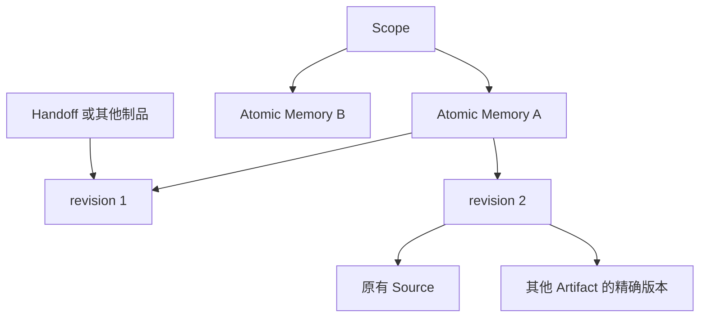

# Memory 到 Atomic Memory 的停服迁移总体方案

旧 Memory 集合在停服期间拆成独立的 Atomic Memory。每条 entry 的全部内容版本、直接 Source 和精确 Artifact 依据、当前权限迁入新模型；整集合引用先归档，再退出在线溯源。数据库内仍会使用的精确旧引用统一转换。完成迁移后，旧 Memory 从公共制品表移入专门归档表，旧 entry 专用表暂时保留；服务只使用 Atomic Memory，归档数据由后续版本清理。

本方案覆盖数据迁移和旧接口适配。Atomic Memory 的抽取、合并、恢复和检索行为沿用已有设计。具体转换规则见[详细设计](atomic-memory-clean-migration-design.md)。备份、停服、归档保留和后续清理遵循 [RFC 1771](https://github.com/oceanbase/powercontext/pull/1771) 的要求；数据转换由迁移命令自己执行，原因见第 8 节。

## 1. 迁移后的结构

下面是迁移写入的目标结构。`pc_atomic_memory_states` 和 `pc_atomic_memory_current` 已由 Atomic Memory 功能引入，迁移负责填充状态和重建当前投影，Owner 字段允许无鉴权部署留空。




| 数据                      | 迁移后的存放位置                                |
| ----------------------- | --------------------------------------- |
| 每条记忆的全部正文版本             | `pc_artifacts`，Family 为 `atomic-memory` |
| 当前正文版本                  | `pc_artifact_heads`                     |
| 保留的 Source 和 Artifact 依据 | 公共 lineage 表                            |
| 当前状态、合并去向和状态版本          | `pc_atomic_memory_states`               |
| 当前在役记忆的检索内容             | `pc_atomic_memory_current` 及后端所需的派生索引   |
| Owner、共享权限、标签           | 原有公共权限表和标签表，以 Atomic 为目标                |
| Source 消费进度、待处理任务       | 原有 cursor 和 supervisor 数据               |


Atomic Memory 接入公共授权，移除专属 security 模块及额外授权规则。Owner 与其他制品采用同一规则：未启用鉴权时，创建、修改、检索和抽取不要求 Owner，也不生成 `local-runtime` Owner；启用鉴权时执行公共规则。已有 entry Owner 迁移到对应 Atomic，不给缺少 Owner 的历史记录补造归属。

公共 Memory binding 原本就必须使用 `memory_entry` selector，唯一可授予角色是 `artifact.viewer`；Atomic 使用同一角色。所有合法 entry binding 自动迁移，保留 binding ID，只把 resource 改为对应 Atomic，并保留撤销、过期等状态。人工处理仅限三类损坏记录：完整旧数据中找不到目标 entry、selector 缺失或非法、角色不在原允许授予的列表中。撤销、过期本身不是异常。旧 access selector 请求统一不支持，因此旧 binding.create 幂等摘要保留为原请求的历史记录，不重算。revoke、replace 继续使用原 binding ID，其语义和幂等记录不变。

本次新增一张 `pc_memory_artifact_archive`，保存从公共制品表移出的旧 Memory 历史及必要元数据。它只用于离线核验和保留旧数据，不注册为制品，不参加查询、检索或生成。

迁移不增加旧版本别名、永久 ID 映射表或集合成员表。活动记录和业务载荷中的记忆引用统一使用 `ArtifactRef`，删除公共 `MemoryCitation` 类型以及 `pc_artifacts`、`pc_artifact_candidate_versions` 的 `memory_citations` 列。旧格式 decoder 只保留在离线冻结迁移资源中，业务代码不再引用 `MemoryCitation`。

终态 Dream 的旧请求快照，以及 Handoff 回执中引用整个集合、没有 Atomic 对应的不可用证据，写入显式无类型历史字段 `historical_data: JSONValue`；回执中引用单条 entry 的不可用证据转换为对应的 Atomic 引用，回执保持有效。它们不参与业务解析或重放，不以保留旧字节或运行时旧 decoder 维持兼容。旧 Memory 集合正文只供离线迁移解码；旧请求仅在 server 的少数入口作薄适配。

## 2. 一条旧 entry 如何迁移

一个 Scope 内可能有多个旧 Memory 集合，因此新 ID 使用完整身份生成：

```text
Atomic ID = 固定算法(Scope ID, 旧 Memory ID, entry ID)
Atomic revision = entry.version
```

旧 entry 同时有两个不同字段：`version` 是递增整数，例如 `3`；`entry_version_id` 是这一版的随机字符串标识，例如 `mem_ver_xxx`。新 revision 直接使用已有的数字版本号，不把随机串强行转换成数字，也不重新编号。

例如，旧集合 M 的第 20 版引用 entry E 的第 3 版：

```text
迁移前：M@20 → E，entry_version_id = mem_ver_xxx，version = 3
迁移后：Atomic E@3
```

E 的第 1、2、3 版都迁移。别的 entry 导致 M 从第 19 版变成第 20 版，不会给 E 额外增加一个版本。

精确旧引用包含集合 revision、entry ID 和随机 `entry_version_id`。迁移核验集合中的成员关系，再从旧版本表找到该行的整数 `version`，转换为同一 Atomic 内容版本的 `ArtifactRef`。因此迁移前对 E 第 3 版的点查，迁移后仍指向 Atomic E@3；即使当前 head 已更新到 E@4，也不会改变这个历史引用。按批查询即可建立临时对应关系，不需要新映射表。

查询最新内容时，在请求所属的 Scope 内，用旧 Memory ID 和 entry ID 计算 Atomic ID，不指定 revision，读取当前 head。它与精确版本查询分开。随机 `entry_version_id` 随旧表归档保留，迁移后不再支持用它在线查询历史。

旧条目 active、inactive 和已 compact 状态分别对应 active、forgotten 和 retired。旧停用操作没有合并去向，不能据此生成 `merged` 关系；已导入 Atomic 后发生的合并及其他状态变化继续保留。

## 3. 保留事实和证据，转换引用格式

迁移不调用模型重新提炼记忆。正文按原值复制，原有 Source 的身份、业务文字、已有时间和 journal position 保持不变。

新 Atomic 的每个历史版本直接引用该 entry 原有的 Source，Artifact 依据按下表转换。通过通用 Artifact create/replace 入口写入时，操作 Source 可能只挂在集合上，迁移核对操作类型和精确 target 后，补到受到该次操作影响的 entry 版本。直接调用 MemoryService 的历史可能没有这条 Source。若 entry 没有 Source、Artifact，也没有匹配的操作 Source，则新版本的 lineage 为空，这是合法情况，不补造 Source、时间或集合锚点。已有非空引用却无法解析时，另行报错。

数据库中仍会被解引用的精确旧引用转换为新引用；仅引用集合的记录单独处理：


| 旧引用                                 | 转换方式                     |
| ----------------------------------- | ------------------------ |
| 某个 entry 的精确版本                      | 指向对应 Atomic 的同一内容版本      |
| 真正引用整个旧集合的精确版本 | 归档完整来源、目标、位置及 ordinal 后删除 lineage 行，不展开成员或 Source |
| Handoff 正文里的 Memory citation，包括发布副本 | 转成普通 Artifact citation；正文变化时同步现有 `content_digest` |
| Experience 等制品的 `memory_citations`  | 转入普通 Artifact lineage    |
| Task Outcome 观察、检查结果中需要继续解析的证据 | 只转换实际旧引用，同步受影响的既有账本摘要 |


这些转换会改变引用的存储表示，以及直接依赖它的摘要，不重新生成制品。旧 Memory 本身不支持发布。Handoff 发布副本中的旧引用同样按来源 Scope 转换；Handoff 的身份、发布关系的来源地址和目标地址保持不变，相关发布摘要随正文转换一并更新。

Experience failure 中转换后的 `ArtifactRef` 沿用公共 ArtifactRef 的现有规则：该 failure 证据检查只确认引用对象存在，不新增 Atomic 状态或权限附加检查。业务入口的公共鉴权照常执行。

Dream 的运行记录保存了它生成的 Candidate ID。迁移据此查询候选的当前 head，再从批准结果找到对应 Artifact，按主键读取其各个 revision 的引用字段，只转换实际旧引用。终态 Dream 的旧请求快照迁入无类型历史字段，保留原始信息，只展示、不重放；仍由业务解析的 Work 内容（包括回执中的单条 entry 引用）转换为新引用。依赖旧 Memory、尚未完成的 Dream 任务在维护前处理完。这项定点处理不扫描全部候选、Experience 或 Skill 的正文，也不改写引用这些产物的下游制品 ID。

Dream 定点转换以外，仍需独立检查其他已知持久化引用字段，确认没有运行时依赖旧 Memory 的记录。该完整性检查只读取所需字段，不能用 Dream 的关联记录遍历代替。

精确 entry 引用保持同一事实和版本。对于真正的整集合依据，先将引用的完整来源、目标、存放位置和 ordinal 安全归档，再删除对应 lineage 行，不展开成集合成员或 Source。此举明确取消旧集合的在线溯源：旧 resolver 原本会沿 Memory 集合的来源继续追溯，迁移后不再提供这条路径。可从精确 entry 引用或 Handoff 正文恢复精确 citation 的记录仍按精确版本转换，不按整集合引用删除。

如果删除整集合引用会使某个历史条目失去全部依据，进而违反非空约束，预检须统计数量并列出具体 Scope、对象身份、版本和字段位置。原记录可能完全合法，不能把它当作损坏数据，也不能通过更新当前 head 解决旧版本的约束问题。Candidate 版本由维护者在决策文件中指定替换的精确 ArtifactRef，原值写入归档；Handoff statement 或已验证的 Work 条目出现此类情况时阻断升级，由维护者根据真实历史处理。`plan` 只读列出阻断项，决策文件未覆盖全部阻断的 Candidate 时停止升级。不为此新增 Handoff、Work 或 Candidate 历史条目变体，不伪造证据或更改原状态放行。终态 Dream 的 `historical_data` 转换照常执行。

只用于描述过去操作、不会被解引用的旧载荷，也须迁入显式无类型历史字段。例如，手工编辑 Source 中“当时编辑了哪个集合”的信息可以原样保存，但不再由运行时旧域模型解码或用于查找旧集合。

## 4. 停服迁移和后续清理

本次维护先保留完整旧数据，再完成新模型转换和公共表隔离。

| 阶段 | 工作 | 完成条件 |
| --- | --- | --- |
| 前置结构迁移 | 建立归档表，保留旧业务结构 | 归档结构可用 |
| A：归档并导入 | 先归档旧集合正文及元数据，再复制全部 entry 历史、依据、状态、权限和标签，生成当前投影 | 归档可核验，新记忆与旧 entry 完成对账 |
| B：转换引用 | 改写业务引用及直接依赖的摘要，将展示快照迁入无类型历史字段，归档并删除整集合 lineage，完成独立的引用完整性检查 | 业务记录使用新引用，历史快照只供展示，运行时不再依赖旧 Memory |
| 解除外键 | 再次核验 A、B 结果，解除两条旧集合外键 | 转换结果合格，两条外键已移除 |
| C：移出公共表 | 移除公共 Memory 正文、head 和关联元数据，删除两张公共表已清空的 `memory_citations` 列，完成最终核验 | 公共制品空间不再包含旧 Memory 和旧引用列，迁移可以放行 |
| 后续版本：清理归档 | 按保留窗口移除归档表、旧 entry 专用表及旧索引 | 已满足 RFC 1771 的清理条件 |

从前置结构迁移到 C 完成始终停服。A、B、C 是独立数据任务，大量复制、引用改写和 embedding 按批提交；B 转换核验通过后，先解除外键，再执行 C。新增归档结构、解除外键和删除旧列由迁移命令在对应步骤执行，完成状态由实际数据核验，不另建逐条搬运进度表。启动检查发现旧引用列仍在时拒绝启动，重新执行迁移命令即可补完剩余步骤。

直接解除 `entry_versions.created_in_revision`、`entry_heads.head_revision` 到 `pc_artifacts` 的外键，不新建指向归档表的外键；旧 head 到旧 version 的内部外键保持原样。归档只供离线保管和核验，在线业务没有归档依赖。

本次暂留 `memory` 调度 Family 和 `memory-source-window` binding 身份，以及关联的 cursor、pending、generation 和消费进度，不能随旧 Memory 表清理。旧调度名称的更名列入后续清理事项，须一并迁移这些调度状态，不能仅替换名称或清零重跑。

归档加上保留的旧版本表可以重建离线映射，因此中断重跑不依赖公共 Memory 行是否已经移出。新版启动检查公共版本及公共表隔离是否完成，不在启动时搬运或读取归档。

## 5. 旧 API 保留到什么程度

兼容仅保留在 server 的 `memory.get/list/search/remember/flush` 五个入口，只接受能够直接映射到新模型的请求，返回 Atomic 身份和版本。SDK 和 runtime 不保留旧 Memory 域模型；旧 ID 加 entry ID 的当前版本查询可在 server 薄适配层完成。


| 旧请求                                     | 迁移后的行为                              |
| --------------------------------------- | ----------------------------------- |
| `memory.list` 查询当前记忆列表                 | 查询当前 Scope 的 Atomic，仅适配可直接映射的过滤条件，使用新分页契约 |
| `memory.search` 搜索记忆                     | 调用 Atomic 检索，仅接受可直接映射的请求 |
| `memory.get` 提供旧 Memory ID 和 entry ID 查询最新内容 | 计算 Atomic ID，不指定 revision，读取当前 head |
| `memory.remember` 简单新增记忆                | 转为 Atomic 新增；旧对象证据和集合 CAS 不支持 |
| `memory.flush`                             | 进入 Atomic 的 Source 消费流程 |
| 使用旧 `entry_version_id` 查询历史             | 明确不支持，调用方改用迁移后的 ArtifactRef         |
| Generic Artifact 的所有 `family=memory` 入口 | 明确不支持，包括列表、读取和写入 |
| 旧 entry/collection tags、旧 ETag、access selector | 明确不支持，调用方使用 Atomic 身份和公共接口 |
| 旧集合版本、CAS、cursor、changes、capacity、compact 等其他旧入口 | 明确不支持 |


“查询当前集合”改成“查询 Scope 当前记忆”会改变多集合部署的查询范围，发布说明需明确这一变化；不伪造仍在递增的集合版本。精确历史读取使用带整数 revision 的 `ArtifactRef`，latest 读取不指定 revision。

数据库外保存的旧精确引用无法批量改写。迁移不为它们保留查询旧版本的运行时机制，发布说明必须说明这一点。

## 6. 需要接受的变化

- 全部 entry 内容历史保留；旧集合的 manifest、集合 revision、changes 和纯状态变化区间不再作为在线历史保留。当前遗忘或退休状态准确迁移。
- 真正的整集合引用归档后从 lineage 删除，取消经旧集合向其来源继续追溯的在线能力，不展开集合成员或 Source。
- Handoff、Source 等记录中的结构化引用可能改变；外部缓存的旧响应摘要和旧引用不能保证继续有效。
- 终态 Dream 等历史快照以无类型字段保留原始信息，只供展示，不再按旧请求模型解析或重放；回执中的单条 entry 引用转换为 Atomic 引用后继续有效。
- entry 标签迁到对应 Atomic。旧集合标签本来不由 entry 继承，保存在归档元数据中，不自动下发；如果选择下发，会扩大原来按标签检索 entry 的结果范围。
- 已有 Owner 按每条 entry 的既有关系迁移；未启用鉴权时允许没有 Owner，不默认赋给集合 Owner、迁移执行人或 `local-runtime`。
- 同一条 entry 的原始正文和来源不会因迁移重新生成。手工 Source 没有记录的时间，迁移后仍然未知。
- 数据库回退依赖升级前的完整备份；Atomic 的内容恢复接口不承担数据库降级。


## 7. 成本与边界

转换成本主要是读取 entry 历史、检查持久化引用，以及为当前在役记忆生成检索投影。Handoff 的引用嵌在正文里，当前没有能够定位全部引用的索引，需要读取相关历史正文。

Dream 的定位工作量取决于运行记录、关联候选和对应 Artifact 的版本数量，不直接由无关制品的总量决定。其他旧引用的字段检查独立计算成本，缺少引用索引时仍可能遍历全部相关行，但不读取无关正文。预检分别报告两部分的数据量，维护时长通过实际测量确定。

迁移后，新旧数据在保留期内仍会并存。公共制品表不再保留旧集合全量 manifest，正常读取也不再展开旧集合获取依据；归档和旧专用表仍占用空间，直到后续清理。Atomic 的历史正文继续保留。

预检分别报告版本缺失、Owner 冲突、违反原契约或损坏的 binding、无法解析的非空引用，以及尚未处理完的受影响任务，并清点需要归档后删除的整集合依据。删去唯一依据后违反非空约束的合法历史单独列为升级阻断项，附具体身份、版本和位置，不能归为损坏数据。未启用鉴权时缺少 Owner 不构成错误，原契约允许的空依据也不构成错误。阻断项处理完毕才可放行，不通过猜测身份、赋权或截断引用放行。

## 8. 实施前的依赖

RFC 1771 的迁移执行器目前只管理四张 Artifact 表的结构版本，不能运行数据转换任务。因此归档、导入、引用转换、解除外键、移出旧对象和删除旧引用列由 `atomic-memory-migrate` 命令自己执行，完成状态由实际数据核验，不新建 Atomic 私有控制表。删除旧引用列只有在引用转换验收后才成立，因此没有登记为公共结构修订。执行器以后支持数据任务时，可把其中的结构步骤登记为公共修订。

本次保留完整旧内容，只把共享表中的旧 Memory 隔离到归档表，旧专用表同步改为离线用途。发布清单登记归档对象、原位置、外键变化和恢复用途；后续独立版本再按保留窗口清理，不要求本次就物理删除旧历史。

实施前须排空受影响任务并处理预检阻断项。兼容范围遵循 [RFC 1809“升级与兼容”](../rfcs/1809-atomic-memory.md#升级与兼容)。实施包括离线冻结解码、业务引用和历史字段迁移、公共授权接入，以及 server 的有限适配。归档数据须安全离线保存，不提供在线读取，不用于接口兼容，也不能代替整库备份；数据库回退仍使用升级前的完整备份。
