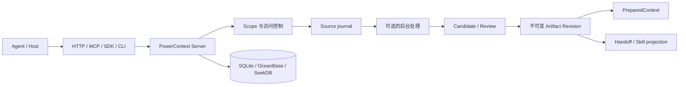

# 管理上下文的架构与职责

本页说明管理上下文时各组件负责什么，以及数据如何从证据流向可复用制品。它是跨工作流的架构说明；具体
写入、审核和检索步骤仍以各制品页面为准。

## 全景流程

完整的数据生命周期是：确定 Scope → 采集 Source → 按需处理 → 审核或直接提交 → 生成精确的不可变 Revision →
按需组装上下文、交接任务或导出宿主投影。服务可用性检查、故障排查和恢复不属于这条生命周期；请看[部署与运维](../operate/index.md)。

## 组件和职责边界

| 组件或角色 | 负责什么 | 不负责什么 |
| --- | --- | --- |
| Agent / Host | 提交请求，决定何时保存、交接或使用上下文 | 不因为召回内容而获得额外的执行权限 |
| HTTP、MCP、Python Client、CLI | 把不同集成投影到同一个 Server 契约 | 不应假设各集成暴露完全相同的能力 |
| PowerContext Server | 解析 Scope，执行访问控制，提供 Source、Artifact 和 PreparedContext API | 不替 Agent 做用户授权决定 |
| 后台 Runtime / Worker | 从符合条件的 Source 生成 Memory、Experience、Skill、Profile 或 Topic Memory | 不绕过 Candidate 审核，也不把生成结果当成执行指令 |
| Review / Projection | 审核 Candidate，或把精确的 approved Skill Revision 导出到宿主 | 不修改历史 Revision，不自动安装或执行 Skill |
| 数据库和持久化层 | 保存 Scope、Source、Artifact Revision 和处理状态 | 不替代部署层的备份与恢复策略 |

模型生成、人工审核和执行权限是三个独立边界：模型只能提出内容，审核才能决定是否提交 Artifact Revision，导出
只能创建宿主本地副本。`PreparedContext` 是一次 Agent turn 的临时结果，不是新的 Artifact。

## 当前支持的内容类型

| 类型 | 作用和当前生命周期 | 进入下一步的方式 |
| --- | --- | --- |
| Scope | 隔离 Source、制品、Candidate 和运行时状态，并承载访问策略 | 所有内容操作先解析 Scope |
| Source | 保存捕获证据或外部材料引用，是生成和审计的依据 | 显式读取，或由配置的 pipeline 异步处理 |
| Memory | 保存事实、决定、约束、状态和下一步；`retire` 退出 active recall 但保留历史 | 显式写入或从 Source 提取后检索 |
| Experience | 记录可复用的情境、行动、结果和经验 | proposal → Candidate → 审核 → approved Revision → PreparedContext recall |
| Skill | 保存可导出的名称、描述、instructions、校验和 lineage | proposal → Candidate → 审核 → 精确导出到宿主 |
| Profile | Scope 的稳定背景信息和 subject 画像 | 由 subject Source 或策略生成，可审核、替换和回滚为新 Revision |
| Topic Memory | 从长期 Source 增量提炼的主题摘要，支持渐进式 detail | `flush` 请求后台处理，`search` 找到当前 head，`get` 读取精确 Revision |
| Handoff | 记录任务边界、交接和里程碑 | prepare → 可选 commit → 接收方 acknowledgement / outcome |
| Prompt | Scope 级操作提示词配置，不是事实证据，也不进入普通 recall | 由具备 `scope.admin` 的调用方管理 |
| Tag | Memory、Experience、Skill、Handoff 的筛选元数据 | 通过标签 API 管理，不是 Artifact family |

写入型 Artifact family 的代码枚举是 `memory`、`experience`、`skill`、`handoff`、`profile`、`prompt`；读取
制品时还包含专用的 `topic-memory`。Topic Memory 目前没有通用的 create、update、delete 或 retire API。

## 数据治理与恢复的现状

当前实现提供以下数据一致性和边界能力：

- Scope 级访问控制，以及写入时的 `expected_version`、ETag / `If-Match` 等并发保护；
- Artifact 的不可变 Revision 和精确引用，Memory 的 `retire`，以及 Profile 通过追加 Revision 完成替换和回滚；
- Candidate 的 pending、approved、rejected 隔离，避免未审核内容进入 Artifact 检索或 `PreparedContext`。

当前没有通用的用户级 Artifact 删除、TTL/保留策略、导出/导入或一键 Scope 恢复 API；Topic Memory 也没有手工删除
接口。部署者可以按[部署 Server 的备份原则](../operate/deploy-server.md)备份数据库或数据目录，并按[故障排查与迁移](../operate/troubleshoot.md)
中的说明恢复或迁移。这些是运维职责，不应混入管理上下文的数据生命周期。

