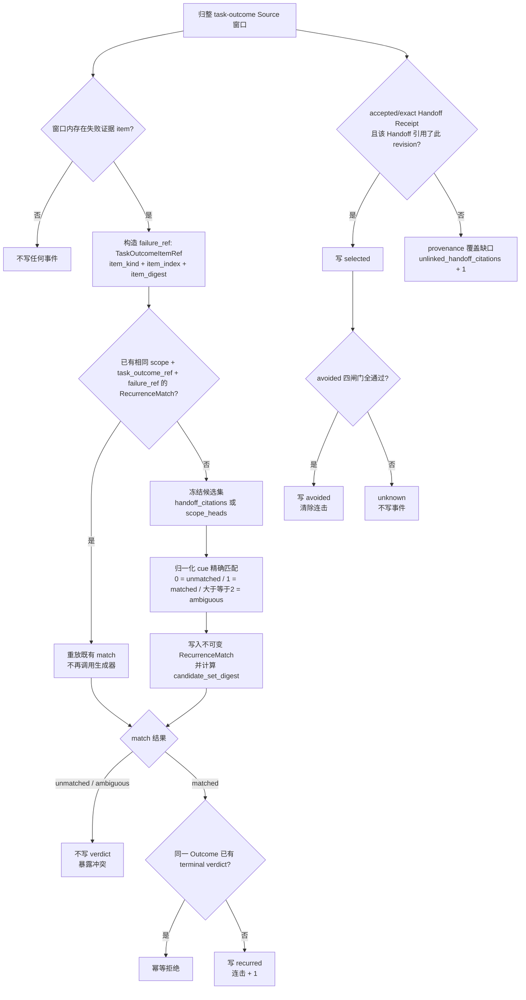
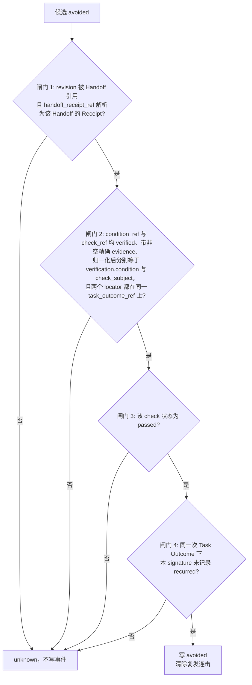
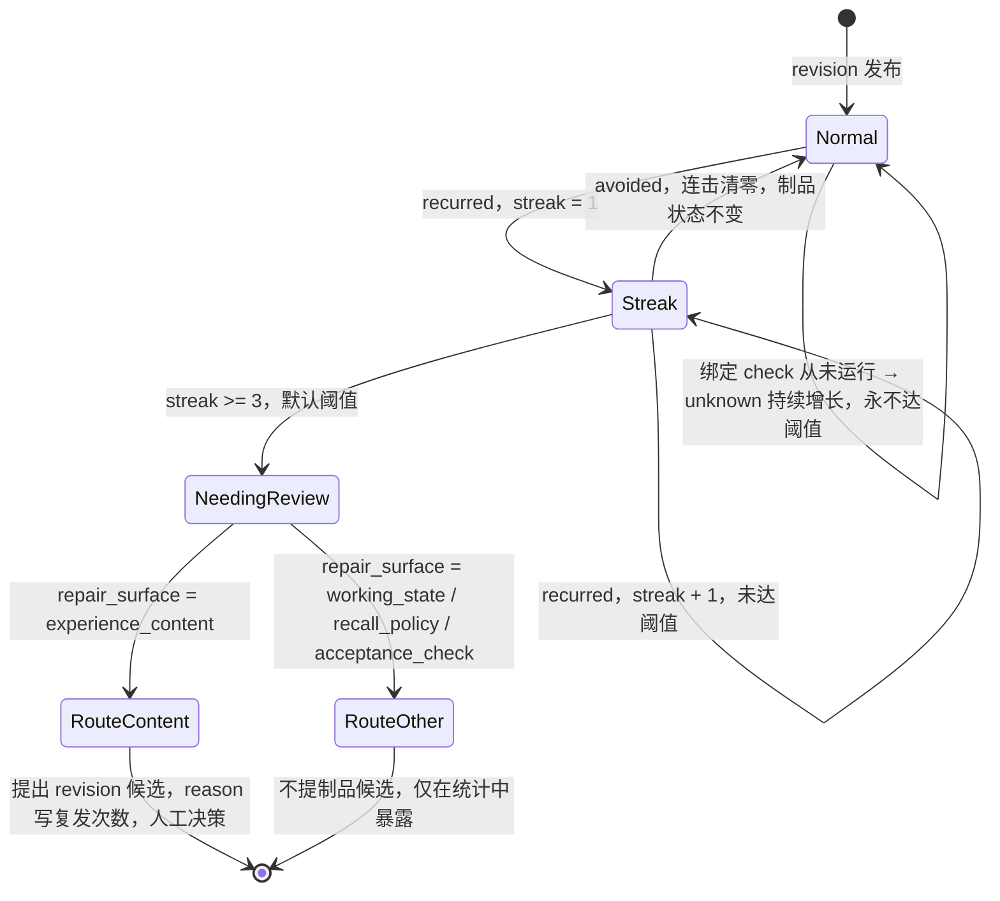

# PRD：反复失败修复（Recurring Failure Repair）

## 文档信息

| 项 | 内容 |
| --- | --- |
| 需求源 | [RFC 1557 反复失败修复](../rfcs/1557_recurring_failure_repair.md)（英文版 `docs/en/rfcs/1557_recurring_failure_repair.md`） |
| 关联 Issue | oceanbase/powercontext#1554（tracking）、RFC PR #1557 |
| 文档状态 | 实现基线 |
| 日期 | 2026-09-12 |
| 作者 | 许清楚（Product Manager） |
| Language | 中文（技术术语保留英文原文） |
| 技术栈 | Python 3.11+ / uv + Hatchling / pydantic / SQLAlchemy；契约真源 `openapi/powercontext.yaml` |
| 特性类型 | 后端记忆层特性，**无前端 UI**；本 PRD 以「数据结构草图 + 判定流程图」代替 UI 稿 |

## 原始需求复述

PowerContext 的 Experience（经验制品）回答"在什么情境下、什么动作产生了什么结果、学到了什么"，但没有任何东西回答它的后续问题：**"那个情境又出现了 —— 学到的东西起作用了吗？"**
本特性给反复出现的失败三样东西：

1. 一个**可机器匹配的身份**（failure signature / `recall_cue`）—— 让"这事以前发生过"成为可核查的陈述；
2. 一个**指明修复该触碰哪一层**的归因（`repair_surface`）—— 让"记录是对的，但召回从不触发它"成为可表达的诊断；
3. 一个**结果账本**（`selected` / `recurred` / `avoided`）—— 只凭正面证据记账，绝不从一次"没出事的任务"推断成功。

落点是扩展既有 `ExperienceContent`（新增可选 `failure` 块），**不新增 Artifact 家族**。

---

## 1. 产品目标

| # | 目标 | 解决什么 | 可度量信号 |
| --- | --- | --- | --- |
| G1 | **复发可计数**：给反复失败一个可机器匹配的身份 | 今天同一个失败换一种措辞就是一条新 Experience，复发无法计数，`lesson` 无法被证伪 | 同一 signature 的第二次出现产出 `recurred` 事件，而**不**产出新 Experience 候选 |
| G2 | **修复可路由**：`repair_surface` 指明修复该触碰哪一层 | 召回策略类缺陷今天只能写成散文，被伪装成"再写一条 lesson" | `recall_policy` / `working_state` / `acceptance_check` 类复发**不**产出制品变更候选，只在统计中暴露 |
| G3 | **账本只认正面证据**：三类事件 + 派生 `unknown`，读路径保持只读 | 「没出事的任务」今天会被当成"这条 lesson 帮上了忙"的证据 | `avoided` 必须同时满足四条闸门；任一闸门不满足 → `unknown` 且**不写事件** |
| G4 | **低产出记录变可见，不被停用**：复发连击触发 Review，人工决策强制 | 低价值记录今天不可辨识；但自动停用违反 RFC 0051 | 连击达阈值 → 该 revision 进入 needing review；**不存在**任何自动退休 / 衰减 / 评分路径 |
| G5 | **边界不变**：不新增家族、不改 Task Outcome / Handoff 公开契约、`prepare_context` 保持只读、既有 revision 加载兼容 | 避免把负面知识机制变成一次全仓改造 | 既有 Experience revision（无 `failure` 字段）无需迁移即可加载；`prepare` 路径无任何新增写库调用 |

---

## 2. 用户故事

| # | 用户故事 | 覆盖 RFC 场景 |
| --- | --- | --- |
| US-1 | 作为一个**编码 agent**，我希望同一个失败第二次出现时被识别为「复发」并记一笔 `recurred`，而不是再产出一条格式良好的新 lesson，这样我的上下文不会被三条近乎相同的记录塞满 | Motivation「当前无法计数复发」；完整示例 |
| US-2 | 作为一个**编码 agent**，当我再次修改 `openapi/powercontext.yaml` 时，我希望那条"改完契约必须重新生成代码"的记录被召回进 prepared context，并且这次召回被记成 `selected`，这样我能从统计里看到它到底进没进过上下文 | 流程第 2 步；账本写入路径 |
| US-3 | 作为一个**人类审阅者**，我希望看到某条 lesson 被选中多少次、复发多少次、真正 `avoided` 多少次，这样我能区分"起作用了"、"从没进过上下文"和"进过三次上下文但失败照旧" | Motivation 具体场景；读取面 |
| US-4 | 作为一个**人类审阅者**，我希望只有当我绑定的 check 真的**运行并通过**时才记 `avoided`，这样"一次没触发该 check 的成功任务"不会被算作成功证据 | `avoided` 四条闸门；`unknown` 纪律 |
| US-5 | 作为一个**编码 agent**，我希望失败记录明确说明修复该触碰哪一层（Experience 内容 / 工作态 / 召回策略 / 验收 check），这样当坏的是召回策略时，我不会去改文本 | Repair Surface 枚举；`experience_content` vs `recall_policy` 路由差异 |
| US-6 | 作为一个**召回策略维护者**，我希望 `recall_policy` 类复发在统计里可见且不产出制品候选，这样检索缺陷能被单独诊断，而不是被淹没在 lesson 修订里 | 降级与 Review 交互；完整示例第 4 步的对照分支 |
| US-7 | 作为一个**人类审阅者**，当某条记录连续复发达到阈值时，我希望它带「复发次数 + 失败观测证据」自动进入 Review Inbox，由我决定是打磨记录还是改 `repair_surface` | 复发连击 → needing review；Dream 模式（候选自动生成、人工决策强制） |
| US-8 | 作为一个**编码 agent**，当 `pytest` 因端口被占用反复失败时，我希望第二次起就匹配到既有记录并累计 `recurred`，而不是每周多一条相同 lesson | 可检查的最小证据案例（`O12-recurred`） |

---

## 3. 需求池

优先级定义：**P0 = 本轮必须交付（缺一项则特性不成立）**；**P1 = 本轮应当交付（读取面与降级闭环）**；**P2 = 提示类 / 可选增强**。

### 3.1 P0-A：数据模型与内容投影

| # | 需求（must） | RFC 条款 | 验收要点 |
| --- | --- | --- | --- |
| P0-1 | 定义 `RepairSurface = Literal["experience_content", "working_state", "recall_policy", "acceptance_check"]`，四值语义按 RFC 表格固定 | L113-124 / L240 | 枚举值与 RFC 表一一对应；`FailureRecord.repair_surface` 必填，无默认 |
| P0-2 | 定义 `FailureSignature`：`recall_cue`（必填，`min_length=1`，`max_length=MAX_FAILURE_CUE_LENGTH`）、`symptom: ExperienceText \| None = None` | L216-218 | cue 截断/超长被拒；symptom 省略合法 |
| P0-3 | 定义 `FailureVerification`：`condition: ExperienceText`（与 verified `WorkClaim.text` 归一化严格绑定）、`check_subject`（必填，限长 `MAX_FAILURE_CUE_LENGTH`） | L220-223 / L243-246 | 两字段必填；`FailureRecord` 内 `verification` 必填（不允许"没有 check 的记录"） |
| P0-4 | 定义 `FailureRecord`：`signature` / `repair_surface` / `verification` 全必填；`@model_validator(mode="after") reject_blank_cue` 拒绝纯空白 cue | L225-230 | 空白 cue 抛校验错；缺任一字段抛校验错 |
| P0-5 | `ExperienceContent` 新增可选字段 `failure: FailureRecord \| None = None`；**不引入 `schema_version`** | L232-238 / L248-249 | 既有 revision（无 `failure`）加载校验通过；新 revision 可携带 |
| P0-6 | 新增常量 `MAX_FAILURE_CUE_LENGTH = 512`，置于 `experience/models.py` 顶部，风格 `MAX_<FAMILY>_<FIELD>` | L241 | 与 `MAX_EXPERIENCE_FIELD_LENGTH = 8000` 并存，匹配键限长 512 |
| P0-7 | 引入 `_ArtifactValue`（共享位置，`extra="forbid", frozen=True`）与 `_ExperienceValue(_ArtifactValue)`；不可变集合统一用 `tuple[...]` | L216 类签名 + 仓库家族约定 | `FailureSignature` / `FailureVerification` / `FailureRecord` / `RecurrenceMatch` / `RecurrenceObservation` / `TaskOutcomeItemRef` 均继承之；见 Q8 决策 |
| P0-8 | **必须改 1**：`experience_search_text` 显式纳入 signature（`recall_cue`，以及存在时的 `symptom`）—— 否则 cue 不参与检索 | L251-253 | 以 cue 关键词检索能命中该 revision；投影仍只含用户书写字段，不含渲染标签 |
| P0-9 | **必须改 2**：`render_experience` 在 `failure` 存在时渲染 `Failure cue` 与 `Symptom` 行，否则记录可能被选中却无法被 agent 认出 | L251-253 | 渲染输出新增两行；`failure=None` 时输出与今天完全一致 |

### 3.2 P0-B：归一化与匹配策略

| # | 需求（must） | RFC 条款 | 验收要点 |
| --- | --- | --- | --- |
| P0-10 | 归一化函数（建议 `normalize_match_text`）：Unicode NFKC → 大小写折叠（casefold）→ 空白折叠 → 去除首尾标点。归一化值**只作比较辅助，不作为被存储的身份** | L282 | 全角/半角、大小写、多余空白、首尾标点差异不影响匹配；空串/纯标点输入被拒 |
| P0-11 | **精确匹配输入就是失败 item 本身**：`failure_ref.item_kind == "observation"` → 取 `WorkClaim.text`；`== "check"` → 取 `TaskCheck.name`。禁止把 `TaskCheck.details`、可选 `symptom`、Outcome 周边叙述作为匹配输入 | L283-287 | 仅改 `details` 不影响匹配；仅改 `name` 影响匹配 |
| P0-12 | 候选**资格集合**必须在调用生成器之前确定性计算：0 个 → `unmatched`，1 个 → `matched`，≥2 个 → `ambiguous` | L286-287 / L292-296 | 生成器最多提供解释文本，不得选择或覆盖结果（架构约束，需代码评审确认） |
| P0-13 | **匹配前冻结候选集**：有完整 Handoff/Task Outcome 链路 → `candidate_set_mode = "handoff_citations"`（只用该 Handoff 引用的精确 Experience revision）；无链路 → `"scope_heads"`（scope 内每个 Experience artifact 的当前 head，按 `ArtifactRef` 排序，已被替代的 revision 不参与）。模式与完整有序候选 ref 均持久化 | L288-291 / L374-375 | 后来发布的 revision **不**重定向历史复发；一条连击始终属于精确 revision |
| P0-14 | 持久化不可变 `RecurrenceMatch`：字段见 §4.2；唯一键 `(scope_id, task_outcome_ref, failure_ref)`；`failure_ref.task_outcome_ref == task_outcome_ref`；候选快照规范化后再算 `candidate_set_digest`；`matched` 要求 `artifact_ref` + `signature_key` 同时存在，`unmatched` / `ambiguous` 要求二者均为 `None` | L329-339 / L374-375 | 违反任一不变量在持久化前被拒 |
| P0-15 | **重放优先**：同一 `(task_outcome_ref, failure_ref)` 已存在 match 时，先解析它，**不得**再次调用生成器或重新选择 | L296 / L378 | 重放同一 Source 窗口不产生重复 match / event（回归测试） |
| P0-16 | 记录校验必须拒绝：target 不在冻结候选集内，或 target 的归一化 key 不等于该 revision `recall_cue` 的归一化值 | L296 | 构造两类非法 match，均被拒 |
| P0-17 | **模糊相似度绝不写账本**：token bigram 重叠度（阈值 0.8）仅产生提示，绝不写计数器、绝不静默增加复发计数 | L297-299 | 无模糊匹配写事件的代码路径 |
| P0-18 | `ambiguous` **不产生 verdict**：不写账本事件，并向外暴露该冲突 | L300 | 两候选同时合格 → 无事件、冲突可见 |
| P0-19 | **signature 不是全局身份**：记录身份仍是 `(artifact_id, revision)`；禁止内容派生的可变 id 作为账本键（修改记录必须保持为显式修订） | L301-302 | 修订产出新 revision，历史事件留在旧 revision 上 |

### 3.3 P0-C：结果账本与校验矩阵

| # | 需求（must） | RFC 条款 | 验收要点 |
| --- | --- | --- | --- |
| P0-20 | 新增 `TaskOutcomeItemRef`（`task_outcome_ref` / `item_kind` / `item_index >= 0` / `item_digest`）：它是账本内部 locator，必须在 `item_index` 处解析**不可变** Task Outcome 内容且 `item_digest` 匹配该 item 的规范序列化；不是虚构的 `TaskCheck` Source 身份 | L359-364 / L386-389 | digest 不符或 index 越界 → 解析失败，事件被拒 |
| P0-21 | 新增 `RecurrenceObservation`（字段见 §4.3），事件枚举 `Literal["selected", "recurred", "avoided"]`，`match_basis = Literal["exact"]` | L342-356 | 三类事件各自的必填/选填字段与 RFC 一致 |
| P0-22 | 实现 RFC **第 366-372 行校验矩阵**：进入持久化前拒绝所有"必须拒绝的组合" | L366-372 | 逐格建测试：无 receipt / receipt 非 accepted-exact / position 错误 / Handoff 未引用该 revision / 同键第二条 `selected` / declared 或无引用的 item / kind 错配 / 非 passed check / 同 signature+Outcome 已有 terminal verdict / 无匹配决策 / `ambiguous` 决策 / digest 无法解析 |
| P0-23 | `observation_id` 幂等键派生：事件类型 + 引用的 Task Outcome 及其不可变 journal position + Handoff/Receipt + 精确 artifact revision + 归一化 signature key + 适用时的规范 match digest + 每个适用 item locator（含其 digest） | L376-378 | 重放产生相同 `observation_id`，写入幂等 |
| P0-24 | **只追加 + 事务提交**；match 与事件在同一事务内提交；一个有完整链路的 Source 窗口对同一 `(scope_id, artifact_ref, signature_key, task_outcome_ref)` 只写一条 `selected`、最多一条 terminal verdict；无链路窗口**只允许**写 `recurred` 且绝不写 `avoided`；`(scope_id, artifact_ref, signature_key)` 是聚合索引而非唯一约束；任何内容不原地更新 | L374-384 | 重复写入被唯一约束拒绝；不同观测仍可追加 |
| P0-25 | `task_outcome_position` 必须等于 `task_outcome_ref` 解析出的 Source journal entry 且为正值；它是 verdict 唯一的顺序键（单 scope 内无并列） | L350 / L374-375 / L392-393 | 重放、延迟处理、墙上时钟都不改变连击顺序 |
| P0-26 | **写入路径纪律**：账本只由已经在消费 `task-outcome` Source 的归整流水线写入；`prepare_context` 与检索路径绝不写库（RFC 0028 / RFC 1489 的硬约束） | L304-311 | `prepare` 路径新增写库调用 = 阻塞缺陷 |
| P0-27 | **准入硬闸门**：候选若携带 `failure` 块，必须能解析到至少一个**专门为失败提供证据**的引用（父 Outcome 为 `failed`/`blocked` 且 verified + 非空精确 evidence 的 observation，或 verified + 非空精确 evidence 且 status ∈ {`failed`, `timed_out`, `unavailable`} 的 check）；`skipped` / `cancelled` / `unknown` 永不构成失败证据 | L259-265 / L390-391 | 无失败证据的 `failure` 块在候选校验阶段被拒；既有的"至少一条精确引用"是必要但不充分条件 |

### 3.4 P0-D：`avoided` 证据闸门与 `unknown` 纪律

| # | 需求（must） | RFC 条款 | 验收要点 |
| --- | --- | --- | --- |
| P0-28 | `avoided` 必须**同时**满足四条闸门：① 该 revision 被某 Handoff 引用，且 Task Outcome 的 `handoff_receipt_ref` 能解析为该精确 Handoff 的 Handoff Receipt；② `condition_ref` 解析到同一 Outcome 的 `observations[]` item，且该 item `basis="verified"`、带非空精确 evidence、归一化 `WorkClaim.text` 等于 `verification.condition`；`check_ref` 解析到同一 Outcome 的 `checks[]` item，且该 item `basis="verified"`、带非空精确 evidence、归一化 `TaskCheck.name` 等于 `verification.check_subject`；③ 该 check **通过**；④ 同一次 Task Outcome 下没有为本 signature 记录 `recurred` 事件 | L131-141 | 四条闸门逐条构造缺失用例，全部停在 `unknown` 且不写事件 |
| P0-29 | **证据缺失 = `unknown` 且不写事件**：一次已完成的 Task Outcome 本身不写任何事件；无法证明触发条件出现、或绑定 check 没有产出结果时保持 `unknown`。`unknown` 是**派生判定，不是账本事件**，只在有链路的观测范围内计算 | L143-148 / L393-395 | 账本中不出现 `unknown` 行；`unknown = 有链路 selected 数 − 同一 Outcome 下获得 terminal verdict 的数` |

### 3.5 P1：统计读取面、降级与 Review 路由、契约

| # | 需求（should） | RFC 条款 | 验收要点 |
| --- | --- | --- | --- |
| P1-1 | 新增 `RecurrenceStreak`（`artifact_ref` / `signature_key` / `terminal_recurred_streak`，非负、按 `task_outcome_position` 派生）与 `RecurrenceStatistics`（`selected` / `recurred` / `avoided` / `unknown` / `unlinked_handoff_citations` / `needing_review` / `top_revisions: tuple[...]`） | L426-440 | 字段与语义一致；`unknown` 与各项**并列上报**而非折叠 |
| P1-2 | `ScopeStatistics` 增加一个 `recurrence` 块（RFC 0072 统计层的天然归宿） | L415-423 | 每个 scope 独立统计；不新增 MCP 工具 |
| P1-3 | `unknown` 派生规则：某 revision 的 `selected` 事件数，减去在同一 Task Outcome 下获得了 `recurred` 或 `avoided` 的那些；**没有链路的 prepare 不进分母**，也不得解释为未选中 | L147-148 / L393-395 | 最小证据案例中 `O12-unknown` 计入 `unknown` |
| P1-4 | `unlinked_handoff_citations`：能看到 Handoff 引用却无法关联 Task Outcome 时，只报告为 **provenance 覆盖缺口**，不是 `selected` 事件、不是 `candidate_not_selected` 结果、不是 recall-policy 诊断；没有 Handoff 的 prepare 不产生遥测 | L201-202 / L419-420 | 缺口计数与 `selected` 计数互不相干 |
| P1-5 | `top_revisions` 排序：先按 `terminal_recurred_streak` 降序，再按 `(family, artifact_id, revision, signature_key)` 升序；部署配置的上限 N **在排序之后**才应用 | L439-445 | 排序稳定性测试；N 截断后结果一致 |
| P1-6 | 多 scope 的 `ScopedStats` 通过每一条 `by_scope` entry 返回各自 block，**不**把互相独立的 scope 合并成一条 streak | L445 | 两 scope 各有 streak，互不累加 |
| P1-7 | **复发连击 → needing review**：默认阈值 = 连续 3 次 terminal `recurred` verdict 且其间没有 terminal `avoided` verdict；verdict 严格按不可变 `task_outcome_position` 排序 | L399-401 | 重放/乱序不改变连击；达阈值该 revision 进入 needing review 计数 |
| P1-8 | **按 `repair_surface` 路由**：只有 `experience_content` 经既有 `CandidateRepository` 提出 Experience revision 候选（`reason` 写明复发次数，证据为同一次失败观测）；`working_state` / `recall_policy` / `acceptance_check` **不提出任何制品候选**，只记录并在统计中暴露 | L402-406 / L170-175 | `recall_policy` 场景下 Review Inbox 无新增候选 |
| P1-9 | `avoided` 事件清除连击但**不改变任何制品状态**——这是本特性引入的唯一自动转换 | L411 | 制品无 `state` 字段被新增；无自动退休/衰减/评分代码路径 |
| P1-10 | OpenAPI 契约：`ExperienceProposal` 增加**可选** failure 对象（纯加法）；`ScopeStats` 增加**必填** `recurrence` block（`RecurrenceStatistics` + 有界 `RecurrenceStreak` 行）；改完执行 `make api-generate` 与 `make contract-test` | L451 | 生成模型不得手改；contract-test 全绿；见 Q9 决策与破坏性评估 |

### 3.6 P2：提示类与可选增强

| # | 需求（could） | RFC 条款 | 说明 |
| --- | --- | --- | --- |
| P2-1 | **近似孪生只做提示、不拒绝**：归一化 cue 与既有记录近似重复（token bigram 重叠度 ≥ 0.8）时，候选带一条指明既有记录的警告返回，引导作者改为修订那条记录 | L271-275 / L297-299 | 硬约束「绝不写计数器」已在 P0-17 |
| P2-2 | 生成侧软提示：cue 必须命名可识别情境（不得复述 outcome 字段）、必须有 `repair_surface`、必须有可运行的 check —— 体现为 `prompts.py` 版本化指令（bump 版本号需同步）与候选 warnings，不做硬拒绝 | L266-270 | 硬校验由 P0-27 与 Review service 承担 |
| P2-3 | 可选统计维度：按 `repair_surface` 分组的复发分布，便于将来把 `recall_policy` 类复发路由到检索评测环路 | L531-532 / L543 | 本轮不接入评测环路（见 Out of Scope） |
| P2-4 | 评测 outcome 类别埋点：以不依赖 #1422 的方式定义本特性的 outcome 指标 | L457 | #1422 未落地，指标定义需自洽 |

---

## 4. 数据结构草图（代替 UI 稿）

### 4.1 Experience 内容侧模型

```
ExperienceContent(_ExperienceValue)
├── situation: ExperienceText              # 既有，不变
├── action:    ExperienceText              # 既有，不变
├── outcome:   ExperienceText              # 既有，不变
├── lesson:    ExperienceText              # 既有，不变
└── failure:   FailureRecord | None = None # 新增，可选 → 既有 revision 加载兼容

FailureRecord(_ExperienceValue)
├── signature:       FailureSignature        # 必填
├── repair_surface:  RepairSurface           # 必填，无默认
└── verification:    FailureVerification     # 必填（在 FailureRecord 内部必填）
    model_validator(mode="after"): reject_blank_cue

FailureSignature(_ExperienceValue)
├── recall_cue: Annotated[str, min_length=1, max_length=MAX_FAILURE_CUE_LENGTH=512]  # 匹配键
└── symptom:    ExperienceText | None = None

FailureVerification(_ExperienceValue)
├── condition:     ExperienceText                                     # 绑定 verified WorkClaim.text（归一化严格相等）
└── check_subject: Annotated[str, min_length=1, max_length=512]       # 绑定 verified TaskCheck.name（归一化严格相等）

RepairSurface = Literal["experience_content", "working_state", "recall_policy", "acceptance_check"]
```

| `repair_surface` 取值 | 修复必须改变 |
| --- | --- |
| `experience_content` | 当前 Experience revision 的 `situation` / `action` / `outcome` / `lesson` / `failure` 内容 |
| `working_state` | Handoff 的 `objective` / `state[]` / `next_action`，或被记录的 Task Outcome 字段 |
| `recall_policy` | Scope 召回配置、`prepare` 查询的构造方式，或 `assembly.sections` 的选择 |
| `acceptance_check` | Handoff 的 `disposition` / 验收标准，或挂在 Experience 或 Handoff 上的校验指令 |

### 4.2 匹配决策记录（只追加、不可变）

| 字段 | 类型 | 说明 |
| --- | --- | --- |
| `scope_id` | `str` | 作用域 |
| `task_outcome_ref` | `SourceRef` | 精确 Task Outcome Source |
| `task_outcome_position` | `int` | 对应不可变 Source journal position |
| `failure_ref` | `TaskOutcomeItemRef` | 失败 locator（observation 或 check） |
| `candidate_set_mode` | `Literal["handoff_citations", "scope_heads"]` | 冻结模式 |
| `candidate_refs` | `tuple[ArtifactRef, ...]` | **已排序**的精确快照，规范化后算 digest |
| `candidate_set_digest` | `str` | 候选集指纹 |
| `result` | `Literal["matched", "unmatched", "ambiguous"]` | 终态结果 |
| `artifact_ref` | `ArtifactRef \| None` | 仅 `matched` 时必填 |
| `signature_key` | `str \| None` | 仅 `matched` 时必填，从已存储 `recall_cue` 原样复制后归一化 |

唯一键：`(scope_id, task_outcome_ref, failure_ref)`；约束 `failure_ref.task_outcome_ref == task_outcome_ref`。

### 4.3 账本事件记录（只追加、不可变）

| 字段 | 类型 | `selected` | `recurred` | `avoided` |
| --- | --- | --- | --- | --- |
| `observation_id` | `str` | 必填（幂等键） | 必填 | 必填 |
| `scope_id` | `str` | 必填 | 必填 | 必填 |
| `artifact_ref` | `ArtifactRef` | 必填（精确 revision） | 必填 | 必填 |
| `signature_key` | `str` | 必填 | 必填 | 必填 |
| `event` | `Literal[...]` | `selected` | `recurred` | `avoided` |
| `match_basis` | `Literal["exact"]` | 必填 | 必填 | 必填 |
| `task_outcome_ref` / `task_outcome_position` | `SourceRef` / `int` | 必填（position 正值且等于 journal entry） | 必填 | 必填 |
| `handoff_receipt_ref` | `SourceRef \| None` | 必填（accepted / exact） | — | 必填 |
| `handoff_ref` | `ArtifactRef \| None` | 必填（选中如何推导出来） | — | 必填 |
| `condition_ref` | `TaskOutcomeItemRef \| None` | — | — | 必填（verified observation，归一化 text == `condition`） |
| `check_ref` | `TaskOutcomeItemRef \| None` | — | — | 必填（verified + passed check，归一化 name == `check_subject`） |
| `failure_ref` | `TaskOutcomeItemRef \| None` | — | 必填（唯一失败 item） | — |
| `recurrence_match_digest` | `str \| None` | — | 必填（冻结 match 的 digest） | — |

### 4.4 统计读取模型

| 字段 | 类型 | 语义 |
| --- | --- | --- |
| `selected` | `int` | 有完整 Handoff/Task Outcome 链路、被 Handoff 引用过的观测数 |
| `recurred` | `int` | 更晚 Task Outcome 报告了与该 signature 匹配的失败 |
| `avoided` | `int` | 风险情境再现 **且** 绑定 check 通过 |
| `unknown` | `int` | 派生：有链路 `selected` − 同一 Outcome 下获得 terminal verdict 的数量 |
| `unlinked_handoff_citations` | `int` | 仅为 provenance 覆盖率；无法关联 Task Outcome 的 Handoff 引用 |
| `needing_review` | `int` | 处于 needing review 的 Experience revision 数 |
| `top_revisions` | `tuple[RecurrenceStreak, ...]` | 排序后按部署配置上限 N 截断 |

### 4.5 账本写入与事件判定流程



### 4.6 `avoided` 四闸门判定



### 4.7 复发连击与 Review 路由



---

## 5. 设计决策与边界

RFC 第 522-537 行列出 7 条 Unresolved questions。以下默认决策定义本实现的边界；需要维护者确认的事项以约束或后续议题记录。

| # | 问题（RFC 出处） | 默认决策（本轮采用） | 需拍板 |
| --- | --- | --- | --- |
| Q1 | **落点**：扩展 `ExperienceContent` 还是分离独立 Artifact 家族（未决 1 / L473-481） | **扩展 `ExperienceContent`**，分离家族延后。理由：新增家族要动仓库元组、candidate 仓库、`BaseArtifactFamily`、标签、授权 profile、资源发现、Review 家族分支、OpenAPI、JS 与文档；且本记录形态本就是 Experience 加一个匹配键。触发重评的条件：若上线后 `failure` 块只被少数 revision 携带 | 否（沿用 RFC 默认，建议用户知悉） |
| Q2 | **`repair_surface` 放制品内还是 Review 注记**（未决 2） | **放进制品**（`FailureRecord.repair_surface` 必填）。理由：路由需要可查询、可随 revision 演进；放 Review 注记则无法被统计与流水线消费。Review 只负责确认与修订 | **是**（会影响制品内容形态） |
| Q3 | **阈值**：复发连击次数 / `MAX_FAILURE_CUE_LENGTH` / 0.8 重叠度（未决 3） | 连击 = **3**（常量化，允许部署配置覆盖）；`MAX_FAILURE_CUE_LENGTH` = **512**；近似重叠度 = **0.8**，且只提示。`top_revisions` 上限 N 由部署配置决定 | 否（实现决策，写入常量与配置） |
| Q4 | **`recall_policy` 类复发是否汇入检索评测环路**（未决 4） | **本轮不做**。只在统计视图暴露（P1-2 / P2-3）。检索评测环路需要 #1422 与独立 RFC | 否（登记为后续） |
| Q5 | **账本归属**：新增只追加持久化记录，还是扩展统计层（未决 5） | **新增只追加持久化记录**（新表 `recurrence_match` / `recurrence_observation`，参照 `receipt_migration.py` / `processing_migration.py` 的既有迁移与事务风格）。理由：账本需要 `observation_id` 幂等键、唯一约束、按 artifact revision 粒度重放、绝不原地更新；统计层（RFC 0072 仓库）只做读取聚合，不承载事件 | **建议架构师确认**（一次即可） |
| Q6 | **命名**：是否避开 `Trigger`（未决 6） | **沿用 RFC 命名**：`recall_cue` / `FailureSignature` / `repair_surface`，避开 RFC 0001/0002 保留的 `Trigger` 产品级概念 | **是**（在生成公开 schema 前确认一次） |
| Q7 | **`avoided` 是否属于 #1422** 作为通用按制品 outcome 信号（未决 7） | **本轮作为特性专用计数器**存于 `RecurrenceObservation`，不并入 #1422（后者未落地）。未来若 #1422 定义通用信号，再做一次迁移 | 否（登记为后续） |
| Q8 | **基类位置与 `ExperienceContent` 是否变 frozen / extra=forbid**（实现决策） | `_ArtifactValue` 放 `src/powercontext/artifacts/models.py`（与 `ArtifactRef` 同处，是共享 artifact 模型模块）；`_ExperienceValue` 放 `experience/models.py` 并继承它；`ExperienceContent` 本轮升级为继承 `_ExperienceValue`（`frozen=True, extra="forbid"`），与 handoff 等家族约定一致。**兼容性**：JSON 持久化 + 可选字段 ⇒ 既有 revision 加载兼容；唯一风险是存在"构造后修改字段"的调用点，需实现前全量扫描 | **是 / 需架构师实现前确认**（若有阻力，退路是 `ExperienceContent` 单独保留非 frozen，但不建议） |
| Q9 | **本轮是否动 OpenAPI**（`ScopeStats.recurrence` 必填会破坏兼容吗） | **动，但分两步提交**：① `ExperienceProposal` 增加可选 `failure` 对象 —— 纯加法、非破坏；② `ScopeStats` 增加必填 `recurrence` block —— **属于破坏性变更**（response 新增必填字段，严格校验的旧客户端可能拒绝未知属性，因为 schema 声明了 `additionalProperties: false`）。可接受理由：统计响应由服务端产生，Python 与 JS 绑定都由同一份 `openapi/powercontext.yaml` 生成（`src/powercontext/http/_generated/`、`js-api-generate` 生成的 JS operations 表），仓库内不存在独立版本化的 client 包，因此不存在跨版本 wire 兼容承诺；且必填才能避免"可选但永远为 null"的模糊。缓解措施：PR 明确标注 breaking、同步更新 `website/` 文档、`make api-generate` + `make contract-test`（含 `tests/test_api_contract.py` 与 `tests/test_js_operations.py`）全绿 | **是**（公开契约变更需用户拍板） |
| Q10 | **归整流水线如何集成**：新建模块还是并入 `incubation.py` | **新建 `experience/recurrence.py`** 承载归一化 / 冻结候选集 / `RecurrenceMatch` / 事件判定；`incubation.py` 只保留薄钩子（在既有窗口处理中调用），避免把 `EXPERIENCE_INCUBATION_WINDOW_LIMIT = 32` 的窗口语义与账本语义耦合。常量、`__all__` 按字母序维护；`prompts.py` 指令改动同步 bump 版本号 | 否（架构决策） |
| Q11 | 是否新增不可变 Source kind 记录匹配/近似重复 | **不新增**（RFC L276 明确：第一版不为两者新增不可变 Source kind） | 否 |

---

## 6. 明确不在本轮范围（Out of Scope）

| 不在范围 | 原因 |
| --- | --- |
| **自动退休 / 衰减 / 停用 / 重要度评分** | RFC 0051 明确禁止（"this RFC adds no automatic retirement or time decay"）；Artifact 无 `state` 字段，Experience 无 active/inactive 概念。低产出记录只被**变可见**，真正的退休语义需要独立 RFC |
| **`candidate_not_selected` 事件** | `prepare` 必须保持完全只读；因字节预算或排序未进入上下文的候选不是负向结果 |
| **独立 Artifact 家族** | Q1 决策：延后到具体案例跑通后再评估 |
| **跨 Scope 的失败模式**（signature 从个人资产晋升为团队资产） | RFC Future possibilities，需要额外聚合与晋升流程 |
| **signature 驱动的检索 / `SearchMemoryRequest` 家族过滤** | 今天检索只按 tag 过滤；属于 Future possibilities |
| **新增 MCP 工具** | RFC L423 明确：不新增 MCP 工具 |
| **`recall_policy` 类复发汇入检索评测环路** | Q4 决策：本轮只做统计视图 |
| **新增 `schema_version` / Artifact schema 版本机制** | RFC L249：为单个可选字段引入会产生第二套版本机制 |
| **给 TaskCheck / WorkClaim 引入稳定 item id** | RFC L453：若改为每项稳定 ID 属于 OpenAPI / model / generated contract 改动，必须另行规定。本轮用 `TaskOutcomeItemRef`（ref + kind + index + digest） |
| **喂给 Skill 校验、Handoff 集成（把 signature 带入 `HandoffContent.state` / `omissions`）** | RFC Future possibilities |
| **多条候选证据 item 的自动择优** | RFC L382-383：多个候选证据 item 让 verdict 保持歧义与 `unknown`，绝不让一条 Task Outcome 膨胀 recurrence streak |
| **内容派生的可变卡片 id / 原地编辑记录** | 与不可变 revision 不兼容；修改记录必须保持为显式修订 |

---

## 7. 验收与测试映射

以 RFC《可检查的最小证据案例》（L178-207）为验收基线：

| 场景 | 期望 | 建议位置 |
| --- | --- | --- |
| `E7` + `H12` + `R12`（accepted / exact / evidence available）+ 三条 Outcome | 三条完整链路各写一条 `selected` | `tests/` 行为测试 |
| `O12-pass`：condition 与 check 均 verified、归一化同名、check passed | 写 `avoided`；连击清零 | `tests/` |
| `O12-recurred`：失败 check 归一化 name == `recall_cue`，`candidate_set_mode = "handoff_citations"`，唯一候选 `E7` | 写 `recurred`（**不是** `avoided`）；重放不得再次调用生成器 | `tests/` |
| `O12-unknown`：check 未运行或仅 `basis="declared"` | 不写判定事件，计入 `unknown` | `tests/` |
| 无 Handoff/Task Outcome 链路的 prepare | 不写 `selected`、不进 `unknown` 分母；有 Handoff 无 Outcome 只报 provenance 缺口 | `tests/` |
| Revision 2 发布后，无链路窗口在 `scope_heads` 下只快照 revision 2 | 历史 revision-1 的 match 不变；连击不跨 revision 边界 | `tests/` |
| 重放任一 Source 窗口 | 无重复 match / event；`E7` 的两条不同链路仍是两次独立观测 | `tests/e2e/` |
| 端到端：agent 反复改 openapi 忘记重新生成、pytest 端口占用反复失败 | 第二次起识别为复发；达阈值进入 needing review；`experience_content` 才提候选 | `tests/e2e/` |

测试纪律遵循 `AGENTS.md`：保护可观察行为，**不冻结实现细节**（导入图、模块归属、私有调用顺序、调用次数、缓冲区大小）；只在表达外部预算或幂等保证时才断言这些。

---

## 8. 影响面与交付清单

| 影响面 | 影响 | 是否本轮 |
| --- | --- | --- |
| `openapi/powercontext.yaml` | `ExperienceProposal` 增加可选对象；`ScopeStats` 增加必填 `RecurrenceStatistics` block；更新生成 Python models 与生成 client | 是（Q9 分两步） |
| 持久化 | 新增只追加表 `recurrence_match` / `recurrence_observation`，持久化不可变 `TaskOutcomeItemRef`；唯一约束与事务写入随迁移落地 | 是（P0） |
| Task Outcome / Handoff 公开契约 | **不变**：账本按 accepted/exact receipt、index、digest 与既有 verified evidence 重放不可变 Source 内容 | 否 |
| Review 契约 | **不变**；复发候选沿用既有 `propose_experience` 形态与 `CandidateRepository` | 否 |
| 检索（`prepare`） | **保持只读、不变**；cue 通过成为内容投影的一部分而被索引 | 否 |
| 标签、授权 profile、artifact 资源发现 | 不受影响（无新增家族） | 否 |
| 评测 | 新增一个 outcome 类别（P2-4），不依赖 #1422 | P2 |
| 文档 | `website/` 内容若展示 statistics response 需同步更新 | 是（随 P1-10） |

**交付检查清单**：`make test` 通过 → `make check`（Ruff 120 行宽、`ty check`）通过 → `make api-generate` → `make contract-test` → `tox`（3.11-3.14）→ PR 关联 Issue #1554 与 RFC #1557、说明破坏性变更、附 AI 使用声明。
