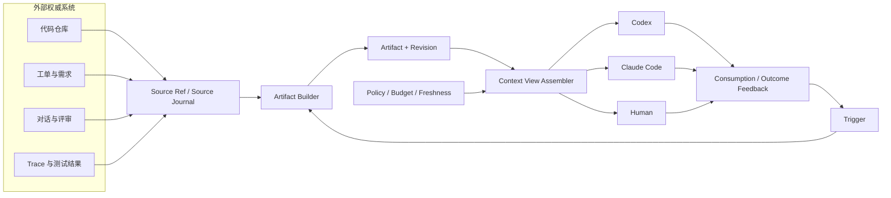
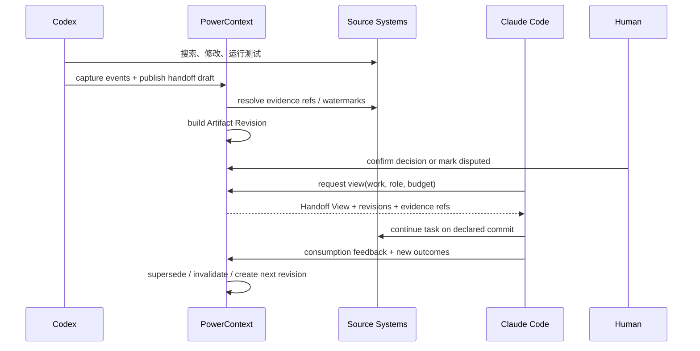
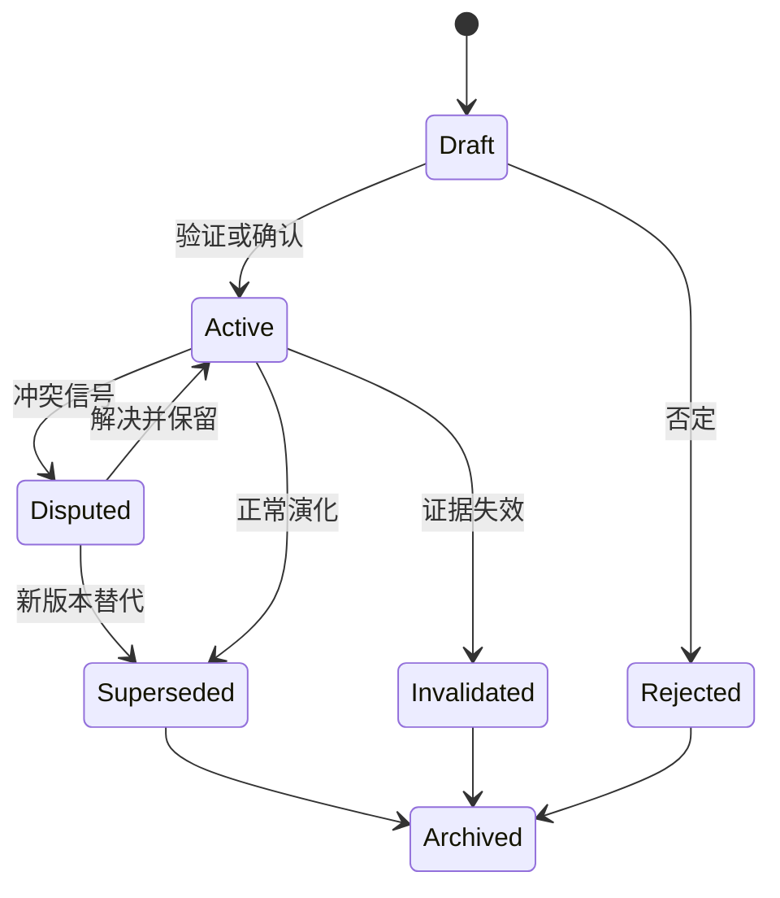
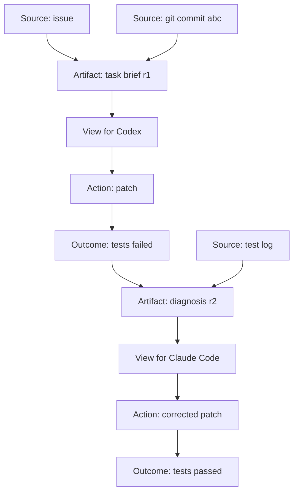

# 面向异构多 Agent 协同的 Context Runtime

## 研究框架、系统设计与评测方法

**版本：** 2026-07-28

**状态：** 研究与工程设计基线

**适用项目：** PowerContext

---

## 执行摘要

今天的 Coding Agent 已经能够搜索代码、调用工具、修改文件和运行测试，但“上下文窗口更长”并不自动等于“长任务做得更好”。当任务跨越多个会话、多个代码区域、多个参与者，尤其跨越 Codex、Claude Code 等异构 Agent 时，系统面对的至少是五个不同问题：

1. **容量**：信息能否装进模型窗口；
2. **选择**：当前步骤真正需要哪些信息；
3. **时效**：信息是否仍然有效；
4. **一致性**：不同 Agent 是否基于兼容的事实和版本工作；
5. **可追溯性**：结论从哪里来、由谁产生、后来如何变化。

现有 Agent 往往把这些问题压缩成一次 Prompt 组装：搜索若干文件，拼接历史消息，必要时做摘要，然后继续推理。这种方式对单次短任务有效，但在长期、多 Agent 协同中容易出现上下文分裂、重复探索、过期读取、错误传播和隐式冲突。问题的核心不只是“记不住”，而是缺少一层负责上下文生命周期和交接语义的运行基础设施。

本文提出一个可验证的研究假设：

> 多 Agent 长任务可以被建模为围绕共享工作状态进行的、受治理的上下文读取与写入；Context 不应只是 Prompt 的临时附件，而应成为具有来源、版本、权限、生命周期和可观测性的运行时对象。

这不是说所有内容都必须进入知识图谱，也不是要求不同 Agent 共享完整内部状态。更可行的工程边界是：

- 外部系统继续拥有原始代码、工单、文档、对话和遥测；
- Context Runtime 保存它们的引用、派生关系和可交接制品；
- 每个 Agent 只获得与当前任务、角色和权限匹配的 Context View；
- Agent 通过显式事件反馈自己读取、引用、修改或否定了哪些上下文；
- 跨 Agent 交接通过带版本和证据的 Handoff Artifact 完成，而不是复制整段聊天记录。

这一思路与 PowerContext 当前的产品定义相容。PowerContext 已经把产品中心放在“人和 Agent 共同推进的工作能否被理解、接手和继续”，并以 Source、Artifact、Trigger 和 Handoff Context 组织能力。本文建议在此基础上扩展 Revision、Context View、Policy、Consumption Feedback 和 Observability，而不是另建一个与现有产品竞争的“多 Agent 记忆系统”。

本文的主要结论是：

- **不存在一个公开 Benchmark 可以单独验证“异构多 Agent 共享上下文基础设施”。** SWE-bench Verified 能提供行业可比的最终结果，ContextBench 能测代码上下文检索过程，SWE-EVO 能增加长周期压力，MultiAgentBench 等能测协同协议，但它们覆盖的是不同切面。
- **评测必须分层。** 至少同时测任务结果、上下文质量、协作效率、运行成本和鲁棒性，并用消融实验区分“多 Agent 本身”与“Context Runtime”带来的收益。
- **可观测性应先于复杂自动化。** MVP 首先要能回答某段上下文从哪里来、被谁看到、是否过期、是否被引用、交接后是否减少重复工作；不应一开始就承诺自动合并所有冲突。
- **Context Graph 是候选实现，不是产品前提。** 近期可以用事件日志、版本化 Artifact 和明确引用建立相同语义，等数据证明图查询或多父版本确有价值后再引入完整图模型。
- **跨 Codex 与 Claude Code 的可行公共边界是文件、MCP、Hooks、CLI/SDK 与外部服务。** 不应假设可以读取宿主的隐藏 Prompt、导出登录凭证或复制完整内部推理状态。

建议 PowerContext 用 0–3 个月完成可追溯 Handoff 与基础遥测闭环，用 3–6 个月加入检索、失效和冲突检测，用 6–12 个月再验证图结构、半自动合并和团队治理。论文方向则优先从“上下文交接质量如何测量”和“哪些上下文机制在长任务中真正产生增益”切入，而不是先声称发明了通用共享世界模型。

---

## 1. 问题定义：长窗口不是 Context Runtime

### 1.1 Context Window 解决的是容量上限

上下文窗口回答的是一个必要但不充分的问题：一次模型调用最多可以接收多少 Token。真实 Agent 系统还需要决定：

- 哪些内容进入窗口；
- 以原文、摘要、引用还是结构化状态进入；
- 哪些旧信息要被替换或标记失效；
- 哪些内容只能对某个 Agent、角色或任务可见；
- 一次调用结束后，哪些判断值得进入后续工作。

把更多历史无差别塞入窗口会增加成本，也会带来噪声和版本混杂。即使目标证据已在窗口内，模型也可能没有使用它；反过来，模型读取过正确文件也不意味着最终修改真正依据了这些内容。ContextBench 正是因为最终 Pass/Fail 难以解释检索过程，才引入带人工标注 gold context 的过程评估，测量 Agent 探索和利用代码上下文的差异（[ContextBench 论文](https://arxiv.org/abs/2602.05892)）。

因此，至少要把以下概念分开：

| 概念 | 核心问题 | 典型失败 |
| --- | --- | --- |
| Context capacity | 能装多少 | 截断、压缩过度 |
| Context selection | 应该给什么 | 漏召回、噪声过多 |
| Context freshness | 是否仍有效 | 使用旧接口、旧计划 |
| Context consistency | 多方认知是否兼容 | Agent 基于不同版本开发 |
| Context provenance | 结论从何而来 | 无法验证摘要或决策 |
| Context handoff | 接手者能否继续 | 重做探索、丢失未决事项 |

### 1.2 从对话历史转向工作状态

对话历史记录“说过什么”，但长任务真正需要继承的是“工作现在处于什么状态”。两者并不等价。

一段高质量交接通常需要：

- 目标与验收标准；
- 已完成工作；
- 关键决策及理由；
- 当前代码或数据版本；
- 已验证证据；
- 已知失败与排除项；
- 未决问题；
- 下一步行动；
- 权限、风险和敏感信息边界。

这些内容可能散落在聊天、代码、测试结果、工单和人的判断中。简单对话摘要容易丢失出处，也可能把早期猜测误写成最终结论。Context Runtime 的职责不是替代这些系统，而是把它们组织成可接手、可验证、可继续维护的视图。

### 1.3 多 Agent 将问题变成分布式共享状态

单 Agent 的典型问题是上下文增长。多 Agent 的新增问题是上下文分裂：

- Agent A 读到了接口的新版本，Agent B 仍按旧版本实现；
- Agent A 已排除一个方案，Agent C 又从头尝试；
- 测试 Agent 发现了缺陷，但 Planner 的任务状态仍显示“完成”；
- 摘要把“可能原因”写成“已确认原因”，错误随后被多个 Agent 放大；
- 一个 Agent 看到了敏感数据，另一个 Agent 的 Handoff 不应继承它。

这与分布式系统中的副本、版本、冲突和传播延迟有相似性，但不能机械套用强一致数据库模型。Agent 处理的是带语义、置信度和权限的工作材料；不同角色本来就应该拥有不同视图。更准确的目标是：

> 在允许视图差异的前提下，让关键事实、决策、依赖和未决问题具有可追溯的一致性。

---

## 2. 多 Agent 上下文失效模式

### 2.1 上下文分裂（Fragmentation）

每个 Agent 在本地会话内形成自己的任务理解，但没有稳定的共享制品。信息只能通过自然语言消息临时传递，导致事实、计划和证据被拆散。

**可观测信号：**

- 同一 `work_id` 下存在多个互不引用的任务摘要；
- 多个 Agent 分别读取相同文件却没有共享引用；
- 子任务完成后没有生成 Handoff Artifact。

### 2.2 上下文漂移（Drift）

Agent 对同一事实的表述随时间或传播发生变化。漂移既可能来自真实更新，也可能来自摘要损失和错误推断，因此不能把“不一致”一律当作错误。

**需要区分：**

- 合法演化：代码或需求已经更新；
- 视图差异：角色权限或任务范围不同；
- 语义损失：转述时遗漏条件；
- 冲突事实：同一版本上出现互斥判断。

### 2.3 重复探索（Redundant Exploration）

多个 Agent 重复搜索、读取、试验或排除同一条路径。一定程度的独立复核有价值，但无意识重复会显著增加时间和 Token。

**判断关键：** 重复不等于浪费。系统需要标记该重复是“独立验证”“复现失败”还是“未知已有工作”。

### 2.4 过期读取（Stale Read）

Agent 使用了已被新 Revision 取代的上下文，却没有收到失效提示。例如接口签名已经变化，旧 Handoff 仍被召回。

**需要记录：**

- Artifact Revision；
- 适用代码 commit 或 Source watermark；
- `valid_from`、`valid_until`；
- `supersedes` 关系；
- 读取时的新鲜度判断。

### 2.5 错误传播（Error Propagation）

一个未经验证的推测进入共享上下文后，被后续 Agent 当作事实使用。传播次数越多，语言表达可能越确定。

**工程对策：**

- 区分 observation、hypothesis、decision、verified_result；
- 关键结论必须带 Evidence Ref；
- 未验证内容默认不升级为团队长期 Artifact；
- 允许后续 Agent 显式否定并建立 supersession。

### 2.6 隐式冲突（Implicit Conflict）

两个 Artifact 没有文本重叠，却在约束或行动层面冲突。例如一个决策要求同步 API，另一个实现计划假定异步事件。

纯向量相似度难以可靠发现这种冲突。近期应先从结构化键、共同依赖和显式声明入手，再把 LLM 冲突判断作为候选提示，而不是自动裁决。

### 2.7 过度共享与权限泄露

“共享更多”不是默认正确。不同 Agent 可能运行在不同信任域、模型供应商或数据权限下。Runtime 必须让 Source 与 Artifact 的可见范围可计算，而不是把权限控制留给最终 Prompt。

**最低要求：**

- Source 继承原系统访问边界；
- Artifact 不得自动扩大可见范围；
- 派生摘要继承最严格的上游敏感级别，除非经过明确脱敏；
- Trace 默认记录标识和哈希，不记录完整 Prompt、工具参数和内容正文。

---

## 3. 设计原则

### 原则一：工作是中心对象

PowerContext 的中心不是孤立 Memory，也不是全量 Trace，而是人和 Agent 围绕目标推进的 Work。所有 Source、Artifact、View 和 Trigger 都应能回答：它是否帮助后续参与者理解和接手这段工作？

### 原则二：原始系统保持权威

代码仓库、工单、语雀、Slack、测试平台和遥测系统继续保存原始内容。PowerContext 保存 Source Ref、必要索引、派生制品和证据关系，不成为另一个无边界数据湖。

### 原则三：共享 Artifact，不共享隐藏状态

异构 Agent 不需要共享内部 Chain-of-Thought、系统 Prompt、登录 Token 或完整会话缓存。可移植对象应是：

- 明确的任务状态；
- 结构化 Handoff；
- 可引用的证据；
- 版本化 Artifact；
- 公开工具协议；
- 必要且受控的摘要。

### 原则四：View 是按需投影

Runtime 拥有完整的可治理索引，但每个 Agent 只获得当前任务所需的 View。View 由任务、角色、权限、预算、新鲜度和证据质量共同决定。

### 原则五：先观测，再自动优化

在不知道上下文在哪里丢失、重复或污染之前，自动压缩、自动合并和自动写入长期记忆都难以验证。第一阶段先建立事件、血缘和反馈，再决定自动化策略。

### 原则六：影响是待估计量，不是直接事实

系统能直接观测 Agent 读取了什么、引用了什么、提交了什么；但“某段上下文真正导致了模型的某个决策”通常不可直接观测。应把影响分成证据等级，而不是输出一个伪精确的“上下文贡献率”。

---

## 4. Context Runtime 核心模型

### 4.1 与 PowerContext 现有模型的关系

PowerContext 当前 RFC 已定义：

- **Work**：人和 Agent 围绕目标共同推进的任务、判断和状态变化；
- **Source**：外部工作材料的引用和证据；
- **Artifact**：可被后续理解、使用和维护的上下文产物；
- **Trigger**：影响 Artifact 生命周期和演进的外部信号；
- **Handoff Context**：面向接手者、组织“发生了什么—做过什么判断—当前状态—下一步”的视图。

详见 [产品定义与构想 RFC](../rfcs/0001_product_definition_and_vision.md) 和 [Memory Layer RFC](../rfcs/0014_memory_layer_design.md)。

本文建议增加的不是另一套一级概念，而是五类运行语义：

1. **Revision**：Artifact 的不可变版本；
2. **Context View**：针对消费者装配的上下文投影；
3. **Evidence Link**：结论到 Source/Artifact 的可追溯关系；
4. **Policy Decision**：读取、派生和投影时的权限与保留判断；
5. **Consumption Feedback**：Agent 对上下文的读取、引用、接受、拒绝和纠错。

### 4.2 概念关系



### 4.3 Context Item 建议字段

Context Item 是 Artifact Revision 内部可寻址的最小治理单元，不必一开始暴露为公共 API。建议包含：

| 字段 | 作用 |
| --- | --- |
| `item_id` | 稳定逻辑标识 |
| `revision_id` | 当前不可变版本 |
| `kind` | observation / hypothesis / decision / constraint / result / next_action |
| `summary` | 面向检索与展示的短表达 |
| `payload_ref` | 原文或结构化正文位置 |
| `source_refs` | 上游 Source 或 Artifact 证据 |
| `work_id` | 所属工作 |
| `producer` | 人、Agent、工具或规则 |
| `created_at` | 产生时间 |
| `valid_from` / `valid_until` | 有效时间范围 |
| `applies_to` | commit、分支、模块、任务或环境 |
| `status` | active / superseded / disputed / invalidated / archived |
| `parents` | 派生或合并父版本 |
| `confidence` | 生产者声明或验证等级，不等于概率真值 |
| `sensitivity` | 敏感级别与传播限制 |
| `supersedes` | 被当前条目替代的旧项 |

### 4.4 Handoff Artifact 建议结构

```yaml
work:
  id: work-123
  goal: "完成跨 Agent 上下文检索原型"
  acceptance:
    - "Codex 与 Claude Code 能读取同一版本化 Handoff"
state:
  status: in_progress
  source_watermark: "git:abc123"
  produced_at: "2026-07-28T14:00:00+08:00"
decisions:
  - id: decision-7
    statement: "MVP 使用显式 Handoff，不启用自动冲突合并"
    evidence_refs: ["rfc-0001#handoff-context", "experiment-3"]
    revision: 2
constraints:
  - "不得导出宿主 Agent 登录凭证"
completed:
  - "定义事件模型"
open_questions:
  - "是否需要图数据库支持多父版本查询"
next_actions:
  - owner_role: evaluator
    action: "运行过期上下文注入实验"
artifacts:
  - artifact_id: artifact-42
    revision: 5
    relation: depends_on
risks:
  - "Context View 可能包含过期 API 判断"
```

这类结构的价值在于让接手者知道“哪些内容是当前状态”，同时仍能沿 Evidence Ref 回到原始材料。

---

## 5. 异构 Agent 协同架构

### 5.1 可用的公共集成面

截至本文写作时，Codex 与 Claude Code 都提供项目指令、工具协议、Hooks 或程序化入口，但它们的会话历史、内存实现和宿主认证并不是一个天然共享的状态空间。

Codex 官方文档显示：

- `AGENTS.md` 用于项目级稳定指令；
- Hooks 可在 `UserPromptSubmit`、工具调用、压缩、子 Agent 和停止等生命周期点运行；
- Memories 是独立的召回层，不应成为必须遵守的项目规则的唯一来源；
- App Server 面向深度集成，提供认证、会话历史、审批和流式 Agent 事件；
- Codex 还可以作为 MCP Server 被其他工具连接。

参考：[Codex AGENTS.md](https://learn.chatgpt.com/docs/agent-configuration/agents-md)、[Codex Hooks](https://learn.chatgpt.com/docs/hooks)、[Codex Memories](https://learn.chatgpt.com/docs/customization/memories)、[Codex App Server](https://learn.chatgpt.com/docs/app-server)。

Claude Code 官方文档显示：

- `CLAUDE.md` 和相关规则文件用于项目或用户级指令；
- Hooks 覆盖 Session、Prompt、Tool、Subagent、Compaction、Task 等生命周期事件；
- Claude Code 能作为 MCP Client 连接外部上下文，也能通过 `claude mcp serve` 暴露工具；
- 子 Agent 有独立的上下文窗口和工具权限，可返回结果给主会话。

参考：[Claude Code Memory](https://code.claude.com/docs/en/memory)、[Claude Code Hooks](https://code.claude.com/docs/en/hooks)、[Claude Code Subagents](https://code.claude.com/docs/en/sub-agents)、[Claude Code MCP](https://code.claude.com/docs/en/mcp)。

这意味着跨 Agent Runtime 可以依赖的公共边界包括：

- 文件和 Git；
- MCP Resources/Tools；
- Hooks 事件；
- CLI 的非交互模式；
- App Server 或 Agent SDK；
- 外部 HTTP/本地服务。

不应依赖：

- 读取或导出登录 Token；
- 获取隐藏系统 Prompt；
- 复制模型的内部推理状态；
- 假设两个宿主的 Memory 自动互通；
- 假设一次会话临时选择的模型会被后台 Worker 自动继承。

### 5.2 Handoff 数据流



### 5.3 Adapter 的职责边界

每个宿主 Adapter 只负责四件事：

1. 捕获宿主公开生命周期事件；
2. 把宿主事件规范化为 PowerContext Source/Trigger；
3. 在合适入口投影 Context View；
4. 回传可观测的消费与结果信号。

Adapter 不应直接实现：

- 全局检索策略；
- 跨 Agent 冲突裁决；
- Artifact 生命周期；
- 团队权限模型；
- 业务级指标计算。

这些属于 Runtime，避免 Codex Adapter 和 Claude Code Adapter 演变成两套不同产品。

### 5.4 投影策略

建议支持三类投影：

| 投影 | 用途 | 约束 |
| --- | --- | --- |
| Boot Context | 会话启动时提供短状态 | 严格 Token 上限，只含目标、约束、当前状态 |
| On-demand Retrieval | Agent 主动查询证据或历史 | 返回引用优先，正文按需展开 |
| Handoff Artifact | Agent/人完成阶段工作时交接 | 必须带版本、证据、未决事项和下一步 |

Hooks 的 `additionalContext` 或 Claude 的 Hook context 适合短投影，不应承载全部工作历史。大量内容应以工具或 Resource 按需读取。

---

## 6. 生命周期、版本与一致性

### 6.1 生命周期

建议 Artifact/Context Item 采用以下状态机：



生命周期变化必须由 Trigger 驱动并产生事件。删除应是受权限控制的独立操作；普通失效不应抹掉历史证据。

### 6.2 Git 类比的适用边界

“Context 像 Git 一样管理”是有用的设计隐喻：

- Revision 是不可变快照；
- Agent 基于某个 Revision 读取；
- 新判断产生新 Revision；
- 多个父版本可以表达合并；
- 冲突需要显式处理；
- 历史可以追溯。

但 Context 与代码不同：

- 文本相同不代表语义相同；
- 两条判断可能不直接编辑同一行却逻辑冲突；
- 有些信息有时间和权限边界；
- “合并成功”不能仅由无文本冲突决定；
- 自动合并的错误代价可能高于保留两种观点。

因此 MVP 不需要先实现通用分支和三方合并。只需保证：

- Revision 不可变；
- `supersedes` 和 `derived_from` 可追溯；
- 消费者声明自己读取的 Revision；
- 发现过期或冲突时能阻止无提示覆盖。

### 6.3 一致性等级

可以为不同 Artifact Family 定义不同一致性要求：

| 类型 | 建议一致性 | 示例 |
| --- | --- | --- |
| 安全与合规约束 | 强制最新、拒绝旧读 | 禁止暴露密钥 |
| 接口契约 | 版本绑定、过期告警 | API schema |
| 任务计划 | 允许短时最终一致 | 子任务状态 |
| 研究假设 | 允许并存与争议 | 候选架构 |
| 个体偏好 | 私有、按需共享 | 编码风格 |
| 探索笔记 | 弱一致、低保留 | 临时排查路径 |

这种分层比对所有 Context 强制同一一致性策略更符合实际。

### 6.4 冲突检测的渐进路线

1. **结构化冲突**：同一 key、同一 applies_to、互斥值；
2. **版本冲突**：读取 Revision 已被替代；
3. **依赖冲突**：两个计划依赖不兼容 Artifact；
4. **语义候选冲突**：LLM 或规则生成候选，由人或验证任务确认；
5. **自动解决**：只在有可执行验证器和低风险策略时启用。

不建议第一阶段让 LLM 直接覆写旧结论。它可以提出“疑似冲突”，但最终状态变化需要证据或策略授权。

---

## 7. 可观测性：从 Agent Trace 到 Context Lineage

### 7.1 为什么普通 Trace 不够

普通 Agent Trace 能记录模型调用、工具调用和错误，却不一定回答：

- 这段上下文由哪个 Source 派生；
- 哪个 Revision 被投影给哪个 Agent；
- Agent 是否读取了过期信息；
- 同一证据被重复探索多少次；
- Handoff 后是否减少了恢复时间；
- 错误结论在哪一步进入共享 Artifact。

因此，需要在通用 Trace 上增加 Context 语义，而不是重新发明传输协议。OpenTelemetry 已提供 Span、Event、Metric、Resource 等通用模型，GenAI 语义约定也包含 agent、conversation、data source、tool、token 等属性；但相关 GenAI 约定仍在演进，PowerContext 应采用自己的稳定命名空间并保留映射层（[OpenTelemetry Semantic Conventions](https://opentelemetry.io/docs/specs/semconv/)、[GenAI 属性](https://opentelemetry.io/docs/specs/semconv/registry/attributes/gen-ai/)）。

### 7.2 建议事件集

| 事件 | 关键字段 | 说明 |
| --- | --- | --- |
| `context.source.captured` | source_id, type, watermark | 捕获外部证据 |
| `context.artifact.created` | artifact_id, revision, parents | 新建制品 |
| `context.artifact.superseded` | old_revision, new_revision | 新版本替代 |
| `context.artifact.invalidated` | revision, reason, evidence | 证据失效 |
| `context.view.assembled` | view_id, consumer, budget | 装配视图 |
| `context.view.projected` | view_id, agent_id, channel | 投影到 Agent |
| `context.item.accessed` | item_id, revision, operation | Agent 展开或读取 |
| `context.item.referenced` | item_id, output_ref | 输出显式引用 |
| `context.handoff.published` | work_id, from, revision | 发布交接 |
| `context.handoff.accepted` | work_id, to, latency | 接手者确认 |
| `context.handoff.rejected` | reason | 交接不可用 |
| `context.conflict.detected` | items, detector, severity | 发现候选冲突 |
| `context.conflict.resolved` | resolution, evidence | 冲突处理 |
| `context.feedback.recorded` | usefulness, correctness | 人或 Agent 反馈 |

### 7.3 通用属性

每个事件至少携带：

- `trace_id`、`span_id`；
- `work_id`、`task_id`；
- `agent_id`、`agent_type`、`host_type`；
- `artifact_id`、`revision_id`、`item_id`；
- `source_id`、`source_watermark`；
- `producer`、`consumer`；
- `timestamp`；
- `policy_decision`、`sensitivity`；
- `input_tokens`、`projected_tokens`、`latency_ms`；
- `status`、`error_type`。

默认不记录原始 Prompt、工具返回和正文。需要调试内容时，通过受控采样、脱敏和短保留期实现。

### 7.4 Context Lineage

Lineage 表达 Source、Artifact、View、Action 和 Outcome 之间的派生关系：



这张图不是为了让所有查询都进入图数据库，而是定义必须保留的关系。底层可以先由关系表或事件日志实现。

### 7.5 “使用”与“影响”的证据等级

建议采用五级证据：

| 等级 | 可观测含义 |
| --- | --- |
| L0 Projected | 内容被放入 Agent 可见 View |
| L1 Accessed | Agent 主动展开、检索或读取 |
| L2 Referenced | 输出或 Artifact 显式引用 |
| L3 Decision-linked | 决策记录声明该内容为依据 |
| L4 Causal uplift | 对照实验显示有该内容时结果显著改善 |

只有 L4 可以较强地支持因果影响，前四级都只是递进的代理信号。

---

## 8. 指标体系

### 8.1 任务结果指标

- **Resolve Rate / Pass@1**：任务最终通过验证的比例；
- **Partial Fix Rate**：复杂任务中通过的子测试或要求比例；
- **Human Acceptance**：人类是否接受结果；
- **Regression Rate**：新改动破坏已有行为的比例；
- **Recovery Rate**：注入错误/过期上下文后能否恢复。

### 8.2 上下文质量指标

有 gold context 时：

\[
Context\ Precision = \frac{|Selected \cap Gold|}{|Selected|}
\]

\[
Context\ Recall = \frac{|Selected \cap Gold|}{|Gold|}
\]

没有 gold context 时，可使用：

- Evidence Coverage：关键决策中带可解析 Evidence Ref 的比例；
- Freshness Compliance：读取时满足适用 Revision/Watermark 的比例；
- Unsupported Claim Rate：共享 Artifact 中无证据的事实性主张比例；
- Context Rejection Rate：接手者判定无关、错误或不可用的条目比例。

### 8.3 协作效率指标

**重复探索率：**

\[
DER = \frac{无显式复核目的的重复 Source Span 读取}{全部 Source Span 读取}
\]

需要先通过事件或任务标记排除有意的独立验证。

**上下文复用率：**

\[
CRR = \frac{被两个及以上 Task 有效引用的 Context Item}{已发布的可复用 Context Item}
\]

“有效引用”至少达到 L2。

**交接恢复时间：**

从接手 Agent 启动到第一次产生有效任务动作的时间。与无 Handoff 基线比较。

**传播延迟：**

关键 Artifact 新 Revision 发布到消费者获得新 View 的 P50/P95 时间。

**冲突逃逸率：**

在验证或人工评审中发现、但 Runtime 未提前标记的冲突比例。

### 8.4 成本指标

- 每任务输入/输出 Token；
- 每任务模型费用；
- 检索和索引延迟；
- View 装配延迟；
- 人工确认分钟数；
- 每个成功任务的总成本；
- Artifact 写放大与存储增长。

### 8.5 Context ROI 不宜压成单一数字

可以计算：

\[
Context\ Efficiency = \frac{任务质量增量}{增量 Token + 增量延迟 + 人工成本}
\]

但不同成本单位难以直接相加。工程上更建议展示 Pareto Front：

- 任务成功率；
- 总费用；
- 完成时间；
- 人工介入；
- 错误/泄漏风险。

只有在具体业务已给出成本权重时，才计算单一 ROI。

---

## 9. 公开 Benchmark 调研

### 9.1 选择标准

本文按以下维度评估公开基准：

- 是否有论文或官方仓库；
- 数据与评测工具是否公开；
- 是否有可执行验证器；
- 是否原生支持多 Agent；
- 是否测长周期或长上下文；
- 是否提供过程指标；
- 是否容易被训练数据污染；
- 运行成本是否适合持续回归。

### 9.2 主要候选

| Benchmark | 主要测量对象 | 多 Agent 原生 | 长周期/长上下文 | 过程指标 | 对本项目的用途 |
| --- | --- | ---: | ---: | ---: | --- |
| SWE-bench Verified | 真实 GitHub Issue 的补丁正确性 | 否 | 中 | 弱 | 行业可比的最终结果主线 |
| ContextBench | Coding Agent 的代码上下文检索 | 否 | 中 | 强 | 检索准确性和利用过程 |
| SWE-EVO | 多版本、跨文件的软件演进 | 否 | 强 | 中 | 长周期压力与部分完成度 |
| LoCoBench-Agent | 交互式长上下文软件工程 | 否 | 强 | 强 | 研究性长上下文补充 |
| MultiAgentBench | 协作、竞争和拓扑协议 | 是 | 中 | 中 | 协同机制和通信拓扑 |
| CoffeeBench | 90 天异构多 Agent 经济模拟 | 是 | 强 | 中 | 长期协商，但领域不同 |
| LongMemEval | 多会话长期记忆 | 否 | 强 | 中 | 记忆更新与时间推理 |
| CodeScaleBench | 大型代码库的外部上下文工具 | 否 | 中/强 | 强 | 工业场景检索与成本补充 |

### 9.3 SWE-bench Verified

SWE-bench 要求系统根据真实 GitHub Issue 修改代码，并用测试判断补丁是否解决问题。Verified 子集包含 500 个由软件工程师确认可解的问题，且官方评测使用容器提高复现性（[官方仓库](https://github.com/SWE-bench/SWE-bench)）。

**优点：**

- 社区使用广；
- 任务和测试公开；
- 结果易与现有 Coding Agent 对比；
- 对仓库检索、修改和验证都有要求。

**限制：**

- 原生是单任务、单结果评测；
- 不关心 Agent 之间如何协作；
- 主要给最终 Pass/Fail，无法单独说明上下文机制为何有效；
- 公开任务存在污染与记忆风险，应使用时间切分或私有保留集补充。

**建议：** 保留为主结果，但不要把它称为“多 Agent Benchmark”。

### 9.4 ContextBench

ContextBench 提供 1,136 个 Issue 任务、66 个仓库、8 种语言，并为任务标注文件/代码块/行级 gold context；其框架追踪 Agent 轨迹并测量检索 Recall、Precision、效率以及探索与最终利用之间的差距（[论文](https://arxiv.org/abs/2602.05892)）。

**优点：**

- 与 Context Runtime 的检索和投影问题直接相关；
- 能解释“任务失败是因为没找到，还是找到但没用”；
- 可用于比较单 Agent 与多 Agent 的重复探索。

**限制：**

- gold context 是针对最终补丁的代码证据，不等价于跨 Agent 决策上下文；
- 原生不是多 Agent；
- 新基准的社区稳定性仍需观察。

**建议：** 作为过程评估主线，与 SWE-bench 的最终结果配套。

### 9.5 SWE-EVO

SWE-EVO 从成熟 Python 项目的版本历史和 Release Notes 构造软件演进任务。论文公开描述 48 个任务、7 个项目，单任务平均涉及约 21 个文件，并用大量测试评价部分与完整完成度（[论文](https://arxiv.org/abs/2512.18470)、[官方仓库](https://github.com/SWE-EVO/SWE-EVO)）。

**优点：**

- 比单 Issue 更接近持续演进；
- 可以观察阶段计划、跨文件一致性和回归；
- Fix Rate 适合分析部分进度。

**限制：**

- 规模较小；
- 仍以单 Agent 完成结果为主；
- 发布时间较新，公信力不应等同于 SWE-bench。

**建议：** 用于 3–6 个月阶段的长周期压力测试，不作为唯一主榜。

### 9.6 LoCoBench-Agent

LoCoBench-Agent 将长代码理解扩展为交互式 Agent 环境，覆盖工具使用、错误恢复和不同上下文长度，并提出理解与效率指标（[论文](https://arxiv.org/abs/2511.13998)）。

**优点：** 对长上下文与工具轨迹敏感。

**限制：** 新近预印本，且不原生评估多个异构 Agent 的共享状态。

**建议：** 研究性补充，先跑小样本验证环境成熟度。

### 9.7 MultiAgentBench

MultiAgentBench 通过多种交互场景比较协作和竞争，并研究 star、chain、tree、graph 等通信拓扑和里程碑指标；代码与数据通过 MARBLE 仓库公开（[论文](https://arxiv.org/abs/2503.01935)、[官方仓库](https://github.com/MultiagentBench/MARBLE)）。

**优点：**

- 原生多 Agent；
- 可以比较通信拓扑和协调策略；
- 不只看最终结果，也看里程碑。

**限制：**

- 任务并非以软件工程上下文交接为中心；
- 结论不能直接外推到 Codex/Claude Code 协作；
- 对 Context provenance、版本和失效覆盖不足。

**建议：** 验证通用协同协议，不替代 Coding Agent 主线。

### 9.8 CoffeeBench

CoffeeBench 在由不同企业角色构成的 90 天模拟经济中测量通信、谈判、交易和长期经营，并公开代码与 Agent 轨迹（[论文](https://arxiv.org/abs/2606.16613)）。

**优点：** 异构、多方、长期，能暴露长期不行动和协商失败。

**限制：** 与软件工程差异大，且发布很新，尚不能称为成熟公认基准。

**建议：** 只作为长期多方行为的扩展实验，不进入首版核心结果。

### 9.9 LongMemEval

LongMemEval 通过 500 个问题评估多会话历史中的信息抽取、跨会话推理、时间推理、知识更新和拒答（[论文](https://arxiv.org/abs/2410.10813)）。

**用途：** 检验时间、更新和失效策略。

**限制：** 主要是聊天助手记忆，不包含真实代码修改或多 Agent 协作。

### 9.10 CodeScaleBench

CodeScaleBench 是面向大型、企业规模代码库外部检索工具的开放工业基准，官方仓库公开任务、轨迹、成本和检索分析（[官方仓库](https://github.com/sourcegraph/CodeScaleBench)）。

**用途：** 比较 PowerContext 与普通代码检索工具在大仓库中的成本和上下文质量。

**限制：** 由上下文工具供应商维护，主要使用特定 Agent Harness；应把它定位为工业补充，而不是中立主榜。

### 9.11 推荐组合

首版实验组合：

1. **SWE-bench Verified 子集**：最终任务成功和成本；
2. **ContextBench**：检索与利用过程；
3. **PowerContext 自建 Cross-Agent Handoff Suite**：版本、冲突、过期和交接；
4. **MultiAgentBench 小规模协议实验**：拓扑与通信机制。

第二阶段增加：

- SWE-EVO；
- LoCoBench-Agent；
- CodeScaleBench；
- LongMemEval 的更新/时间子集。

不建议首版同时跑所有 Benchmark。过多基准会消耗大量运行预算，却不一定增加对核心假设的解释力。

---

## 10. 多 Agent 长上下文实验设计

### 10.1 核心假设

**H1：** 版本化 Handoff 相比复制聊天摘要，能降低重复探索和过期读取。

**H2：** Context View 的按角色投影，在固定 Token 预算下优于全量共享。

**H3：** 显式 Evidence Link 能降低错误结论传播和人工复核时间。

**H4：** 多 Agent 的收益依赖任务可分解性；在强耦合任务中，通信和一致性成本可能抵消并行收益。

**H5：** Context Runtime 的主要收益先体现在恢复时间、重复率和稳定性，未必立即体现在最终 Pass@1。

### 10.2 基线与消融

| 组别 | Agent 架构 | 上下文机制 |
| --- | --- | --- |
| B0 | 单 Agent | 宿主默认历史 |
| B1 | 多 Agent | 仅自然语言消息 |
| B2 | 多 Agent | 共享静态摘要文档 |
| B3 | 多 Agent | 可检索共享 Store，无版本 |
| B4 | 多 Agent | 版本化 Handoff + Evidence Ref |
| B5 | 多 Agent | B4 + 新鲜度与冲突告警 |
| B6 | 多 Agent | B5 + 按角色 Context View |

比较时固定：

- 基础模型或模型组合；
- 最大 Token/费用；
- 工具权限；
- 任务超时；
- 并发上限；
- 测试环境；
- 重试次数。

异构 Agent 实验另设一条轴：

- Codex → Codex；
- Claude Code → Claude Code；
- Codex → Claude Code；
- Claude Code → Codex。

这样可以区分“换宿主的语义损失”和“普通会话交接损失”。

### 10.3 任务分层

1. **检索型**：找到跨文件关联并解释；
2. **修复型**：解决单 Issue；
3. **演进型**：多阶段修改和回归；
4. **冲突型**：两个 Agent 收到不兼容约束；
5. **更新型**：任务进行中需求或代码版本变化；
6. **恢复型**：中断后由另一个 Agent 接手；
7. **权限型**：不同 Agent 拥有不同 Source 可见性。

### 10.4 故障注入

为了真正测试 Context Runtime，应主动注入：

- 过期 API 说明；
- 相互冲突的决策；
- 缺失 Evidence Ref 的高置信摘要；
- 与任务无关的高相似噪声；
- Source 更新但 Artifact 未更新；
- Handoff 遗漏未决问题；
- 受限信息被错误标记为可共享。

测量系统能否检测、拒绝、纠正或在最终验证前恢复。

### 10.5 统计与复现

- Pilot 阶段选 30–50 个分层任务；
- 随机性较高的设置至少运行 3 个种子；
- 同一任务不同组共享相同环境快照；
- 报告均值、置信区间和失败分布，而不是只给榜单分数；
- 预先登记主指标，避免在大量自定义指标中挑选有利结果；
- 保存配置、模型版本、Prompt/Skill 版本、工具版本和 Artifact schema；
- 对公开任务标记可能的训练污染风险；
- 预留时间切分或私有保留集验证泛化。

---

## 11. PowerContext 工程路线

### 11.1 0–3 个月：可追溯 Handoff MVP

**目标：** 证明跨 Agent 接手比复制聊天更稳定、可测。

**范围：**

- 统一 `work_id`、`artifact_id`、`revision_id`；
- 支持显式发布和读取 Handoff Artifact；
- Handoff 包含目标、状态、决策、证据、未决问题和下一步；
- Codex 与 Claude Code 各一个轻量 Adapter；
- 记录 Source capture、View projection、Artifact read/write、Handoff accept；
- 建立基础 dashboard 或离线分析；
- 在 30–50 个任务上运行 B0/B2/B4。

**明确不做：**

- 通用知识图谱；
- 自动语义合并；
- 全自动长期记忆写入；
- 跨组织权限联邦；
- 用 LLM 猜测所有上下文影响。

**验收：**

- 跨宿主 Handoff 成功率；
- 交接恢复时间下降；
- 重复探索率下降；
- 无权限扩大；
- 所有决策可追溯到 Source/Artifact。

### 11.2 3–6 个月：检索、失效与冲突检测

**范围：**

- 按 task/role/budget 装配 Context View；
- Artifact 新鲜度和适用 commit 检查；
- 结构化冲突与版本冲突；
- ContextBench 和 SWE-EVO 接入；
- 消融实验自动化；
- 反馈驱动的保留/归档策略；
- 团队共享 Artifact 的人工确认流。

**验收：**

- 检索 Precision/Recall 与任务结果关联可解释；
- 过期上下文暴露率明显下降；
- 冲突告警具有可接受的 Precision；
- Runtime 增量成本处于业务可接受范围。

### 11.3 6–12 个月：受治理的共享 Context Graph

只有当前两阶段数据证明多父版本、关系查询和复杂 Lineage 确有价值时，才进入：

- Typed Context Graph；
- 多父 Revision 与受控 Merge；
- 半自动冲突解决；
- 团队权限和保留政策；
- 跨项目经验迁移；
- 生产级 OTel 导出与治理；
- 公共 Cross-Agent Handoff Benchmark。

这一阶段仍应保留 Artifact API，使底层是否图存储不影响上层 Agent。

---

## 12. 研究问题与论文路径

### RQ1：多 Agent 的收益何时来自分工，何时被上下文同步成本抵消？

比较任务耦合度、Agent 数量、通信拓扑和 Token 预算。贡献可以是经验规律，而不一定是新模型。

### RQ2：版本化 Handoff 是否比自然语言摘要更能保持任务连续性？

核心指标：恢复时间、重复探索、过期读取、最终质量和人工介入。

### RQ3：哪些 Context 信号能预测任务成功？

比较 Projected、Accessed、Referenced、Decision-linked 和因果消融信号，避免把“读取过”误当作“有用”。

### RQ4：不同 Agent 对同一 Context View 的最优形态是否不同？

研究跨模型、跨宿主的 Fidelity–Compression Trade-off：更强压缩是否对某些 Agent 有益、对另一些 Agent 造成语义损失。

### RQ5：冲突检测应该在何种证据下自动化？

比较结构化规则、版本检查、LLM 判断和可执行验证器的 Precision、Recall、成本与误伤。

### RQ6：公开 Benchmark 能否预测真实跨 Agent 工程收益？

比较 SWE-bench、ContextBench 等公开指标与内部项目的恢复时间、人工介入和长期维护结果。

### 论文路径 A：工业经验论文

**适合条件：**

- 有真实团队使用；
- 有数月生产 Trace；
- 能展示失败分类、指标演化和工程取舍；
- 不要求算法新颖，但证据必须扎实。

**题目方向：**

> Observing and Managing Context Handoffs Across Heterogeneous Coding Agents: An Industrial Experience Report

### 论文路径 B：系统论文

**适合条件：**

- 有清晰的 Artifact/Revision/View 协议；
- 有 Codex、Claude Code 和至少一个开源 Agent Adapter；
- 能证明宿主无关、权限可治理、开销可控；
- 有公开实现和复现实验。

### 论文路径 C：Benchmark/实证论文

**适合条件：**

- 建立公开 Cross-Agent Handoff Suite；
- 包含版本变化、冲突、恢复和权限任务；
- 有人工标注或可执行验证器；
- 与现有公开 Benchmark 的覆盖差异清楚。

---

## 13. 风险与开放问题

### 13.1 因果归因困难

Agent 行为是随机且路径依赖的。Context 被读取不代表它导致了结果。需要消融、重复运行和人类审计，不能用 Trace 本身替代因果证据。

### 13.2 宿主能力变化

Codex 和 Claude Code 的 Hooks、Memory、SDK 和权限模型会持续变化。Adapter 应把宿主差异隔离，报告和实验必须记录版本，避免把当前实现细节写成永久协议。

### 13.3 Benchmark 污染

公开代码任务可能已进入模型训练数据。应增加时间切分、新仓库和私有保留任务，并把公开分数视为可比指标，而不是能力真值。

### 13.4 观测本身的隐私风险

完整记录 Prompt、工具参数和模型输出可能泄漏代码、凭证和用户数据。默认只采集标识、关系、计数和哈希；内容采样应显式授权、脱敏并限制保留期。

### 13.5 自动写入造成错误固化

自动抽取 Memory 或 Decision 会把模型误判变成长期状态。高影响 Artifact 应采用候选—验证—激活流程。

### 13.6 图模型过早复杂化

Context Graph 很有表达力，但也会引入 Schema 演化、查询性能、去重和权限传播成本。MVP 应先验证关系是否被真实查询和用于决策。

### 13.7 多 Agent 并非总是更好

并行能降低墙钟时间，但也增加通信、冲突和验证成本。系统应允许单 Agent、多人和多 Agent 共用同一 Context Runtime，而不是把多 Agent 数量作为成功指标。

### 13.8 共享世界模型是否必要

“Shared World Model”是有吸引力的研究表述，但工程上可能过度承诺。近期更准确的目标是“共享、版本化、可追溯的工作制品，以及按角色装配的视图”。是否形成统一世界模型，应由实验决定。

---

## 14. 建议的近期行动

### 两周内

1. 冻结 Handoff Artifact v0.1 schema；
2. 选择 10 个真实跨会话任务作为最小样本；
3. 打通 Codex → PowerContext → Claude Code 的显式 Handoff；
4. 记录 Projected、Accessed、Referenced 三个最小消费等级；
5. 建立无 Handoff 与静态 Markdown Handoff 基线。

### 一个月内

1. 扩展到 30–50 个任务；
2. 引入 Revision、Source watermark 和失效事件；
3. 测量恢复时间、重复探索和人工介入；
4. 运行 ContextBench 小样本验证检索指标；
5. 形成第一份失败分类报告。

### 三个月内

1. 完成 B0/B2/B4 的正式消融；
2. 加入 Codex↔Claude Code 双向交接；
3. 发布可复现实验配置；
4. 决定是否投入图结构和自动冲突检测；
5. 选择工业论文或 Benchmark 论文主线。

---

## 结论

多 Agent 长上下文问题不能被简化为“把窗口做大”或“给每个 Agent 加一个向量库”。真正困难的是：一段工作如何在多个会话、Agent、工具和人之间保持连续，同时允许不同角色拥有不同视图，并让关键判断可追溯、可失效、可纠错。

Context Runtime 的合理定位不是取代模型、工作流、代码仓库或 Observability 平台，而是在它们之间提供一层受治理的工作上下文：

- Source 保留证据；
- Artifact 沉淀可维护判断；
- Revision 表达演化；
- View 控制投影；
- Handoff 支持接手；
- Trigger 驱动生命周期；
- Lineage 和 Feedback 让系统可解释、可评测。

对 PowerContext 而言，最重要的近期突破不是一次性完成宏大的 Context Graph，而是把跨 Agent Handoff 变成可测量的工程对象。只要能够稳定回答“谁基于哪个版本、看到了什么、为什么这样决定、接手后是否少走弯路”，就已经建立了后续检索优化、冲突检测、团队治理和学术研究共同需要的基础。

---

## 参考资料

### PowerContext

- [PowerContext 产品定义与构想](../rfcs/0001_product_definition_and_vision.md)
- [PowerContext Memory Layer 设计](../rfcs/0014_memory_layer_design.md)
- [PowerContext Local Source Memory Runtime](../rfcs/0019_local_source_memory_runtime.md)

### Agent 与协议

- [Codex：Custom instructions with AGENTS.md](https://learn.chatgpt.com/docs/agent-configuration/agents-md)
- [Codex Hooks](https://learn.chatgpt.com/docs/hooks)
- [Codex Memories](https://learn.chatgpt.com/docs/customization/memories)
- [Codex App Server](https://learn.chatgpt.com/docs/app-server)
- [Claude Code：How Claude remembers your project](https://code.claude.com/docs/en/memory)
- [Claude Code Hooks](https://code.claude.com/docs/en/hooks)
- [Claude Code Subagents](https://code.claude.com/docs/en/sub-agents)
- [Claude Code MCP](https://code.claude.com/docs/en/mcp)
- [Model Context Protocol Specification](https://modelcontextprotocol.io/specification/2025-06-18/server/index)
- [OpenTelemetry Semantic Conventions](https://opentelemetry.io/docs/specs/semconv/)

### Benchmark 与论文

- [SWE-bench: Can Language Models Resolve Real-World GitHub Issues?](https://arxiv.org/abs/2310.06770)
- [SWE-bench 官方仓库](https://github.com/SWE-bench/SWE-bench)
- [ContextBench: A Benchmark for Context Retrieval in Coding Agents](https://arxiv.org/abs/2602.05892)
- [SWE-EVO: Benchmarking Coding Agents in Long-Horizon Software Evolution Scenarios](https://arxiv.org/abs/2512.18470)
- [SWE-EVO 官方仓库](https://github.com/SWE-EVO/SWE-EVO)
- [LoCoBench-Agent](https://arxiv.org/abs/2511.13998)
- [MultiAgentBench](https://arxiv.org/abs/2503.01935)
- [MARBLE / MultiAgentBench 官方仓库](https://github.com/MultiagentBench/MARBLE)
- [CoffeeBench](https://arxiv.org/abs/2606.16613)
- [LongMemEval](https://arxiv.org/abs/2410.10813)
- [CodeScaleBench](https://github.com/sourcegraph/CodeScaleBench)
