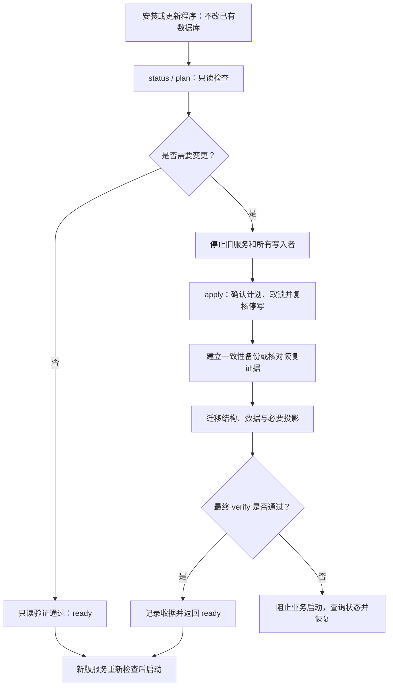
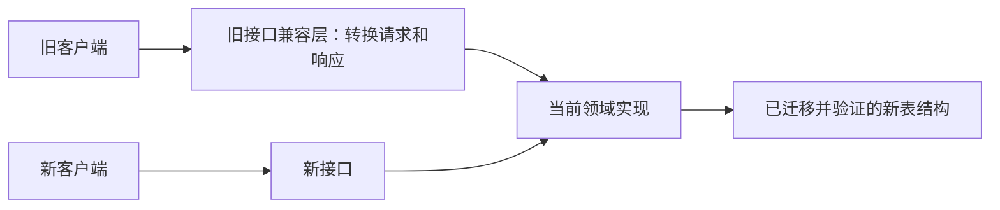

- Proposal Name: `unified_versioned_database_migrations`
- Start Date: 2026-09-28
- Tracking Issue: [oceanbase/powercontext#1756](https://github.com/oceanbase/powercontext/issues/1756)
- 关联讨论：[PR #1716 的迁移框架建议](https://github.com/oceanbase/powercontext/pull/1716#issuecomment-5862598291)
- 设计来源：[语雀 RFC](https://yuque.antfin.com/obopensrc/knowledge_sharing/psb5g51gae41q16l)
- 状态：设计提案。本文确定建议方案和验收要求，不代表迁移框架或后端原型已经实现。

# Summary

采用 **Alembic 管理关系数据库的结构版本，由 PowerContext 提供统一的迁移执行入口**。SQLite、嵌入式 seekDB 和 OceanBase MySQL 租户共享一条逻辑 revision 链；后端差异由显式适配器处理。执行入口负责存量库识别、互斥锁、执行记录、前后置校验和恢复，Alembic 负责 revision 依赖与结构变更。长时间数据回填、身份补证和搜索投影重建独立运行，通过明确的依赖条件与结构版本衔接。

**安装或升级软件不修改存量数据库；所有已有库，无论本地还是远端，均由用户明确触发迁移。正常启动只检查结构兼容性与必要任务状态，不自动补列、改约束或执行存量回填。** 首次使用的真正空库允许自动初始化：标准本地模式在配置允许的目标位置持锁执行完整 revision 链；远端库和多副本部署通过单独初始化任务完成。

首期采用**默认停服迁移、迁移成功后启用新版业务**的发布方式。一个 `apply` 命令协调计划确认、停写条件检查、备份或恢复条件核对、结构及必要数据任务、最终验证和迁移收据。迁移失败时阻断业务就绪，允许有证据的恢复；不自动执行破坏性 downgrade。

软件版本、API 契约版本和 schema revision 分别管理。新旧 API 可以在迁移完成后共用当前业务实现与存储；保留旧接口不要求保留旧表。只有明确承诺新版程序连接旧 schema，或新旧服务混跑时，才增加经过测试的存储兼容路径。不得把 `create_all()`、未经校验的 `stamp head` 或自动生成脚本视为完整迁移。

**本方案独立于 PR #1716 推进；统一框架启用后，成为 PowerContext 的标准数据库变更流程，所有涉及受管表结构变更的 PR 都必须遵循。** 每个变更必须在同一 PR 中交付对应的版本化迁移、必要的数据任务、验证和兼容性说明，并通过统一 CI 门禁。此要求覆盖所有功能模块和变更规模，#1716 不构成长期例外。

# Motivation

目前数据库能否使用，由多处初始化和维护逻辑共同决定。仅知道表是否存在，无法判断约束是否正确、回填是否完成、旧 Worker 是否仍在写入，或某次 DDL 是否已经提交。表重命名、约束变化和多副本同时启动，使这些隐含假设更容易失效。

目标是让一次升级可以回答五个问题：数据库现在是什么版本；将执行哪些操作；谁有权执行；中断后从哪里继续；满足什么条件才能接流量。同时，将这些要求固化为所有表结构变更 PR 的日常开发、评审和合并流程。

## 现有路径与归属

下表以已提交源码 [298314f8cbba](https://github.com/oceanbase/powercontext/tree/298314f8cbbaa57fcfec668668fb55d704a1b6eb/src/powercontext) 为盘点基准；PR #1716 单独列出。路径均相对于 `src/powercontext/`。

| 现有入口 | 当前职责 | 纳入统一模型后的归属 |
| --- | --- | --- |
| `builtin/persistence/schema.py:create_tables`，三个数据库 `profile.py` | 对调用方选择的 SQLAlchemy 表执行 `create_all(checkfirst=True)` | 正式运行时由已冻结的初始 revision 和后续 revision 接管；保留测试夹具用途 |
| `skill_distribution_schema.py` | Skill 发布表重建、状态转换、列和约束调整 | 结构操作进入 revision；逐行转换拆成可恢复数据任务，收紧约束等待转换完成 |
| `tag_schema.py` | SQLite 重建 Tag 表，MySQL 分支移除旧 family CHECK | 一个跨后端逻辑 revision，分别使用 batch 重建或显式约束 DDL |
| `dream_schema.py` | 给 Artifact 与 Candidate revision 补充引用列 | 增量 revision；合并后的 Dream 扩展列、索引按实际发布形态登记 |
| `scope_search_schema.py` | 增加搜索列、回填内容，再设置非空 | 拆为 expand revision → 分批回填 → verify → contract revision |
| `experience_index.py` 与各后端 Memory／Experience／Topic Memory index | 补搜索与治理列，创建全文／向量对象，初始化或重建投影 | 事实表列进入 revision；物理索引定义与重建进入受登记的 projection 任务，由同一维护入口调度 |
| `processing_migration.py`、`server processing-migrate` | 已有 plan／apply／verify、阶段标记、migration ID、配置 manifest、迁移收据和旧 Lease 失效处理 | 保留语义与收据；DDL 归结构 revision，剩余阶段作为数据任务适配器，不再另行改表 |
| `receipt_migration.py`、`server/factory.py` | 根据 committed receipt identity 补证；未解决记录进入 review 表 | 独立身份补证任务，保留安全边界及审核队列；不能仅凭 schema 版本认定完成 |
| PR #1716 的 `candidate_schema.py` | Candidate 表重命名、SQLite 重建、MySQL 约束调整、关联完整性校验 | 按最终合并与发布形态纳入基线识别或显式 revision；已经完成的状态只验证，不重复迁移 |
| OceanBase profile 的身份列 collation 校验、各后端能力检查 | 拒绝不兼容数据库或索引配置 | 保留为迁移前置检查与运行期验证；检查本身不自动修复数据 |

当前主要启动顺序是 profile 建表 → processing bootstrap／ready 检查 → Skill／Tag／Dream／Scope helpers → 索引初始化 → 运行时装配；Server 还会执行 receipt 补证。未来这些操作的先后关系写入依赖，不再由函数调用顺序隐式决定。[运行时装配源码](https://github.com/oceanbase/powercontext/blob/298314f8cbbaa57fcfec668668fb55d704a1b6eb/src/powercontext/builtin/runtime/composition.py)

本 RFC 管理 PowerContext 官方持久化对象。第三方组件自行维护的内部存储、外部身份服务、用户自建表不交由 Alembic 自动修改；第三方扩展需要显式登记所有权和依赖后才能接入。在线无停机迁移、跨数据库搬迁和历史任意版本直升不在首期范围。

# Guide-level explanation

## 1. 用户如何升级

用户可以先安装新版程序，在合适的维护窗口再迁移数据库。安装命令和包安装钩子不连接业务数据库，不执行迁移，不自动拉起新版服务。尚未迁移时，已有服务能否继续运行取决于其二进制与现有 schema 是否兼容；需要延后切换时保留可独立运行的旧版本环境，不能依赖原地覆盖后仍在运行的进程长期工作。

默认操作顺序是：查看迁移影响 → 安排维护窗口 → 停止旧服务、Worker、调度器和 SDK 写入者 → 执行迁移命令 → 根据结果启动新版服务。部署系统在维护期间禁止自动重新拉起旧实例。迁移 CLI 独立装配执行器，不依赖业务 HTTP 服务成功启动，也不会先调用带有建表或回填副作用的运行时 factory。

### 命令与交互

以下为**拟新增的 CLI 契约**，不是当前已经实现的命令。迁移操作统一使用 `powercontext server db-migrate` 命令组。

先查看状态和影响；这两个命令对目标数据库只读，不创建版本表、锁表或业务表：

```bash
powercontext server db-migrate status --env-file deployment.env
powercontext server db-migrate plan --env-file deployment.env
```

停写条件满足后执行 `apply`。它会重新生成并展示实际计划，交互终端一次确认后执行；本地一致性备份由已验证的 profile 适配器自动完成，远端库需提供备份或恢复点引用。成功前内置执行最终 `verify`，用户无需手工逐条执行 SQL 或再次拼装数据任务。

```bash
powercontext server db-migrate apply --env-file deployment.env --maintenance-confirmed
```

远端数据库使用已有备份系统创建覆盖目标数据的一致性恢复点，再将引用交给迁移命令。非交互部署必须显式接受审阅过的计划，不能因为没有终端而默认同意：

```bash
powercontext server db-migrate apply --env-file deployment.env --plan-id PLAN_ID --backup-ref BACKUP_ID --maintenance-confirmed --yes
```

`plan_id` 绑定目标数据库身份、来源与目标 revision、受管结构指纹、脚本／任务 checksum、相关配置摘要和恢复要求。锁内复核发现这些条件改变时，停止并要求重新审阅；数据相关前置条件在锁内重新检查，不把计划阶段的行数或检查结果当成永久有效。计划不输出凭据或业务正文，也不在目标库写入待执行标记。`--yes` 仅接受该计划，不能绕过已知活跃写入者、备份要求、锁、兼容性或校验错误。非交互执行有变更的计划时，`--yes` 或有效计划任一缺失均返回 `confirmation_required`，不得挂起等待输入。

命令结束后输出 run ID、来源与目标 revision、各步骤及必要任务状态、备份引用、校验摘要和下一步。只有明确的 `ready` 结果允许部署系统启动新版业务。备份、结构、数据和投影进度分别显示，不用一个“DDL 已成功”掩盖后续失败。

如果没有待执行的结构、基线纳管或本次计划的数据／projection 变更，且只读验证通过，`apply` 直接返回 `ready` 与“无需变更”，不要求停写、确认或新备份，也不创建新的迁移 run。该结果表示检查时兼容；后续业务启动仍重新检查，不把一次检查当作永久有效的准入凭证。

### 查询与恢复

独立 `verify` 用于人工复核和部署检查，对目标数据库只读。中断后按原 run ID 恢复，重新取锁并检查真实状态，不无条件重跑整个脚本：

```bash
powercontext server db-migrate verify --env-file deployment.env
powercontext server db-migrate apply --env-file deployment.env --resume RUN_ID --maintenance-confirmed
```

恢复沿用原计划、目标和备份记录，允许继续原 run 已证明完成的阶段；未知状态不能直接标为成功。自动化恢复也必须提供匹配计划并显式使用 `--yes`。已有 `processing-migrate` 命令在兼容期转发到统一维护入口，继续接受原 migration ID 和 manifest，但不能绕过维护、备份及任务依赖条件。



## 2. 自动与显式执行边界

| 场景 | 默认行为 |
| --- | --- |
| 安装或升级 PowerContext 软件包 | 只更新程序与迁移资源，不连接或修改存量业务库，不自动运行迁移 |
| 首次使用的 SQLite／嵌入式 seekDB 本地空库，目标位置允许初始化 | 持锁确认空库后自动执行完整初始化和验证，成功才启动 |
| 全新 OceanBase 库或多副本服务部署 | 由单独迁移任务显式初始化，API／Worker 只检查兼容性 |
| 已有库 schema 与当前程序兼容，必要任务已完成 | 正常启动，不执行结构写入或隐式修复 |
| 任意已有库需要结构升级、表重建、约束变化或必要存量回填 | 返回 `migration_required`，阻止业务启动，提示显式迁移；本地与远端使用同一规则 |
| 正在迁移、迁移失败或结果未能验证 | 返回 `migration_running` 或 `recovery_required`；阻止业务写入与就绪，提供状态和恢复命令 |
| schema 已兼容，仅有计划明确允许延后的可选投影任务 | 阻断对应检索能力并显式报告降级；核心能力是否就绪按能力契约判断；普通启动不暗中重建 |
| 无版本但含受管业务表、未识别遗留形态 | 进入显式基线识别，未知形态返回 `unknown_baseline`；不能视为空库 |
| revision 未知，或超出二进制明确支持范围 | 返回 `incompatible_schema`，拒绝业务启动，不修改数据库 |

首次自动初始化必须同时满足目标位置允许初始化、无受管业务表和历史标记、无中断残留、锁内再次确认。业务表没有行、版本表缺失、版本号读不出来均不能证明是空库。远端凭据连错数据库或本地路径配置错误时，也不能根据一次读表失败推断需要新建。

兼容范围由发布包声明的已知 revision 集合决定，不按 revision 字符串大小比较。首期默认只支持目标 revision；扩大范围必须有各允许版本的读写、任务和恢复测试。如果进一步允许新旧二进制混跑，还必须有混合版本测试。数据库过新与过旧都可能不兼容，未知 revision 即使看似只多几列也拒绝访问。

状态检查覆盖 HTTP Server、Worker、定时任务、嵌入式 SDK 和直接打开官方持久化能力的 CLI，且位于领域 factory、schema helpers 和后台任务启动之前。迁移未就绪时不得通过“先启动再等请求失败”提供半可用服务。`status`、`plan`、`verify` 及恢复入口仍可独立运行；监控存活不等于业务 readiness。检查错误返回稳定错误类别、当前／目标 revision、阻塞原因和建议命令，不把缺少 DDL 权限解释为可以跳过检查。

## 3. 新旧接口与数据库版本如何协同

软件包版本、API 契约版本和 schema revision 是三个独立维度。每个发布包声明目标 schema、允许访问的 schema 集合、必要任务及能力条件，并列出支持的 API 契约。API 名称或前缀不用于直接选择数据库 revision。

例如旧接口使用旧表，新发布同时提供新接口和新表结构。首期默认发布流程是：停旧服务写入 → 显式转换旧数据与结构 → 校验完成 → 启动新版服务。此时旧接口可保留兼容适配层，将参数转为当前领域请求、将结果转回旧响应；新接口直接调用当前实现，二者访问同一套已迁移存储。若行为语义无法兼容，应发布明确的新契约并安排客户端升级，不能只保留旧 URL 却悄悄改变含义。



| 对外发布承诺 | 迁移前的新版程序行为 | 必须承担的兼容成本 |
| --- | --- | --- |
| 首期默认：允许停服迁移 | schema 不兼容时阻断业务启动；迁移成功再启用新旧 API | API 契约适配和迁移验证；不要求每个 handler 支持两套表 |
| 明确允许新版程序连接旧 schema | 仅运行被声明并验证的旧 schema 能力；依赖新结构的能力明确不可用 | 在持久化适配层集中实现版本差异，并验证旧 schema 的全部允许读写路径 |
| 新旧服务必须同时运行 | 先扩展、回填与验证，再切流量，旧实例全部退出后才收缩结构 | 写入一致性、回填追平、混合版本测试和明确退出条件；不属于首期默认能力 |

不在接口 handler 中散落“列不存在则换一条 SQL”的异常兜底；不承诺未经测试的双写、双向同步或自动回退旧表。保留旧接口、保留旧表、允许旧程序继续运行是三个分别验证的承诺。删除旧表／列与移除旧接口分别登记条件和发布时点；数据库一旦发生不兼容变更，只回退应用包不能当作安全回滚。

## 4. 贡献者的标准变更流程

框架启用后，凡 PR 涉及 PowerContext 受管表的新增、删除、重命名，或列、类型、默认值、可空性、主外键、CHECK、索引和 collation 变化，均适用以下流程；仅增加一个字段也不能跳过。

1. **同时提交模型与迁移。** 更新目标 schema 定义，并新增基于当前 head 的冻结 revision；可选全文／向量投影按同一流程登记对象定义、projection 版本和任务。不能只改模型、补一段启动 DDL，或要求用户自行改表。
2. **显式声明依赖与执行策略。** 涉及存量数据时提交独立数据任务，标明 expand／backfill／contract 顺序、前后置条件、维护要求、幂等行为及中断恢复方式。适用后端和不适用原因必须明确。
3. **提供验证证据。** 按影响范围验证空库初始化、受支持发布版本升级、重复执行、故障恢复与业务不变量；跨后端结构变更须覆盖 SQLite、seekDB 和 OceanBase。缺失后端验证不能以 skip 视为通过。
4. **在 PR 中说明运维与接口影响。** 列明来源与目标 revision、数据／投影任务、应用兼容范围、停写与备份要求、验证结果和向前修复或备份恢复方式。API 变化同时说明旧契约适配、客户端升级要求，以及是否承诺旧 schema 或旧程序继续工作；不强求破坏性迁移可逆。
5. **通过评审与必需 CI 检查后合并。** 若基分支 head 已变化，在合并前整理未发布 revision 的依赖并重新验证，保持单一 head；已发布 revision 不得重写。没有对应迁移或校验失败的表结构变更不得合并。

独立推进只描述框架的实施安排。框架启用时仍未合并的表结构变更 PR，也必须接入这套流程；启用前已合并或已发布的变更由基线和 legacy adapters 纳管。

# Reference-level explanation

## 1. 选型与职责边界

| 方案 | 与本项目的适配性 | 主要代价 | 结论 |
| --- | --- | --- | --- |
| Alembic + PowerContext 执行层 | 复用现有 SQLAlchemy 定义、revision 依赖和 SQLite batch；可通过 `AsyncConnection.run_sync` 接入现有异步引擎 | 仍需实现后端能力、执行锁、数据任务和恢复策略；自动生成有盲区 | **选用** |
| 小型自研 revision registry | 可以直接复用异步 helpers，初期代码少 | 必须持续自维护 revision 图、历史脚本稳定性、差异检测、审计和开发工具；容易再次变成一组分散 helpers | 不作为主框架；仅保留执行策略和任务登记所需薄层 |
| SQL 优先工具，以 Flyway 为代表 | SQL 变更清晰，具备版本脚本、历史表和 checksum 模型 | Python 分发需额外工具链；三种 profile 的 SQL、嵌入式引擎生命周期和 Python 数据转换仍需适配 | 不作为默认依赖；需要 SQL 审阅时输出计划与后端 DDL |

Alembic 的 async 接入和数据迁移分离方式有官方说明；Flyway 的版本迁移和 checksum 是参考设计。这里的选择基于项目已有 SQLAlchemy 与 Python 部署方式，不代表已经完成三后端兼容性实验。[Alembic Cookbook](https://alembic.sqlalchemy.org/en/latest/cookbook.html#using-asyncio-with-alembic)、[Flyway Versioned migrations](https://documentation.red-gate.com/flyway/flyway-concepts/migrations/versioned-migrations)

Alembic 放入需要官方持久化能力的依赖集合，迁移脚本随 wheel 分发，不要求终端用户安装独立 CLI。正式入口只允许经过 PowerContext 执行层调用，避免裸 `alembic upgrade` 绕过锁和数据依赖。

## 2. Revision 与持久化模型

每个物理数据库／schema 只有一条官方核心结构 revision 链，版本不是 Scope 级，也不是应用包版本。每个发布包必须只有一个目标 head；未发布分支在合并前整理为线性链，已发布 revision 不重写。

revision 包含稳定的 `revision`、`down_revision`，以及 PowerContext 解释的 profile 支持范围、前置条件、维护要求、必要数据任务、步骤后置条件和验证器。revision 自带冻结的表／类型定义；禁止导入随主程序变化的 ORM 表对象来重建历史状态。后端不适用步骤也必须证明该逻辑 revision 的后置条件成立，不能简单忽略异常。

建议新增以下内部记录，名称属于本 RFC 的拟定契约：

| 记录 | 用途 |
| --- | --- |
| `pc_schema_revision` | Alembic version table，记录已验证完成的逻辑 revision |
| `pc_migration_runs`／`pc_migration_steps` | run ID、plan ID、数据库身份、来源／目标 revision、profile、脚本 checksum、配置摘要、维护确认、备份引用及验证级别、步骤、状态、时间、错误类别与验证摘要 |
| `pc_data_migration_jobs` | 数据／projection 任务 ID、任务版本、schema 依赖、配置摘要、checkpoint、幂等收据与完成状态；可引用已有领域收据 |

执行日志不是第二套 schema 版本：只有 revision 表决定结构位置，日志解释正在发生或尚未完成的操作。核心 revision 与必要任务均满足后，readiness 才能通过。必要步骤运行中、失败或验证不一致均阻止业务就绪；不能因 Alembic 已到 head 就忽略未完成任务。计划明确允许延后的可选投影任务单独标记能力不可用，不把这种已声明降级与必要迁移失败混为一谈。发布包中的兼容声明与状态检查使用同一份 manifest，避免 HTTP、SDK 和 Worker 各自判断版本。

checksum 覆盖已发布 revision 及其冻结依赖，以随包提供的 manifest 校验；历史脚本发生变化时停止执行并报告冲突。新增控制表也需要固定 bootstrap 协议：已有库先取得锁、满足停写及备份条件，再幂等建表并核对定义；如果在控制表创建中断，根据固定定义逐表验证恢复，不能误判为全新业务库。

可选全文／向量投影按照登记的后端对象清单和 `projection_version` 验证，记录在 projection 任务中；它们不另起核心事实表的 revision head。开启能力时显式安装或重建相应对象，关闭能力保留既有对象和记录，不能在普通启动中悄悄补 DDL。

## 3. 空库初始化与存量基线

**先检查，后写入。** 迁移检查必须发生在现有 profile 的 `create_tables` 和领域初始化之前。连接、引擎生命周期、驱动配置与结构初始化需要拆开；正常启动不得为了判断版本而先修改表。`status`、`plan` 和 `verify` 使用无建表副作用的检查连接；目标不存在时报告 `uninitialized`，不得为检查而创建数据库文件或控制表。嵌入式引擎若无法提供这种检查路径，适配器必须返回明确的不支持原因，不能隐式打开写入初始化流程。

- **空库：** 在持锁后确认不存在 PowerContext 管理的业务表或历史标记，再执行冻结初始 revision → 后续 revision → 必要初始化任务 → verify。相同目标版本的空库和升级库必须形成相同的受管 schema。首期不采用 `create_all()` 后直接 stamp 的快路径。
- **已有版本库：** 校验 revision、checksum、执行记录和受管 schema 后，从已验证的 revision 前进。若发生中断，先恢复或拒绝，不另开一条路径覆盖旧记录。
- **无版本遗留库：** 只接受基线清单明确识别的形态。识别内容包括表、列类型／可空性／默认值、主外键、CHECK、索引、身份 collation、可选能力以及已有 processing／projection 标记；还需做适用的数据完整性检查。不能仅根据包版本、某一列存在或数据行数为零判定。
- **未知或混合形态：** 输出差异并拒绝写入。临时表残留、旧新 Candidate 表并存、缺一张配对表等均需要专门恢复路径，禁止强制 stamp。

首期至少以已发布的 [powercontext-v1.1.0](https://github.com/oceanbase/powercontext/releases/tag/powercontext-v1.1.0) 构造真实升级夹具，并覆盖接入框架前最后一个受支持发布版本。不要用当前模型删几列代替旧发布包创建的库。更早版本只有进入已测试基线清单后才支持直接接入；否则明确要求受支持的中间升级路径或专项适配器。

基线流程为：只读识别 → 获取锁并复核 → 经审阅的 legacy adapter 补齐已知差异 → 完整验证 → 写入匹配的 baseline revision → 执行后续 revision。baseline 只证明结构状态，已有 processing receipts、配置 manifest 和待审核补证记录仍分别验证。基线 snapshot 在框架接入时冻结；包括 #1716 在内，启用前已交付的结构变化由识别器和适配器纳管，启用后尚未合并的变化按标准流程提交迁移。

## 4. 执行顺序与数据任务依赖

统一执行顺序如下：

1. 只读读取版本、后端能力和真实结构，生成计划；展示影响并取得一次明确确认。
2. 获得全库迁移锁，核对计划仍适用，复查已知写入者与维护条件。已知活跃写入者未退出则拒绝继续。
3. 对已有库完成一致性备份或核对外部恢复证据；未满足条件时不执行受管结构及业务数据写入。真正空库记录不需要备份的原因。
4. 建立执行记录，保存维护与恢复信息；必要时按已识别的基线适配器纳管。
5. 执行 expand revision。
6. 执行必要数据任务，分批提交和校验；满足屏障后执行 contract revision。
7. 完成必要 projection 安装／重建与验证，明确标记允许延后的可选能力。
8. 内置执行最终 verify，确认结构、必要任务和业务不变量；持久化完成状态和收据。
9. 释放锁并返回 `ready`，部署系统才可启动新版服务与 Worker。命令成功不会自行重启未纳入控制的外部进程。

执行层按 revision 边界调用 Alembic，不以一次无条件 `upgrade head` 越过任务屏障。长任务声明 `requires_revision`；依赖其结果的 revision 声明 `requires_jobs`。所有依赖构成无环图，plan 必须展示阻塞项。

数据任务使用稳定主键分页；每批业务变更与 checkpoint／收据在同一事务提交。重试不能重复增加请求计数、重复生成 Artifact 或重复使任务生效。与外部系统交互时沿用领域幂等协议，不能声称跨系统事务原子性。

processing 任务保留旧 Lease 失效、manifest 校验和迁移收据语义。receipt 任务只能依据已提交的身份记录补证，未知身份留待审核，不得从正文推断可信来源；外部 identity lookup 故障仍使任务失败。审核中的个别记录是否影响能力，沿用原有访问控制边界，不能标记为已补证或因此擅自放开读取。

projection 任务从 Source／Artifact 等权威数据重建，不修改权威内容来适配索引。涉及 embedding 模型、维度或检索形态时必须核对配置摘要；不兼容则显式重建。首期采用停写重建；若要在线切换，必须另行定义影子 generation、增量追平和原子切换协议。

## 5. 锁与多副本行为

迁移锁按物理数据库和受管 namespace 唯一，不按进程或 revision 命名。锁覆盖识别、DDL、必要数据步骤与最终校验。锁等待有上限，超时返回可重试的 `migration_locked`；拿到锁后必须重读状态，第二个执行者在目标已完成时只验证并返回。

| Profile | 执行互斥 | DDL 与恢复约束 |
| --- | --- | --- |
| SQLite 文件库 | 规范化数据库路径上的进程间文件锁覆盖整次维护；每个结构 revision 使用显式 `BEGIN IMMEDIATE` | batch 重建、数据复制和版本推进处于已验证的事务边界；失败回滚，恢复后重新检查 |
| SQLite 内存库 | 共享引擎的进程内锁 | 仅新建初始化，不提供离线持久化恢复；不能把进程内锁用于文件库多进程场景 |
| 嵌入式 seekDB | 规范化数据目录上的进程间文件锁，在打开迁移引擎前取得 | 不假定 MySQL 协议意味着支持全部锁函数或事务 DDL；按非事务 DDL 的逐步验证协议执行 |
| OceanBase MySQL 租户 | 经能力验证的 `GET_LOCK` 命名锁，固定专用物理连接持有并执行 DDL | 锁应跨 commit 保持；禁用执行期间自动重连，断连立即停止后续步骤，不把事务回滚当作 DDL 撤销 |

SQLite 的 `BEGIN IMMEDIATE` 用于提前获得写事务；跨批次的维护互斥仍由文件锁保持。文件锁使用操作系统锁而非文件是否存在，且覆盖软链接规范化路径；不宣称支持跨主机共享文件系统上的嵌入式库迁移。[SQLite Transactions](https://www.sqlite.org/lang_transaction.html)

OceanBase 官方文档说明命名锁不会在 commit／rollback 时释放，但版本文档的支持范围存在差异。因此要在选定的最低／目标版本、实际租户和代理路径上做双连接互斥及跨连接路由验证，不能只检查函数能返回成功。无法验证时，在执行任何受管 DDL 前返回 `migration_lock_unsupported`，不回退到一个会随 DDL 提交而失效的行锁。[GET_LOCK](https://en.oceanbase.com/docs/common-oceanbase-database-10000000001379158)、[V4.3.0 兼容性说明](https://en.oceanbase.com/docs/common-oceanbase-database-10000000001228196)

**迁移者互斥与业务停写是两项独立条件。** 命名锁和文件锁只约束遵循协议的迁移进程，不证明 API、Worker、SDK 或旧版程序已经停止写入。执行器使用可获得的进程、引擎持有者和领域 Lease 信息检查已知写入者；检测到活跃写入者时返回 `active_writers`，即使带确认参数也不继续。

首期由操作者或部署编排停止全部写入入口，并禁用自动重启或拉起旧实例；工具不宣称能发现任意外部客户端或隔离所有旧版本。`--maintenance-confirmed` 记录对这项维护条件的确认及相关证据，不是停写实现。框架知情的新启动入口看到未完成迁移记录时拒绝业务就绪，但该检查不能替代维护窗口，也不能阻止已经启动的未知客户端。无法建立停写条件时不支持执行本方案的迁移。

多副本部署只运行一个迁移 Job，失败则阻止应用 rollout；只有迁移返回 `ready` 后才解除维护并启动应用。副本正常启动仍独立检查兼容性，不能仅凭 Job 曾成功就跳过检查。首期不支持一边运行不兼容旧版本，一边完成 contract 迁移。

## 6. 中断恢复与验证

OceanBase DDL 可能隐式提交，Python 事务上下文不能把多条 DDL 变成原子升级；seekDB 首期使用同样保守的恢复模型。[OceanBase 提交事务](https://www.oceanbase.com/docs/common-oceanbase-database-cn-1000000004476105)

每个不可原子提交的步骤先持久化意图，再执行变更、读取真实后置条件，最后记录完成。恢复时按三类处理：

| 观察到的状态 | 恢复行为 |
| --- | --- |
| 前置条件仍成立，未发生改变 | 重新执行该步骤 |
| 精确后置条件成立，但完成记录缺失 | 补校验和记录，不重复执行 DDL／数据变换 |
| 新旧状态并存、内容不一致或无法证明操作结果 | 标记 `recovery_required`，保留证据并停止；由专项修复或备份恢复处理 |

例如增加列时要验证类型、默认值、可空性和相关约束，而不只判断列名存在；表重命名时必须区分旧表存在、新表存在和两者并存。发生网络超时或数据库故障转移时，先确认旧会话及相关 DDL 已结束并读取稳定状态，再恢复；不因超时、心跳丢失或重连成功就自动接管仍可能运行的 DDL。

SQLite 重建使用冻结结构和 Alembic batch／显式重建步骤，保留索引、约束、触发器与关联视图；如需关闭外键检查，只在专用连接、事务外切换，提交前执行 `foreign_key_check`，结束后恢复设置。不能使用简单的“改名旧表再建新表”通用模板而忽略外键重写。[Alembic Batch](https://alembic.sqlalchemy.org/en/latest/batch.html)、[SQLite 表结构变更流程](https://www.sqlite.org/lang_altertable.html#making_other_kinds_of_table_schema_changes)

每个 revision 的验证至少包含实际 schema 与目标定义一致，以及该变更涉及的领域不变量。复制表需验证主键集合、行数和保留字段内容一致，不能仅凭总行数；Candidate 需验证 head 指向实际 version 及 Scope 外键；processing 需验证收据、计数和 manifest；检索投影需验证对应的 Artifact revision 和代表性查询。

SQLite 可将 revision 完成与版本推进原子提交；非事务 DDL 后端仅在全部后置条件成立后推进版本。若日志与版本写入之间中断，恢复先调和真实状态，禁止裸 stamp。不可逆变更采用向前修复或恢复备份；程序不会自动执行破坏性 downgrade，也不会静默删除无法识别的中间表。

## 7. 备份与发布恢复

本地与远端已有库采用同一规则：在首次修改受管结构或业务数据前建立可追溯的恢复条件。区别在于工具能自动完成多少工作，不在于哪类数据库可以省略安全检查。首期不提供通用 `--force` 或 `--no-backup` 来绕过必需恢复条件；真正空库初始化单独记录免备份原因。

| Profile | 默认备份体验 | 必须说明的边界 |
| --- | --- | --- |
| SQLite 文件库 | 停写并持锁后，由适配器执行已验证的一致性备份；报告位置、数据库身份、时间、校验结果和恢复方式 | 必须处理 WAL 中的已提交数据；不能仅复制主文件就宣称可恢复 |
| 嵌入式 seekDB | 使用已验证的引擎备份／快照能力，或确认引擎关闭后的完整持久化目录快照 | 不把运行中目录普通复制当作一致性快照；当前适配器无法保证一致性时要求外部恢复证据或返回 `backup_required` |
| OceanBase 等远端库 | 对接部署已有的备份、快照或时间点恢复流程；通过 `--backup-ref` 提供恢复点引用 | 核对目标租户／库、时间、覆盖范围及恢复方法；不把“有一个备份 ID”当作已经验证恢复成功 |

计划区分权威数据、待处理队列、迁移记录和可重建投影。备份必须覆盖此次操作涉及的不可重建状态及停写前所有已提交变更；使用早于维护窗口的全量备份时，必须证明配套日志可以恢复至停写边界，不能只提供过期备份引用。涉及文件与数据库的任务需说明共同一致性边界。不可重建的待处理消息不能因为位于某个 index 目录就被一并丢弃。

备份记录包含目标身份、位置或引用、创建时间、覆盖对象、校验摘要、验证级别及恢复指引。具有后端适配器的检查结果与操作者提供的人工确认分别记录；无法自动验证的部分在计划确认时显式展示，不能输出为“自动验证通过”。若证据不足以满足该步骤要求，则返回 `backup_required` 并停止，而不是临时降低该要求。自动本地备份失败、空间不足或备份目标不匹配都不进入结构变更阶段。

恢复同一 run 时保留原始迁移前备份，不用部分迁移状态生成的新备份覆盖它。完成状态和 CLI 收据都带恢复引用；备份不随迁移成功立即删除，由保留策略管理。若备份成功但控制表尚未创建就退出，通过操作者指定或受管目录内的备份 manifest 找回引用并重新核验，不能要求先写目标控制表才能证明已有备份。

迁移失败优先按步骤后置条件判断可重试或需向前修复；不能证明状态时停止并使用专项恢复流程。决定恢复备份时保持业务停写，按配套文档恢复数据库、必要文件和对应程序版本，再执行完整验证。恢复会损失恢复点之后的变化，因此不得在存在未核对写入时自动覆盖当前库。应用包回退与数据库恢复是独立动作；除非兼容 manifest 和测试证明旧程序可访问当前结构，否则拒绝直接启动旧程序。首期不提供一键破坏性 downgrade。

## 8. CI 与原型验收

CI 同时检查“新库与升级库是否一致”和“模型变化是否有对应迁移”，不能仅判断目录里是否新增了一个文件。框架启用后，这些检查作为所有表结构变更 PR 的必需合并检查；缺少对应迁移、依赖冲突或验证失败时阻止合并。

1. 在真实 profile 上由 migration 建空库到 head，与当前受管 metadata 及后端对象清单比较；再从真实已发布版本夹具升级并比较结果。
2. 执行 `alembic check` 检测常规模型差异。补充显式比较器覆盖 CHECK、主外键、collation、全文／向量／虚拟表等盲区。重命名必须人工表达，不能接受自动生成的删除后新建。
3. 将本次 schema 清单与基分支比较：核心结构改变必须新增 revision，可选 projection 定义变化必须增加 projection 版本与任务。检查单一 head、不可变历史 checksum、无环任务依赖和 wheel 内迁移资源完整性。
4. 按登记所有权过滤外部表，禁止把不了解的对象加入删除计划；禁止安装钩子和普通启动路径新增结构写入、存量回填或索引重建。
5. 验证安装升级、`status`／`plan`／`verify` 不修改已有库；验证真正空库初始化与“无版本但有业务表”的区分。HTTP、Worker、SDK 在不兼容或迁移未完成时都必须拒绝业务访问。
6. 验证计划变化需重新确认、非交互确认规则、自动备份失败阻断、外部备份目标核对、resume 保留原始恢复点，以及必要任务失败不会返回 `ready`。
7. 涉及 API 变更时，用旧客户端契约和新客户端契约验证迁移后的同一数据；声明支持旧 schema 或混合二进制时，另行验证这些组合及拒绝不支持组合的行为。

`alembic check` 与 autogenerate 使用相同的比较能力，无法独立证明迁移完整，因此必须结合 profile 级 schema 检查和业务断言。[Alembic Autogenerate 与 Check](https://alembic.sqlalchemy.org/en/latest/autogenerate.html)

原型使用两类实际变更：A 为 Dream 引用列等增量变更；B 为 Tag CHECK 移除，SQLite 走表重建，seekDB／OceanBase 走约束变更。另将 #1716 最终 Candidate 形态作为基线／重命名边界夹具，覆盖“已迁移、待迁移、部分迁移”三类状态。

| 必须验证的场景 | SQLite | seekDB | OceanBase |
| --- | --- | --- | --- |
| 空库初始化、v1.1.0 等受支持发布版本升级 | 必测 | 必测 | 必测 |
| A 增量变化、B 表重建或约束变化 | 必测 | 必测 | 必测 |
| 重复执行无额外副作用，升级后数据及检索行为正确 | 必测 | 必测 | 必测 |
| 每个提交边界前后中断，含 DDL 完成但记录未写入 | 必测 | 必测 | 必测 |
| 两个进程并发、锁等待超时、持锁者退出 | 必测 | 必测 | 必测，并覆盖代理／节点路由 |
| 新于当前二进制的数据库、未知 revision、checksum 冲突 | 必测 | 必测 | 必测 |
| 未识别基线、旧新表并存、残留临时表、数据校验失败 | 必测 | 必测 | 必测 |
| required job 未完成时 API／Worker／SDK 拒绝业务访问，数据任务断点续跑 | 必测 | 必测 | 必测 |
| 安装／普通启动不改存量库，只读命令不创建缺失目标；无版本旧库不被当作空库 | 必测 | 必测 | 必测 |
| 活跃写入者阻断、备份失败或错误恢复引用阻断、计划变更重新确认 | 必测 | 必测 | 必测 |
| 迁移前备份恢复后可验证并由对应程序运行 | 必测，含 WAL 数据 | 必测，含引擎生命周期 | 必测，含实际备份／恢复路径 |
| 旧／新 API 对迁移后相同数据的契约验证 | 有相关 API 变更时必测 | 有相关 API 变更时必测 | 有相关 API 变更时必测 |

以上是实现验收要求，本文没有宣称原型已运行。测试必须记录 Python、驱动、数据库／嵌入式引擎、租户模式和代理版本。三种 profile 均须有真实数据库报告；缺少环境或被 skip 不能算验收通过。事务 DDL、reflection、约束行为或锁语义不符合预期时，先完善适配器与恢复步骤，再接入默认路径。

## 9. 实施与发布

- **阶段 A：建立证据与原型。** 冻结支持版本及基线夹具，完成两类变更、锁和恢复矩阵；确认 Alembic 在现有官方 dialect 上的运行方式。此阶段不改变用户升级路径。
- **阶段 B：引入统一入口。** 新增版本表、日志、status／plan／apply／verify、计划确认、备份适配与恢复记录、legacy adapters，保留旧命令兼容；首次纳管已有库必须显式执行。新库改走 revision 链。迁移入口不依赖业务服务启动。
- **阶段 C：启用标准变更流程。** 将表中 helpers 逐项转为 revision、任务或只读检查，移除已接管的启动 DDL 和隐式全量回填。同步更新贡献指南、PR 模板及必需 CI 检查，明确启用点；从此所有尚未合并的表结构变更 PR 必须遵循本 RFC。不要保留两个可以独立修改相同表的执行入口。
- **阶段 D：启用发布门禁。** 发布包包含 schema／API 兼容 manifest；发布文档说明安装与迁移分离、支持来源、维护步骤、备份恢复和客户端兼容安排。三后端验证通过后才宣告支持。生产遵循停止旧写入者 → 独立迁移 Job → 验证完成 → 启动新版应用的顺序。

框架尚未启用时，不要求 PR #1716 等功能 PR 等待框架交付；其已交付结构由统一基线接管。框架启用后，包括 #1716 在内仍未合并且涉及表结构变化的 PR，均须交付对应迁移并通过统一门禁，不再另设功能专属的变更路径。

# Drawbacks

引入 Alembic 仍然不能消除后端差异；执行日志、历史 schema 夹具和真实数据库 CI 都有长期维护成本。显式迁移增加运维步骤，首次纳管会改变“启动时自动补结构”的体验。停止写入的首期策略会产生维护窗口；大表重建、索引构建和 embedding 重算的耗时与空间成本必须在计划中提示，但不能仅凭表行数承诺耗时。

# Rationale and alternatives

保留分散 helpers 的短期成本最低，但不能形成统一版本、恢复和部署契约。只自建一个版本号表也不足以保证约束、数据回填和任务状态一致。Alembic 能减少通用结构工具的自研工作，同时保留 PowerContext 对业务语义的控制。

不选择“所有副本启动时自动 upgrade”：它会让普通启动获得 DDL 权限并承受大表操作、旧进程竞争和隐式提交风险。不把所有数据任务塞进 revision：它们需要分批恢复、配置依赖及业务幂等保证。也不以 `create_all() + stamp` 统一空库与存量库，因为该路径绕过了需要被验证的升级过程。

# Prior art

项目已有 processing 的显式阶段、manifest 与迁移收据，适合成为数据任务适配器的基础；receipt 补证保留了未知来源的审核边界；PR #1716 展示了表重命名、SQLite 重建和约束校验的现实需求。[Processing 维护实现](https://github.com/oceanbase/powercontext/blob/298314f8cbbaa57fcfec668668fb55d704a1b6eb/src/powercontext/builtin/persistence/processing_migration.py)、[Receipt 补证实现](https://github.com/oceanbase/powercontext/blob/298314f8cbbaa57fcfec668668fb55d704a1b6eb/src/powercontext/builtin/persistence/receipt_migration.py)、[PR #1716 Candidate 迁移](https://github.com/oceanbase/powercontext/blob/6541705794b5f40a7ccc71c862cfb54a61890feb/src/powercontext/builtin/persistence/candidate_schema.py)

外部参考为前文链接的 Alembic revision／batch／async 实践、Flyway 版本脚本和 checksum，以及 SQLite、OceanBase 的官方事务与 DDL 语义。它们提供实现基础，不替代本项目的三后端验收。

[OpenViking、TencentDB Agent Memory 与 EverOS 调研](https://yuque.antfin.com/obopensrc/knowledge_sharing/kt5qhok8zkhl5tkv)提供三类直接参考：OpenViking 将旧 Session 复制与清理分开，并保留读取兼容；腾讯记忆 API 共用 handler，但旧元数据管理接口仍保留旧模型，说明接口兼容必须按业务域判断；EverOS 将当前 v1／v2 挂载到同一 router，并为不兼容索引提供显式重建路径，同时保留不可重建缓冲。调研还发现各项目存在不同程度的启动自动补结构，PowerContext 不将这种行为作为存量库默认路径，而是纳入统一显式迁移入口。

# Unresolved questions

以下问题须在框架启用为标准变更流程前落实：

- OceanBase 最低支持版本及 OBProxy／直连组合，命名锁是否满足跨节点互斥；seekDB 指定版本的 DDL、reflection 与约束行为。用原型报告形成可执行的支持矩阵，不能仅依赖“MySQL 兼容”。
- 首批 legacy baseline 的完整清单及指纹，除 v1.1.0 和框架接入前发布版本外，哪些版本承诺直接升级；旧库 collation 冲突采用何种专项修复策略。
- 可选投影的对象清单、配置摘要和能力就绪范围；明确哪些任务阻断整体服务，哪些只阻断相应检索能力。
- 各 profile 的一致性备份适配器、远端恢复证据字段及验证级别、默认备份保留策略；必须以实际恢复验收确定支持范围。
- 各运行入口可可靠识别的活跃写入者范围与维护编排集成方式；明确工具检查和操作者停写保证的边界，不把心跳超时等同于进程已停止。
- 首期保留的旧 API 契约清单和弃用安排；每次 schema／API 变更必须分别给出客户端兼容和程序回退条件。

# Future possibilities

后续可增加经过混合版本验证的 expand／contract 滚动升级、在线投影切换、迁移进度面板及大表预估。初始化快路径只有在持续证明与完整迁移结果一致后才考虑引入。这些能力不属于当前方案的验收条件。
