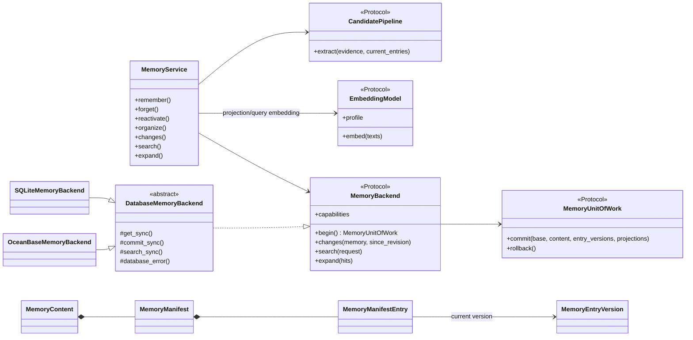
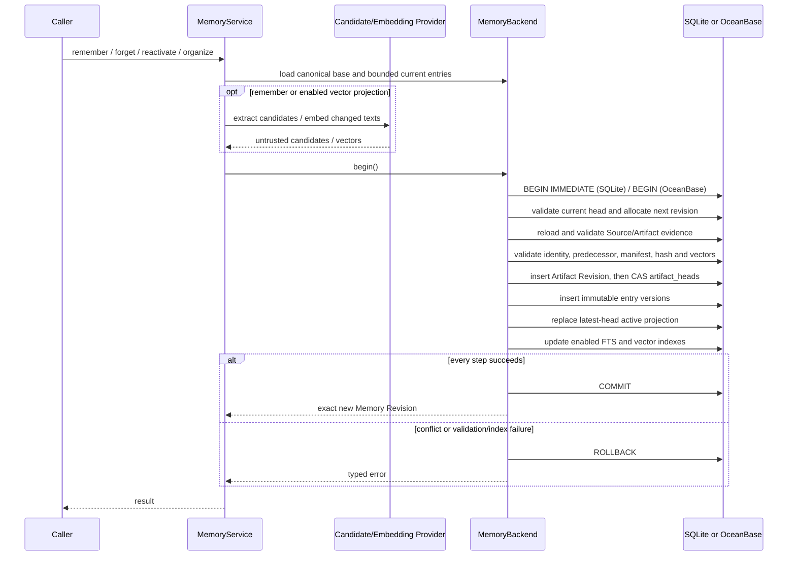

- 提案名称：`memory_layer_design`
- 开始日期：2026-07-14
- RFC PR：[oceanbase/powercontext#14](https://github.com/oceanbase/powercontext/pull/14)
- 相关 RFC：[RFC 0001：产品定义与构想](0001_product_definition_and_vision.md)
- 相关 RFC：[RFC 0002：Core SDK 产品模型](0002_core_sdk_product_model.md)
- 相关约束：[RFC 0011：Server 与 Client SDK 架构](https://github.com/oceanbase/powercontext/pull/11)

# Summary

Memory 是面向后续任务复用的 Artifact Family。一个 Memory Artifact 表示一组共同演进的记忆；Artifact Revision
保存其完整目录，`MemoryEntryVersion` 保存不可变正文，不存在可原地覆盖的 memory row。

本 RFC 定义 personal coding agent 所需的 entry identity/version/state、Memory 生命周期、血缘、精确 Handoff
citation，以及 SQLite 和 OceanBase 中 Revision、entry version、latest-head 全文与已启用向量投影的一致提交。第一期不定义
`MemoryScope`；Memory 只由 Artifact identity 定位，业务对象到 Memory 的映射由 runtime manifest 或上层应用负责。

# Motivation

PowerContext 的目标不是让 Agent 记住更多，而是让共同推进的工作更容易被接手。Memory 保存后续任务需要复用的
事实、偏好、决定、约束和进度，记录其直接 evidence，并让搜索、挂载和 Handoff 围绕精确 Artifact Revision 工作。
第一期从本地仓库材料、人工备注和 Agent 产物生成 personal repo memory，供 coding agent 检索、注入、纠正和整理。
`feat/memory-core` 已形成 inline snapshot 原型，本 RFC 将其收敛为同时支持 SQLite 和 OceanBase 的双后端 MVP。

## 与 RFC 0002 的关系

RFC 0002 已规定 Source 显式持久化、Artifact Revision 不可变、`ArtifactRef` 精确引用、`revise()` 使用乐观并发、
lineage 来自实际传入的完整 evidence，以及 Artifact store 只提交完整 Draft。Memory 候选生成、family-specific
retrieval、projection 和 transaction boundary 属于 Artifact Family service 或 integration runtime。本 RFC 只细化
Memory Family；`memory_service.*` 表示目标 product facade，不增加最小 Core Protocol 契约。

## 设计目标

- 以 Artifact Revision 为生命周期，分离 entry identity、不可变正文版本和逻辑状态；
- Revision content hash 承诺其引用的正文，Handoff 能引用精确 entry version；
- 默认搜索只返回显式选择的 Memory 当前 head 中的 active entries；
- Runtime 围绕用户纠正、任务结束、Handoff 和 Git change 等任务事件生成候选，不以全仓库扫描作为默认入口；
- 无 LLM 时仍可从显式输入、确定性 adapter 和任务结果生成候选，模型只是可选的候选生成器；
- 第一版面向个人和 personal coding agent，同时提供 SQLite embedded backend 与 OceanBase backend；
- 两个 backend 都支持全文检索、向量检索和基于 rank fusion 的混合检索，全文检索在无 embedding model 时仍可工作。

## 非目标

- 不托管 session、tool state 或完整 transcript，不保证 Source 写入后自动产生 Memory；
- 不监听文件、维护原始材料版本或计算通用 diff；这些属于上层应用或 Source integration；
- 不要求 Coding Agent 原生理解 PowerContext 协议；provider hook、plugin、CLI wrapper 或上层 runtime 负责接入；
- 不定义 scope、自动路由、团队多租户、ACL 或 manifest 脱敏；
- 不定义远程 Server、HTTP、durable Operation 或通用生产 migration；OceanBase 仅定义 Memory MVP 所需的 MySQL 模式
  schema、transaction 和 search adapter，不在本 RFC 中设计完整服务端运维体系；
- 不做语义合并、矛盾裁决、质量晋级、自动 evolution 或物理擦除。

# Guide-level explanation

## Artifact-native Memory

一个 Memory Artifact 是一组共同演进的记忆。Artifact ID 是这组 Memory 的稳定 identity；Revision 是某个时刻的
不可变快照。

```text
Memory Artifact
  Revision 1 -> manifest: entry_a -> ver_001 active
  Revision 2 -> manifest: entry_a -> ver_001 active
                          entry_b -> ver_002 active
  Revision 3 -> manifest: entry_a -> ver_003 active
                          entry_b -> ver_002 inactive

MemoryEntryVersion rows
  ver_001 -> entry_a 的第 1 版正文
  ver_002 -> entry_b 的第 1 版正文
  ver_003 -> entry_a 的第 2 版正文
```

Artifact、Revision、manifest 和 entry version 可以分别类比 Git 的 branch、commit、tree 和 blob，但该类比只说明
Memory 内容不可变演进；Memory 不保存仓库文件版本，也不替代 Git。

## 代码结构与抽象边界

Memory 的公共 API、候选生成、权威写入和检索投影必须分层。数据库抽象表达 Memory 所需的事务与检索能力，不暴露
通用 SQL、connection 或 ORM API，也不加入 RFC 0002 的最小 Core Protocol。`DatabaseMemoryBackend` 是数据库 adapter
的扩展 SPI：它统一实现异步串行化、Unit of Work、canonical 校验、manifest/entry 引用校验和检索结果过滤；具体 adapter
只实现同步 CRUD、CAS、schema、事务隔离和数据库检索方言。SQLite 与 OceanBase 通过该 SPI 实现同一组 Family-level
ports，并通过 backend conformance tests 验证共同语义；后续接入新数据库时不得复制这些领域规则。



建议的 Family-level Python contract 形态为：

```python
MemoryCapabilities:
    fts: bool
    vector: bool
    hybrid: bool
    embedding_profile: EmbeddingProfile | None

EmbeddingProfile:
    profile_id: str
    model: str
    dimension: int
    distance: Literal["l2"]
    normalization: str

EmbeddingVector = tuple[float, ...]

EmbeddingResult:
    vectors: tuple[EmbeddingVector, ...]
    usage: InferenceUsage

MemoryBackend(Protocol):
    async def capabilities() -> MemoryCapabilities: ...
    def begin() -> AsyncContextManager[MemoryUnitOfWork]: ...
    async def changes(memory: ArtifactRef, since_revision: int | None) -> tuple[MemoryRevisionChanges, ...]: ...
    async def search(request: MemorySearchRequest) -> tuple[MemoryHit, ...]: ...
    async def expand(hits: tuple[MemoryHit, ...]) -> tuple[MemoryEntryVersion, ...]: ...

EmbeddingModel(Protocol):
    @property
    def profile() -> EmbeddingProfile: ...
    async def embed(texts: tuple[str, ...]) -> EmbeddingResult: ...
```

`MemoryService` 负责领域校验和 operation orchestration；`CandidatePipeline` 与 `EmbeddingModel` 在事务外运行；
`MemoryBackend` 负责能力发现、精确读取和检索；`MemoryUnitOfWork` 负责 Artifact Revision、entry version、head projection
与索引更新的原子边界。具体 backend 可以组合已有 `ArtifactStore`/`SourceStore`，但必须确保这些组件共享同一事务管理器。
MVP 的每个部署只配置一个 embedding profile，model、dimension、L2 distance 和 normalization 在建库时固定。运行时不提供
profile 或 dimension 切换 API；更换模型必须通过停写期间的 schema migration 和全量 rebuild 完成。adapter 可以在 MVP
之外扩展其他 distance，但不能把扩展能力伪装成共同 conformance。

## Memory identity

第一期不从 repo、user 或 workspace 推导 identity。`remember(memory=None, ...)` 在有可保存内容时创建新的
Memory Artifact；后续写入必须传入当前 Revision。Runtime manifest 或上层应用保存业务对象到 Artifact ID 的映射：

```text
repo:/home/jingshun.tq/project/powercontext -> mem_art_01HPC
```

搜索显式选择一个或多个 Memory Artifact，不自动混合用户、仓库或 run 记忆。

## 任务事件与提取边界

Memory 的默认入口是工作过程中已经发生的任务事件，而不是定期扫描仓库并猜测所有可能有用的信息。Coding Agent
integration 通过 provider hook、plugin、CLI wrapper 或上层 runtime 观察事件，并在 Memory Core 之外把不同产品的
payload 规范化。MVP 至少识别以下触发点：

- 用户明确纠正、表达长期偏好，或要求记住/忘记某件事；
- 主 Agent turn 停止、任务结果形成或 Handoff 准备提交；
- Git commit/change 明确改变已有规则、决定或约束的 evidence；
- 调用方显式提交结构化的 decision、constraint 或 `working_note`。

Agent turn 停止只表示一个可观察的边界，不自动证明任务已经完成。Runtime 可以按 session、空闲窗口、commit 或
Handoff 合并多个 provider 事件，再持久化不可变的 `AgentTurnSource`、`TaskOutcomeSource`、`GitChangeSource` 或等价
Source。Source 写入本身仍不自动创建 Memory；Runtime 必须显式选择目标 Memory Revision、operation evidence 和候选，
再调用 `remember()`。

### 记忆准入规则

Durable entry 应同时满足：

1. 会改变未来 Agent 的判断或行动；
2. 不能仅靠快速读取当前代码或配置可靠、低成本地重新获得，或者属于 Agent 行动前必须优先知道的操作契约；
3. 能由本次 operation evidence 或被修订 entry 的直接前驱 evidence 支撑；
4. 脱离原始材料后仍能独立理解，并且对应一个可以独立修订、停用或恢复的语义主题；
5. 预期跨任务复用。只对当前交接有价值的内容使用 `working_note`。

优先保存用户偏好、已确认决定、不可破坏约束、昂贵才能重新发现的事实、已验证坑点和未完成交接。不保存文件清单、
函数签名、代码正文、行号、完整 transcript、普通工具日志、一次性命令输出、未验证推测或 secrets。若两个子结论可能
独立变化，必须拆成不同 entry；多个 Source 只有在直接支撑同一个语义主题时才共同进入该 entry 的 evidence。

### 候选生成与无模型降级

Runtime 可以组合以下候选来源，具体 provider 不是最小 Core Protocol：

1. 调用方显式提供的 `MemoryEntryInput`；
2. 针对 `pyproject.toml`、Git change、结构化 decision 等已知材料的确定性 adapter；
3. Coding Agent integration 能提供的结构化任务结果；
4. 可选的模型辅助 extractor。

所有来源只产生不可信候选，必须经过同一套 evidence、identity、canonical bytes、no-op 和 head CAS 校验。没有语义
extractor 时，Runtime 可以把 provider 已给出的最终报告、changed paths、Git head 和验证结果机械组成一条
`working_note`；不得据此伪造 `fact`、`decision` 或 `constraint`。若事件既没有有效结构化候选，也无法形成有用的
`working_note`，则返回 no-op，而不是为每个 turn 强行创建 entry。

## Source 变化与增量 evidence

Memory Core 只处理调用方本次显式传入的已持久化 evidence，不发现某份 Source 的“最新版”，也不比较两个 Source。
原始材料的版本、监听和差异计算由其所有者负责。Coding Agent runtime 应复用 Git：在自身 manifest 保存
`last_processed_commit`，由 Git 产生包含 `base commit + head commit + path + patch` 的不可变 change Source，再将
它和当前 Memory Revision 传给候选生成流程。其他系统使用各自的 page version、event ID 或 revision。

首次建立 repo Memory 也应由显式的 bootstrap、task outcome 或 Handoff 事件触发，只读取仓库操作契约所需的有界
Source，不默认扫描全部代码。后续优先读取 provider 给出的增量 Source；没有可靠增量时允许回退到相关完整 Source，
但 Memory Core 不为此建立文件快照、分块历史或通用 diff。仅在新材料中缺少旧内容不等于该 entry 已失效；MVP 只有
明确修订证据才 revise，停用仍由显式 `forget()` 完成，恢复则由显式 `reactivate()` 完成。

## Coding Agent 场景示例

假设 Codex 正在维护 `powercontext` 仓库。用户第一次完成“确认仓库开发和验证约定”的任务后，provider hook 发出
turn stop，Runtime 将该任务边界和最终报告保存为 `src_task_outcome_001`，并将任务中实际使用的 `AGENTS.md`、
`pyproject.toml` 和 `Makefile` 分别持久化为 `src_agents_md`、`src_pyproject` 和 `src_makefile`。Runtime 的候选流程
只处理这些有界 evidence；候选可以来自确定性 adapter、Agent integration 或可选模型。通过准入规则后，Runtime 以
显式 entries 调用：

```python
memory = await memory_service.remember(
    memory=None,
    sources=(src_task_outcome_001, src_agents_md, src_pyproject, src_makefile),
    entries=tuple(candidates),
    mode="append",
)
```

`candidates` 是 integration-owned 的示意，不增加最小 Core API。若没有可保存的 durable entry，但最终报告仍对交接
有用，候选流程可以只生成一条 `working_note`；若连 `working_note` 也没有价值，本次调用是 no-op。存在有效候选时，
Runtime 创建 Memory Artifact 和 Revision 1；调用返回后，runtime manifest 才保存 repo 到 Artifact ID 的映射：

```text
repo:/home/jingshun.tq/project/powercontext -> mem_art_01HPC
```

Revision 1 沉淀出三条记忆。输入 Source 数量与 entry 数量没有对应关系；Source 与 entry 是多对多关系，entry 按
可独立修订的语义主题划分，不按文件划分：

```text
Revision 1 manifest:
  mem_ent_01A -> mem_ver_101 active
  mem_ent_02B -> mem_ver_102 active
  mem_ent_03C -> mem_ver_103 active
```

示例中的 manifest 为便于阅读省略 `entry_content_hash`，持久化内容必须包含该字段。

这些 manifest 项只是目录。正文存在不可变 entry version 中。以下示例省略
`memory_artifact_id`、`entry_content_hash`、`created_in_revision` 和空字段；
`source_refs` 是已持久化 Source 对象的展示别名：

```text
mem_ver_101:
  entry_id: mem_ent_01A
  version: 1
  previous_version_id: null
  kind: fact
  text: "powercontext 使用 uv 管理依赖并使用 Hatchling 构建。"
  source_refs: ["src_agents_md", "src_pyproject"]

mem_ver_102:
  entry_id: mem_ent_02B
  version: 1
  previous_version_id: null
  kind: preference
  text: "验证约定：常规代码变更运行 make test；评审前运行 make check。"
  source_refs: ["src_agents_md", "src_makefile"]

mem_ver_103:
  entry_id: mem_ent_03C
  version: 1
  previous_version_id: null
  kind: constraint
  text: "site/ 是生成输出，不作为源材料修改。"
  source_refs: ["src_agents_md"]
```

后来用户补充：“改文档时不用跑完整 `make test`，优先跑 `make docs-test`。”用户纠正事件由 provider integration
捕获，Runtime 将原话持久化为 `src_user_note`，再基于当前 Memory 生成显式 revise 候选并调用 `remember()`。这不是
新增一条无关记忆，而是修订 `mem_ent_02B` 这条验证习惯。系统创建其直接后继版本：

```text
mem_ver_204:
  entry_id: mem_ent_02B
  version: 2
  kind: preference
  text: "验证约定：常规代码变更运行 make test；仅文档变更优先运行 make docs-test；评审前运行 make check。"
  previous_version_id: mem_ver_102
  source_refs: ["src_agents_md", "src_makefile", "src_user_note"]
```

Revision 2 的 manifest 只改变 `mem_ent_02B` 指向的内容版本：

```text
Revision 2 manifest:
  mem_ent_01A -> mem_ver_101 active
  mem_ent_02B -> mem_ver_204 active
  mem_ent_03C -> mem_ver_103 active
```

再后来用户说：“`site/` 那条不要记了，有些发布任务会需要处理它。”系统不删除历史正文，而是在新 Revision 中停用
该 entry：

```text
Revision 3 manifest:
  mem_ent_01A -> mem_ver_101 active
  mem_ent_02B -> mem_ver_204 active
  mem_ent_03C -> mem_ver_103 inactive
```

下一次 coding agent 工作前，Runtime 根据 runtime manifest 中的 Artifact ID 读取当前 head `repo_memory`，再显式搜索：

```python
result = await memory_service.search(
    "修改文档前需要知道哪些构建和验证约定？",
    memories=(repo_memory,),
    limit=8,
    mode="fts",
)
```

查询词直接出现在 active entry 的正文中，因此全文检索可以召回构建和验证约定；配置 embedding model 后，向量或
混合检索也可以召回语义相关条目。Revision 3 提交后，latest-head 投影不再包含 inactive 的 `mem_ent_03C`；权威
manifest 过滤再次保证它不会出现在结果中。若后续调用 `reactivate()`，新 Revision 会将同一 entry version 重新设为
active 并恢复其检索投影，不复制正文版本。

若某次旧 Handoff 引用了 Revision 2 的验证命令，它可以保存：

```text
memory_ref: ArtifactRef(mem_art_01HPC, revision=2)
entry_id: mem_ent_02B
entry_version_id: mem_ver_204
```

这样即使 Memory 后续继续演进，该 Handoff 仍能解释当时引用的是哪一条记忆的哪一个版本。

# Reference-level explanation

## 核心不变量

- Memory identity 等于 Artifact ID，不存在第二套 scope identity；
- Artifact Revision 和 entry version 不可变，manifest 是 Revision 中 entry 状态的权威来源；
- manifest 保存 entry version ID 和内容 hash，使 Artifact content hash 承诺被引用的正文；
- entry 修订以前一 Revision 当前 version 为直接前驱，不能跳过、分叉或跨 entry；
- deactivate/reactivate 只改变新 manifest，不改写旧 entry version；
- Revision lineage 记录 operation evidence，entry lineage 只记录直接支撑正文的 evidence；
- latest-head 投影可重建，模型输出是不可信候选，二者都不能替代权威状态。

## 数据模型

## MemoryContent

```python
MemoryContent:
    schema: Literal["powercontext.memory.v1"]
    manifest: MemoryManifest
    changes: tuple[MemoryChange, ...]

MemoryManifest:
    format: Literal["flat-v1"]
    entries: tuple[MemoryManifestEntry, ...]

MemoryManifestEntry:
    entry_id: str
    entry_version_id: str
    entry_content_hash: str
    state: Literal["active", "inactive"]

MemoryChange:
    op: Literal["add", "revise", "deactivate", "reactivate"]
    entry_id: str
    from_entry_version_id: str | None
    to_entry_version_id: str | None
    reason: str | None
```

`manifest.entries` 和 `changes` 都按 UTF-8 `entry_id` 升序排列，单个 Revision 不能对同一 entry 记录多个 change；
`entry_id` 不得重复。Manifest 不保存正文或 refs。`changes` 是本 Revision 的紧凑增量摘要，不是当前状态的权威来源；
当前状态只由 manifest 决定。Entry 总数、active 数和 inactive 数均从 manifest 推导，不重复持久化。

`reason` 解释本次状态转换或正文修订的原因，规范化后最多 512 个 Unicode code points，可以是稳定 reason code 或简短
自然语言。`organize()` 引起的变化仍记录为 `revise` 或 `deactivate`，并分别使用 `reason="normalize"` 或
`reason="dedupe"`；不把处理机制混入 `op`。`reason` 只用于审计和渐进式读取，不是 evidence，也不能替代 entry 正文、
Source 或 Artifact citation。Change 不单独分配 ID；`ArtifactRef + change 在该 Revision 中的序号` 已能精确定位。

各 op 的 version 字段具有固定含义：`add` 为 `(None, new_version)`，`revise` 为 `(old_version, new_version)`，
`deactivate` 为 `(current_version, None)`，`reactivate` 为 `(None, current_version)`。后两者描述 active-head projection 的
移出和恢复；inactive manifest 仍保留 current version 引用。

`entry_content_hash` 必须等于目标 `MemoryEntryVersion` canonical content 的 hash。读取 Revision、执行 `expand()`
或离线校验时都必须比较 ID、hash 和 canonical bytes，不能只相信随机 ID。

## MemoryEntryVersion

```python
MemoryEntryVersion:
    memory_artifact_id: str
    entry_id: str
    entry_version_id: str
    version: int
    previous_version_id: str | None

    kind: MemoryEntryKind
    text: str
    sources: tuple[Source, ...]
    artifacts: tuple[ArtifactRef, ...]

    entry_content_hash: str
    created_in_revision: int
```

同一 `entry_id` 的正文变化创建递增 version，不原地修改。首次 version 为 `1` 且前驱为空；后续 version 必须等于直接
前驱的 version 加一，`previous_version_id` 必须等于 base manifest 对该 `entry_id` 当前引用的 version。停用或恢复
只修改新 manifest 的状态，不创建正文相同的新 version。

公共 Memory service 接受完整且已持久化的 `Source` 和上游 `Artifact`。Runtime 校验后把 Source 编码为
integration-owned 稳定引用，把 Artifact 编码为精确 `ArtifactRef`。数据库中的 JSON refs 只是具体 store codec，
不是通用 Core identity。

## Entry Kind

MVP 的已知值为 `fact`（事实）、`preference`（偏好）、`decision`（确定选择）、`constraint`（约束）和
`working_note`（短期进度注记）。Wire 形态是非空字符串而非封闭枚举；Reader 必须保留未知 kind 并按普通 entry
处理。`working_note` 不是完整 transcript；经验、习惯和坑点先用最接近的 kind 与正文表达，MVP 不单独定义 Skill
候选结构。

## 写入与生命周期

## MemoryEntryInput

```python
MemoryEntryInput:
    entry: MemoryEntryVersion | None
    kind: MemoryEntryKind
    text: str
    sources: tuple[Source, ...]
    artifacts: tuple[Artifact, ...]
    reason: str | None = None
```

新增 entry 的 evidence 必须是本次 operation evidence 的子集。修订 entry 始终保留直接前驱 evidence，并与候选上
提供的 evidence 做并集；候选仍不能引用「直接前驱 evidence ∪ 本次 operation evidence」之外的对象。Runtime 在事务内
重新解析 canonical 对象，不信任调用方或模型提供的 backend ID。`entry=None` 表示新增，精确的当前 active
`MemoryEntryVersion` 表示修订；内容相同是 no-op。Inactive、过期或不相关的 entry 对象会被拒绝。调用方必须先显式
`reactivate()`，再基于新 head 修订正文。同一批次不能重复修改同一 entry；相同新增只保留第一个。`reason` 经过与 `MemoryChange.reason` 相同的规范化和
长度校验；显式输入的 reason 进入对应 add/revise change，候选生成器没有可靠原因时必须使用 `None`，不能编造。
`text` 经 NFC 和首尾空白规范化后必须非空，UTF-8 编码不得超过 8192 bytes；该上限同时保证 OceanBase `TEXT` 全文列
可以容纳 analyzer v1 的派生 tokens。

## remember()

```python
memory = await memory_service.remember(
    memory=current_memory,
    sources=(source,),
    artifacts=(decision,),
    entries=(),
    mode="auto",
)
```

`append` 写入调用方或 integration 已经生成的显式 entries 并精确去重，是任务事件路径的规范落库入口；`extract`
请求 integration 配置的 candidate pipeline 从已持久化 evidence 生成候选，pipeline 可以包含确定性 adapter、Agent
结构化结果或可选模型；`auto` 有 entries 时选择 append，否则有 evidence 时选择 extract。

`memory=None` 表示创建新 Memory，不查找或复用已有 Memory；非空 `memory` 必须是当前精确 Revision。`append`
至少包含一个 entry；`extract` 至少包含一个 Source 或 Artifact 且不能同时包含 entries。调用方显式要求某个未配置的
candidate provider 时抛出 `CapabilityNotSupportedError`；默认 pipeline 中某个可选 provider 不可用时可以继续尝试
其他 provider 或确定性 working-note fallback。没有可执行工作时抛出 `ValueError`，不创建空 Memory。

首次计算没有可保存变化时返回 `None`；已有 Memory 没有变化时返回原 Revision。No-op 必须在构造 changes 和
Artifact Revision 前判断，不能产生空 Revision。

候选生成器可以看到当前 active entries 的有界窗口，并提出“新增”或“修订某个 entry_id”。Runtime 可以用 direct
evidence 关系和 FTS 确定性筛选相关 entries；Memory 很小时也可以全部提供。不确定新内容属于哪条旧 entry 时必须
新增，不能错误覆盖。任何候选生成器都不能引入本次 operation 与直接前驱之外的 evidence、直接写库或决定最终 head。
使用模型时，模型 prompt、trace 和中间推理仍不是自动 evidence。

## Revision 与 entry 血缘

Generic Revision lineage 只记录本次 operation evidence；entry version 记录直接支撑正文的 evidence。正文修订始终保留
直接前驱 evidence，并与候选 evidence 做并集；未变化 entry 原样进入 manifest，不复制其历史 evidence 到本次
Revision lineage。Agent
最终报告、模型 prompt、trace 和中间推理只有先被持久化为 Source 才能成为 Memory evidence；即使已持久化，也只能
支撑其实际陈述的内容，不能替代代码、测试或用户原话等直接 evidence。

## forget()

```python
updated = await memory_service.forget(
    memory,
    entries=(entry,),
    reason="user_requested",
)
```

`forget()` 创建新 Revision，将指定 manifest 项设为 `inactive` 并记录 `op="deactivate"`，不改写旧 Revision 或 entry
version。过期或不相关的 entry 对象会被拒绝；inactive entry 是幂等 no-op，全部已 inactive 时返回原 Revision。
该操作只表示后续不再召回或注入，不满足物理擦除要求。

## reactivate()

```python
updated = await memory_service.reactivate(
    memory,
    entries=(entry,),
    reason="user_restored",
)
```

`reactivate()` 创建新 Revision，将指定 inactive manifest 项重新设为 `active` 并记录 `op="reactivate"`。它继续引用
停用前的 `entry_version_id` 和 `entry_content_hash`，不创建正文版本；后端必须恢复该 entry 的全文 head projection。
embedding model 可用时同时写入固定 profile 的向量；embedding model 不可用时不写入向量，该 Memory 的向量检索保持不可用，
直至离线 rebuild 补齐。过期或不相关的 entry 对象会被拒绝；active entry 是幂等 no-op，全部已 active 时返回原 Revision。
如果恢复后需要修改正文，调用方必须先提交 `reactivate()`，再基于返回的新 head 调用 `remember()`，避免一个 operation
同时表达状态恢复和内容修订。

## organize()

`organize()` v1 依次执行精确去重和规范化：重复 active entries 保留 UTF-8 `entry_id` 最小者，其他项标为 inactive，
对应 change 使用 `op="deactivate", reason="dedupe"`；Source/Artifact refs 规范化后确有变化才创建新 version，对应 change
使用 `op="revise", reason="normalize"`。`dedupe`、`normalize` 和 `default` 控制执行步骤；没有变化时返回原 Revision。
v1 不做语义近重复合并、矛盾裁决或质量晋级。

## 并发与事务

`remember()`、`forget()`、`reactivate()` 和 `organize()` 使用乐观 head CAS，不自动三路合并。

通用 `ArtifactStore.add()/revise()` 不能单独满足 Memory 的跨表原子性。Integration 必须提供 family-level
`MemoryBackend` 和 `MemoryUnitOfWork`，与 SQL ArtifactStore 共享 transaction manager。SQLite 与 OceanBase adapter
分别处理自己的 transaction、DDL 和 index codec，但暴露相同的领域能力；这些端口属于 Memory Family，不加入最小
Core Protocol，也不要求两个数据库使用相同 SQL。



候选生成和 embedding 计算在事务外完成；向量必须携带固定 embedding profile 和目标正文 hash，事务内再次验证后才能进入
projection。SQLite 使用 `BEGIN IMMEDIATE`，OceanBase 使用事务内 head CAS；两者都必须让 Artifact Revision、entry
version、active-head projection 以及已启用的全文/向量索引一起提交或回滚。不允许先公开调用 `Artifacts.revise()`，
再在另一个事务插入 entry versions。CAS 失败抛出 `RevisionConflictError`；调用方重新读取 head 并重新执行领域操作。
基于旧 active entries 生成的候选或 vector 不能直接套用到新 head。

Direct-database MVP 路径不提供独立幂等账本：

- 使用当前 head 重放相同 input，结果无变化时返回当前 Revision；
- 使用显式 stale `memory` 重放时抛出 `RevisionConflictError`；
- `forget()` 对已 inactive entry 是 no-op，`reactivate()` 对 active entry 是 no-op；
- commit 结果不确定时，调用方先读取 current head，再决定是否重放。

远程 Server 的 durable Operation、`Idempotency-Key`、异步投影和 checkpoint 由 RFC 0011 定义，不复制进
Memory Runtime。

## 搜索与读取

## Backend capabilities

`MemoryBackend.capabilities` 至少声明 `fts`、`vector`、`hybrid` 和 `embedding_profile`。`embedding_profile` 在 vector
基础设施已配置时返回本部署唯一且只读的 profile，否则为 `None`。`vector/hybrid` 表示数据库、adapter 和 embedding model
具备该能力；具体 Memory 的投影完整性仍在每次搜索时判断。MVP 发布实现必须覆盖：

- SQLite [3.38.0+](https://www.sqlite.org/releaselog/3_38_0.html)、[FTS5](https://www.sqlite.org/fts5.html)，以及
  [Vec1](https://sqlite.org/vec1/doc/trunk/doc/vec1.md) `0.7+` loadable extension；
- OceanBase：OceanBase Database `4.3.5 BP3+` 的 MySQL 模式租户、全文索引和
  [向量索引](https://en.oceanbase.com/docs/common-oceanbase-database-10000000001976352)；
- 部署配置中的唯一 `EmbeddingProfile`，至少包含稳定 model ID、固定 dimension、L2 distance 和 normalization；
- 启用 vector/hybrid 时，一个 profile 与部署配置完全一致的 `EmbeddingModel`；
- 未配置 embedding model 或 embedding model 暂时不可用时，权威写入、全文搜索、`changes()`、`expand()`、停用和恢复仍可工作。

初始化 backend 时必须探测数据库版本、模式、FTS/vector extension、固定 dimension 和 L2 distance。每次 vector/hybrid
搜索前还必须确认 embedding model profile 与部署配置一致，并确认本次选择的 Memory 的固定向量投影完整；不另建持久化状态表。
显式请求不可用能力时抛出 `CapabilityNotSupportedError`，不能静默返回空结果。`mode="auto"` 可以按 `hybrid -> fts`
降级，并在结果 metadata 中返回实际使用的 mode；显式 `vector` 或 `hybrid` 不降级。

## search()

```python
result = await memory_service.search(
    "继续实现前需要知道哪些用户偏好和工程约定？",
    memories=(repo_memory, user_memory),
    limit=8,
    mode="auto",
)
```

搜索必须显式传入至少一个当前 `Memory` 对象。重复对象去重；不同 Memory 的结果可以统一排序。MVP 不自动发现或
混合 Memory。搜索仅接受当前 head 对象；传入非 head Revision 时抛出 `CapabilityNotSupportedError`，不能静默解释成
当前 head。

MVP 定义四种 mode：

| mode | 行为 |
| --- | --- |
| `fts` | 使用 backend 全文索引进行确定性词项召回，不需要 embedding model |
| `vector` | 对 query 生成与部署固定 profile 完全一致的向量并执行 ANN 检索 |
| `hybrid` | 分别取得 FTS 与 vector 候选，再使用 RRF 合并 |
| `auto` | embedding model 可用、profile 匹配且所选 Memory 的向量投影完整时使用 hybrid，否则使用 FTS |

全文和向量通道先各取 `max(limit * 4, 32)` 个候选。融合前，应用层对两个通道分别执行内部相关性准入：

- FTS 使用 Analyzer v1 的去重词项。至多两个词项的 query 要求命中一个词项；更长的 query 必须同时满足固定基线的最小
  命中词项数和最小 query 词项覆盖率。
- Vector 要求 embedding 真实单位归一化。Backend 内部使用 L2 distance，应用层将其转换为 cosine similarity
  后应用固定的内部语义相似度基线。

低于阈值的候选不会为了填满 `limit` 而恢复。准入后的候选分别保持 backend 内部排序，再使用 reciprocal rank fusion：

```text
rrf_score(candidate) = Σ 1 / (60 + rank_in_channel)
```

`rank_in_channel` 从 1 开始；单独的 `fts` 或 `vector` mode 也用单通道公式生成公开 score。被某通道拒绝或未被该通道
召回的候选只贡献另一通道分数，`matched_by` 也只包含实际准入的通道。OceanBase adapter 可以使用 4.6+ 的原生
`HYBRID_SEARCH` 优化，但对外必须保持
同样的 active-head 过滤、RRF 参数和稳定 tie-break；4.3.5 baseline 使用应用层 RRF。SQLite 使用 FTS5 与 Vec1 结果执行
相同的应用层 RRF。相同 RRF score 按 `memory_artifact_id`、UTF-8 `entry_id`、`entry_version_id` 升序打破平局。

所有 mode 都只从 latest-head active projection 召回，并用同一 read transaction 中的权威 head manifest 再次过滤。
每个候选必须满足：

1. manifest 包含同一个 `entry_id` 且状态为 active；
2. manifest 正好指向候选 `entry_version_id`；
3. manifest 的 `entry_content_hash` 与 entry canonical bytes 一致。

`MemoryHit` 至少携带：

```python
MemoryHit:
    memory_ref: ArtifactRef
    entry_id: str
    entry_version_id: str
    text: str
    score: float
    matched_by: tuple[Literal["fts", "vector"], ...]
```

`memory_ref + entry_id + entry_version_id` 是后续 `expand()` 和 Handoff citation 的稳定锚点。`score` 是运行时辅助
信息，不是权威事实。不同 backend 的原始 FTS/vector score 不对外暴露，也不承诺完全相同；RRF score 和确定性
tie-break 是共同 API 语义。Memory 文本属于不可信检索内容，不能覆盖系统或开发者策略。

## changes()

```python
deltas = await memory_service.changes(
    repo_memory,
    since_revision=3,
)
```

```python
MemoryRevisionChanges:
    memory_ref: ArtifactRef
    changes: tuple[MemoryChange, ...]
```

`changes()` 按 Revision 升序返回 `(memory_ref, changes)`，只读取 Artifact Revision 中的紧凑 `MemoryChange`，不加载
`MemoryEntryVersion.text`、evidence 或检索 projection。`since_revision` 是 exclusive；省略时只返回目标 Revision 自身的
changes。Revision 编号从 `1` 开始，因此 `0` 是读取完整历史的显式下界哨兵，返回 Revision `1` 到目标 Revision 的
changes。传入负数、不存在的正 Revision、跨 Artifact 或大于目标 Revision 的值时抛出 `ArtifactNotFoundError` 或
`ValueError`。

Coding Agent 应先读取 change 的 `op + entry_id + reason` 判断哪些变化可能影响当前任务，再仅对相关 entry 调用
`expand()`。`reason` 可能减少不必要的全文注入，但它不是检索摘要或 evidence；如果仅凭 reason 无法作出可靠判断，
Agent 必须读取目标 entry 正文。

## expand()

```python
views = await memory_service.expand(hits, layer="full")
```

`expand()` 使用 hit 中的三个稳定锚点读取精确版本。它加载 `memory_ref` 对应 Revision 的 manifest，验证 entry ID、
version ID、content hash 和 canonical bytes；任何不匹配都按无效 citation 拒绝，不能跨 Revision 或跨 Memory 拼接
entry version。

## Handoff Citation

Handoff 不复制整份 Memory，而是保存：

```text
ArtifactRef(memory_id, revision)
  + entry_id
  + entry_version_id
```

Human view 和 agent view 来自同一 Handoff Revision；正文和 evidence 通过结构化 citation 读取。LLM 可以起草文本，
但不能发明 citation。Handoff Draft 的 generic lineage 包含 citation 使用的 exact Memory `ArtifactRef`，entry
citation 只是其细化。注入 Agent 的 Memory 标记为不可信上下文，置于系统和开发者策略之下。

## 存储抽象与物理模型

## 共同逻辑结构

SQLite 和 OceanBase integration 都复用各自的 SourceStore、ArtifactStore 和 schema version 表。两种实现共享领域
不变量和逻辑对象，但 DDL、事务语句、全文 tokenizer 和向量 index codec 由 adapter 管理：

| 对象 | 职责 |
| --- | --- |
| `artifact_revisions` | 保存 `MemoryContent` 和 generic lineage，是 Revision 权威历史 |
| `artifact_heads` | 保存 Artifact 当前 Revision，提供 head CAS |
| `memory_entry_versions` | 保存不可变 entry 内容，是正文版本的权威历史 |
| `memory_entry_heads` | 保存当前 head 的 active entries；OceanBase 同表保存全文与固定 profile 向量投影 |
| `memory_entry_search_fts` | SQLite 的 FTS5 虚拟表；OceanBase 对应 `memory_entry_heads` 上的 FULLTEXT index |
| `memory_entry_search_vector` | SQLite 的 Vec1 虚拟表；OceanBase 对应 `memory_entry_heads` 上的 vector 列和 HNSW index |

权威表与 projection 必须物理分离。`memory_entry_versions` 的 identity、version、previous version、正文、evidence、
content hash 和创建 Revision 一经插入不得更新；`memory_entry_heads` 及其全文和固定 profile 向量索引可以仅从
当前 head manifest、entry versions 和部署配置重建。Inactive entry 仍存在于权威 manifest 和历史正文中，
但不出现在 `memory_entry_heads` 或任何搜索索引中。

## 共同权威表参考结构

```sql
CREATE TABLE memory_entry_versions (
    memory_artifact_id TEXT NOT NULL, -- 所属 Memory Artifact 的稳定 ID
    entry_id TEXT NOT NULL, -- 逻辑记忆 ID；同一记忆的所有版本共享该值
    entry_version_id TEXT NOT NULL, -- 当前不可变正文版本的全局唯一 ID
    version INTEGER NOT NULL, -- 当前 entry 内从 1 开始递增的版本号
    previous_version_id TEXT, -- 直接前驱版本；首版为 NULL

    kind TEXT NOT NULL, -- 记忆类型，如 fact、preference、decision 或 constraint
    text TEXT NOT NULL, -- 规范化后的记忆正文
    source_refs TEXT NOT NULL, -- 直接支撑正文的 Source 引用 JSON 数组，可为 []
    artifact_refs TEXT NOT NULL, -- 直接支撑正文的精确 ArtifactRef JSON 数组，可为 []
    entry_content_hash TEXT NOT NULL, -- kind、text 和 refs 的 canonical content hash
    created_in_revision INTEGER NOT NULL, -- 该正文版本首次出现的 Memory Revision

    PRIMARY KEY (entry_version_id), -- 保证正文版本 ID 全局唯一
    UNIQUE (memory_artifact_id, entry_id, version), -- 同一 entry 的版本号不得重复
    UNIQUE (memory_artifact_id, entry_id, entry_version_id), -- 为 active-head 到权威版本的复合外键提供唯一键
    FOREIGN KEY (previous_version_id)
        REFERENCES memory_entry_versions (entry_version_id), -- 前驱版本必须真实存在；同 Memory/entry 由事务校验
    FOREIGN KEY (memory_artifact_id, created_in_revision)
        REFERENCES artifact_revisions (artifact_id, revision) -- 创建 Revision 必须真实存在
);

CREATE INDEX idx_memory_entry_versions_hash
    ON memory_entry_versions (memory_artifact_id, entry_content_hash);
```

该结构使用 SQLite 类型拼写表达两种 backend 的共同逻辑约束；OceanBase adapter 把 identity/hash 映射为有界 `VARCHAR`，
正文映射为 `TEXT`，refs 仍保存 JCS `LONGTEXT`；如果需要原生 JSON 查询，另建可重建 projection，不能替换 canonical
bytes。`previous_version_id` 的单列自引用外键保证前驱版本真实存在；直接前驱属于同一 Memory/entry、等于 base manifest
当前 version 且满足 `version + 1`，仍由事务内领域校验保证。复合 unique key 保留给 active-head projection 的跨表外键。

## SQLite adapter

SQLite backend 要求 SQLite `3.38.0+`、启用 foreign keys 和 FTS5，并加载 Vec1 `0.7+`。Vec1 0.7 使用 3.38.0 引入的
`sqlite3_vtab_in*` 与 virtual-table LIMIT constraint API，低版本必须在初始化阶段明确拒绝。它使用整数 `projection_id`
关联普通 head table、FTS5 rowid 和 Vec1 rowid：

```sql
CREATE TABLE memory_entry_heads (
    projection_id INTEGER PRIMARY KEY,
    memory_artifact_id TEXT NOT NULL,
    head_revision INTEGER NOT NULL,
    entry_id TEXT NOT NULL,
    entry_version_id TEXT NOT NULL,
    entry_content_hash TEXT NOT NULL,
    searchable_text TEXT NOT NULL,
    UNIQUE (memory_artifact_id, entry_id),
    FOREIGN KEY (memory_artifact_id, entry_id, entry_version_id)
        REFERENCES memory_entry_versions (memory_artifact_id, entry_id, entry_version_id)
);

CREATE VIRTUAL TABLE memory_entry_search_fts USING fts5(
    searchable_text,
    tokenize='unicode61'
);

CREATE TABLE memory_entry_vector_metadata (
    projection_id INTEGER PRIMARY KEY,
    entry_version_id TEXT NOT NULL,
    entry_content_hash TEXT NOT NULL,
    embedding_content_hash TEXT NOT NULL,
    UNIQUE (entry_version_id),
    FOREIGN KEY (projection_id) REFERENCES memory_entry_heads (projection_id) ON DELETE CASCADE
);

CREATE VIRTUAL TABLE memory_entry_search_vector USING vec1(embedding);
```

写入 FTS5 和 Vec1 时显式使用与 `memory_entry_heads.projection_id` 相同的 rowid。SQLite Vec1 的 dimension 由首个 vector
长度确定，后续不同长度会被拒绝；adapter 仍必须在写入前按部署固定 dimension 校验每个 vector，并用
`memory_entry_vector_metadata` 校验 vector 对应的 entry version、正文 hash 和 embedding hash。MVP 始终使用上述固定表名，
不创建带版本后缀的并行表。更换 profile 或 dimension 时必须停写，清空并重建 metadata 与 Vec1 投影，再恢复查询。
SQLite adapter 必须在初始化时执行最小 insert/search/delete probe，不能只根据 compile option 或 extension 文件存在性
宣称能力。传给 Vec1 的配置和 query 参数必须使用标准 JSON，例如 `{"k": 32}`，不能依赖较新 SQLite 才接受的
JSON5 简写 `{k: 32}`。

## OceanBase adapter

OceanBase MVP baseline 是 `4.3.5 BP3+` MySQL 模式，DDL 语法以官方
[向量检索](https://en.oceanbase.com/docs/common-oceanbase-database-10000000001976352)和
[全文索引](https://en.oceanbase.com/docs/common-oceanbase-database-10000000003683579)文档为准。以下 DDL 假设 generic
`artifact_revisions` 已经存在，且
`artifact_id/revision` 与下表使用兼容类型。ID 使用不超过 128 字符的 ASCII，SHA-256 使用 64 字符小写十六进制；refs
继续保存 JCS 文本，不依赖数据库重排后的 JSON 表示。

### Generic Artifact 前置表

若 OceanBase `ArtifactStore` 尚未提供等价 schema，Memory backend 至少需要以下列。`artifact_revisions` 只插入不更新；
`artifact_heads` 是 CAS 指针，不承载 Artifact content：

```sql
CREATE TABLE artifact_revisions (
    artifact_id VARCHAR(128) CHARACTER SET ascii COLLATE ascii_bin NOT NULL,
    revision BIGINT NOT NULL,
    family VARCHAR(64) CHARACTER SET ascii COLLATE ascii_bin NOT NULL,
    content LONGTEXT CHARACTER SET utf8mb4 COLLATE utf8mb4_bin NOT NULL,
    content_hash CHAR(64) CHARACTER SET ascii COLLATE ascii_bin NOT NULL,
    lineage LONGTEXT CHARACTER SET utf8mb4 COLLATE utf8mb4_bin NOT NULL,

    PRIMARY KEY (artifact_id, revision)
);

CREATE TABLE artifact_heads (
    artifact_id VARCHAR(128) CHARACTER SET ascii COLLATE ascii_bin NOT NULL,
    revision BIGINT NOT NULL,

    PRIMARY KEY (artifact_id),
    CONSTRAINT fk_artifact_heads_revision
        FOREIGN KEY (artifact_id, revision)
        REFERENCES artifact_revisions (artifact_id, revision)
);
```

更新现有 Memory 时先在同一事务插入 next `artifact_revisions` row，再执行 CAS：

```sql
UPDATE artifact_heads
SET revision = :next_revision
WHERE artifact_id = :artifact_id AND revision = :base_revision;
```

Affected rows 不是 `1`，或者并发 writer 先插入了相同 `(artifact_id, next_revision)` 导致 unique conflict 时，整体回滚并
抛出 `RevisionConflictError`。Generic Artifact adapter 可以增加列或使用等价表，但下面所有外键必须指向同一份权威
Revision，且与 Memory 表共享事务。

### 权威 entry version 表

```sql
CREATE TABLE memory_entry_versions (
    memory_artifact_id VARCHAR(128) CHARACTER SET ascii COLLATE ascii_bin NOT NULL,
    entry_id VARCHAR(128) CHARACTER SET ascii COLLATE ascii_bin NOT NULL,
    entry_version_id VARCHAR(128) CHARACTER SET ascii COLLATE ascii_bin NOT NULL,
    version BIGINT NOT NULL,
    previous_version_id VARCHAR(128) CHARACTER SET ascii COLLATE ascii_bin,

    kind VARCHAR(64) CHARACTER SET ascii COLLATE ascii_bin NOT NULL,
    text TEXT CHARACTER SET utf8mb4 COLLATE utf8mb4_bin NOT NULL,
    source_refs LONGTEXT CHARACTER SET utf8mb4 COLLATE utf8mb4_bin NOT NULL,
    artifact_refs LONGTEXT CHARACTER SET utf8mb4 COLLATE utf8mb4_bin NOT NULL,
    entry_content_hash CHAR(64) CHARACTER SET ascii COLLATE ascii_bin NOT NULL,
    created_in_revision BIGINT NOT NULL,

    PRIMARY KEY (entry_version_id),
    UNIQUE KEY uk_memory_entry_versions_number (memory_artifact_id, entry_id, version),
    UNIQUE KEY uk_memory_entry_versions_identity (memory_artifact_id, entry_id, entry_version_id),
    KEY idx_memory_entry_versions_hash (memory_artifact_id, entry_content_hash),
    CONSTRAINT fk_memory_entry_versions_previous
        FOREIGN KEY (previous_version_id)
        REFERENCES memory_entry_versions (entry_version_id),
    CONSTRAINT fk_memory_entry_versions_revision
        FOREIGN KEY (memory_artifact_id, created_in_revision)
        REFERENCES artifact_revisions (artifact_id, revision)
);
```

`memory_entry_versions` 不包含 active、全文或 embedding 字段。OceanBase DDL 必须在启用 `REFERENCES` privilege 且
`artifact_revisions(artifact_id, revision)` 已建立 primary/unique index 后执行；生产 adapter 还必须确认父子列的
character set、collation 和 signedness 一致。前驱使用单列全局 version ID 自引用；OceanBase 4.3.5.4 实测不接受原先的
三列复合自引用，但接受该单列形式。防止跨 Memory/entry 的校验不下放给这条外键。

### Latest-head、全文与向量投影

OceanBase `VECTOR(dim)` 的 dimension 是 DDL 的一部分。每个 MVP 部署必须在建库时选定唯一 embedding profile 和
dimension；下面以固定的 1024 维 L2 profile 为例，实际 DDL 中的 dimension 必须等于部署配置，运行时不得修改：

```sql
CREATE TABLE memory_entry_heads (
    projection_id BIGINT NOT NULL AUTO_INCREMENT,
    memory_artifact_id VARCHAR(128) CHARACTER SET ascii COLLATE ascii_bin NOT NULL,
    head_revision BIGINT NOT NULL,
    entry_id VARCHAR(128) CHARACTER SET ascii COLLATE ascii_bin NOT NULL,
    entry_version_id VARCHAR(128) CHARACTER SET ascii COLLATE ascii_bin NOT NULL,
    entry_content_hash CHAR(64) CHARACTER SET ascii COLLATE ascii_bin NOT NULL,
    searchable_text TEXT CHARACTER SET utf8mb4 COLLATE utf8mb4_bin NOT NULL,
    embedding_content_hash CHAR(64) CHARACTER SET ascii COLLATE ascii_bin,
    embedding VECTOR(1024),

    PRIMARY KEY (projection_id),
    UNIQUE KEY uk_memory_entry_heads_entry (memory_artifact_id, entry_id),
    KEY idx_memory_entry_heads_version (entry_version_id),
    FULLTEXT INDEX ftx_memory_entry_heads_text (searchable_text) WITH PARSER SPACE,
    VECTOR INDEX vidx_memory_entry_heads_embedding (embedding)
        WITH (distance=L2, type=hnsw),
    CONSTRAINT fk_memory_entry_heads_version
        FOREIGN KEY (memory_artifact_id, entry_id, entry_version_id)
        REFERENCES memory_entry_versions (memory_artifact_id, entry_id, entry_version_id)
);
```

`memory_entry_heads` 只包含当前 head 的 active entries；inactive entry 必须删除对应 row。共同 analyzer 已经显式插入
token 边界，因此 OceanBase 使用 `SPACE` parser。FULLTEXT 与 HNSW 都直接建立在 active-head 表上，不再创建独立全文表
或向量表。`embedding` 与 `embedding_content_hash` 允许为 `NULL`：embedding model 不可用时仍可提交权威 Memory 和全文投影，
但该 row 不具备向量投影。profile ID、model、dimension、L2 distance 和 normalization 属于部署及 schema 配置，不在每个
head row 中重复保存。更换模型或 dimension 时必须停止 Memory 写入和 vector/hybrid 查询，通过 migration 重建
`memory_entry_heads.embedding` 及其 HNSW index，再回填当前全部 active heads，校验完成后恢复服务。

OceanBase 4.3.5 baseline 分别执行全文和向量 top-k 查询，并由应用层进行 RRF；4.6+ 可以在满足 heap table 等约束时使用
原生 [`HYBRID_SEARCH`](https://en.oceanbase.com/docs/common-oceanbase-database-10000000003678979)，但属于 adapter 内部
优化。Adapter 必须在启动时验证 MySQL tenant、数据库版本、vector memory、FULLTEXT tokenizer、HNSW distance 和
embedding dimension；任何不匹配都使对应 capability unavailable，不得在查询时临时改变 distance 或 profile。

## 向量完整性与离线重建

MVP 不保存独立的 projection 状态。全文 projection 是必需能力，Memory commit 必须同步更新。embedding model 可用时，
Memory commit 还必须同步写入固定 profile 的向量投影；向量生成在事务外执行，事务内用
`entry_version_id + entry_content_hash + embedding_content_hash` 再次校验。OceanBase 直接更新 head row 的
`embedding_content_hash` 与 `embedding`；SQLite 写入 projection ID 相同的 metadata 和 Vec1 row。

固定向量投影对某个 Memory 完整，当且仅当其每一条 `memory_entry_heads` row 都满足对应 backend 的条件：

- OceanBase：`embedding` 和 `embedding_content_hash` 均非 `NULL`，且 hash 与部署固定 profile 及正文 hash 一致；
- SQLite：存在 projection ID 相同、entry version 和正文 hash 相同的 metadata row，以及相同 rowid 的 Vec1 row，且
  embedding hash 一致。

adapter 在 vector/hybrid 搜索前通过 `NULL`/hash 条件（OceanBase）或 anti-join/hash 条件（SQLite），从 active-head
projection 派生完整性，不依赖持久化 projection 状态。可按 Artifact head revision 在进程内缓存检查结果，但任何 head
变化都必须使对应缓存失效；
多进程实现必须在查询事务中重新确认所选 Memory 的 head 和投影完整性。embedding model 不可用，或任一所选 Memory 的投影
缺失、不一致时，`mode="auto"` 回退到 FTS，显式 `vector/hybrid` 抛出 `CapabilityNotSupportedError`。

embedding model 不可用时，权威 Memory 与全文 projection 仍可提交。OceanBase 对新增、修订或恢复的 active head 必须把
`embedding` 和 `embedding_content_hash` 同时写为 `NULL`；SQLite 必须删除对应旧 metadata/Vec1 row，且两者都不得保留
旧向量或写入占位向量。Inactive entry 直接删除整个 head projection。恢复 embedding model 后，由运维任务停写并基于当前 head
补齐全部向量，再通过完整性检查恢复 vector/hybrid 能力。更换 model、dimension 或 normalization 时也使用同一离线流程：
停止写入及 vector/hybrid 查询，迁移相应固定向量列/索引或 SQLite 虚拟表，以新 profile 回填所有 active heads，完整校验
后恢复服务。MVP 不支持双表并行、在线切换或同时维护多个 profile。

`embedding_content_hash` 对 `embedding profile canonical bytes + entry_content_hash` 计算，用于证明 vector 与指定正文及
模型配置对应；它不进入 Artifact content hash。向量、全文索引和 head projection 损坏不能改变权威 Memory，重建后必须
重新执行 manifest membership 和 canonical hash 校验。

## 规范化、哈希和 search analyzer

- JSON 使用 RFC 8785 JCS；字符串使用 Unicode NFC 和 UTF-8，不允许 NaN 或 Infinity；
- Source refs 和 Artifact refs 分别按其 canonical key 排序去重；
- manifest entries 和 changes 按 `entry_id` 排序；
- Memory Artifact ID、`entry_id` 和 `entry_version_id` 使用不超过 128 字符的 ASCII 全局唯一 ID；
- `entry_content_hash = SHA-256("powercontext:entry-content:v1\0" + canonical_content_bytes)`；
- SHA-256 在 wire 和 SQL 中统一编码为 64 字符小写十六进制；
- Artifact `content_hash` 对完整 canonical `MemoryContent` 计算；
- hash 相等时仍比较 canonical bytes。

Entry hash 包含 kind、text 和 refs；排除 identity、version、前驱、`created_in_revision` 和投影字段。

全文 backend 不直接接收用户输入作为 `MATCH` 语法。共同 Analyzer v1 对正文和查询执行相同的 NFC、大小写和标点
规范化；连续 CJK 文本生成空格分隔的 ASCII-safe unigram/bigram，例如“中文”生成 `u_4e2d u_6587 b_4e2d_6587`，
拉丁文本保留规范化词项。Adapter 再把安全 quoted tokens 交给 SQLite `unicode61` 或 OceanBase `SPACE` parser；CJK token
带固定前缀，不会被 Space parser 的最小 token 长度过滤。Analyzer 规则变化必须通过 migration 完整重建
`searchable_text` 和全文索引。

向量 query 与 entry text 必须由部署固定的同一个 embedding profile 处理；model、dimension、distance 或 normalization
任一不匹配都拒绝请求。Embedding model 返回 NaN、Infinity、错误 dimension 或空向量时拒绝该结果，不写入 projection。

# Drawbacks

- `flat-v1` 重复目录且 inactive tombstone 长期增长，manifest 成本随 entry 数线性增长；
- 同时维护 SQLite 与 OceanBase adapter、FTS5/Vec1 与 FULLTEXT/HNSW，扩大了 MVP 的实现和 conformance test 矩阵；
- 启用 vector 时需要额外 embedding 计算和投影完整性检查；embedding model 不可用期间 `auto` 只能降级到 FTS；
- OceanBase 版本、tenant 模式和 vector memory 配置，以及 SQLite extension 装载，都会影响运行时 capability；
- 不同 Coding Agent 的 hook 和 task boundary 不完全一致，integration 需要 provider adapter 和能力探测；
- 无语义 candidate provider 时只能生成粗粒度 `working_note`；读取完整 Source 的兼容路径仍可能成本较高；
- 没有 scope 和 ACL，Memory 路由、团队共享与隔离由上层负责。

# Rationale and alternatives

- Inline snapshot 或可变 row 更简单，但会重复/覆盖正文，无法表达显式停用、恢复和精确 citation；
- `MemoryScope` 支持自动发现，却引入第二套 identity、binding 和并发 get-or-create；
- 只实现 SQLite 可以更快形成单机闭环，但不能满足 MVP 的 OceanBase 部署与跨后端一致性要求；
- 把 projection 字段放回 `memory_entry_versions` 表数量更少，但会混合权威历史和可重建索引状态；
- 强制所有 Artifact Family 使用 group/manifest 模型看似统一，但会给不需要 entry 级生命周期的 Family 增加双层 identity；
- 让 `reason` 取代 `MemoryChange` 更小，但无法说明发生变化的 entry、操作和前后版本。

# Prior art

该设计组合已有机制，不引入新的存储原语：immutable revision 保存历史，全文与向量索引负责检索，reciprocal rank
fusion 负责 hybrid ranking。本提案定义这些机制如何保持精确的 Memory identity 和 citation。

# Unresolved questions

后续根据实测决定 Memory 拆分与 inactive tombstone 压缩阈值，以及公共路由 manifest。在线 embedding profile 切换和
多 profile 共存不属于 MVP；如果离线 migration/rebuild 无法满足后续可用性目标，再单独设计。Scope、团队共享、ACL、
物理擦除、LLM-assisted evolution、矛盾裁决和上下文去污均需单独设计。若第二个 Artifact Family 也需要 entry group，
再单独提炼可复用的 versioned-collection pattern。

# Acceptance criteria

- SQLite 和 OceanBase backend 都通过同一套 Memory domain conformance tests；
- SQLite 发布配置使用 `3.38.0+`，可加载 FTS5 与 Vec1 `0.7+`；OceanBase adapter 支持 `4.3.5 BP3+` MySQL tenant 的
  FULLTEXT 与 HNSW；
- OceanBase reference DDL 覆盖 Artifact Revision/head 和权威 entry version；FULLTEXT index、固定 profile vector 列与
  HNSW index 直接位于同一 `memory_entry_heads` 表，不创建独立向量表；
- MVP schema 不包含独立 projection 状态表或带版本后缀的向量表；每个部署只有一个固定 embedding profile 和 dimension，
  更换时只允许停写后的 migration/rebuild；
- `MemoryBackend`、`MemoryUnitOfWork`、`CandidatePipeline` 和 `EmbeddingModel` 的所有权与类图一致，不把数据库或检索
  细节加入最小 Core Protocol；
- `remember(memory=None, ...)` 只在有可保存内容时创建新的 Memory Artifact；
- 后续 Memory 更新必须基于当前精确 Revision，并通过 head CAS；
- 旧 Artifact Revision 和旧 entry version 永不改写；
- manifest 只保存排序后的 entry ID、version ID、content hash 和 state，不重复正文；
- manifest content hash 可以检测 entry row 正文被误改；
- entry 修订只能连接 base manifest 当前 version，不能跳过、分叉或跨 entry；
- `forget()` 将 entry 设为 inactive，`reactivate()` 恢复同一 entry version；两者均幂等且不改写历史；
- `MemoryChange` 只记录 `add/revise/deactivate/reactivate`、entry、前后版本和最多 512 code points 的 reason；
- `changes()` 不读取 entry 正文即可按 Revision 返回紧凑变化摘要；
- Artifact Revision、entry version、active-head projection、全文索引和本次生成的固定 profile 向量投影在同一事务提交
  或回滚；
- 搜索必须显式提供一个或多个 Memory ref，只返回当前 head 的 active entries；
- 非 head 搜索不会被静默解释成当前 head；
- 两个 backend 都实现 `fts`、`vector`、`hybrid` 和 `auto`；hybrid 使用共同 RRF 和稳定 tie-break，不承诺原始 score 一致；
- 全文和向量 projection 可从 head 重建；中英文查询都经过 analyzer，不把原始用户输入直接传给 `MATCH`；
- 任一所选 Memory 的固定 profile 向量投影缺失或不一致时不执行向量搜索；`auto` 降级到 FTS，显式 vector/hybrid 返回
  capability error；
- Runtime 能从 provider task event 显式触发候选生成；Source 写入本身不会旁路该流程自动创建 Memory；
- 无 LLM 或 embedding model 时，显式输入、确定性 adapter 和有价值的 task outcome 可以生成候选，全文搜索、
  organize、forget、reactivate、changes、expand 和 citation 校验仍可工作；
- 无语义 provider 时只允许机械生成 `working_note`，不把最终报告推断成 fact、decision 或 constraint；
- 所有候选来源的输出都必须通过 evidence、manifest membership、canonical hash 和 head CAS 校验；
- Memory 不实现原始材料版本控制或通用 diff；可靠增量由 Source integration 作为已持久化 evidence 提供；
- Handoff 可以用 `ArtifactRef + entry_id + entry_version_id` 引用并验证精确内容。

# Future possibilities

后续可以增加 routing manifest、在线 embedding profile 迁移、带 scope 的共享与访问控制、物理擦除、矛盾处理，
以及供其他 Artifact Family 使用的 versioned collection pattern。
