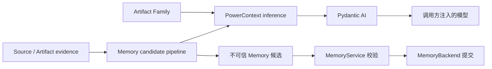

- 提案名称：`pydantic_ai_inference_integration`
- 开始日期：2026-07-21
- RFC PR：[oceanbase/powercontext#16](https://github.com/oceanbase/powercontext/pull/16)
- Tracking Issue：尚未分配
- 相关 RFC：[RFC 0002：Core SDK 产品模型](0002_core_sdk_product_model.md)
- 相关 RFC：[RFC 0014：Memory Layer 设计](0014_memory_layer_design.md)

# Summary

PowerContext 选择 Pydantic AI 作为统一的模型接入框架。第一期先在 Memory 中使用：生成模型从 Agent turn、任务结果和
其他有界 evidence 中提取 Memory 候选，embedding 模型为 Memory 检索生成向量。后续 Handoff 等 Artifact Family
可以复用同一套模型接入能力。

本 RFC 的核心边界是：Pydantic AI 负责调用模型，Artifact Family 负责定义模型要完成的业务任务，现有 Service 负责
校验和持久化。模型输出只是候选，不能直接成为权威 Artifact。

# Motivation

RFC 0014 已经定义 Memory 的版本、血缘、写入和检索能力，但还缺少两个模型入口：

1. 如何从非结构化工作过程判断“什么值得长期记住”；
2. 如何调用 embedding 模型支持向量检索。

如果 Memory、Handoff 和其他 Artifact Family 分别接入 OpenAI、Anthropic 等供应商，会重复处理认证、客户端、错误和
观测逻辑。PowerContext 也没有必要再建设一套 provider SDK。Pydantic AI 作为统一接入框架，可以减少重复集成，同时
利用结构化输出约束模型结果。

# Guide-level explanation

## 设计决策

## 统一接入，领域隔离



各层职责如下：

| 层 | 负责 | 不负责 |
| --- | --- | --- |
| Pydantic AI | 模型调用、供应商适配、结构化结果 | Memory 规则、Artifact 写入 |
| `inference` | 通用生成/embedding 能力、错误和 usage | 具体 Artifact prompt |
| Artifact Family | prompt、输入边界、输出含义 | 供应商客户端、数据库事务 |
| Service/backend | 领域校验、版本、血缘、并发和持久化 | 理解自然语言 |

PowerContext 不让 `MemoryService` 直接依赖 Pydantic AI Agent，也不让模型访问 backend、文件系统或任意工具。应用组装层
显式选择模型并提供凭证，PowerContext 不隐式读取模型配置。

## 按模型能力拆分

通用层分别提供结构化生成和 embedding 两种能力，而不是设计一个包含所有方法的万能 `Model`：

- `StructuredGenerator`：输入一个 Artifact Family 定义的任务，返回结构化结果；
- `EmbeddingModel`：输入一组文本，返回固定 profile 的向量。

这样 Memory 可以同时使用两种能力，其他 Artifact 也可以只选择自己需要的能力。未来若增加 reranking，应作为独立能力，
不扩充万能基类。

## 代码目录

`[新增]` 表示第一期创建，`[现有]` 表示复用或调整：

```text
src/powercontext/
├── inference/                      [新增]
│   ├── __init__.py                 [新增]
│   ├── errors.py                   [新增]
│   ├── models.py                   [新增]
│   ├── protocols.py                [新增]
│   └── pydantic_ai.py              [新增]
└── memory/                         [现有]
    ├── prompts.py                  [新增]
    ├── extraction.py               [新增]
    ├── candidates.py               [现有]
    ├── protocols.py                [现有，复用通用模型能力]
    ├── service.py                  [现有]
    └── backends/                   [现有]

tests/
├── inference/                      [新增]
└── memory/                         [现有，增加 extraction 测试]
```

只有 `inference/pydantic_ai.py` 直接导入 Pydantic AI。Memory 依赖通用模型能力，不依赖具体框架或供应商 SDK。
`pydantic-ai` 作为可选依赖；未安装时，确定性 Memory 写入和全文检索仍可使用。

## 第一期：Memory 接入 LLM

## LLM 解决什么问题

现有 `MemoryService` 能保存和管理 Memory，却不能理解一段对话或任务结果中哪些内容值得跨任务复用。LLM 负责：

- 提取用户偏好、已确认决定、约束、难以重新发现的事实和未完成进度；
- 排除普通日志、临时步骤、容易从代码读取的信息、推测和 secret；
- 把能够独立变化的主题拆成不同 entry；
- 对照当前 active entries，建议新增、修订或 no-op。

LLM 不负责判断最终真伪，也不负责生成 Revision、ID、hash 和 lineage。上述权威行为继续属于 Memory Service。

## 写入流程

Runtime 先把本次实际使用的工作材料保存为 Source/Artifact evidence，再显式调用 Memory：

```python
updated_memory = await memory_service.remember(
    memory=repo_memory,
    sources=(task_outcome,),
    mode="extract",
)
```

```text
持久化 evidence
    -> MemoryService 读取当前 active entries
    -> Pydantic AI 从 evidence 提取结构化候选
    -> candidate pipeline 转成 MemoryEntryInput
    -> MemoryService 校验 evidence、entry 和当前 Revision
    -> backend 原子提交新的 Memory Revision
```

模型只看到本次有界 evidence 和当前 active entries，不看到完整历史、其他 Memory、数据库或任意文件。模型只提出三种
结果：新增主题、修订当前主题、无内容可保存。停用和恢复仍由显式 `forget()`/`reactivate()` 完成。

`mode="append"` 继续用于显式写入，不调用模型。Source 写入本身也不会自动创建 Memory；何时触发提取由 runtime 决定。

## Coding Agent 示例

假设 repo Memory 已有规则：

```text
entry_verify：提交代码前运行 make check。
```

用户在一次任务中纠正 Coding Agent：

> 新增依赖必须使用 `uv add`，不要直接修改 `pyproject.toml`。依赖变化后除了 `make check`，还要运行 `make test`。

任务结束后，runtime 将用户消息和任务结果保存为 Source，然后调用 `remember(mode="extract")`。Pydantic AI 结合 Source
和当前 entry，返回两个结构化建议：

```text
ADD
  新增依赖必须使用 uv add，不要直接修改 pyproject.toml。

REVISE entry_verify
  依赖发生变化后运行 make check 和 make test。
```

这些建议还不是 Memory。Pipeline 将模型引用映射回本次 Source 和当前精确 entry version，`MemoryService` 再验证
evidence、重复内容和当前 Revision。校验通过后形成：

```text
repo Memory Revision 8
├── entry_dependency v1：新增依赖必须使用 uv add，不要直接修改 pyproject.toml。
└── entry_verify v2：依赖发生变化后运行 make check 和 make test。
```

之后，另一个 Coding Agent 接到“增加 HTTP 客户端依赖”的任务。Runtime 搜索 repo Memory，并在模型调用前注入上述两条
规则。新 Agent 因而会使用 `uv add`，并在完成后运行 `make check` 和 `make test`。

如果本次 Source 只有“测试通过，共 128 项”这类一次性日志，模型应返回 no-op，Memory 不创建空 Revision。接入 LLM 的
目标不是保存每个 turn，而是提取真正会改变未来 Agent 行为的信息。

## 信任边界

LLM 输出、Pydantic AI 结构化结果和 candidate pipeline 都位于不可信边界。关键约束为：

- 模型只能引用本次输入中的 evidence 和当前 active entry；
- 模型不能生成 Artifact/Revision/entry version identity；
- 模型不能直接写 backend 或调用 `forget()`；
- prompt 用于提高质量，不作为安全边界；
- 只有通过现有 Memory 校验和 head CAS 的候选才形成新 Revision。

因此“结构化输出有效”不等于“允许保存”。本 RFC 不改变 RFC 0014 的 Memory 持久化和一致性规则。

# Reference-level explanation

## Embedding 接入

结构化生成解决“应该记住什么”，embedding 解决“如何按语义找到已保存的内容”：

```text
写入提取：evidence -> 生成模型 -> Memory 候选
向量投影：Memory text -> embedding 模型 -> vector projection
向量查询：query -> embedding 模型 -> backend search
```

Pydantic AI 负责模型调用，PowerContext 继续负责 embedding profile 和索引兼容性。每个部署固定 model、dimension、
distance 和 normalization；查询与 Memory projection 必须使用相同 profile。更换 embedding 模型或维度仍按 RFC 0014
停写、迁移、全量回填和校验，不能静默复用旧向量。

生成模型和 embedding 模型相互独立。没有生成模型时可以显式写入 Memory；没有 embedding 时可以提交权威 Memory 并
使用全文检索。生成模型可用不代表 vector capability 可用。

## 失败、隐私与观测

- Memory 提取失败时不提交 Revision，也不把失败伪装成 no-op；
- embedding 暂时不可用时，权威 Memory 和全文 projection 仍可提交，`auto` 搜索降级到全文；
- timeout、限流和供应商错误映射为稳定的 PowerContext 推理错误，取消必须继续传播；
- 默认只记录模型标识、耗时、usage、输入/输出数量和错误类别；
- 默认不记录 prompt、原始 evidence、完整模型响应、向量或凭证；
- Memory lineage 继续引用实际 Source/Artifact evidence，不引用模型的原始响应。

## 一期范围与实施

第一期完成：

1. 新增通用 `inference` 层和 Pydantic AI adapter；
2. 将现有 embedding 端口收敛到通用模型能力，保持 RFC 0014 行为兼容；
3. 实现 Memory 专属 prompt 和 candidate pipeline；
4. 打通 `remember(mode="extract")` 的 Coding Agent 闭环；
5. 使用 fake/test model 覆盖结构化生成、embedding、失败和 no-op；
6. 提供一个显式注入模型的集成示例。

第一期不实现 Handoff 生成、reranking、多模态、模型路由、跨供应商 fallback、动态预算或在线 embedding profile 切换。

## 验收标准

- Pydantic AI 是内置的统一模型接入框架，Artifact Family 不直接接入供应商 SDK；
- 未安装 Pydantic AI 时，核心包和确定性 Memory 功能仍可使用；
- Memory 只把有界 evidence 和当前 active entries 提供给模型；
- 模型能够提出 add、revise 和 no-op，但不能直接改变权威状态；
- 模型失败不产生部分 Revision，embedding 失败按 RFC 0014 降级；
- embedding profile 不匹配时不复用旧向量或执行 vector/hybrid search；
- 默认测试不访问网络、不需要 API key；
- 默认 tracing 不泄露 prompt、evidence、完整响应、向量和凭证；
- 后续 Artifact Family 可以复用 inference 层，而不新增供应商客户端。

# Drawbacks

该方案引入 Pydantic AI 上游依赖和模型调用的延迟、成本、数据外发及运行时失败面。结构化输出只能约束格式，无法消除
模型的语义错误；因此仍需保留完整领域校验。

# Rationale and alternatives

考虑过以下方案：

- **每个 Family 直接使用 Pydantic AI**：代码更少，但第三方类型和重复集成会扩散到领域层；
- **PowerContext 自建 provider adapter**：控制力更强，但维护成本高且重复 Pydantic AI 的职责；
- **只为 Memory 写专用模型层**：一期更快，但 Handoff 等后续能力需要重复建设；
- **不接入模型**：确定性路径仍可用，但非结构化工作过程需要调用方手工转成 Memory。

# Prior art

Pydantic AI 提供本集成使用的 provider、model lifecycle、structured output、usage 和 embedding interface。
PowerContext 补充各 Artifact Family 所需的 domain validation 和 persistence boundary。

# Unresolved questions

- 接受 RFC 时锁定的 Pydantic AI 版本范围；
- Pydantic AI 对目标 embedding model 的支持是否满足一期，以及首批支持哪些 model；
- `EmbeddingModel` 是 canonical embedding model interface 名称；第一个发行版本不保留 legacy 兼容别名；
- Memory prompt 的版本是否需要进入 operation telemetry。

# Future possibilities

后续可增加 Handoff/摘要生成、reranking、多模态 evidence、模型路由和在线 embedding profile 迁移。这些能力继续复用
通用接入层，但各 Artifact Family 仍拥有自己的 prompt、输入边界、验证和持久化规则。
