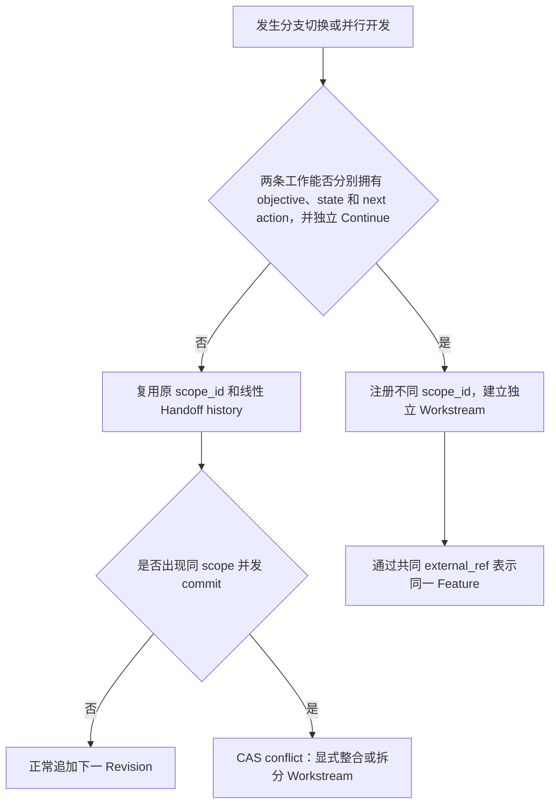
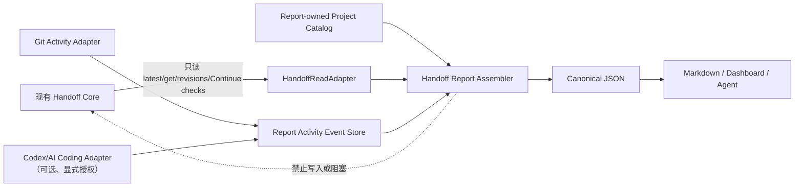
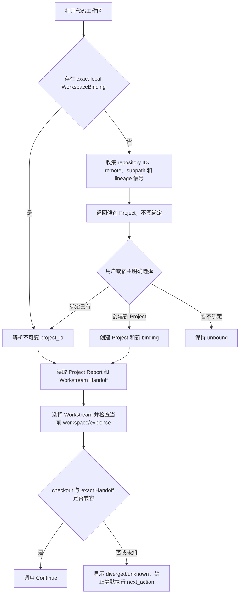
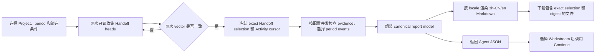
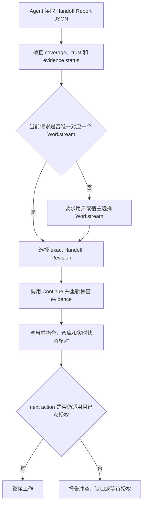

- Proposal Name: `handoff_report`
- Start Date: 2026-08-04
- Status: Draft
- RFC PR: [oceanbase/powercontext#82](https://github.com/oceanbase/powercontext/pull/82)
- Tracking Issue: 尚未分配
- Related RFCs: [RFC 0001](0001_product_definition_and_vision.md)、[RFC 0002](0002_core_sdk_product_model.md)、[RFC 0019](0019_local_source_memory_runtime.md)、[RFC 0020](0020_runtime_backed_memory_remote_access.md)、[RFC 0028](0028_context_pack.md)、[RFC 0048](0048_handoff_artifact.md)

# Summary

本 RFC 定义 Handoff Report：把一个 Project 下多个 Workstream 的已提交 Handoff 汇总成同一份可追溯交接报告，同时服务人类阅读和 Agent 继续工作。

Project 表示仓库、服务、产品组件或长期项目，是首版最大的正式层级，也是执行和报告聚合边界。Workstream 与现有 `scope_id` 一一对应，`scope_id` 是其唯一稳定身份。Task、Agent、Session、Git branch、状态、时间和外部 Issue 是筛选、导航或归因维度，不代替稳定的 Project/Workstream 主链。Project 不是 Handoff scope；它只读聚合 Workstream，不把汇总结果写回任一 scope。首版不定义 Project 之上的 Portfolio、Program 或跨 Project Feature 实体。

每份报告从同一个带版本的 canonical report model 产生两种投影：

- 人类视图是 `zh-CN` 或 `en` Markdown，默认 `zh-CN`，供 Dashboard 展示或下载；
- Agent 视图是 JSON，保留 exact Handoff Revision、原始 Handoff 内容、evidence check 和信任标记。

Agent 不需要也不应该反向解析 Markdown。Markdown 和 JSON 必须来自同一个精确 selection vector，不能各自生成不同总结。Dashboard 默认动态读取最新已提交 Handoff；导出文件携带 exact selection 和 digest，但首版不在 PowerContext 中持久化第二套 Report Snapshot。状态报告可以展示当前交接，也可以按周或月比较两个时间边界上的 Handoff Revision。首版支持 `zh-CN`、`en` 两种 Markdown locale 和语言无关的 canonical JSON，不支持跨 Project 聚合报告、HTML、PDF 或公开分享链接。

首版通过一个 `get_handoff_report` operation 生成报告：`format=markdown` 为默认的人类投影，`format=json` 返回 Dashboard 和 Agent 使用的 canonical model，`download` 只控制响应 disposition，不建立第二套 export 语义。报告同时携带与 locale 无关的 `selection_digest` 和面向具体输出的 `report_digest`。

Handoff Report 是可选、只读、可独立卸载的 Builtin Runtime feature。它只通过 `HandoffReadAdapter` 读取现有 exact Handoff，不修改 `PreparedHandoff`、`CommitHandoffRequest`、`HandoffBackend`、Handoff commit transaction 或现有 Artifact/Handoff 表。Project catalog、WorkspaceBinding、Activity Event、API、Dashboard 和 renderer 都由 Report 模块拥有；Report 失败、关闭或回退不得影响 Source、Memory、Context、Handoff 或 Continue。

## 评审重点

本 RFC 需要其他开发者重点评审以下设计是否足以进入实现：

- **层级和身份边界**：Project 是否适合作为首版最大正式层级；Workstream 直接复用 `scope_id`，不增加第二套 identity；跨 Project Feature 只使用 `external_refs` 弱关联。
- **分支和并行工作边界**：Branch 不作为 Handoff identity；仅切换、重命名或 rebase 分支时继续原 Workstream，而能独立 Continue 的并行分支必须使用不同 `scope_id`；同 scope 的并发写入继续遵循单线性历史和 CAS 冲突。
- **与现有 RFC 的职责划分**：Project catalog 是否应停留在 Builtin Runtime application layer；Report 是否保持 RFC 0048 Handoff 之上的只读 projection，而不形成新的 Artifact、Snapshot 或 Continue lifecycle。
- **一致性和可复现性**：批量 head resolution、catalog 历史快照和 exact selection vector 能否在 SQLite 与 OceanBase 上提供相同的 snapshot isolation；JCS/NFC digest 规范是否足够跨语言实现。
- **独立性和回退边界**：Report 是否只依赖稳定的 Handoff 只读能力；关闭 feature 后是否不注册 Report route/worker；所有新表是否都由 Report 命名空间拥有；Report 故障是否完全不进入 Handoff commit/Continue 路径。
- **周期和活动时间语义**：`occurred_at`、`observed_at`、`time_basis`、unknown-time event 和 temporal coverage 是否足以支持用户选择周/月/自定义周期，同时避免把首次观察时间伪装成 Handoff commit 时间。
- **无 Handoff 活动语义**：Git、Codex/其他 AI Coding Session 和本地 working tree 能否通过显式授权 Adapter 形成 `activity_without_handoff`，并确保生成摘要始终带 citation、保持不可信且不自动产生 disposition 或 next action。
- **周报/月报比较语义**：按时间边界解析 exact baseline/end selections 与 catalog descriptor 历史是否可实现；Workstream 新增、移除和归档变化是否完整；“没有新 Revision 不等于没有工作”和 `baseline_unknown` 的降级规则是否清晰。
- **API 和消费边界**：canonical JSON 是否足以同时支持 Dashboard、Python Client、CLI 和 MCP；`zh-CN`/`en` Markdown 是否应该继续保持确定性 renderer，而不是由 Agent 生成或解析。
- **本地化边界**：两套版本化 renderer 是否覆盖固定标题、状态标签、日期和提示；用户提供的 Handoff/Project/Workstream 原文不自动翻译是否符合预期。
- **安全和兼容性**：Project membership 不是 ACL、Report 保持 `untrusted_history`、未授权/不可用 Adapter 与未知历史时间显式降级的策略，是否符合现有 trust-domain contract 和迁移要求。
- **工作区重新绑定**：per-worktree `workspace_instance_id`、本机路径指纹、仓库候选信号和显式 attach/detach 流程，是否能正确处理目录改名、linked worktree、重新 clone、复制、fork 和 monorepo，同时明确“找到 Project”不等于“已经取得 Handoff 数据”。
- **性能和边界**：100 个 Workstream 的 evidence check 并发上限、可跳过检查的语义、10 MiB 输出上限与分批导出指引是否足以保护本地和远程 Runtime。

# Motivation

RFC 0048 解决了单个 scope 在会话边界如何交接，但它有意不定义 task/work identity、并行 workstream、Dashboard、export 和 transport schema。实际 vibe coding 项目往往同时推进多个 Feature。单份 Handoff 可以让 Agent 继续一个工作流，却不能回答项目负责人常见的问题：

- 整个项目有哪些工作流，分别处于什么状态；
- 哪些工作被阻塞，哪些已经完成，哪些可以继续；
- 每个工作流下一步是什么，依据在哪里；
- 最近一份正式交接由哪个 Agent 或 Session 产生；
- 如何把当前项目状态下载为一份可审阅、可归档的文档；
- 新 Agent 如何读取相同信息，同时保持 RFC 0048 的 evidence 和 trust boundary。

直接把多个 Handoff 拼成 Markdown 会制造两个问题。首先，Markdown 缺少稳定的机器契约，Agent 必须猜测标题和文本结构。其次，如果 Dashboard、导出文件和 Agent 输入分别调用生成模型，它们可能得到互相矛盾的总结。因此，本 RFC 先定义 canonical JSON，再用确定性 renderer 生成 Markdown：

```text
Project + Workstream registry + exact committed Handoffs
                         |
                         v
             canonical Handoff Report
                    /            \
                   v              v
       zh-CN/en Markdown      Agent JSON
        Dashboard/export     inspect/select/continue
```

# Guide-level explanation

## 如何划分范围

首版区分主层级和辅助维度：

| 维度 | 含义 | 是否形成 Handoff scope |
| --- | --- | --- |
| Project | 一个仓库、服务、产品组件或长期项目；首版最大正式层级和聚合边界 | 否，只聚合 Workstream |
| Workstream | 一个可以独立继续的 Feature、Bug、重构、运维或研究工作 | 是，身份就是 `scope_id` |
| External reference | Issue、任务、PR、分支、上游 Feature 或发布等可选关联 | 否，只用于导航和筛选 |
| Handoff Revision | Workstream 的不可变交接里程碑 | 使用现有 Handoff Artifact Revision |
| Agent/Session | 产生里程碑的可选归因 | 否，不是事实依据或权限身份 |

判断 Workstream 边界时使用一个简单规则：如果两部分工作可以拥有不同的 objective、disposition 和 next action，并且可以由不同 Agent 独立继续，它们应使用不同 Workstream 和不同 `scope_id`。一次很短的操作通常只是 Workstream 内的 Task；整个仓库通常是 Project，而不是单个 Workstream。小型项目可以只有一个 Workstream。

Workstream 的 `kind` 为 `feature`、`bug`、`refactor`、`operations`、`research` 或 `other`。`kind` 只用于展示和筛选，不改变 Handoff 行为。首版中一个 `scope_id` 只属于一个 Project；不再增加与它一对一的 `workstream_id`。

ToC 用户通常只有一个 Project，ToB 场景可以有多个 Project。首版不把跨 Project Feature 建模为领域实体；每个 Project 只建立自己能够独立 Continue 的 Workstream。例如同一结算需求可以分别形成 `checkout-api`、`checkout-web` 和 `checkout-observability`，它们可以各自通过通用 `external_refs` 指向同一个上游需求，但不会因此组成新的 PowerContext 层级。evidence、Handoff history、Report 和 Continue 都保持各自 Project/scope 边界。跨 Project 聚合需要额外解决 authorization、数据驻留和一致性，确认实际需求后再通过独立 RFC 设计。

Project grouping 和 Workstream 展示元数据必须由用户显式确认后保存。它们属于 Builtin Runtime application layer 的轻量 scope catalog，不进入 Core Protocol，也不拥有 Issue、Task、仓库或 Feature lifecycle。Dashboard 或宿主可以根据未分组的 scope、最新 Handoff objective、分支或 Issue 提供建议，但建议本身不创建关系，也不能自动移动已有 scope。

### Git 分支与 Workstream 边界

Branch 不决定 Handoff 边界，Workstream 决定。Server 不因为创建、切换、重命名、删除或 rebase branch 自动创建、合并或迁移 Workstream。判断是否复用 `scope_id` 时只看该工作能否保持同一个 objective、disposition、state 和 next action，并由一个 Agent 沿同一条历史安全 Continue。

| 场景 | Workstream/Handoff 规则 |
| --- | --- |
| 同一工作从 branch A 切换到 branch B，或临时分支、PR 分支、rebase 后的新分支 | 继续使用同一个 `scope_id` 和 Handoff history；branch 名变化本身不产生 Revision |
| 两个 branch 并行尝试不同实现方案，并且可以分别决定状态和下一步 | 建立两个 Workstream 和两个 `scope_id`，各自维护 Handoff history |
| `main` 与长期维护分支分别持续开发或发布 | 建立不同 Workstream，即使它们指向同一个 Feature/Issue |
| 同一 Feature 的前端、后端或不同存储实现能够独立推进 | 建立多个 Workstream；可用相同 Feature/Issue `external_ref` 表示关联 |
| 两个 branch 拥有不同 objective、disposition、state 或 next action | 必须拆分 Workstream，不能把两个 head 压进同一 Handoff |



如果多个 Agent 让两个活跃 branch 共用同一个 `scope_id`，系统仍只有一条线性 Handoff history、一个 current Revision 和一个 latest 状态。并发 commit 使用 RFC 0048 的 CAS：先提交者推进 head，后提交者得到 conflict，必须读取新 head 后显式整合内容，或在确认两条工作可以独立 Continue 后注册新的 Workstream。Report 不做自动 merge，也不把一个 scope 展示成两个 branch head。

Branch 只允许承担以下辅助角色：

- `external_refs(kind=branch)` 表示 Workstream 与分支的导航或筛选关联；
- workspace detect 中的 branch 是 weak candidate signal，不能认领 Project 或 Workstream；
- Report Activity Event 可以记录宿主在 Handoff commit 后观察到的 branch/head，作为不可信展示和诊断信息；它与 Handoff Revision 非原子，不能参与 identity、ACL、CAS、coverage 或 evidence validation。

Continue 校验以 exact Handoff evidence 和当前 checkout 的可验证关系为准。仅 branch 名不同不能判定 `diverged`；branch 名相同也不能判定 `aligned`。如果 exact commit/evidence 可验证为同一历史上的相同、领先或落后位置，可以报告 `aligned`、`ahead` 或 `behind`；出现不可兼容分叉时才报告 `diverged`，并禁止静默执行旧 `next_action`。

### 与现有 RFC 的边界

| 现有 RFC | 本 RFC 复用的定义 | 明确不新增或不改变的内容 |
| --- | --- | --- |
| RFC 0001 | PowerContext 为 Agent 提供可验证、可继续的项目上下文 | Report 是产品展示能力，不把管理报表变成新的事实源 |
| RFC 0002 | `scope_id` 继续是 Core SDK 的隔离和路由身份 | Project 不进入 Core Protocol；Workstream 不增加第二套 identity |
| RFC 0019 | Builtin Runtime 提供 Source、Memory 和关系型持久化基础 | Project catalog 不改变 Source/Memory 语义，也不读取原始正文拼接报告 |
| RFC 0020 | 首版部署继承单 trust domain 和现有远程访问约定 | Project membership 不是 ACL，不在本 RFC 内创造多租户授权模型 |
| RFC 0028 | Context Pack 继续承担一次 Agent turn 的上下文组装 | Report 不进入 `prepare_context`，也不自动注入或替代 Context Pack |
| RFC 0048 | Handoff Artifact、Revision、evidence、disposition 和 Continue 是 Workstream 交接事实 | Report 只是跨 scope 只读 projection，不复制 Handoff history、Artifact lifecycle 或 Continue 入口 |

因此，本 RFC 新增的是 application-layer Report Project catalog、独立 Activity Event Store 和确定性 report projection；它不增加 Handoff Revision metadata，不重定义 RFC 0002 的 Core 产品模型，也不创建与 RFC 0048 平行的交接对象。Report 模块不能要求修改 Core Protocol、Artifact identity、Prepared Handoff、commit request、Handoff persistence 或 trust-domain contract；需要这些变化的增强能力必须另立 RFC，不能隐含在 Report 实现中。



## 工作区发现和 Project 绑定

Project 不通过 title、目录名、仓库名或分支名识别。`project_id` 是系统生成且不可变的真实身份，`project_key` 是当前 catalog 内唯一的人类可读键，`title` 只用于展示并允许重复或修改。Agent 已持有 `scope_id` 时，通过 Workstream catalog 直接得到 `project_id`；首次打开新的代码工作区时，则通过 `WorkspaceBinding` 把当前 checkout 显式绑定到 Project。

宿主为每个 checkout 或 linked worktree 生成 `workspace_instance_id`。Git host 必须把它保存到当前 worktree 自己的 Git directory 下，例如先用 `git rev-parse --git-dir` 找到 worktree-specific directory，再写入未跟踪的 PowerContext client state；不得只使用 shared local Git config，因为多个 linked worktree 会共享该配置。非 Git host 使用自己的 workspace registry。目录改名不得改变该 ID。

本地 client registry 还保存 `host_instance_id`、canonical path fingerprint 和 Git directory fingerprint；这些值只在本机用于发现复制或误复用，不上传原始路径。若复制目录时连同 token 一起复制，或同一 token 同时出现在不同本机路径/Git directory 指纹下，宿主必须为副本轮换新 `workspace_instance_id` 并重新要求用户确认，不能让两个工作区静默共享实例身份。路径 fingerprint 变化但 Git directory identity 连续时按目录改名处理，不轮换 ID。

没有 exact local binding 时，`detect` 只返回候选 Project，不写关系。候选信号按以下强度排序：

| 信号 | 强度 | 用途 |
| --- | --- | --- |
| 已确认的本地 `workspace_instance_id -> project_id` | exact | 直接恢复绑定，但仍重新验证当前 workspace |
| Git provider 的不可变 repository ID + monorepo subpath | strong | 推荐已有 Project |
| 去除凭据并规范化的 remote URL + subpath | strong | repository ID 不可用时推荐 |
| Git commit lineage、相同 external reference 或 `project_key` | weak | 只用于候选排序 |
| title、目录名、仓库显示名或 branch | weak | 只用于解释候选，不能单独认领 Project |

候选无论强弱都不授予权限。除 exact local binding 外，用户或宿主 policy 必须明确选择“绑定已有 Project”“创建新 Project”或“暂不绑定”。复制、fork 或修改 remote 的工作区天然有歧义，不能仅凭文件相同自动继承 Project 或 Handoff history。



典型场景按以下规则处理：

| 场景 | 结果 |
| --- | --- |
| 只修改本地目录名 | 本地 binding 保持不变，继续使用原 `project_id` |
| 同一仓库重新 clone，包括重新下载原分支 | 返回已有 Project 候选；确认 attach 后读取原 Handoff，branch 只帮助推荐 Workstream |
| 下载 ZIP 或其他不含 Git 元数据的代码包 | 没有可靠 repository candidate；用户必须按 exact `project_id` 或 `project_key` 选择，目录名只能辅助展示 |
| `cp` 一个包含 `.git` 的目录 | 为副本生成新的 `workspace_instance_id`，要求选择作为原 Project 的新 workspace 或新 Project |
| Fork 到新远端 | 默认推荐创建新 Project；可以保留来源 external reference，但不自动继承 Handoff history |
| Monorepo | 使用 provider repository ID 或 normalized remote 加规范化 subpath 区分 Project |
| 同名但无可靠 repository 关系 | 不自动关联，即使 title 或目录名完全相同 |

绑定只回答“应向哪个 Project 查询”，不负责传输 Handoff。重新 clone 后只有在当前 Client 能访问保存该 Project 的同一个 Runtime/catalog 时，才能取回 Handoff；如果历史只存在另一台机器的本地 SQLite，系统必须显示 `handoff_data_unavailable`，不能假装通过 Git 恢复。跨 Runtime 导出/导入或复制 Project history 需要独立设计。

Attach 后也不能直接执行旧交接。Continue 必须把 exact Handoff evidence 与当前 checkout/Source adapter 核对，并报告 `aligned`、`ahead`、`behind`、`diverged` 或 `unknown`。除 `aligned` 外的状态不必全部阻止读取 Report，但 `diverged`、缺少 exact evidence 或 policy 要求重新确认时不得静默执行旧 `next_action`。

## 项目级 Dashboard

Handoff Report 复用 Server 已有的 FastAPI + Jinja Web UI 宿主，在 `/handoff-reports` 提供独立页面；根路径 `/` 的 scoped statistics Dashboard、scope 选择和统计逻辑保持不变。公共 layout、bearer token session storage、中英文切换和 light/dark theme 可以复用，但报告数据只来自公开 Report API。页面先分页读取 Project catalog，再以不可变 `project_id` 作为标签页身份；标签同时显示 Project title 和完整 `project_id`，切换标签只替换当前 Project 的 canonical report，不改变或合并其他 Project 的 Handoff。Handoff Report feature 关闭时不注册该页面、Report route 或静态执行逻辑。

Project Overview 默认展示所有 included Workstream 的最新已提交 Handoff，并包含：

- 报告生成时间、覆盖范围和 exact selection；
- `continuable`、`blocked`、`complete` 和 `no_handoff` 数量；
- Blocker 优先的 Workstream 表格；
- 每个 Workstream 的 objective、当前 state、disposition、next action 和 omissions；
- exact evidence reference 及其可读性检查；
- 从 Report Activity Adapter 观察到的 Git、Agent/Session、branch/head 和本地代码活动，以及对应时间依据；
- 工作状态 coverage 和报告质量 coverage，避免把片面记录展示成完整项目状态；
- 查看 Markdown、下载 `.md`，以及生成周报、月报和两个 exact selection 对比的入口。

状态不仅通过颜色表达，必须同时显示文本和图标。没有已提交 Handoff 的 Workstream 显示 `no_handoff`；如果 Report Adapter 仍观察到活动，则另行显示 `activity_without_handoff`，不能把活动摘要伪装成正式交接。已有 Handoff 后出现带可比较时间的 Activity Event 时显示 `activity_after_handoff` 和事件数量；该数量只代表 Report 已捕获事件，不等同于提交数、Task 数、工时、完整 Source coverage 或完成比例。缺少可靠时间、Adapter 不可用或历史在启用 Report 前已经发生时显示 `unknown`。Dashboard 不从 branch 名、文件 mtime、Memory 或残缺 Session history 猜测正式进度。

Dashboard 提供三个核心页面：

1. Project Overview：汇总和筛选 Workstream；
2. Workstream Detail：展示当前 Handoff、evidence check 和该 scope 的 Revision 历史；
3. Periodic Report：按周、月或自定义时间窗口展示正式 Handoff 变化、观察到的代码/Session 活动、时间可信度、覆盖缺口和与上一周期的比较。

筛选支持 Workstream `kind`、Handoff `disposition`、Activity source、Agent label、external reference（包括 `kind=branch`）、time basis，以及是否包含 archived Workstream。筛选后的报告必须显示 `selected_workstreams` 与 `total_included_workstreams`，不能让局部结果看起来像完整项目。一个 Workstream 在任一 report boundary 只能出现一个 exact Handoff Revision 或 `no_handoff`；Report 不按 branch 复制同一个 scope。

Dashboard 的“未分组 scope”来自 Report-owned `KnownScopeProjection`，不是 UI 猜测。只读 discovery Adapter 从当前 Runtime 能证明存在的 scope-bearing application behavior 收集 opaque `scope_id`，Report Store 对结果去重并记录 first/last seen；首版至少覆盖可读 Handoff，其他 Source/Memory/Trigger discovery 仅在已有稳定只读接口时启用。该 projection 只承诺列出“Adapter 已知的 scope”，不承诺枚举外部系统中的所有可能 scope，也不创建 Project membership 或写入 Core。`list_handoff_report_known_scopes` 分页返回可用信号和当前 Report Project（若有），供用户确认注册 Workstream。

## 动态报告和 exact selection

Dashboard 的默认报告是动态生成：Report 模块通过只读 Adapter 两次收集候选 Workstream 的 Handoff head；两次 vector 相同才冻结为 `optimistic_stable` exact selection，不同则有界重试，持续变化时返回 `handoff_report_busy`。同时在 Report 自有数据库事务中冻结 Activity Event cursor。后续 Handoff commit 或 Activity capture 不会改变已经冻结的 exact Handoff refs 和 activity cursor。返回的 Markdown/JSON 包含 selection、规范化筛选条件、selection consistency、activity cursor、selection digest 和 report digest，因此同一文件可以被审阅、归档或作为以后比较的 exact baseline。



首版不在 PowerContext 数据库中保存 Report Snapshot。报告是 Runtime application layer 的只读 projection，不是 Source、Artifact 或新的 evidence。需要长期保留时，由调用方保存导出的 Markdown/JSON；PowerContext 可以读取调用方再次提供的 exact selection 做比较，但不会把外部文件自动导入任一 scope。未来若需要服务端持久化项目级 Snapshot，必须单独定义 Project-level Artifact identity、cross-scope provenance、retention 和 authorization，不能创建一套平行 Artifact lifecycle。

## 人类和 Agent 使用同一份报告

Markdown 的固定结构如下：

```markdown
---
schema: powercontext.handoff-report.v1
locale: zh-CN
format: markdown
project_id: prj_01K...
project_key: powercontext
report_kind: handoff
selection_digest: sha256:...
report_digest: sha256:...
trust: untrusted_history
---

# PowerContext 项目交接报告

## 项目概览
## 阻塞事项
## Workstream 状态
## Workstream 详情
### parser-error-handling (PC-142)
#### 目标
#### 当前进度
#### 下一步
#### 缺失信息
#### Evidence
## 报告元数据
```

`locale=en` 使用相同语义顺序和以下英文标题：

```markdown
---
schema: powercontext.handoff-report.v1
locale: en
format: markdown
project_id: prj_01K...
project_key: powercontext
report_kind: handoff
selection_digest: sha256:...
report_digest: sha256:...
trust: untrusted_history
---

# PowerContext Project Handoff Report

## Project Overview
## Blockers
## Workstream Status
## Workstream Details
### parser-error-handling (PC-142)
#### Objective
#### Current Progress
#### Next Action
#### Omissions
#### Evidence
## Report Metadata
```

两套 renderer 必须保持相同 section key、语义顺序和 canonical fields，只本地化固定标题、状态标签、日期格式和系统提示。Handoff statement、Project/Workstream title、objective、next action、omissions 和 external reference 等用户原文按原语言输出，首版不调用模型或翻译服务自动翻译。Canonical JSON 的字段名、枚举值和 Agent contract 不随 locale 改变。

YAML front matter 只帮助人和工具定位报告，不是 Agent 的稳定解析接口。Workstream 三级标题固定为 `<title> (<key>)`，没有 key 时使用不可碰撞的 scope 短标识；即使 title 重复也能稳定定位。所有来自 Handoff 或用户元数据的文本都按不可信纯文本转义；链接只由 typed reference 生成。

Agent 通过 JSON 读取同一份报告。项目级报告帮助 Agent 了解全局并选择 Workstream，但不授权执行多个 next action。真正继续工作前，宿主或用户必须选定 Workstream；Agent 随后以报告中的 exact Handoff Revision 调用 RFC 0048 的 Continue 链路，再与当前请求、仓库和实时工具结果核对：



Project 报告中的 `objective` 仍然是历史信息。它不能替代当前用户请求，也不能让 Agent 自动选择优先级。

## 导出和展示

Dashboard 和下载使用同一个 `get_handoff_report` operation。Dashboard 以 `format=json` 获取 canonical model 并渲染交互页面；Markdown 标签页和下载使用服务端 renderer。`format` 省略时为 `markdown`，响应使用 `text/markdown; charset=utf-8`；`download=true` 只增加安全的 `Content-Disposition` 文件名，不改变 selection 或报告内容。调用方显式请求 `format=json` 时得到 `application/json` canonical report。这样展示与导出不会形成两组重复 operation 或漂移的语义。

首版接受 `locale=zh-CN` 和 `locale=en`。请求显式 locale 时按请求渲染；省略时使用 Project `default_locale`，新 Project 默认 `zh-CN`，旧 Project 缺少该字段时也迁移为 `zh-CN`。其他 locale 返回 `unsupported_report_locale`，不能静默回退。Dashboard 固定标签和 Markdown 下载使用同一 locale；JSON 保留该 locale 作为投影元数据，但不翻译 canonical fields。HTML、PDF、DOCX 和公开分享链接不属于首版。

## 项目交接、周报和月报

同一个 canonical model 支持两种 `report_kind`：

| kind | 用途 | selection |
| --- | --- | --- |
| `handoff` | 展示当前已报告、可供人或 Agent 接手的项目状态 | 一个 optimistic-stable 或 caller-provided exact Handoff selection + Activity cursor |
| `periodic` | 展示一周、一月或自定义期间的正式交接变化与观察活动 | period Activity Event selection + optional exact/observed Handoff baseline/end |

`periodic` 请求包含 `period.start`、`period.end`、可选 IANA `timezone` 和可选 `compare_to_previous_period`。时区优先级固定为请求显式 timezone，其次是 Project `timezone`；不读取 Server、进程或浏览器本地时区。两者都缺失或非法时返回 `invalid_report_period`。周报默认使用 ISO week，月报使用所选时区的自然月。

周期筛选只使用 Report Activity Event 的显式时间语义：`source_reported` 使用来源提供的时间，`host_observed` 使用宿主 capture 时间，`first_seen` 只能表达 Report 首次发现，`current_only` 只能进入“当前未提交活动”，`unknown` 进入 unknown-time coverage。Git commit time、Codex Session time 和 Agent 自报时间都不是审计时间，报告必须显示 `time_basis`。文件 mtime、Revision number 和当前 branch 不能用于反推历史日期。

现有 Handoff 没有 authoritative commit timestamp。周期报告只有三种 Handoff temporal basis：调用方提供 exact baseline/end selection 时为 `exact_input`；Report Activity Store 已记录带 exact Handoff ref 的 observation 时为 `observed`；否则为 `baseline_unknown`/`end_unknown`。`observed_at` 不能命名或展示为 `committed_at`。历史边界未知不阻止同周期 Git/Session activity 汇总，也不允许用当前 latest 冒充历史 end state。

周报/月报的 Markdown 固定包含：

1. 本期概览和报告覆盖度；
2. 本期正式 Handoff 变化；只有 exact/observed Handoff 的 disposition 变化可以进入“已报告完成”；
3. Git commit、working tree、Codex/AI Coding Session 和其他已启用 Adapter 的观察活动；
4. `activity_without_handoff`、`unassigned_activity` 和 unknown-time activity；
5. objective、disposition、state、next action 和 omissions 的 before/after，仅在 Handoff temporal coverage 足够时展示；
6. 下期动作，严格来自期末 exact/observed Handoff 的 `next_action`；
7. known omissions、evidence unavailable、Adapter unavailable、时间依据和历史覆盖缺口；
8. 可选、带 citations 的 `generated_untrusted` 叙述摘要。

`PeriodChangeSummary` 还必须明确列出 Workstream membership 变化：`added`、`removed`、`archived`、`unarchived`，并保留起止边界的 descriptor snapshot。周期报告两端使用同一组规范化筛选条件；“removed”表示该 scope 在期末不再属于本次 Project selection，不等于删除 Handoff history。为支持该语义，每次 Project/Workstream descriptor CAS 更新都写入带服务端 `effective_at` 的不可变 catalog revision，temporal selector 按边界读取对应 descriptor；只有当前值而没有历史 revision 的 legacy catalog 项显示 `catalog_baseline_unknown`。

差异比较只使用 exact reference、Report Activity Event 和字段的确定性变化，不通过模型推断原因、工时或完成百分比。一个期间没有新 Revision 只能说明“没有观察到新的正式交接”，不能自动写成“没有开展工作”。可选叙述摘要必须标记 `generated_untrusted`，每个结论引用 exact Handoff、Activity Event、Git commit/diff 或 Session event；它不能设置 `disposition`、声明代码正确、生成已授权 `next_action`，也不能覆盖 canonical fields。

# Reference-level explanation

## 领域模型

### Project 与 Workstream

```text
ProjectDescriptor
  schema: "powercontext.project.v1"
  project_id: stable opaque id
  project_key: catalog-unique human-readable key
  title: human-readable title
  description: optional plain text
  default_locale: "zh-CN" | "en"
  timezone: IANA timezone used by periodic reports
  catalog_state: included | archived
  version: CAS version

WorkstreamDescriptor
  schema: "powercontext.workstream.v1"
  scope_id: canonical Workstream identity and Runtime routing key
  project_id: owning report group
  key: optional human-readable short key, not identity
  title: human-readable title
  kind: feature | bug | refactor | operations | research | other
  catalog_state: included | archived
  external_refs: optional typed external references
  labels: optional display/filter labels
  version: CAS version
```

Project 和 Workstream 描述符是可变的报告目录记录，不是 Artifact，也不拥有外部 Project 或 Task 的业务生命周期。更新 title、labels 或 catalog state 不改变已有 Handoff Revision，但每次成功 CAS 更新必须追加带服务端 `effective_at` 的不可变 catalog revision，供 periodic report 还原边界成员和名称。报告包含生成时的 descriptor snapshot，因此已保存的外部文件不会随以后重命名而变化。归档 Project 和 Workstream 都不删除 scope 或 Handoff history；`list_projects`、detect candidate 和动态报告默认排除 archived 记录，调用方可以用 `include_archived=true` 显式读取，按 exact `project_id` 的 `get_project` 仍可返回 archived Project。

`project_id` 由 Server 生成，在一个 Runtime/catalog 内不可变且唯一。`project_key` 在同一 catalog 内唯一，供 CLI、URL 和人工选择使用；修改 key 必须通过 CAS 并保留冲突检查，但不能改变 `project_id`。Workstream `key` 在所属 Project 内对非 `null` 值唯一，允许修改且不作为 identity；CLI 可以接受 `project_key/workstream_key` 作为便捷输入，但必须先解析并回显 exact `project_id`/`scope_id`，HTTP 关系和 selection 只接受 exact identity。`title` 可以重复和修改。API 内部关系、Workstream membership、Handoff Report selection 和持久化外键只使用 `project_id` 和 `scope_id`，不得使用 key 或 title 作为 identity。

`external_refs` 是 `{kind, provider, external_id, url?}` 的有界数组，`kind` 为 `issue`、`task`、`pull_request`、`branch`、`feature`、`release`、`program` 或 `other`。多个 Project 的 Workstream 可以引用同一个上游对象，但引用只用于导航和筛选，不建立 PowerContext 内部父层级，也不作为 Handoff evidence；需要支持陈述时仍必须使用 RFC 0048 定义的 citation。

### WorkspaceBinding

```text
WorkspaceBinding
  schema: "powercontext.workspace-binding.v1"
  workspace_instance_id: opaque id for one local checkout
  project_id: exact owning Project identity
  repository_ref:
    provider: github | gitlab | local | other
    repository_id: optional immutable provider repository id
    normalized_remote: optional credential-free normalized remote
    subpath: optional normalized repository-relative project root
  state: confirmed | detached
  confirmed_at: UTC timestamp
  version: CAS version
```

一个 workspace 同一时刻最多有一个 confirmed Project binding；一个 Project 可以拥有多个 workspace binding。Candidate 不是持久化 binding，只有显式 attach 才写入。`workspace_instance_id` 不是 Project、scope、ACL 或跨设备身份；它只用于区分本地 checkout。Detach 只解除关系，不删除 Project、scope 或 Handoff。

首次 attach 使用 expect-absent CAS：请求的 `expected_version=null` 明确表示调用方观察到“当前不存在 binding”，只有 Server 仍未找到该 `workspace_instance_id` 的 confirmed/detached record 时才成功；如果记录已存在则返回 `workspace_binding_conflict`。后续 attach/detach 必须携带 exact 非空 version。

`repository_ref` 是发现提示而不是身份或 evidence。Client 必须在发送前移除 remote 中的 user info、token 和 query secret；Server 不保存原始绝对路径。Branch、HEAD commit 和 commit lineage 可以作为 detect 请求中的瞬时信号，但不写入 binding identity。候选比较必须对 provider、remote 和 subpath 使用版本化 normalization，以免不同 Client 得到不一致结果。

### 独立 Activity Event Store 和 Adapter

现有 Handoff Artifact 没有 commit 时间、Source coverage 或参与者字段，本 RFC 不修改它。周期和无 Handoff 活动由 Report 模块自己的 `ReportActivityEvent` 表达：

```text
ReportActivityEvent
  schema: "powercontext.handoff-report-activity.v1"
  event_id: server-generated stable id
  project_id: owning Report Project
  scope_id: optional explicitly associated Workstream
  source: handoff_observation | git_commit | git_worktree | coding_session | other
  source_event_id: adapter-stable idempotency key
  source_ref: optional typed external reference
  occurred_at: optional source-provided timestamp
  observed_at: server UTC ingestion timestamp
  time_basis: source_reported | host_observed | first_seen | current_only | unknown
  title: optional untrusted display text
  summary: optional untrusted source summary
  agent:
    provider: optional host provider
    label: optional display label
  session_id: optional opaque source session id
  vcs_context:
    branch: optional untrusted display label
    head_revision: optional opaque VCS revision
  evidence_refs: bounded typed references
  trust: "untrusted_observation"
```

Report repository 对 `(source, source_event_id)` 强制唯一，使 Adapter retry 幂等；`observed_at` 由 Report Server 写入，`occurred_at` 与 `time_basis` 由 Adapter 提供并保持来源语义。Project 通过 confirmed WorkspaceBinding 关联。只有 Adapter 或宿主显式提供 `scope_id` 且该 scope 属于 Project 时才归入 Workstream；否则进入 Project 级 `unassigned_activity`，不能根据 branch、文件路径、Session title 或模型猜测 Feature。

首版定义两个只读/摄取端口：

```text
HandoffReadAdapter
  latest(scope_id) -> Handoff | null
  get(scope_id, exact_ref) -> Handoff
  revisions(scope_id) -> ordered Handoff[]
  check_evidence(scope_id, exact_ref) -> checks

ActivitySourceAdapter
  scan(project_binding, after_cursor) -> events + next_cursor
```

`HandoffReadAdapter` 适配现有公开 application behavior，不修改 Handoff protocol。它可以把首次发现的 exact Revision 写成 `handoff_observation`，其时间只能是 `first_seen`。宿主也可以在 commit 成功后另行调用 Report 的 `record_report_activity`，记录 `host_observed` Handoff event；该调用与 Handoff commit 非原子，失败、超时或关闭 Report 都不能改变 commit 结果。

首版内置 Git Activity Adapter，读取 exact commit、branch/ref 和当前 working tree diff：Git timestamp 标记 `source_reported`，未提交 diff 标记 `current_only`，文件 mtime 不进入历史周期。Codex 或其他 AI Coding 工具通过可选 Adapter 接入，只允许使用工具公开 API、export 或 hook，并要求用户显式授权；不得抓取私有数据库或默认保存完整 prompt、工具输出、绝对路径和 secrets。Adapter 不可用时报告 coverage gap，而不是把“没有读取到”写成“没有活动”。

Agent、Session、branch 和 head revision 都是不可信观察元数据，不是 actor、workspace 或 evidence identity，不能参与 ACL、授权、CAS、Handoff coverage、evidence validation 或冲突处理。只有同一 commit/revision 另有可解析 typed evidence 时才构成 exact evidence。

### Canonical report model

```text
HandoffReport
  schema: "powercontext.handoff-report.v1"
  trust: "untrusted_history"
  locale: "zh-CN" | "en"
  format: markdown | json
  report_kind: handoff | periodic
  generated_at: UTC timestamp
  renderer_version: versioned renderer id
  project: ProjectDescriptor snapshot
  project_revision: exact catalog revision
  filters: normalized filters
  period: optional {start, end, timezone}
  selection_consistency: exact_input | optimistic_stable
  activity_cursor: exact Report Activity Store cursor
  baseline_selection: ordered ReportSelectionEntry[] | null
  end_selection: ordered ReportSelectionEntry[]
  activity_selection: ordered ActivitySelectionEntry[]
  selection_digest: locale-independent sha256 over canonical selection envelope
  report_digest: sha256 over canonical report payload
  coverage:
    total_included_workstreams
    catalog_matched_workstreams
    selected_workstreams
    missing_handoff_workstreams
    reported_with_omissions
    unchecked_evidence_workstreams
    unavailable_evidence_workstreams
    activity_without_handoff_workstreams
    activity_after_handoff_workstreams
    unassigned_activity_events
    unknown_time_events
    enabled_activity_sources
    unavailable_activity_sources
  summary:
    continuable_count
    blocked_count
    complete_count
    no_handoff_count
  changes: optional deterministic PeriodChangeSummary
  unassigned_activity: ordered ReportActivityEvent[]
  generated_summary: optional {trust: generated_untrusted, text, citations[]}
  workstreams: ordered WorkstreamReport[]

ReportSelectionEntry
  scope_id
  workstream_revision: exact catalog revision
  status: selected | no_handoff
  handoff_ref: exact ArtifactRef | null

ActivitySelectionEntry
  event_id
  source
  source_event_id
  occurred_at: timestamp | null
  observed_at: timestamp
  time_basis

WorkstreamReport
  workstream: WorkstreamDescriptor snapshot
  handoff_ref: exact ArtifactRef | null
  content: HandoffContent | null
  evidence_checks: HandoffEvidenceCheck[] | not_checked
  reporting_status: reported | reported_with_omissions | evidence_unavailable | no_handoff
  activity_status: no_observed_activity | observed_activity | activity_without_handoff | unknown
  handoff_activity_relation: activity_after_handoff | no_observed_activity_after_handoff | unknown | null
  observed_activity_count: integer
  activities: ordered ReportActivityEvent[]
  baseline: optional exact prior Handoff content and checks for periodic reports
```

`summary` 只由期末 `content.disposition` 和是否存在 Handoff 确定性计算。部署可以关闭生成能力；开启时 `generated_summary` 是与 deterministic summary 分离的可选 projection，必须带 citations 和 `generated_untrusted`，不能修改任何 status/count/selection。Workstream 排序固定为 `blocked`、`continuable`、`no_handoff`、`complete`，同组按规范化 title 和 `scope_id` 排序；Activity Event 按有效 period time、`observed_at`、`event_id` 排序。JSON object 和数组使用稳定顺序，以支持可重复渲染和摘要计算。

`selection_digest` 与语言和 renderer 无关，输入是 `{schema, project_id, project_revision, normalized_filters, normalized_period, selection_consistency, activity_cursor, baseline_selection, end_selection, activity_selection}` 的 canonical selection envelope；每个 Handoff entry 固定 Workstream catalog revision 和 Handoff Revision/`no_handoff`，每个 Activity entry 固定 Report-owned event identity，因此重命名、归档、新 commit 或新 capture 不会改变已生成报告。它回答“选择的是同一批状态和观察事件吗”。`report_digest` 输入是除 `report_digest` 字段本身外的完整 canonical report payload，包含 format、locale、renderer version、generated_at、descriptor snapshots、checks、activities、generated summary 和 selection digest；它回答“得到的是同一份具体输出投影吗”。两者都使用 SHA-256 和 RFC 8785 JSON Canonicalization Scheme，并在 canonicalization 前把所有字符串规范化为 Unicode NFC、timestamp 规范化为 RFC 3339 UTC 微秒 `Z` 形式。digest 输入不允许浮点数；数组保持 schema 规定的稳定顺序，`null` 不得省略。Markdown front matter 同时携带两种 digest。

报告默认以 `include_evidence_checks=true` 对每个 exact Handoff 执行 RFC 0048 的 evidence readability check。调用方可以显式设为 `false`；此时不得伪装成 available，而是返回 `evidence_checks=not_checked` 并计入 `unchecked_evidence_workstreams`。Dashboard Overview 可以为低延迟使用 `false`，详情和下载默认使用 `true`。检查按配置的有界并发执行，默认最多 8、部署上限 32，保持输出顺序；单项超时或不可用只把对应 statement 标为 unavailable，不删除其他 Workstream，并在 Project Overview 显示不完整警告。该检查只证明引用仍可读取，不证明陈述在当前 workspace 中仍为真。

### 进度、覆盖度和 Agent 中断

Handoff 的 `disposition` 表示已提交内容所描述的工作状态，不表示报告完整性，也不是百分比进度。报告分别展示：

- work status：`continuable`、`blocked`、`complete` 或 `no_handoff`；
- reporting status：是否存在 Handoff、known omissions 和不可用 evidence；
- observed activity status：Report Adapter 是否捕获 Git/Session/working-tree 等活动，以及活动是否缺少 Handoff；
- handoff/activity relation：在时间可比较时，是否观察到 Handoff observation 之后的 Activity Event；
- temporal coverage：周期边界是 caller-provided exact、Report-observed 还是 unknown；
- adapter coverage：哪些 Activity source 已启用、成功、不可用或未授权。

Agent 正常在边界 prepare/commit 时，当前报告通过 `HandoffReadAdapter` 读取 latest Revision。Agent 意外中断或没有正式 Handoff 时按以下顺序降级：

1. 已有新 committed Handoff：展示其中 state、next action、omissions 和 evidence checks；
2. 没有新 Handoff，但观察到时间可比较的 Git/Session/其他事件：保留旧 Handoff，并标记 `activity_after_handoff` 和已捕获事件数量；
3. scope 从未 commit Handoff，但观察到活动：显示 `no_handoff + activity_without_handoff`，允许生成带 citations 的活动摘要，但不生成正式 disposition/next action；
4. 只有当前 working tree diff：显示 `current_only`，不把它放入历史周期；
5. Activity Adapter 未启用、未授权、失败或历史时间不可比较：显示 `unknown` coverage，不写成“没有活动”；
6. known omission 或 evidence unavailable：在对应 Workstream 和项目 coverage 中显式计数。

系统不能检测未被任何 Adapter 捕获的活动，也不能从 code diff、commit message、Session 文本或不完整 Handoff 推断未知事实。因此 Markdown 必须把“正式 Handoff 进度”“观察活动”“生成叙述”和“报告覆盖质量”分开，禁止把 Activity 数量或 `complete` Workstream 数量换算成项目完成百分比，除非未来存在独立、权威的计划和 deliverable model。

## 一致性和并发

动态 Handoff 或 periodic report 使用以下一致性规则：

1. Report repository 在自己的 SQLite/OceanBase read transaction 中冻结 Project descriptor revision、Workstream catalog membership、Activity Event cursor 和该 cursor 之前的 events；该事务不读取或锁定 Handoff persistence；
2. `HandoffReadAdapter` 按稳定 `scope_id` 顺序读取所有候选 head 两次；两个 vector 相同则标记 `selection_consistency=optimistic_stable`，不同则从 catalog snapshot 重新开始有界重试，默认 3 次、部署上限 5 次；持续变化返回 `handoff_report_busy`；
3. Report 不声称获得跨 scope Handoff database snapshot。optimistic stability 只证明两次收集期间没有观察到 head 变化；需要数据库级原子 snapshot 的能力不属于首版，也不能通过修改 HandoffBackend 实现；
4. 第一阶段应用 Report catalog filters，例如 kind、labels、external reference、catalog state，并记录 `total_included_workstreams` 与 `catalog_matched_workstreams`；
5. head vector 稳定后只读取 exact Handoff content，再应用 disposition 等 Handoff-derived filters；Activity source、Agent label、time basis 和 period filters 只作用于 frozen activity selection；最终 `end_selection` 和 `activity_selection` 都不再读取 moving latest/cursor；
6. caller-provided exact baseline/end 使用 `selection_consistency=exact_input`。自动 periodic baseline/end 只能使用 Report-owned Handoff observation events，并标记 temporal basis `observed`；没有 observation 时保持 unknown；
7. Server 自己解析出的 exact Revision 在同一 operation 后续无法读取时失败为 `handoff_report_inconsistent`；调用方提供的 foreign、已清理或无法在当前 Runtime 解析的 exact selection 返回 `selection_not_resolvable`；
8. 后续 Handoff commit、Report Activity capture 或 catalog update 不改变已冻结的 exact refs、catalog revisions 和 activity cursor；
9. `selection_digest` 只覆盖语言无关的 canonical selection envelope；locale、renderer version 和 generated time 只进入 `report_digest`，因此相同 selection 的中英文报告具有相同 selection digest、不同 report digest。

Report 读取不锁定 Workstream，也不阻止 Handoff commit。Project 的成员 scope 必须可通过同一个 Runtime 的 `HandoffReadAdapter` 读取；首版不承诺跨 Runtime、跨数据库或跨 trust domain 的一致性读。Report Adapter、worker、LLM 或数据库错误都只能使 Report operation/coverage 失败，不能传播到 Handoff prepare、finalize、commit 或 Continue。

分支并发不改变该一致性模型。同一 `scope_id` 无论关联多少 branch，都只解析一个 Handoff head，并依赖 commit CAS 防止覆盖；不同 `scope_id` 即使具有相同 Feature/Issue `external_ref`，也作为独立 Workstream 分别进入 selection 和报告。Assembler 不根据 branch 名自动合并、拆分或选择 Revision。

## API contract

`openapi/powercontext.yaml` 继续是 HTTP source of truth。所有新增 operation、schema 和 tag 都位于 `handoff-reports` namespace；关闭该可选 feature 时不注册这些 route。现有 Handoff operation 和 schema 保持字节级兼容。所有请求和错误保持现有 Bearer authentication、request ID 和 typed error envelope 约定：

| operationId | HTTP path | 作用 |
| --- | --- | --- |
| `create_handoff_report_project` | `POST /v1/handoff-reports/projects/create` | 显式创建 Report-owned Project |
| `get_handoff_report_project` | `POST /v1/handoff-reports/projects/get` | 读取一个 Report Project |
| `update_handoff_report_project` | `POST /v1/handoff-reports/projects/update` | CAS 更新 Project descriptor/catalog state |
| `list_handoff_report_projects` | `POST /v1/handoff-reports/projects/list` | 分页列出 Project，默认排除 archived |
| `list_handoff_report_known_scopes` | `POST /v1/handoff-reports/scopes/list-known` | 分页读取 Report 的 KnownScopeProjection 和 grouping 状态 |
| `detect_handoff_report_workspace` | `POST /v1/handoff-reports/workspace-bindings/detect` | 根据去敏仓库信号返回候选 Project，不写绑定 |
| `get_handoff_report_workspace` | `POST /v1/handoff-reports/workspace-bindings/get` | 读取一个 workspace 的 confirmed Report binding |
| `attach_handoff_report_workspace` | `POST /v1/handoff-reports/workspace-bindings/attach` | 显式把 workspace 绑定到 exact Report Project |
| `detach_handoff_report_workspace` | `POST /v1/handoff-reports/workspace-bindings/detach` | CAS 解除 Report binding，不删除 scope/Handoff |
| `register_handoff_report_workstream` | `POST /v1/handoff-reports/workstreams/register` | 把一个现有 `scope_id` 注册为 Report Workstream |
| `update_handoff_report_workstream` | `POST /v1/handoff-reports/workstreams/update` | CAS 更新 Report descriptor 或归档状态 |
| `list_handoff_report_workstreams` | `POST /v1/handoff-reports/workstreams/list` | 按 Report Project 分页列出 Workstream |
| `list_handoff_report_revisions` | `POST /v1/handoff-reports/revisions/list` | 通过只读 Adapter 分页列出 exact Handoff Revision；不返回伪造 commit metadata |
| `record_handoff_report_activity` | `POST /v1/handoff-reports/activities/record` | 幂等写入 Report-owned Activity Event，不参与 Handoff commit |
| `sync_handoff_report_activities` | `POST /v1/handoff-reports/activities/sync` | 显式运行已授权 Adapter scan，只修改 Report Store |
| `list_handoff_report_activities` | `POST /v1/handoff-reports/activities/list` | 按 period/source/time basis 分页读取 Activity Event |
| `purge_handoff_report_activities` | `POST /v1/handoff-reports/activities/purge` | 按 Project 和时间边界删除 Report-owned events，不删除 Handoff/Core 数据 |
| `get_handoff_report` | `POST /v1/handoff-reports/get` | 生成时点交接或 periodic 报告，默认 Markdown，可显式请求 canonical JSON |
| `compare_handoff_reports` | `POST /v1/handoff-reports/compare` | 确定性比较两个 exact selection |

Detect 请求示例：

```json
{
  "workspace_instance_id": "ws_01K...",
  "repository_ref": {
    "provider": "github",
    "repository_id": "R_kgDO...",
    "normalized_remote": "https://github.com/oceanbase/powercontext.git",
    "subpath": "."
  },
  "transient_signals": {
    "head_commit": "abc123...",
    "branch": "main"
  }
}
```

Detect 响应按 exact/strong/weak 排序返回至多 20 个 `{project_id, project_key, title, signals[]}` candidate，默认排除 archived Project 且不修改 catalog。Attach 请求必须提供 exact `project_id`、`workspace_instance_id`、去敏 `repository_ref` 和预期 binding version；首次 attach 使用 `expected_version=null` 表示 expect-absent，不能使用 title、branch 或 candidate 顺序代替用户选择。Detach 后本地 host 删除或作废 binding token，Server 保留审计所需的 detached record 但不再用于自动恢复。

报告请求示例：

```json
{
  "project_id": "prj_01K...",
  "report_kind": "handoff",
  "selection": {"mode": "latest"},
  "filters": {
    "kinds": ["feature", "bug"],
    "dispositions": ["continuable", "blocked"],
    "activity_sources": ["git_commit", "coding_session"],
    "include_archived": false
  },
  "include_evidence_checks": true,
  "include_generated_summary": false,
  "format": "markdown",
  "download": false,
  "locale": "zh-CN"
}
```

`selection.mode` 为 `latest` 或 `exact`。`exact` 必须提供 Project catalog revision、Activity cursor/selection，并为每个选中 Workstream 提供 exact catalog revision，以及 exact Handoff `ArtifactRef` 或显式 `no_handoff`；不得遗漏后再隐式补 latest/current。响应总是返回服务器解析后的完整 Handoff 和 Activity selection。`include_generated_summary` 省略时为 `false`；开启但 generation provider 不可用时 deterministic report 仍成功，generated field 返回 unavailable。`format` 省略时为 `markdown`；`download` 只控制 `Content-Disposition`，不改变报告 schema 或 digest。

Periodic 请求示例：

```json
{
  "project_id": "prj_01K...",
  "report_kind": "periodic",
  "period": {
    "preset": "week",
    "end": "2026-08-09T23:59:59+08:00",
    "timezone": "Asia/Shanghai"
  },
  "compare_to_previous_period": true,
  "filters": {"include_archived": false},
  "locale": "zh-CN"
}
```

`preset` 为 `week`、`month` 或 `custom`；`custom` 必须显式给出 start/end。请求显式 timezone 优先于 Project timezone；两者都不可用时失败，不使用 Server local timezone。响应返回 period Activity selection、time-basis coverage，以及可用时的 exact/observed Handoff baseline/end；不能解析历史 Handoff 边界时返回 unknown 而不是 current latest。

Compare operation 只接受两个完整 exact selection envelope，不能接受整个 report JSON，也不能让任一侧在比较过程中使用 `latest`、current descriptor 或 moving Activity cursor。从已保存 JSON 复用时由调用方显式提取其中的 selection envelope。Server 收到输入后先验证 schema、project_id、catalog revisions、scope membership、Activity Event identities 和全部 exact Handoff refs；任一项无法在当前 Runtime 解析时返回 `selection_not_resolvable`，不能降级。`get_handoff_report` 可以使用动态 latest、period request 或完整 exact selection；服务端冻结 selection 后，在 response header 和 body 返回 selection/report digest，但不保存报告。

Python Client 暴露同名方法。CLI 提供：

```text
powercontext handoff-report project create/list/show
powercontext handoff-report workspace detect/attach/detach
powercontext handoff-report workstream register/list/update/archive
powercontext handoff-report activity sync/list/record
powercontext handoff-report show/weekly/monthly/diff/export
powercontext handoff-report ... --locale zh-CN|en
```

MCP 至少暴露与 HTTP 一致命名的 `get_handoff_report`、`compare_handoff_reports`、`detect_handoff_report_workspace` 和 `get_handoff_report_workspace`，返回 canonical JSON 供 Agent 使用。Activity sync/record 和 catalog mutation tool 默认不可见，必须由部署策略显式启用；MCP 可见性本身仍不是授权边界。现有 `continue_handoff` 保持唯一的 Workstream Continue 入口，Report 不进入 `prepare_context`，也不自动注入 Agent turn。

## Persistence and implementation path

Builtin Runtime 只增加 Report-owned 持久化表，统一使用 `pc_handoff_report_` 前缀：

- `pc_handoff_report_projects` 与 `pc_handoff_report_project_revisions`：轻量 Report Project、当前版本和带 `effective_at` 的 descriptor history；
- `pc_handoff_report_workspace_bindings`：`workspace_instance_id`、exact Report Project binding、去敏 repository reference、状态和 CAS version；
- `pc_handoff_report_workstreams` 与 `pc_handoff_report_workstream_revisions`：以现有 `scope_id` 为外部只读 identity 的 membership/metadata 和历史 revision；
- `pc_handoff_report_activities`：幂等 Activity Event、时间依据、typed evidence 和 trust marker；
- `pc_handoff_report_adapter_cursors`：每个 Project/Adapter 的 scan cursor、last success/error 和授权状态；
- `pc_handoff_report_known_scopes`：由只读 Adapter 发现的 scope projection 与 first/last seen，不成为 Core scope source of truth。

Report migration 不修改、加列、加外键或加 trigger 到现有 Source、Artifact、Handoff、Memory、Context 或 Trigger 表。Report table 可以引用 opaque `scope_id` 和 serialized exact `ArtifactRef`，但数据库层不对 Core 表建立级联外键。关闭 feature 后 route、worker、Adapter scan 和 Dashboard 都不注册；保留或删除 Report table 都不改变 Core 数据。SQLite 和 OceanBase 必须通过相同的 Report catalog CAS、Activity idempotency/cursor、optimistic selection、rollback 和 failure-isolation contract tests。

建议实现顺序如下：

0. 增加 feature-disabled 基线测试，证明不注册 Report 时 OpenAPI Handoff schema、Runtime behavior、数据库 schema 和现有 tests 不变；
1. 在 `src/powercontext/builtin/handoff_report/` 增加独立 models、repositories、services、feature registration 和 capability；
2. 实现只读 `HandoffReadAdapter` 与 optimistic-stable two-pass selection，不修改现有 Handoff protocol；
3. 实现 Report Project/Workstream/WorkspaceBinding catalog、per-worktree local state 和 KnownScope discovery；
4. 实现 Activity Event Store、Git Adapter、cursor/idempotency、time-basis coverage 和显式 `record/sync` API；Codex/其他 AI Coding Adapter 作为可选 integration；
5. 增加 deterministic report assembler、period selector、coverage evaluator、workspace/evidence checker，以及版本化 `zh-CN`/`en` Markdown renderer；
6. 修改 OpenAPI 时只增加 `handoff-reports` namespace，运行 `make api-generate` 和 `make contract-test`，再接入 Python Client、CLI、MCP 和 Codex `project-context` skill；
7. Dashboard 只消费公开 Report API，并对 ambiguous binding、Adapter permission 和 unknown temporal coverage 明确提示；
8. 添加 focused tests、SQLite/OceanBase Report contract tests、feature-disable/rollback/failure-injection tests、digest vectors、locale golden tests，以及 rename/linked-worktree/clone/copy/fork/monorepo/branch-switch/parallel-branch/CAS-conflict/adapter-unavailable/no-handoff-activity e2e scenarios。

Deterministic Report assembler 不调用 LLM。可选 `GeneratedSummaryService` 只能在 canonical report 和 frozen citations 形成后运行；其 timeout、provider failure 或 invalid output 不改变 deterministic report，关闭该服务时不影响任何其他能力。

按照 RFC 0046，首版为 report application operation 增加 latency、outcome、candidate/selected count、evidence checked/unavailable count、Activity selected count、Adapter scan latency/outcome 和 output bytes 指标。label 只允许 operation、format、locale、Activity source enum 和小规模 outcome vocabulary；`project_id`、`scope_id`、Agent label、external reference 和错误正文不得成为 metric label。指标采集失败仍不能改变报告结果。

## 安全和信任边界

- `scope_id`、`project_id`、Activity agent/session label 都不是 ACL；首版继承 RFC 0020 的单 trust-domain contract，不在本 RFC 中发明 per-scope authorization resolver；
- Project membership 不授予或扩大任何访问权；未来 authorization RFC 生效后，Report 必须对每个成员 scope 应用同一 policy，且只要一个应包含的 Workstream 不可访问就 fail closed；
- Workspace binding 和 repository match 不授予 Project 或 Handoff 访问权；Detect 只能返回调用方本来可见的候选，Attach 必须再次执行 Project policy；
- Client 不上传原始绝对路径或包含凭据的 remote URL；normalization 必须移除 user info、token、query secret，并禁止把这些值写入错误消息和日志；
- Activity Adapter 必须按 source 单独显式授权；没有授权时返回 coverage gap，不得静默扫描 Codex/IDE history、工作区或用户目录；
- Report 默认不保存完整 prompt、Session transcript、工具 stdout/stderr、原始 diff、绝对路径、Source/Memory/Artifact body 或包含 secrets 的 remote；只保存有界摘要、typed reference、digest 和必要时间元数据；
- Handoff、Project、Workstream、Activity title/summary、external reference 和 Agent/Session 文本都不可信，Dashboard 必须 sanitize，Markdown renderer 必须转义 raw HTML、控制字符和结构注入；
- 文件名只能由规范化 `project_id`、period 和 selection digest 前缀生成，不能直接拼接用户 title；
- 日志只记录 request ID、operation、selection count、output bytes、outcome 和错误码；默认不记录 project/scope ID、报告正文、evidence preview、external ref 或 Agent label；
- Workspace operation 日志默认也不记录本地路径、remote、repository ID、branch、commit 或 candidate title；
- Report 和 Markdown 都保持 `untrusted_history` 标记；它们不能覆盖当前指令、请求、权限或实时工具结果；
- 自报 Agent/Session attribution 不得被展示为“已认证操作者”；`generated_untrusted` 摘要必须展示来源 citations 和生成标记；
- Report route、Adapter、Activity repository、renderer 或生成服务失败不能使 Handoff commit/Continue 失败或改变 Core readiness。

接受不受信任 network client、跨 tenant 或跨 trust domain 的部署必须先采用独立 authentication/authorization RFC。公开分享链接因撤销、过期、二次传播和跨 scope ACL 语义尚未定义，不属于首版。

## Limits and errors

首版使用以下确定边界：

- 一个 Project 可以登记超过 100 个 Workstream，但单次报告最多选择 100 个；超过时必须筛选或分批导出，不能静默截断；
- 一个 `workspace_instance_id` 最多有一个 confirmed binding；Detect 最多返回 20 个 candidate，超过时按确定性信号强度和 `project_id` 截断并显示 `more_candidates=true`；
- `project_key` 为 1..64 个规范化字符且在 catalog 内唯一；非空 Workstream `key` 为 1..64 个规范化字符且在所属 Project 内唯一；normalized remote 最多 2,048 个字符，subpath 最多 1,024 个字符；
- `title` 最多 256 个字符，`description` 最多 2,000 个字符；
- 每个 Workstream 最多 32 个 `external_refs` 和 32 个 labels；
- Activity `agent.provider` 最多 64 个字符，`agent.label` 最多 128 个字符，`session_id`、`vcs_context.branch` 和 `vcs_context.head_revision` 最多 256 个字符，`title` 最多 256 个字符，source summary 最多 2,000 个字符；
- 单次 activity record 最多 32 个 evidence refs；单次报告最多选择 5,000 个 Activity Event，超过时必须按 source/period/Workstream 分批且不能静默截断；
- periodic period 最长 366 天，start 必须早于 end；
- list operation 默认 50 项，允许 `limit=1..100` 和 cursor pagination；
- evidence check 默认最大并发 8，部署配置不得超过 32；单项 timeout 使用有界配置并转为 unavailable check；
- canonical JSON 或 Markdown 超过 10 MiB 时返回 `handoff_report_too_large`，错误 detail 返回 `estimated_bytes`、`selected_workstreams` 和可执行指引，要求按 kind/label/disposition 筛选、关闭非必要 evidence check 或按 Workstream 分批导出；不得截断 Handoff statement；
- Report document 不持久化。Activity Event 默认保留 90 天，部署可配置 1..365 天；purge 只删除 Report-owned event/cursor，不删除 Handoff、Git 或 Coding tool 原始数据。

新增 typed errors 至少包括：

| Error code | 条件 |
| --- | --- |
| `project_not_found` | Project 不存在或调用方不可见 |
| `project_conflict` | Project update 的 CAS version 过期或 key 冲突 |
| `scope_not_grouped` | `scope_id` 未加入指定 Project |
| `scope_already_grouped` | `scope_id` 已属于其他 Project |
| `workspace_not_bound` | workspace 没有 confirmed Project binding |
| `workspace_binding_ambiguous` | 存在多个候选且调用方没有显式选择 exact Project |
| `workspace_binding_conflict` | attach/detach 的 CAS version 过期或 workspace 已绑定其他 Project |
| `workspace_diverged` | 当前 checkout 与 Continue 所需 exact Handoff evidence 冲突，不能安全静默继续 |
| `handoff_data_unavailable` | Project 已识别，但保存 Handoff 的 Runtime/catalog 当前不可访问 |
| `workstream_conflict` | CAS version 过期 |
| `handoff_report_inconsistent` | selection 中的 immutable Revision 无法读取 |
| `handoff_report_busy` | 有界两次 head 收集持续不一致，无法形成 optimistic-stable selection |
| `selection_not_resolvable` | 调用方提供的 exact selection 不属于当前 Runtime、已不可解析或与 Project membership 不匹配 |
| `activity_source_unavailable` | 请求要求的 Activity Adapter 当前不可用 |
| `activity_permission_required` | Adapter 尚未取得显式授权 |
| `activity_event_conflict` | 相同 source/source_event_id 对应不同 payload |
| `handoff_report_too_large` | 报告超过确定上限 |
| `invalid_report_period` | period 边界、preset 或 timezone 非法 |
| `unsupported_report_locale` | locale 不是 `zh-CN` 或 `en` |
| `unsupported_report_format` | format 不是 Markdown 或 JSON |

未来存在授权边界后，对无权访问的 Project 或 scope，Server 可以统一返回 `not_found`，避免泄露 identity。

## Compatibility and migration

本 RFC 对现有用户保持兼容：

- 未注册 Project 的 scope 继续使用所有现有 Source、Memory、Context 和 Handoff API；
- Project membership 不移动或复制 scope 数据，`scope_id` 继续是唯一 Workstream identity；
- Workspace attach/detach 不移动、复制或删除 Project、scope 或 Handoff；目录改名保持本地 binding，clone/copy/fork 在没有 exact local binding 时必须重新确认；
- 未绑定 workspace 继续使用现有 scope API；Project detect 只提供候选，不改变现有请求的 scope；
- Project 聚合不改变 RFC 0048 的每 scope 单线性 Handoff history；
- `PreparedHandoff`、`CommitHandoffRequest`、`HandoffBackend`、现有 OpenAPI operation 和 Core table schema 全部不变；旧 Client 不知道 Report feature 也不受影响；
- 旧 Handoff Revision 保持原样可读；Report 首次发现时只能写 `first_seen` observation，不能回填或伪造 commit time；
- Branch 切换或改名不触发迁移；旧 Workstream 仍由原 `scope_id` 识别，缺少 Activity VCS context 时明确显示 unknown；
- 旧 catalog current row 在首次更新前没有 descriptor revision history，periodic report 明确显示 `catalog_baseline_unknown`；
- Report schema 和 renderer version 独立版本化；不理解 major schema 的 consumer 必须拒绝处理；
- 旧 Project 缺少 `default_locale` 时迁移为 `zh-CN`；新增 `en` 不改变旧请求和旧导出的内容；
- Markdown 是展示格式，不承诺标题可作为机器解析 API；JSON schema 才是 Agent contract。

关闭或回退 Handoff Report 时，Server 不注册其 route、worker、Dashboard 和 Adapter；可以保留 Report-owned table 供以后恢复，也可以通过专用 migration 删除。两种方式都不得修改或删除现有 Handoff、Artifact、Source、Memory、Context 或 Trigger 数据。

首次启用时，用户或 Dashboard 可以列出未分组 scope 并建议 Project membership 和展示 metadata。只有用户确认后才写目录。原来把整个项目放进一个 scope 的用户可以把该 scope 作为 Project 中唯一 Workstream，不需要复制数据。迁移不得根据 Git branch、目录名或 objective 自动分组，以免把无关 workstream 聚合到同一个 Project。已有 workspace 第一次升级时没有 binding；Client 可以根据去敏 repository ref 给出候选，但不能自动选择。历史只在其他本地 Runtime 时明确报告不可用，不从 Git commit 或工作目录合成 Handoff。

## Acceptance

| 场景 | 通过条件 |
| --- | --- |
| Scope model | 一个 Project 聚合多个 scope；`scope_id` 是 Workstream 唯一 identity，不增加一对一别名 |
| Cross-project | 首版没有跨 Project 上层实体；相同 `external_ref` 只建立弱关联，不触发聚合、Report 或 Continue |
| Project identity | `project_id` 不可变；`project_key` 在 catalog 内唯一；非空 Workstream key 在 Project 内唯一；重复或修改 title 不改变身份 |
| Project mutation | `update_handoff_report_project` 和 descriptor 更新只写 Report table，使用 CAS 并保留 catalog revision |
| Scope discovery | `list_handoff_report_known_scopes` 只通过 read adapter 发现 scope，不自动注册 Workstream 或写入 Core |
| Workspace rename | 修改目录名后 exact local binding 仍解析到同一 `project_id` |
| Linked worktree | 每个 linked worktree 使用独立 local state；shared local Git config 不会让多个 worktree 共用一个 `workspace_instance_id` |
| Workspace clone | 相同 repository 的新 clone 只产生候选，显式 attach 后才能读取同一 Project Handoff |
| Workspace copy/fork | copy、fork 或 remote 变化时不自动继承；用户必须选择已有 Project 或新 Project |
| Workspace transport | 识别 Project 但 Runtime 不可访问时返回 `handoff_data_unavailable`，不伪造恢复 |
| Workspace validation | Continue 前报告 aligned/ahead/behind/diverged/unknown；diverged 不静默执行旧 next action |
| Branch identity | 创建、切换、重命名、删除或 rebase branch 不自动创建或改变 Project、Workstream、scope 或 Handoff identity |
| Branch continuity | 同一工作的分支切换继续使用原 `scope_id`；branch 名相同或不同都不能替代 exact evidence 判断 checkout 关系 |
| Parallel branches | 能独立 Continue 或具有不同 objective/state/next action 的并行 branch 使用不同 `scope_id`；错误共用一个 scope 时只保留一个 latest，并通过 CAS conflict 要求显式整合或拆分 |
| Feature isolation | 关闭 Report 后不注册 route/worker/Adapter，现有 Handoff OpenAPI、schema、table、commit 和 Continue 行为完全不变 |
| Dynamic overview | 两次 Handoff head vector 相同才冻结 optimistic-stable exact selection；持续变化返回 `handoff_report_busy`，不锁定或修改 Handoff |
| Human view | Dashboard 和 `.md` 下载按请求输出固定 `zh-CN` 或 `en` 结构、coverage、状态、下一步和 evidence |
| Agent view | JSON 保留 exact Revision、完整 HandoffContent、evidence checks 和 `untrusted_history` |
| Continue | Agent 先选择 Workstream，再通过现有 Continue 重新验证；报告不自动执行 next action |
| Interruption | 中断后有已捕获活动但无新 Handoff 时显示旧状态、`activity_after_handoff` 和事件数量，不猜测正式进度 |
| No Handoff activity | 没有 Handoff 但 Git/Session Adapter 有事件时显示 `activity_without_handoff`；generated summary 带 citations 且不能生成 disposition/授权 next action |
| Adapter privacy | Codex/AI Coding Adapter 只使用公开 API/export/hook并显式授权，不读取私有数据库或默认保存 raw transcript/prompt |
| Coverage | work status、reporting status、observed activity、time basis、adapter 和 temporal coverage 分开呈现 |
| Periodic | 用户可选周/月/自定义周期；Activity 按显式 time basis 汇总，Handoff 边界仅为 exact_input/observed/unknown，不伪造 committed_at |
| Diff | 只接受两个可解析的 exact selection envelope，确定性报告 Workstream 和 Handoff 字段变化 |
| Digest | 同一 exact selection 的 `zh-CN`/`en` selection digest 相同，report digest 不同；跨语言 JCS test vector 一致 |
| Evidence cost | evidence check 使用有界并发；显式跳过时返回 `not_checked` 而不是 `available` |
| Missing state | 没有 Handoff、Adapter、可靠时间或 observation 时明确显示 unknown/no_handoff/baseline_unknown，不推断内容 |
| Security | 继承现有 trust domain；正文和高基数身份不写默认日志；不可信文本安全转义 |
| Compatibility | 未注册 scope 和旧 Client 的现有 Handoff 行为不变 |
| Locale/format | 首版接受 `zh-CN` 和 `en`，默认使用 Project locale 与 Markdown，可显式请求 JSON；其他 locale 不回退 |
| Localization | 两种 locale 只改变固定标题、标签、日期和提示；用户原文与 canonical JSON 字段/枚举保持不变 |

# Drawbacks

- Project scope group 增加了用户需要维护的 membership 和展示 metadata；
- WorkspaceBinding 增加本地 token、repository normalization、候选选择和 duplicate-copy 检测；安全性优先于完全无提示的自动识别；
- 项目级报告是跨 scope 的 optimistic read，比单 Handoff 更昂贵；活跃项目可能触发有界 retry 或 `handoff_report_busy`；
- Activity Store、Git Adapter、授权/cursor/retention 增加了独立模块自身的实现和隐私治理成本；
- Git/Session/host 时间都是来源时间或观察时间，不是审计级 Handoff commit 时间；历史启用前的 Handoff boundary 可能保持 unknown；
- Agent attribution 和生成摘要都是不可信观察，不能回答经过认证的责任归属或正式工作状态；
- 没有被 Adapter 捕获的活动只能显示覆盖缺口，不能从无数据推断无工作；
- 首版维护 `zh-CN` 和 `en` 两套确定性模板与 golden tests，增加文案同步和兼容成本；仍不能直接满足其他语言、PDF 或公开分享需求；
- 首版不在服务端保存 Report history，需要调用方保留导出文件或 exact selection 才能以后复现同一报告。

# Rationale and alternatives

## 把 Agent 作为主层级

不采用。Agent 和 Session 生命周期短，同一 Feature 可能跨多个 Agent，单个 Agent 也可能参与多个 Feature。把 Agent 作为主 identity 会让交接历史随执行者切碎。首版把 Agent 保留为可选归因和筛选维度。

## 把整个 Project 作为一个 Handoff scope

不采用。这样只能有一个 objective、disposition 和 next action，无法安全表达并行 Feature，也会增加并发 commit 冲突。Project 应聚合独立 Workstream scope。

## 为每个 Task 创建 scope

不采用为默认方案。粒度过细会产生大量短历史并使 Dashboard 难以阅读。只有确实能独立 Continue 的任务才升级为 Workstream；普通 Task 使用 `external_refs`。

## 用名称、路径或分支自动识别 Project

不采用。目录和 title 可以改名，仓库显示名可以重复，branch 生命周期短，复制和 fork 又会保留大量相同 Git 历史。它们只能解释或排序候选，不能替代不可变 `project_id` 和显式 WorkspaceBinding。

## 把 Branch 作为 Workstream 或 Handoff identity

不采用。Branch 可重命名、删除、rebase 或移动，同一工作也常跨临时 branch、PR branch 和 `main`；反过来，一个 branch 也可能承载多个可以独立 Continue 的工作。使用 branch 作为 identity 会在切换分支时切碎同一历史，也会在并行工作共用 branch 时错误合并状态。Branch 只保留为弱候选、typed external reference 和可选 Activity 诊断元数据，稳定边界仍是 `scope_id`。

## 把 Report metadata 原子写入 Handoff commit

不采用。这样可以得到 authoritative commit time 和 Source watermark，但要求修改 `PreparedHandoff`、`CommitHandoffRequest`、`HandoffBackend` 和 persistence transaction，使 Report 故障可能进入主干交接路径，也扩大回退范围。首版优先保持独立：宿主可以在 commit 成功后非原子记录 `host_observed` event，缺失时明确降级。未来若真实需求要求审计级时间，应由通用 Artifact lifecycle RFC 定义，不能由 Report 私有扩展 Handoff。

## 直接读取 Codex 或 IDE 私有历史数据库

不采用。私有格式不稳定，可能绕过用户授权并暴露 prompt、路径、工具输出和 secrets。AI Coding history 只通过显式授权的公开 API、export 或 hook Adapter 接入；没有稳定接口时该 source 保持 unavailable。

## 强制把 `project_id` 提交到代码仓库

首版不采用。提交 locator 虽然能帮助新 clone 找到候选，但会把 Runtime/catalog identity 带到公开 fork、镜像和不同 trust domain，复制仓库时仍无法判断是同一 Project 还是派生 Project。未来可以设计可选、无凭据、可撤销或签名的 locator manifest，但它也只能产生候选，不能自动授权或继承 Handoff。

## 直接拼接 Markdown

不采用。拼接结果缺少稳定的机器 schema，Dashboard 和 Agent 容易出现不同解释，也难以做可靠 diff。canonical JSON 加确定性 renderer 提供单一事实投影。

## 让 Agent 解析 Markdown

不采用。Markdown 面向阅读，标题、转义和 renderer 可能演进。Agent 使用 JSON，Markdown front matter 只辅助定位。

## 每次查看都保存报告

不采用。它会用无意义记录填满历史，让读取产生写入副作用，并在 Artifact 之外形成第二套持久化上下文。`get_handoff_report` 是动态只读操作，下载文件自行携带 exact selection。

## 把 Report Snapshot 做成普通 Artifact

首版不采用。Project report 跨多个 scope，而当前 Artifact lineage 和 evidence validation 都以单 scope 为边界。把它伪装成某个 scope 的 Artifact 会暗示错误的 ownership 和 citation 能力；把它保存成非 Artifact 又会建立平行生命周期。服务端持久化需要后续 RFC 定义 Project-level Artifact identity 和 cross-scope provenance。

## 首版同时输出 HTML/PDF

不采用。HTML 可以由 Dashboard 安全渲染，PDF 还引入字体、分页、资源加载和长期视觉兼容问题。先稳定 Markdown 与 JSON 契约，再按真实需求增加 renderer。

# Prior art

- RFC 0048 定义 Prepared/Committed Handoff、exact evidence、Continue 和 `untrusted_history`；本 RFC 不改变这些语义。
- RFC 0019 定义 `scope_id` 业务分区和 Runtime-backed persistence；Workstream 复用该边界。
- RFC 0028 定义 bounded、untrusted Context Pack；项目报告同样是输入材料而不是执行授权。
- Git、Codex/AI Coding Session 和 working-tree activity 是不可信 observation；它们可以解释“观察到什么变化”，不能替代 Handoff 声明正式状态。
- GitHub Project、Issue tracker 和 CI Dashboard 常用 Project/Workstream/Task 聚合，但它们通常不保留 Agent Continue 所需的 exact Handoff content 与 evidence check。
- ADR、release note 和 status report 适合人类归档，但通常没有稳定的机器 schema，也不能替代 Handoff Continue。

# Unresolved questions

首版产品和实现契约没有待决定的阻塞问题。以下内容被有意排除，需要独立设计：

- 经过认证的 actor/reviewer identity、RBAC 和组织级审计；
- Project 或 Workstream 的跨 Project 移动、merge 和 split；
- Portfolio 或其他跨 Project Report、跨 Project temporal selection 和 authorization；
- 自动 milestone policy、自动优先级和自动选择 Workstream；
- `zh-CN`、`en` 之外的其他 locale；
- HTML、PDF、DOCX、公开分享链接和外部对象存储；
- Project-level Report Artifact、cross-scope provenance、retention、legal hold 和把报告作为 citation；
- 跨 Runtime Project/Handoff 导出导入、portable locator 和冲突合并；
- 审计级 Artifact commit timestamp、通用 lifecycle event 和原子 metadata；
- 除 Git 外更多 Coding Agent/IDE Adapter 的公开接口、权限模型和标准事件 schema；
- 跨 scope 数据库级原子 Handoff snapshot。

# Future possibilities

- 按真实需求增加 `zh-CN`、`en` 之外的 locale，并让各 renderer template 与 canonical schema 独立版本化；
- 增加 HTML/PDF renderer，同时从同一 exact selection 生成并记录 renderer version 和 digest；
- 接入经过认证的 Agent identity、签名 attribution 和审计查询；
- 提供带过期、撤销和 scope-aware authorization 的分享链接；
- 在独立 RFC 中定义可持久化 Project Report Artifact、retention、pin 和 legal hold；
- 扩展 citation-backed executive summary policy，但始终保留确定性基础视图和 `generated_untrusted` 标记；
- 在用户确认后，把 Issue/PR/branch 信号转换为 Workstream 建议；
- 提供可选的 portable Project locator 和跨设备 workspace enrollment，同时保持显式 attach 与权限检查；
- 定义跨 Runtime 的 Project/Handoff export/import package、identity remap 和 provenance；
- 定义 Project 级优先级和依赖图，但不让依赖图自动授权 Agent 执行；
- 在实际需求成立后，设计基于共同 external reference 的跨 Project Report，并继续沿用 per-Project exact selection 和显式 coverage 语义。
