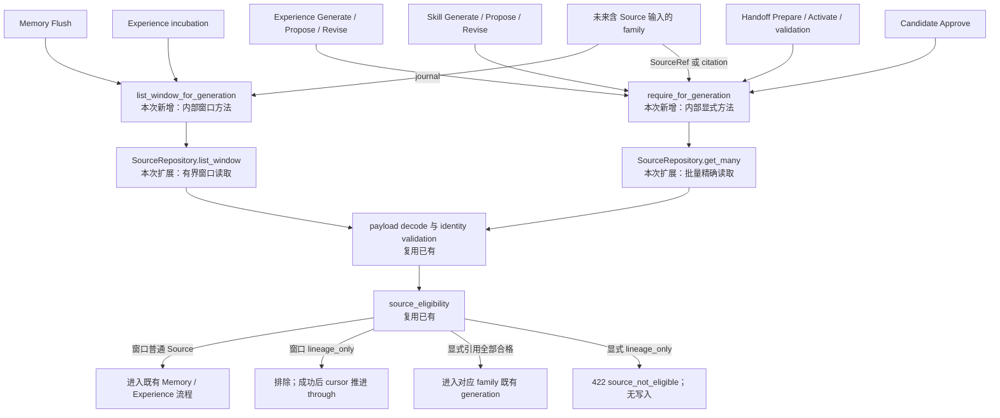

- Proposal Name: `artifact_generation_source_access`
- Start Date: 2026-09-04
- RFC PR: [oceanbase/powercontext#1458](https://github.com/oceanbase/powercontext/pull/1458)
- 相关 RFC：[RFC 1437：Source 与 Artifact REST API](1437_source_artifact_rest_api.md)

# Summary

本 RFC 收口 PowerContext 中所有“将 Source 作为 Artifact 生成证据”的内部读取与准入。Memory、Experience、
Skill、Handoff、Candidate review 以及未来 generation consumer 不再自行组合 `SourceRepository` 查询和
eligibility 判断，而是通过 Source 子系统中的轻量 facade 一次完成查询、严格 payload 解码、存储身份校验和现有
`source_eligibility` 规则。

facade 保留两种语义。显式 SourceRef 解析发现任一 `lineage_only` Source 时拒绝整个操作；Source journal 窗口解析
排除合法的 `lineage_only` Source，但保留原窗口 `through`，使 consumer 成功处理后仍能推进完整 cursor。两者不能
合成带 mode 的单一入口：静默删除调用方指定的证据不合法，而跳过内部 journal 记录是避免 cursor 永久阻塞所必需的。

本文不新增 HTTP endpoint、Source type、公开 role、持久化列、表或索引。设计复用 RFC 1437 已有的
`payload.internal`、`source_eligibility`、`SourceRepository`、`StoredSource`、`SourceRef` 和
`SourceWindowTrigger`。

# Motivation

RFC 1437 把每次基础 Artifact Create/Replace 命令保存为系统 Content Source，并绑定到新建的精确 Revision。该
Source 使用 `internal.role=lineage_only`：它是绑定 Revision 的耐久 provenance，不应再次进入 Memory extraction
或其他 Artifact generation。

当前实现已经写入这些 Source，并在部分 consumer 中执行 eligibility，但读取路径仍然分散：

| 流程 | 当前读取 | 需要消除的差异 |
| --- | --- | --- |
| Memory Flush | `list(after)` 后在内存中执行上界和 eligibility 过滤 | SQL 没有通过 `through` 限定上界。 |
| Experience incubation | `list(after, limit)` 后执行 eligibility 和 Task Outcome 过滤 | 窗口实现与 Memory 不同。 |
| Experience/Skill generation | 逐个 SourceRef 调用 `get`，再调用 `require_source_eligible` | 存在 N+1，调用方可遗漏准入。 |
| Candidate Propose/Revise | 逐个 SourceRef 调用 `get`，再判断 eligibility | review 层重复访问策略。 |
| Handoff Prepare/Activate | citation 或 boundary Source 逐条 `get` | 没有统一批量 resolver。 |
| Candidate Approve | Candidate 保存 SourceRef，最终由 persistence 路径处理 | 缺少明确的 generation 提交前复核点。 |

如果 family 直接持有 `SourceRepository`，新增或遗漏的路径就可能只读取 Source 而不执行 eligibility。因此需要一个
内部 facade，保证 generation 的 fetch 和 admission 不可拆分。它不是新的领域概念或公开协议。

# Guide-level explanation

## 两种 generation 读取形态

| 形态 | consumer | 输入 | `lineage_only` 行为 |
| --- | --- | --- | --- |
| 显式 SourceRef | Experience、Skill、Handoff、Candidate | request、citation 或已保存 Candidate 引用 | 拒绝整个操作。 |
| Source journal 窗口 | Memory Flush、Experience incubation | cursor 选择的固定 `(after, through]` | 排除；成功时仍推进完整窗口。 |

本文用 `GenerationSourceAccess` 作为轻量内部 facade 的示例名称；具体 Python 名称不是公开契约。

```python
class GenerationSourceAccess(Protocol):
    async def require_for_generation(
        self,
        scope_id: str,
        refs: Sequence[SourceRef],
    ) -> tuple[StoredSource, ...]: ...

    async def list_window_for_generation(
        self,
        scope_id: str,
        *,
        after: int,
        through: int,
    ) -> tuple[StoredSource, ...]: ...
```

两个方法共用 Repository 解码和 eligibility 代码，但保留不同调用契约。使用 `mode=reject|skip` 的单一方法会产生无效
参数组合，也可能让调用方错误地静默过滤显式证据。

## Artifact generation 调用链



图中没有新增 HTTP API。`require_for_generation` 和 `list_window_for_generation` 是内部 facade 方法；
`get_many` 和 `list_window` 是对既有 Repository 的扩展。

## 范围

本文覆盖 Memory Flush；Experience incubation、Generate、Propose、Revise；Skill Generate、Propose、Revise；
Handoff Prepare、Activate 和提交前 citation validation；Candidate Approve；以及未来接收 SourceRef、Source citation
或 Source journal 窗口的 generation 流程。

本文不覆盖公开 Source Create/Get、基础 Artifact Create/Replace 及 family 管理写入、ArtifactRepository
target-binding、runtime `Sources.get/list/entries`、ingestion、connector、Source catalog、Recall token 测量、
publication，以及只消费 ArtifactRef 的 generation。

# Reference-level explanation

## 既有数据和规则

generation eligibility 继续从 RFC 1437 已定义的可选 `pc_sources.payload.internal` 解码：

```text
internal 缺失或为 null                    -> 普通 Source，可按 family 规则使用
internal.role == lineage_only             -> 不得作为 generation evidence
未知 internal 结构、role 或 operation      -> invalid stored payload，默认拒绝
```

普通 Source 不保存 `role=evidence`。本文不增加或扩展 `role`、`operation`、`target`。generation 对所有合法
`lineage_only` 一律拒绝，不根据 operation 或 target 例外放行；ArtifactRepository 另行使用精确 target 保护 lineage
持久化。

为避免未来 family 与 Source payload schema 耦合，RFC 1437 的实现应让 `target.family` 复用 Artifact identity 已有的
family 字符串规则，不把当前支持的 family 固化为 Source payload 的封闭枚举。

## Repository 扩展

SourceRepository 增加等价于以下语义的有界操作：

```python
async def get_many(
    connection: AsyncConnection,
    scope_id: str,
    refs: Sequence[SourceRef],
) -> tuple[StoredSource, ...]: ...

async def list_window(
    connection: AsyncConnection,
    scope_id: str,
    *,
    after: int,
    through: int,
) -> tuple[StoredSource, ...]: ...
```

`get_many` 使用一条集合查询或有上限的分块查询，检测缺失和重复结果，并恢复去重后的请求顺序。`list_window` 在 SQL
中同时应用 Scope、下界、上界和稳定 journal 顺序，不能读取 Scope 中全部后续 Source 再在内存中截断。两者继续执行
既有 adapter selection、严格 payload 解码和 stored identity validation。

## 显式 SourceRef 解析

`require_for_generation` 从已鉴权 operation 获取 Scope，执行既有引用数量和身份限制，按首次出现顺序去重，并使用
`get_many` 解析全部引用。缺失、跨 Scope 或不可见引用沿用 operation 既有的非泄漏 evidence 错误；损坏 payload
作为内部错误。只有全部引用可见且完成解码后才判断 eligibility，任一 `lineage_only` 都拒绝整个操作，不返回部分结果。

可见性先于 eligibility，避免遍历顺序泄漏另一个 Scope 的 Source 是否存在。错误 details 最多回显调用方提交的
SourceRef，不返回 Source content、`internal`、operation 或 target。

## Source journal 窗口解析

`list_window_for_generation` 接收既有 `SourceWindowTrigger` 选定的 `(after, through]`，按 journal position 读取精确
区间，在过滤前严格解码每条记录，然后排除合法的 `lineage_only`。cursor 持久化仍由 consumer 负责。

过滤后为空时，不调用模型、不创建 Artifact/Candidate，以 no-op 提交 cursor=`through`。模型、业务写入、cursor CAS
或 payload 解码失败时 cursor 不变。损坏 payload 不是合法 `lineage_only`，不能被跳过。

## 已有和未来 consumer

| consumer 形态 | 强制规则 |
| --- | --- |
| Memory/Experience journal consumer | 只能使用统一窗口方法。 |
| Experience/Skill 的 SourceRef 请求 | generation 前使用统一显式方法。 |
| Handoff Source citation 或 boundary Source | 收集并去重后通过统一显式方法批量解析。 |
| 保存 SourceRef 的 Candidate | Propose/Revise 校验，并在 Approve 事务中再次校验。 |
| 未来消费 Source journal 的 family | 复用统一窗口方法，不增加第三种 cursor/过滤规则。 |
| 未来接收 SourceRef/citation 的 family | 复用统一显式方法，不直接注入 Repository。 |
| 只消费 ArtifactRef 的流程 | 不读取 Source。 |
| 基础 Create/Get/List/Replace | 管理访问，不是 generation 读取。 |

Runtime 组合根向 generation service 提供 facade，不再提供 `SourceRepository`。测试验证可观察行为和可复用的 family
conformance，不冻结 import graph 或私有调用顺序。

## 事务和持久化边界

Candidate Approve 把 facade 绑定到当前 commit connection，在创建/修订 Artifact 和批准 Candidate 前执行一次
generation eligibility 复核；失败时两者均不改变。

ArtifactRepository 可以继续直接读取 Source，校验精确 target binding 和 lineage 完整性。这不是另一套 generation
准入：它只允许 `lineage_only` Source 出现在绑定的 Revision。公开 Source 读取、基础管理写入、Recall、publication、
ingestion、connector 和 runtime Source catalog 也保留各自非 generation 的 Repository 访问。

本文继续使用 `pc_sources`、`pc_source_journal_heads`、`pc_source_cursors` 和
`pc_artifact_lineage_sources`，不修改表结构。

## 错误与安全

| 场景 | 结果 | 副作用 |
| --- | --- | --- |
| 全部引用可见，其中一个为 `lineage_only` | `422 source_not_eligible` | 不调用模型，不写 Candidate/Artifact。 |
| 引用缺失、跨 Scope 或不可见 | 对应 operation 既有的非泄漏 evidence 错误 | 不返回部分结果。 |
| 窗口包含合法 `lineage_only` | 普通 Source 子集或 no-op | 成功时推进完整窗口。 |
| 显式/窗口读取遇到损坏 payload | `500 internal_error` | 整体失败，不推进 cursor。 |

公开 message 保持中性：`The Source cannot be used as Artifact generation evidence.` details 最多包含调用方提交的
SourceRef。日志、metrics 和 trace 不记录 Source content、internal target 或完整 payload。本文不新增 Source
endpoint 或成功响应 schema；已有 generation HTTP operation 补充 `422 source_not_eligible`。

## 兼容性与迁移

本文收口已经部分落地的行为：

1. 增加 `SourceRepository.get_many` 和 `list_window`；
2. 在其上增加组合既有 eligibility 的轻量 Source generation facade；
3. 迁移 Experience、Skill、Handoff 的显式引用；
4. 迁移 Candidate Propose/Revise，并在 Approve 事务中复核；
5. 迁移 Memory 和 Experience，统一使用有界窗口；
6. 从 generation consumer 构造参数中移除 SourceRepository；
7. 保留公开、管理、持久化完整性及其他非 generation 读取的独立 Repository 访问。

历史 Source 的 `internal` 缺失或为 null 时仍为普通 Source。现有公开 contract 不变。历史 Candidate 包含不合格
Source 时拒绝批准，不能静默删除证据。

## Validation

可观察行为测试覆盖 Experience/Skill 显式拒绝、Handoff citation/boundary 拒绝、Candidate 原子批准、混合与全过滤
窗口、损坏 payload 的重试、去重后的请求顺序、不可见/不合格引用的非泄漏行为、SQL `(after, through]` 上下界、
非 generation 读取、未来 family conformance，以及 SQLite/OceanBase 一致行为。

# Drawbacks

- 内部调用链增加一层 facade，SourceRepository 增加两个方法；
- Memory、Experience、Skill、Handoff 和 Candidate 都需要迁移；
- eligibility 仍需解码既有 payload 可选字段，不能通过索引查询；
- Generate/Propose 与 Approve 会重复读取不可变 Source；
- Python 无法完全禁止未来代码直接 import Repository，仍需组合根、conformance test 和 review 维护边界。

# Rationale and alternatives

保留 facade 是为了让 generation consumer 无法拆开 fetch 和 admission；它不是新的 Source model、transport 或
persistence 概念。不采用带 mode 的单一方法，因为显式引用和窗口拥有不同输入、顺序、失败行为和 cursor 语义。
不采用各 family 分别过滤，因为会再次产生策略漂移。不采用纯 SQL 过滤，因为 eligibility 位于必须严格解码的类型化
payload。不新增数据库列，因为目前没有度量依据。

# Prior art

PowerContext 已有 SourceRepository 解码、`source_eligibility`、SourceWindowTrigger、Memory/Experience 独立 cursor、
ReviewedGenerationService、RelationalHandoffEvidenceResolver 和 ArtifactRepository 批量读取。本文组合这些能力。

# Unresolved questions

本文没有阻塞合并的语义问题。实现可以使用其他私有 facade 名称，但必须保留两个方法及全部可观察行为。

# Future possibilities

未来增加其他内部 Source 用途时应另行设计 RFC，在明确支持前默认拒绝。未来 Artifact family 复用这两种读取语义，
不增加 role、Source type、表列或第三种 generation access。只有数据规模或解码耗时超出运行预算时，才考虑
eligibility 索引或物化列。
