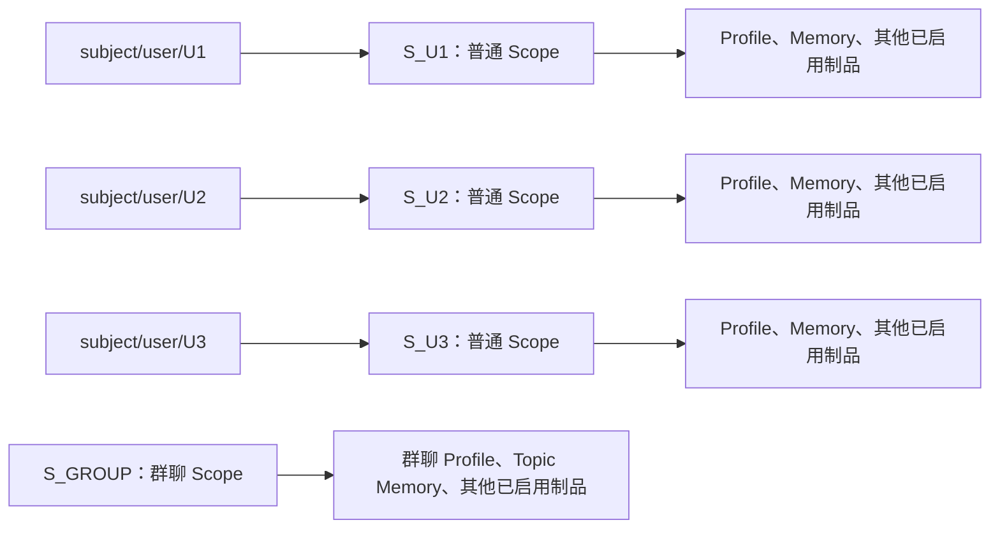
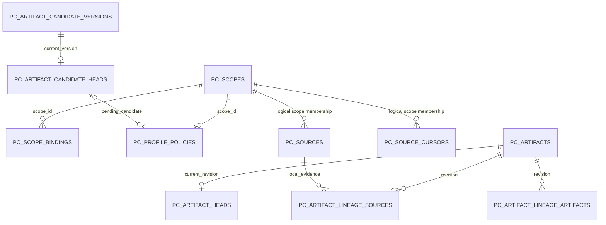

- Proposal Name: `profile_artifact`
- Start Date: 2026-09-07
- RFC PR: [oceanbase/powercontext#1485](https://github.com/oceanbase/powercontext/pull/1485)
- Related RFCs: [Scope organization](1345_scope_organization_and_agent_integration.md),
  [Access control](1396_handoff_access_control.md), [Source and Artifact REST API](1437_source_artifact_rest_api.md),
  [Candidate review](0050_artifact_candidate_review_inbox.md), [Topic Memory](1417_topic_memory.md)

# Summary

本 RFC 增加 `profile` Artifact Family：基于一个 Scope 中的 Source 生成完整 Markdown 画像。用户画像是主要使用方式；
多人会话 Scope 也可以生成自己的整体画像。Profile 复用现有 Artifact、Head、Lineage、Candidate 和 Source Cursor，
只新增 `pc_profile_policies` 策略表，不修改已有表的列、索引或约束。

主体寻址使用调用方提供的 `subject_key`，通过现有 `pc_scope_bindings` 映射到一个普通 Scope。新增主体 Source
写入接口，在同一事务中向业务 Scope 与绑定的主体 Scope 各保存一条 Source。现有单 Scope Source 接口保持单写。
默认每天 `02:00 Asia/Shanghai` 处理启用画像且有新增证据的 Scope，支持配置时间、人工 Flush、Candidate 审核、
人工修改和通过 Replace 回退。主体绑定只负责路由，不改变 Scope 的存储、组织或授权语义。

# Motivation

一个用户可能参加多个会话，也可能与其他用户共用一个群聊 Scope。应用希望在群聊中保留完整讨论，同时把一个用户的
相关发言积累到长期使用的独立 Scope。两个 Scope 都可以使用 PowerContext 已支持的 Artifact 能力。

业务系统负责判断用户身份、哪些内容属于哪个用户，以及何时管理绑定。PowerContext 提供 Scope Binding、可靠的双写
便利接口和按 Scope 生成画像的能力。接入方无需把群聊设置为用户 Scope 的子节点，也无需把 `user_id` 加入所有 Source
和 Artifact 的关系数据库列。

## Goals and non-goals

- 一个 Scope 最多一个 Profile Head，固定 `family="profile"`、`artifact_id="profile"`；每个 Revision 是完整快照。
- Profile 是派生制品，不是事实源。自动更新仅由新 Source 驱动，不增加 rebuild API。
- 保留 `subject_key`；首期 `subject_type` 默认为且仅支持 `user`，不提供主体类型或画像 Schema 注册能力。
- 主体 Scope 是普通 Scope。自动创建时 `parent_scope_id=NULL`；不引入特殊 Root 类型，不限制已有 Scope 的 Parent。
- Profile 只新增一个策略表。生成和审核元数据编码在已有 BLOB 中；不增加 Subject、投影、任务、Revision Metadata 表。
- 优先使用现有 Source、Artifact、Scope Binding、权限和 Candidate API；不增加主体专属的 Artifact CRUD 或聚合接口。
- 不实现用户认证、主体反向一对一约束、换绑迁移、账号合并、跨 Scope 自动授权或全局 Source 删除级联。
- 不保证所有 Artifact Family 在 Source 写入后自动生成。各 Family 保持原有启用方式、生成入口和生命周期。

# Guide-level explanation

## Ordinary scopes and subject bindings

`subject_key` 是调用方业务用户 ID，例如 `U1`。PowerContext 原样保存并精确匹配，不生成替代用户 ID、不归一化其内容。
调用方负责在部署使用的主体身份范围内避免不同业务用户撞号；身份字符串不是认证凭证。

| API 或内部约定 | Scope Binding 字段 | 示例 |
| --- | --- | --- |
| 服务端固定值 | `integration` | `subject` |
| `subject_type`，默认且仅允许 `user` | `kind` | `user` |
| `subject_key` | `external_id` | `U1` |
| 实际解析的普通 Scope | `scope_id` | `S_U1` |

`subject_scope_id` 只是主体写入请求中的可选 Scope ID，以及响应中实际使用的 Scope ID，不是新 Scope 类型或数据库列。
现有 Scope Binding Resolve 接口增加可选 `allow_default`，缺省为 true，保持旧调用的默认 Scope 回退行为。
主体查询必须传 false，只查一个精确 binding key，未命中返回 404；随后按返回的 `scope_id` 调用现有 Artifact 和领域 API。
双写内部直接读取精确 binding key，始终禁止回退到默认 Scope。



示例共有四个 Scope；图中的绑定箭头不是 Parent 或 Context Reference。主体 Scope 不包含群聊的所有制品。
查询 `S_U1` 只能按现有权限和查询范围获取该 Scope 的数据。需要其他 Scope 时，由应用显式组织请求；本 RFC 不增加
跨 Family 冲突裁决或自动遍历共享群聊的逻辑。现有 PrepareContext 仍按当前 Scope 与直接 Context References 工作，
其支持的 Family 不因本 RFC 自动扩展。

## Single-scope writes and subject writes

原入口 `POST /v1/scopes/{scope_id}/sources` 只写当前 Scope，仍不接受 `subject_key`。主体写入使用新入口：

```http
POST /v1/scopes/S_GROUP/subject-sources
Content-Type: application/json

{
  "subject_type": "user",
  "subject_key": "U1",
  "subject_scope_id": "S_U1",
  "source_type": "content",
  "content": {"speaker": "U1", "text": "我偏好简洁的中文回答"}
}
```

业务 Scope `S_GROUP` 必须存在。主体绑定按以下规则取得或建立：

| 已有绑定 | 可选 `subject_scope_id` | 结果 |
| --- | --- | --- |
| 存在 | 未传或与绑定一致 | 复用绑定 |
| 存在 | 与绑定不一致 | `409 subject_scope_conflict`，不写 Source |
| 不存在 | 已传 | 校验该 Scope 存在及权限，建立绑定 |
| 不存在 | 未传 | 按权限规则创建普通 Scope 并建立绑定 |

每次请求生成一个 `source_id`，分别用于两个 Scope。Source 完整身份含 `scope_id`，因此相同 `source_id` 不冲突。
新入口返回 `201` 和两条现有 `SourceRecord`，其中 `content`、`content_digest`、`source_type`、`source_id` 相同，
`scope_id` 不同，`position` 独立分配且可能恰好相同。这里的双写均为数据库记录，没有主从副本角色。

```json
{
  "subject_type": "user",
  "subject_key": "U1",
  "subject_scope_id": "S_U1",
  "sources": [
    {"scope_id": "S_GROUP", "source_type": "content", "source_id": "src_01",
     "content": {"speaker": "U1", "text": "我偏好简洁的中文回答"}, "position": 101, "content_digest": "sha256:<digest>"},
    {"scope_id": "S_U1", "source_type": "content", "source_id": "src_01",
     "content": {"speaker": "U1", "text": "我偏好简洁的中文回答"}, "position": 42, "content_digest": "sha256:<digest>"}
  ]
}
```

`<digest>` 是示例占位符，真实值为 canonical JSON content 的 SHA-256。响应顺序固定为业务 Scope、主体 Scope。
两 Scope 相同则返回 `422 distinct_scopes_required`；只需单写时使用现有接口。新接口沿用基础 Create 的重试语义：
不接受 Idempotency-Key，新的 HTTP 请求会生成新的 Source ID；一次请求内部的事务重试复用已生成的 ID。

截图式的逐条消息调用可以通过下列拟新增 Client 方法表达。Scope 的取得、绑定管理及 Policy 配置在消息写入前完成：

```python
messages = [
    {"user_id": "U1", "text": "我偏好简洁的中文回答"},
    {"user_id": "U2", "text": "请先给结论，再展示详细分析"},
]
for message in messages:
    await client.create_subject_source(
        "S_GROUP",
        CreateSubjectSourceRequest(
            subject_key=message["user_id"],
            content={"speaker": message["user_id"], "text": message["text"]},
        ),
    )
```

不能再对相同消息额外调用群聊 Source Create，否则群聊会重复保存。整段多人对话应由业务拆分并明确说话人；
不依赖 LLM 猜测主体路由。“同意”等消息需要业务补充所指上下文，否则画像生成应放弃推断。

## Binding management semantics

双写接口仅负责取得或建立绑定。现有管理 API 保留换绑、解绑能力，且允许多个主体绑定同一 Scope。
换绑和解绑不迁移、不删除任何 Source 或 Artifact。解绑后再次调用自动创建路径，可能产生新的 Scope。
多个用户绑定同一 Scope 会汇聚数据并形成整体画像，该 Scope 不能再解释为某个用户的独占数据空间。

一次请求以实际读到的绑定为准，解析后固定目标。并发管理操作不把该请求重定向到另一 Scope；响应给出实际写入目标。
不增加绑定版本、反向唯一性检查、不可变性限制或迁移协议。相同 Source ID 也不能作为跨 Scope 全局投影索引，
本 RFC 不承诺通过一条 Source 反查所有副本或自动级联删除。

## Profile meaning and lifecycle

Profile 描述本 Scope 中证据形成的稳定特征。用户 Scope 可生成用户画像；群聊 Scope 可生成参与者特点、共同偏好等
整体画像。混合证据应写成“U1 偏好简洁回答，U2 需要详细分析”，不能混为同一个人的偏好。

```text
Head:     (scope_id, family="profile", artifact_id="profile")
Revision: (scope_id, family="profile", artifact_id="profile", revision)
```

每个 Scope 独立维护一个 Profile。相同内容进入两个 Scope 后，分别参与各自启用的生成流程；由于其他证据和旧画像不同，
输出不一定相同。更新以旧画像和新证据为输入，精确去重后合并语义重复，明确冲突以最新有效证据为准；不能丢弃仍有效的
旧内容，也不能把一次临时指令变成长久偏好。不细分 Claim categories 或逐项风险等级。

默认新建的主体 Scope 同时创建启用、自动生效的 Profile Policy。复用已有 Scope 不隐式改变其 Policy；
普通群聊 Scope 和未启用的用户 Scope 可以通过 Policy API 显式启用。其他 Family 的配置不随之改变。

默认后台每天 `02:00 Asia/Shanghai` 处理新 Source。`review_required` 时生成 Candidate，正式画像保持不变，
用户可修改候选后批准，或拒绝候选并消费本次窗口。人工 Create/Replace 保持现有显式提交语义，不受自动生成审核策略阻拦。

# Reference-level explanation

## Scope binding and atomic source transaction

内部 `ensure_binding` 使用现有 `(integration, kind, external_id)` 唯一键，只在不存在时 INSERT，不使用覆盖式 upsert。
并发插入冲突时回滚整个尝试，重新读取绑定并应用上表规则；不允许先提交一个无人引用的新 Scope 再重试。
现有管理端 `set_binding/clear_binding` 保持原样，不强制复用这个 ensure 行为。

一次主体写入的事务步骤如下，所有数据库操作使用同一个连接和事务：

1. 校验请求与业务 Scope 权限，规范化 content，生成一个 Source ID。
2. 读取绑定；若缺失则校验候选 Scope，或创建普通 Scope，然后 INSERT 绑定。
3. 校验实际主体 Scope 的写权限，拒绝两个 Scope 相同。自动新建 Scope 的授权见下文。
4. 按 `scope_id` 排序取得两个 journal 的写入锁，将同一个 Source value 写入两处，各自分配 position。
5. 提交 Scope、绑定、必要的新 Policy、两条 Source 和 journal heads；任一步失败全部回滚。

```mermaid
sequenceDiagram
    participant App as Application
    participant API as Subject Source API
    participant DB as Existing tables + Policy
    App->>API: business scope + subject_key + optional subject_scope_id + content
    API->>DB: Begin transaction; read/ensure binding
    API->>DB: Authorize actual scopes; lock journals in scope order
    API->>DB: Insert (S_GROUP, content, src_01)
    API->>DB: Insert (S_U1, content, src_01)
    API->>DB: Commit both Sources and journal heads
    API-->>App: 201, actual scope IDs and two SourceRecords
    Note over API,DB: No LLM invocation on the Source write path
```

绑定的事务重试不等于 API 幂等。对于同 ID、不同 payload 的冲突，现有 Source repository 仍拒绝覆盖。
首期主体双写仅面向基础 API 支持的 `content` Source。现有 capture、observation、Connector、MCP 单写入口不隐式双写；
需要双写的接入通过新 application service/Client 方法调用。内部 `lineage_only` Source 不调用主体双写入口。

## Authorization and confidentiality

复用现有权限动作：业务和主体 Scope 分别要求 `scope.contribute`；读取按 `scope.read/artifact.read`；
已有绑定不存在时，建立绑定还要求现有 Binding 管理入口的 `server.admin`。若需要自动新建 Scope，则还遵守现有
Scope Create 的 `server.admin`，并在同一事务中用现有 RelationshipWriter 为已认证调用 Principal 建立该新 Scope 的
`scope.contributor` 角色绑定。此初始化只适用于新建 Scope；`server.admin` 本身不能被视为任意已有 Scope 的写权限。
这一授权初始化是新便利入口的行为，现有 Scope Create 接口不改变。未启用授权的部署沿用现有部署模式。
当前权限 repository 自行开启事务，实施时需增加可接受外部连接的内部写入路径，使新 Scope 的授权、审计和关系版本
与主体写入共用事务；不能调用一个提前独立提交权限的公开管理 API。公开权限接口的语义不变。

主体 key 不推导 Principal，不代替权限检查。Policy 更新要求 `scope.admin`；Flush 要求 `scope.contribute`；
Candidate 操作使用既有 Review 权限。后台使用可信 Runtime 服务身份，只处理部署允许的 Scope。

需要在现有 Artifact Access Profile 注册 `profile`：enabled=true，share_unit=artifact，shareable_states={committed}，
base_action=artifact.read，grantable_roles={artifact.viewer}，selector=forbidden，mutation_semantics={artifact.write}。
Candidate 不作为已提交 Artifact 暴露。日志默认不输出原始 subject_key、Source 正文或画像正文。

## Profile content and server-owned metadata

Markdown 正文放在 `ProfileContent.content`；生成元数据与正文一起编码到 `pc_artifacts.content` BLOB。
沿用当前 codec 的 Pydantic JSON UTF-8 bytes，不把该 codec 描述为 RFC 8785。公开 `content_digest` 仍遵循基础 API
的 canonical JSON 规则。LLM 只生成正文，服务端填写 generation；不让模型或客户端伪造审核状态、时间或 Source 窗口。

```python
from typing import Annotated, Literal
from pydantic import BaseModel, ConfigDict, Field, JsonValue, model_validator

Identifier = Annotated[str, Field(min_length=1, max_length=256, pattern=r".*\S.*")]

class SourceWindow(BaseModel):
    after: int = Field(ge=0)
    through: int = Field(ge=0)

    @model_validator(mode="after")
    def ordered(self):
        if self.through < self.after:
            raise ValueError("through must be >= after")
        return self

class ProfileGeneration(BaseModel):
    mode: Literal["automatic", "manual_create", "manual_replace", "review_approved", "rollback"]
    created_at: str  # Server-generated UTC RFC 3339 timestamp.
    generator_id: str | None = None
    generator_version: str | None = None
    source_window: SourceWindow | None = None
    restored_from_revision: int | None = Field(default=None, ge=1)

class ProfileWriteContent(BaseModel):
    model_config = ConfigDict(extra="forbid")
    content: str = Field(min_length=1)
    restored_from_revision: int | None = Field(default=None, ge=1)

class ProfileContent(BaseModel):
    model_config = ConfigDict(extra="forbid")
    schema_: Literal["powercontext.profile.v1"] = Field(default="powercontext.profile.v1", alias="schema")
    media_type: Literal["text/markdown"] = "text/markdown"
    content: str
    generation: ProfileGeneration

class ProfileCandidateProposal(BaseModel):
    schema_: Literal["powercontext.profile-candidate.v1"] = Field(default="powercontext.profile-candidate.v1", alias="schema")
    content: str
    source_window: SourceWindow
    generator_id: str
    generator_version: str
    created_at: str
```

上述模型展示核心类型；提交验证还包括：正文非空白、统一 NFC/LF、去除 BOM、末尾一个换行，正文 UTF-8 最大 256 KiB；
时间必须可解析且归一为 UTC；automatic/review_approved 必须有有效窗口与生成器信息；人工操作不伪造窗口；
仅 rollback 有 restored_from_revision，且目标是同一个 Scope/Family/Artifact 的已有 Revision。
Candidate 的窗口及生成器字段是服务端只读字段，Revise 请求使用单独的正文输入 schema，不复用可任意写的持久化模型。

只有正文参与生成结果的 no-change 比较，不能因时间或生成器字段不同而创建空更新 Revision。
基础人工 Replace 仍保持每次成功创建 Revision 的既有语义。人工确认优先仅是整篇 Revision 的生成参考，
不声称能识别某段文字曾被人工确认；后续明确的新 Source 仍可更新相应内容。

## Cross-Scope publication

画像不支持跨 Scope 复制或发布。现有 `POST /v1/artifact-publications` 在源制品的 family 为 `profile` 时，
无论目标 Scope 是否已有画像，均返回 HTTP 422，错误码 `artifact_publication_unsupported`，
`details.family` 为 `profile`。请求及其重试均不创建目标 Artifact、发布记录或画像策略，也不改变已有画像。
Python/SDK 的发布入口复用同一规则。其他支持复制的制品保持原行为；不新增复制接口。
目标 Scope 的画像只能通过本 Scope 的生成流程或既有 Create/Replace 接口维护。

## Daily scheduling and source consumption

后台调度由 `RuntimeConfig.profile_schedule_enabled` 独立控制，默认关闭；配置生成模型不隐式启用调度。
开启后采用下述默认时间和启动补偿扫描；手动 Flush 不受此开关影响，也不要求后台 Principal。
复用现有 APScheduler sidecar 表，增加 Cron job；不引入 durable pending、lease 或 job 业务表。
任务分页扫描 `pc_profile_policies` 中启用的 Scope，比较 `pc_source_journal_heads.position` 与该 Scope
在 `pc_source_cursors` 的 `profile-source-window` Cursor。缺失 Cursor 视为 sequence=0。

```yaml
profile:
  schedule:
    cron: "0 2 * * *"
    timezone: "Asia/Shanghai"
    misfire_grace_seconds: 86400
  max_concurrency: 4
  max_sources_per_window: 32
```

Cron 和 IANA timezone 可配置，无效值启动失败。调度启用 coalesce 和单进程 max_instances=1；启动时执行一次补偿扫描，
使长期停机或超出 misfire 宽限期后仍能发现未消费 Source。任务每次按固定高水位和有界窗口处理；
同一 Scope 顺序处理窗口，不同 Scope 可并行。一个 Scope 每轮最多处理 100 个窗口，达到上限后留给下一次扫描或 Flush。
窗口大小最多 32 条 journal 记录，同时保证 Candidate 的 Source 与 Artifact evidence 总计不超过现有 32 条限制；
若旧 Profile 作为 Artifact evidence，则窗口最多 31 条。不得把额外使用的证据悄悄省略出 lineage。

```mermaid
sequenceDiagram
    participant Cron as 02:00 Scheduler / Manual Flush
    participant Worker as Profile Processor
    participant DB as Policy + Journal + Cursor + Artifact/Candidate
    participant LLM as Model
    Cron->>Worker: Scan enabled scopes
    Worker->>DB: Read policy version, pending pointer, cursor and profile head
    alt Candidate pending or no new journal entries
        Worker-->>Cron: review_pending / noop
    else New source window
        Worker->>DB: Read bounded (after, through] window
        Worker->>Worker: Filter lineage_only; normalize and deduplicate evidence
        Worker->>LLM: Old profile + eligible evidence, if any
        LLM-->>Worker: Complete Markdown
        Worker->>DB: Begin transaction; lock Policy; recheck version, cursor, head
        alt Automatic activation
            Worker->>DB: Commit revision + lineage + cursor atomically
        else Review required
            Worker->>DB: Commit candidate + pending pointer; cursor unchanged
        end
        Worker-->>Cron: updated / review_pending
    end
```

纯 `lineage_only` 窗口不调用 LLM、不创建制品，按完整 through 推进 Cursor。有效证据未改变正文也只推进 Cursor。
自动生成只依赖本 Scope 的 Source；复制到 S_U1 的 Source 不推进 S_U2 的 Cursor。
读取旧画像只是合并上下文，不把其全部历史 Source 反复作为待处理新证据。

LLM 运行期间不持有数据库事务锁。提交时锁定 Policy 并比较快照中的 version、pending pointer、Cursor generation
及 Head；任一改变则丢弃当前计算，不推进 Cursor。SQLite 使用写事务序列化，OceanBase 使用行锁及 CAS。
所有成功的画像处理和 Policy 指针变动增加 Policy version；基础 Profile Create/Replace 也取得同一 Policy 锁，
确保与后台/审核操作串行提交。首次人工创建 Policy 时也必须用主键和事务处理竞争。

多进程可能重复调用 LLM，但只能有一个结果提交；不宣称 APScheduler 的单进程选项具有分布式锁效果。
模型超时、格式错误和事务失败保留原 Cursor，记录不含正文的错误日志，下一次计划扫描或手动 Flush 重试。
Source、Cursor 是恢复依据，不要求持久任务记录。模型或 Prompt 变更本身不触发重算。

## Review, manual editing and rollback

自动 Candidate 和 `pending_candidate_id` 同事务写入；每个 Scope 最多一个未决自动 Profile Candidate。
存在未决候选时仍可写入 Source，但后台与手动 Flush 均不再生成新候选。修改 Policy 不自动批准或丢弃已有候选。

| 操作 | 原子更新 | Cursor |
| --- | --- | --- |
| 生成 Candidate | Candidate versions/heads、Policy 指针与 version | 不变 |
| Revise Candidate | 新 Candidate version；只修改正文，保留窗口/target/evidence | 不变 |
| Approve | 新 Artifact/Head/lineage、Candidate approved/result、Policy 清指针、Cursor | 推进到该候选 through |
| Reject | Candidate rejected/reason、Policy 清指针、Cursor | 推进到该候选 through |

复用现有 Candidate get/list/revise/approve/reject。请求继续带 `scope_id`、`candidate_id`、`expected_version`，
Reject 继续要求 reason，不增加 disposition。Profile 分支校验 Policy 指针、待审状态、Cursor.sequence=after。
Approve 还校验当前 Head 等于 Candidate target；首次创建 target=NULL 时固定 Profile Head 必须不存在。

人工 Replace 在等待审核期间允许执行。旧候选 Approve 返回 `409` 并保留候选；Reject 无需匹配当前 Head，仍可消费原窗口。
用户可在 Reject 前读取候选并人工应用需要的内容。Revise 不自动重定向 target，避免未经确认地覆盖新的画像。
Approve/Reject 失败不部分推进 Cursor；终态重复请求遵循既有 Candidate 冲突语义，客户端通过 Get 确认结果。

拒绝仅消费本次窗口，不删除 Source。候选正文不进入有效画像，也不成为下一次生成的旧画像输入。后续新证据仍可表达同一事实；
拒绝不是永久的事实屏蔽机制。若 journal 在审核期间从 42 增长到 50，决定后下一次处理窗口从 42 开始。
重启后根据持久化的 Policy 指针与 Candidate 恢复等待状态，不重新生成。

人工 Create/Replace 使用基础 Artifact API 的 Family writer，保留系统 `lineage_only` Source、ordinal=0、ETag/If-Match
及现有 lineage 规则。Create 固定 artifact_id=profile，已有 Head 返回 409。自动提交使用同一 Family 校验与 repository，
但引用真实 evidence Source，不伪造人工系统 Source。

回退无需新 API：先 GET 历史 Revision，再 GET 当前 Head 的 ETag，PUT 完整正文并可在 ProfileWriteContent 中带
`restored_from_revision`。服务端校验历史 Revision 存在且规范化正文相同，写入新的 rollback Revision；不移动 Head 回旧版本，
不回退 Cursor。未提供该可选字段时视为普通人工 Replace。Create 不允许指定 restored_from_revision。
历史比较由客户端读取两个 Revision 完成，不新增 diff/history-list 接口。

## Persistence inventory and example rows

下面示例中的 BLOB 展示解码后的 JSON，外键和 lineage 使用实际完整身份。时间、摘要使用可读示例值；省略的默认列
在实现中仍按现有表定义写入。现有表均无 DDL 变动，只扩展 Profile 对应的类型化 BLOB schema 和代码分支。



图中的 logical membership 不是新增外键；`pc_sources` 和 `pc_source_cursors` 保持现有约束。
跨 Scope 的两条 Source 没有新增关系表或 FK。`pc_artifact_lineage_artifacts` 仍保存同 Scope 的上游 Revision。

### Scopes and bindings

`pc_scopes` 保存普通 Scope。以下是同一群聊的四条示例，均无 Parent，但群聊可保留其原有组织关系：

| scope_id | title | summary | parent_scope_id | version |
| --- | --- | --- | --- | --- |
| S_GROUP | Discussion | Group conversation evidence | NULL | 1 |
| S_U1 | User workspace | Long-lived conversation evidence | NULL | 1 |
| S_U2 | User workspace | Long-lived conversation evidence | NULL | 1 |
| S_U3 | User workspace | Long-lived conversation evidence | NULL | 1 |

`pc_scope_bindings`：主键仍为 `(integration, kind, external_id)`；不增加 scope_id 唯一约束。

| integration | kind | external_id | scope_id |
| --- | --- | --- | --- |
| subject | user | U1 | S_U1 |
| subject | user | U2 | S_U2 |
| subject | user | U3 | S_U3 |

`pc_scope_context_references`、`pc_scope_external_references`、`pc_scope_settings` 在本例均无新增行。
内部自动 Scope 创建不假装使用公开 Scope Create 的 Idempotency-Key，因此 `pc_scope_creation_requests` 无本次请求行；
若应用事先调用现有 Scope Create，则其记录沿用原流程。

### Sources, journal heads and cursors

`pc_sources` 仍以 `(scope_id, source_type, source_id)` 为主键。P 表示同一个合法的完整 ContentSource payload；
两条复用相同 name/src_01，因此内部 envelope 也可相同。Source ID 不是全局唯一键。

| scope_id | source_type | source_id | payload | journal_position |
| --- | --- | --- | --- | --- |
| S_GROUP | content | src_01 | P | 101 |
| S_U1 | content | src_01 | P | 42 |

P 的业务 content 为 `{"speaker":"U1","text":"我偏好简洁的中文回答"}`，按现有 adapter 编码；不增加主体内部字段。

`pc_source_journal_heads`：

| scope_id | position |
| --- | --- |
| S_GROUP | 101 |
| S_U1 | 42 |

`pc_source_cursors`，本例为 Source 写入之后、生成之前：

| scope_id | binding_name | cursor BLOB | generation |
| --- | --- | --- | --- |
| S_GROUP | profile-source-window | {"sequence":100} | 8 |
| S_U1 | profile-source-window | {"sequence":41} | 5 |

两 Scope 分别成功处理后，sequence 变为 101/42，generation 分别变为 9/6。Memory 等其他 binding 的 Cursor 不变。

### The only new table: pc_profile_policies

| 字段 | SQLAlchemy 类型 | 约束/含义 |
| --- | --- | --- |
| scope_id | identity_string(256) | PK，FK -> pc_scopes.scope_id，ON DELETE CASCADE |
| generation_enabled | Boolean | NOT NULL，是否参与计划扫描/Flush |
| activation_mode | identity_string(32) | NOT NULL，automatic 或 review_required |
| pending_candidate_id | identity_string(128) | nullable，与 scope_id 组成 FK -> pc_artifact_candidate_heads |
| version | BigInteger | NOT NULL，>0，配置及处理状态 CAS 版本 |
| updated_at | DateTime(timezone=True) | NOT NULL，UTC |

```text
PRIMARY KEY (scope_id)
CHECK (activation_mode IN ('automatic', 'review_required'))
CHECK (version > 0)
FOREIGN KEY (scope_id, pending_candidate_id)
  REFERENCES pc_artifact_candidate_heads(scope_id, candidate_id) ON DELETE RESTRICT
```

| scope_id | generation_enabled | activation_mode | pending_candidate_id | version | updated_at |
| --- | --- | --- | --- | --- | --- |
| S_GROUP | true | automatic | NULL | 3 | 2026-09-07T18:00:00Z |
| S_U1 | true | review_required | cand_01 | 7 | 2026-09-07T18:00:00Z |

缺少 Policy 表示自动生成未启用。新建主体 Scope 的 Policy 默认 enabled=true、automatic、version=1；
基础人工创建画像时若缺少 Policy，则创建 enabled=false、automatic 的 Policy，用于并发协调，不隐式开启后台生成。
Policy PUT 保留 pending_candidate_id；该字段不能由客户端指定或清除。

### Artifact content, heads and lineage

`pc_artifacts` 示例：

| scope_id | family | artifact_id | revision | content BLOB |
| --- | --- | --- | --- | --- |
| S_U1 | profile | profile | 3 | C3 |
| S_U1 | profile | profile | 4 | C4 |
| S_GROUP | profile | profile | 2 | Group profile snapshot |

C4 是批准 cand_01 后的完整数据，正文示例没有 Claim 行或 category：

```json
{
  "schema": "powercontext.profile.v1",
  "media_type": "text/markdown",
  "content": "# 用户画像\n\n- 偏好简洁的中文回答。\n",
  "generation": {
    "mode": "review_approved",
    "created_at": "2026-09-08T01:00:00Z",
    "generator_id": "profile-source-window",
    "generator_version": "1",
    "source_window": {"after": 41, "through": 42},
    "restored_from_revision": null
  }
}
```

`pc_artifact_heads`，对应审核前后分别指向 Revision 3/4；下表为审核后：

| scope_id | family | artifact_id | revision | searchable_text | lifecycle_state | replacement_artifact_id | governance_generation |
| --- | --- | --- | --- | --- | --- | --- | --- |
| S_U1 | profile | profile | 4 | 偏好简洁的中文回答 | active | NULL | 0 |
| S_GROUP | profile | profile | 2 | U1 偏好简洁中文；U2 需要详细分析 | active | NULL | 0 |

`pc_artifact_lineage_sources`：

| scope_id | family | artifact_id | revision | ordinal | source_type | source_id |
| --- | --- | --- | --- | --- | --- | --- |
| S_U1 | profile | profile | 4 | 0 | content | src_01 |
| S_GROUP | profile | profile | 2 | 0 | content | src_01 |

`pc_artifact_lineage_artifacts`：

| scope_id | family | artifact_id | revision | ordinal | upstream_family | upstream_artifact_id | upstream_revision |
| --- | --- | --- | --- | --- | --- | --- | --- |
| S_U1 | profile | profile | 4 | 0 | profile | profile | 3 |

自动更新引用作为生成输入的上一画像；基础人工 Replace 的 lineage 仍按基础 API 规则处理，不把其他 Revision 的
lineage_only Source 当作新证据。`pc_artifact_publications` 在主体 Source 双写中无新增行。

### Candidates and scheduler

`pc_artifact_candidate_versions`，审核前的示例：

| scope_id | candidate_id | version | family | proposal BLOB | source_refs BLOB | artifact_refs BLOB | target_family | target_artifact_id | target_revision | reason |
| --- | --- | --- | --- | --- | --- | --- | --- | --- | --- | --- |
| S_U1 | cand_01 | 1 | profile | Q1 | [{"source_type":"content","source_id":"src_01"}] | [{"family":"profile","artifact_id":"profile","revision":3}] | profile | profile | 3 | New evidence |

```json
{
  "schema": "powercontext.profile-candidate.v1",
  "content": "# 用户画像\n\n- 偏好简洁的中文回答。\n",
  "source_window": {"after": 41, "through": 42},
  "generator_id": "profile-source-window",
  "generator_version": "1",
  "created_at": "2026-09-07T18:00:00Z"
}
```

以上为 Q1。Revise 插入 version=2，保留所有服务端处理信息和 target，仅改变 content。
`pc_artifact_candidate_heads` 的三个示例状态互斥，实际只存在一条当前 Head：

| scope_id | candidate_id | family | version | status | result_family | result_artifact_id | result_revision | decision_reason |
| --- | --- | --- | --- | --- | --- | --- | --- | --- |
| S_U1 | cand_01 | profile | 1 | pending | NULL | NULL | NULL | NULL |
| S_U1 | cand_01 | profile | 1 | approved | profile | profile | 4 | NULL |
| S_U1 | cand_01 | profile | 1 | rejected | NULL | NULL | NULL | Evidence is too temporary |

approve/reject 两种结果都会清空 Policy 指针并把 Cursor 从 41 推进到 42；只有 approve 产生 C4。
历史窗口保留在 Candidate version 中，因此无需 `pc_profile_candidate_metadata`。

`powercontext_scheduler_jobs` 复用 APScheduler 的 id/next_run_time/job_state：

| id | next_run_time | job_state |
| --- | --- | --- |
| powercontext.profile.source-window.v1 | 1788804000.0 | APScheduler serialized CronTrigger: 02:00 Asia/Shanghai, dispatch_profile_windows |

该时间对应 `2026-09-08T02:00:00+08:00`；job_state 由 APScheduler 序列化，不手写 BLOB。
权限关系使用已有 Access Control 表和 RelationshipWriter；以下列出自动创建及画像提交时的代表性字段，其他审计、
摘要和版本字段由现有服务填写。假设调用 Principal 为 service/app-agent，其身份与业务主体 U1 没有自动对应关系：

| 已有表 | 实际数据示例（关键列） |
| --- | --- |
| pc_access_relationships | binding_id=bind_01, subject_type=service, subject_id=app-agent, resource_type=scope, scope_id=S_U1, role=scope.contributor, state=active, version=1 |
| pc_access_relationship_heads | name=authorization, revision=12；按现有服务在关系变动时递增 |
| pc_access_idempotency | actor_id=<existing actor encoding>, operation=binding.create, result_binding_id=bind_01；内部授权操作的去重记录，不是 Source HTTP 幂等 |
| pc_access_audit | principal_type=service, principal_id=app-agent, scope_id=S_U1, allowed=true；operation/action 按现有授权与审计服务生成 |
| pc_access_owners | owner_kind=artifact, scope_id=S_U1, family=profile, artifact_id=profile, owner_type=service, owner_id=app-agent；Candidate owner_kind=candidate、candidate_id=cand_01 使用既有规则 |

不新增权限表。生成与审核沿用已有 owner 建立/继承规则；后台由配置的可信服务 Principal 负责，不能把 subject_key
作为 owner_id。上表 owner 示例适用于以 app-agent 身份提交的场景，并非由 U1 自动推导。

## API surface and Python examples

仅新增四个 HTTP operation；下表路径和类型是本 RFC 的实现目标，不表示当前版本已经提供。

| operationId | 方法与路径 | 成功状态 | 用途 |
| --- | --- | --- | --- |
| create_subject_source | POST /v1/scopes/{scope_id}/subject-sources | 201 | 解析主体绑定并原子双写 |
| get_profile_policy | GET /v1/scopes/{scope_id}/profile-policy | 200 | 读取策略及未决指针 |
| put_profile_policy | PUT /v1/scopes/{scope_id}/profile-policy | 200 | 显式启用/停用及设置审核策略 |
| flush_profile | POST /v1/profile/flush | 200 | 立即执行一个有界窗口，复用后台 Processor |

Policy GET 缺失记录返回 404；PUT 使用 expected_version，0 表示仅允许首次创建，其他正值必须匹配当前版本。
GET 要求 scope.read，PUT 要求 scope.admin。Policy 更新与处理提交共享 version，冲突后客户端重新 GET。
Flush 在 Policy 不存在或 generation_enabled=false 时返回 disabled，不强行开启生成；本次调用等待一个窗口处理完成，有部署配置的超时上限。
超时不能推断事务未提交，客户端通过现有 Artifact/Candidate 和 Policy 读取状态；重试仍经 Cursor/CAS 判断。

```python
class CreateSubjectSourceRequest(BaseModel):
    model_config = ConfigDict(extra="forbid")
    subject_key: Identifier
    subject_type: Literal["user"] = "user"
    subject_scope_id: Identifier | None = None
    source_type: Literal["content"] = "content"
    content: JsonValue

class CreateSubjectSourceResponse(BaseModel):
    subject_type: Literal["user"]
    subject_key: Identifier
    subject_scope_id: Identifier
    sources: list[SourceRecord]  # Existing model; exactly two, business then subject.

class PutProfilePolicyRequest(BaseModel):
    model_config = ConfigDict(extra="forbid")
    generation_enabled: bool
    activation_mode: Literal["automatic", "review_required"] = "automatic"
    expected_version: int = Field(ge=0)

class ProfilePolicyResponse(BaseModel):
    scope_id: Identifier
    generation_enabled: bool
    activation_mode: Literal["automatic", "review_required"]
    pending_candidate_id: str | None
    version: int = Field(ge=1)
    updated_at: str

class FlushProfileRequest(BaseModel):
    model_config = ConfigDict(extra="forbid")
    scope_id: Identifier

class FlushProfileResponse(BaseModel):
    status: Literal["updated", "noop", "review_pending", "disabled", "conflict"]
    previous_cursor: int
    current_cursor: int
    high_watermark: int
    processed_source_count: int
    artifact: ArtifactRef | None = None  # Existing exact ref, scoped by request.
    candidate_id: str | None = None
```

所有新增模型拒绝未知请求字段并验证 ID/枚举；响应里的 SourceRecord 和 ArtifactRef 复用现有类型及可选字段。
Flush 的 processed_source_count 为本次读取窗口中的 eligible Source 数量；无新调用模型的 review_pending/disabled 返回 0。
并发 conflict 返回现读 Cursor，且不包含被丢弃结果的 artifact/candidate_id。其余字段为非负整数。

| 现有接口/组件 | 变动 |
| --- | --- |
| 基础 Source Create/Get、capture、observation | request/response 和单写语义不变 |
| Scope Create/Get/List、Binding Set/Clear | 契约不变；新入口内部使用 insert-only ensure，不改管理行为 |
| Scope Binding Resolve | 增加 allow_default=true；主体查询传 false，禁止未命中时使用默认 Scope |
| Artifact Create/Get/Get Revision/List/Replace | Family enum、输入联合类型、Family writer 增加 profile；仍使用现有路径 |
| Artifact publication / 复制 | 原路径和请求结构不变；源 Family 为 profile 时返回 422 artifact_publication_unsupported，无目标写入；其他制品保持原行为 |
| Candidate Get/List/Revise/Approve/Reject | 增加 Profile proposal 和 committer；Profile 分支联动 Policy/Cursor |
| Artifact Access Profile、capabilities/readiness、内部权限 repository | 注册并报告 profile；支持事务内授权初始化，不增加权限动作或改变公开管理语义 |
| RuntimeConfig、scheduler register/configure | 增加 Profile Cron 配置和扫描回调，沿用现有 sidecar |
| Python Client、HTTP adapter | 新增上述四个 operation；既有 Artifact/Candidate 方法支持 profile |
| PrepareContext、其他 Family 生成接口 | 不扩展聚合范围或自动生成承诺 |

Profile 人工创建沿用原来的 body 外形：

```http
POST /v1/scopes/S_U1/artifacts

{"family":"profile","content":{"content":"# 用户画像\n\n- 偏好简洁回答。\n"}}
```

读取和替换仍为：

```text
GET /v1/scopes/S_U1/artifacts/profile/profile
GET /v1/scopes/S_U1/artifacts/profile/profile/revisions/3
GET /v1/scopes/S_U1/artifacts/profile
PUT /v1/scopes/S_U1/artifacts/profile/profile    (If-Match required)
```

```json
{"content":{"content":"# 用户画像\n\n- 偏好简洁回答。\n","restored_from_revision":3}}
```

PUT 示例表示恢复 Revision 3 的正文；响应沿用 ArtifactRevision，包含服务端生成的 generation 和新的 ETag。
SDK 对 Replace 继续使用现有 If-Match 参数机制，不假设 response model 自带 `.etag` 字段。

```http
POST /v1/artifact-candidates/reject

{"scope_id":"S_U1","candidate_id":"cand_01","expected_version":1,"reason":"这只是临时要求"}
```

不新增主体 Artifact CRUD、Subject Resolve、Profile history/diff/rollback/context API。
按 subject_key 查询时，先用 Scope Binding Resolve 精确查询，再调用普通 Scope API。Resolve 仍要求现有 server.observe：

```http
POST /v1/scope-bindings/resolve

{"binding_keys":[{"integration":"subject","kind":"user","external_id":"U1"}],"allow_default":false}
```

## Errors, compatibility and implementation

| 条件 | 结果 |
| --- | --- |
| 无效 subject_type、空白 key、非法正文或未知输入字段 | 422 |
| 已有绑定与显式 subject_scope_id 不一致 | 409 subject_scope_conflict |
| 两个实际 Scope 相同 | 422 distinct_scopes_required |
| 显式 Scope 不存在 | 404；不按调用方指定 ID 隐式创建 |
| 缺少任一实际 Scope/管理权限 | 403，无部分写入 |
| Profile Create 已存在 | 409 |
| Replace 缺少 If-Match / 不匹配 | 428 / 412 |
| Policy、Candidate 版本或审核 Cursor 冲突 | 409，不推进 Cursor |
| Approve 的目标 Head 已变化 | 409，保留候选 |
| 模型/存储暂时不可用 | 503，保留可恢复状态 |

所有响应沿用 Request-ID 和既有错误 envelope，避免在错误中暴露无权限 Scope 的正文和绑定详情。
新增 Profile family 要同时更新 OpenAPI 联合类型、只读输出类型、Candidate proposal 类型及 Family 注册。
服务端生成字段与客户端输入分开，不能把 GET 返回的 generation 原样当作可写输入。

实施顺序：

1. 增加 Profile content/write/proposal 模型和 Family writer，复用固定 Singleton ID、Artifact repository、lineage 和授权。
2. 只创建 Policy 表；为生成元数据、Candidate processing context 定义带版本 schema 的 BLOB 编解码和服务端验证。
3. 实现 insert-only ensure 和同事务双写 application service，包括并发首次创建、权限与完整回滚。
4. 实现 Source-window Processor、Policy/Cursor/Head 协调、Candidate 生命周期和每日 Cron。
5. 在 OpenAPI 增加四个 operation，扩展已有 Family/Candidate 分支；运行 `make api-generate`，不手改生成文件。
6. 增加中英文使用文档与 SQLite/OceanBase 行为测试；运行 `make contract-test`、`make test`、`make check`、`make docs-test`。

## Acceptance criteria

- 本功能仅新增 pc_profile_policies，已有表的列/索引/FK 无变更，Artifact/Candidate BLOB 包含可验证的服务器元数据。
- 单 Scope Source API 仍只写一条；主体入口双写两条同 ID/content 的 Source，不调用 LLM。
- 首次并发绑定不会留下孤立 Scope；显式绑定冲突、权限失败或任一 Source 写失败都整体回滚。
- 管理换绑/解绑保持原样，后续写入使用新绑定；历史数据不迁移，多主体同 Scope 合法。主体 Resolve 未命中不能回退到默认 Scope。
- U1 的消息只改变 S_GROUP 和实际 S_U1 的 journal；两者可独立生成 Profile，U2/U3 不被触发。
- 两个 Scope 相同拒绝；新 HTTP 重试可产生新 Source 对，不误称为幂等。
- 任意 Scope 使用同一 Profile singleton ID，Create 冲突，Get/List/Replace/Review 复用现有接口。
- 默认 02:00 Asia/Shanghai，可配置时间与时区；启动扫描恢复积压，不依赖 pending/job 表。
- lineage_only 被过滤且可推进完整窗口；无有效正文变化不创建自动 Revision；无新 Source 不因模型升级重建。
- 并发生成最多提交一次；Policy 变更、人工 Replace、Cursor 变化令陈旧结果失效。
- Candidate 上下文不可由客户端修改；待审期间不重复生成；批准/拒绝与 Cursor 和指针原子更新。
- Reject 消费窗口、不自动重试、不删除 Source；Head 已变化仍允许 Reject，Approve 必须冲突。
- 回退提交新 Revision，保留历史与 Cursor；已有授权动作、Source 生成准入在所有 Profile 写入路径生效。
- 本 RFC 不承诺 Memory、Experience、Skill、Topic Memory 等 Family 自动具备新的生成或聚合能力。

# Drawbacks

Source 双写增加存储和 journal 处理成本。共享 Scope 与用户 Scope 可分别生成画像，可能产生不同结论和重复 LLM 成本。
没有投影索引意味着无法高效进行跨 Scope 副本发现与联动删除；没有分布式任务租约意味着竞争者可能重复调用模型。
审核会阻塞同 Scope 后续自动画像窗口；Reject 的固定消费语义放弃自动重试被拒绝的证据窗口。

可变、多对一 Binding 可能拆分长期记忆或混合多人的信息。应用需要管理绑定、保留消息上下文并理解 Scope 授权范围。
生成元数据存在 BLOB 中，数据库不能直接对其建立外键或高效按字段检索，必须通过服务端验证和事务维护完整性。

# Rationale and alternatives

## Reuse scope bindings and ordinary scopes

现有 Binding 已表达外部业务标识到 Scope 的映射。固定 integration、首期 user kind 加 subject_key 足够支持主体寻址。
管理端保持可变映射符合现有抽象；自动双写只采用 ensure，避免普通数据写入意外换绑。额外的 Root 类型、反向唯一约束和
主体专属 CRUD 会增加管理语义，首期没有必要。

## One policy table and existing blobs

Policy 承担配置与唯一待审指针，需要原子 CAS，现有 Scope settings 并不是任意 JSON 配置表，不能直接容纳这些字段。
Revision 与 Candidate 元数据属于已有对象的类型化内容，使用现有 BLOB 足够。完整处理状态可从 Policy、Cursor、
Source journal 和 Candidate 重建，因此不新增 pending、lease、projection、revision metadata 或 candidate metadata 表。

## Dedicated subject write convenience

两次基础 Source Create 不能保证一起成功。专用双写入口沿用基础 API 的内容和返回模型，复用事务内 repository，
提供原子性，同时保留原单写入口。任意 scope_ids 批量写入接口不能表达主体绑定解析，本 RFC 不扩大为通用批量操作。

# Prior art

- PowerContext [基础 REST API](1437_source_artifact_rest_api.md)提供 Source/Artifact 身份、原子提交、ETag 和 lineage_only；
  [Scope RFC](1345_scope_organization_and_agent_integration.md)提供普通 Scope 与 Binding。
- [Candidate Review RFC](0050_artifact_candidate_review_inbox.md)提供候选版本与审核生命周期；
  [Topic Memory RFC](1417_topic_memory.md)提供独立 Source-window consumer 的参考。本设计不依赖其拟新增的任务表。
- [TencentDB Agent Memory](https://github.com/TencentCloud/TencentDB-Agent-Memory#technical-implementation)的分层异步处理，
  以及 [OpenViking Session](https://github.com/volcengine/OpenViking/tree/main/openviking/session)的会话处理，
  为证据累积后更新长期记忆提供参考；本设计采用 PowerContext 自己的 Scope、Cursor 和事务契约。

# Unresolved questions

首期行为以本文为准，不将实施所需的一致性决策留给调用方。运行参数如模型超时和部署并发上限由现有部署配置约束。
跨 Scope Source 删除与遗忘、绑定变更后的数据迁移、强反向唯一性、审核拒绝后的显式重新提案，以及全 Family
Context 聚合都不属于本 RFC，应有独立设计；不暗示这些能力已经由双写或 Binding 提供。

# Future possibilities

可以扩展 subject_type 的受支持值，并继续复用 Scope Binding，而不改变 Profile singleton 身份。
未来可为所有 Family 引入统一的处理策略、任务租约和跨 Scope Source 复制关系；应由各自的需求和 RFC 驱动，
不作为首期 Profile 的隐式依赖。若需要细粒度事实审核或永久屏蔽被拒绝内容，应单独设计结构化事实与治理模型。
