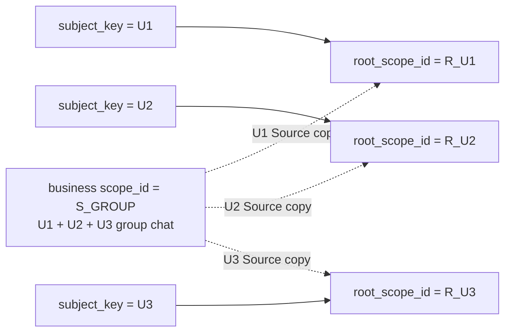
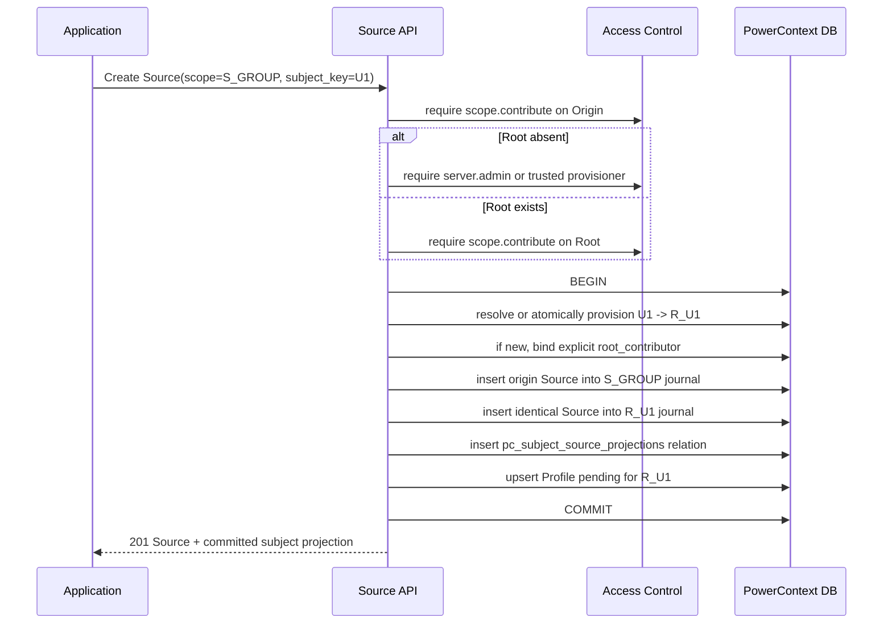
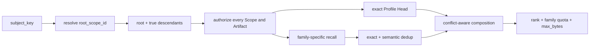
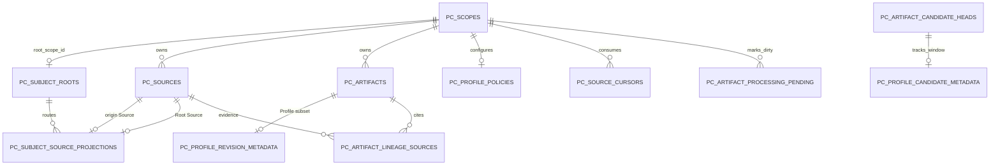

- Proposal Name: `profile_artifact`
- Start Date: 2026-09-07
- RFC PR: [oceanbase/powercontext#1485](https://github.com/oceanbase/powercontext/pull/1485)
- Related RFCs: [RFC 0014](0014_memory_layer_design.md), [RFC 0019](0019_local_source_memory_runtime.md),
  [RFC 0050](0050_artifact_candidate_review_inbox.md), [Topic Memory RFC](0000_topic_memory.md),
  [RFC 1345](1345_scope_organization_and_agent_integration.md),
  [RFC 1396](1396_handoff_access_control.md)，以及 [RFC 1437](1437_source_artifact_rest_api.md)

# Summary

本 RFC 为 PowerContext 增加 `profile` Artifact Family。首期只设计固定的用户画像，不提供画像类型字段、其他画像类型或 Profile Schema Registry。

画像是由 Source 派生的、可重建的完整快照，不是事实源。用户画像使用固定地址：

```text
Head identity:
(root_scope_id, family="profile", artifact_id="profile:user")

Exact revision identity:
(root_scope_id, family="profile", artifact_id="profile:user", revision)
```

`subject_key` 是调用方在业务 Source 写入时直接传入的业务 `user_id`。PowerContext 不生成另一套用户标识，也不解释、
拼接或归一化该值。命名为 `subject_key`，是为了让 `subject_key -> root_scope_id` 的主体寻址和 Source 投影机制将来可被
其他 Artifact Family 复用；首期主体仍固定为用户。

Scope 组织采用唯一方案：

- 每个 `subject_key` 一一对应一个用户 Root Scope；
- 共享业务 Scope 不挂到任一用户 Root 下；
- 带 `subject_key` 的 Source 在同一事务内写入业务 Scope 和该用户 Root Scope，总共保存两条 Source 记录；
- Profile Processor 只消费 Root Scope 内的 Source journal，因此不同用户互不触发；
- 没有 `subject_key` 的普通 Scope 仍可显式启用 Scope-local Profile。

Profile 不再拆分 Claim category、Claim 行或风险等级。LLM 输出完整 Markdown，作为 `ProfileContent.content` 保存到现有 `pc_artifacts.content` BLOB。自动生成默认每天 `02:00` 执行，使用部署配置的 IANA 时区，默认 `Asia/Shanghai`；调用方可以修改 Cron 与时区，也可以请求立即生成。

# Motivation

面向用户的 Agent 需要跨会话、跨任务和跨业务 Scope 使用同一份长期画像。仅在原业务 Scope 内生成画像会导致同一个用户在多个 Scope 中形成多份画像；直接给所有 Source 和 Artifact 增加 `user_id` 列，又会把存储归属、内容主体、内容产生者和权限主体混为一谈。

多人会话进一步说明了这种区别。一个群聊 Scope 可以同时包含 U1、U2、U3 的发言，但 `pc_scopes.parent_scope_id` 只有一个值，群聊 Scope 不可能同时成为三个用户 Root 的子 Scope。正确做法是保留群聊 Scope 的原始组织关系，把每个用户自己的 Source 精确复制到自己的 Root，再在 Root 中生成用户画像。

本设计把通用 Source、Scope 和 Artifact 保持为事实与制品基础设施，只增加一套窄化的主体路由便利能力。接入方仍负责决定业务用户、会话和 Source 如何对应；PowerContext 负责稳定解析 Root、可靠双写 Source、后台生成画像和维护 Revision。

## Goals

1. 新增 `profile` Artifact Family，复用现有 Artifact Head、Revision、Lineage 和 CAS 语义；写入由 Profile 专用入口
   调用内部 RecordService，不扩展通用 Artifact Create/Replace 的公开写入联合类型。
2. 首期只支持固定用户画像；不设计画像类型扩展、Claim category 和逐 Claim 风险模型。
3. 以调用方业务 `user_id` 作为 `subject_key`，建立不可变的一一映射 `subject_key <-> root_scope_id`。
4. 支持共享 Scope 中不同用户的 Source，且一个用户的新 Source 只推进该用户 Root 的 journal。
5. 将一条带 `subject_key` 的 Source 总共保存两份：原业务 Scope 一份、对应用户 Root 一份。
6. 默认每天 `02:00` 后台生成画像，Cron 与时区可配置，不让业务 Source 写入入口等待 LLM。
7. 将完整 Markdown 画像保存到现有 `pc_artifacts.content` BLOB，不增加 Claim 表或 Profile 内容列。
8. 默认自动生效；允许按 Profile Scope 配置整篇 Revision 进入 Review。
9. 支持人工创建、替换、审核、查看历史、比较差异和非破坏性回退。
10. 明确全部新增表、新增接口、现有表用法和现有接口变更。
11. 让未来 Artifact Family 可以复用 Subject Root 与 Root-local Source，但不在首期实现其他主体类型或其他制品的自动派生。

## Non-goals

首期明确不包括：

- `team`、`agent`、`customer`、`driver` 等其他画像类型；
- 自定义画像类型、主体类型、Profile Schema 注册或任意 Claim Schema；
- 用户注册、认证、账号别名、匿名转实名、账号合并和用户 ID 生成；
- 从自然语言中猜测 Source 属于哪个用户；
- 一条 Source 同时绑定多个 `subject_key`；
- 给 `pc_sources` 或 `pc_artifacts` 增加通用 `subject_key` 列；
- 把共享业务 Scope 自动挂到用户 Root，或把 Scope Parent 当作授权关系；
- 自动复制共享 Scope 内已有的 Memory、Skill、Experience、Topic Memory 等 Artifact；
- 没有新 Source 时，因模型、Prompt 或实现版本变化自动 rebuild 画像；
- 面向所有 Source 和 Artifact Family 的通用删除、撤回和遗忘协议；但 Origin/Root 双副本的最低一致清理语义必须在本 RFC 合并前确定；
- 为 Profile 以外的 Artifact Family 实现完整的主体派生生命周期。

# Guide-level explanation

## Terminology and invariants

| 名称 | 含义 |
| --- | --- |
| `subject_key` | 调用方直接传入的业务 `user_id`；首期只表示用户主体 |
| `root_scope_id` | PowerContext 为一个 `subject_key` 创建的普通 `pc_scopes.scope_id`，是该用户长期制品的稳定存储锚点 |
| 业务 Scope | 会话、群聊、项目或应用自己组织的 Scope；可以包含多个用户的 Source |
| Root Source | 从业务 Scope 复制到用户 Root 的同一条 Source；其内容与原 Source 完全一致 |
| Scope-local Profile | 不经过 `subject_key`，直接由普通 Scope 的 Source 生成的局部画像 |
| Profile Head | 一个 Scope 内固定 `artifact_id` 的当前画像 Revision |

必须满足以下不变量：

```text
one subject_key -> exactly one root_scope_id
one root_scope_id -> at most one subject_key

one subject-keyed Source -> one origin Source + one Root Source
one origin Source -> at most one subject_key

one user Root -> at most one Profile Head
```

`subject_key` 回答“这条 Source 归入哪个用户主体的数据”，不等于：

- 谁当前登录；
- 谁拥有底层资源；
- 正文里提到了哪些用户；
- 谁有权读取 Root；
- Source 或 Artifact 的通用唯一键。

调用方必须保证 `subject_key` 在同一 PowerContext 部署、同一数据库范围内唯一、稳定且不复用。PowerContext 按完整字符串进行大小写敏感、字节精确比较。调用方应使用内部用户 ID，不应使用姓名、手机号、邮箱或身份证号等直接标识信息。

## Scope organization

### Group chat example: exactly four Scopes

群聊 G1 有 U1、U2、U3 三个用户时，共有 4 个 Scope：



| Scope | 作用 | `parent_scope_id` |
| --- | --- | --- |
| `R_U1` | U1 的 Root Source、Profile 和未来用户级制品 | `NULL` |
| `R_U2` | U2 的 Root Source、Profile 和未来用户级制品 | `NULL` |
| `R_U3` | U3 的 Root Source、Profile 和未来用户级制品 | `NULL` |
| `S_GROUP` | 保存完整群聊原始记录 | 保持业务原有父关系；不指向 `R_U1/R_U2/R_U3` |

图中的虚线表示 Source 投影关系，不是 `parent_scope_id`，也不是 `pc_scope_context_references`。本 RFC 不因用户参与群聊而自动写 Scope Parent 或 Context Reference。

### What a Root Scope records

Root Scope 本身就是一条普通 `pc_scopes` 记录，不新增 `profile_root_scope` 表，也不把用户信息塞入 `pc_scopes.title` 或 `summary`：

```text
pc_scopes
  scope_id       = R_U1
  title          = "Subject Root"
  summary        = "用户主体数据根"
  parent_scope_id= NULL
  version        = 1
```

`subject_key=U1` 与 `R_U1` 的映射保存在新增的 `pc_subject_roots`。真正的内容分别保存在：

- `pc_sources`：U1 从不同业务 Scope 投影来的 Source；
- `pc_artifacts` / `pc_artifact_heads`：U1 的 Profile Revision 与 Head；
- Lineage、Cursor、Pending、Policy 和 Profile Revision 元数据表。

Root Scope 是存储与聚合锚点，不是用户账号记录，不承担认证，也不自动授予访问权限。

### Parent rules

1. 用户 Root 的 `parent_scope_id` 固定为 `NULL`。
2. 已登记为 Root 的 Scope 不允许再通过 Scope Update 设置 Parent。
3. 共享业务 Scope 保持自己的业务组织关系，不自动 reparent 到任何用户 Root。
4. 业务确实拥有单用户子 Scope 时，可以由业务显式创建为某个 Root 的 descendant；该行为不是 Source Create 的副作用。
5. 按 `subject_key` 聚合上下文时，默认选择 Root 及其真实 descendants；共享群聊 Scope 不在任一用户子树中。

### Source is stored exactly twice

U1 在群聊中的一条 Source 写入后，数据库中总共存在两条内容相同的 Source：

```text
(S_GROUP, source_type="content", source_id="source_01")  # origin
(R_U1,    source_type="content", source_id="source_01")  # Root copy
```

Source identity 包含 `scope_id`，所以两条记录可以复用同一个 `source_type + source_id`。新路径先生成部署内唯一的 Source ID，再在两个 Scope 中复用同一个 `ContentSource`；因此两条记录的 `payload` 相同，但 `journal_position` 分别由 `S_GROUP` 和 `R_U1` 的 Source journal 分配。新增关系表记录两者的精确地址和内容摘要。

U1 的 Source 不写入 `R_U2` 或 `R_U3`；因此一次 U1 写入只会使 `S_GROUP` 与 `R_U1` 的 journal 前进。

例外：如果调用方直接在 `R_U1` 创建 `subject_key=U1` 的 Source，原 Scope 已经是目标 Root，只保存一条 Source，不做自我复制。

用户 Root 是受保护的主体存储边界。通过公开 Source Create 直接写 Root 时必须携带与映射一致的 `subject_key`；缺少 key 或 key 不一致都被拒绝，避免无法归属的 Source 污染全局画像。

### Multi-user Source boundary

每次 Source Create 最多携带一个 `subject_key`。在群聊中，接入应用应按说话人或可独立归属的消息拆分 Source：

```python
await client.sources.create(
    scope_id="S_GROUP",
    content={"role": "user", "text": "请优先给我简洁结论"},
    subject_key="U1",
)

await client.sources.create(
    scope_id="S_GROUP",
    content={"role": "user", "text": "我希望看到详细分析"},
    subject_key="U2",
)
```

一个包含多名用户发言的批量 Source 必须先拆分；PowerContext 不让 LLM 猜测整份内容该归入哪个用户。没有 `subject_key` 的 Source 只保存在当前 Scope，不进入任何用户 Root；如果该普通 Scope 已通过 `pc_profile_policies` 显式启用 Scope-local Profile，同一 Source 事务还要 upsert 当前 Scope 的 `profile-source-window` Pending，使每日 Scheduler 能发现它。

### Root creation and authorization

`subject_key` 永远不推导 Principal。调用 Principal 只来自认证 middleware 或可信 internal bridge；可选
`root_contributor` 是请求明确指定的既有 `PrincipalRef`，省略时取调用 Principal，且类型只能是 `user` 或 `service`。

Root 不存在时，自动创建必须形成完整授权闭环：

1. 调用 Principal 对 Origin Scope 必须拥有 `scope.contribute`。
2. 同一个调用 Principal 还必须拥有 `server.admin`；部署也可以配置一个可信 provisioning service principal，由它在
   内部承担 `server.admin`，但不能替代调用 Principal 对 Origin Scope 的 `scope.contribute`。
3. 在同一协调事务中创建 `pc_scopes` Root、`pc_subject_roots` 映射、默认 `pc_profile_policies`，并通过 Access Control
   RelationshipWriter 为明确的 `root_contributor` 建立 `scope.contributor` Binding。
4. Binding 建立成功后，路由服务以内部分支完成首次 Root Source 写入、投影关系与 Pending；任一步失败都不提交
   Origin Source、Root 或单边授权关系。

若外部 Authorization Provider 的 RelationshipWriter 不能参加该协调事务，自动创建必须返回
`503 relationship_management_unavailable`；部署应先通过可信 provisioning 流程创建 Root、映射、Policy 和 Binding，
再提交业务 Source，不能先写 Origin 后异步补权限。

Root 已存在时不需要 `server.admin`，但调用 Principal 对 Origin Scope 和 Root Scope 都必须拥有
`scope.contribute`。请求中的 `root_contributor` 不得改变已有 Binding，也不能用于冒充当前调用 Principal。

### Atomic write flow



图中使用 HTTP Source API 展示调用，但双写不是 HTTP handler 的专有逻辑。Runtime API、Python SDK、MCP、Connector
和其他业务采集适配器只要携带 `subject_key`，都必须进入同一个 `SubjectSourceRoutingService` application service。
该服务统一执行 Root Resolve、双 Scope 锁、Source 双写、投影关系和 Pending upsert；任何入口不得自行实现其中一部分，
也不得绕过它直接写一条带主体归属的 Origin Source。

首期明确扩展的业务入口请求为 `CreateSourceRequest`、`CaptureContentSourceRequest` 和
`SubmitSourceObservationRequest`。三者共享 `subject_key/root_contributor` 路由字段和同一 application service；
Connector 最终提交 observation 时也不得绕过该服务。

Artifact 写入为 provenance 生成的内部 `lineage_only` 系统 Source，以及 Artifact Family 自己维护的内部 domain
Source，都不属于上述业务入口，不接受 `subject_key`，不进入主体投影服务。它们保留在目标 Scope，由对应领域服务
直接写入。

双写必须满足：

- 原 Source、Root Source、投影关系与 Root 的 Profile pending 在同一数据库事务提交；任一步失败则整体回滚；
- 同时锁定两个 Source journal 时，按 `scope_id` 排序加锁，避免并发死锁；
- 同一 Source 内部重试复用相同 `source_type + source_id`，相同 payload 视为幂等成功，不同 payload 返回冲突；Source ID 必须在生成时保证部署内唯一；
- `subject_key` 与 Root 的一一映射由数据库唯一约束和事务共同保证；
- Source 是不可变事实记录，写错 `subject_key` 后不能原地改归属，只能追加纠正 Source，并由后续画像 Revision 修正。

## Profile Artifact

### Identity and singleton

Subject-keyed user Profile 固定为：

```text
(root_scope_id, family="profile", artifact_id="profile:user")
```

同一个 Root 首次写入使用 Profile 专用 Create；已有 `profile:user` 时再次 Create 返回 `409 Conflict`，后续只能使用
Profile 专用 Replace。
HTTP Replace 必须原样回传当前 Head 的不透明 `ETag` 作为 `If-Match`；内部 Profile RecordService 使用同一 Head CAS，不能另设
一套以请求体 Revision 代替 HTTP 条件写的并发契约。

不带 `subject_key` 的普通 Scope 可以显式启用 Scope-local Profile：

```text
(scope_id, family="profile", artifact_id="profile:local")
```

共享或多人 Scope 默认不启用 Scope-local Profile，避免把 U1、U2、U3 混成同一画像。

### Profile content

Profile Revision 是一份完整 Markdown 当前快照。首期不定义 Claim category、Claim 主键、结构化 Claim 列表或逐 Claim 风险等级。

为保持现有 Artifact Repository 的“family content 是 Pydantic Model”约束，Profile 使用只有一个正文载荷的模型：

```python
from typing import Annotated, Literal

from pydantic import BaseModel, ConfigDict, Field, field_validator

class ProfileContent(BaseModel):
    model_config = ConfigDict(extra="forbid", frozen=True)

    schema: Literal["powercontext.profile.v1"] = "powercontext.profile.v1"
    media_type: Literal["text/markdown"] = "text/markdown"
    content: Annotated[str, Field(min_length=1)]

    @field_validator("content")
    @classmethod
    def validate_markdown(cls, value: str) -> str:
        normalized = normalize_profile_markdown(value)
        if len(normalized.encode("utf-8")) > 262_144:
            raise ValueError("profile Markdown exceeds 256 KiB")
        return normalized
```

逻辑内容示例：

```json
{
  "schema": "powercontext.profile.v1",
  "media_type": "text/markdown",
  "content": "# 用户画像\n\n用户偏好中文简洁回答。国内酒店通常选择大床房，常见预算约为 500～700 元。\n"
}
```

其中 `content` 完全由 LLM 生成或由授权用户编辑，格式为 Markdown：

```markdown
# 用户画像

用户偏好中文简洁回答。国内酒店通常选择大床房，常见预算约为 500～700 元。
```

规范化规则固定为 UTF-8、Unicode NFC、LF 换行、无 BOM、文件末尾一个换行。服务端校验非空、大小和 Markdown 文档边界；不把标题层级解释成数据库分类。

### Physical BLOB encoding

现有 `pc_artifacts.content` 已是 `BLOB`，OceanBase/MySQL 变体为 `MEDIUMBLOB`，因此表结构无需变化。首期沿用当前 Artifact codec：将 `ProfileContent` 序列化为 Pydantic JSON UTF-8 bytes 写入 BLOB。也就是说，BLOB 中是包含 Markdown 字符串的模型字节，不是新的 Claim 列，也不是绕过 Artifact Repository 写入裸文本。

```text
pc_artifacts.content
  = UTF8_BYTES('{"schema":"powercontext.profile.v1",'
               '"media_type":"text/markdown",'
               '"content":"# 用户画像\\n...\\n"}')
```

Profile 专用 API 将其解码并以字符串返回；通用 Artifact API 仍返回 `content` object，所以不需要改变现有 `ArtifactRevision.content: object` 的响应形状。

### Revision lineage and generation metadata

每次自动生成、人工创建、人工替换、审核通过和回退都创建新的不可变 Revision：

- 自动生成或审核通过的 Revision 在 `pc_artifact_lineage_sources` 中引用本次实际消费的 Root-local 业务 Source，
  不引用被窗口过滤掉的 `lineage_only` Source；
- 人工 Create、Replace 和 Rollback 由 Profile 专用 API 解析固定 identity，再调用内部 Artifact RecordService；
  RecordService 保留 [RFC 1437](1437_source_artifact_rest_api.md) 的 provenance 语义，为该次写入命令生成
  `lineage_only` 系统 Source，并将它放在新 Revision 直接 Source lineage 的 ordinal 0；
- `pc_artifact_lineage_artifacts` 在更新时引用上一版 Profile 的精确 Revision；
- `pc_profile_revision_metadata` 保存生成方式、Source Window、生成器版本和回退来源；
- 不在 Markdown 中混入运行时游标或内部任务状态。

人工写入生成的系统 Source 仍是可审计 provenance，但 Profile Processor 必须过滤它，不能让一次画像修改再次成为
下一次画像生成的证据。

### Update rules

自动更新的模型输入是：

```text
current Profile Markdown
+ Root Source window (cursor, source_through]
-> full next Profile Markdown | NOOP
```

合并规则：

1. 只有 Root Source journal 中出现尚未消费的业务 Source 才允许自动调用 LLM；模型、Prompt、代码版本变化以及只有
   `lineage_only` Source 到达都不触发 rebuild。
2. Worker 先过滤所有 `lineage_only` Source，再按精确 Source address 与 content digest 去重。窗口只有过滤项时不调用
   LLM、不创建 Revision，但仍以 CAS 推进 Cursor，避免永久重复扫描。
3. LLM 读取当前完整 Markdown 和新 Source，只保留稳定、跨会话有价值的用户信息。
4. 完全重复的内容合并；新且明确的用户表达覆盖冲突的旧表述；证据不足时保留原表述，不做敏感推断。
5. `pc_profile_revision_metadata.generation_mode` 只描述整篇 Revision 如何成为 Head。冲突处理可以把
   `manual_create`、`manual_replace`、`review_approved` 的当前 Head 作为一个整体排在 `automatic` Head 之前，但不能
   把这种优先级继承到某个段落，也不能声称一篇包含旧自动内容的人工 Revision 已逐段获得人工确认。新 Source 明确
   记录用户纠正时，下一版仍按完整文档重新生成或人工编辑。
6. LLM 必须返回完整 Markdown 或 `NOOP`，不能直接操作数据库字段。
7. 服务端规范化并计算 digest；与当前 Head 相同则不创建空 Revision，只推进 Cursor。
8. 校验失败、模型失败或 CAS 冲突不推进 Cursor；CAS 冲突时重读 Head 后重新合并。

移除 Claim 结构后的取舍是：首期只提供 Revision 级 lineage，不提供 Claim 级查询、Claim 级风险判断或 Claim 级引用。需要这些能力时，应通过后续可重建索引实现，而不是重新把 Claim 分类写入事实表。

## Background automatic generation

### Schedule configuration

默认每天部署时区的 `02:00` 发起一个 Profile 自动处理波次：

```python
from typing import Annotated
from zoneinfo import ZoneInfo

from pydantic import BaseModel, Field

class ProfileGenerationSchedule(BaseModel):
    enabled: bool = True
    cron: str = "0 2 * * *"
    timezone: str = "Asia/Shanghai"
    source_window_limit: Annotated[int, Field(ge=1, le=1000)] = 200
    max_concurrency: Annotated[int, Field(ge=1, le=128)] = 8
    worker_timeout_seconds: Annotated[int, Field(ge=30, le=3600)] = 900
    retry_max_delay_seconds: Annotated[int, Field(ge=30, le=86_400)] = 1800

    def tzinfo(self) -> ZoneInfo:
        return ZoneInfo(self.timezone)
```

`02:00` 是默认低峰时间点。部署可以修改 Cron 和 IANA timezone；大规模部署可以配置调度抖动，但默认不抖动。实现必须使用带时区的 CronTrigger，不能用“每 86,400 秒”的 IntervalTrigger，否则服务重启和夏令时会造成时间漂移。

### Scheduled call flow

```mermaid
sequenceDiagram
    participant Cron as Profile Cron Scheduler
    participant Sup as Artifact Processing Supervisor
    participant DB as Metadata + Artifact DB
    participant Worker as Profile Worker
    participant LLM as LLM

    Cron->>Sup: daily wave at 02:00
    Sup->>DB: acquire/renew global lease
    Sup->>DB: page pending(binding=profile-source-window)
    DB-->>Sup: dirty Profile scopes and source_through
    Sup->>Worker: assign(scope, after, through, generation)
    Worker->>DB: read Cursor + current Profile + fixed Source window
    Worker->>LLM: current Markdown + new Sources
    LLM-->>Worker: complete Markdown or NOOP
    Worker->>Worker: normalize, validate, digest
    alt automatic and changed
        Worker->>DB: CAS Create/Replace Revision + metadata + Cursor
    else review_required and changed
        Worker->>DB: create full-Markdown Candidate; wait for decision
    else NOOP
        Worker->>DB: CAS advance Cursor only
    end
    Worker-->>Sup: success / review_pending / failure
```

详细流程：

1. 统一的 `SubjectSourceRoutingService` 已在业务 Source 写入事务中将 Root journal 高水位 upsert 到
   `pc_artifact_processing_pending`，但不立即调用 LLM。普通 Scope 显式启用 Scope-local Profile 时，其自身 journal
   高水位也会登记为独立 target；共享 Scope 默认不启用。
2. 每天 `02:00`，持有 Supervisor lease 的实例启动本日波次；持久化 scheduler 使用 `coalesce=true`，错过执行时间后恢复时补执行一次。
3. Supervisor 分页读取 `binding_name="profile-source-window"` 的 dirty targets，并按 `max_concurrency` 公平调度。
4. Worker 冻结本轮 `source_through`，读取 `pc_source_cursors` 的 `after`，按默认最多 200 条 Source 的 Window 分批
   读取，并在调用模型前排除 `lineage_only`。新 Source 在推理期间到达时位置大于 `through`，留给下一波。
5. `after >= through` 或固定 Window 过滤后为空时跳过 LLM；后者仍推进 Cursor。达到 Pending 高水位后清理 Pending。
6. Worker 在事务外读取当前 Profile、固定 Source Window 并调用 LLM，避免长事务占锁。
7. Worker 校验完整 Markdown。自动生效时，用 Head CAS、Cursor CAS 和 Supervisor fencing 在一个短事务中提交 Revision、Lineage、Revision Metadata 和 Cursor。
8. 无语义变化时不创建 Revision，只 CAS 推进 Cursor。
9. `review_required` 时，在一个事务中创建完整 Profile Candidate、持久化其 Source Window，并占用 Policy 的单一
   `pending_candidate_id`；有未决 Candidate 时，定时与 Manual Generate 都不重复生成。批准后创建 Revision 并推进到
   Candidate 的 `source_through`。拒绝必须显式选择 `reject_and_consume` 或 `reject_and_retry`：前者推进 Cursor，避免
   次日重复提出同一内容；后者不推进 Cursor 并保留 Pending，使同一窗口可以在后续波次重新生成。
10. 单个用户处理失败不阻塞其他用户；失败不推进 Cursor，不删除 Pending，并按指数退避重试，最大间隔默认 30 分钟。

### Why a durable dirty set instead of a Job history table

Profile 复用 Topic Memory RFC 定义的通用 `pc_artifact_processing_pending`、`pc_artifact_processing_leases` 和 `pc_source_cursors`。Pending 表达“哪个 `(binding_name, scope_id)` 仍有未消费 Source”，不是无限增长的任务历史。

首期不增加 `pc_profile_generation_jobs`。处理状态由 Pending、Cursor、当前 journal head 和最近 Profile Revision Metadata 组合得到；运行日志和指标用于观测每次尝试。若 Topic Memory 的通用处理表在 Profile 实现前尚未落地，则它们作为本 RFC 的新增通用表一并实现，而不能被描述成已有表。

### Manual generation

`POST /v1/profile/generate` 不同步等待 LLM。它读取当前 Source journal head、递增 Pending 的 `flush_generation` 并唤醒
Supervisor。该 operation 只有一个成功 HTTP 状态 `200 OK`，body 的 `status` 为 `accepted`、`idle` 或
`review_pending`；无新 Source 时返回 `idle`，已有未决 Candidate 时返回 `review_pending`，两种情况都不会 rebuild
当前 Profile。

## Review, edit and rollback

Claim category 和风险等级移除后，审核粒度是整篇 Markdown Revision：

```python
from typing import Literal

from pydantic import BaseModel, ConfigDict

class ProfilePolicy(BaseModel):
    model_config = ConfigDict(extra="forbid", frozen=True)

    generation_enabled: bool = True
    activation_mode: Literal["automatic", "review_required"] = "automatic"
    version: int
```

- `automatic`：默认值，合法的新 Markdown 直接 Create/Replace 并成为 Head；
- `review_required`：生成结果写入现有 Artifact Candidate 表，批准后才成为新 Revision；
- 政策由服务端配置或授权用户通过 Policy API 按目标 Scope 修改，不由 LLM 判断；
- 不再存在“某一 Claim 风险等级自动、另一等级 Review”的配置，因为首期没有 Claim 级结构。

拒绝自动 Candidate 时，审核请求必须显式提交 `disposition`：

- `reject_and_consume`：记录拒绝、推进 Cursor 到 Candidate 的 `source_through`、更新 Pending 并清空 Policy 指针；
- `reject_and_retry`：记录拒绝、保持 Cursor 不变、保留或重新 upsert Pending，并清空 Policy 指针。

人工修改必须提交完整 Markdown、原因和当前 Head 的 `If-Match`，并创建新 Revision。回退不是把 Head 指针倒拨，而是
读取目标旧 Revision 的 Markdown，将其复制为当前 Head 的下一个 Revision；Revision Metadata 记录
`restored_from_revision`，HTTP 请求同样使用 `If-Match` 保护当前 Head。

Candidate、人工修改和回退都使用 Artifact Head CAS。审核期间 Head 已发生变化时，批准返回冲突并要求重新生成或重新修订 Candidate，不能把基于旧 Head 的内容静默覆盖到新 Head。

## Subject context aggregation

`subject_key` 不只用于找到 Profile，也定义一个可供不同 Artifact Family 复用的稳定查询入口：



范围选择遵循以下规则：

1. 服务端先通过 `pc_subject_roots` 得到唯一 `root_scope_id`。
2. 候选范围是 Root 与其真实 descendants；Parent 只用于组织，仍需逐 Scope、逐 Artifact 授权。
3. 共享群聊 Scope 不属于任何用户 Root 子树，不能因用户参与群聊而被隐式加入。
4. Profile 使用固定地址精确读取，不参与普通向量召回；Memory、Topic Memory、Skill、Experience 等使用各自 family 的召回器。
5. 相同 `(scope_id, family, artifact_id, revision)` 只保留一次；同一 Head 与其精确 Revision 不重复注入。跨 Scope
   返回值必须使用包含 `scope_id` 的 `ArtifactAddress`，不能只返回同 Scope 才完整的 `ArtifactRef`。
6. family 内部先按稳定身份和内容摘要去重，再做语义去重；不同 family 的程序性知识不能只因文本相似就合并。
7. Markdown Profile 与其他制品表达冲突时，只能按当前 Head 的整篇 `generation_mode`、时间和直接证据排序；不得把
   Revision 级人工模式解释成段落级信任。仍无法判断时同时返回冲突摘要与双方精确 `ArtifactAddress`，不修改任何源
   Artifact。
8. 最终结果使用 family quota 和请求的 `max_bytes` 限制；服务端按 UTF-8 实际字节数计量，被截断的内容保留可继续
   读取的完整地址。

Memory Entry 等 family-owned subresource 也必须返回包含 `scope_id` 的完整地址；主体聚合结果中不得出现依赖隐含当前
Scope 才能解引用的裸 `ArtifactRef`、Entry ref 或其他 subresource ref。

现有 Prepare Context 只处理调用方显式 Scope 范围，不会自动遍历 Subject Root。本 RFC 的 Subject Context API 负责服务端解析范围，再复用各 family 的既有召回能力。

首期自动生成的用户级制品只有 Profile。未来其他 Artifact Family 若复用本设计，应从 Root-local Source journal 消费证据，并把产物写到 Root 或其真实子 Scope；共享 Scope 中已经存在的 Artifact 不会仅因 Source 被复制而自动跨 Scope 生效。

# Reference-level explanation

## Database metadata design

### Relationship diagram



`pc_artifact_processing_leases` 通过 Supervisor 的 `holder_id + supervisor_generation` 在运行时 fencing Worker 提交；它与 Pending 没有数据库外键，因而不在 ER 实线关系中。

### New table: `pc_subject_roots`

Artifact Family 无关的主体到 Root Scope 映射：

| 字段 | 类型 | 约束 | 含义 |
| --- | --- | --- | --- |
| `subject_key` | `VARCHAR(256)` binary collation | PK | 调用方业务 `user_id`，精确匹配 |
| `root_scope_id` | `VARCHAR(256)` binary collation | NOT NULL, UNIQUE, FK -> `pc_scopes.scope_id` | PowerContext 生成的用户 Root |
| `created_at` | `DateTime(timezone=True)`，按 UTC 归一化 | NOT NULL | 映射创建时间 |

额外定义 `UNIQUE(subject_key, root_scope_id)`，供投影表建立复合外键。映射一经创建不可重绑；账号合并与迁移另行设计。

### New table: `pc_subject_source_projections`

记录业务 Scope Source 与 Root Source 的精确一一投影：

| 字段 | 类型 | 约束 |
| --- | --- | --- |
| `origin_scope_id` | `VARCHAR(256)` binary collation | PK part, FK -> `pc_sources.scope_id` |
| `origin_source_type` | `VARCHAR(128)` binary collation | PK part, FK part |
| `origin_source_id` | `VARCHAR(256)` binary collation | PK part, FK part |
| `subject_key` | `VARCHAR(256)` binary collation | NOT NULL, FK part -> `pc_subject_roots` |
| `root_scope_id` | `VARCHAR(256)` binary collation | NOT NULL, FK part -> `pc_subject_roots` |
| `projected_source_type` | `VARCHAR(128)` binary collation | NOT NULL, FK part -> `pc_sources` |
| `projected_source_id` | `VARCHAR(256)` binary collation | NOT NULL, FK part -> `pc_sources` |
| `content_digest` | `VARCHAR(71)` binary collation | NOT NULL, `sha256:<hex>` |
| `created_at` | `DateTime(timezone=True)`，按 UTC 归一化 | NOT NULL |

约束：

```text
PRIMARY KEY (origin_scope_id, origin_source_type, origin_source_id)
UNIQUE (root_scope_id, projected_source_type, projected_source_id)
FOREIGN KEY (origin_scope_id, origin_source_type, origin_source_id)
  REFERENCES pc_sources(scope_id, source_type, source_id)
FOREIGN KEY (root_scope_id, projected_source_type, projected_source_id)
  REFERENCES pc_sources(scope_id, source_type, source_id)
FOREIGN KEY (subject_key, root_scope_id)
  REFERENCES pc_subject_roots(subject_key, root_scope_id)
CHECK (origin_scope_id <> root_scope_id)
```

首期 `projected_source_type/id` 与原 Source 相同；单独保留字段是为了让关系两端地址完整，并允许未来定义不同的内部 Source adapter。

### New table: `pc_profile_policies`

同时支持 Subject Root Profile 和显式启用的 Scope-local Profile：

| 字段 | 类型 | 约束 | 默认值 |
| --- | --- | --- | --- |
| `scope_id` | `VARCHAR(256)` binary collation | PK, FK -> `pc_scopes.scope_id` | - |
| `generation_enabled` | `BOOLEAN` | NOT NULL | `TRUE` for Subject Root |
| `activation_mode` | `VARCHAR(32)` binary collation | CHECK `automatic/review_required` | `automatic` |
| `pending_candidate_id` | `VARCHAR(128)` binary collation | nullable, FK part -> `pc_artifact_candidate_heads` | `NULL` |
| `version` | `BIGINT` | NOT NULL, CHECK > 0 | `1` |
| `updated_at` | `DateTime(timezone=True)`，按 UTC 归一化 | NOT NULL | current time |

创建 Subject Root 时同时创建默认 Policy。普通 Scope 没有 Policy 表示未启用 Scope-local Profile；调用方显式配置后才加入每日扫描。

`pending_candidate_id` 与同一行的 `scope_id` 组成外键，指向 `pc_artifact_candidate_heads(scope_id, candidate_id)`。Worker 只能在该字段为 `NULL` 时创建自动 Profile Candidate，并在同一事务中设置它；Approve/Reject 在完成 Cursor/Pending 处理后清空它。这个单值指针保证每个 Profile Scope 同时最多一个未决自动 Candidate，包括 Manual Generate 并发路径。

### New table: `pc_profile_revision_metadata`

Markdown 是纯画像内容，运行元数据单独关联到 Artifact Revision：

| 字段 | 类型 | 约束 |
| --- | --- | --- |
| `scope_id` | `VARCHAR(256)` binary collation | PK part, FK part -> `pc_artifacts` |
| `family` | `VARCHAR(128)` binary collation | PK part, FK part, CHECK `family='profile'` |
| `artifact_id` | `VARCHAR(128)` binary collation | PK part, FK part |
| `revision` | `INTEGER` | PK part, FK part |
| `generation_mode` | `VARCHAR(32)` binary collation | `automatic/manual_create/manual_replace/review_approved/rollback` |
| `generator_id` | `VARCHAR(128)` binary collation | NULL for manual operations |
| `generator_version` | `VARCHAR(128)` binary collation | NULL for manual operations |
| `source_after` | `BIGINT` | nullable, CHECK >= 0 |
| `source_through` | `BIGINT` | nullable, CHECK >= `source_after` |
| `restored_from_revision` | `INTEGER` | nullable, CHECK > 0；与同一 `scope_id/family/artifact_id` 组成复合 FK |
| `operation_reason` | `TEXT` | nullable |
| `created_at` | `DateTime(timezone=True)`，按 UTC 归一化 | NOT NULL |

约束：

```text
PRIMARY KEY (scope_id, family, artifact_id, revision)
FOREIGN KEY (scope_id, family, artifact_id, revision)
  REFERENCES pc_artifacts(scope_id, family, artifact_id, revision)
FOREIGN KEY (scope_id, family, artifact_id, restored_from_revision)
  REFERENCES pc_artifacts(scope_id, family, artifact_id, revision)
CHECK (family = 'profile')
CHECK (generation_mode IN
  ('automatic', 'manual_create', 'manual_replace', 'review_approved', 'rollback'))
CHECK ((source_after IS NULL) = (source_through IS NULL))
CHECK (source_after IS NULL OR (source_after >= 0 AND source_through >= source_after))
CHECK (
  (generation_mode IN ('automatic', 'review_approved') AND source_after IS NOT NULL)
  OR
  (generation_mode IN ('manual_create', 'manual_replace', 'rollback') AND source_after IS NULL)
)
CHECK (
  (generation_mode = 'rollback' AND restored_from_revision IS NOT NULL)
  OR
  (generation_mode <> 'rollback' AND restored_from_revision IS NULL)
)
```

### New table: `pc_profile_candidate_metadata`

现有 Candidate 表不保存生成窗口，不能在拒绝时可靠知道 Cursor 应推进到哪里。Profile 自动 Candidate 因此增加一条窄化的处理元数据记录：

| 字段 | 类型 | 约束 |
| --- | --- | --- |
| `scope_id` | `VARCHAR(256)` binary collation | PK part, FK part -> `pc_artifact_candidate_heads` |
| `candidate_id` | `VARCHAR(128)` binary collation | PK part, FK part |
| `binding_name` | `VARCHAR(128)` binary collation | NOT NULL, CHECK `binding_name='profile-source-window'` |
| `source_after` | `BIGINT` | NOT NULL, CHECK >= 0 |
| `source_through` | `BIGINT` | NOT NULL, CHECK >= `source_after` |
| `claimed_flush_generation` | `BIGINT` | NOT NULL, CHECK >= 0 |
| `rejection_disposition` | `VARCHAR(32)` binary collation | nullable；`reject_and_consume/reject_and_retry` |
| `created_at` | `DateTime(timezone=True)`，按 UTC 归一化 | NOT NULL |

```text
PRIMARY KEY (scope_id, candidate_id)
FOREIGN KEY (scope_id, candidate_id)
  REFERENCES pc_artifact_candidate_heads(scope_id, candidate_id)
CHECK (binding_name = 'profile-source-window')
CHECK (rejection_disposition IS NULL OR rejection_disposition IN
  ('reject_and_consume', 'reject_and_retry'))
```

Candidate Create 同时写 Candidate、该元数据和 `pc_profile_policies.pending_candidate_id`，但不推进 Cursor。Approve 在同一
事务中提交 Profile Revision、Revision Metadata、Candidate 状态、Cursor/Pending 和 Policy 指针。Reject 不创建 Artifact：
`reject_and_consume` 在同一事务中推进到 `source_through` 并更新 Pending；`reject_and_retry` 保持 Cursor 不变并保留或重新
upsert Pending。两者都记录 `rejection_disposition`、拒绝原因并清空 Policy 指针。若期间 Head 已变化，操作冲突并保留
Candidate，不推进 Cursor。

### New generic tables shared with Topic Memory

如果 Topic Memory 尚未先行创建，下列两张表由本 RFC 一并增加。

`pc_artifact_processing_pending`：

| 字段 | 类型 | 约束 |
| --- | --- | --- |
| `binding_name` | `VARCHAR(128)` binary collation | PK part |
| `scope_id` | `VARCHAR(256)` binary collation | PK part, FK -> `pc_scopes.scope_id` |
| `source_through` | `BIGINT` | NOT NULL, CHECK >= 1 |
| `flush_generation` | `BIGINT` | NOT NULL, DEFAULT 0, CHECK >= 0 |
| `handled_flush_generation` | `BIGINT` | NOT NULL, DEFAULT 0, CHECK between 0 and `flush_generation` |

Profile 使用 `binding_name="profile-source-window"`。

`pc_artifact_processing_leases`：

| 字段 | 类型 | 约束 |
| --- | --- | --- |
| `supervisor_group` | `VARCHAR(128)` binary collation | PK；首期固定 `global` |
| `holder_id` | `VARCHAR(128)` binary collation | NOT NULL |
| `supervisor_generation` | `BIGINT` | NOT NULL, CHECK > 0 |
| `lease_expires_at` | `DateTime(timezone=True)`，按 UTC 归一化 | nullable for single-process SQLite |

两张表是通用 Artifact processing substrate，不属于 Profile 内容模型。

### Existing tables: no physical schema changes

本 RFC 不修改以下已有表的列、主键或外键：

| 现有表 | 本 RFC 的用法 | DDL 变更 |
| --- | --- | --- |
| `pc_scopes` | 保存业务 Scope 和用户 Root；Root 的 `parent_scope_id=NULL` | 无 |
| `pc_scope_bindings` | 本方案不用于 Subject Root 映射 | 无 |
| `pc_scope_context_references` | Source Create 不自动写入 | 无 |
| `pc_sources` | 原 Scope 与 Root 各保存一条相同 Source | 无 |
| `pc_source_journal_heads` | 两个 Scope 各自维护 journal 高水位 | 无 |
| `pc_source_cursors` | 保存 `profile-source-window` 的消费位置 | 无 |
| `pc_artifacts` | 保存不可变 Profile Revision；`content` 已是 BLOB/MEDIUMBLOB | 无 |
| `pc_artifact_heads` | 保存 `profile:user` 或 `profile:local` 当前 Head | 无 |
| `pc_artifact_lineage_sources` | 自动 Profile 引用同 Scope 的可消费 Root Source；人工操作保留同 Scope `lineage_only` 系统 Source | 无 |
| `pc_artifact_lineage_artifacts` | 新 Profile Revision 引用上一 Revision | 无 |
| `pc_artifact_candidate_versions` | `review_required` 时保存完整 ProfileContent proposal | 无 |
| `pc_artifact_candidate_heads` | 保存 Profile Candidate 当前审核状态 | 无 |
| `pc_artifact_publications` | 本 RFC 的 Source 复制不使用 Artifact Publication | 无 |
| `powercontext_scheduler_jobs` | APScheduler sidecar 增加一个 Profile Cron job row | 表结构无变化 |

虽然数据库 DDL 不变，Artifact 与 Candidate 的代码/OpenAPI family 枚举需要增加 `profile`，见接口变更。

### Example rows for one U1 message

```text
pc_subject_roots
  (U1, R_U1)

pc_sources
  (S_GROUP, content, source_01, payload=P, journal_position=101)
  (R_U1,    content, source_01, payload=P, journal_position=42)

pc_subject_source_projections
  (S_GROUP, content, source_01, U1, R_U1, content, source_01, sha256:...)

pc_artifact_processing_pending
  (profile-source-window, R_U1, source_through=42, ...)
```

U2/U3 的 Root、journal、Cursor 和 Pending 均不变化。

## API design

### Python request and response types

以下类型展示首期公开契约的关键字段；已有模型未展示的字段保持不变：

```python
from __future__ import annotations

from typing import Annotated, Any, Generic, Literal, Mapping, TypeVar

from pydantic import BaseModel, ConfigDict, Field, model_validator


SubjectKey = Annotated[str, Field(min_length=1, max_length=256, pattern=r".*\S.*")]
ETag = Annotated[str, Field(min_length=1)]


class PrincipalRef(BaseModel):
    type: Literal["user", "service"]
    id: Annotated[str, Field(min_length=1, max_length=256)]
    description: str | None = None


class SubjectRoutingFields(BaseModel):
    subject_key: SubjectKey | None = None
    root_contributor: PrincipalRef | None = None


class CreateSourceRequest(SubjectRoutingFields):
    # Existing fields remain unchanged.
    source_type: Literal["content"] = "content"
    content: Any


class CaptureContentSourceRequest(SubjectRoutingFields):
    # Existing fields remain unchanged.
    scope_id: str
    source_id: str
    content: str
    metadata: dict[str, Any] | None = None


class SubmitSourceObservationRequest(SubjectRoutingFields):
    # Existing SourceObservation schema remains unchanged.
    scope_id: str
    observation: Any


class SourceAddress(BaseModel):
    scope_id: str
    source_type: str
    source_id: str


class SubjectProjectionReceipt(BaseModel):
    subject_key: SubjectKey
    root_scope_id: str
    origin_source: SourceAddress
    root_source: SourceAddress
    status: Literal["committed", "already_in_root"]


# DELTA ONLY: this is not a replacement definition for SourceRecord.
# SourceRecord keeps every existing field, including receipt_identity.
class SourceRecordDelta(BaseModel):
    subject_projection: SubjectProjectionReceipt | None = None


class ArtifactRef(BaseModel):
    family: str
    artifact_id: str
    revision: int


class ArtifactAddress(BaseModel):
    scope_id: str
    artifact: ArtifactRef


class MemoryEntryAddress(BaseModel):
    memory: ArtifactAddress
    entry_id: str
    entry_version_id: str


class ProfileTarget(BaseModel):
    subject_key: SubjectKey | None = None
    scope_id: str | None = None

    @model_validator(mode="after")
    def exactly_one_target(self):
        if (self.subject_key is None) == (self.scope_id is None):
            raise ValueError("provide exactly one of subject_key or scope_id")
        return self


class ResolvedProfileTarget(BaseModel):
    scope_id: str
    artifact_id: Literal["profile:user", "profile:local"]
    # Both are populated for a subject-keyed Profile and null for Scope-local.
    subject_key: SubjectKey | None = None
    root_scope_id: str | None = None


class ResolveSubjectRequest(BaseModel):
    subject_key: SubjectKey
    create_if_absent: bool = True
    origin_scope_id: str | None = None
    root_contributor: PrincipalRef | None = None

    @model_validator(mode="after")
    def require_origin_for_create(self):
        if self.create_if_absent and self.origin_scope_id is None:
            raise ValueError("origin_scope_id is required when create_if_absent=true")
        return self


class ResolveSubjectResponse(BaseModel):
    subject_key: SubjectKey
    root_scope_id: str
    created: bool


class ProfileGenerationMetadata(BaseModel):
    mode: Literal[
        "automatic",
        "manual_create",
        "manual_replace",
        "review_approved",
        "rollback",
    ]
    source_after: int | None = None
    source_through: int | None = None
    restored_from_revision: int | None = None
    created_at: str


class ProfileRecord(BaseModel):
    target: ResolvedProfileTarget
    artifact: ArtifactAddress
    media_type: Literal["text/markdown"] = "text/markdown"
    content: str
    content_digest: str
    generation: ProfileGenerationMetadata


class ProfileResponse(BaseModel):
    """Python SDK wrapper; the wire body is ProfileRecord and ETag is a header."""

    record: ProfileRecord
    etag: ETag


class CreateProfileRequest(BaseModel):
    target: ProfileTarget
    content: str
    reason: str


class GetProfileRequest(BaseModel):
    target: ProfileTarget


class ListProfileChangesRequest(BaseModel):
    target: ProfileTarget
    limit: Annotated[int, Field(ge=1, le=100)] = 50
    cursor: str | None = None


class ProfileChange(BaseModel):
    artifact: ArtifactAddress
    generation: ProfileGenerationMetadata
    content_digest: str


class ProfileChangesPage(BaseModel):
    target: ResolvedProfileTarget
    items: tuple[ProfileChange, ...]
    next_cursor: str | None = None


class DiffProfileRequest(BaseModel):
    target: ProfileTarget
    from_revision: Annotated[int, Field(ge=1)]
    to_revision: Annotated[int, Field(ge=1)]


class ProfileDiffHunk(BaseModel):
    old_start: int
    old_lines: int
    new_start: int
    new_lines: int
    lines: tuple[str, ...]


class ProfileDiff(BaseModel):
    from_artifact: ArtifactAddress
    to_artifact: ArtifactAddress
    hunks: tuple[ProfileDiffHunk, ...]


class ReplaceProfileRequest(BaseModel):
    # If-Match is an HTTP header, not a body field.
    target: ProfileTarget
    content: str
    reason: str


class RollbackProfileRequest(BaseModel):
    # If-Match is an HTTP header, not a body field.
    target: ProfileTarget
    restore_revision: Annotated[int, Field(ge=1)]
    reason: str


class GenerateProfileRequest(BaseModel):
    target: ProfileTarget


class ProfileGenerationResponse(BaseModel):
    target: ResolvedProfileTarget
    status: Literal["accepted", "idle", "review_pending"]
    binding_name: Literal["profile-source-window"]
    source_through: int | None = None
    flush_generation: int | None = None


class GetProfileProcessingRequest(BaseModel):
    target: ProfileTarget


class ProfileProcessingStatus(BaseModel):
    target: ResolvedProfileTarget
    journal_head: int
    cursor_after: int
    pending_through: int | None = None
    pending_flush_generation: int | None = None
    pending_candidate_id: str | None = None
    last_result: Literal["success", "noop", "review_pending", "failure"] | None = None


class GetProfilePolicyRequest(BaseModel):
    target: ProfileTarget


class ProfilePolicyRecord(BaseModel):
    target: ResolvedProfileTarget
    generation_enabled: bool
    activation_mode: Literal["automatic", "review_required"]
    version: int


class UpdateProfilePolicyRequest(BaseModel):
    target: ProfileTarget
    generation_enabled: bool
    activation_mode: Literal["automatic", "review_required"]
    expected_version: Annotated[int, Field(ge=1)]


ContextAddress = ArtifactAddress | MemoryEntryAddress


class PrepareSubjectContextRequest(BaseModel):
    subject_key: SubjectKey
    query: Annotated[str, Field(min_length=1)]
    families: tuple[Literal["profile", "memory", "topic-memory", "skill", "experience"], ...]
    max_bytes: Annotated[int, Field(ge=1, le=4_194_304)]


class SubjectContextItem(BaseModel):
    address: ContextAddress
    content: str
    selected_bytes: int


class SubjectContextConflict(BaseModel):
    summary: str
    left: ContextAddress
    right: ContextAddress


class PreparedSubjectContext(BaseModel):
    subject_key: SubjectKey
    root_scope_id: str
    scope_ids: tuple[str, ...]
    items: tuple[SubjectContextItem, ...]
    conflicts: tuple[SubjectContextConflict, ...]
    used_bytes: int
    max_bytes: int
    truncated: bool


T = TypeVar("T")


class HttpResult(BaseModel, Generic[T]):
    body: T
    headers: Mapping[str, str]


def with_profile_metadata(result: HttpResult[ProfileRecord]) -> ProfileResponse:
    """Shared SDK helper used by Profile Create, Get, Replace, and Rollback."""

    etag = result.headers.get("ETag")
    if etag is None:
        raise RuntimeError("Profile response omitted required ETag")
    return ProfileResponse(record=result.body, etag=etag)
```

`ProfileTarget(subject_key=...)` 解析到 `root_scope_id + profile:user`。`ProfileTarget(scope_id=...)`
先检查该 Scope 是否登记在 `pc_subject_roots`：若是用户 Root，同样规范化为 `profile:user`；只有普通 Scope
才解析为 `profile:local`。因此不能用不同 selector 在同一用户 Root 创建两个 Profile Head。

`ProfileResponse` 是 Python SDK 的 metadata-aware wrapper，不是新的 HTTP body envelope。Profile Create、Get、
Replace 和 Rollback 的 wire body 都是 `ProfileRecord`，SDK 通过共享的 `with_profile_metadata` helper 同时读取
response body 与 `ETag` header，构造 `ProfileResponse(record=..., etag=...)`。Scope-local Profile 的
`subject_key` 和 `root_scope_id` 都为 `None`。

上面的 `SourceRecordDelta` 只展示本 RFC 增加的字段。最终 `SourceRecord` 必须保留现有全部字段，包括
`receipt_identity`，再增加可选 `subject_projection`；不得用该代码片段覆盖现有 schema。

### Existing API changes

| 已有接口/Schema | 变更 | 兼容性 |
| --- | --- | --- |
| 所有业务 Source 写入 application service | `CreateSourceRequest`、`CaptureContentSourceRequest`、`SubmitSourceObservationRequest` 增加可选 `subject_key` 和 `root_contributor`；传入 key 时统一经 `SubjectSourceRoutingService` | 不传时行为不变；HTTP、Runtime、MCP 和 Connector 共用 |
| `POST /v1/scopes/{scope_id}/sources` | HTTP adapter 将扩展后的 `CreateSourceRequest` 交给上述统一服务 | 不传 key 时行为不变；加法式变更 |
| `SourceRecord` | 增加可选 `subject_projection`，返回 Root 与 Root Source 地址 | 旧客户端可忽略 |
| Root Scope 上的 Source Create | 必须携带与 Root 映射一致的 `subject_key`；内部投影除外 | 普通 Scope 行为不变；新增 Root 边界校验 |
| `PUT /v1/scopes/{scope_id}` | 当目标是已登记的用户 Root 时，禁止把 `parent_scope_id` 改为非空 | 请求结构不变；新增 Root 不变量冲突 |
| `BaseArtifactFamily` | 枚举增加 `profile`，用于通用 Artifact 读取地址和响应 | 加法式变更 |
| `CreateArtifactRequest`、`ReplaceArtifactRequest` | 首期不增加 Profile 分支；通用 Artifact Create/Replace 不接受 `profile` 写入 | 现有写入 union 不变；Profile 写入只能走专用 API |
| 通用 Artifact Get head、Get revision、List | 接受 `family=profile`，内容仍是 `ProfileContent` object | 路径和响应外形不变 |
| `CandidateFamily` | 枚举增加 `profile` | 加法式变更 |
| `ArtifactCandidate.proposal`、`ReviseArtifactCandidateRequest.proposal` | union 增加 `ProfileContent` | 加法式变更 |
| `/v1/artifact-candidates/list|get|approve|reject|revise` | 支持完整 Markdown Profile Candidate；Profile Reject 强制 `disposition=reject_and_consume/reject_and_retry`；Approve/Reject 联动 Cursor、Pending、窗口元数据和 Policy 指针 | 路径不变，Profile 分支增加原子副作用 |
| Profile Create/Get/Replace/Rollback response | wire body 为 `ProfileRecord`，全部返回 `ETag` header；Python SDK 返回 `ProfileResponse` | 新增 metadata-aware helper，不改变通用 Client 返回类型 |
| `GET /v1/capabilities` | `artifact_families` 包含 `profile`，并增加 `profile_generation` 能力位 | 加法式变更 |

除上表列出的 Root Parent 保护与可选 Source 投影信息外，Scope、Source exact identity、Artifact identity、ETag、Revision 和 Candidate 状态语义不变。首期仍不增加 Source Update；新的事实或纠正通过 Create 新 Source 表达。

当前 Source Create 与 Source exact Get 共用 `SourceRecord`，所以选择在 `SourceRecord` 增加可选字段时，两者都会得到这一加法式字段。读取 Origin Source 时可以返回投影关系；读取 Root Source 时可以返回其 Origin。若实现只希望 Create 返回 receipt，则必须新增 `CreateSourceResponse` 并把 `201` 响应从 `SourceRecord` 改为该类型，不能只修改服务端返回值而不修改 OpenAPI。

Candidate 数据库表虽然 family-neutral，现有 Review Service 仍只处理 Experience/Skill。支持 Profile 时，
`ArtifactCandidate.proposal`、`ReviseArtifactCandidateRequest.proposal` 和内部 `ReviewedProposal` 都要加入
`ProfileContent`。ReviewService 增加 Profile 分支：解析 Candidate 的固定目标后调用内部 Profile RecordService，提交到
`profile:user` 或 `profile:local` 并执行 Head CAS、Cursor/Pending 和 Policy 指针事务；不得经通用 Artifact Create/Replace
分配随机 Artifact ID。只扩展 `CandidateFamily` 枚举不够。

已有非 HTTP 配置与 Python 组装也有加法式变化：

| 位置 | 变更 |
| --- | --- |
| Runtime configuration | 增加 Profile Cron、IANA timezone、Window limit、并发与超时配置；现有 Memory/Experience interval 配置不变 |
| Scheduler assembly | 新增 `configure_profile_generation_job` 和带独立 timezone 的 CronTrigger；复用 `powercontext_scheduler_jobs`，不以 86,400 秒 Interval 代替每日时间点 |
| Artifact registry / read codecs | 注册 `ProfileContent`，供通用 exact Get、revision Get 和 List 解码；不注册公开 generic write 分支 |
| Profile RecordService | Profile 专用 API、Processor 和 ReviewService 解析固定 identity 后，复用内部 Artifact RecordService 的 Create/Replace/Head CAS |
| System provenance Source target | 允许 `family="profile"`；人工 Create/Replace/Rollback 保留 `lineage_only` Source，自动 Profile Window 必须过滤 |
| Review Service | `ReviewedProposal` 增加 `ProfileContent`，并将 Profile Approve/Reject 与 RecordService、Cursor/Pending 原子联动 |

### New APIs

PowerContext 已有 operation-style POST 接口。本 RFC 使用请求体承载 `subject_key`，避免把业务用户 ID 固定暴露在 URL path 和访问日志中。

| 新接口 | 用途 | 成功结果 |
| --- | --- | --- |
| `POST /v1/subjects/resolve` | 幂等解析或创建 `subject_key -> root_scope_id` | 固定 `200`；body 用 `created` 区分 |
| `POST /v1/profile/create` | 人工创建首个完整 Markdown Profile | `201` + `ETag`；已存在为 `409` |
| `POST /v1/profile/get` | 按 `ProfileTarget` 获取当前 Head | `200` + `ETag` |
| `POST /v1/profile/changes` | 列出 Revision 与生成元数据 | `200` |
| `POST /v1/profile/diff` | 比较两个 Markdown Revision | `200` unified/structured line diff |
| `POST /v1/profile/replace` | 人工提交完整 Markdown，必须携带当前 Head 的 `If-Match` | `200` new Revision + `ETag` |
| `POST /v1/profile/rollback` | 复制旧内容为新的 Head Revision，必须携带当前 Head 的 `If-Match` | `200` new Revision + `ETag` |
| `POST /v1/profile/generate` | 请求立即处理现有新 Source，不等待 LLM | 固定 `200`；body `status=accepted/idle/review_pending` |
| `POST /v1/profile/processing/get` | 读取 journal head、Cursor、Pending 和最近结果 | `200` |
| `POST /v1/profile/policy/get` | 读取自动生效/Review Policy | `200` |
| `POST /v1/profile/policy/update` | 使用 expected policy version 修改 Policy | `200` |
| `POST /v1/subjects/context/prepare` | 解析 Root 并聚合 Root 及真实 descendants 中被授权的 Artifact | `200` |

Profile Create、Get、Replace、Rollback 的成功响应都在 header 返回当前 Head 的不透明 `ETag`；wire body 固定为
`ProfileRecord`。Python SDK 使用 metadata-aware helper 返回 `ProfileResponse(record, etag)`。

Profile 审核的 list/get/approve/reject/revise 复用现有 Artifact Candidate 接口，不另建第二套审核状态机。Profile Reject
request 在现有原因之外必须携带 `disposition`，以明确同一 Source Window 是消费还是重试。

```python
from typing import Annotated, Literal

from pydantic import BaseModel, ConfigDict, Field


class RejectArtifactCandidateRequest(BaseModel):
    model_config = ConfigDict(extra="forbid", frozen=True)

    scope_id: str
    candidate_id: str
    expected_version: Annotated[int, Field(ge=1)]
    reason: Annotated[str, Field(min_length=1, max_length=2000)]
    disposition: Literal["reject_and_consume", "reject_and_retry"] | None = None
```

`disposition` 对 Experience/Skill 保持可选且必须为 `None`；服务端解析 Candidate 后，仅对 `family=profile` 强制非空。

例如，审核者确认该窗口不应改变画像时提交：

```json
{
  "scope_id": "R_U1",
  "candidate_id": "candidate_01",
  "expected_version": 3,
  "reason": "这段内容只是一次性请求，不应成为长期画像",
  "disposition": "reject_and_consume"
}
```

### Resolve Subject Root

```http
POST /v1/subjects/resolve
Content-Type: application/json
```

```json
{
  "subject_key": "U1",
  "create_if_absent": true,
  "origin_scope_id": "S_GROUP",
  "root_contributor": {"type": "user", "id": "principal-u1"}
}
```

```json
{
  "subject_key": "U1",
  "root_scope_id": "R_U1",
  "created": true
}
```

Root 创建成功后，映射不可重绑。`create_if_absent=false` 且不存在时返回 `404`。
无论本次创建还是命中已有映射，成功状态都固定为 `200 OK`，由 response 的 `created` 布尔值表达结果。

`create_if_absent=false` 是只读解析，要求对已有 Root 的 `scope.read`。`create_if_absent=true` 是可创建的路由准备：
Root 不存在时执行 Origin `scope.contribute`、`server.admin`/可信 provisioner、Root/mapping/policy/Binding 同事务闭环；
Root 已存在时要求调用 Principal 同时拥有 Origin 与 Root 的 `scope.contribute`。`root_contributor` 省略时默认调用
Principal；其值不会从 `subject_key` 推导。

### Create Source with subject_key

```http
POST /v1/scopes/S_GROUP/sources
Content-Type: application/json
```

```json
{
  "source_type": "content",
  "content": {
    "role": "user",
    "text": "请优先给我简洁结论"
  },
  "subject_key": "U1"
}
```

```json
{
  "scope_id": "S_GROUP",
  "source_type": "content",
  "source_id": "source_01",
  "content": {
    "role": "user",
    "text": "请优先给我简洁结论"
  },
  "position": 101,
  "content_digest": "sha256:...",
  "subject_projection": {
    "subject_key": "U1",
    "root_scope_id": "R_U1",
    "origin_source": {
      "scope_id": "S_GROUP",
      "source_type": "content",
      "source_id": "source_01"
    },
    "root_source": {
      "scope_id": "R_U1",
      "source_type": "content",
      "source_id": "source_01"
    },
    "status": "committed"
  }
}
```

`201` 表示两条 Source 与投影关系都已提交；它不表示 Profile 已生成。`subject_projection` 始终用 `origin_source` 和 `root_source` 明确方向，读取关系任一端时也返回同一对地址。

幂等保证只覆盖同一次服务端命令及其数据库事务重试：服务端复用已经生成的 `source_id`，不会在 Root 重复插入。现有 HTTP Create Source 没有 `Idempotency-Key`；客户端在提交成功但响应丢失后重新发送 HTTP 请求，仍会创建一个新的 Source 及其 Root 副本。通用 HTTP 创建幂等应由独立 RFC 解决，本设计不隐含扩大其语义。

### Get Profile

```http
POST /v1/profile/get
Content-Type: application/json
```

```json
{
  "target": {"subject_key": "U1"}
}
```

```http
HTTP/1.1 200 OK
ETag: "profile:R_U1:profile:user:12:sha256-abc"
Content-Type: application/json
```

```json
{
  "target": {
    "scope_id": "R_U1",
    "artifact_id": "profile:user",
    "subject_key": "U1",
    "root_scope_id": "R_U1"
  },
  "artifact": {
    "scope_id": "R_U1",
    "artifact": {
      "family": "profile",
      "artifact_id": "profile:user",
      "revision": 12
    }
  },
  "media_type": "text/markdown",
  "content": "# 用户画像\n\n用户偏好中文简洁回答。\n",
  "content_digest": "sha256:...",
  "generation": {
    "mode": "automatic",
    "source_after": 37,
    "source_through": 42,
    "created_at": "2026-09-07T02:04:18+08:00"
  }
}
```

Profile 专用响应将内部 `ProfileContent.content` 展平为 Markdown 字符串。通用 Artifact Get 仍返回完整 `ProfileContent` object。

### Create, replace and rollback

首次人工创建：

```python
created = await client.profile.create(
    target=ProfileTarget(subject_key=app_user.user_id),
    content="# 用户画像\n\n用户偏好中文回答。\n",
    reason="user confirmed initial profile",
)
```

替换必须原样回传 Get/Create 返回的不透明 ETag；Python Client 以 `if_match` 参数映射到 HTTP `If-Match` header：

```python
updated = await client.profile.replace(
    target=ProfileTarget(subject_key=app_user.user_id),
    content="# 用户画像\n\n用户偏好中文简洁回答。\n",
    if_match=created.etag,
    reason="user edited profile",
)
```

回退创建新 Revision：

```python
restored = await client.profile.rollback(
    target=ProfileTarget(subject_key=app_user.user_id),
    restore_revision=3,
    if_match=updated.etag,
    reason="restore user-confirmed version",
)
```

Profile Replace 和 Rollback 缺少 `If-Match` 返回 `428 Precondition Required`；与当前 Head ETag 不一致返回
`412 Precondition Failed`。ETag 必须保持不透明，不能由客户端根据 Revision 自行拼接。

首期通用 Artifact Create/Replace 不接受 `family=profile`。以上专用 API 与 Profile Processor 在解析
`profile:user/profile:local` 后直接调用内部 RecordService；通用 Artifact exact Get、Revision Get 和 List 仍可读取
Profile。

### Generate now

```python
receipt = await client.profile.generate(
    target=ProfileTarget(subject_key=app_user.user_id),
)
```

```json
{
  "target": {
    "scope_id": "R_U1",
    "artifact_id": "profile:user",
    "subject_key": "U1",
    "root_scope_id": "R_U1"
  },
  "status": "accepted",
  "binding_name": "profile-source-window",
  "source_through": 42,
  "flush_generation": 8
}
```

该接口只要求立即开始处理已经存在的新 Source。成功 HTTP 状态始终是 `200 OK`：已唤醒处理返回
`{"status":"accepted"}`，没有新 Source 返回 `{"status":"idle"}`，已有未决 Candidate 返回
`{"status":"review_pending"}`。

### Subject context aggregation API

```http
POST /v1/subjects/context/prepare
Content-Type: application/json
```

```json
{
  "subject_key": "U1",
  "query": "推荐适合用户的酒店",
  "families": ["profile", "memory", "topic-memory", "skill", "experience"],
  "max_bytes": 262144
}
```

```json
{
  "subject_key": "U1",
  "root_scope_id": "R_U1",
  "scope_ids": ["R_U1", "S_U1_PROJECT"],
  "items": [
    {
      "address": {
        "scope_id": "R_U1",
        "artifact": {"family": "profile", "artifact_id": "profile:user", "revision": 12}
      },
      "content": "# 用户画像\n\n用户偏好中文简洁回答。\n",
      "selected_bytes": 58
    },
    {
      "address": {
        "memory": {
          "scope_id": "S_U1_PROJECT",
          "artifact": {"family": "memory", "artifact_id": "memory", "revision": 7}
        },
        "entry_id": "hotel-preference",
        "entry_version_id": "mev_01"
      },
      "content": "国内酒店偏好大床房。",
      "selected_bytes": 33
    }
  ],
  "conflicts": [
    {
      "summary": "预算信息存在时间冲突",
      "left": {
        "scope_id": "R_U1",
        "artifact": {"family": "profile", "artifact_id": "profile:user", "revision": 12}
      },
      "right": {
        "scope_id": "S_U1_PROJECT",
        "artifact": {"family": "topic-memory", "artifact_id": "travel", "revision": 4}
      }
    }
  ],
  "used_bytes": 91,
  "max_bytes": 262144,
  "truncated": false
}
```

这是新增的 `SubjectContextAdapter` 及其 HTTP/Python adapter，不表示现有 Prepare Context 已支持 Subject Root 遍历。
该 adapter 解析 `R_U1`，逐 Scope 授权后选择 Root 与真实 descendants，再调用各 family 现有的精确读取或召回入口，
完成去重、冲突标注、排序和按 `max_bytes` 装配。共享群聊 `S_GROUP` 不会因为 U1 是参与者而被纳入；首期也不会自动
复制其已有 Artifact。所有 Artifact 返回 `ArtifactAddress`；Memory Entry 等 subresource 通过包含 `ArtifactAddress`
的 family-owned address 返回。

未来其他 Artifact Family 若复用本设计，应为 Root Source 注册自己的处理 binding，并把用户级 Artifact 生成到 `R_U1` 或其真实子 Scope。这样它们自然进入同一主体查询范围，而不需要给通用 Artifact 表增加 `subject_key`。

## Access control and privacy

权限实现复用 [RFC 1396](1396_handoff_access_control.md) 的现有 `scope.*` 与 `artifact.*` action，不新增
`subject.*` 或 `profile.*` action vocabulary：

| Profile/Subject operation | 既有 action |
| --- | --- |
| 解析已有 Subject Root | 返回映射前要求对 Root 拥有 `scope.read`；授权不足固定返回 `403` |
| 创建 Subject Root | 调用 Principal 对 Origin 要求 `scope.contribute`，并要求其拥有 `server.admin` 或由可信 provisioning service principal 承担该 action |
| subject-keyed 业务 Source 写入 | Root 已存在时，对 Origin Scope 和 Root Scope 都要求 `scope.contribute` |
| Profile Get、Changes、Diff | 对逻辑 Profile 要求 `artifact.read`；通过 Scope 列表发现时还要求 `scope.read` |
| 人工创建首个 Profile、请求 Generate | 对目标 Scope 要求 `scope.contribute`；创建成功后按既有 Artifact 流程建立 owner |
| Profile Replace、Rollback | 对逻辑 Profile 要求 system-managed owner relation 和 `artifact.write` |
| Profile Candidate 审核 | 对目标 Scope 要求 `scope.review` |
| Profile Policy Get/Update | Get 要求 `scope.read`，Update 要求 `scope.admin` |
| Subject Context Prepare | 对纳入范围的每个 Scope 要求 `scope.read`，对精确资源授权路径要求 `artifact.read` |

Parent、Root 映射和 `subject_key` 都不授予权限，也不能把业务 `user_id` 转换为 Principal。Root 首次创建时，
`root_contributor` 省略则取调用 Principal，显式提供时必须是认证系统已解析的 `user` 或 `service` PrincipalRef。在同一
协调事务中创建 Root、映射、Policy 和该 Principal 的 `scope.contributor` Binding 后，内部路由才可以执行首次 Root
写入。已有 Root 不修改 Binding，并要求调用 Principal 同时通过 Origin 与 Root 的 `scope.contribute`。

Profile 必须在 RFC 1396 的 Artifact Family Access Profile registry 中显式注册：

| Field | Profile registration |
| --- | --- |
| enabled | `true` |
| share_unit | `artifact`，即固定逻辑 `profile:user` 或 `profile:local` |
| shareable_states | `{committed}` |
| base_action | `artifact.read` |
| grantable_roles | `{artifact.viewer}` |
| selector | forbidden；不接受 family-owned subresource selector |
| transitivity | `none`；读取 Profile 不授予 lineage Source 或其他 Artifact 读取权 |
| mutation_semantics | direct owner 通过 `artifact.write` 修改 |

该注册不增加 Profile 专用 action。后台 Processor 必须携带配置的 service/system Principal；空 Principal 不得执行生成。

隐私要求：

- 日志、指标和错误默认不输出原始 `subject_key` 或 Source/Markdown 原文；
- 数据库直接保存业务 `user_id` 作为 `subject_key`，读取、备份和审计按用户标识保护策略处理；
- Root Source 是原文副本，需要与原 Source 使用一致的加密、保留和删除策略；
- 不在 Root Scope 的 title/summary 中写用户 ID；
- 聚合查询逐 Scope、逐 Artifact 授权，不泄露未授权 Scope 的存在或数量；
- 审核、编辑和回退记录操作者、时间、原因和目标 Revision。

## Error semantics

| 场景 | 建议结果 |
| --- | --- |
| `subject_key` 为空或超过 256 字符 | `422 invalid_subject_key` |
| `subject_key` 不存在且禁止创建 Root | `404 subject_root_not_found` |
| Root 不存在，调用 Principal 缺少 Origin `scope.contribute` 或所需 `server.admin` | `403 Forbidden` |
| `root_contributor.type` 不是 `user/service` | `422 invalid_root_contributor` |
| Authorization Provider 无法事务性建立 Binding，且没有可用可信 provisioner | `503 relationship_management_unavailable` |
| 两个 key 试图绑定同一个 Root | `409 subject_root_binding_conflict` |
| 当前 Scope 是另一个用户的 Root | `409 subject_key_mismatch` |
| 公开请求无 key 直接写用户 Root | `422 subject_key_required` |
| Origin Source 已投影到另一个 key | `409 source_subject_conflict` |
| 原 Source 与 Root Source 相同身份但 payload 不同 | `409 source_projection_content_conflict` |
| 双写中任一步失败 | 整体回滚，不留下单边 Source |
| Subject Resolve 创建或命中已有 Root | 固定 `200 OK`，以 `created` 区分 |
| 没有新 Source 时 Generate | `200 idle` |
| 已有未决自动 Profile Candidate | `200 review_pending`，不重复生成 |
| 已唤醒 Profile 处理 | `200 accepted` |
| 后台 LLM 或校验失败 | 保留旧 Head，不推进 Cursor，重试 |
| Head 或 Cursor CAS 冲突 | 重读最新状态并重新处理 |
| Profile Create 已有 Head | `409 profile_already_exists` |
| 通用 Artifact Create/Replace 请求写入 `family=profile` | `422 profile_requires_dedicated_api` |
| Replace/Rollback 缺少 `If-Match` | `428 Precondition Required` |
| Replace/Rollback 的 ETag 与当前 Head 不一致 | `412 Precondition Failed` |
| Review 时 Head 已变化 | `409 profile_revision_conflict`，保留 Candidate 且不推进 Cursor |
| Profile Reject 缺少 `disposition`，或非 Profile Reject 携带该字段 | `422 invalid_rejection_disposition` |
| Rollback 目标 Revision 不存在 | `404 profile_revision_not_found` |
| 已认证但无权访问 Root、子 Scope 或 Profile | 固定 `403 Forbidden` |

## Configuration

```yaml
profile:
  enabled: true
  artifact_id: "profile:user"
  local_artifact_id: "profile:local"
  max_content_bytes: 262144
  processing_binding: "profile-source-window"
  schedule:
    cron: "0 2 * * *"
    timezone: "Asia/Shanghai"
    source_window_limit: 200
    max_concurrency: 8
    worker_timeout_seconds: 900
    retry_max_delay_seconds: 1800
```

Schedule 是部署级配置。`generation_enabled` 和 `activation_mode` 是 Scope 级 Policy。首期不提供每个用户单独配置 Cron，以避免为大量用户创建独立 scheduler job；一个每日波次公平处理所有 dirty targets。

## OpenAPI impact

`openapi/powercontext.yaml` 是契约事实源，需要完成以下修改并重新生成代码：

1. `BaseArtifactFamily` 增加 `profile`，供通用 Artifact Get head、Get revision 和 List 使用；
   `CreateArtifactRequest`、`ReplaceArtifactRequest` 的写入 union 保持不变，不增加 Profile 分支。
2. 新增 `ProfileContent`、Profile 专用 request/response/page/diff/processing/policy schemas；
   `ArtifactRevision.content` 继续为 object，不改为裸字符串。
3. `CreateSourceRequest`、`CaptureContentSourceRequest`、`SubmitSourceObservationRequest` 都增加可选
   `subject_key` 与 `root_contributor`；`SourceRecord` 在保留 `receipt_identity` 等已有字段的基础上增加可选
   `subject_projection`。
4. `CandidateFamily` 增加 `profile`；`ArtifactCandidate.proposal`、`ReviseArtifactCandidateRequest.proposal` 和
   transport/internal `ReviewedProposal` union 增加 `ProfileContent`。
5. `RejectArtifactCandidateRequest` 保留 `scope_id/candidate_id/expected_version/reason`，新增可选
   `disposition`；仅 Profile Candidate 要求该值非空。
6. Profile Create、Get、Replace、Rollback 的成功响应都声明 `ETag` header；Replace/Rollback 声明必填
   `If-Match`，缺失或失配沿用 `428/412`。
7. 新增 Subject resolve/context prepare 和 Profile create/get/changes/diff/replace/rollback/generate/processing/policy
   operations；每个 operation 只声明一个成功 HTTP 状态。其中 Resolve 固定 `200` 并返回 `created`，Generate 固定
   `200` 并返回 `status=accepted/idle/review_pending`。
8. Subject Context schema 使用 `max_bytes`，Artifact 结果使用 `ArtifactAddress`，Memory Entry 等 subresource 地址
   必须包含 Scope。
9. Capabilities 暴露可读 `profile` family、`profile_generation` 和 Subject Context adapter 能力。
10. 生成文件继续通过 `make api-generate` 产生，不能手工修改 `src/powercontext/http/_generated/`。

## Implementation plan

1. 增加 Profile family read codec、`ProfileContent`、固定 Artifact identity、Markdown 规范化和内部 Profile RecordService；
   通用 Artifact Create/Replace union 保持不变。
2. 增加 `pc_subject_roots`，实现 Root Resolve、唯一约束、Root Parent 保护，以及 Root/mapping/policy/
   `scope.contributor` Binding 的首次创建授权事务。
3. 增加共享的 `SubjectSourceRoutingService`，让 `CreateSourceRequest`、`CaptureContentSourceRequest` 和
   `SubmitSourceObservationRequest` 携带 `subject_key` 时统一完成双 Scope 锁、同事务 Source 双写、投影关系和
   Pending upsert。
4. 落地或复用通用 Pending、Cursor、Lease 和 Artifact Processing Supervisor。
5. 增加带时区的 Profile CronTrigger，默认每天 `02:00 Asia/Shanghai`。
6. 实现 Profile Worker：固定 Window、read-before-write、LLM Markdown、NOOP、Head/Cursor CAS。
7. 增加 Revision Metadata、Candidate Window Metadata、Policy 单一 pending 指针、`ProfileContent` proposal union 和
   两种 Reject disposition。
8. 实现 Profile convenience API、全部响应类型、metadata-aware Python SDK、`ETag`/`If-Match`、历史、Diff、人工
   替换和回退。
9. 注册 Profile ArtifactFamilyAccessProfile，并实现使用 `max_bytes`、`ArtifactAddress` 和 scoped subresource address
   的新增 Subject Context adapter。
10. 补充首次 Resolve 授权、双写原子性、群聊隔离、调度恢复、`lineage_only` 过滤、单成功状态、条件写、Review
    disposition 和回退测试。

## Acceptance criteria

### Scope and identity

- U1、U2、U3 与一个群聊只产生 `R_U1/R_U2/R_U3/S_GROUP` 四个 Scope；
- 群聊 Scope 不被自动设置为任何用户 Root 的 child 或 context reference；
- 同一 `subject_key` 并发 Resolve 只产生一个 Root；
- 不同 `subject_key` 不能映射到同一个 Root；
- Root 的 Parent 始终为 `NULL`；
- Root 首次创建只有在 Origin `scope.contribute` 和 `server.admin`/可信 provisioner 均通过后，才在同一事务创建
  Root、mapping、policy 和明确 `root_contributor` 的 `scope.contributor` Binding；
- Root 已存在时，subject-keyed 写入同时检查 Origin 与 Root 的 `scope.contribute`，且不从 `subject_key` 推导 Principal；
- 通过 `subject_key=U1` 或 `scope_id=R_U1` 访问 Profile 都规范化到同一个 `profile:user`，不能创建 `profile:local`；
- Profile 内容与身份模型只使用 `subject_key`、`root_scope_id` 和固定 Profile Artifact 地址，不增加第二套用户标识或画像类型字段。

### Source routing

- 不带 `subject_key` 时，各业务 Source 入口保持现有持久化行为；
- `CreateSourceRequest`、`CaptureContentSourceRequest`、`SubmitSourceObservationRequest` 都通过同一
  `SubjectSourceRoutingService`；
- 带 `subject_key` 时，总共写入 Origin 与对应 Root 两条 Source；
- 两条 Source 的 payload 相同，journal position 在各自 Scope 独立分配；
- 任一步失败均不留下单边写入；
- U1 Source 不改变 U2/U3 Root 的 journal、Pending 或 Cursor；
- 同一次服务端命令的事务重试不产生重复 Root Source；新的 HTTP Create 请求仍按现有语义创建新 Source；
- 多用户批量内容不能作为单条 subject-keyed Source 写入。

### Profile content and revision

- Profile 内容只有完整 Markdown，不存在 Claim category、Claim 表或逐 Claim 风险等级；
- Markdown 通过 `ProfileContent` 编码到现有 BLOB，已有 Artifact 表无需 DDL 变更；
- 一个 Root 只有一个 `profile:user` Head，`artifact_id` 是唯一身份的一部分；
- Create 已存在时冲突，Replace 使用 CAS；
- 通用 Artifact Create/Replace 不接受 Profile；通用 exact Get、Revision Get 和 List 可以读取 Profile；
- Profile Create、Get、Replace 和 Rollback 均返回 `ETag`，后两者用 `If-Match` 并验证 `428/412`；
- Scope-local `ProfileRecord` 的 `subject_key/root_scope_id` 为 null；
- 自动生成、人工编辑、审核通过和回退都创建不可变 Revision；
- 无语义变化不创建空 Revision。

### Automatic generation

- 默认每天 `02:00 Asia/Shanghai` 启动，Cron 和时区可配置；
- 业务 Source 提交不等待 LLM；
- Scheduler 错过时间后可恢复一个合并波次；
- Worker 固定 `(after, through]` Window；
- Worker 排除 `lineage_only` 系统 Source，过滤后为空的窗口不调用 LLM 但仍可推进 Cursor；
- 同一个 Profile 串行，不同 Profile 在并发上限内并行；
- 失败不推进 Cursor，且不影响其他用户；
- 无新 Source 时定时或手工 Generate 均不 rebuild。
- Resolve 成功固定为 HTTP `200` 并返回 `created`；Generate 成功固定为 `200` 并返回
  `accepted/idle/review_pending`。

### Review and correction

- 默认整篇 Profile 自动生效；
- Policy 可切换为整篇 `review_required`；
- Candidate 审核复用现有 Candidate 状态机；
- 每个 Profile Scope 同时最多一个未决自动 Candidate；其 Source Window 可在重启后恢复；
- Reject 必须显式选择 `reject_and_consume` 或 `reject_and_retry`，并分别验证推进或保留 Cursor；
- 人工 Replace 和 Rollback 必须使用当前 Head 的不透明 `ETag` 作为 `If-Match`；
- Rollback 创建新 Revision，不删除历史或倒拨 Head。
- `ArtifactCandidate.proposal`、Revise proposal 和 `ReviewedProposal` 都接受 `ProfileContent`，ReviewService 使用固定
  Profile identity 和内部 RecordService。

### Database and API inventory

- 所有新增表均有主键、唯一约束、外键和幂等语义；
- 现有表变更矩阵明确为无物理 DDL 变化；
- OpenAPI 枚举、union、Source schema 和全部新 operation 均有契约测试；
- Revision Metadata 的 rollback 复合外键、mode/null CHECK，以及 Candidate 固定 binding CHECK 均有约束测试；
- Profile ArtifactFamilyAccessProfile、固定 `403` 和 Root provisioning 授权均有 conformance test；
- Python SDK 示例覆盖 Resolve、三类 Source 入口、Profile 全部 API 和 metadata-aware `ProfileResponse`；
- Subject Context 使用 `max_bytes`，跨 Scope Artifact/Memory Entry 只返回完整 scoped address。

## Decision summary

1. 新增 `profile` Artifact Family，首期只支持用户画像。
2. `subject_key` 的值直接使用调用方业务 `user_id`，首期不支持其他主体类型。
3. 一个 `subject_key` 一一对应一个 `root_scope_id`；Root 是普通 Scope，Parent 固定为 `NULL`。
4. 群聊 U1、U2、U3 加共享群聊共四个 Scope；共享 Scope 不属于任一用户 Root 子树。
5. subject-keyed Source 总共保存两份：业务 Scope 原始 Source 与对应用户 Root Source；两者同事务提交。
6. `subject_key` 不加入现有 Source 或 Artifact 表，由新增映射与投影表表达关系。
7. 用户 Root 中固定使用 `(root_scope_id, profile, profile:user)`；普通 Scope 可显式启用 `profile:local`。
8. Profile 内容是完整 Markdown，通过 `ProfileContent` 的 `content` 字段编码进现有 BLOB；不设计 Claim category、逐 Claim 风险或 Claim 表。
9. 默认每天 `02:00 Asia/Shanghai` 后台生成，Cron 与时区可配置；手工 Generate 只处理已有新 Source。
10. 自动更新只由新 Source Window 触发；无新 Source 不 rebuild，无语义变化不创建 Revision。
11. 默认整篇 Revision 自动生效，可按 Profile Scope 配置整篇 `review_required`。
12. 人工创建、替换、审核通过和回退均创建不可变 Revision；Create/Get/Replace/Rollback 返回 `ETag`，Replace/Rollback
    使用 `If-Match`。
13. 新增 `pc_subject_roots`、`pc_subject_source_projections`、`pc_profile_policies`、`pc_profile_revision_metadata`、`pc_profile_candidate_metadata`；若通用 processing substrate 尚未落地，再新增 `pc_artifact_processing_pending` 和 `pc_artifact_processing_leases`。
14. `pc_scopes`、`pc_sources`、`pc_artifacts`、Head、Lineage、Cursor 和 Candidate 等现有表均无物理 DDL 变更。
15. 三类通用业务 Source 请求、Candidate proposal union 和 Capabilities 做加法式扩展；通用 Artifact 写入 union
    不增加 Profile。所有携带 `subject_key` 的业务 Source 入口共用主体路由服务；新增 Subject 与 Profile convenience APIs。
16. 未来其他 Artifact Family 可以复用 Subject Root 与 Root Source，但共享 Scope 内已有 Artifact 不会自动跨 Scope 生效。

# Drawbacks

- 每条 subject-keyed Source 保存两份，增加存储、备份、保留和删除成本；
- Source 双写将一个原本单 Scope 的事务扩大为双 Scope 事务，需要一致锁顺序和更严格的并发测试；
- 现有 HTTP Source Create 没有客户端幂等键，响应丢失后的请求级重试仍可能形成重复事实及对应 Root 副本；
- `subject_key` 的正确性依赖调用方，PowerContext 不负责账号合并或纠正错误身份；
- 每天生成意味着画像存在最长约一天的正常延迟，需要即时结果时调用 Generate；
- 单一 Markdown 简化了存储与阅读，但首期失去 Claim 级查询、风险分级和精细 provenance；
- 共享 Scope 的已有 Artifact 不会自动成为用户制品；其他 family 需要显式消费 Root Source 后再生成到 Root；
- Root Source 原文副本扩大隐私和遗忘处理面。

# Rationale and alternatives

## Why Subject Root is not the group Scope parent

Scope 只有一个 Parent，而群聊可以有多个用户。把共享 Scope 挂给任何一个用户都会错误表达组织归属；尝试挂给多个用户则无法由现有模型表达。因此本 RFC 用 Source 投影表达主体关系，Parent 只保留真实组织关系。

## Why subject_key is family-neutral

`subject_key` 首期直接等于业务 `user_id`，不引入 opaque key 或第二套身份。使用 `subject` 命名，是为了让未来 Memory、Topic Memory、Experience 等 family 可以复用同一 Root 寻址与 Root-local Source，而无需各自定义用户键。

## Why a ProfileContent wrapper instead of raw BLOB bytes

当前 Artifact Repository 要求 family content 是 Pydantic Model，通用 `ArtifactRevision.content` 也是 object。使用 `ProfileContent` 把 Markdown 编码进现有 BLOB，可以不修改共享表和通用响应形状。直接写裸 Markdown bytes 会扩大到 Artifact Repository codec、运行时记录和 OpenAPI 的联合响应类型，首期没有必要。

## Why a daily Cron plus manual Generate

每天低峰批处理能合并高频 Source，降低 LLM 调用量和并发压力；手工 Generate 为需要即时画像的业务提供明确出口。默认时间是策略而不是 Source/Artifact 语义，部署可调整。

## Why no Claim categories

首期的主要消费者需要一份可直接注入上下文、可由人编辑的画像文档。将内容细分为固定 Claim category 会扩大抽取、Schema、迁移和审核复杂度。完整 Markdown 更适合先验证用户价值；以后如需结构化检索，可以从 Artifact Revision 建立可重建索引，而不改变事实源与制品身份。

# Prior art

PowerContext 已有设计为本 RFC 提供了可复用的基础：

- [RFC 0019](0019_local_source_memory_runtime.md) 定义 Source journal、消费 Cursor 与本地 Runtime 事务边界；
- [RFC 0050](0050_artifact_candidate_review_inbox.md) 定义不可变 Candidate 与审核状态机；
- [Topic Memory RFC](0000_topic_memory.md) 定义通用 Artifact processing pending、lease、Supervisor 与固定 Source Window；
- [RFC 1345](1345_scope_organization_and_agent_integration.md) 定义 Scope 的组织、隔离和共享语义；
- [RFC 1437](1437_source_artifact_rest_api.md) 定义 Source 和 Artifact 的公开身份、Create、Replace 与 Revision API。

本 RFC 复用这些机制，不为 Profile 建立第二套 Source、Artifact、Candidate 或后台任务身份空间。

[TencentDB Agent Memory 的官方 README](https://github.com/Tencent/TencentDB-Agent-Memory/blob/main/README.md)
描述了分层长期记忆与 Persona；[OpenViking Session 官方文档](https://github.com/volcengine/OpenViking/blob/main/docs/en/concepts/08-session.md#memory-extraction)
描述了异步 Memory Extraction、用户记忆空间和 `profile.md`。这些具体设计为后台分层处理、checkpoint、用户 Root
与读取已有画像后更新的工程取舍提供参考。

本 RFC 只借鉴异步、游标和读取旧画像后增量生成的工程思路，不沿用它们的身份模型。PowerContext 的 `subject_key <-> root_scope_id`、共享 Scope 双写和权限边界由本文独立定义。

# Unresolved questions

首期功能与身份模型已经确定。RFC 合并前仍须明确 Root Source 与 Origin Source 的最小一致删除语义：删除或遗忘任一端时，
实现必须通过 `pc_subject_source_projections` 找到另一端并在同一授权操作中处理，不能让 Profile 后续继续消费已被要求
遗忘的副本。物理删除、逻辑墓碑、已生成 Revision 的保留与审计规则需要与项目统一的数据删除协议对齐。

下列问题不阻塞本 RFC 合并，需在实际需求明确后独立设计：

- 匿名用户转正式用户、账号别名、账号合并与 `subject_key` 迁移；
- HTTP Source Create 的跨请求 `Idempotency-Key`；
- 从 Profile Revision 派生 Claim 级查询、引用或风险分析索引；
- Profile 以外的 Artifact Family 如何选择并消费 Subject Root Source。

# Future possibilities

后续 Artifact Family 可以注册自己的 Root-local Source processing binding，在不修改 `pc_sources` 或
`pc_artifacts` 通用身份的前提下，把用户级 Memory、Topic Memory、Experience 或 Skill 派生到 Subject Root
及其真实子 Scope。是否启用这些派生能力应由各 Family 的独立设计决定。

Profile Markdown 可以产生可重建的结构化检索索引，用于段落级召回、冲突提示或证据定位。该索引应始终以不可变
Profile Revision 和精确 Source lineage 为输入，不成为新的事实源，也不改变 Profile 的单一 Markdown 内容契约。

Subject Context 聚合可以继续演进 family quota、冲突解释、渐进式展开和可观察性，但必须维持逐 Scope、逐 Artifact
授权以及“共享业务 Scope 不因用户参与而自动进入 Root 子树”的边界。

在通用 Source 创建幂等、主体迁移和数据遗忘协议分别稳定后，Subject Root 路由可以复用这些能力，进一步降低
网络重试、账号生命周期与原文双写带来的运营成本。
