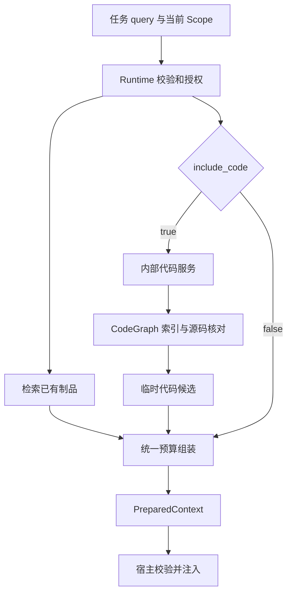

- Proposal Name: `git_repository_understanding`
- Start Date: 2026-09-15
- RFC PR: [oceanbase/powercontext#1619](https://github.com/oceanbase/powercontext/pull/1619)
- Status: Proposed
- Related RFCs: [Memory 准入](0014_memory_layer_design.md)、[Handoff](0048_handoff_artifact.md)、
  [评估体系](0081_end_to_end_evaluation_architecture.md)、[Scope 与宿主集成](1345_scope_organization_and_agent_integration.md)、
  [访问控制](1396_handoff_access_control.md)、[Source 模型](1400_source_definition_and_observation_model.md)、
  [Source API](1437_source_artifact_rest_api.md)、[上下文组装](1489_prepared_context_text_assembly.md)

# Summary

为 `prepare_context` 增加默认关闭的 `include_code` 开关，使 Agent 按本次任务从当前 Scope 配置的本地 Git 仓库获取
相关定义、调用关系和测试线索，并与 Memory、Experience 等历史上下文共享预算后交付。首期通过内部适配器接入
CodeGraph，支持一个 Scope 一个本地 Python 仓库；图索引作为可重建缓存，代码候选仅在请求内使用，不增加 Code
制品、业务数据库表或由用户管理的代码版本。代码暂不可用时省略补充并继续交付历史上下文，未启用时保持现有行为。

# Motivation

开发者给 Agent 一个任务：

> 修改 `PreparedContextBuilder.build_scopes_result` 的预算处理，检查调用入口和相关测试。

完成任务需要同时掌握三类信息：

| 信息 | 例子 | 获取方式 |
| --- | --- | --- |
| 当前代码事实 | 函数在哪里、谁调用它、哪些测试值得检查 | 按任务查询代码索引和源码 |
| 历史约束 | 为什么采用当前预算规则、哪些行为需要保持 | 现有 Memory、Experience 等制品 |
| 工作进度 | 已改动什么、验证过什么、接下来做什么 | 现有 Handoff |

PowerContext 已具备历史上下文和交接基础。本功能让 Agent 在准备上下文时直接获得相关代码，减少重复定位和手工拼接。
CodeGraph 提供结构分析，PowerContext 负责将结果放入当前任务的上下文，并控制出处、预算和访问范围。

成功的使用体验是：**提交任务 → 获得相关代码与历史约束 → 继续执行任务。** 保存分析报告、生成 Code 制品和维护
业务版本都不是这条路径的前置步骤。调用图及测试候选用于辅助判断，不代表完整的运行时关系或已经完成的测试。

# Guide-level explanation

## 配置仓库并准备索引

部署者为已有 Scope 配置一个允许读取的本地目录。配置示例如下：

```yaml
code:
  enabled: true
  repositories:
    scp_demo: /work/powercontext
  provider:
    name: codegraph
    executable: /opt/codegraph/bin/codegraph
```

`repositories` 是 Scope 到目录的配置映射，不创建 Repository 对象。首期一个 Scope 最多配置一个目录；同一目录可以
分别供多个 Scope 使用，各自执行授权并隔离缓存。普通 HTTP 请求不能指定任意服务器路径。

现有 workspace binding 继续帮助宿主找到 Scope。它不代表目录读取权限，也不会自动变成服务器路径。Scope 通过已有
流程创建或解析，目录名、Git remote、分支名不用于生成 Scope ID。

在仓库所在主机执行：

```bash
powercontext code index --scope scp_demo
powercontext code status --scope scp_demo
```

`index` 同步完成本地构建并报告结果；代码变化后再次执行即可。首期由部署者或已获授权的宿主工作流显式刷新，
不增加异步任务 API。`prepare_context` 使用有效索引，不在请求中等待全仓库构建。

## 按任务准备上下文

```http
POST /v1/context/prepare
Content-Type: application/json

{
  "scope_id": "scp_demo",
  "query": "修改 PreparedContextBuilder.build_scopes_result 的预算处理，需要检查哪些调用入口？",
  "max_bytes": 8000,
  "include_code": true
}
```

Runtime 自动从当前 Scope 的仓库获取相关代码，按预算与历史内容一起交付。请求不需要仓库 ID、快照 ID、分析结果
ID 或版本参数。已有 `assembly` 仍可用于选择 Memory、Experience、Profile 和 Topic Memory。

最终正文保留历史制品的章节顺序，并追加“当前代码参考”，其中包含相关片段、路径、行号及分析依据。完整文本共同受
8000 个 UTF-8 字节限制；宿主校验后原样注入，不再额外拼接一份图查询结果。

代码变化、索引缺失或分析超时时，本次省略代码补充，继续准备可用的历史上下文，并按预算显示未加入代码的原因。
省略 `include_code` 或设置为 false 时保持现有行为。普通准备流程不创建 Source 或 Artifact。

## 继续探索与交接

需要深入查调用者、影响范围或具体代码时，Agent 可使用独立代码查询工具，见[独立代码查询](#独立代码查询)。它与 prepare 复用同一服务，
不是 prepare 的必经步骤。

Handoff 继续记录目标、进度、约束和下一步。接收方重新准备上下文，以取得当时的当前代码。只有需要保留原始材料
供复核时，才显式保存为已有 Source，见[可选材料保存](#可选材料保存)；不自动把整份代码分析存成制品。

# Reference-level explanation

## 设计边界

| 决定 | 具体设计 |
| --- | --- |
| 接入位置 | 扩展现有 `POST /v1/context/prepare`，增加一个布尔开关 |
| 代码来源 | 一个已有 Scope 配置一个本地 Git 目录，首期支持 Python |
| 分析方式 | 通过内部适配器接入 CodeGraph，返回临时代码候选 |
| 交付方式 | 与历史上下文共享字节和条数预算，输出一份 PreparedContext |
| 不可用处理 | 代码暂不可用时省略补充，继续交付已有历史上下文 |
| 业务模型 | 保留现有 family 语义，不新增 Code Artifact 或业务数据库表 |

## 请求链路与职责



| 组件 | 职责 |
| --- | --- |
| 宿主 | 解析已有 Scope，启用代码补充，校验并使用最终文本 |
| Runtime | 执行授权，协调制品检索与代码查询，处理有限的代码不可用情况 |
| 内部代码服务 | 管理本地缓存、核对当前内容、调用适配器、规范化代码候选 |
| CodeGraph 适配器 | 检查引擎能力，建立索引，查询定义和关系，标明支持范围 |
| PreparedContextBuilder | 接收两类候选，选择和渲染完整出处，执行统一预算；保持无 I/O、无持久化 |

代码服务属于内置实现层，不要求公共的通用 provider 框架。Core 不依赖第三方数据库表或节点 ID；内部实现可以替换，
对外继续提供相同的准备与查询行为。

## 请求与响应契约

`PrepareContextRequest` 增加严格布尔字段 `include_code`，默认 false；null、数字和字符串无效。
`ContextAssemblySection.family` 保持现有制品类别，sections 上限仍为 4，`family=code` 仍是非法请求。

| 请求 | 行为 |
| --- | --- |
| 未提供 include_code，或值为 false | 既有默认值、错误映射和最终文本保持原行为，不访问代码服务 |
| include_code=true，未提供 assembly | 输出统一 Markdown；历史部分按默认 Memory 6、Experience 2 选择 |
| include_code=true，assembly={} | 使用相同的默认制品选择 |
| include_code=true，sections=[] | 只准备代码，不检索制品 |
| include_code=true，显式选择制品 | 保留所选类别、条数上限和顺序，另行补充代码 |

响应继续使用 `powercontext.prepared-context.v1` 的四个字段：`schema`、`status`、`content`、`content_bytes`。
代码来源是请求内的临时数据，不具有 Artifact 身份、Revision 或 CRUD 操作，也不伪造 ArtifactRef。

正文区分历史约束与当前代码参考，保留现有信任说明的含义和字面引用边界，明确所有内容均为不可信材料。代码注释、
README 和工具输出不能成为 Agent 的指令。宿主只在实际选中代码时记录代码已交付。

## 候选选择与输出边界

首期从问题中的路径、限定名称和符号词项查找候选，再有限展开定义及直接关系。自动 prepare 不调用模型生成仓库概述，
也不承诺任意自然语言问题都能定位模块；没有可匹配词项时可以不返回代码。复杂影响分析由独立工具按明确目标执行。

单次 prepare 的代码部分最多一次搜索与四次展开，合计最多 16 个候选；整个代码查询及内容核对共用 5 秒执行预算。
相同代码位置和关系去重，不把 CodeGraph 分数与 Memory 分数当成同一尺度比较。引擎输出读取也须有界。

内部候选保留以下数据，用于渲染、校验和诊断，不成为新的持久资源：

| 数据 | 用途 |
| --- | --- |
| 仓库相对路径、文件摘要、行范围、实际片段及其摘要 | 核对代码出处，裁剪后仍能解释引用 |
| 定义的路径、限定名称和起始行 | 区分同名函数或类 |
| 关系类别、来源方法、端点与可取得的调用点 | 区分调用、导入、引用、继承及启发式线索 |
| commit、纳入范围内的修改状态、内容指纹、核对时刻 | 确认图和源码来自同一份内容 |
| 覆盖、遗漏、解析失败和裁剪信息 | 限定结论适用范围 |

未知关系标记为 unknown，无法解析的端点保留缺失说明。零结果只表示本次范围内未找到；超时或损坏不能伪装为零结果。
测试识别规则至少覆盖根目录与嵌套目录的 `test_*.py`、`*_test.py`；候选测试不能用作自动跳过其他必需测试的依据。

## 统一预算

代码与历史内容共享 `max_bytes` 和服务端 `context_assembly_max_entries`，默认总条数仍为 8。
首期不增加请求侧的代码条数、优先级或占比选项，采用以下内部策略：

1. 代码去重后最多保留 4 条，且不超过服务端总条数上限。请求选择了历史制品时，代码条数还受总上限一半约束，向下取整。
2. 选择了历史制品时，完整代码部分最多使用总字节预算的一半；显式 sections=[] 时可使用全部预算。
3. 先固定代码候选，再用剩余预算按原有 sections 顺序选择制品；代码未使用的额度全部归还历史内容。
4. 展示顺序为历史章节、当前代码参考；标题、引用、限制、诊断和边界标记全部计入最终 UTF-8 字节数。

原有 section.limit 的请求校验保持不变，默认 6+2 不会因为 include_code=true 额外变成超限请求。输出中的代码和
制品合计受总上限约束，例如选入 3 条代码后最多再交付 5 条制品内容。每个 limit 都是上限，不保证凑满。

代码正文每条最多 2000 字节，按完整行裁剪，同时更新实际行范围与片段摘要。出处无法完整保留时省略整条。
所有选择均在同一个组装器内按完整输出核算，不由宿主拼接两份各自用满预算的结果。上述占比属于待评估的内部策略。

## 索引与当前内容的一致性

用户不管理代码分析版本，Runtime 仍须自动核对索引与源码是否一致。不能仅凭 HEAD commit、索引时间或 watcher
“没有事件”就认定内容新鲜，未提交修改也必须纳入判断。

本地构建过程：

1. 固定文件过滤策略，记录 HEAD、Git object format 和工作区状态。
2. 将纳入文件的实际磁盘内容复制到私有缓存，记录相对路径、Git mode、原始字节 SHA256 和大小。
3. 复查 HEAD、暂存区、文件集合和内容摘要；检测到并发变化时有限重试，仍不稳定则失败。
4. 在复制的内容上构建并验证索引，完成后原子发布缓存目录和当前指针。

采集包括工作区中的暂存、未暂存修改，暂存区旧内容不覆盖磁盘文件。Git 身份保留完整 SHA-1 或 SHA-256 object ID；
内部指纹同时绑定 Scope、目录配置、文件清单、过滤规则、适配器和引擎构建、实际索引摘要。

一次 prepare 固定使用同一份完整缓存，在交付前核对当前纳入范围。发生不匹配时丢弃本次全部代码候选，不混用旧图
和新文件。普通文件复制不是整个工作区的瞬时原子快照；本设计保证图和引用来自相同捕获字节，并说明核对时刻与范围，
不冻结后续编辑。

新构建使用独立目录，禁止就地修改已发布索引；旧目录在使用它的请求结束前不能回收。相同 Scope 的构建使用进程间
文件锁串行执行。中断的构建在重启后作废，残缺缓存不能变成 ready，已有完整缓存重新核对后才可使用。

首期 Runtime、仓库和构建命令位于同一主机并使用一致配置。索引是可重建的本地缓存；不提供分布式构建、持久任务
队列或任意历史 commit 查询。代码变化后的显式刷新是首期限制，后续再根据任务成本引入增量与自动刷新。

## 失败处理与可观测性

| 情况 | prepare_context 行为 |
| --- | --- |
| 未配置代码、缺少有效索引 | 省略代码，继续准备历史上下文 |
| 代码已变化、引擎或内容核对超时/不可用 | 丢弃本次代码候选，归还预算，继续准备历史上下文 |
| 正常查询没有匹配 | 正常空候选，不生成填充内容 |
| 认证、授权、非法路径或参数错误 | 正常失败，不通过降级绕过校验 |
| 已有制品检索失败 | 保持既有错误映射，不扩大异常吞并范围 |

有实际内容可交付时，在预算允许的前提下添加短说明，例如“当前代码参考未加入：索引需要刷新”，优先保留实际内容。
原因同时进入已有结构化 trace。两类候选都没有可交付内容时，继续返回 empty/null/0；诊断不能单独产生 ready。

记录代码查询耗时、是否匹配、入选条数和字节、覆盖、裁剪及省略原因。区分“查到代码”“实际入选”“宿主注入”，
工具调用成功不等于代码已经交付。日志和错误不输出原始代码、绝对路径、凭据或未经筛选的引擎 stderr。

## 访问范围与资源限制

在文件读取及引擎调用前检查当前 Scope 的 `scope.read` 和部署目录配置；不沿 Context References 扩展代码访问。
Scope admin 不能扩大部署允许的文件范围。撤销配置后，已有缓存也不再接受查询。Handoff evidence 的单独访问权限
不授予整个仓库的查询权。

默认只纳入 Git 跟踪文件；未跟踪文件由部署者显式启用并应用 `.gitignore`。跟踪文件仍应用显式排除规则，默认排除
凭据文件、构建产物和缓存。禁止路径逃逸、不跟随符号链接、不递归子模块、不下载 LFS 对象、不执行仓库代码。
不折叠大小写或合并归一化后的文件名；无法无损表示的路径、编码和未支持内容须报告遗漏或失败。

| 部署限额 | 首期默认值 |
| --- | --- |
| 纳入文件数量 / 单文件大小 / 总内容 | 20,000 / 2 MiB / 512 MiB |
| 缓存总额 / 单次构建超时 | 2 GiB / 10 分钟 |
| 单次代码查询与核对时间 | 5 秒 |

单文件过滤计入遗漏；总量超限或空间不足则构建失败，不按目录遍历顺序任意选前 N 个文件。限额由部署者调整，普通
查询不能提高。先采用全量构建与相同内容缓存复用；优化不能削弱一致性和资源上限。

## 独立代码查询

新增 `POST /v1/scopes/{scope_id}/code/query`，operationId 为 `query_code`；MCP 暴露只读
`powercontext_code_query`。它们与 prepare 复用内部代码服务，适合继续探索或检查状态，不创建 Source/Artifact。

请求字段为严格的 `operation` 判别联合、可选 `expected_fingerprint` 和 `max_bytes`，未知字段拒绝。

| operation.kind | 输入与范围 | 输出 |
| --- | --- | --- |
| status | 无 | 协议、已验收能力/语言、disabled/missing/building/ready/stale/failed 状态 |
| tree | 可选相对目录，深度默认 2、最大 5 | 纳入文件和目录 |
| symbols | 非空 query，最多 8192 字符；可选路径 | 分别列出定义、签名与代码位置 |
| callers / callees | 路径、限定名称、定义起始行 | 精确目标的直接关系 |
| impact | 同上，深度默认 2、最大 5 | 有界影响路径与逐边依据 |
| affected_tests | 最多 100 个 changed paths | 测试候选、关联依据与遗漏 |
| read | 路径、文件 SHA256、1-based 闭区间行范围，最多 200 行 | 经摘要验证的原文 |

除 status/tree/symbols 外均须带上先前结果的 `expected_fingerprint`。这是 Agent/SDK 自动传递的一致性校验值，
不用于选择或管理历史版本。目标有歧义时不能合并结果；不存在于当前索引的删除或重命名前路径不能解释为无影响。

列表 limit 默认 20、最大 50；遍历最多 500 个节点和 1000 条边。单次查询及核对总预算为 5 秒。
成功 JSON body 的 max_bytes 默认 16000、范围 512–32768；结构、限制和引用均计入，无法容纳最小有效响应时返回
budget_too_small。片段按完整行裁剪并更新范围和摘要，引用不能截断。

非 status 响应使用 `schema=powercontext.code-query.v1`，包含 scope_id、fingerprint、完整 commit、git_object_format、
dirty、checked_at、operation、status（ok/partial）、items、coverage、limitations。items 保留[候选选择与输出边界](#候选选择与输出边界)的出处与
关系信息，dirty 指纳入范围内的修改。status 响应使用独立分支，带可用的当前指纹；状态须实际检查，构建成功不等于当前仍匹配。

查询及 status 在调用引擎前检查 scope.read 和目录配置。该接口用于功能协商，不向现有封闭的 `/v1/capabilities`
响应追加字段，也不要求调用方额外获得 server.observe。显式查询与 prepare 的降级策略不同：

| 显式查询错误 | HTTP 行为 |
| --- | --- |
| 参数、路径、目标缺失/歧义或预算不合法 | 422，沿用既有错误体格式 |
| 未认证或未授权 | 401 / 403 |
| 未配置、缺少有效索引、引擎/核对不可用 | 503 |
| 当前内容或指纹不匹配 | 409 code_changed，刷新后重新定位 |
| 操作或语言未支持 | 501 unsupported_capability |

status 本身成功报告 disabled、missing 等状态；prepare 的处理规则以[失败处理与可观测性](#失败处理与可观测性)为准。

## 可选材料保存

需要保存当时依据时，将选定查询的完整有界 JSON 响应作为 content，调用已有
`POST /v1/scopes/{scope_id}/sources`，source_type 使用 content，再由 Handoff 的 source_refs 引用返回的 name 和
source_id。提交前可缩小查询范围；保存时不扩读、不重新查询，重试沿用现有创建语义，不额外承诺同内容去重。

这是一份普通 Content Source，证明保存了调用方提交的材料，不认证材料一定由服务器产生。查询 schema 是内容格式，
不是保留的可信凭证；摘要不构成来源签名。请求中的目标 Scope 和既有 scope.contribute 决定写入权限，内容字段不能授予权限。
既有写路径统一生成 JSON wire_content 和内部规范化文本 content，索引清理不影响已保存原文。

显式保存代码材料时，默认 Memory/Topic Memory 的自动处理须跳过 `powercontext.code-query.v1`，同时覆盖 JSON
对象和含该对象的 JSON 文本。写入时不单独触发自动任务；后续普通 Source 推进 journal 窗口时，消费者也须跳过并正常
推进位置。不能使用 lineage_only，因为 Handoff 和显式 generation 仍需读取。删除格式标记后作为普通文本保存，遵循普通 Source 策略。

上述规则属于自动处理准入，不是来源认证。Handoff 只引用持久 Source，不把缓存指纹当作 SourceRef；接收方仅有
Handoff evidence 权限时，不能借此查询仓库。正常 include_code 流程不依赖本节，也不执行这些写操作。

本节的验收覆盖索引清理后原文仍可读取、修改材料后不产生来源认证，以及代码 Source 后追加普通 Source 时自动处理
跳过代码并推进位置、普通内容照常处理。SQLite 与 OceanBase 继续遵守相同的保存和交接语义。

## 接口、存储与实现改动

| 范围 | 需要的改动 |
| --- | --- |
| HTTP / Client | prepare 请求增加 include_code；新增独立代码查询接口，见[独立代码查询](#独立代码查询) |
| Runtime | 按任务获取临时代码候选，处理代码不可用，统一预算与来源渲染 |
| 现有 family | 保持不变，代码不经过 Artifact 注册和制品检索 |
| 本地 CLI / MCP | 提供索引与状态命令、只读代码查询工具 |
| 业务数据库 | 不新增表；正常准备不写 Source、Artifact 或 Memory |
| 本地缓存 | 保存捕获内容、文件清单、图索引和构建状态，可删除重建 |
| 可选材料保存 | 复用 Content Source 与 Handoff；自动记忆准入要求见[可选材料保存](#可选材料保存) |

Git 采集及 CodeGraph 适配可放入 `src/powercontext/builtin/code/`。Runtime 负责读取协调；
`src/powercontext/builtin/runtime/prepared_context.py` 及相关文本模型增加临时代码来源分支，保持 Builder 无 I/O。
CodeGraph 自身的 SQLite 索引属于本地缓存，不是 PowerContext 的新增业务表。

引擎是可选部署依赖，固定经过验收的构建及摘要。适配器使用 CLI JSON 或受控进程中的公开 API，不直接依赖其数据库
表结构。若 CLI 不能按文件和定义消歧，选择通过验证的 API 路径或构建；能力缺失时明确失败，不能合并同名定义。
调用使用参数数组，关闭遥测、更新检查和自动 Agent 配置写入；查询不自动安装或升级引擎。

OpenAPI 仍是 HTTP 契约唯一来源。实现时修改 `openapi/powercontext.yaml`，运行 `make api-generate` 和
`make contract-test`，不手改生成模型。同步覆盖 Runtime、Server、Client、宿主和文档契约。

功能默认关闭，已有用户无需迁移业务数据。新宿主只在启用代码能力时通过独立代码查询的 status 协商；旧 Server 不支持时
关闭代码补充并说明原因。缓存格式、引擎或配置变化可以要求重建，已显式保存的 Source 内容不重写。

## 首期交付与验收

### 交付范围

| 阶段 | 交付内容 | 完成标准 |
| --- | --- | --- |
| P0：真实任务验证 | 固定 CodeGraph 构建，在同一 Agent 工作流中试用代码查询与 PowerContext | 定位价值、漏报及部署成本可评估 |
| P1：原生上下文补充 | 本地 Python 仓库、索引、include_code、统一预算、降级及独立查询 | 跑通任务准备、宿主注入、执行验证与交接后继续 |

P1 不包含远程 clone/pull、凭据管理、webhook、跨仓库图、全仓库 LLM 摘要、向量检索、自动修改代码或执行测试。
Source 材料保存是可选能力，日常 prepare 和接收 Handoff 都不要求先保存代码分析。

### 必须验证的行为

| 场景 | 验收结果 |
| --- | --- |
| 开关省略、false；默认和自定义 assembly | 旧行为保持；true 不产生虚假的 6+2 请求超限 |
| sections=[]、非布尔开关、family=code | 分别只查询代码、拒绝非法开关、拒绝非法制品类别 |
| 小预算、中文、长行、恶意 Markdown | 全文 UTF-8 字节和总条数受限，引用完整，正文保持字面包装 |
| 代码无匹配、缺索引、超时、晚于查询的文件变化 | 归还代码预算并正确降级；无实际候选时保持 empty |
| 暂存与未暂存差异、采集中编辑或切分支 | 使用明确捕获内容，变化时重试或失败，图和源码不混用 |
| 同名定义、不同 Scope 指向相同目录 | 目标消歧，授权与缓存隔离 |
| 动态关系、pytest 路径、删除/重命名目标 | 范围与遗漏可见，无法分析不等于无影响 |
| 并发构建、查询期间发布新缓存、中断或重启 | 请求固定完整缓存，残缺构建不成为 ready |
| 越权、目录撤销、路径逃逸、Handoff 单独分享 | 在访问前拒绝越界，不因降级或共享而获得仓库权限 |
| 正常 prepare 和宿主交付 | 不写 Source/Artifact；最终文本校验后原样注入，入选事实可观测 |
| 交接后继续工作 | 复用进度与约束，重新获取当前代码；可选 Source 按原引用读取 |

通过公共 Runtime、HTTP、实际宿主和真实引擎观察结果。CodeGraph 至少运行小型 Python 夹具与 PowerContext 源码
两组验证；mock、索引节点数和进程退出成功都不能替代结构正确性与实际交付证据。

### 任务效果评估

选择 12–20 个跨模块任务，覆盖定位、调用路径解释、接口修改、测试线索和交接。固定模型、提示、基础工具、已有
Memory、初始代码和预算，按任务配对比较启用与关闭代码补充的结果，并报告重复运行的波动。

记录正确定位耗时、跨文件发现调用、关系与测试召回/误报、索引/查询成本、注入字节、模型 token、补丁正确性和实际
回归检查。授权、内容一致性和预算反例必须全部通过；产品推广以补丁正确性无明显退化、定位效率稳定改善为依据。
测试筛选收益若未得到验证，只宣称已验证的代码定位能力，不用厂商 benchmark 或索引规模替代任务结果。

# Drawbacks

- 需要部署代码分析引擎、管理缓存和执行索引刷新，增加依赖与运维成本。
- 复制内容、建立索引和核对当前工作区会占用磁盘与时间，小任务或大仓库未必获得净收益。
- 静态关系可能漏报或误报，尤其是动态调用、框架注册和无法解析的导入，需要展示分析依据与范围。
- 代码与历史制品竞争同一上下文预算，固定占比可能减少某些任务所需的历史约束，必须通过任务评估调整。
- 首期每个 Scope 只有一个本地目录，且需要显式刷新；频繁编辑时可能暂时无法加入代码，多仓库和远程场景尚未覆盖。

# Rationale and alternatives

## 为什么直接补充 PreparedContext

本功能服务于当前任务中的代码定位。代码事实可以从仓库重新计算，且会随编辑变化；将其作为请求级候选，可以复用
已有 Scope、预算和宿主交付流程，避免额外建立生成、保存、业务版本和过期管理。值得长期复用的设计决策继续遵循
Memory/Experience 准入，确需保存的原始材料使用已有 Source。

`include_code` 表达准备选项，现有 family 继续表示制品类型。Runtime 自动核对图和源码的一致性，调用方无需选择
代码版本。授权错误仍正常失败，代码分析暂不可用则让历史上下文继续交付。

## 备选方案

| 方案 | 适用价值 | 本提案的取舍 |
| --- | --- | --- |
| 完整自研代码分析 | 可自主控制语言与分析策略 | 需要长期维护解析、消歧和更新算法，优先复用经过行为验证的引擎 |
| 嵌入完整外部系统 | 可以直接获得更多界面和管理能力 | 容易重复引入存储、权限与安装流程，首期只接入结构分析能力 |
| 仅并列安装 CodeGraph MCP | 接入快，适合 P0，也可独立使用 | 无法自动提供统一准备与预算，原生集成复用同一代码服务补充 prepare |
| 持久化 Code 制品 | 适合持续维护分析成果的场景 | 当前目标是按任务使用可重建事实，额外的制品生命周期收益不足 |
| 将代码加入 assembly.family | 可以沿用章节选择格式 | 会混淆临时代码与持久制品，保留 family 语义并使用独立准备开关 |
| 全量代码进入 Memory | 可以沿用记忆检索入口 | 变化频繁且可重建，容易带来噪声和陈旧内容，不符合现有 Memory 准入 |
| 不实现原生补充 | 继续使用现有代码读取和搜索工具 | Agent 仍需自行定位并拼接上下文，缺少统一预算与交付记录 |

本提案保留文本搜索与直接源码读取工具，CodeGraph 的结果仍需核对。是否替换引擎或增加更强检索，由真实任务中的
失败类型和成本决定，不把上游索引规模或宣传指标作为选择依据。

# Prior art

## PowerContext 已有机制

Scope 提供工作上下文的组织与绑定；PreparedContext 提供有出处的文本组装和统一预算；Source 与 Handoff 提供
可选材料保存和交接。代码补充沿用这些边界，不扩展现有制品类型，也不改变普通准备请求的只读性质。

## CodeGraph 与预研

[CodeGraph](https://github.com/colbymchenry/codegraph) 是首个适配对象，本提案沿用 PowerContext 自身的 Scope 与交付模型。
并列安装 CodeGraph MCP 适合 P0，原生集成进一步提供按任务补充、统一预算和宿主交付。

预研使用官方 Linux x64 v1.6.0 发布包，在预研时的 PowerContext 源码与测试范围建立索引，工具报告处理 574 个
Python 文件。`PreparedContextBuilder.build_scopes_result` 的 7 个直接
调用者，其函数名、文件和起始行与独立 Python AST 检查一致，包括两个生产代码调用者和五个测试函数。

预研也发现同名定义关系合并、默认测试路径漏报及同步前返回旧关系。所核查的 CodeGraph 采用 MIT 许可；适配所需能力
必须通过实际发布构建验证。现有预研未证明补丁成功率、端到端 token 收益、watcher 或真实 MCP 宿主效果。

# Unresolved questions

RFC 合并前需要确认以下边界及其验证依据：

1. **首期引擎构建。** 确定能够通过同名消歧、pytest 路径、内容核对和宿主测试的 CodeGraph 构建及支持矩阵。
2. **资源与延迟。** 用代表性仓库核对全量刷新、内容检查和 5 秒查询预算的成本，确认首期目录规模与默认限额合理。
3. **上下文分配。** 用真实任务验证代码占比、候选相关性和补丁结果，确认固定预算策略是否足以支撑首期使用。

首期明确排除远程仓库摄取、分布式构建、多仓库授权、历史版本比较和全仓库语义检索。它们不是当前实现的隐含前提；
涉及远程执行、凭据或跨仓库访问时，需要另行设计其接入与授权协议。

# Future possibilities

- **自动与增量刷新：** 减少频繁编辑后的等待，继续保证请求使用完整且与当前内容一致的缓存。
- **更好的任务定位：** 根据失败案例增加自然语言模块检索或目录摘要，并保留生成依据和内容核对。
- **更多语言与分析方法：** 扩展经过行为验证的支持矩阵，清楚标明关系来源和覆盖缺口。
- **远程与多仓库：** 在有明确使用场景后增加接入、选择和授权能力，避免提前建立新的管理对象。
- **历史版本比较：** 支持删除、重命名等跨版本影响分析，仍不把缓存身份当作持久证据引用。

这些方向是本提案的自然扩展，不作为接受或交付首期能力的必要条件。其顺序由真实任务效果和部署成本决定。
