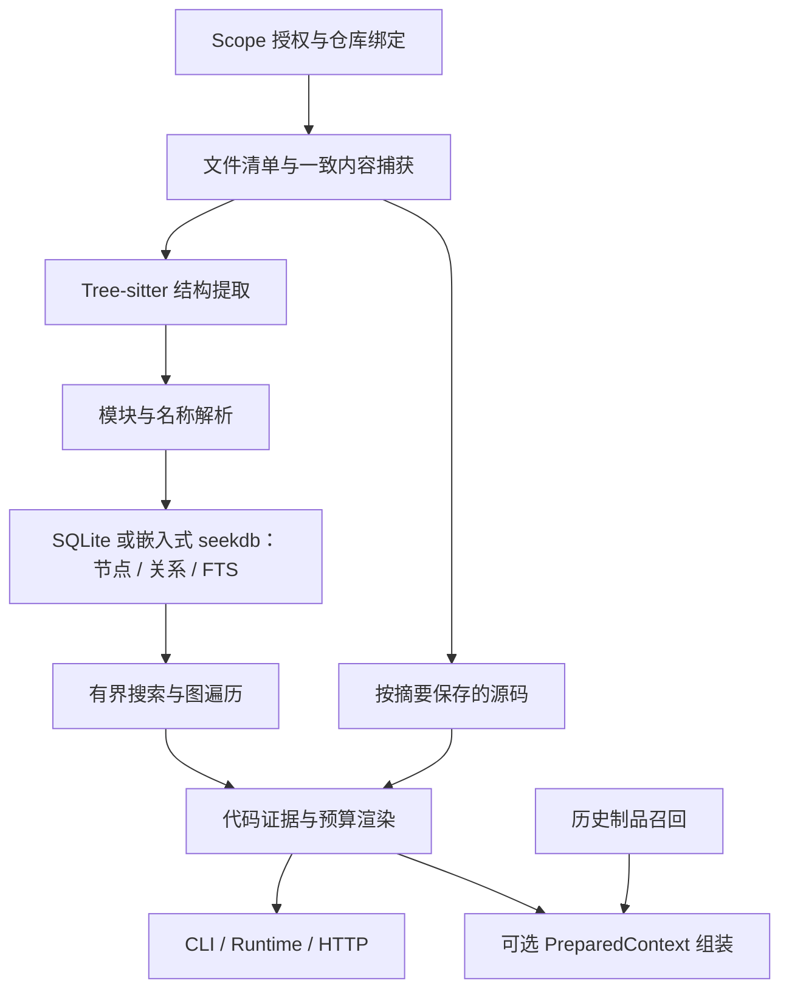

- Proposal Name: `native_git_code_understanding`
- Start Date: 2026-09-21
- RFC PR: [#1708](https://github.com/oceanbase/powercontext/pull/1708)
- Status: Implemented — experimental, opt-in
- Design Baseline: [PowerContext c1c83c52](https://github.com/oceanbase/powercontext/tree/c1c83c52c8916bbe3df73842fb1d1998d3fb788d)
- Related RFCs: [Memory 准入](0014_memory_layer_design.md)、[评估体系](0081_end_to_end_evaluation_architecture.md)、
  [Scope 与宿主集成](1345_scope_organization_and_agent_integration.md)、[Source 模型](1400_source_definition_and_observation_model.md)、
  [上下文组装](1489_prepared_context_text_assembly.md)、[召回充分性](1560_recall_sufficiency_gate.md)、
  [Git 仓库理解提案 #1619](https://github.com/oceanbase/powercontext/pull/1619)

# Summary

在 PowerContext 内实现原生代码理解引擎：读取获授权的本地 Git 工作区，以 Tree-sitter 提取符号和引用，通过静态名称解析建立跨文件关系，使用 SQLite/FTS5 或嵌入式 seekdb 提供仓库导航、符号检索、调用者/被调用者、变更影响、候选测试和带出处的源码读取。生产路径不依赖 CodeGraph 进程、CLI、MCP 或数据库格式，也不要求 LLM、embedding 或图数据库。代码图是可以重建的当前代码缓存，Memory、Experience、Profile、Topic Memory 和 Handoff 继续承载历史知识与工作状态。

SQLite 使用独立缓存中的 `code_nodes`、`code_edges` 普通表和 `code_search_fts` 全文索引虚拟表。
嵌入式 seekdb 在配置的本地数据库中使用 `pc_code_generations`、`pc_code_nodes`、`pc_code_edges` 三张专用表及原生全文索引。
文件清单、源码快照、诊断及每文件原始解析事实保留在本地缓存文件中；现有 Artifact 表保持原有结构。

Python、TypeScript/JavaScript 和 Go 混合仓库已具备显式闭环：**索引仓库 → 定位入口 → 展开关系 → 阅读证据 → 修改代码 → 增量同步 → 复核影响与测试**。CLI、Runtime、Client、HTTP/MCP、可选 PreparedContext 和 Codex/Claude Code Hook 已接入，默认关闭。安装和调用见[仓库代码工作流](../docs/workflows/repository-code.md)。A/B 的主要对照是 CodeGraph 核心引擎与原生引擎，另设普通搜索/读取基线；自动加入 PreparedContext 作为独立实验。本文的质量、成本与性能门槛是发布判据，不代表已达标的承诺。

# Motivation

## 场景和痛点

开发者要求 Agent：

> 修改 PreparedContext 的预算处理，找出受影响的 HTTP/MCP 入口，确认 Topic Memory 不会丢失，并补齐回归测试。

普通搜索能够找到名称，但开发者仍要反复读取定义、追踪别名导入、判断调用方向、排除同名符号，最后再寻找测试。只有代码摘要时，Agent 可能知道模块的用途，却无法指出某个判断来自哪一行、哪些调用路径受到改动影响。只保存 HEAD 也无法区分同一提交下的两个脏工作区。

本功能把这些定位步骤变为可追溯的查询：每条关系附带解析依据，每段源码附带内容指纹，未解析关系和不支持的语言可见。返回的测试始终是候选，不能据此跳过项目要求的其他测试。

| 用户问题 | 所需能力 | 最终可检查的结果 |
| --- | --- | --- |
| 这个仓库从哪里开始看？ | 目录树、文件结构、入口线索 | 有路径与定义位置的仓库地图 |
| 这个功能在哪里？ | 路径、符号、签名、文档字符串检索 | 可消歧的定义及原文 |
| 谁调用它，它又依赖谁？ | 跨文件解析、双向遍历 | 带调用点和依据的关系路径 |
| 改这里还要检查什么？ | 反向影响分析、测试关联 | 有限的影响集合和遗漏说明 |
| Agent 改完后还能信这个图吗？ | 内容一致性、增量更新 | 新指纹或明确的过期错误 |

## 现有能力与待补能力

基线已具备 Scope、Source 证据、Artifact、PreparedContext 和宿主集成，尚无 `include_code` 或 `query_code` 实现。Source 的捕获/引用语义不等于代码索引；Git 克隆辅助函数也不提供符号解析或持续同步。

当前省略 `assembly` 的 prepare 会召回 Memory、Experience、Topic Memory；显式 `assembly={}` 的默认章节是 Memory 6 条、Experience 2 条。两种现有行为不同，实现不得用同一个默认值覆盖它们。

本方案需要验证两个假设：结构关系能够减少跨文件调查成本；原生实现能以可接受的解析维护成本提供接近或优于 CodeGraph 的有效证据。减少 MCP 调用次数、返回更多节点或通过更多内部单元测试，都不能单独证明上述假设。

# Guide-level explanation

## 最小使用闭环

部署者将一个已有 Scope 绑定到一个允许读取的本地仓库。配置示意：

```yaml
code:
  enabled: true
  repositories:
    scp_demo:
      root: /work/powercontext
      source_roots: [src, .]
      include_untracked: false
  cache_dir: /var/lib/powercontext/code-cache
```

`source_roots` 只帮助解析导入，不扩大允许读取的根目录。首期一个 Scope 一个工作区；同一个 Git 仓库的两个 worktree 必须使用不同绑定和缓存。workspace binding 可以帮助找到 Scope，但不授予文件读取权限。HTTP 调用者不能传入任意服务器目录。

本机 CLI 中，`query` 从文件读取统一请求格式，避免为每种操作增加一套参数语义：

```bash
powercontext code index --scope scp_demo
powercontext code status --scope scp_demo
powercontext code query --scope scp_demo --request-file code-query.json
powercontext code sync --scope scp_demo
powercontext code clear --scope scp_demo
```

```json
{
  "operation": {
    "kind": "explore",
    "query": "PreparedContextBuilder build_scopes_result",
    "path_prefix": "src/powercontext"
  },
  "max_bytes": 16000
}
```

Agent 先得到定义、少量直接关系及相应源码位置。继续展开时使用返回的 `symbol_id` 与 `expected_fingerprint`。如果代码在此期间变化，收到 `code_changed`，执行同步后重新定位；不能把旧节点 ID 直接用于新图。

`index` 全量构建，`sync` 增量提取并更新关系，均同步返回结果。查询不隐式构建全库。宿主可以在编辑结束后触发本地同步，但必须把同步耗时纳入任务成本。

## 能力范围

| 能力 | 首期验收范围 | 不作出的保证 |
| --- | --- | --- |
| 仓库地图 | 目录、多语言文件、定义签名、导入和测试入口线索 | 自动解释整个业务架构 |
| 符号检索 | 名称、限定名、路径、签名、文档字符串；README 标题导航 | 任意纯中文问题都能准确匹配英文实现 |
| 调用关系 | 各语言词法作用域、显式导入及别名、ESM 导出、Go 包内关系和可解释的接收者线索 | 完整运行时调用图、动态类型证明 |
| 影响分析 | 调用、导入、继承、引用的有界反向路径 | 完整数据流、所有副作用、无遗漏的安全结论 |
| 测试关联 | 静态调用/导入路径和明确标注的名称/目录线索 | 自动决定哪些测试可以不跑 |
| 更新 | 新增、修改、删除、重命名、分支切换、工作区修改 | 首期分布式构建或实时 watcher |
| 其他语言 | 文件树与受限文本读取，能力列表标注 unsupported | 用空图冒充支持 |

首批语言为 Python、TypeScript/JavaScript（含 TSX/JSX）和 Go，允许在同一仓库混用。具体扩展名与静态关系边界见[仓库代码工作流](../docs/workflows/repository-code.md#多语言范围)。代码外的文档只辅助导航，不生成调用边。首期不克隆远程 Git、不下载依赖、不执行仓库代码、不建立跨仓库图。

## 与历史上下文协作

Agent 可以分别调用现有 `prepare_context` 获取历史约束、调用原生代码查询获取当前事实。先验证这条路径，再增加默认关闭的 `include_code` 自动补充。不需要先建立 Code Artifact，不会把每次解析得到的函数和行号写入 Memory。

Handoff 记录目标、约束、验证结果和下一步；接收方重新查询当前工作区。确需保留当时依据时，显式把有界查询结果保存为已有 content Source。缓存指纹不是永久证据地址，Source 也不因保存结果而获得整个仓库的读取权限。

# Reference-level explanation

## 1. 架构与职责



建议新增 `src/powercontext/builtin/code/`，按 `capture`、`extract`、`resolve`、`store`、`query`、`render` 和 `service` 划分职责。这是实现组织建议，不是对外模块稳定性承诺。

| 组件 | 拥有的行为 |
| --- | --- |
| CodeService | Scope/绑定校验、索引生命周期、统一截止时间、固定一次查询的 generation |
| RepositoryCapture | Git 文件清单、文件范围过滤、安全读取、manifest 与内容摘要 |
| 语言提取器 | 只从输入字节提取声明、作用域、引用、调用点与解析错误 |
| 语言关系解析器 | 模块映射、导入和名称绑定、关系依据、未解析/歧义引用 |
| GraphStore | 节点、关系、FTS 三张逻辑表，以及配套缓存文件的原子发布与读者生命周期 |
| CodeQueryEngine | 地图、检索、探索、遍历、影响与测试候选 |
| CodeEvidenceRenderer | 出处完整性、去重、范围裁剪和有界输出 |

原生引擎直接使用固定版本的 Python Tree-sitter binding，以及 Python、JavaScript、TypeScript/TSX、Go grammar，通过可选 `code` extra 安装并锁入 `uv.lock`。不依赖 CodeGraph 的解析器、npm 运行时或私有节点结构。解析器在受资源限制的工作进程执行，避免大文件或异常语法阻塞服务事件循环。安装验收覆盖项目支持的 Python 版本及 wheel/sdist；缺少可用解析器时报告解析失败，不在生产启动时临时下载 grammar。

代码存储跟随本地部署方式：嵌入式 seekdb 使用配置的数据库目录；SQLite 和 OceanBase 部署沿用独立 SQLite/FTS5 代码缓存。
GraphReader/GraphStore 隔离 SQL 与解析、遍历、证据渲染和 PreparedContext。代码索引仍是仓库所在主机的可重建缓存，
不支持多服务实例共享；全文检索后端不可用时明确失败。

## 2. 内容身份与存储模型

`binding_id` 是本地部署生成的不透明标识，绑定 Scope、规范化工作区根目录和访问策略；不能仅由 remote URL 或分支名派生。缓存按绑定隔离。`generation` 是一次完整发布的索引，`fingerprint` 是其内容与分析规则身份，不是业务 Artifact revision。

```text
fingerprint = sha256(canonical_encoding(
  binding_id, git_object_format, head_or_unborn,
  sorted_manifest[path, mode, content_sha256, size, inclusion_status],
  filter_policy_digest, resolution_config_digest,
  parser_build, resolver_build, schema_version
))
```

使用明确长度的规范编码，不能靠字符串连接拼接。`resolution_config_digest` 包含 `source_roots` 等名称解析配置。HEAD 保留完整 Git object ID；内容摘要固定 SHA-256，两者不混淆。`dirty` 单独记录纳入范围内相对 HEAD 的修改；相同 HEAD 不代表相同内容。暂存与未暂存并存时，以实际磁盘字节为当前分析内容，并保留 Git 状态观测。

SQLite 使用 **3 张逻辑表：2 张普通表 + 1 张 FTS5 虚拟表**。文件和引用通过节点与关系表达，不创建独立 Artifact 类型。

| 表 | 记录与主要字段 |
| --- | --- |
| `code_nodes` | 文件与定义统一为节点；id、kind、file_id、parent_id、path、name、qualified_name、language、签名、文档字符串、字节/行范围；文件节点补充内容摘要和解析状态 |
| `code_edges` | 可遍历的静态或候选关系；source_id、target_id、kind、调用点、resolution、rule_id、reference_key |
| `code_search_fts` | 以节点为检索单元，索引路径、名称、拆分标识符、签名、文档字符串和选定文档标题 |

纳入查询范围的文件使用 `kind=file` 节点，函数、类、方法等通过 `file_id` 归属文件、通过 `parent_id` 表达词法层级。省略文件只列入 manifest。源码范围和图邻接使用普通列及索引，不能为了合表而把高频查询字段都放入 JSON。FTS5 自动生成的内部辅助表不计入这 3 张逻辑表，应用不维护其生命周期。

嵌入式 seekdb 使用三张普通表：`pc_code_nodes` 和 `pc_code_edges` 按 generation 隔离图记录；
`pc_code_generations` 保存绑定、内容摘要、记录数量和序列化大小，节点搜索字段使用原生全文索引。
路径与名称采用二进制比较，保留大小写、字面通配符及空格的差别。绑定身份包含后端与规范化 seekdb 目录，
避免切换数据库后误用其他索引。`pylibseekdb>=1.4.0.post1` 支持本机 CLI 与 Server 打开同一目录；
图查询连接全部结束后才关闭嵌入式句柄，部署范围仍限于本机。

构建先持久化清理描述文件，再提交完整、不可变的图记录，最后原子发布本地版本指针。
源码、facts、诊断文件与数据库记录按同一 manifest 校验。发布中断保留此前指针；回收取得读者锁后，
才删除无引用版本的数据库记录及本地文件。缓存预算统计本地文件与图记录的序列化大小，
seekdb 的物理索引、日志、引擎元数据和预留空间属于额外磁盘开销。

其余数据的落点明确如下：

| 缓存数据 | 保存方式与用途 |
| --- | --- |
| 文件清单与 generation 元数据 | `manifest.json`：路径、mode、摘要、大小、语言、纳入/省略原因、构建版本、父 fingerprint、coverage、数据库及 facts 文件校验值 |
| 每文件解析事实 | `facts/<extraction_key>.json`：声明、词法作用域、全部原始引用及调用点、import/alias/re-export 语法事实、解析错误；保留复用所需的完整提取结果 |
| 模块与名称绑定 | 构建时由 manifest、source_roots 和 facts 生成内存索引；不持久化为独立 SQL 表 |
| 未解析引用与歧义原因 | 随 generation 发布 `diagnostics/<file_key>.json`，通过 reference_key 对应原始事实；汇总数量写入 manifest |
| 源码与当前指针 | 按内容摘要保存源码；`current` 仅指向完整 generation，读者 lease 使用缓存文件 |

`extraction_key` 绑定相对路径、文件摘要、语言、parser_build 和提取格式版本。路径进入 key，防止同字节文件换位置后错误复用位置相关事实。facts 保存语法事实而非已解析目标，名称解析配置和 resolver 变化时可以重新解析。只有已核对摘要的不可变 facts 才能复用；缺失、损坏或提取格式不兼容时重新提取。

每次构建从 facts 重建关系与 diagnostics；原始引用即使解析成功也不会被删掉。没有目标的引用不伪造图节点或空目标边，原因在 diagnostics 中保留；有候选目标时可生成明确标记的 candidate 边。`code_edges.reference_key` 指向本 generation 绑定的原始调用/引用位置，结构性的 contains 边可不带该字段。测试线索与影响集合按查询计算，不增加测试映射表。

`manifest.json` 是快照清单的权威记录，文件节点是供查询使用的投影；发布前核对二者的路径、摘要与解析状态一致。manifest、facts、diagnostics、代码图和源码共同组成 generation，一起校验和发布，禁止单独替换其中一份文件。数据库和配套文件的校验值是发布完整性数据，不参与自身内容摘要的循环计算。

这种存储方式保留三类主要查询：节点定位、关系遍历和全文检索；代价是全库原始引用/未解析诊断需要按文件汇总，不能直接做 SQL 联表分析。构建时重建的模块索引和读取 facts 的成本纳入内存、同步和诊断预算。首期接受这一取舍；后续仅在实测证明文件汇总成为瓶颈时评估独立引用表。

符号 ID 由路径、种类、词法限定名和声明字节位置生成，引用时必须同时带 fingerprint；不承诺移动或改名后的稳定 ID。相同限定名的条件定义仍有不同 ID。

Tree-sitter 使用字节位置。结构提取支持可严格解码的 UTF-8 Python、TypeScript/JavaScript 和 Go 文件；非 UTF-8、二进制及不支持的语言列入 coverage，不错误地转换后复用原字节偏移。API 行号为 1-based 闭区间，字节范围为半开区间。CRLF 和非 ASCII 内容必须可逐字节回读。

源码按内容摘要保存在私有缓存。只允许 generation manifest 中的文件通过查询返回。发布后的图记录与源码对象不可变，不硬链接可被用户编辑的工作区文件。

## 3. 结构提取和跨文件解析

语言注册表集中管理扩展名、安装包、grammar 版本、测试文件约定和提取规则版本。工作进程按语言/TSX 方言惰性加载解析器，输出统一的节点、作用域、引用和诊断；Python 沿用原有解析规则，JS/TS 与 Go 各自解析模块及包关系，然后合并到同一图。解析器和 resolver 的版本进入 fingerprint；单文件提取缓存只依赖其自身语言规则，规则升级后旧索引须同步。

JS/TS 解析相对 ESM 导入与具名/默认导出，无法唯一定位模块时保留候选。Go 从捕获的 `go.mod` 获取当前模块身份，在同一包或同一模块的显式导入中解析函数，构建标签和平台文件不作运行环境选择。跨语言仅共享检索，不由同名符号推断调用。新增语言需提供提取和关系规则、注册 grammar，并补充行为回归；图存储、引用校验、预算与 PreparedContext 组装无需另建一套。

第一遍记录文件、类、函数、方法、嵌套定义、签名、装饰器、继承表达式、import 和调用/引用点。第二遍建立内存模块索引并解析引用，顺序固定：词法局部绑定 → 显式 import/alias → 相对导入 → 仓库内模块导出。`src` layout 由 `source_roots` 解决；namespace package 或多 root 同名模块有歧义时返回候选，不执行 Python 导入来猜答案。

支持 `from x import y as z`、`import x as z` 和可静态读取的 `__all__`/re-export；`import *`、动态 `__all__`、`sys.path` 修改、`getattr` 和 monkey patch 保留未解析或候选状态。语法错误文件允许提取不受 ERROR/MISSING 节点影响的定义，但不能对错误覆盖区域建立确定关系。

关系 kind 与解析强度是两个维度：

| 字段 | 值与含义 |
| --- | --- |
| kind | `contains`、`imports`、`calls`、`inherits`、`references` |
| resolution | `resolved_static`：在声明的静态规则下唯一绑定；`candidate`：存在明确但不充分的接收者/名称线索 |
| unresolved reference | 没有可解释目标，保留原因，如 dynamic_receiver、external_import、ambiguous_module、parse_error |

例如 `self.run()`、类型注解或 `obj = Client()` 能形成候选关系，不能据此声称运行时接收者已被证明。同名匹配本身不产生 `resolved_static` 调用边。首期不补全框架路由、依赖注入、反射或装饰器隐含调用；后续规则必须携带 `rule_id`、独立回归样例及版本。

统计分别报告 eligible/parsed/failed/skipped 文件数，以及已解析/候选/未解析引用数。解析引用占比不是实际调用图召回率；需要人工标注样本才能测量后者。外部库可以保留 external target 描述，但不扫描虚拟环境。

## 4. 查询、排名与证据组装

`explore` 是面向任务的组合查询：识别路径/限定名/标识符 → 召回符号 → 选择少量种子 → 展开直接关系 → 返回定义与路径。默认最多 4 个种子、每个 1 跳，总计最多 16 个证据候选。精确消歧、深层影响和测试分析使用专门操作。

召回顺序为精确路径/限定名、名称匹配、拆分标识符、FTS 词法匹配；在同档候选内综合路径匹配、BM25 和定义类型，固定规则并用路径/位置打破并列。`build_scopes_result` 同时保留原词和拆分词；无词法锚点的自然语言问题可以返回空结果。默认不调用模型翻译查询或生成摘要。

路径与语言限制必须在候选排名和 top-k 之前应用，不能先全库截断再过滤。路径过滤同时限制返回片段及遍历节点；范围外邻接只报告边界计数，不借由展开返回范围外源码。符号查询返回多条同名定义供选择，调用者查询不把它们合并。

FTS 只接收由查询规范化器构造并转义的词项，不把用户文本直接当作 MATCH 表达式；限定名、引号和 AND/OR 等标识符内容保留字面含义。关系存储为 `(source_id, kind)` 与 `(target_id, kind)` 建立索引，分别支持正向和反向遍历；路径过滤在 SQL 候选集内完成。

仓库地图分为目录层、文件骨架层、源码层。前两层由定义、导入、文档标题和测试位置确定性生成，不声称提供业务语义摘要。对于宽泛问题，返回地图及可进一步搜索的路径；不递归输出整个仓库。

图遍历使用有界 BFS，维护去重集合与前驱关系，报告到种子的最短证据路径；环与菱形路径不能导致重复爆炸。发现节点与结果收集分开处理，起始集合中的测试也要能进入结果。默认只沿 `resolved_static` 边输出主要影响集合；候选关系单列且标明可能扩大或遗漏的范围。

`calls` 指向被调用者，`imports` 指向被导入模块/符号，`inherits` 指向基类，`references` 指向被引用定义，`contains` 从容器指向成员。影响遍历反向走前四类边。文件或类作为改动种子时，先展开它包含的定义；单个方法种子不展开同类的其他方法。为寻找模块导入者而提升到所属模块时，返回的路径标记 `granularity=module`，不能当作精确函数调用证据。

`affected_tests` 先用反向调用/导入路径寻找测试，再附上低优先级的同名、同目录线索。识别根目录及嵌套目录的 `test_*.py`、`*_test.py` 和其中的测试类/函数。每个候选带 `reason` 与 `witness_path`；fixture、参数化、插件注册等动态关联列入 limitations，不凭名称宣称已证明关联。

片段从同一 generation 的捕获字节读取，保留路径、文件摘要、实际行范围、片段摘要及关联规则。重叠范围合并，签名与关键调用点优先，按完整行裁剪；单行过大则省略该片段，不损坏 UTF-8 或出处。输出必须区分“没找到”“未支持”“查询被截断”和“索引不可用”。

## 5. 增量更新、删除与一致性

第一版采用**增量提取、全图重新解析引用**：复用未修改文件的提取结果，仅重新解析修改/新增文件的 AST；每次在 staging generation 中重建名称绑定和所有边。这样能处理未修改调用者指向被改名定义、删除后符号恢复、原有 unresolved 变得可解析等情况。首期不承诺关系重建复杂度与改动文件数成正比。

1. 获取绑定的跨进程构建锁；枚举 Git 跟踪文件，应用过滤策略，并捕获内容。
2. 与当前 manifest 比较摘要；新增/修改重新提取 facts，删除从新 generation 移除事实。重命名先按删除加新增处理。
3. 复用其他文件 facts，重建内存绑定、code_nodes、code_edges、FTS 和 diagnostics；未修改文件的语法事实不重复提取。
4. 校验原始引用、边端点、FTS、文件节点与 manifest 一致，核对所有配套缓存文件摘要；重扫文件集合和内容摘要。捕获期间持续变化时最多重试一次，再报 `workspace_busy`。
5. 关闭/checkpoint staging 数据库、持久化整个 generation 后原子发布 current 指针；中断构建永不发布。

generation 内部保证图和片段来自相同字节。普通文件系统不能保证捕获瞬间整个工作区静止；前后核对降低混合内容风险，响应明确说明 `checked_at` 和核对范围，不宣称冻结之后的编辑。

每次代码查询 pin 一个 generation，在截止时间内严格重扫纳入范围的路径集合并核对内容摘要，交付前再核对一次。不能仅以 watcher、mtime/size 或 HEAD 推断 fresh。任何不匹配丢弃整次结果，返回 `code_changed`；核对超时返回不可用。此项全量 I/O 必须计入性能评测，未来优化需要证明等价一致性。

旧 generation 在读者释放之前不能回收；使用跨进程 reader lease，异常退出的 lease 在确认进程结束后回收。默认保留当前和前一代，以及仍被读取的代；总缓存不足时构建失败，不删除活跃读者依赖。解析器/解析规则/过滤策略/schema 变化触发全量重建，缓存不做业务数据迁移。

影响分析必须处理删除：`changes` 操作比较前一代与当前代，返回 added/modified/deleted/renamed-as-delete-add 清单和两个 fingerprint；`impact_changes` 对旧定义沿旧图找原调用者，对新定义沿新图找当前调用者。两组路径分别标注 before/after，不能拼成跨代调用链。当前行号只属于当前片段；已删除位置只能作为 before 证据。

客户端提交两个 fingerprint，服务校验它们仍对应同一绑定的前后代，并检查当前代新鲜度。缺少前一代或跨分支基线不适用时返回 `baseline_unavailable`；禁止把已删除路径在当前图中“查无结果”解释为没有影响。首期不提供任意历史 commit 查询或自动 Git blame。

只有性能数据表明全图解析成为瓶颈，才引入依赖闭包失效：从改动模块、export 名称和旧目标的反向引用扩展，重新处理相关 unresolved，并与全量重建进行等价性对照；无法确定闭包时仍全量解析。watcher 是后续调度优化，不是新鲜度保证。

## 6. 接口与失败语义

最小引擎实验通过进程内 Python 调用和 CLI 使用。达到质量门槛后，增加 `POST /v1/scopes/{scope_id}/code/query`，operationId 为 `query_code`，Client/Runtime 使用相同类型。PowerContext 自身的 MCP 可包装这一接口以便宿主调用；这不引入任何外部 CodeGraph MCP 依赖。

请求为严格判别联合，未知字段拒绝，`max_bytes` 默认 16000、范围 512–32768。除 status 外的成功 JSON body 全部字节受该预算约束，包含 JSON 转义、引用、coverage 和 limitations；与 PreparedContext 只计算 content UTF-8 字节的契约分别定义。

| operation.kind | 输入 | 行为 |
| --- | --- | --- |
| status | 无 | 检查配置、构建状态、新鲜度、引擎版本和语言能力 |
| map | 可选 path_prefix，depth 默认 2、最大 5 | 确定性目录/定义地图 |
| symbols / explore | 非空 query，最长 8192 字符；可选 path_prefix | 精确/词法定位或组合探索 |
| callers / callees | symbol_id、expected_fingerprint | 直接关系及调用点 |
| impact | symbol_id、expected_fingerprint；depth 默认 2、最大 5 | 有界反向影响路径 |
| affected_tests | 最多 100 个当前相对路径、expected_fingerprint | 当前路径的测试候选；已删除路径须走 changes |
| read | path、file_sha256、闭区间行号、expected_fingerprint | 最多 200 行、摘要核对的捕获源码 |
| changes | 无 | 前后代差异清单，返回两个 fingerprint |
| impact_changes | before_fingerprint、expected_fingerprint；最多 100 个变更路径 | 分别返回 before/after 影响及测试线索 |

`map`、`symbols`、`explore` 可以不带 expected_fingerprint 发起定位，也可以携带以固定前次结果。列表 limit 默认 20、最大 50；图查询最多 500 节点、1000 边，整个查询与两次内容核对共用 5 秒截止时间。达到遍历/输出上限时返回 `partial` 和截断原因，最小 envelope 放不下则返回 `budget_too_small`，不能删掉出处凑足预算。

非 status 响应使用 `schema=powercontext.code-query.v1`，包含 `scope_id`、`fingerprint`、`commit`、`git_object_format`、`dirty`、`checked_at`、`operation`、`status`（ok/partial）、`items`、`coverage`、`limitations`。`changes`/`impact_changes` 另含 `before_fingerprint`；每条 before 证据明确自己的 generation。status 是独立响应分支，状态为 disabled/missing/building/ready/stale/failed；同时报告 serving fingerprint 和最近一次构建结果，构建失败不抹掉仍有效的旧索引状态。

| 情况 | 显式查询 | 可选自动 prepare |
| --- | --- | --- |
| 正常零命中 | 200，items=[]，真实 coverage | 仅交付历史上下文 |
| 参数/路径非法、目标歧义或预算过小 | 422，标准错误体 | 正常报错，不吞并 |
| 未认证/未授权 | 401/403 | 正常报错 |
| 内容或 fingerprint 已改变 | 409 code_changed | 丢弃代码候选并归还预算 |
| 前代已回收或基线不适用 | 409 baseline_unavailable | 自动 prepare 不执行变更比较 |
| 未配置/索引缺失/核对超时/引擎失败 | 503，稳定错误码 | 降级为历史上下文 |
| 不支持的操作或目标语言 | 501 unsupported_capability | 不补充该代码，记录原因 |

status 可正常报告 disabled/missing，不因此返回 503；无法完成新鲜度核对则携带 `freshness=unknown`，不能报告 ready。统一错误体沿用现有服务约定。索引与同步保持本机管理命令，首期不提供远程构建任务 API。能力通过 code status 协商，避免向既有封闭 capabilities schema 随意追加字段。

## 7. PreparedContext 的可选接入

这一阶段不影响引擎 A/B 是否可以开始。增加严格布尔 `include_code=false`；省略、false 完全沿用现有请求路径和文本。true 时在 Runtime 的 `_prepare_build` 协调一次 `explore`，向 Builder 传递内存中的代码候选；Builder 继续无 I/O、无持久化。

兼容性规则必须单独验收：

- 未提供 `assembly`：保留当前 Memory、Experience、Topic Memory 的召回资格，历史候选顺序沿用当前策略；将其渲染为有明确边界的历史章节，再附代码章节，不构造会丢掉 Topic Memory 的默认 assembly。
- `assembly={}`：沿用当前显式默认 Memory 6、Experience 2；显式 sections 按用户选择；`sections=[]` 且 include_code=true 允许仅返回代码。因此需要调整目前空 sections 提前返回的分支。
- 不增加 `family=code`，不改变四字段 PreparedContext 外层契约，不伪造 ArtifactRef。代码引用由单独的临时 CodeEvidenceRef 表达；内部实际选中记录必须区分 artifact/code，既有 Artifact origins 消费者继续只接收 ArtifactRef。
- 初始实验策略：代码最多 4 条；存在历史类别时，代码最多占总条数上限的一半（向下取整）及 `max_bytes` 的一半，未使用额度归还历史内容。只有代码时可用完整预算。代码的排名分数不与 Memory score 混排。
- 完整出处、章节、信任边界、诊断、裁剪标记均计入最终 content UTF-8 预算；无法保留出处则丢弃整条。代码降级后用完整历史预算重新组装；两类内容都为空时仍返回 empty/null/0，诊断不能单独产生 ready。
- RFC 1560 召回扩展继续只调整原有制品，代码最多查询一次；不能因多轮充分性判断重复执行代码搜索，也不能把代码分数当历史召回充分性。

宿主验证最终 content 并原样注入，不能在满额 PreparedContext 后又拼接一份同样大小的代码结果。自动注入时移除等价的重复宿主注入。记录检索命中、实际入选和宿主注入三个不同事件。

## 8. 授权、资源与可观测性

在列目录、读取缓存和调用解析器之前，校验 `scope.read` 与部署绑定；构建只允许拥有本机管理权限的操作者执行。撤销绑定即时禁止旧缓存查询，异步删除可重建数据。Context References 和 Handoff evidence 授权不扩展代码读取范围，Scope admin 不能自行扩大部署根目录。

默认仅索引跟踪文件，仍过滤凭据文件、缓存、构建产物与明确排除项；未跟踪文件须显式启用并应用 gitignore。使用无歧义的 Git 文件名枚举和相对路径校验，禁止目录穿越、符号链接跟随、子模块递归、LFS 下载。通过目录句柄和 no-follow 安全打开，防止检查后换成链接；不执行仓库 hook、textconv、外部 diff、构建脚本或 Python import。无法无损表示的路径列入遗漏，不做大小写或 Unicode 归一化合并。

| 初始部署限额 | 数值 |
| --- | --- |
| 纳入文件 / 单文件 / 总源码 | 20,000 / 2 MiB / 512 MiB |
| 单绑定缓存 / 构建时限 / 解析 worker 总内存预算 | 2 GiB / 10 分钟 / 1 GiB |
| 单文件解析时限 | 5 秒，超限记录 parse_timeout |
| 查询及新鲜度核对 | 5 秒，不能被客户端提高 |

这些是待实测的资源策略，不是吞吐承诺。单文件省略要可见，总额超限使构建失败，不能任意取遍历到的前 N 个文件。缓存存放于工作区外，权限隔离，不进入 Git 或普通 Source 列表。模型输出、README、注释均按不可信材料渲染，不能改变宿主指令。

trace 记录构建/同步/核对/搜索/遍历/渲染耗时、缓存字节、进程峰值内存、解析覆盖、未解析数量、命中/选中/注入条数、截断原因和降级原因。默认日志不记录源码、绝对路径或敏感 query，指标不以路径作为高基数标签。缓存清除命令只操作配置拥有的缓存，并尊重活跃读者。

## 9. A/B 协议

### 要回答的问题与实验组

| 组 | 可用工具 | 回答的问题 |
| --- | --- | --- |
| C：普通工具基线 | 相同的读/搜索/编辑/测试工具，固定历史上下文，无代码图 | 代码索引是否产生净收益？ |
| A：CodeGraph 核心引擎 | C + 统一代码查询接口，由固定版本 CodeGraph library 执行 | 成熟引擎在相同交付条件下的质量与成本 |
| B：原生引擎 | C + 相同接口，由本提案引擎执行 | B 对 A 是否可替代，B 对 C 是否值得启用 |

主要 A/B 是 A 对 B；C 是额外基线，不能只比较 B 对 C 就宣称复现了 CodeGraph。评测适配层通过本地 Node runner 调用 CodeGraph library，不经过 CodeGraph MCP；该适配层仅存在于评测目录，不进入生产依赖。所有索引构建均使用各自真实引擎。

A/B 固定相同 scope、文件 manifest、操作 schema、工具说明、输出 renderer、输出上限和截止时间。适配层只做字段映射，不替 A 补充关系；能力不支持和缺失 provenance 如实返回。共有能力形成可比子集；原生特有的一致性/变更比较使用单独验收，不将另一组不支持的功能计为质量失败。保留两组原始输出，避免规范化隐藏错误。

评测器为两组提供相同的捕获输入和查询前后 freshness 检查。A 在捕获目录上建 CodeGraph 索引，B 在相同字节上建原生索引；这层共同约束的耗时单列且纳入端到端成本。它不表示 CodeGraph 原生提供了本文的一致性契约。比较原有 CodeGraph 使用体验时须另起诊断实验。

另可运行各引擎原有输出的诊断实验，但其工具描述、排序和包装不同，结果只能解释整套产品体验，不能归因于传输协议或原生实现本身。

### 固定任务与防止污染

先用 4 个独立 pilot 任务调试协议和估计方差，不进入正式成绩。正式集至少 16 个任务：8 个真实历史修复、4 个跨模块理解、4 个变更影响/测试选择；每任务每组重复 3 次，共 144 次运行。修复、理解、影响三类分别评分，不将它们混成一个“成功率”。此规模是发现问题的起点，不能自动证明统计上的非劣效。

任务分层覆盖：导入别名与 re-export、同名消歧、嵌套定义、循环调用、跨 API/Runtime/后端链路、删除/重命名、测试间接引用、动态分派负例。开发集与正式集按缺陷/子系统隔离；不能把历史答案、参考补丁、验收日志或本 RFC 加入待索引仓库。

每次运行固定绝对仓库路径、初始 commit 和 manifest，使用独立工作区、索引、Agent HOME、会话与数据库。清除全局插件、历史会话和隐藏跨仓库搜索入口，双方历史 Memory 内容相同且只读。禁止访问参考修复、隐藏验收和其他 checkout；工具边界强制执行，不能只靠提示词。若禁止子 Agent，应从工具层禁用；若允许，则各组一致且汇总子 Agent 成本。

实际模型 ID、推理设置、宿主版本、prompt、上下文/时间/费用预算和工具版本固定；同任务的 A/B/C 顺序以保存的随机种子平衡随机化。不要强制图工具优先、禁止普通 Read/Grep 或给某组额外指导；采用率本身也是结果。服务预热与缓存策略相同，冷启动另计。

评测执行器独立维护，不进入产品运行依赖。运行前固定模型配置、每任务轮数、时间和 token 预算，并预留最终回答。一次在途调用可跨越预算准入阈值，实际用量完整计入记录。三次重复使用固定种子的轮转顺序，每组在每个执行位置各出现一次。协议文件保存模型配置、所有 prompt、任务与判据、原生引擎和 CodeGraph 的源码摘要；评测成本不写入业务数据库。

并发度须在正式实验前通过资源与查询时限探针确定，并在各组保持一致。每次 A/B 运行先查询已知符号，要求返回非空、可定位的源码证据，再启动 Agent；探针计入准备成本，结果不交给模型。适配器需先通过相对路径、源码摘要、行范围和关系查询验证。若适配器丢弃全部结果，该批比较应作废并保留记录及成本，不能当作引擎质量成绩。

编码后的图查询统一执行内容核对，发现改动就按预注册流程同步后重试，所有同步成本计入任务。不能给 A 固定旧图、给 B 实时图却把差异都称为解析质量提升。索引初始 manifest、查询时 fingerprint 和每次更新均保存审计记录。

### 正确性与成本计量

| 层次 | 测量 |
| --- | --- |
| 静态能力 | 定义定位、解析关系 precision/recall、影响/测试候选 recall@k、witness 正确率 |
| 理解任务 | 预注册事实清单、引用准确率、无证据断言率；由不知道实验组的评审复核 |
| 修复任务 | 隐藏回归测试、既有测试、行为检查、错误/越界改动；先验证原版本失败、参考修复通过 |
| Agent 成本 | 全任务时间、超时率、工具调用、额外补读、输入/缓存输入/未缓存输入/输出 token |
| 引擎成本 | 冷索引时间、增量同步、freshness 核对、查询 p50/p95、峰值内存、磁盘、LLM/embedding 调用 |
| 实际使用 | 工具可用、调用成功、证据命中、正文入选、宿主注入、后续引用，分别记录 |

静态 gold graph 由源码与人工复核建立，CodeGraph 输出不是标准答案。动态负例接受明确 unknown，不奖励猜测完整性。测试选择同时报告候选数量/字节上限，不能靠返回全部测试获得高 recall。

冷成本和热成本分开，另报告复用 N 次时的摊销：`T_total(N) = T_index + Σ(T_task + T_sync)`；task 已包含查询和新鲜度核对，不重复加算。价格和 usage 完整时才报告费用；网关缺失输出 token 或 cached 字段时记 unknown，不能当作零成本。

按任务配对汇总，先报告每题每组结果，再按任务为 cluster 计算 bootstrap 95% 区间。重复运行不是新增独立任务；不把同题 3 次当 3 个不同缺陷。效率同时报告全部尝试和各组均成功的配对子集，保留失败与超时。网关/基础设施故障按预注册规则判无效，并重跑整组配对；引擎崩溃、stale 拒绝和正常超时属于结果，不能删除。

### 决策门槛

以下是待验证的发布门槛，需在 pilot 后、正式运行前冻结；不能看到正式成绩后再降低：

1. **硬性完整性：** 跨 Scope/路径泄露、把旧图配新源码、丢失出处、超预算和删除影响被误报为安全的验收失败均为 0；关闭能力时原有行为保持一致。
2. **静态能力：** 在标注的支持子集上，唯一静态关系 precision 至少 95%，指定影响/候选测试 recall@20 至少 90%；候选与动态关系单列，禁止通过重分类剔除难题。
3. **任务质量：** B 相对 A、B 相对 C 的修复通过率差值，以预注册的非劣效界限 -5 个百分点评估；配对区间下界未达到界限即“证据不足”。理解/影响任务的证据质量也不能出现系统性退化。样本不足则增加独立任务，不能用调用数下降替代质量结论。
4. **使用价值：** 质量门槛成立后，期望 B 相对 C 的任务耗时或未缓存输入 token 至少下降 20%，报告区间及另一指标的代价；B 对 A 同时报质量、索引/查询成本和维护负担，不预设一定更快。
5. **部署可用性：** 在固定硬件和约 1,500 文件的 PowerContext 语料上，以冷索引不超过 60 秒、10 个文件改动同步不超过 5 秒、含核对的热查询 p95 不超过 2 秒为初始目标。未达标时保持显式使用，先定位瓶颈，不能将目标写成已经实现的 SLA。

### 自动上下文与消融实验

引擎可用后再比较 B0（按需代码查询）与 B1（相同引擎 + `include_code`），固定历史内容、总注入预算及模型，测量自动注入是否真的减少后续调查，是否挤掉重要历史约束。不可把 B1 的结果混入 A/B 引擎对照。

需要解释收益来源时，分别禁用图展开、保留符号/词法索引，或增加可选语义检索层；一次只改变一个因素。

## 10. 实施阶段与验收

| 阶段 | 交付物 | 退出条件 |
| --- | --- | --- |
| M0：原生垂直闭环 | Python 提取、模块解析、SQLite/FTS、map/symbols/explore/read、CLI、版本与出处 | 能在固定 PowerContext checkout 上解释一条跨文件链路；不依赖 CodeGraph |
| M1：核心图与更新 | callers/callees/impact/affected_tests、增量提取、全图解析、changes、原子发布 | 关系与新鲜度验收通过；4 个 pilot 可以完整运行 |
| M2：受控 A/B | 统一评测 runner、A/B/C 144 次、原始证据和统计报告 | 质量与价值结论明确，或明确指出样本不足/能力缺口 |
| M3：产品接入 | Runtime/Client/HTTP、PowerContext MCP 包装、可选 include_code、宿主验收 | B0/B1 验证、公开契约和跨后端历史上下文回归通过 |
| 多语言 | Python、TS/JS/TSX/JSX、Go 共用索引、查询与 prepare | 混合仓库的证据、关系和增量行为回归 |
| 后续 | 选择性关系失效、watcher、可选语义层 | 各自独立验收 |

M0/M1 可直接通过本地 CLI 使用，不要求先完成远程接口、业务数据库 schema 或全部语言。实现公共 HTTP 契约时先修改 `openapi/powercontext.yaml`，运行 `make api-generate` 与 `make contract-test`；禁止手改生成文件。

关键验收包括：同名定义与 alias/re-export、循环和菱形路径、嵌套测试、删除后恢复、未修改调用者重绑定、分支切换、不同 worktree、同 mtime/size 内容变化、UTF-8/CRLF、解析错误区域、facts 缺失/损坏、manifest 与节点摘要不一致、符号链接置换、构建中断/重启、构建与查询并发、缓存回收、scope 撤权、无 FTS5、预算过小、源码超长行、Topic Memory 默认值及真实宿主重复注入。

增量结果必须与相同字节上的全量重建比较公开查询语义，而不是内部节点编号或调用次数。
SQLite 与嵌入式 seekdb 验收覆盖真实图存储、全文和结构查询、在线 CLI、重启、发布失败、完整性校验、读者安全回收及 PreparedContext。
OceanBase 部署继续使用本地 SQLite 代码图，组合验收覆盖历史上下文、授权、降级与预算，不涉及远程图存储。

# Drawbacks

最大的长期成本是名称解析和语言/框架规则维护。Tree-sitter 提供语法结构，并不自动提供类型推断或完整调用关系；原生实现初期会落后于 CodeGraph 的广泛语言与框架覆盖。明确 unknown 会降低表面召回，却能减少错误证据。

不可变 generation、全图重新解析和严格全量 freshness 核对增加磁盘、I/O 与延迟。这些成本必须出现在实验中，不能只报告 SQLite 查询耗时。索引若对真实任务没有净收益，继续维护普通代码工具并保持本能力按需使用是可接受的结果。

# Rationale and alternatives

| 方案 | 取舍 |
| --- | --- |
| 原生 Tree-sitter + 关系解析 + SQLite/嵌入式 seekdb | 直接拥有语义、预算、更新和部署边界；承担解析维护成本，本文选择 |
| CodeGraph 外部 MCP/CLI 或嵌入其运行时 | 能快速获得更广覆盖，但生产依赖、生命周期和行为受外部引擎约束；保留作评测基线 |
| 只有 grep/文本索引 | 成本低，是必须保留的基线；缺少显式关系和变更路径 |
| 只有 Python ast | 标准库轻量，但受解释器语法版本限制，多语言需另起提取体系；不作为长期核心 |
| LSP/编译器语义索引 | 类型和引用更精确，但依赖语言服务、项目构建与环境配置；以后可作增强证据源 |
| 目录摘要 + 向量检索 | 有助于宽泛语义导航，需要模型成本与刷新策略，不能单独替代调用图 |
| 专用图数据库 | 可以容纳更大共享图，但增加部署和授权复杂度；首期单仓库不需要 |

# Prior art

## 检查过的实现

研究日期为 2026-09-21；以下固定到实际检查的源码，不代表各项目远端最新版本。

| 对象 | 固定版本 | 对本方案的启发与边界 |
| --- | --- | --- |
| CodeGraph | `ba3c21e50d9129d2f5f3843ec3728868ae6d47a1`，package 1.6.0 | 提取、关系解析、SQLite/FTS、图遍历和增量更新构成核心；MCP 是交付入口 |
| PowerContext #1619 | PR head `8b71c1e9e65298cb0d92a50b74404fe6e73008ed`，检查时 OPEN | 定义 opt-in prepare、Scope、预算与代码证据边界；内部适配器依赖 CodeGraph |

CodeGraph 依据：[公开引擎入口](https://github.com/colbymchenry/codegraph/blob/ba3c21e50d9129d2f5f3843ec3728868ae6d47a1/src/index.ts)、
[存储模型](https://github.com/colbymchenry/codegraph/blob/ba3c21e50d9129d2f5f3843ec3728868ae6d47a1/src/db/schema.sql)、
[关系解析](https://github.com/colbymchenry/codegraph/blob/ba3c21e50d9129d2f5f3843ec3728868ae6d47a1/src/resolution/index.ts)、
[增量提取](https://github.com/colbymchenry/codegraph/blob/ba3c21e50d9129d2f5f3843ec3728868ae6d47a1/src/extraction/index.ts)。

[PR #1619 的具体文档](https://github.com/Teingi/powercontext/blob/8b71c1e9e65298cb0d92a50b74404fe6e73008ed/docs/zh/rfcs/1619-git-repository-understanding.md)描述的是内部 CodeGraph 适配器，不宜把全部设计归结为 MCP。本方案保留其临时代码证据和业务模型边界，自行实现提取、解析、图查询和增量维护；先验证引擎，再验证自动 prepare。

# Unresolved questions

- 首批语言之外的 grammar 和语义规则如何验收？按真实任务分布选择，并保留独立的语言回归。
- 是否有必须部署多副本或远程代码 worker 的用户？该需求将改变源码分发与权限模型，需要单独设计，不能将本地缓存目录直接挂载为共享服务。

本文已决定本地混合语言仓库、Tree-sitter、SQLite/嵌入式 seekdb、无 LLM 前置依赖、增量提取加全图解析和按需查询；上述问题不妨碍开始实现最小闭环。

# Future possibilities

在质量和收益得到验证后，可加入 LSP 类型证据、框架规则、TS/JS、多仓库显式依赖、watcher 和选择性失效。可选摘要/向量层只能改善候选发现，最终代码事实仍回到源码和关系依据；模型生成的关系不得冒充静态解析边。

运行时 coverage 或调用追踪可以成为独立的 `observed_runtime` 证据，必须附测试命令、环境和采集时间，不与静态可能关系混为一谈。任何扩展都需保持 Scope 授权、内容一致性、遗漏可见和成本可测。
