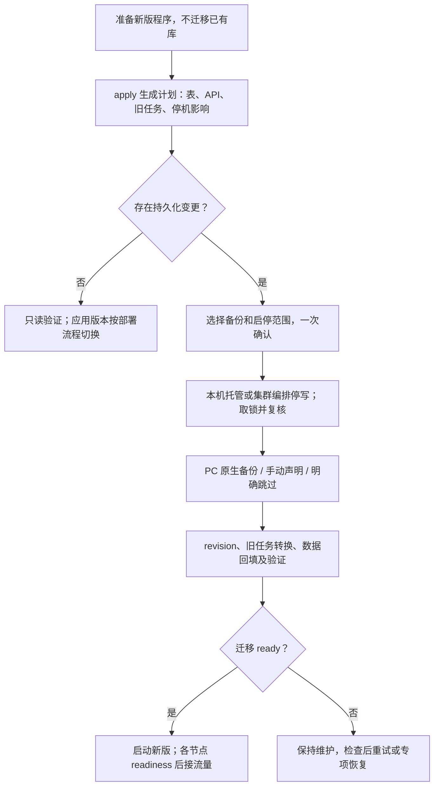
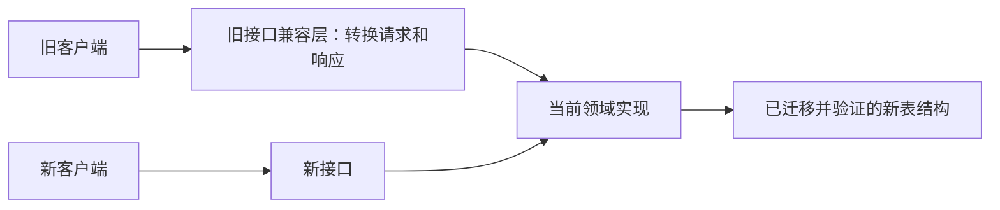

- Proposal Name: `unified_versioned_database_migrations`
- Start Date: 2026-09-28
- RFC PR: [oceanbase/powercontext#1771](https://github.com/oceanbase/powercontext/pull/1771)
- Tracking Issue: [oceanbase/powercontext#1756](https://github.com/oceanbase/powercontext/issues/1756)
- 关联讨论：[PR #1716 的迁移框架建议](https://github.com/oceanbase/powercontext/pull/1716#issuecomment-5862598291)
- 状态：设计提案。第 9 节明确阶段 A 的有限验收范围及完整生产启用条件；其余章节描述目标契约，不代表全部能力已可用。

# Summary

采用 **Alembic 管理关系数据库的结构版本，由 PowerContext 提供统一的迁移执行入口**。SQLite、嵌入式 seekDB 和 OceanBase MySQL 租户共享一条逻辑 revision 链；后端差异由显式适配器处理。**迁移框架只新增一张控制表 `pc_schema_revision`，沿用 Alembic 的标准 `version_num` 字段和版本推进逻辑。** 迁移定义、依赖和验证器随代码发布；实际执行日志与备份 manifest 保存在目标数据库之外。执行入口负责存量库识别、互斥锁、计划确认、备份和前后置校验，不建立通用批次、步骤或任务状态表。

长时间数据回填、身份补证和搜索投影重建使用独立脚本，通过明确的 schema 阶段和完成条件衔接。是否能够重试，由当前 revision、实际结构、业务数据及已有领域收据共同验证；首期不提供通用任务调度、通用 checkpoint 或按执行批次自动续跑。

**安装或升级软件不修改存量数据库；所有已有库，无论本地还是远端，均由用户明确触发迁移。正常启动只检查结构兼容性与必要数据条件，不自动补列、改约束或执行存量回填。** 首次使用的真正空库允许自动初始化：标准本地模式在配置允许的目标位置持锁执行完整 revision 链；远端库和多副本部署通过单独初始化任务完成。

首期对结构和存量数据迁移采用**默认停写、验证后启动新版**的发布方式；没有持久化变更且协议兼容时走普通应用发布。变更作者声明受影响的表、API 和任务格式及兼容条件，操作者据此选择发布方式；工具拒绝未被支持的在线执行。多节点仅指多个 Server 共用一个数据库：停止所有旧写入者，由一个迁移 Job 操作一次共享库，再启动新版节点。

一个 `apply` 汇总计划、备份和启停选择并一次确认。备份可选择 PC 原生备份、用户已手动备份或明确跳过；手动备份不核验，跳过时说明可能无法恢复。独立 `BackupProvider` 统一后端维护能力。可选的本机服务托管把停服、迁移、验证和启动串联；集群由部署编排控制。失败阻断业务就绪，不自动恢复旧服务或执行破坏性 downgrade。

软件版本、API 契约版本和 schema revision 分别管理。新旧 API 可以在迁移完成后共用当前业务实现与存储；保留旧接口不要求保留旧表。只有明确承诺新版程序连接旧 schema，或新旧服务混跑时，才增加经过测试的存储兼容路径。不得把 `create_all()`、未经校验的 `stamp head` 或自动生成脚本视为完整迁移。

**本方案独立于 PR #1716 推进；统一框架启用后，成为 PowerContext 的标准数据库变更流程，所有涉及受管表结构变更的 PR 都必须遵循。** 每个变更必须在同一 PR 中交付对应的版本化迁移、必要的数据任务、验证和兼容性说明，并通过统一 CI 门禁。此要求覆盖所有功能模块和变更规模，#1716 不构成长期例外。

# Motivation

目前数据库能否使用，由多处初始化和维护逻辑共同决定。仅知道表是否存在，无法判断约束是否正确、回填是否完成、旧 Worker 是否仍在写入，或某次 DDL 是否已经提交。表重命名、约束变化和多副本同时启动，使这些隐含假设更容易失效。

目标是让一次升级可以回答五个问题：数据库现在是什么版本；将执行哪些操作；谁有权执行；中断后是否能够安全重试；满足什么条件才能接流量。同时，将这些要求固化为所有表结构变更 PR 的日常开发、评审和合并流程。

## 现有路径与归属

下表以已提交源码 [298314f8cbba](https://github.com/oceanbase/powercontext/tree/298314f8cbbaa57fcfec668668fb55d704a1b6eb/src/powercontext) 为盘点基准；PR #1716 单独列出。路径均相对于 `src/powercontext/`。

| 现有入口 | 当前职责 | 纳入统一模型后的归属 |
| --- | --- | --- |
| `builtin/persistence/schema.py:create_tables`，三个数据库 `profile.py` | 对调用方选择的 SQLAlchemy 表执行 `create_all(checkfirst=True)` | 正式运行时由已冻结的初始 revision 和后续 revision 接管；保留测试夹具用途 |
| `skill_distribution_schema.py` | Skill 发布表重建、状态转换、列和约束调整 | 结构操作进入 revision；逐行转换拆成可幂等重跑的数据脚本，收紧约束等待转换校验通过 |
| `tag_schema.py` | SQLite 重建 Tag 表，MySQL 分支移除旧 family CHECK | 一个跨后端逻辑 revision，分别使用 batch 重建或显式约束 DDL |
| `dream_schema.py` | 给 Artifact 与 Candidate revision 补充引用列 | 增量 revision；合并后的 Dream 扩展列、索引按实际发布形态登记 |
| `scope_search_schema.py` | 增加搜索列、回填内容，再设置非空 | 拆为 expand revision → 分批回填 → verify → contract revision |
| `experience_index.py` 与各后端 Memory／Experience／Topic Memory index | 补搜索与治理列，创建全文／向量对象，初始化或重建投影 | 事实表列进入 revision；物理索引定义与重建进入受登记的 projection 任务，由同一维护入口调度 |
| `processing_migration.py`、`server processing-migrate` | 已有 plan／apply／verify、阶段标记、migration ID、配置 manifest、迁移收据和旧 Lease 失效处理 | 保留语义与收据；DDL 归结构 revision，剩余阶段作为数据任务适配器，不再另行改表 |
| `receipt_migration.py`、`server/factory.py` | 根据 committed receipt identity 补证；未解决记录进入 review 表 | 独立身份补证任务，保留安全边界及审核队列；不能仅凭 schema 版本认定完成 |
| PR #1716 的 `candidate_schema.py` | Candidate 表重命名、SQLite 重建、MySQL 约束调整、关联完整性校验 | 按最终合并与发布形态纳入基线识别或显式 revision；已经完成的状态只验证，不重复迁移 |
| OceanBase profile 的身份列 collation 校验、各后端能力检查 | 拒绝不兼容数据库或索引配置 | 保留为迁移前置检查与运行期验证；检查本身不自动修复数据 |

当前主要启动顺序是 profile 建表 → processing bootstrap／ready 检查 → Skill／Tag／Dream／Scope helpers → 索引初始化 → 运行时装配；Server 还会执行 receipt 补证。未来这些操作的先后关系写入依赖，不再由函数调用顺序隐式决定。[运行时装配源码](https://github.com/oceanbase/powercontext/blob/298314f8cbbaa57fcfec668668fb55d704a1b6eb/src/powercontext/builtin/runtime/composition.py)

本 RFC 管理 PowerContext 官方持久化对象。第三方组件自行维护的内部存储、外部身份服务、用户自建表不交由 Alembic 自动修改；第三方扩展需要显式登记所有权和依赖后才能接入。通用在线 DDL 迁移、跨数据库搬迁和历史任意版本直升不在首期范围。

# Guide-level explanation

## 1. 用户如何升级

安装程序与切换运行版本分开。包安装钩子不连接已有业务库、不迁移、不自动拉起新版服务。可先在独立环境准备新版，继续运行兼容的旧服务；原地覆盖运行环境时应先停旧进程。仅准备程序无需备份，备份选择发生在实际迁移前。

### 命令与一次确认

以下命令描述完整目标契约；阶段 A 的有限可用范围以第 9 节为准，不能据此认定完整升级能力已经交付。迁移 CLI 独立装配，不调用会建表、回填或启动 Worker 的业务 factory。需要预览时可以单独运行只读命令；日常交互也可以直接 `apply`，由它完成计划和最终验证。以下示例使用 SQLite 配置；OceanBase 的每个维护命令还须带 `--evidence-dir PATH --lock-coordination single-host`，在同一固定维护主机使用同一持久目录：

```bash
powercontext server db-migrate status --env-file deployment.env
powercontext server db-migrate plan --env-file deployment.env
powercontext server db-migrate apply --env-file deployment.env --maintenance-confirmed
```

交互确认页合并展示：目标库、来源／目标版本、影响的表与接口、旧任务处理、停机要求、服务管理范围、备份选择与风险、恢复方式。选择项更新同一份计划，最后只确认一次；不要求对每个 SQL、备份完成和最终 verify 再次确认。PC 自动备份提醒“大数据量可能耗时较久，并增加存储占用”；持续展示阶段、已耗时和可获得的进度，不能凭行数承诺完成时间。

| 备份选择 | 交互行为 | 非交互声明 |
| --- | --- | --- |
| PC 备份 | 展示原生方法、覆盖范围和限制；支持时默认推荐，等待完成及适配器检查；不支持时显示不可用及原因 | `--backup auto` |
| 我已手动备份 | 用户确认自行负责；不检查文件、任务状态、时间、目标或可恢复性；引用可选 | `--backup manual --backup-confirmed`，可加 `--backup-ref BACKUP_ID` |
| 本次不备份 | 在同一确认页提示“失败后可能无法恢复迁移前的数据”，明确接受后继续 | `--backup skip --accept-no-backup` |

`--yes` 只接受已审阅计划，不隐含“已手动备份”或“接受无备份风险”。非交互执行有变更时，必须提供有效 `plan_id`、明确备份策略、相应确认参数和维护条件；缺失返回 `confirmation_required`，不挂起等待。`plan` 接受与 `apply` 一致的备份及服务管理选项，生成绑定这些选择的计划。例如共享库由部署系统停写、用户自行完成备份后：

```bash
powercontext server db-migrate plan --env-file deployment.env --backup manual
powercontext server db-migrate apply --env-file deployment.env --plan-id PLAN_ID --backup manual --backup-confirmed --maintenance-confirmed --yes
```

`plan_id` 绑定目标身份、revision、受管结构指纹、迁移资源 checksum、配置摘要、发布模式、接口／任务兼容声明、备份策略及启停范围。锁内重查结构和任务状态；新出现的不兼容任务或其他实质变化使计划失效。仅正常变化的统计计数不作为永远固定的承诺。计划不输出凭据或业务正文，不写目标库中的待执行标记。手动备份确认与跳过均不能绕过活跃写入者、锁、兼容性或数据校验。

无结构、基线纳管、数据／投影变更且只读 verify 通过时，`apply` 返回 `ready` 与“无需变更”，不请求备份，不停止或重启服务。该结果仅代表当前数据库兼容，不表示运行进程已更新。应用版本切换仍由服务管理或部署系统执行。

### 启停与重启

当前前台入口是 `powercontext server run`；个人服务 CLI 提供 `install/status/uninstall`，底层服务适配器已有 start／stop 能力。本方案增加 `powercontext service stop`、`powercontext service start`、`powercontext service restart`，仅操作当前用户由 PC 管理的本机服务，保留服务注册和配置。`restart` 先停止再启动，启动仍受 schema 与任务兼容检查约束，不能替代不兼容升级中的停服迁移。

不兼容升级的简化入口为：

```bash
powercontext server db-migrate apply --env-file deployment.env --manage-service
```

`--manage-service` 在确认页展示服务归属、目标数据库、原运行状态、目标可执行程序和配置；确认后排空并停止被管理服务，抑制其自动重启，复核其他写入者退出，然后备份／迁移／验证。仅 `ready` 后更新已确认的本机启动定义、启动原本在运行的服务并检查其版本与 readiness。原本停止的服务保持停止。迁移失败保持停止；数据库已 ready 但启动失败时单独报告启动失败，不重跑迁移或自动降级。启停摘要保存在库外，进程中断后显式恢复，不因丢失日志自动解锁业务。

托管模式不调用会立即启动服务的 `service install` 作为中间步骤；不根据 PATH 猜测新版本，也不修改不归 PC 所有的服务。它不能管理集群或阻止未知外部 SDK 写入；存在其他写入者或无法建立维护条件时停止并给出外部维护指引。外部管理场景使用 `--maintenance-confirmed` 表示操作者负责停写。

多个 Server 共用一个数据库时，部署系统执行：停止接收新请求 → 排空在途操作 → 停止全部 API、后台 Worker、调度器及 SDK 写入者 → 一个新版迁移 Job 执行 `apply` → `ready` 后启动新版节点 → 每个节点 readiness 通过后恢复流量。暂停会拉起旧进程的自动扩容、重启及调度；失败保持维护。PC 数据库迁移不重启 OceanBase 集群。 SQLite／嵌入式 seekDB 仍受现有单机 `all` 角色限制，迁移设计不使其获得跨主机共享目录或多节点部署能力；共享数据库的多节点服务使用已有支持的远端部署方式。本文不设计每个节点拥有独立数据库的升级。

**无法自动发现全部节点时的统一确认。** 首期不以自动节点发现为前置交付条件，不承诺从数据库连接或在线状态获得完整节点清单。共享库部署或无法确认节点范围完整时，确认页明确提示这一限制；不能把“未发现其他节点”解释为“只有本机”。若发布计划存在不兼容的 schema、API 或任务协议变更，要求用户协调全部相关节点升级到目标版本；明确支持混合版本且已验收时，按声明的兼容范围提示，不一律要求同时升级。

确认页将下列声明并入原有的一次计划确认，不再增加独立确认步骤：

```text
多节点升级注意事项

PowerContext 无法自动确认所有连接此数据库的节点。

本次升级涉及不兼容变更，请确保：
• 迁移前停止所有相关 API、Worker、调度器及其他写入者，
  并暂停可能重新启动旧版本的机制。
• 迁移成功后，将所有相关 PowerContext 节点升级到目标版本，
  检查通过后再恢复业务。
• 遗漏节点或继续运行旧版本，可能导致请求失败、任务处理异常，
  或数据不一致。

[ ] 我确认负责协调全部相关节点的停写和版本升级。
```

非交互场景复用 `--maintenance-confirmed`：针对计划声明的共享库不兼容升级，它同时确认迁移前已完成全部写入者停写，并承诺协调迁移后的全部相关节点升级；`--yes` 不隐含该声明。未确认返回 `confirmation_required`。声明随目标版本和兼容范围记录到库外摘要，只代表用户确认，不是 PC 已发现全部节点或验证升级完成的证据。`--manage-service` 仍只管理已确认的本机服务，不能据此代表整个集群。

用户声明不能绕过迁移锁、可实施的活跃写入检查及新版启动兼容性检查；已观察到其他写入者或已知维护条件不满足时，仍拒绝迁移。无法自动列全节点时由用户承担未被工具覆盖的节点协调责任，而不是跳过已具备的安全检查。成功输出区分数据库和节点状态：“数据库迁移成功；其他节点升级状态由用户确认”。没有完整部署验收证据时，不输出“所有节点已升级”；本机已管理服务的启动和 readiness 结果单独报告。

需要手工管理服务时，把启停与迁移分开；以下独立服务命令不代表迁移 bundle 已支持自动服务切换：

```bash
powercontext service stop
powercontext server db-migrate apply --env-file deployment.env --maintenance-confirmed
powercontext service start
```

最后一步仅在迁移成功且服务定义指向新版环境时运行；不是无条件串联脚本。前台部署在旧进程正常退出、迁移返回 `ready` 后，使用新版环境执行现有入口：

```bash
powercontext server run --env-file deployment.env --role all
```

### 查询与恢复

`apply` 输出 revision、schema／数据／旧任务／投影结果、备份模式及其真实验证级别、服务状态和下一步。`ready` 表示迁移就绪；服务 readiness 单独报告。日志关联标识不是数据库中的可恢复执行批次。

中断后先通过只读 `status`、`verify` 和 `plan` 重新观察状态。安全的幂等路径才能重试，不提供按 run ID 自动续跑。自动备份重试使用原始恢复点及库外 manifest；手动模式仅保留用户声明和可选引用，不增加验证；跳过模式不承诺能还原原数据。自动备份丢失或失败不能静默转换为手动／跳过，改变策略必须重新确认。含混的部分迁移返回 `recovery_required`，不盲目 stamp。

已有 `processing-migrate` 在兼容期转发到统一维护入口，保留领域 migration ID、manifest 和已有收据语义。领域恢复规则仍须满足；备份选择不改变它们。



## 2. 自动与显式执行边界

| 场景 | 默认行为 |
| --- | --- |
| 安装或升级 PowerContext 软件包 | 只更新程序与迁移资源，不连接或修改存量业务库，不自动运行迁移 |
| 首次使用的 SQLite／嵌入式 seekDB 本地空库，目标位置允许初始化 | 持锁确认空库后自动执行完整初始化和验证，成功才启动 |
| 全新 OceanBase 库或多副本服务部署 | 由单独迁移任务显式初始化，API／Worker 只检查兼容性 |
| 已有库 schema 与当前程序兼容，必要任务已完成 | 正常启动，不执行结构写入或隐式修复 |
| 已有库不满足新版要求，需要结构升级、表重建、约束变化或必要存量回填 | 返回 `migration_required`，阻止新版业务启动，提示显式迁移；是否停旧服务由发布兼容声明决定，首期持久化变更默认维护模式 |
| 已知迁移锁被持有，或实际结构／必要数据校验未通过 | 可确认正在执行时返回 `migration_running`；需专项处理时返回 `recovery_required`，阻止业务写入与 readiness；不能仅凭版本表判断某次历史执行是否失败 |
| schema 已兼容，仅有计划明确允许延后的可选投影任务 | 阻断对应检索能力并显式报告降级；核心能力是否就绪按能力契约判断；普通启动不暗中重建 |
| 无版本但含受管业务表、未识别遗留形态 | 进入显式基线识别，未知形态返回 `unknown_baseline`；不能视为空库 |
| revision 未知，或超出二进制明确支持范围 | 返回 `incompatible_schema`，拒绝业务启动，不修改数据库 |

首次自动初始化必须同时满足目标位置允许初始化、无受管业务表和历史标记、无中断残留、锁内再次确认。业务表没有行、版本表缺失、版本号读不出来均不能证明是空库。远端凭据连错数据库或本地路径配置错误时，也不能根据一次读表失败推断需要新建。

兼容范围由发布包声明的已知 revision 集合决定，不按 revision 字符串大小比较。首期默认只支持目标 revision；扩大范围必须有各允许版本的读写、任务和恢复测试。如果进一步允许新旧二进制混跑，还必须有混合版本测试。数据库过新与过旧都可能不兼容，未知 revision 即使看似只多几列也拒绝访问。

状态检查覆盖 HTTP Server、Worker、定时任务、嵌入式 SDK 和直接打开官方持久化能力的 CLI，且位于领域 factory、schema helpers 和后台任务启动之前；除 schema 外，还检查待消费任务格式是否被当前处理器支持。迁移未就绪时不得通过“先启动再等请求失败”提供半可用服务。`status`、`plan`、`verify` 及恢复入口仍可独立运行；监控存活不等于业务 readiness。检查错误返回稳定错误类别、当前／目标 revision、阻塞原因和建议命令，不把缺少 DDL 权限解释为可以跳过检查。

## 3. 新旧接口与数据库版本如何协同

软件包版本、API 契约版本和 schema revision 是三个独立维度。每个发布包声明目标 schema、允许访问的 schema 集合、必要任务及能力条件，并列出支持的 API 契约。API 名称或前缀不用于直接选择数据库 revision。

例如旧接口使用旧表，新发布同时提供新接口和新表结构。首期默认发布流程是：停旧服务写入 → 显式转换旧数据与结构 → 校验完成 → 启动新版服务。此时旧接口可保留兼容适配层，将参数转为当前领域请求、将结果转回旧响应；新接口直接调用当前实现，二者访问同一套已迁移存储。若行为语义无法兼容，应发布明确的新契约并安排客户端升级，不能只保留旧 URL 却悄悄改变含义。



| 对外发布承诺 | 迁移前的新版程序行为 | 必须承担的兼容成本 |
| --- | --- | --- |
| 首期默认：允许停服迁移 | schema 不兼容时阻断业务启动；迁移成功再启用新旧 API | API 契约适配和迁移验证；不要求每个 handler 支持两套表 |
| 明确允许新版程序连接旧 schema | 仅运行被声明并验证的旧 schema 能力；依赖新结构的能力明确不可用 | 在持久化适配层集中实现版本差异，并验证旧 schema 的全部允许读写路径 |
| 新旧服务必须同时运行 | 先扩展、回填与验证，再切流量，旧实例全部退出后才收缩结构 | 写入一致性、回填追平、混合版本测试和明确退出条件；不属于首期默认能力 |

### 接口、表与旧任务的发布判断

变更作者在同一 PR 中提供影响清单，操作者在 plan 中据此判断是否安排阻塞式更新、是否保留旧接口和是否需要客户端升级。不能仅按“改了表”或“内部接口”推断兼容性，也不能由工具从业务代码自动猜测契约。清单随包分发，不新增数据库控制表。

| 声明项 | 必须回答的问题 |
| --- | --- |
| `affected_objects` | 哪些表、列、约束、索引及外部文件受影响；是否复制大表或有不可逆转换 |
| `execution_mode` 与支持版本 | 普通发布、维护迁移或经验证的滚动发布；哪些旧／新程序允许读取和写入哪些 schema |
| `api_changes` | 内部同步发布还是独立调用方；旧契约保留、替换或弃用；替代入口及最早移除版本／日期 |
| `task_formats` | 队列及持久化任务的已知格式、可消费版本、转换器、排空要求和未知格式处理 |
| 恢复及能力要求 | 可用备份方法与范围、无备份风险、投影依赖、权限、资源和配置变化 |

| 变化 | 发布选择 |
| --- | --- |
| 无持久化变更，API／任务协议兼容 | 普通发布；若新旧进程可共存，可按部署系统滚动替换 |
| 当前程序无法继续读写新结构，或旧任务无法被新处理器消费 | 维护模式：停旧写入者、转换、验证后启动 |
| 声明可在线进行的 expand／backfill／contract | 必须有对应后端及混合版本验收；首期未交付通用在线 DDL，能力未实现时不允许选择此模式 |

操作者可以选择更保守的停机流程，不能通过交互选择覆盖已知不兼容条件。内部函数或同包后台入口可与调用方一起替换；独立部署的 Worker、控制台、SDK 或外部应用调用，即使名为“内部”，也需要版本兼容安排。Artifact 等公共 API 发生不兼容替换时，在 OpenAPI 与文档中标记 `deprecated`，给出替代接口、迁移说明和移除时点，并验证兼容期内的旧客户端。仅底层表变化且 API 契约不变时，无需弃用 API。

**更新时检查旧格式任务。** `plan` 只读统计受影响的待执行、运行中、延迟、失败待重试及死信任务、Lease 和 payload 格式，展示数量、处理策略和阻塞原因；不打印任务正文。停写取锁后重查，迁移后和 Worker 启动前再次检查。已有队列没有版本字段时由冻结的格式识别器判断，不为此创建通用任务台账；无法识别或缺少可观测来源时阻止相关迁移／Worker 启动，不能假报“无旧任务”。

每类旧任务明确选择兼容消费、停写后幂等转换，或迁移前由旧 Worker 排空。排空必须在禁用新生产后、有边界地完成；不能在持锁修改 schema 时继续运行旧 Worker。未知格式返回 `unsupported_task_format`，未满足排空条件返回 `legacy_tasks_pending`。转换保留稳定任务标识、幂等键、Scope／身份、重试和领域收据语义；不自动删队列或将未完成任务标成功。删除旧接口／处理器前还需处理留存的旧任务；“旧进程已退出”不证明旧格式数据消失。工具不能从近期无调用推断公共 API 无使用者，外部调用方升级仍由发布计划协调。

不在接口 handler 中散落“列不存在则换一条 SQL”的异常兜底；不承诺未经测试的双写、双向同步或自动回退旧表。保留旧接口、保留旧表、允许旧程序继续运行是三个分别验证的承诺。删除旧表／列与移除旧接口分别登记条件和发布时点；数据库一旦发生不兼容变更，只回退应用包不能当作安全回滚。

## 4. 贡献者的标准变更流程

框架启用后，凡 PR 涉及 PowerContext 受管表的新增、删除、重命名，或列、类型、默认值、可空性、主外键、CHECK、索引和 collation 变化，均适用以下流程；仅增加一个字段也不能跳过。

1. **同时提交模型与迁移。** 更新目标 schema 定义，并新增基于当前 head 的冻结 revision；可选全文／向量投影按同一流程登记对象定义、projection 版本和任务。不能只改模型、补一段启动 DDL，或要求用户自行改表。
2. **显式声明依赖与执行策略。** 涉及存量数据时提交独立数据任务，标明 expand／backfill／contract 顺序、前后置条件、维护要求、幂等行为及中断恢复方式。适用后端和不适用原因必须明确。
3. **提供验证证据。** 按影响范围验证空库初始化、受支持发布版本升级、重复执行、故障恢复与业务不变量；跨后端结构变更须覆盖 SQLite、seekDB 和 OceanBase。缺失后端验证不能以 skip 视为通过。
4. **交付发布影响清单。** 填写 `affected_objects`、`execution_mode`、`api_changes`、`task_formats`、支持的程序／schema 组合、数据与投影任务、启停范围、备份方法及恢复限制。明确旧接口是否弃用、旧任务如何处理、无备份会失去什么恢复能力；不强求破坏性迁移可逆。
5. **通过评审与必需 CI 检查后合并。** 若基分支 head 已变化，在合并前整理未发布 revision 的依赖并重新验证，保持单一 head；已发布 revision 不得重写。没有对应迁移或校验失败的表结构变更不得合并。

每一次受管结构变更都提交独立的 Alembic revision 脚本；软件包没有结构变化时不新增 revision，一个软件发布可以包含多个 revision。例如 `r001 → r002 → r003` 分别初始化、加列和调整约束；当前库为 `r001` 时依次执行 `r002`、`r003`，不另写一份 `r001 → r003` 的组合脚本。历史脚本和冻结依赖持续保留，已发布脚本的修正通过新增 revision 完成；各后端在同一逻辑 revision 内显式适配。

独立推进只描述框架的实施安排。框架启用时仍未合并的表结构变更 PR，也必须接入这套流程；启用前已合并或已发布的变更由基线和 legacy adapters 纳管。

# Reference-level explanation

## 1. 选型与职责边界

| 方案 | 与本项目的适配性 | 主要代价 | 结论 |
| --- | --- | --- | --- |
| Alembic + PowerContext 执行层 | 复用现有 SQLAlchemy 定义、revision 依赖和 SQLite batch；可通过 `AsyncConnection.run_sync` 接入现有异步引擎 | 仍需实现后端能力、执行锁、数据任务和恢复策略；自动生成有盲区 | **选用** |
| 小型自研 revision registry | 可以直接复用异步 helpers，初期代码少 | 必须持续自维护 revision 图、历史脚本稳定性、差异检测、审计和开发工具；容易再次变成一组分散 helpers | 不作为主框架；仅保留执行策略和任务登记所需薄层 |
| SQL 优先工具，以 Flyway 为代表 | SQL 变更清晰，具备版本脚本、历史表和 checksum 模型 | Python 分发需额外工具链；三种 profile 的 SQL、嵌入式引擎生命周期和 Python 数据转换仍需适配 | 不作为默认依赖；需要 SQL 审阅时输出计划与后端 DDL |

Alembic 的 async 接入和数据迁移分离方式有官方说明；Flyway 的版本迁移和 checksum 是参考设计。这里的选择基于项目已有 SQLAlchemy 与 Python 部署方式，不代表已经完成三后端兼容性实验。[Alembic Cookbook](https://alembic.sqlalchemy.org/en/latest/cookbook.html#using-asyncio-with-alembic)、[Flyway Versioned migrations](https://documentation.red-gate.com/flyway/flyway-concepts/migrations/versioned-migrations)

Alembic 放入需要官方持久化能力的依赖集合，迁移脚本随 wheel 分发，不要求终端用户安装独立 CLI。正式入口只允许经过 PowerContext 执行层调用，避免裸 `alembic upgrade` 绕过锁和数据依赖。

### 现有连接、事务、Repository 和索引如何接入

现有三个 Profile 负责后端配置、引擎生命周期和初始化，共同使用 `AsyncDatabase`；Repository 接受连接处理领域数据，Memory／Experience／Topic Memory 索引接口负责检索投影。迁移复用这些边界，不新建一套业务存储抽象。

| 层 | 迁移中的职责及改造 |
| --- | --- |
| 配置与 Profile | 把连接／引擎生命周期从 `create_tables` 拆开，提供无建表副作用的 inspection／maintenance 入口；复用 URL、路径、凭据、dialect 和扩展加载 |
| `AsyncDatabase` 与连接 | 保留连接所有权、事务与关闭能力；迁移使用专用维护连接，通过 `AsyncConnection.run_sync` 向 Alembic 提供该连接；锁由执行器在连接外持有，OceanBase 不要求 ODP 固定物理会话 |
| Alembic revision | 使用冻结的表、列、类型和后端操作执行 DDL，验证后推进 `pc_schema_revision`；不通过当前 Repository 或 `create_all()` 推导历史结构 |
| Repository／数据适配器 | 仅在已满足该接口所需 schema 时复用稳定的领域读写，并绑定明确事务；历史转换优先使用冻结 SQL／映射，不能导入持续变化的 Repository 重演旧迁移 |
| 索引接口 | 将结构定义交给 revision／版本化 projection 资源；受控调用重建和校验能力，从 Source／Artifact 重建派生数据，禁止普通启动隐式补 DDL |
| `BackupProvider` | 复用后端配置和专用连接／原生管理接口，报告备份能力、创建与状态；不通过业务 Repository 逐条导出替代数据库备份 |
| 服务管理与启动门禁 | 复用 `ServiceController` 和平台 start／stop 适配器；运行期先只读验证 schema、任务格式和必要能力，再装配 Repository、索引和 Worker |

不能把完整迁移包在一次 `AsyncDatabase.transaction()` 中就假定原子性：SQLite 采用已验证的事务边界；seekDB／OceanBase DDL 可隐式提交，执行器在专用连接之外持续持锁并逐步验证；提交和回滚不释放维护锁。数据批次各自提交，并在存在领域收据时与收据一起提交。后台业务任务与迁移执行器不能争用同一运行期事务。

例如受管表新增必填列：`r002` 使用冻结定义加可空列 → 独立脚本以旧格式读出并幂等回填 → 数据验证 → `r003` 收紧约束 → 重建受影响投影 → 总体验证 → 新版 Repository 和 Worker 开始工作。当前模型用于定义和比较目标，不用于重新生成历史 revision。`open_builtin_contexts`、服务 factory 和索引初始化中的隐式结构写入逐项迁出，检查目标不存在时不能顺手建库。

## 2. Revision 与持久化模型

每个物理数据库／schema 只有一条官方核心结构 revision 链，版本不是 Scope 级，也不是应用包版本。每个发布包必须只有一个目标 head；未发布分支在合并前整理为线性链，已发布 revision 不重写。

revision 包含稳定的 `revision`、`down_revision`，以及后端适用范围、前置条件、维护要求、后置条件和验证器。revision 自带冻结的表／类型定义；禁止导入随主程序变化的 ORM 表对象来重建历史状态。后端不适用步骤也必须证明该逻辑 revision 的后置条件成立，不能简单忽略异常。

**只新增一张迁移控制表：**

| 表 | 字段 | 用途 |
| --- | --- | --- |
| `pc_schema_revision` | `version_num` | 使用 Alembic 标准版本表，记录已完成的当前 revision；单线链在基线纳管或首个 revision 完成后通常只有一行 |

通过 Alembic 的 `version_table="pc_schema_revision"` 配置表名，版本表按标准逻辑读取和推进。表内不增加批次、步骤、任务或 JSON 进度字段，也不把这些记录放到额外的通用表或伪装成业务数据；不重写 Alembic 的版本管理机制。这里限制的是迁移框架新增的控制表，不限制产品功能所需的业务表。[Alembic 版本表](https://alembic.sqlalchemy.org/en/latest/tutorial.html#running-our-first-migration)

不同信息有各自的位置：

| 信息 | 保存或判断方式 |
| --- | --- |
| revision 定义、依赖、固定结构与验证器 | 随 wheel 分发的版本化 Python 脚本及声明资源 |
| 软件目标版本、允许的 schema、数据完成条件与可选能力要求 | 随发布包提供的兼容 manifest |
| 当前结构位置 | `pc_schema_revision.version_num` |
| 实际执行过程、错误及校验摘要 | 本地日志或部署日志系统；用于审计，不作为步骤完成的唯一依据 |
| 备份策略、自动备份证据或用户声明 | 数据库外 manifest；记录自动备份的目标、revision、包摘要、覆盖范围和检查结果，或手动声明／跳过风险确认；不核验手动备份 |
| 必要数据与投影是否完成 | 实际数据、对象定义和已有领域收据／标记；不新增通用任务状态表 |

readiness 同时要求目标 revision 被支持、实际 schema 正确，以及必要数据与能力条件全部通过。缺少任务台账不等于任务已完成；日志显示成功也不能替代这些校验。允许延后的可选投影仅禁用相应能力；声明和检查共用发布 manifest。

CI 对照已发布代码禁止重写历史脚本及冻结依赖；运行时核对分发资源与受信发布包的 checksum manifest。PC 自动备份的 manifest 另记录维护时使用的包摘要，供重试核对；手动模式只记录用户声明，不查询或核验其备份。版本表不保存逐次执行的脚本 checksum，因此不能仅凭 revision 还原该数据库历史上实际执行过的脚本字节；若恢复依赖这类证据而外部记录缺失，则停止专项处理。结构指纹也不能证明完整执行历史。

已有库先取得锁并满足停写和已确认的备份策略，再按固定定义建立版本表或纳管已识别基线。版本表缺失、为空或创建中断都不证明业务库为空；先核对实际受管对象，无法识别则拒绝写入。空库初始化从冻结初始 revision 开始。

可选全文／向量投影按发布包登记的后端对象清单、`projection_version` 和配置摘要验证，复用已有领域标记或从实际结果判断。开启能力时显式安装或重建，关闭时保留对象和领域记录；普通启动不补 DDL。新增持久化游标或通用任务服务的需求须另行设计，不在本 RFC 中暗中增加控制表。

## 3. 空库初始化与存量基线

**先检查，后写入。** 迁移检查必须发生在现有 profile 的 `create_tables` 和领域初始化之前。连接、引擎生命周期、驱动配置与结构初始化需要拆开；正常启动不得为了判断版本而先修改表。`status`、`plan` 和 `verify` 使用无建表副作用的检查连接；目标不存在时报告 `uninitialized`，不得为检查而创建数据库文件或控制表。嵌入式引擎若无法提供这种检查路径，适配器必须返回明确的不支持原因，不能隐式打开写入初始化流程。

- **空库：** 在持锁后确认不存在 PowerContext 管理的业务表或历史标记，再执行冻结初始 revision → 后续 revision → 必要初始化任务 → verify。相同目标版本的空库和升级库必须形成相同的当前业务 schema；升级库额外保留的旧表／恢复对象按发布清单单独校验，不要求空库创建这些历史对象。首期不采用 `create_all()` 后直接 stamp 的快路径。
- **已有版本库：** 校验 revision、发布资源完整性、受管 schema 和必要数据条件后前进。中断后重新检查实际状态，只有已定义的安全重试路径可以继续；所选恢复路径缺少必要证据或状态含混时拒绝写入；不对手动备份新增核验要求。
- **无版本遗留库：** 只接受基线清单明确识别的形态。识别内容包括表、列类型／可空性／默认值、主外键、CHECK、索引、身份 collation、可选能力以及已有 processing／projection 标记；还需做适用的数据完整性检查。不能仅根据包版本、某一列存在或数据行数为零判定。
- **未知或混合形态：** 输出差异并拒绝写入。未登记的临时表残留、未登记的旧新 Candidate 表并存、缺一张配对表等均需要专门恢复路径，禁止强制 stamp。

首期至少以已发布的 [powercontext-v1.1.0](https://github.com/oceanbase/powercontext/releases/tag/powercontext-v1.1.0) 构造真实升级夹具，并覆盖接入框架前最后一个受支持发布版本。不要用当前模型删几列代替旧发布包创建的库。更早版本只有进入已测试基线清单后才支持直接接入；否则明确要求受支持的中间升级路径或专项适配器。

基线流程为：只读识别 → 获取锁并复核 → 经审阅的 legacy adapter 补齐已知差异 → 完整验证 → 写入匹配的 baseline revision → 执行后续 revision。baseline 只证明结构状态，已有 processing receipts、配置 manifest 和待审核补证记录仍分别验证。基线 snapshot 在框架接入时冻结；包括 #1716 在内，启用前已交付的结构变化由识别器和适配器纳管，启用后尚未合并的变化按标准流程提交迁移。

## 4. 执行顺序与数据任务依赖

统一执行顺序如下：

1. 只读检查实际 schema、数据、旧任务格式及发布兼容声明，生成计划和备份／启停选项，一次确认。
2. 在目标库外持久保存已确认计划、备份策略、维护意图、原服务运行状态及维护窗口标识，开启诊断日志；保存失败时不得停服或开始备份。由替换 Job／重试命令读取同一份恢复记录，不以中断后的服务状态覆盖原状态。
3. 按计划由本机托管或集群编排禁用生产者、排空需要排空的旧任务，停止所有旧写入者并抑制自动拉起；获取全库锁后复核计划、Lease 和任务状态。停服阶段的执行进度写入恢复记录。
4. 处理备份策略：PC 原生备份等待完成并按适配器检查；手动模式仅记录用户声明；跳过模式记录风险接受；真正空库记录免备份原因。先持久保存备份引用及检查结果（或声明／风险接受），再显式纳管已识别基线、进入 DDL；重试沿用原恢复点，不以部分迁移后的数据重新备份覆盖。
5. Alembic 执行 expand revision。
6. 在声明的 schema 阶段执行幂等数据／旧任务转换及完成校验；contract revision 自身再次检查依赖条件。
7. 安装／重建并验证必要 projection，声明尚不可用的可选能力。
8. 内置最终 verify，检查 revision、实际结构、旧任务可消费性、必要数据与领域不变量，输出迁移 `ready` 和备份保障级别。
9. 释放迁移锁；本机托管按已确认范围启动新版，或由集群编排启动新版节点。每个入口检查 readiness 后才恢复流量。服务启动失败单独报告，不撤销数据库成功状态。

对于纯 schema 变更，Alembic 按版本链执行。涉及大批量数据时，执行入口在声明的阶段边界调用 Alembic：expand revision → 独立数据回填 → 完成校验 → contract revision。contract revision 本身再次检查依赖的数据条件，不依赖某条日志或任务状态为成功；数据未完成就拒绝推进到目标版本。[Alembic 数据迁移](https://alembic.sqlalchemy.org/en/latest/cookbook.html#data-migrations-general-techniques)

这些阶段和验证器在随包资源中声明，plan 展示先后关系和阻塞原因；不建立通用任务 DAG 调度器或持久化队列。小规模且适合当前事务的数据变更可以放在 revision 中，大回填和外部调用不应被塞入一个长 DDL 事务。

数据脚本优先从业务数据判断待处理范围，采用稳定主键分页、幂等写入和独立完成校验。重试时可以重新扫描已处理范围，不能重复增加计数、生成 Artifact 或重复生效。能够复用已有领域 checkpoint／收据时，每批变更与对应收据在同一事务提交；没有这种状态时，不承诺通用断点续跑。无法从数据证明进度且无法安全重跑的脚本，必须提供专项恢复方案，否则不纳入支持范围。不得把外部日志的最后一行当作数据提交凭证。

processing 脚本保留已有的 Lease 失效、manifest 校验和迁移收据语义。receipt 补证只能依据已提交身份记录，未知身份保留审核边界；外部 identity lookup 故障仍使执行失败。与外部系统交互沿用领域幂等协议，不宣称跨系统事务原子性。

projection 脚本从 Source／Artifact 等权威数据重建，不修改权威内容来适配索引。embedding 模型、维度和检索形态变化需核对配置摘要；不兼容则显式重建。首期停写重建，并从实际投影对象、数据覆盖范围和已有领域标记验证完成，不以 schema head 替代检索能力检查。在线切换需要单独的 generation、追平及原子切换设计。

## 5. 锁与多副本行为

本节多节点指多个 Server 共用同一个数据库。迁移锁按物理数据库和受管 namespace 唯一，不按节点、进程或 revision 命名。锁覆盖识别、DDL、必要数据步骤与最终校验。锁等待有上限，超时返回可重试的 `migration_locked`；拿到锁后必须重读状态，第二个执行者在目标已完成时只验证并返回。

| Profile | 执行互斥 | DDL 与恢复约束 |
| --- | --- | --- |
| SQLite 文件库 | 规范化数据库路径上的进程间文件锁覆盖整次维护；每个结构 revision 使用显式 `BEGIN IMMEDIATE` | batch 重建、数据复制和版本推进处于已验证的事务边界；失败回滚，恢复后重新检查 |
| SQLite 内存库 | 共享引擎的进程内锁 | 仅新建初始化，不提供离线持久化恢复；不能把进程内锁用于文件库多进程场景 |
| 嵌入式 seekDB | 规范化数据目录上的进程间文件锁，从打开迁移引擎前持续到关闭引擎后 | 不假定 MySQL 协议意味着支持全部锁函数或事务 DDL；按非事务 DDL 的逐步验证协议执行 |
| OceanBase MySQL 租户 | 固定维护主机、同一持久证据目录上的原生操作系统文件锁，结合主机绑定及运行记录 | 锁跨 commit 保持；专用连接不自动重连，中断保留运行记录；恢复须声明旧远端执行已结束，不把事务回滚当作 DDL 撤销 |

SQLite 的 `BEGIN IMMEDIATE` 用于提前获得写事务；跨批次的维护互斥仍由文件锁保持。文件锁使用操作系统锁而非文件是否存在，且覆盖软链接规范化路径；不宣称支持跨主机共享文件系统上的嵌入式库迁移。[SQLite Transactions](https://www.sqlite.org/lang_transaction.html)

OceanBase 的 `status/plan/apply/verify`、所有迁移 Job 及重试都在同一台固定维护主机执行，显式传入 `--evidence-dir PATH --lock-coordination single-host`。同一数据库使用规范化后的同一持久目录，按集群／租户／数据库身份隔离；容器或 Job 更换后保留证据与稳定主机名。业务 Server 可以分布在多个节点。共享文件系统、复制目录或不同主机上的同名目录不构成受支持的跨主机互斥。

维护使用配置中的直连或 ODP 入口，不依赖 `GET_LOCK()`、固定物理会话 ID、`PROCESS` 权限或进程列表判断。维护连接不自动重连；每条 DDL 前后复核操作系统锁、主机绑定、持久运行记录和连接。缺少证据目录返回 `evidence_required`；未选择协调模式返回 `coordination_required`。平台无原生锁或退化为软锁时返回 `migration_lock_unsupported`，其他进程持锁返回 `migration_locked`；锁文件被替换或连接丢失返回 `migration_lock_lost`。不退化为随 DDL 提交释放的行锁，也不增加控制表或向 Alembic 版本行写锁标识。

目标库外保留 `coordinator.json`、`coordinator.lock` 及数据库专属目录中的 `migration.lock`、`active-run.json` 和原恢复摘要。正常执行返回且维护主连接成功关闭后，才清理运行记录；中断、取消或连接关闭失败均保留记录。拿到本地锁不证明旧远端请求或后台 DDL 已结束。存在遗留运行、证据损坏或主机绑定冲突时返回 `recovery_required`，包括版本已到 head 的情况；禁止以 verify／no-op 绕过。

中断恢复保持停写并使用原主机、原目录。DBA 先确认旧运行的全部远端执行和后台 DDL 已结束；PC 不自动核验。`plan` 将遗留 token 作为 `coordination.pending_run_id` 展示并绑定到 `plan_id`。操作者重新审阅计划后，以 `apply --acknowledge-previous-run TOKEN` 作出准确声明；锁内重查 token、实际结构、数据和原维护证据。缺少或不匹配的 token 返回 `recovery_required`；没有遗留运行却提供 token 返回 `stale_ack`。该参数仅用于 OceanBase apply，`--yes` 和交互确认都不会替用户填写。声明不绕过任何结构／数据／备份检查，不能删除证据、换目录或用部分状态的新备份覆盖原恢复点。正常升级仍只确认一次；中断恢复另需这项显式 DBA 声明。

**迁移者互斥与业务停写是两项独立条件。** 文件锁只约束遵循协议的迁移进程，不证明 API、Worker、SDK 或旧版程序已经停止写入。执行器使用可获得的进程、引擎持有者和领域 Lease 信息检查已知写入者；检测到活跃写入者时返回 `active_writers`，即使带确认参数也不继续。

首期由操作者或部署编排停止全部写入入口，并禁用自动重启或拉起旧实例；工具不宣称能发现任意外部客户端或隔离所有旧版本。`--maintenance-confirmed` 记录对这项维护条件的确认及相关证据，不是停写实现。新启动入口检查可观察的迁移锁、revision、实际结构及必要数据条件；观察到迁移或不兼容状态时拒绝业务就绪。单版本表不能持久表示“某次执行失败”，也不能仅凭缺少日志推断没有迁移；维护窗口内阻止新实例启动仍由部署编排负责。锁状态无法可靠只读查询时，不能假报“没有迁移”。这些检查不能阻止已经启动的未知客户端，无法建立停写条件时不支持执行迁移。

多节点部署只运行一个新版迁移 Job，对共享库备份／迁移一次，失败则阻止应用 rollout。部署系统暂停自动扩容、旧实例重启、定时生产者和其他写入入口；迁移 `ready` 后才启动新版节点，各自 readiness 通过后解除流量维护。滚动切换只有在发布清单明确支持相应二进制／schema／任务协议组合且实现通过验收时可用；首期不支持一边运行不兼容旧版本，一边完成 contract 迁移。

## 6. 中断恢复与验证

OceanBase DDL 可能隐式提交，Python 事务上下文不能把多条 DDL 变成原子升级；seekDB 首期使用同样保守的恢复模型。[OceanBase 提交事务](https://www.oceanbase.com/docs/common-oceanbase-database-cn-1000000004476105)

Alembic 执行 revision 后更新版本表，但它不在版本表中保存 revision 内每条 SQL 的进度。非事务 DDL 可能已经部分提交，而版本号仍停留在旧 revision。每个这种 revision 必须定义可接受的前置状态、精确后置状态、可识别的中间状态和拒绝条件；诊断日志只提供线索，不能代替实际检查。重试按三类处理：

| 观察到的状态 | 恢复行为 |
| --- | --- |
| 前置条件完整成立，且已确认此前会话／DDL 结束 | 在维护、已选备份策略、锁和新计划确认均满足后重新执行 |
| 某项操作的精确后置条件成立，版本号尚未推进 | revision 的显式幂等分支验证并跳过该项；全部操作及不变量通过后由 Alembic 正常推进版本 |
| 未登记的新旧状态并存、内容不一致或无法证明操作结果 | 返回 `recovery_required`，保留外部证据并停止；由专项修复或备份恢复处理 |

例如增加列时要验证类型、默认值、可空性和相关约束，而不只判断列名存在；表重命名时必须区分旧表存在、新表存在和两者并存。发生网络超时或数据库故障转移时，先确认旧会话及相关 DDL 已结束并读取稳定状态，再恢复；不因超时、心跳丢失或重连成功就自动接管仍可能运行的 DDL。

SQLite 重建使用冻结结构和 Alembic batch／显式重建步骤，保留索引、约束、触发器与关联视图；如需关闭外键检查，只在专用连接、事务外切换，提交前执行 `foreign_key_check`，结束后恢复设置。不能使用简单的“改名旧表再建新表”通用模板而忽略外键重写。[Alembic Batch](https://alembic.sqlalchemy.org/en/latest/batch.html)、[SQLite 表结构变更流程](https://www.sqlite.org/lang_altertable.html#making_other_kinds_of_table_schema_changes)

每个 revision 的验证至少包含实际 schema 与目标定义一致，以及该变更涉及的领域不变量。复制表需验证主键集合、行数和保留字段内容一致，不能仅凭总行数；Candidate 需验证 head 指向实际 version 及 Scope 外键；processing 需验证收据、计数和 manifest；检索投影需验证对应的 Artifact revision 和代表性查询。

SQLite 在已验证的事务配置下，将结构变更、revision 内验证和版本推进原子提交；失败回滚后重新检查。非事务 DDL 后端在 `upgrade()` 内完成全部后置校验，再交由 Alembic 推进版本。若 DDL 已提交而版本更新未提交，重新进入该 revision 的状态识别逻辑；没有明确幂等分支就停止，禁止裸 stamp。必要的外部数据／投影条件仍由最终 verify 和启动检查独立校验。

一个 revision 可以包含多项相关操作，但应保持可审阅和可恢复的边界；不能把每条 SQL 自动拆成一个 revision，就宣称消除了非事务 DDL 的中断窗口。不可逆或含混状态采用向前修复或恢复备份，不自动执行破坏性 downgrade，不静默删除无法识别的中间表。

## 7. 备份与发布恢复

### 统一 BackupProvider

`BackupProvider` 是独立的数据库维护接口，由后端适配器实现，复用配置、目标身份、维护连接及引擎生命周期，不依赖业务服务启动。它统一操作契约，保留方法、权限、耗时、作用范围和故障保护范围的差异；手动与跳过由执行层处理，不调用 provider 核验。

| 拟议方法 | 返回与职责 |
| --- | --- |
| `capabilities(context)` | 只读报告原生方法、版本／对象支持、权限、是否停写、覆盖范围、是否同实例及耗时／空间提示；不创建探测库 |
| `create_backup(context)` | 在确认且满足维护条件后发起原生备份，返回 `BackupRef`；异步任务引用不等于备份完成 |
| `inspect_backup(ref)` | 仅用于 PC 管理的备份：查询 pending／completed／failed、目标、覆盖范围和可获得的检查结果；失败或不完整阻断 auto 模式 |
| `restore_plan(ref)` | 给出作用范围、程序／数据库版本要求、恢复步骤与验证方法；不自动覆盖当前库或执行破坏性恢复 |

`BackupRef` 与结果写入库外 manifest，包含方法、目标、位置／任务引用、快照边界、来源 revision、包摘要、覆盖对象、检查级别及恢复指引。展示“任务已完成”“元数据／完整性检查通过”“恢复演练通过”时必须有对应证据；不能把前两项显示为已证明恢复成功。自动备份失败、长时间 pending、空间不足或不支持所需对象时停在迁移前，允许重新选择策略并确认，不静默跳过。

### 三种后端的原生方法

统一 `BackupProvider` 对 SQLite 使用 Online Backup API，对 seekdb 和 OceanBase 集群使用原生 `FORK DATABASE`／`FORK TABLE` 创建迁移前恢复点。OceanBase 的 PC 自动备份不采用物理备份及日志归档作为替代路径；用户自行安排的备份仍由 manual 策略承接。

| 后端 | PC 自动备份方法 | 验证与边界 |
| --- | --- | --- |
| SQLite 文件库 | SQLite Online Backup API，停写后创建独立数据库文件 | 包含已提交 WAL 数据，检查输出可打开及完整性；复制主文件不能替代该过程。恢复还需验证扩展、索引和业务不变量 |
| seekdb | 优先 `FORK DATABASE`；满足下述覆盖与一致性条件时使用 `FORK TABLE` | 核对实际引擎版本、对象覆盖、后续 DDL 限制及重启后的恢复；保存同实例恢复点 |
| OceanBase 集群（受支持的 MySQL 租户） | 优先 `FORK DATABASE`；满足下述条件时使用 `FORK TABLE` | 按 OceanBase AI 数据库的产品／版本识别能力，核对租户模式、权限、对象覆盖及恢复路径；不因 PC 更新重启集群 |

### Fork 起始版本与能力检查

Fork 起始版本必须按产品分别判断，不能把 seekdb 的版本门槛套用到 OceanBase 集群，也不能仅凭 MySQL 协议兼容判定可用。

| 产品 | `FORK TABLE` 起始版本 | `FORK DATABASE` 起始版本 |
| --- | --- | --- |
| OceanBase AI 数据库 | **V4.6.2** | **V4.6.2** |
| seekdb | **V1.1.0** | **V1.2.0** |

依据：[OceanBase AI 数据库 V4.6.2 发布说明](https://www.oceanbase.com/docs/common-oceanbase-database-ai-1000000006862228)、[seekdb V1.1.0](https://github.com/oceanbase/seekdb/releases/tag/v1.1.0)、[seekdb V1.2.0](https://github.com/oceanbase/seekdb/releases/tag/v1.2.0)。这些是功能起始版本，不等于 PC 已完成该版本的生产验收；发布说明标记为实验特性的能力必须明确展示。SQLite 方法参考 [SQLite Backup API](https://sqlite.org/backup.html)。

`capabilities(context)` 分别返回 table／database Fork 是否可用、识别出的产品和实际服务端版本、最低版本、权限／对象／恢复限制及不可用原因。嵌入式 seekdb 核对实际引擎，不以 Python 包版本代替。不能确认能力时按不可用处理，不通过创建库表进行只读探测。

用户选择 PC 自动备份但能力不支持时，确认页明确显示“PC 自动备份不可用”、当前产品／版本、所需功能及原因；显式 `--backup auto` 返回 `backup_unsupported`，不执行备份或迁移 DDL。交互用户可改选手动备份或明确跳过，更新计划后确认；非交互执行直接失败，不等待输入。不自动降级为物理备份、目录复制、manual 或 skip，不自动升级数据库。备份创建已开始但失败属于备份失败，同样阻止迁移，不显示为已备份。

### Fork 的范围与恢复条件

优先整库 Fork。仅支持 `FORK TABLE`（例如 seekdb V1.1.x），或计划明确限定表级保护时，只有所有写入者已停止、全部受影响对象及依赖均被覆盖、跨表一致性和恢复步骤经适配器验收，才能提供 table Fork；否则 auto 不可用。多个逐表 Fork 不能自动视为整库共同快照；整库 Fork 也不能默认覆盖所有非表对象。所选方法、对象映射、快照边界及检查结果写入库外 manifest。

Fork 是同实例／同集群迁移恢复点，不是独立物理副本或存储灾备。它可以覆盖引擎与存储健康时的迁移失败，不要求 PC 再做一份物理备份；独立灾备由用户另行安排。确认页提示大数据量可能耗时较久、后续写入和旧表保留会增加存储占用，不承诺瞬间完成或零额外空间。

启用前须验证全部 PC 对象、触发器／外键、全文／向量能力是否保留或可安全重建，Fork 后计划中的源表重命名／结构变更是否允许，以及中断、重启后的恢复。若 Fork 关系阻止计划 DDL，应提供经过验证且保留旧数据的替代表切换方案，否则返回 `backup_unsupported`；不能先删除恢复点来使 DDL 成功。参考 [OceanBase Fork 概述](https://www.oceanbase.com/docs/common-oceanbase-database-ai-1000000006779059)。

恢复保持停写、保留原 Fork，并按已验证方案恢复到 PC 实际使用的目标。当前嵌入式 `SeekDBConfig.database` 固定为 `test`，适配器须交付原库名恢复，或单独实现可配置目标及统一切换；不能把切换到 Fork 库写成现有能力。OceanBase 恢复限定已确认的数据库／表及依赖，不默认覆盖整个共享租户。`MERGE TABLE` 不作为自动撤销不兼容 DDL 的协议。

### 旧表保留与后续版本清理

本次升级不清理被替换的旧业务表及 Fork 恢复库／表，即使迁移成功并已返回 `ready` 也保留。需要重建或切换表名时，先保留旧内容及可恢复的对象映射，不能以内部表名切换为由提前丢弃旧数据。manual／skip 不取消旧表保留要求，但保留旧表本身不等于已完成备份。

发布清单登记旧表和恢复对象的归属、原名称／保留名称、来源 revision、用途、空间影响和后续清理条件；对应 revision 的允许对象清单显式包含这些保留对象。业务 Repository、索引和 Worker 只使用迁移后的当前表，不继续向旧表双写。备份对象不计为迁移控制表，不作为新业务表再次迁移；结构检查识别已登记的保留对象，未登记的新旧表并存或中间残留仍返回 `recovery_required`。

清理由后续版本单独交付：旧业务表删除使用独立 revision，Fork 恢复点删除使用显式维护操作。清理计划须列出对象，确认无旧程序／接口／任务依赖、保留窗口已满足且对象不再承担所需恢复职责，再按备份策略确认执行。当前升级、普通启动、重试和 verify 均不自动删除；不预设一个未经发布声明的删除版本。

### 手动、跳过与恢复

手动模式不核验用户备份，不要求上传文件或调用备份平台。只在外部摘要记录 `user_confirmed` 和可选备注／引用，不显示为 `verified`。用户选择手动备份后，PC 不以缺少备份 manifest、过期时间或无法访问引用为由阻止执行；自动备份的方法检查不得泄漏到该分支。

跳过模式记录 `skipped` 及明确的风险接受：迁移失败可能无法恢复原始数据，只能尝试可证明安全的重试或向前修复。没有通用 `--force` 绕过结构／任务检查。真正空库记录 `not_required`，不多问一次备份。

选择自动备份时，原始迁移前恢复点在同一维护窗口内保留；重试不得用部分迁移状态的新备份覆盖它。重新 plan 的当前 revision 可以与原备份来源 revision 不同，但自动备份 manifest 需能绑定同一目标、包和维护窗口。auto 模式丢失必要证据时停止；改为手动或跳过必须重新确认，且含混结构仍禁止继续。manual／skip 的重试依赖实际 schema、数据和任务状态，不能要求不存在的自动备份凭证。

备份记录和启停摘要位于迁移 Job 更换后仍可访问的位置。PC 自动备份覆盖受影响的权威数据、不可重建队列、版本表和领域收据；跨文件数据说明一致性边界。共享 OceanBase 租户的恢复可能影响其他应用，恢复计划必须显式说明范围，不能默认覆盖整个租户。恢复旧程序前验证 schema、任务协议和配置匹配；应用包回退不等于数据库回滚。外部日志不是第二套任务数据库，恢复始终独立、显式执行。

## 8. CI 与原型验收

CI 同时检查“新库与升级库是否一致”和“模型变化是否有对应迁移”，不能仅判断目录里是否新增了一个文件。框架启用后，这些检查作为所有表结构变更 PR 的必需合并检查；缺少对应迁移、依赖冲突或验证失败时阻止合并。

1. 在真实 profile 上由 migration 建空库到 head，与当前受管 metadata 及后端对象清单比较；再从真实已发布版本夹具升级并比较结果。
2. 执行 `alembic check` 检测常规模型差异。补充显式比较器覆盖 CHECK、主外键、collation、全文／向量／虚拟表等盲区。重命名必须人工表达，不能接受自动生成的删除后新建。
3. 将本次 schema 清单与基分支比较：核心结构改变必须新增 revision，可选 projection 定义变化必须增加 projection 版本与任务。检查单一 head、已发布脚本与依赖不可变、分阶段顺序及验证器完整、wheel 内迁移资源与 checksum manifest 一致。
4. 按登记所有权过滤外部表，禁止把不了解的对象加入删除计划；禁止安装钩子和普通启动路径新增结构写入、存量回填或索引重建。
5. 验证安装升级、`status`／`plan`／`verify` 不修改已有库；验证真正空库初始化与“无版本但有业务表”的区分。HTTP、Worker、SDK 在不兼容或迁移未完成时都必须拒绝业务访问。
6. 验证一次计划确认、非交互参数、自动备份失败阻断及原恢复点保留；手动模式不调用核验且不因引用不可访问而失败；跳过需要明确风险接受。必要数据／投影／旧任务条件失败不能返回 `ready`。
7. 涉及 API 变更时，用旧客户端契约和新客户端契约验证迁移后的同一数据；声明支持旧 schema 或混合二进制时，另行验证这些组合及拒绝不支持组合的行为。
8. 检查框架只新增标准字段的 `pc_schema_revision`；不存在额外通用控制表或版本表 JSON 进度。日志缺失不绕过实际状态检查，auto 原始 manifest 缺失不能静默降为 manual／skip；一个发布可含多个 revision，无结构变化无需新脚本。
9. 验证 Profile 的检查／维护连接无初始化副作用、Alembic 使用专用维护连接，外部文件锁跨提交保持到连接关闭；OceanBase 覆盖 ODP、固定主机绑定及准确 token 的中断恢复、历史脚本不依赖当前 Repository、索引初始化不写结构；测试旧任务在计划后新增、未知格式、延迟／重试队列及转换幂等性。
10. 验证按产品区分 Fork 最低版本及 table／database 能力；auto 不支持时无迁移写入、不静默降级。验证旧表及恢复点跨升级／重试保留、已登记保留对象不误报残留、后续独立清理满足依赖与恢复条件。
11. 验证共享库单 Job、多节点停写和 readiness；本机服务仅在确认范围内停止，迁移失败保持停止，启动失败不重跑迁移，无变更不重启。检查目标可执行程序、原停止状态及自动重启抑制；声明在线模式时必须另测混合版本及旧任务兼容。

12. 验证无法自动发现全部节点时的提示与责任声明并入一次确认；非交互缺少声明时拒绝，不把 `--yes` 或本机服务托管当作集群确认。验证不兼容／明确支持混合版本时的提示差异、声明不绕过可实施检查，以及数据库成功不会误报所有节点已升级。

`alembic check` 与 autogenerate 使用相同的比较能力，无法独立证明迁移完整，因此必须结合 profile 级 schema 检查和业务断言。[Alembic Autogenerate 与 Check](https://alembic.sqlalchemy.org/en/latest/autogenerate.html)

原型使用两类实际变更：A 为 Dream 引用列等增量变更；B 为 Tag CHECK 移除，SQLite 走表重建，seekDB／OceanBase 走约束变更。另将 #1716 最终 Candidate 形态作为基线／重命名边界夹具，覆盖“已迁移、待迁移、部分迁移”三类状态。

| 必须验证的场景 | SQLite | seekDB | OceanBase |
| --- | --- | --- | --- |
| 空库初始化、v1.1.0 等受支持发布版本升级 | 必测 | 必测 | 必测 |
| A 增量变化、B 表重建或约束变化 | 必测 | 必测 | 必测 |
| 重复执行无额外副作用，升级后数据及检索行为正确 | 必测 | 必测 | 必测 |
| 每个提交边界前后中断，含 DDL 完成但版本未推进 | 必测 | 必测 | 必测 |
| 两个进程并发、锁等待超时、持锁者退出 | 必测 | 必测 | 必测，并覆盖代理／节点路由 |
| 新于当前二进制的数据库、未知 revision、发布资源完整性或恢复包摘要不匹配 | 必测 | 必测 | 必测 |
| 未识别基线、未登记的旧新表并存、残留临时表、数据校验失败 | 必测 | 必测 | 必测 |
| 必要数据条件未满足时 API／Worker／SDK 拒绝业务访问；幂等重跑或已有领域 checkpoint 恢复 | 必测 | 必测 | 必测 |
| 安装／普通启动不改存量库，只读命令不创建缺失目标；无版本旧库不被当作空库 | 必测 | 必测 | 必测 |
| 活跃写入者阻断、auto 备份失败阻断、manual 不核验、skip 风险接受、实质计划变化重确认 | 必测 | 必测 | 必测 |
| PC 原生恢复点实际恢复后可验证并由对应程序运行 | 必测，含 WAL 数据 | 必测，含 fork 对象覆盖、DDL、重启及恢复到目标库 | 必测，含 Fork 版本／权限／对象覆盖、DDL 限制及实际恢复路径 |
| 旧／新 API 对迁移后相同数据的契约验证 | 有相关 API 变更时必测 | 有相关 API 变更时必测 | 有相关 API 变更时必测 |

以上是完整实现的验收要求；阶段 A 四表原型通过不代表该矩阵全部完成。测试必须记录 Python、驱动、数据库／嵌入式引擎、租户模式和代理版本。三种 profile 均须有真实数据库报告；缺少环境或被 skip 不能算验收通过。事务 DDL、reflection、约束行为或锁语义不符合预期时，先完善适配器与恢复步骤，再接入默认路径。

## 9. 实施与发布

### 阶段 A 的能力与验收范围

阶段 A 的受管对象仅为 `pc_artifacts`、`pc_artifact_heads`、`pc_artifact_candidate_versions`、`pc_artifact_tags`，使用冻结的 `p0001`–`p0003` revision。入口 `status/plan/apply/verify` 可用于该 bundle 的验收；入口存在不代表阶段 B–D 已完成，也不改变现有用户的完整 Server 升级路径。

| 能力 | 阶段 A 范围 | 完整生产支持的启用条件 |
| --- | --- | --- |
| 四表 schema 与数据 | SQLite、嵌入式 seekdb、OceanBase MySQL 模式的空目标和已登记历史形态；检查结构、数据、重复执行及已登记中断恢复路径 | 每个受支持后端／版本组合均有真实执行证据 |
| 完整业务库与历史基线 | 尚未覆盖；包含未纳管对象的完整 Server 库拒绝执行 | 登记受支持发布版本的完整对象、数据不变量和升级路径 |
| 旧任务与索引 | 不证明旧任务可消费性、全文／向量投影或业务能力就绪 | 登记格式识别、转换／排空策略、投影定义及必要验证器 |
| 正常启动与旧维护入口 | 尚未接管完整启动检查；`processing-migrate` 保留独立入口 | Server、Worker、SDK 在业务初始化前检查兼容性；同步移除已接管的启动 DDL，旧入口只保留受控适配 |
| 服务托管 | `service stop/start/restart` 可独立使用；bundle 不授权 `--manage-service` 自动切换业务服务 | 完整迁移及启动 readiness 验收后，才启用停服、切换、启动编排 |
| 自动备份与恢复 | SQLite Online Backup；seekdb／OceanBase 自动 Fork 升级备份缺少完整恢复验收时返回 `backup_unsupported`；manual／skip 按声明执行 | Fork 须覆盖受影响对象、后续 DDL、重启及实际恢复，不以版本满足或创建成功代替恢复验收 |
| 标准变更门禁 | 四表测试不证明所有模型变更已有迁移 | 纳管清单与目标模型比较、历史资源不可变及三后端升级验收成为必需检查后，启用统一标准 |

阶段 A 的成功输出固定为 `readiness_scope=registered_bundle`、`server_ready=false`；`state=ready` 仅表示该 bundle 的结构和数据验证通过。它不授权启动业务服务或恢复集群流量，也不表示运行中的服务一定不健康。完整 Server、各节点和可选能力的 readiness 必须分别验证，不得仅因迁移到 head、CLI 退出码为零或四表 CI 通过而设为成功。CLI 帮助、交互确认和中英文运维文档均须说明这一范围，并明确停写由操作者负责。

### 完整升级的交付与启用条件

1. 用真实受支持发布版本建立完整数据库夹具，登记受管对象、外部对象边界、旧任务格式、领域收据和可选投影；缺少登记的历史形态拒绝升级。
2. 完成结构 revision、必要数据／旧任务转换和投影验证，保留未知状态阻断及原恢复点；正常启动的 schema／任务／能力检查必须先于建表、Repository、索引和 Worker 初始化。接管一个模块时，同时移除它的隐式启动变更，避免两个写结构的入口。
3. 在 SQLite、seekdb、OceanBase 上验收完整闭环：旧发布程序建库并写入 → 停止全部写入者 → 独立迁移 → 新版启动 → API 读写、旧任务消费及检索验证。覆盖提交边界中断、重复执行及共享库多节点维护；自动备份另需实际恢复后由匹配程序运行的验证。
4. 达到上述条件后，才启用完整服务托管和生产发布路径。将纳管对象的结构差异、对应 revision、冻结资源及三后端验收纳入必需 CI，并同步贡献指南和 PR 模板；明确启用点后，所有尚未合并的受管表结构变更 PR 均遵循统一流程。

验收报告必须区分执行通过、跳过、未覆盖和未解决失败，记录提交、复现命令、用例标识及环境。基线也失败的检查单独跟踪，不直接归因于迁移；偶发关闭异常保留批量用例顺序、完整异常栈和资源退出日志，并比较单独／整文件／同批次及 head／base 的结果。一次重跑通过不能抹去未解释的失败，也不能靠增加重试、吞异常或延长超时宣称修复。

### 分阶段交付

- **阶段 A：建立证据与原型。** 冻结支持版本及基线夹具，完成两类变更、锁和恢复矩阵；确认 Alembic 在现有官方 dialect 上的运行方式。此阶段不改变用户升级路径。
- **阶段 B：引入统一入口。** 只新增标准 Alembic 版本表，接入 status／plan／apply／verify、一次确认、BackupProvider 与三种备份策略、外部摘要、幂等重试和 legacy adapters；拆分无副作用连接，接入拟议服务启停与本机托管，保留旧命令兼容；首次纳管已有库显式执行，新库走 revision 链。迁移不依赖业务服务启动，不交付通用任务台账或按执行批次自动续跑。
- **阶段 C：启用标准变更流程。** 将表中 helpers 逐项转为 revision、任务或只读检查，移除已接管的启动 DDL 和隐式全量回填。同步更新贡献指南、PR 模板及必需 CI 检查，明确启用点；从此所有尚未合并的表结构变更 PR 必须遵循本 RFC。不要保留两个可以独立修改相同表的执行入口。
- **阶段 D：启用发布门禁。** 发布包包含 schema／API／任务兼容及发布模式 manifest；实现分支的中英文官网运维文档说明当前可用能力与拟议入口、备份选择、共享库维护、服务启停、旧任务处理和客户端兼容安排。三后端验证通过后才宣告支持。生产遵循停止旧写入者 → 独立迁移 Job → 验证完成 → 启动新版应用的顺序。

框架尚未启用时，不要求 PR #1716 等功能 PR 等待框架交付；其已交付结构由统一基线接管。框架启用后，包括 #1716 在内仍未合并且涉及表结构变化的 PR，均须交付对应迁移并通过统一门禁，不再另设功能专属的变更路径。

# Drawbacks

单版本表减少了数据库控制对象，但不保存逐步骤进度、失败批次或实际执行过的历史 checksum；排查依赖外部日志，恢复依赖真实状态与保留的备份证据。没有已有领域 checkpoint 的大任务可能需要重新扫描，部分状态无法证明时需人工修复，不能承诺通用断点续跑。

引入 Alembic 仍然不能消除后端差异；脚本幂等性、验证器、备份适配器、服务托管、历史 schema 夹具和真实数据库 CI 都有长期维护成本。手动备份不核验，跳过备份可能失去恢复原数据的能力；seekdb／OceanBase Fork 与源库共享存储，不提供独立灾备。显式迁移增加运维步骤，首次纳管会改变“启动时自动补结构”的体验。停止写入的首期策略会产生维护窗口；大表重建、索引构建和 embedding 重算的耗时与空间成本必须在计划中提示，但不能仅凭表行数承诺耗时。

# Rationale and alternatives

选用 Alembic 原生单版本表，加上薄执行层和明确的数据验证器，满足结构版本管理与手动维护的核心目标。将批次、步骤和任务分别持久化，或合并为一张额外台账，都适合需要通用编排的系统，但会增加本项目首期的状态管理与恢复协议，因此不纳入本方案。也不把这些台账塞入版本表的 JSON 字段或改写 Alembic 的版本读写。

保留分散 helpers 的短期成本最低，但不能形成统一版本、恢复和部署契约。单独一个版本号也不足以证明约束和数据正确；本方案通过固定 revision、实际结构／数据验证和外部恢复证据补齐这些要求，不将 Alembic 版本号当成完整执行台账。

不选择“所有副本启动时自动 upgrade”：它会让普通启动获得 DDL 权限并承受大表操作、旧进程竞争和隐式提交风险。不把所有数据任务塞进 revision：它们需要分批恢复、配置依赖及业务幂等保证。也不以 `create_all() + stamp` 统一空库与存量库，因为该路径绕过了需要被验证的升级过程。

# Prior art

项目已有 processing 的显式阶段、manifest 与迁移收据，适合成为数据任务适配器的基础；receipt 补证保留了未知来源的审核边界；PR #1716 展示了表重命名、SQLite 重建和约束校验的现实需求。[Processing 维护实现](https://github.com/oceanbase/powercontext/blob/298314f8cbbaa57fcfec668668fb55d704a1b6eb/src/powercontext/builtin/persistence/processing_migration.py)、[Receipt 补证实现](https://github.com/oceanbase/powercontext/blob/298314f8cbbaa57fcfec668668fb55d704a1b6eb/src/powercontext/builtin/persistence/receipt_migration.py)、[PR #1716 Candidate 迁移](https://github.com/oceanbase/powercontext/blob/6541705794b5f40a7ccc71c862cfb54a61890feb/src/powercontext/builtin/persistence/candidate_schema.py)

外部参考为前文链接的 Alembic revision／batch／async 实践、Flyway 版本脚本和 checksum，以及 SQLite、OceanBase 的官方事务与 DDL 语义。它们提供实现基础，不替代本项目的三后端验收。

# Unresolved questions

以下问题须在框架启用为标准变更流程前落实：

- OceanBase 最低支持版本及 OBProxy／直连组合、固定维护主机的部署约束和中断恢复操作验收；seekDB 指定版本的 DDL、reflection 与约束行为。用原型报告形成可执行的支持矩阵，不能仅依赖“MySQL 兼容”。
- 首批 legacy baseline 的完整清单及指纹，除 v1.1.0 和框架接入前发布版本外，哪些版本承诺直接升级；旧库 collation 冲突采用何种专项修复策略。
- 可选投影的对象清单、配置摘要和能力就绪范围；明确哪些任务阻断整体服务，哪些只阻断相应检索能力。
- 原生 BackupProvider 的实际支持矩阵、存储／权限及保留策略；seekdb／OceanBase Fork 的对象覆盖、DDL 限制、重启恢复和目标库恢复路径，以及后续版本的旧表清理验收。手动声明不核验的规则已确定。
- 各运行入口可可靠识别的活跃写入者范围、只读锁状态探测与维护编排集成方式；明确单版本表无法表示所有失败状态，不把心跳超时等同于进程已停止。
- 各数据脚本能否从业务数据证明进度，哪些已有领域收据可复用；无法安全幂等重跑的任务需要何种专项恢复，不能默认增加通用任务表。
- 本机服务启停扩展的各平台支持范围、目标程序切换和失败后的维护状态；共享库部署系统集成边界。
- 各发布的旧 API 契约及移除时点、旧任务格式识别与转换清单；每次 schema／API／任务变更分别交付兼容条件，不由通用工具猜测。

# Future possibilities

后续可增加经过混合版本验证的 expand／contract 滚动升级、在线投影切换、迁移进度面板及大表预估。初始化快路径只有在持续证明与完整迁移结果一致后才考虑引入。这些能力不属于当前方案的验收条件。
