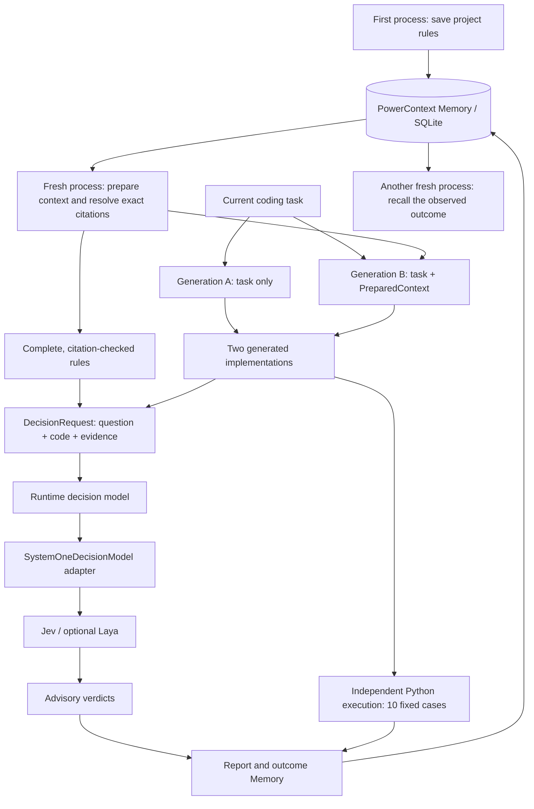

# PowerContext with Jev and Laya: project-aware coding decisions

PowerContext gives a model the project history it needs to make a useful decision. This example saves a team's coding rules, recalls them in a fresh process, and supplies that evidence to Jev through PowerContext's existing `DecisionModel` interface.

The integration has two parts: PowerContext retrieves the relevant context; a small adapter translates a `DecisionRequest` into Jev's System One protocol. Inject the adapter with `open_builtin_runtime(decision_model=...)`, then call the Runtime's decision model. The example needs no changes to PowerContext's core APIs or storage schema, and the code-generation model can be configured independently.

The runnable experiment makes this concrete. The same generation model writes an amount-conversion function twice, with and without recalled project rules. Jev, optionally alongside Laya, reviews both implementations against the recalled rules. Independent tests execute the generated code, and the observed results become Memory for the next session.

## Architecture

The example separates context, generation, advisory decisions, and verification:



| Component | Responsibility | Implementation |
| --- | --- | --- |
| PowerContext Runtime | Store project rules in a Scope, prepare bounded context, resolve exact Memory revisions, and expose the injected decision model | [worker.py](worker.py), [server.py](server.py) |
| Experiment API | Coordinate explicit steps, persist partial results, and resume an interrupted experiment | [server.py](server.py) |
| Generation client | Send two independent requests to the same Chat Completions model; add PreparedContext only to the second request | [generation.py](generation.py) |
| Decision adapter | Translate a provider-neutral request into System One `choice` input and validate the returned verdict and usage | [adapter.py](adapter.py) |
| Laya input preflight | Check the full decision input against the served checkpoint's tokenizer and sequence limits | [laya.py](laya.py) |
| Code verifier | Execute each generated function in a separate Python subprocess against the same fixed cases | [scenario.py](scenario.py) |

The local `/api/runs` endpoints belong to this example. They call the Python Runtime from the same checkout; they are not additions to the core PowerContext HTTP API. Each Memory operation opens a fresh Runtime in a separate process against the run's SQLite database.

### Why Jev is easy to connect

PowerContext's `DecisionModel` protocol requires a `policy_id` and one async operation:

```python
async def evaluate(self, request: DecisionRequest, /) -> DecisionResult:
    ...
```

The caller supplies a question, the subject being assessed, and its evidence. The caller receives a `yes`, `no`, or `abstain` result with provider attribution and usage metadata. Jev-specific request and response handling stays inside `SystemOneDecisionModel`:

1. Serialize `decision_kind`, `question`, `subject`, and `evidence` into the System One `state`, preserving the supplied text.
2. Send one `choice` question with explicit `yes`, `no`, and `abstain` criteria to the configured endpoint.
3. Validate the response and map it to `DecisionResult`.

This keeps the caller's context and decision flow independent of the provider protocol. Jev and Laya use the same adapter and request contract; Laya additionally needs a checkpoint-specific input budget. The adapters live in this example and can be used as a starting point for an application integration.

The following complete snippet shows the injection point. Run it from the repository root with the builtin dependencies installed and `JEV_ENDPOINT`, `JEV_MODEL`, and `JEV_API_KEY` set in your process environment. It makes one live decision request using explicit sample evidence; the experiment below adds persistent Memory retrieval.

```python
import asyncio
import os
from pathlib import Path

import httpx
from pydantic import SecretStr

from examples.systemone.adapter import SystemOneConfig, SystemOneDecisionModel
from powercontext.builtin.persistence.sqlite import SQLiteConfig
from powercontext.builtin.runtime import BuiltinConfig, DecisionRequest, open_builtin_runtime


async def main() -> None:
    directory = Path(".powercontext/systemone/integration").resolve()
    directory.mkdir(parents=True, exist_ok=True)
    config = BuiltinConfig(
        database=SQLiteConfig(url=f"sqlite+aiosqlite:///{directory / 'runtime.db'}")
    )
    provider = SystemOneConfig(
        provider="jev",
        endpoint=os.environ["JEV_ENDPOINT"],
        model=os.environ["JEV_MODEL"],
        api_key=SecretStr(os.environ["JEV_API_KEY"]),
    )

    async with httpx.AsyncClient() as client:
        backend = SystemOneDecisionModel(provider, client)
        async with open_builtin_runtime(
            config,
            decision_model=backend,
            scheduler_path=directory / "scheduler.db",
        ) as runtime:
            model = runtime.decision_model
            if model is None:
                raise RuntimeError("The injected decision model is unavailable")
            result = await model.evaluate(
                DecisionRequest(
                    decision_kind="example.coding-test-policy",
                    question="Should this project's regression test use pytest?",
                    subject="Add a regression test for the amount converter.",
                    evidence=("The team uses pytest for Python tests.",),
                )
            )
            print(result.outcome.value, result.used_fallback)


asyncio.run(main())
```

Keep the HTTP client alive for the Runtime's lifetime and call `runtime.decision_model.evaluate(...)`. Runtime injection adds the shared deadline and failure handling: backend errors become `abstain` with `used_fallback=true`, while caller cancellation propagates. Calling the adapter directly exposes its inference errors. A provider's deliberate abstention has `used_fallback=false`.

### How recalled context reaches Jev

Memory retrieval and decision evaluation are explicit application steps. Injecting a decision backend does not automatically retrieve or attach project history.

In this experiment, `worker.py` calls `runtime.context.for_scope(scope_id).prepare(...)`, then resolves each exact citation through `runtime.memory.for_scope(scope_id).get(...)`. It rejects truncated entries or text that differs from the persisted revision. The generation request receives the full PreparedContext. For review, `server.py` extracts the complete, verified Memory text into `DecisionRequest.evidence` and places the generated source in `DecisionRequest.subject`.

Both implementations are reviewed against the same project rules. The controlled input difference is between the two **generation** requests. Jev's review remains advisory; the independent tests establish the observed behavior, and `finish` records an outcome Memory entry for later recall.

## Run the experiment

### Prerequisites and configuration

Use Linux or macOS, Python 3.11+, `uv`, and a generation service that accepts OpenAI Chat Completions requests. Run all commands from the repository root.

Copy the configuration template and fill in your service settings. If the destination already exists, edit it instead of overwriting it:

```bash
cp examples/systemone/server.env.example examples/systemone/.env.systemone
```

| Setting | Purpose |
| --- | --- |
| `GENERATION_ENDPOINT` | Complete HTTP(S) Chat Completions URL, such as `https://your-provider.example/v1/chat/completions`; a host or `/v1` base URL is insufficient |
| `GENERATION_MODEL`, `GENERATION_API_KEY` | Model and credential for generating both implementations |
| `JEV_ENDPOINT`, `JEV_MODEL`, `JEV_API_KEY` | Optional Jev System One endpoint, model, and dedicated credential |
| `LAYA_ENDPOINT`, `LAYA_MODEL`, `LAYA_API_KEY` | Optional Laya endpoint, model, and service credential; an unauthenticated loopback service may use an empty key |
| `LAYA_CHECKPOINT` | Local checkpoint directory matching the model served by Laya |

The template uses `https://zenmux.ai/api/v1/systemone` and `typesafe/jev-latest` for Jev. Its Laya endpoint is `http://127.0.0.1:8891/v1/systemone`, with the `multilingual` model. Credentials are configured separately for each service; the generation credential is not reused for review.

Start the local API:

```bash
uv run --extra server \
  python -m examples.systemone.server \
  --env-file examples/systemone/.env.systemone \
  --data-dir .powercontext/systemone \
  --port 8765
```

For Laya, add `--with 'transformers>=4,<6'` after `uv run`. Jev-only runs do not need Transformers.

The service binds to `127.0.0.1`. It executes restricted generated amount-conversion functions; the executor is not a general Python sandbox and must not be deployed as a public code-execution service.

Check the local configuration:

```bash
curl --fail --silent --show-error http://127.0.0.1:8765/api/status
```

`configured` means the local settings are valid; it does not confirm remote connectivity. You can run the save and recall steps before configuring generation. Restart the API after changing configuration.

### Create a run and execute its steps

The scenario is invoice export. Implement `cents(text: str) -> int` to convert a monetary string to integer cents. The earlier session established `Decimal` with `ROUND_HALF_UP`, symmetric handling of negative refunds, and `ValueError` for invalid strings, `NaN`, and infinity. For example, `1.005` must produce `101`, and `-1.005` must produce `-101`. The scenario's task and saved policy use Chinese text.

In a second Bash terminal, create a run with Jev review enabled:

```bash
set -o pipefail
systemone_api=http://127.0.0.1:8765
systemone_run_id="$(
  curl --fail --silent --show-error \
    -H 'Content-Type: application/json' \
    -d '{"providers":["jev"]}' \
    "$systemone_api/api/runs" |
    python3 -c 'import json, sys; print(json.load(sys.stdin)["id"])'
)"
```

Use `{"providers":["jev","laya"]}` to compare both configured reviewers, or `{"providers":["laya"]}` for Laya alone. Use `{"providers":[]}` to run without review providers; the `review` step still needs to be called and records an empty result.

Execute the six steps in order. Each request waits for its step to finish:

```bash
set -o pipefail
for step in seed recall generate review verify finish; do
  curl --fail --silent --show-error -X POST \
    "$systemone_api/api/runs/$systemone_run_id/steps/$step" |
    python3 -c '
import json, sys
run = json.load(sys.stdin)
print(json.dumps({key: run[key] for key in ("id", "phase", "error")}, ensure_ascii=False))
sys.exit(1 if run["error"] else 0)
' || break
done
```

| Step | Action | Recorded evidence |
| --- | --- | --- |
| `seed` | Save the confirmed billing rules in SQLite Memory from an independent process | PID, Scope, Memory revision |
| `recall` | Start a fresh process, prepare context, and read back exact citations | PID, complete PreparedContext, byte count, citations, Scope isolation comparison |
| `generate` | Call the same model twice: task only, then task plus recalled context | Actual source, full requests, elapsed time, returned token usage |
| `review` | Ask each enabled Jev/Laya provider to assess both implementations against the recalled rules | Verdict, confidence, fallback flag, policy ID, usage, elapsed time |
| `verify` | Run each generated `amount.py` in a separate Python subprocess against 10 fixed cases | Input, expected value, actual value or error, pass count |
| `finish` | Save the observed result as Memory and recall it in another fresh process | New revision, outcome summary, recalled content, citations |

A successful run has `phase: "completed"`. Step failures can return HTTP 200 with a nonempty `error`; inspect both fields. HTTP 409 means a preceding step is incomplete or another step is running.

Read the full result or download its report:

```bash
curl --fail --silent --show-error \
  "$systemone_api/api/runs/$systemone_run_id" |
  python3 -m json.tool --no-ensure-ascii

curl --fail --silent --show-error \
  "$systemone_api/api/runs/$systemone_run_id/report" \
  -o ".powercontext/systemone/experiment-$systemone_run_id.json"
```

### Optional Laya setup

The example connects to an existing Laya service. It does not download weights or start inference. The configured checkpoint must contain:

```text
checkpoint/
├── rl_agent_config.json
└── tokenizer/
    ├── tokenizer_config.json
    └── ...
```

The tokenizer, `max_len`, and `head_max_len` must match the served checkpoint. Before sending a decision, the client checks the question head, choices, full sequence, and mask-token handling. It rejects input that would be truncated instead of shortening the rules or code. Remote review endpoints require HTTPS; loopback Laya may use HTTP. Prefer HTTPS for external generation services too.

## Read the evidence

The two generation requests use the same model, system prompt, task, and parameters. Only the second receives PreparedContext, and the requests share no conversation history. Fixed verification cases are never sent to the generator. The report retains both complete generation requests so this difference can be inspected.

A separate Analytics Scope stores a conflicting `ROUND_HALF_EVEN` rule. Neither Scope has `context_references` to the other. Recall prepares context and resolves citations separately in each Scope. Both projects should retrieve their own Memory; isolation does not mean the other project must return nothing. An `artifact_id` may be identical across Scopes, so include `scope_id` when comparing identities.

A fallback verdict is not a successful model answer. Timeouts, provider failures, invalid responses, or Laya input-budget rejection can produce `used_fallback=true`. Confidence is provider metadata, not proof of correctness. Review does not repair the code: verification executes the actual generated source.

Tests cover rounding boundaries, negative refunds, ordinary amounts, and invalid input. Unsupported syntax, execution timeouts, and exceptions are recorded as failures. Neither implementation is guaranteed to win; both may pass or fail. A single run demonstrates this workflow and its observed results, not general model accuracy or long-term benefit.

## Persistence, retries, and cleanup

Each run lives under `--data-dir/<run-id>/`. Its `run.json` retains full generation requests, PreparedContext, exact citations, generated source, reviews, verification, and continuation evidence. Verification saves the source as `without_memory/amount.py` and `with_memory/amount.py`. Reports contain model inputs and outputs but omit authentication headers and API keys.

`GET /api/status` lists recent runs. Given a run ID, `GET /api/runs/<id>` reads its state, and the step endpoints continue it. Restart with the same data directory to recover existing runs.

A complete run makes two generation requests and two decisions per enabled reviewer. Providers may charge for these calls. Usage fields preserve returned token counts; absent token usage remains unknown.

Generation, review, and verification save each group's result when it completes. Retrying a failed step reuses saved groups. A fallback decision is also saved as completed and is not automatically retried. If the service stops before saving a response, the provider may already have processed and billed the request; retrying can repeat that call. After fixing credentials or connectivity, restart the API and resume. Create a new run when changing the generation model.

After stopping the service, remove the selected run directory to delete its databases, source, and run record. Delete any downloaded `experiment-<run-id>.json` reports separately. Remove the whole data directory only when none of its runs are needed. `.powercontext/` and local `.env.systemone` files are ignored by Git.

## Check a single decision

Use the standalone CLI to diagnose Jev/Laya connectivity without running the full experiment. It reads `SYSTEMONE_*` variables, independently of the API server's `GENERATION_*`, `JEV_*`, and `LAYA_*` settings.

If `.env_jev` does not already exist:

```bash
cp examples/systemone/jev.env.example examples/systemone/.env_jev
```

Fill in its credential, then load the file and run:

```bash
set -a
source examples/systemone/.env_jev
set +a
uv run --extra builtin python -m examples.systemone.decision \
  --data-dir .powercontext/systemone/decision \
  --question "Should this project's regression test use pytest?" \
  --subject "Add a regression test for the amount converter." \
  --evidence "The team uses pytest for Python tests."
```

For Laya, use the `SYSTEMONE_*` settings in [laya.env.example](laya.env.example), point them at your actual service, and add `--with 'transformers>=4,<6'` to `uv run` plus `--checkpoint /absolute/path/to/served-checkpoint` to the Python command. The CLI outputs one decision as JSON and exits nonzero on fallback. Its complete integration code is in [decision.py](decision.py). Local `.env_jev` is ignored by Git.

## Local validation

```bash
uv run python -m pytest -q tests/examples/systemone tests/e2e/test_systemone_example.py
```

These tests exercise the local API through ASGITransport, real SQLite Memory operations in separate processes, and generated-code execution in subprocesses. External model responses are simulated. Use live provider configuration and the API experiment or decision CLI to validate real connectivity, generation quality, and review behavior.
